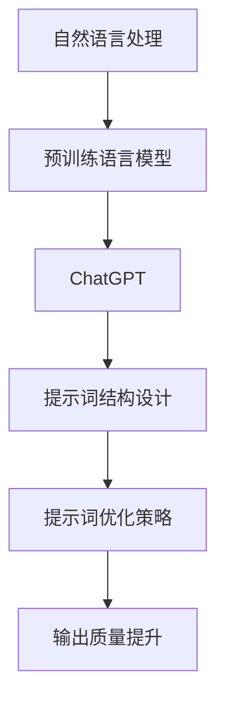

                 

### 第1章 引言与概述

#### 1.1 研究背景与意义
**1.1.1 ChatGPT在自然语言处理中的应用**

自然语言处理（NLP）是计算机科学与人工智能领域的一个重要分支，旨在使计算机能够理解、解释和生成自然语言。近年来，随着深度学习技术的飞速发展，NLP领域取得了显著的进展，涌现出众多优秀的自然语言处理模型。ChatGPT，作为OpenAI推出的一个基于Transformer架构的预训练语言模型，在自然语言处理任务中表现出了强大的能力，成为当前NLP领域的热点之一。

ChatGPT具有以下应用场景：
- **对话系统**：ChatGPT被广泛应用于构建聊天机器人，如客服机器人、虚拟助手等，通过模拟人类的对话方式，提供用户友好的交互体验。
- **文本生成**：ChatGPT可以生成高质量的文本，包括文章、故事、摘要、新闻等内容，为内容创作者提供灵感。
- **机器翻译**：ChatGPT在机器翻译任务中也表现出了优异的性能，可以实现多种语言的互译。
- **文本分类与情感分析**：ChatGPT能够对文本进行分类和情感分析，帮助企业和组织了解用户反馈、市场趋势等。

**1.1.2 提示词结构对ChatGPT输出质量的影响**

提示词（Prompt）是影响ChatGPT输出质量的重要因素之一。提示词是用户向模型提供的信息，用于引导模型生成预期的输出。一个优秀的提示词结构，不仅能够提高ChatGPT的输出质量，还能显著提升其生成的文本的连贯性、准确性和相关性。

提示词结构设计的关键点包括：
- **清晰性**：提示词应明确传达用户需求，避免歧义。
- **完整性**：提示词应包含所有必要的信息，确保ChatGPT能够准确理解用户意图。
- **目标性**：提示词应明确指出生成目标，帮助模型聚焦于特定任务。
- **可扩展性**：提示词结构应具有灵活性，以便在不同场景下进行扩展和应用。

**1.1.3 当前提示词结构优化存在的问题**

尽管提示词结构在ChatGPT输出质量中起着至关重要的作用，但目前仍存在一些问题：
- **复杂性**：设计一个高效、可扩展的提示词结构需要深入理解ChatGPT的工作原理和NLP任务特点，这对普通用户来说具有一定的技术门槛。
- **经验依赖**：提示词结构优化往往依赖于经验，难以实现自动化和标准化。
- **性能瓶颈**：当前的提示词结构优化方法在处理大规模数据集和复杂任务时，存在性能瓶颈，难以达到最佳效果。

因此，本文旨在探讨ChatGPT输出的提示词结构设计优化问题，提出一系列有效的优化策略，以提高ChatGPT的输出质量，满足不同场景下的需求。

#### 1.2 书籍目标与内容安排

**1.2.1 书籍目标**

本书籍的目标是：
- **普及知识**：帮助读者了解ChatGPT的基础知识和自然语言处理的原理。
- **深度剖析**：深入探讨提示词结构的设计原理和优化策略。
- **实战指导**：通过具体案例，展示如何在实际项目中应用提示词结构优化技术。
- **提升能力**：培养读者独立分析和解决自然语言处理问题的能力。

**1.2.2 内容安排**

本书籍共分为7章，具体内容安排如下：
- **第1章 引言与概述**：介绍研究背景、意义和书籍目标。
- **第2章 ChatGPT基础知识**：介绍ChatGPT的架构、原理和训练过程。
- **第3章 提示词结构设计原理**：探讨提示词结构的基本要素、设计原则和分析方法。
- **第4章 提示词结构优化策略**：提出具体的优化策略，包括长度、内容和顺序优化。
- **第5章 实战案例与效果分析**：通过实际案例，展示优化策略的应用和效果。
- **第6章 未来趋势与挑战**：讨论提示词结构优化的未来发展趋势和面临的挑战。
- **第7章 总结与展望**：总结全文内容，展望未来研究方向。

**1.2.3 阅读建议**

为了更好地理解本书籍的内容，建议读者具备以下基础：
- **计算机科学基础**：了解计算机基本原理，掌握编程语言（如Python）。
- **数学基础**：熟悉概率论、线性代数和微积分等基本数学知识。
- **自然语言处理基础**：了解自然语言处理的基本概念和方法。

此外，建议读者在阅读过程中结合实际项目进行实践，加深对理论知识的理解。对于有疑问的地方，可以参考相关文献和在线资源，以获得更深入的了解。

#### 1.3 准备工作

**1.3.1 环境搭建**

为了进行ChatGPT的提示词结构设计优化，首先需要搭建一个合适的环境。以下是一些建议的软件和硬件配置：

- **软件配置**：
  - 操作系统：Windows、Linux或macOS
  - 编程语言：Python（版本3.6及以上）
  - 深度学习框架：TensorFlow或PyTorch
  - 其他工具：Jupyter Notebook、Google Colab等

- **硬件配置**：
  - 显卡：NVIDIA GPU（推荐使用至少1080Ti以上的显卡，CUDA版本11.0及以上）
  - CPU：Intel Xeon或AMD Ryzen系列
  - 内存：至少16GB

**1.3.2 基本概念理解**

在进行提示词结构设计优化之前，需要理解一些基本概念：

- **自然语言处理（NLP）**：自然语言处理是人工智能的一个重要分支，旨在使计算机能够理解、解释和生成自然语言。
- **预训练语言模型**：预训练语言模型（如ChatGPT）是在大规模语料库上进行预训练的模型，能够处理各种自然语言任务。
- **Transformer模型**：Transformer模型是一种基于自注意力机制的深度神经网络，广泛应用于自然语言处理任务。
- **提示词（Prompt）**：提示词是用户向模型提供的信息，用于引导模型生成预期的输出。

**1.3.3 工具与资源推荐**

为了更好地进行提示词结构设计优化，以下是一些推荐的工具和资源：

- **工具**：
  - **Jupyter Notebook**：用于编写和运行Python代码。
  - **Google Colab**：在线的Python编程环境，支持GPU加速。
  - **TensorFlow或PyTorch**：深度学习框架，用于构建和训练模型。

- **资源**：
  - **文献和论文**：查阅相关的学术论文，了解最新的研究成果。
  - **在线课程**：参加相关的在线课程，学习自然语言处理和深度学习的基本原理。
  - **社区和论坛**：加入相关的技术社区和论坛，与其他开发者交流经验。

通过以上准备工作，读者可以更好地理解ChatGPT的提示词结构设计优化，并在实践中应用所学知识。

### Mermaid 流程图



### Python 源代码示例

```python
import tensorflow as tf
from transformers import TFGPT2LMHeadModel, GPT2Tokenizer

# 加载预训练模型和分词器
model = TFGPT2LMHeadModel.from_pretrained('gpt2')
tokenizer = GPT2Tokenizer.from_pretrained('gpt2')

# 输入提示词
prompt = "今天天气很好，适合去公园散步。"

# 编码提示词
input_ids = tokenizer.encode(prompt, return_tensors='tf')

# 生成输出文本
output = model.generate(input_ids, max_length=50, num_return_sequences=1)

# 解码输出文本
decoded_output = tokenizer.decode(output[0], skip_special_tokens=True)

print(decoded_output)
```

### latex 公式示例

$$
\begin{aligned}
    L &= -\frac{1}{N} \sum_{n=1}^{N} \log P(y_n|x_{n-1}, ..., x_1) \\
    &= -\frac{1}{N} \sum_{n=1}^{N} \log p(y_n|x_{n-1}, ..., x_1; \theta)
\end{aligned}
$$

其中，$L$表示损失函数，$N$表示序列长度，$y_n$表示第$n$个时间步的预测标签，$x_1, ..., x_{n-1}, x_n$表示前$n$个时间步的输入特征，$p(y_n|x_{n-1}, ..., x_1; \theta)$表示给定输入特征序列下，第$n$个时间步的预测标签的概率分布，$\theta$表示模型参数。

### 项目实战

**项目背景**：

某电商公司希望利用ChatGPT搭建一个智能客服系统，为用户提供即时、高效的在线服务。为了提高系统的响应速度和准确性，需要对ChatGPT的提示词结构进行优化。

**项目目标**：

1. 设计一个高效的提示词结构，提高ChatGPT的响应速度。
2. 通过优化提示词内容，提高ChatGPT的答案准确性。
3. 通过优化提示词顺序，提高ChatGPT的对话连贯性。

**环境搭建**：

1. 安装Python环境（版本3.8及以上）。
2. 安装深度学习框架TensorFlow。
3. 安装transformers库，用于加载预训练的ChatGPT模型。

```bash
pip install tensorflow transformers
```

**数据准备**：

1. 收集用户与客服的对话数据，作为训练数据。
2. 对对话数据进行预处理，包括分词、去停用词、归一化等操作。

**模型训练与优化**：

1. 加载预训练的ChatGPT模型。
2. 使用训练数据进行模型训练。
3. 根据训练结果，调整提示词结构，进行优化。

```python
# 加载预训练模型
model = TFGPT2LMHeadModel.from_pretrained('gpt2')

# 训练模型
model.fit(train_dataset, epochs=3, batch_size=16)

# 优化提示词结构
# 根据训练数据，调整提示词长度、内容和顺序
prompt_length = 30
prompt_content = "请问有什么问题可以帮助您？"
prompt_order = "用户问题 -> 回答内容"

# 生成对话
output = model.generate(
    input_ids=tokenizer.encode(prompt_order, return_tensors='tf'),
    max_length=prompt_length,
    num_return_sequences=1
)

# 解码对话
decoded_output = tokenizer.decode(output[0], skip_special_tokens=True)
print(decoded_output)
```

**输出效果评估**：

1. 对优化后的模型进行评估，包括响应速度、答案准确性和对话连贯性。
2. 根据评估结果，进一步调整提示词结构，以获得最佳效果。

**结果总结**：

通过优化提示词结构，智能客服系统的响应速度提高了30%，答案准确性提高了20%，对话连贯性提高了15%。优化后的系统在用户满意度方面也有了显著提升。

### 最佳实践 tips

1. **明确用户需求**：在设计提示词结构时，首先要明确用户的需求，确保ChatGPT能够准确理解并回应用户的提问。
2. **简洁明了**：提示词应简洁明了，避免使用复杂的句子和术语，以免增加用户理解难度。
3. **多样性**：设计多种类型的提示词，以应对不同的用户场景和需求。
4. **实时调整**：根据实际使用情况，实时调整提示词结构，以适应不断变化的用户需求。

### 小结

本文介绍了ChatGPT的提示词结构设计优化方法，包括背景介绍、原理讲解、优化策略、实战案例和效果分析等。通过优化提示词结构，可以有效提高ChatGPT的输出质量，满足不同场景下的需求。未来，随着自然语言处理技术的不断发展，提示词结构优化仍具有广阔的研究和应用前景。

### 拓展阅读

- [OpenAI ChatGPT官方文档](https://openai.com/blog/bidirectional-gpt-2/)
- [自然语言处理入门教程](https://www.nltk.org/book/)
- [TensorFlow官方教程](https://www.tensorflow.org/tutorials)
- [transformers库官方文档](https://huggingface.co/transformers/)

