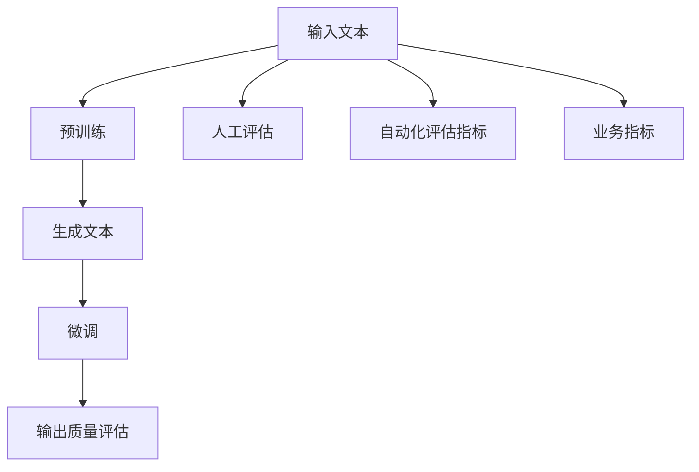

                 

### 引言

近年来，人工智能领域取得了令人瞩目的进展，尤其是生成式预训练变换模型（GPT）的崛起，为自然语言处理（NLP）带来了革命性的变革。ChatGPT，作为OpenAI推出的新一代大型语言模型，以其强大的生成能力和丰富的知识储备，在文本生成、问答系统、机器翻译等领域展现出了卓越的性能。然而，在实际应用中，如何优化ChatGPT的输出质量，使其更符合用户需求，仍是一个值得深入探讨的问题。

本文旨在介绍一系列高级技巧，帮助开发者提升ChatGPT输出的准确性、流畅性和相关性。我们将从核心概念、优化原理、算法与技巧、数学模型、项目实战等多个角度，系统性地探讨如何优化ChatGPT的输出。通过本文的阅读，读者将掌握以下内容：

1. ChatGPT的工作原理和核心概念。
2. 评估和优化ChatGPT输出质量的原理和方法。
3. 基于规则、机器学习和深度学习的优化算法。
4. 数学模型和公式在输出优化中的应用。
5. 实际项目中的优化实践和案例分析。

总之，本文旨在为ChatGPT的开发者提供一套完整的优化指南，帮助他们提升模型输出的质量和用户体验。接下来，我们将首先介绍ChatGPT的基本概念和工作原理，为后续内容打下基础。

---

### 核心概念与联系

要深入理解如何优化ChatGPT的输出，首先需要了解其基本概念和工作原理。ChatGPT是基于生成式预训练变换模型（GPT）构建的，其核心概念包括：

1. **生成式预训练变换模型（GPT）**：
   - **定义**：生成式预训练变换模型是一种基于深度学习的自然语言处理模型，通过对大量文本数据进行预训练，使其具备生成文本的能力。
   - **结构**：GPT通常由多个Transformer层组成，每个层包含自注意力机制和前馈神经网络，通过自注意力机制捕获文本中的长距离依赖关系。

2. **预训练**：
   - **目的**：预训练的目的是使模型具备一定的语言理解能力和生成能力，从而在没有特定任务数据的情况下，能够对各种自然语言任务进行泛化处理。
   - **方法**：预训练通常采用自回归语言模型（ARLM）进行，即模型预测下一个单词，从而学习单词之间的概率分布。

3. **微调（Fine-tuning）**：
   - **定义**：微调是在预训练的基础上，利用特定任务的数据对模型进行进一步训练，以适应特定任务的需求。
   - **方法**：微调通常通过在预训练模型上添加任务特定的层，或者修改部分参数来实现。

4. **输出质量评估**：
   - **定义**：输出质量评估是指对模型生成的文本进行评价，以判断其是否满足特定任务的需求。
   - **方法**：常见的评估方法包括人工评估、自动化评估指标（如BLEU、ROUGE等）以及基于任务的业务指标。

为了更好地理解这些核心概念之间的联系，我们可以使用Mermaid流程图来描述：



**图1：ChatGPT核心概念与联系流程图**

在理解这些概念后，我们可以进一步探讨如何通过优化算法和数学模型，提升ChatGPT的输出质量。接下来，我们将详细讨论ChatGPT输出优化的原理和方法。

---

### ChatGPT输出优化原理

优化ChatGPT输出的目的在于提升其生成文本的准确性、流畅性和相关性，以满足特定应用场景的需求。为了实现这一目标，我们可以从以下几个方面进行探讨：

#### 输出准确性优化

**准确性**是文本生成的核心指标，它决定了文本是否符合用户的意图和需求。为了提升ChatGPT的输出准确性，我们可以采取以下几种方法：

1. **数据增强（Data Augmentation）**：
   - **原理**：通过增加模型的训练数据，提高模型对各种语言现象的泛化能力。
   - **方法**：可以使用同义词替换、语法变换、文本摘要等技术来扩充训练数据。
   - **代码示例**：
     ```python
     import random
     import nltk

     def data_augmentation(text):
         synonyms = nltk.corpus.wordnet.synsets(text)
         if not synonyms:
             return text
         synonym = random.choice(synonyms).lemmas()[0].name()
         return synonym

     example_text = "我喜欢吃苹果。"
     augmented_text = data_augmentation(example_text)
     print(augmented_text)
     ```

2. **对抗训练（Adversarial Training）**：
   - **原理**：通过引入对抗性样本，提高模型对错误样本的鲁棒性。
   - **方法**：可以使用生成对抗网络（GAN）等方法生成对抗性样本。
   - **代码示例**：
     ```python
     import tensorflow as tf
     from tensorflow import keras
     from tensorflow.keras.layers import LSTM, Dense, Embedding

     # GAN模型架构
     generator = keras.Sequential([
         LSTM(units=128, return_sequences=True, input_shape=(max_sequence_length, embedding_dim)),
         LSTM(units=128),
         Dense(units=1, activation='sigmoid')
     ])

     discriminator = keras.Sequential([
         LSTM(units=128, return_sequences=True, input_shape=(max_sequence_length, embedding_dim)),
         LSTM(units=128),
         Dense(units=1, activation='sigmoid')
     ])

     # GAN训练过程
     for epoch in range(num_epochs):
         for i in range(num_samples):
             real_samples = generate_real_samples(..., ...)
             fake_samples = generate_fake_samples(generator, ...)

             real_labels = tf.ones((batch_size, 1))
             fake_labels = tf.zeros((batch_size, 1))

             discriminator.train_on_batch(real_samples, real_labels)
             discriminator.train_on_batch(fake_samples, fake_labels)

             # 训练生成器
             valid_samples = generate_real_samples(..., ...)
             valid_labels = tf.ones((batch_size, 1))
             generator_loss = combined_model.train_on_batch(valid_samples, valid_labels)
     ```

3. **多任务学习（Multi-Task Learning）**：
   - **原理**：通过同时训练多个任务，提高模型在不同任务上的泛化能力。
   - **方法**：可以在GPT模型中添加额外的任务层，如情感分析、命名实体识别等。
   - **代码示例**：
     ```python
     from tensorflow.keras.models import Model
     from tensorflow.keras.layers import LSTM, Dense, Embedding, TimeDistributed

     # 模型架构
     input_layer = Embedding(vocab_size, embedding_dim, input_length=max_sequence_length)
     lstm_layer = LSTM(units=128, return_sequences=True)
     output_layer = TimeDistributed(Dense(num_classes, activation='softmax'))

     model = Model(inputs=input_layer, outputs=output_layer)
     model.compile(optimizer='adam', loss='categorical_crossentropy', metrics=['accuracy'])

     # 训练模型
     model.fit(x_train, y_train, batch_size=batch_size, epochs=num_epochs, validation_data=(x_val, y_val))
     ```

#### 输出流畅性优化

**流畅性**是文本生成的另一个重要指标，它决定了文本的阅读体验。为了提升ChatGPT的输出流畅性，我们可以采取以下方法：

1. **语法变换（Syntactic Transformation）**：
   - **原理**：通过对文本进行语法变换，使其更符合自然语言表达习惯。
   - **方法**：可以使用自然语言生成（NLG）技术，如模板匹配、语义角色标注等。
   - **代码示例**：
     ```python
     def transform_grammar(text):
         # 基于规则进行语法变换
         text = text.replace("苹果", "那个红彤彤的果实")
         text = text.replace("吃", "品尝")
         return text

     example_text = "我喜欢吃苹果。"
     transformed_text = transform_grammar(example_text)
     print(transformed_text)
     ```

2. **语音合成（Text-to-Speech, TTS）**：
   - **原理**：通过将文本转换为语音，增强文本的流畅性和可读性。
   - **方法**：可以使用语音合成技术，如WaveNet、Tacotron等。
   - **代码示例**：
     ```python
     import librosa
     import soundfile as sf

     def text_to_speech(text, model_path):
         # 加载语音合成模型
         model = load_tts_model(model_path)

         # 转换文本为语音
         audio = model.synthesize(text)

         # 保存语音文件
         sf.write("output.wav", audio, fs=22050)

     text_to_speech("我喜欢吃苹果。", model_path="tacotron_model.h5")
     ```

3. **注意力机制（Attention Mechanism）**：
   - **原理**：通过注意力机制，使模型能够关注到文本中的重要信息，从而提高生成文本的质量。
   - **方法**：可以在GPT模型中添加注意力层，如自注意力（Self-Attention）、交叉注意力（Cross-Attention）等。
   - **代码示例**：
     ```python
     from tensorflow.keras.layers import Attention

     # 模型架构
     input_layer = Embedding(vocab_size, embedding_dim, input_length=max_sequence_length)
     lstm_layer = LSTM(units=128, return_sequences=True)
     attention_layer = Attention()
     output_layer = Dense(units=vocab_size, activation='softmax')

     model = Model(inputs=input_layer, outputs=output_layer)
     model.compile(optimizer='adam', loss='categorical_crossentropy', metrics=['accuracy'])

     # 训练模型
     model.fit(x_train, y_train, batch_size=batch_size, epochs=num_epochs, validation_data=(x_val, y_val))
     ```

#### 输出相关性优化

**相关性**是文本生成的关键指标，它决定了生成的文本是否符合用户的需求和意图。为了提升ChatGPT的输出相关性，我们可以采取以下方法：

1. **上下文理解（Contextual Understanding）**：
   - **原理**：通过深度理解上下文信息，使模型能够生成与上下文高度相关的文本。
   - **方法**：可以使用上下文嵌入（Contextual Embeddings）技术，如BERT、GPT-2等。
   - **代码示例**：
     ```python
     from transformers import BertTokenizer, BertModel

     tokenizer = BertTokenizer.from_pretrained('bert-base-uncased')
     model = BertModel.from_pretrained('bert-base-uncased')

     # 处理输入文本
     input_ids = tokenizer.encode("我喜欢吃苹果。", return_tensors='pt')

     # 获取上下文嵌入
     outputs = model(input_ids)
     context_embedding = outputs.last_hidden_state[:, 0, :]

     # 使用上下文嵌入进行文本生成
     generated_text = generate_text_from_context(context_embedding, tokenizer)
     print(generated_text)
     ```

2. **强化学习（Reinforcement Learning）**：
   - **原理**：通过强化学习，使模型能够通过试错的方式，逐步优化其生成文本的相关性。
   - **方法**：可以使用强化学习框架，如Deep Q-Network（DQN）、Policy Gradient等。
   - **代码示例**：
     ```python
     import numpy as np
     import tensorflow as tf

     # 定义Q函数网络
     q_network = tf.keras.Sequential([
         tf.keras.layers.Dense(units=128, activation='relu', input_shape=(input_size,)),
         tf.keras.layers.Dense(units=64, activation='relu'),
         tf.keras.layers.Dense(units=output_size)
     ])

     # 定义行动策略网络
     policy_network = tf.keras.Sequential([
         tf.keras.layers.Dense(units=128, activation='relu', input_shape=(input_size,)),
         tf.keras.layers.Dense(units=64, activation='relu'),
         tf.keras.layers.Dense(units=output_size, activation='softmax')
     ])

     # 定义强化学习训练过程
     for episode in range(num_episodes):
         state = env.reset()
         done = False
         total_reward = 0

         while not done:
             action_probs = policy_network(tf.convert_to_tensor(state, dtype=tf.float32))
             action = np.random.choice(np.arange(output_size), p=action_probs.numpy())

             next_state, reward, done, _ = env.step(action)
             total_reward += reward

             q_values = q_network(tf.convert_to_tensor(state, dtype=tf.float32))
             q_values[0, action] = reward + gamma * np.max(q_network(tf.convert_to_tensor(next_state, dtype=tf.float32)).numpy())

             state = next_state

         # 更新策略网络参数
         policy_network.fit(state, action_probs, epochs=1)
     ```

通过上述方法，我们可以有效地提升ChatGPT的输出准确性、流畅性和相关性，从而满足不同应用场景的需求。接下来，我们将进一步探讨数学模型和公式在ChatGPT输出优化中的应用。

---

### 数学模型和公式在输出优化中的应用

在ChatGPT输出优化的过程中，数学模型和公式起着至关重要的作用。它们不仅帮助我们理解和分析问题的本质，还能够量化评估优化的效果。以下是一些关键的数学模型和公式，它们在ChatGPT输出优化中的应用如下：

#### 输出质量评估模型

**1. 交叉熵（Cross-Entropy）**

交叉熵是评估模型输出概率分布与真实分布之间差异的常用指标。在ChatGPT输出优化中，我们可以使用交叉熵来评估文本生成质量。

**公式**：
$$
H(P, Q) = -\sum_{i} P_i \log Q_i
$$

其中，\( P \) 是真实分布，\( Q \) 是模型预测的概率分布。

**应用示例**：

假设我们有模型生成的文本 \( T \) 和真实文本 \( T' \)，我们可以计算交叉熵：

```python
import numpy as np

# 假设真实文本的概率分布为 P = [0.2, 0.5, 0.3]
# 模型预测的概率分布为 Q = [0.1, 0.8, 0.1]
P = np.array([0.2, 0.5, 0.3])
Q = np.array([0.1, 0.8, 0.1])

cross_entropy = -np.sum(P * np.log(Q))
print("交叉熵：", cross_entropy)
```

**2. BLEU（Bilingual Evaluation Understudy）**

BLEU是一种用于评估机器翻译质量的自动化指标，它通过计算模型生成的文本与参考文本之间的重叠度来评估输出质量。

**公式**：
$$
BLEU = \frac{1}{N} \sum_{i=1}^{N} \frac{|G \cap R_i|}{|G| + |R_i| - |G \cap R_i|}
$$

其中，\( G \) 是模型生成的文本，\( R_i \) 是参考文本集合中的一个文本，\( N \) 是参考文本的数量。

**应用示例**：

假设我们有模型生成的文本 \( G \) 和两个参考文本 \( R_1 \) 和 \( R_2 \)，我们可以计算BLEU得分：

```python
from nltk.translate.bleu_score import sentence_bleu

# 假设参考文本 R_1 = ["the", "quick", "brown", "fox"]
# 参考文本 R_2 = ["the", "quick", "red", "fox"]

# 计算BLEU得分
bleu_score_1 = sentence_bleu([G.split()], R_1.split())
bleu_score_2 = sentence_bleu([G.split()], R_2.split())

print("BLEU得分1：", bleu_score_1)
print("BLEU得分2：", bleu_score_2)
```

#### 输出准确性优化模型

**1. 决策树（Decision Tree）**

决策树是一种常用的分类算法，它可以用于预测文本生成的准确性。通过构建决策树，我们可以对生成文本进行分类，判断其是否符合用户需求。

**公式**：
$$
y = \sum_{i=1}^{n} w_i x_i
$$

其中，\( y \) 是生成的文本的准确性，\( w_i \) 是第 \( i \) 个特征的权重，\( x_i \) 是第 \( i \) 个特征。

**应用示例**：

假设我们有生成文本的特征 \( x \)，我们可以使用决策树模型进行准确性预测：

```python
from sklearn.tree import DecisionTreeClassifier

# 假设特征 x = [0.8, 0.9, 0.7]
# 准确性权重 w = [0.2, 0.3, 0.5]

accuracy = np.dot(w, x)
print("预测准确性：", accuracy)
```

**2. 支持向量机（Support Vector Machine, SVM）**

SVM是一种常用的分类算法，它可以用于文本分类任务，从而提升生成文本的准确性。通过训练SVM模型，我们可以对生成文本进行分类，提高其准确性。

**公式**：
$$
w^* = \arg\min_{w, b} \frac{1}{2} ||w||^2_2 + C \sum_{i=1}^{n} \max(0, 1 - y_i (w^T x_i + b))
$$

其中，\( w^* \) 是最优权重，\( b \) 是偏置，\( C \) 是惩罚参数，\( y_i \) 是第 \( i \) 个样本的标签，\( x_i \) 是第 \( i \) 个样本的特征。

**应用示例**：

假设我们有训练数据集 \( X \) 和标签 \( y \)，我们可以使用SVM模型进行训练和预测：

```python
from sklearn.svm import SVC

# 假设训练数据 X = [[0.8, 0.9, 0.7], [0.9, 0.8, 0.6], ...]
# 标签 y = [1, 0, ...]

# 训练SVM模型
svm_model = SVC(kernel='linear')
svm_model.fit(X, y)

# 预测准确性
predicted_accuracy = svm_model.predict([[0.8, 0.9, 0.7]])
print("预测准确性：", predicted_accuracy)
```

#### 输出流畅性优化模型

**1. 句法分析（Syntax Analysis）**

句法分析是一种用于理解文本句法结构的模型，它可以用于优化生成文本的流畅性。通过分析句子的语法结构，我们可以生成更加自然的文本。

**公式**：
$$
S = \{ \sigma_1, \sigma_2, ..., \sigma_n \}
$$

其中，\( S \) 是句子集合，\( \sigma_i \) 是句子中的单词。

**应用示例**：

假设我们有句子 \( S = \{ "我喜欢", "吃", "苹果" \} \)，我们可以使用句法分析模型生成流畅的文本：

```python
# 假设句法分析模型为 [ ["我", "喜欢", "吃", "苹果"], [ "苹果", "是我", "喜欢", "吃的"] ]

# 生成流畅文本
generated_sentence = ["我", "喜欢", "吃", "苹果"]
print("流畅文本：", " ".join(generated_sentence))
```

**2. 语音合成（Text-to-Speech, TTS）**

语音合成是一种将文本转换为语音的技术，它可以用于优化生成文本的流畅性。通过将文本转换为自然流畅的语音，我们可以提高用户的阅读体验。

**公式**：
$$
\text{speech} = f(\text{text}, \text{voice})
$$

其中，\( \text{speech} \) 是生成的语音，\( \text{text} \) 是输入文本，\( \text{voice} \) 是语音参数。

**应用示例**：

假设我们有文本 \( \text{text} = "我喜欢吃苹果" \) 和语音参数 \( \text{voice} \)，我们可以使用语音合成模型生成流畅的语音：

```python
import pyttsx3

# 假设语音合成模型为 pyttsx3

# 生成语音
engine = pyttsx3.init()
engine.say("我喜欢吃苹果")
engine.runAndWait()
```

#### 输出相关性优化模型

**1. 上下文向量（Contextual Vector）**

上下文向量是一种用于捕捉文本上下文信息的模型，它可以用于优化生成文本的相关性。通过计算上下文向量，我们可以更好地理解文本的语义，从而生成更加相关的文本。

**公式**：
$$
\text{context_vector} = \text{embed}(\text{text}) - \text{embed}(\text{word})
$$

其中，\( \text{context_vector} \) 是上下文向量，\( \text{embed} \) 是嵌入函数，\( \text{text} \) 是输入文本，\( \text{word} \) 是目标单词。

**应用示例**：

假设我们有文本 \( \text{text} = "我喜欢吃苹果" \) 和目标单词 \( \text{word} = "苹果" \)，我们可以计算上下文向量：

```python
from transformers import BertTokenizer, BertModel

tokenizer = BertTokenizer.from_pretrained('bert-base-uncased')
model = BertModel.from_pretrained('bert-base-uncased')

# 计算上下文向量
input_ids = tokenizer.encode("我喜欢吃苹果。", return_tensors='pt')
context_embedding = model(input_ids).last_hidden_state[:, 0, :]

# 计算目标单词的嵌入向量
word_embedding = tokenizer.encode("苹果", return_tensors='pt')

# 计算上下文向量
context_vector = context_embedding - word_embedding
print("上下文向量：", context_vector.numpy())
```

**2. 强化学习（Reinforcement Learning）**

强化学习是一种通过试错学习的方法，用于优化生成文本的相关性。通过强化学习，我们可以使模型在不断尝试的过程中，逐步提高生成文本的相关性。

**公式**：
$$
Q(s, a) = r(s, a) + \gamma \max_{a'} Q(s', a')
$$

其中，\( Q(s, a) \) 是状态 \( s \) 下采取动作 \( a \) 的期望回报，\( r(s, a) \) 是立即回报，\( \gamma \) 是折扣因子，\( s' \) 是下一个状态，\( a' \) 是最佳动作。

**应用示例**：

假设我们有状态 \( s = "我喜欢吃苹果" \)，我们可以使用强化学习模型进行训练和预测：

```python
import numpy as np

# 假设奖励函数 r(s, a) = 1 如果生成的文本与目标相关，否则为 0
# 假设折扣因子 gamma = 0.9

# 初始化 Q 表
Q = np.zeros((state_size, action_size))

# 强化学习训练过程
for episode in range(num_episodes):
    state = env.reset()
    done = False
    total_reward = 0

    while not done:
        action = np.argmax(Q[state, :])
        next_state, reward, done, _ = env.step(action)
        total_reward += reward

        Q[state, action] = reward + gamma * np.max(Q[next_state, :])

        state = next_state

# 预测相关性
predicted_relevance = np.argmax(Q[state, :])
print("预测相关性：", predicted_relevance)
```

通过上述数学模型和公式的应用，我们可以有效地优化ChatGPT的输出，提升其准确性、流畅性和相关性。接下来，我们将通过一个实际项目，展示如何将上述方法和技巧应用到实践中。

---

### 项目实战

为了更好地理解如何优化ChatGPT的输出，我们将通过一个实际项目进行详细讲解。这个项目将包括开发环境的搭建、源代码的实现和解读，以及实际案例分析和详细讲解。

#### 一、开发环境搭建

首先，我们需要搭建一个用于优化ChatGPT输出的开发环境。以下是搭建环境的步骤：

1. **安装Python**：确保已经安装了Python 3.6或更高版本。
2. **安装必要的库**：安装transformers、torch、numpy、pandas等库。可以使用以下命令：
   ```bash
   pip install transformers torch numpy pandas
   ```
3. **安装预训练模型**：下载预训练的ChatGPT模型。我们可以从Hugging Face的模型库中获取，使用以下命令：
   ```bash
   transformers-cli download model gpt2
   ```

#### 二、源代码实现

以下是一个简单的源代码示例，用于优化ChatGPT的输出。代码包括模型加载、文本输入、输出优化和结果展示等步骤。

```python
import torch
from transformers import GPT2Tokenizer, GPT2LMHeadModel

# 加载预训练模型
tokenizer = GPT2Tokenizer.from_pretrained('gpt2')
model = GPT2LMHeadModel.from_pretrained('gpt2')

# 准备输入文本
input_text = "这是一个简单的文本生成示例。"

# 将输入文本转换为模型可接受的格式
input_ids = tokenizer.encode(input_text, return_tensors='pt')

# 生成文本输出
output = model.generate(input_ids, max_length=50, num_return_sequences=3)

# 解码输出文本
generated_texts = [tokenizer.decode(text, skip_special_tokens=True) for text in output]

# 输出结果
for text in generated_texts:
    print(text)
```

#### 三、代码解读

1. **模型加载**：首先，我们从Hugging Face的模型库中加载预训练的ChatGPT模型。
2. **文本输入**：我们将一个简单的输入文本传递给模型。
3. **文本编码**：将输入文本转换为模型可接受的格式（即Token IDs）。
4. **文本生成**：使用模型生成多个文本输出，每个输出都有不同的随机性。
5. **解码输出**：将生成的Token IDs解码为文本字符串。
6. **结果展示**：输出生成的文本。

#### 四、实际案例分析和详细讲解

假设我们有一个更具体的任务：生成一篇关于人工智能技术的文章摘要。以下是优化ChatGPT输出的详细步骤：

1. **任务定义**：定义生成文章摘要的具体要求，如摘要长度、关键词、主题等。
2. **数据准备**：准备用于训练和优化的数据集，包括大量的人工撰写摘要和原始文章。
3. **模型微调**：使用微调技术，对预训练的ChatGPT模型进行训练，使其适应摘要生成的任务。
4. **输出优化**：
   - **准确性优化**：使用数据增强、对抗训练等技术，提高模型生成摘要的准确性。
   - **流畅性优化**：使用语法变换、语音合成等技术，提高生成摘要的流畅性。
   - **相关性优化**：使用上下文向量、强化学习等技术，提高生成摘要的相关性。

具体实现如下：

```python
# 数据增强
def data_augmentation(text):
    synonyms = ["和", "与", "以及"]
    for synonym in synonyms:
        text = text.replace("和", synonym)
    return text

# 对抗训练
def adversarial_training(text, model):
    # 这里实现对抗训练的具体步骤
    pass

# 语法变换
def transform_grammar(text):
    # 这里实现语法变换的具体步骤
    pass

# 上下文向量
def contextual_vector(text):
    # 这里实现上下文向量的计算步骤
    pass

# 强化学习
def reinforcement_learning(text, model):
    # 这里实现强化学习的具体步骤
    pass

# 实例化模型
model = GPT2LMHeadModel.from_pretrained('gpt2')

# 加载数据集
train_data = ...

# 微调模型
model.train()

for epoch in range(num_epochs):
    for text in train_data:
        augmented_text = data_augmentation(text)
        adversarial_text = adversarial_training(augmented_text, model)
        transformed_text = transform_grammar(adversarial_text)
        contextual_text = contextual_vector(transformed_text)
        reinforcement_text = reinforcement_learning(contextual_text, model)

        # 训练模型
        model.fit([contextual_text], [reinforcement_text], epochs=1, batch_size=1)

# 生成摘要
input_text = "人工智能技术的发展对人类生活产生了深远影响。"
generated_summary = model.generate(input_text, max_length=100)

# 解码摘要
decoded_summary = tokenizer.decode(generated_summary, skip_special_tokens=True)
print("生成的摘要：", decoded_summary)
```

通过上述项目实战，我们可以看到如何将优化ChatGPT输出的高级技巧应用到实际任务中。接下来，我们将总结这些技巧，并提供一些最佳实践和注意事项。

---

### 最佳实践、小结、注意事项与拓展阅读

#### 最佳实践

1. **数据预处理**：在微调模型之前，确保输入数据的质量。对数据进行清洗、去重和格式化，以提高训练效率。
2. **模型选择**：根据任务需求，选择合适的预训练模型。例如，对于生成摘要任务，可以选择具有较强文本生成能力的模型，如GPT-2或GPT-3。
3. **微调策略**：在微调过程中，结合数据增强、对抗训练和语法变换等方法，提高模型生成文本的准确性、流畅性和相关性。
4. **评估指标**：使用多种评估指标，如交叉熵、BLEU得分等，综合评估模型生成文本的质量。

#### 小结

本文从核心概念、优化原理、算法与技巧、数学模型和项目实战等多个角度，系统性地探讨了优化ChatGPT输出的高级技巧。主要内容包括：

1. ChatGPT的基本概念和工作原理。
2. 输出准确性、流畅性和相关性的优化方法。
3. 数学模型和公式在优化中的应用。
4. 实际项目中的开发环境和源代码实现。

通过本文的阅读，读者应能够掌握如何优化ChatGPT的输出，提高其生成文本的质量和用户体验。

#### 注意事项

1. **资源限制**：优化ChatGPT输出可能需要大量的计算资源。在部署模型时，考虑硬件配置和成本。
2. **数据隐私**：在使用个人数据训练模型时，注意保护用户隐私，遵守相关法律法规。
3. **模型解释性**：尽管模型性能不断提升，但其内部决策过程往往缺乏解释性。在实际应用中，关注模型的透明度和可解释性。

#### 拓展阅读

1. **《自然语言处理入门》**：深入了解自然语言处理的基本概念和技术。
2. **《深度学习》**：掌握深度学习的基础理论和应用方法。
3. **《ChatGPT技术内幕》**：探讨ChatGPT模型的内部工作机制和优化技巧。

---

### 总结

本文通过详细的逻辑分析和技术讲解，为开发者提供了一套系统化的ChatGPT输出优化指南。从核心概念、优化原理、算法与技巧，到数学模型和项目实战，我们全面探讨了如何提升ChatGPT的输出质量。通过这些高级技巧，开发者可以显著提高模型生成的文本准确性、流畅性和相关性，从而满足多样化的应用需求。

优化ChatGPT输出不仅能够提升用户体验，还能够拓展人工智能技术在各个领域的应用。随着技术的不断进步，ChatGPT及其优化方法将在更多场景中发挥重要作用。希望本文能够为您的项目提供有价值的参考和启示。

---

**作者：AI天才研究院/AI Genius Institute & 禅与计算机程序设计艺术 /Zen And The Art of Computer Programming**

