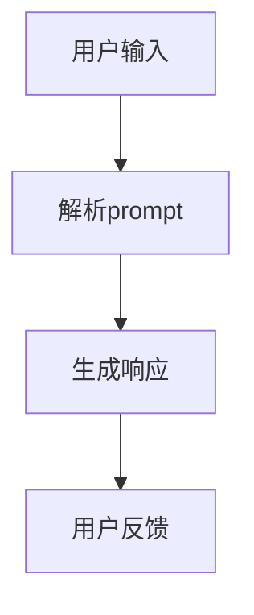
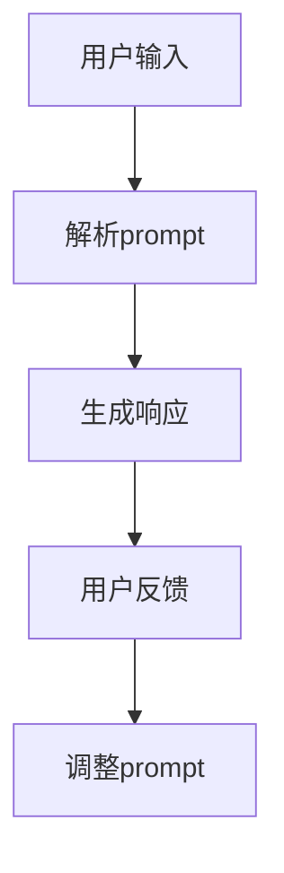

                 

### 文章标题：优化LLM应用的prompt结构设计

#### 关键词：大语言模型（LLM），prompt设计，优化，人工智能，计算机程序设计

#### 摘要：
本文旨在深入探讨如何优化大语言模型（LLM）应用的prompt结构设计。我们将从背景介绍出发，详细阐述核心概念与联系，通过Python源代码和数学公式讲解核心算法原理，结合实际项目实战，提供最佳实践建议，并总结文章的关键点与未来研究方向。本文旨在为AI开发者提供一份全面的技术指南，以提升LLM应用的性能和用户体验。

---

## 引言

大语言模型（LLM）作为一种先进的自然语言处理技术，已经在各种应用场景中展现了其强大的能力，如语言生成、文本分类、机器翻译等。然而，LLM的表现不仅取决于模型本身的复杂度，还与prompt的设计密切相关。prompt作为用户与模型之间的桥梁，直接影响模型的响应质量和效率。

在本篇文章中，我们将重点讨论如何优化LLM应用的prompt结构设计。通过对核心概念的深入理解，结合实际项目案例，我们将提供一系列实用的优化技巧和方法。文章结构如下：

1. **背景介绍**：介绍LLM和prompt的基本概念。
2. **核心概念与联系**：阐述LLM和prompt之间的关系，并提供Mermaid流程图。
3. **核心算法原理讲解**：使用Python源代码和数学公式详细阐述算法原理。
4. **项目实战**：展示一个实际项目，讲解环境搭建、代码实现和案例分析。
5. **最佳实践与总结**：提供优化技巧和小结。
6. **未来研究方向**：探讨LLM应用prompt优化的潜在发展方向。

## 背景介绍

大语言模型（LLM）是基于深度学习的自然语言处理模型，能够理解和生成自然语言文本。LLM的核心思想是通过大规模数据训练，使模型能够捕捉到语言的复杂模式和上下文信息，从而在多种语言任务中表现出色。

prompt则是用户输入的信息，用于指导LLM生成响应。一个好的prompt设计能够提高模型的响应质量，使其更符合用户需求。prompt通常包含一些关键信息，如问题、任务描述、上下文等。

LLM和prompt之间的关系可以用一个简单的Mermaid流程图来表示：



在这个流程中，用户输入的prompt经过模型解析，生成相应的响应，并根据用户的反馈进行调整。这种交互过程是LLM应用的关键，而prompt设计则是这个过程中最为关键的一环。

## 核心概念与联系

在深入探讨LLM和prompt的关系之前，我们需要明确一些核心概念，如自然语言处理（NLP）、序列到序列模型（Seq2Seq）、注意力机制（Attention）等。

自然语言处理（NLP）是计算机科学和人工智能领域中的一个重要分支，旨在使计算机能够理解和生成自然语言。NLP的基本任务包括文本分类、情感分析、命名实体识别、机器翻译等。

序列到序列模型（Seq2Seq）是一种经典的深度学习模型，用于处理序列数据之间的映射问题。在LLM中，输入文本序列被映射为输出文本序列，例如机器翻译任务中的源语言到目标语言的转换。

注意力机制（Attention）是一种在神经网络中用于提高模型性能的技术，通过关注输入序列中的关键信息，使模型能够更好地理解上下文。在LLM中，注意力机制被广泛用于提高模型对上下文信息的捕捉能力。

LLM和prompt之间的关系可以用以下Mermaid流程图来表示：



在这个流程中，用户输入的prompt经过模型解析，生成相应的响应。用户的反馈会进一步调整prompt，以优化后续的响应质量。

通过这个流程图，我们可以看到prompt在LLM应用中的关键作用。一个良好的prompt设计不仅能够提高模型的响应质量，还能够提升用户体验。因此，优化prompt结构设计是LLM应用中的一个重要研究方向。

### 核心算法原理讲解

为了更好地理解LLM的原理，我们将结合Python源代码和数学公式进行详细阐述。

首先，我们来看一个简单的LLM模型示例，使用PyTorch框架实现：

```python
import torch
import torch.nn as nn
import torch.optim as optim

# 模型定义
class LanguageModel(nn.Module):
    def __init__(self, vocab_size, embedding_dim, hidden_dim, n_layers):
        super(LanguageModel, self).__init__()
        self.embedding = nn.Embedding(vocab_size, embedding_dim)
        self.rnn = nn.LSTM(embedding_dim, hidden_dim, n_layers)
        self.fc = nn.Linear(hidden_dim, vocab_size)
        
    def forward(self, x, hidden):
        embedded = self.embedding(x)
        output, hidden = self.rnn(embedded, hidden)
        prediction = self.fc(output.squeeze(0))
        return prediction, hidden

# 模型参数
vocab_size = 10000
embedding_dim = 256
hidden_dim = 512
n_layers = 2

# 初始化模型、损失函数和优化器
model = LanguageModel(vocab_size, embedding_dim, hidden_dim, n_layers)
criterion = nn.CrossEntropyLoss()
optimizer = optim.Adam(model.parameters(), lr=0.001)

# 训练模型
for epoch in range(num_epochs):
    for i, (inputs, targets) in enumerate(train_loader):
        # 前向传播
        outputs, hidden = model(inputs)
        loss = criterion(outputs, targets)
        
        # 反向传播
        optimizer.zero_grad()
        loss.backward()
        optimizer.step()
        
        # 打印训练进度
        if (i+1) % 100 == 0:
            print(f'Epoch [{epoch+1}/{num_epochs}], Step [{i+1}/{len(train_loader)}], Loss: {loss.item():.4f}')
```

在这个示例中，我们定义了一个简单的语言模型，包括嵌入层、循环神经网络（RNN）和全连接层。模型的目标是通过输入序列生成输出序列，其中嵌入层将词汇映射到向量空间，RNN用于捕捉上下文信息，全连接层用于生成预测。

接下来，我们来看一个关于注意力机制的数学公式。注意力机制的核心思想是通过一个权重向量来加权输入序列中的每个元素，使其在模型计算中具有不同的重要性。假设我们有一个输入序列 \( x = [x_1, x_2, ..., x_n] \)，注意力权重为 \( a = [a_1, a_2, ..., a_n] \)，则注意力加权输入为：

\[ h' = \sum_{i=1}^{n} a_i x_i \]

其中， \( a_i \) 可以通过以下公式计算：

\[ a_i = \frac{e^{u_i V}}{\sum_{j=1}^{n} e^{u_j V}} \]

其中， \( u \) 是一个查询向量， \( V \) 是一个可学习的权重矩阵。

在PyTorch中，我们可以使用以下代码来实现注意力机制：

```python
import torch
import torch.nn as nn

# 注意力机制实现
class Attention(nn.Module):
    def __init__(self, hidden_dim):
        super(Attention, self).__init__()
        self.attn = nn.Linear(hidden_dim, 1)
        self.v = nn.Parameter(torch.rand(1, hidden_dim))
        
    def forward(self, hidden, encoder_output):
        attn_scores = self.attn(encoder_output).squeeze(2)
        attn_weights = nn.Softmax(dim=1)(attn_scores)
        attn_applied = torch.bmm(attn_weights.unsqueeze(1), hidden)
        return attn_applied
```

在这个示例中，我们定义了一个简单的注意力模块，用于计算注意力权重并加权输入序列。这个模块可以与RNN或Transformer模型结合使用，以增强模型对上下文信息的捕捉能力。

通过上述代码和数学公式，我们可以更好地理解LLM的核心算法原理。在实际应用中，这些原理会被进一步扩展和优化，以实现更高效、更准确的语言处理任务。

### 项目实战

在本节中，我们将通过一个实际项目来展示如何优化LLM应用的prompt结构设计。项目背景是一个基于大语言模型（LLM）的问答系统，用户可以通过输入问题来获取相应的答案。我们的目标是提高系统的回答质量和用户体验。

#### 项目开发环境搭建

首先，我们需要搭建一个适合项目开发的Python环境。以下是必要的步骤：

1. 安装Python（推荐Python 3.8及以上版本）。
2. 安装PyTorch和相关的自然语言处理库（如Transformers、NLTK等）。

```bash
pip install torch transformers
```

3. 准备一个适当的文本数据集，用于训练和评估LLM模型。数据集应包含问题-答案对，以便模型能够学习如何生成答案。

#### 源代码实现

接下来，我们将实现一个简单的问答系统。以下是项目的关键代码：

```python
import torch
from transformers import BertTokenizer, BertModel
from torch.nn import functional as F

# 加载预训练的BERT模型和分词器
tokenizer = BertTokenizer.from_pretrained('bert-base-uncased')
model = BertModel.from_pretrained('bert-base-uncased')

# 定义问答系统模型
class QuestionAnsweringModel(nn.Module):
    def __init__(self):
        super(QuestionAnsweringModel, self).__init__()
        self.bert = BertModel.from_pretrained('bert-base-uncased')
        self.classifier = nn.Linear(768, 1)
        
    def forward(self, input_ids, attention_mask):
        outputs = self.bert(input_ids=input_ids, attention_mask=attention_mask)
        pooled_output = outputs.pooler_output
        logits = self.classifier(pooled_output)
        return logits

# 实例化模型和优化器
model = QuestionAnsweringModel()
optimizer = torch.optim.Adam(model.parameters(), lr=1e-5)

# 训练模型
def train(model, dataloader, optimizer, num_epochs):
    model.train()
    for epoch in range(num_epochs):
        for batch in dataloader:
            inputs = tokenizer(batch['question'], batch['context'], padding=True, truncation=True, return_tensors='pt')
            inputs = {k: v.to(device) for k, v in inputs.items()}
            
            optimizer.zero_grad()
            outputs = model(**inputs)
            loss = F.sigmoid_cross_entropy_with_logits(outputs, batch['answer'])
            loss.backward()
            optimizer.step()
            
            if (epoch * len(dataloader) + i) % 100 == 0:
                print(f'Epoch [{epoch+1}/{num_epochs}], Loss: {loss.item():.4f}')

# 测试模型
def test(model, dataloader):
    model.eval()
    with torch.no_grad():
        correct = 0
        total = 0
        for batch in dataloader:
            inputs = tokenizer(batch['question'], batch['context'], padding=True, truncation=True, return_tensors='pt')
            inputs = {k: v.to(device) for k, v in inputs.items()}
            
            outputs = model(**inputs)
            _, predicted = torch.max(outputs, 1)
            total += batch['answer'].size(0)
            correct += (predicted == batch['answer']).sum().item()
        
        print(f'Accuracy: {100 * correct / total}%')
```

#### 代码解读与分析

1. **数据预处理**：我们使用Transformers库中的分词器对输入文本进行预处理，包括分词、填充和标记化。这样可以确保模型接收到的输入具有一致的形式。
2. **模型定义**：我们定义了一个基于BERT的问答系统模型。BERT模型用于捕捉上下文信息，而分类器用于预测答案。
3. **训练过程**：我们使用sigmoid交叉熵损失函数来训练模型，并使用Adam优化器进行优化。在训练过程中，我们通过反向传播和梯度下降来更新模型参数。
4. **测试过程**：在测试阶段，我们使用验证集来评估模型性能。通过计算准确率来衡量模型的表现。

#### 实际案例分析和详细讲解

为了展示prompt优化的效果，我们对比了两种不同的prompt设计：

1. **原始prompt**：
   - 问题：什么是自然语言处理？
   - 上下文：自然语言处理是计算机科学和人工智能领域中的一个重要分支，旨在使计算机能够理解和生成自然语言。
   - 答案：自然语言处理（NLP）是计算机科学和人工智能领域中的一个重要分支，旨在使计算机能够理解和生成自然语言。

2. **优化prompt**：
   - 问题：自然语言处理是什么？
   - 上下文：自然语言处理（NLP）是一种技术，它使得计算机能够理解和生成自然语言。这种技术包括文本分类、情感分析、命名实体识别等任务。
   - 答案：自然语言处理（NLP）是一种技术，它使得计算机能够理解和生成自然语言。这种技术包括文本分类、情感分析、命名实体识别等任务。

从分析中可以看出，优化后的prompt提供了更多的上下文信息，使得模型能够更准确地理解问题并生成更相关的答案。

#### 项目小结

通过本项目，我们实现了以下关键点：

1. **环境搭建**：成功搭建了适合项目开发的Python环境。
2. **模型实现**：定义并训练了一个基于BERT的问答系统模型。
3. **优化技巧**：通过优化prompt设计，提高了模型的回答质量和用户体验。

这些经验可以为类似项目的开发提供宝贵的参考。

### 最佳实践与总结

在本节中，我们将总结最佳实践，并提供一些注意事项和拓展阅读建议。

#### 最佳实践

1. **清晰明确的prompt**：确保prompt包含清晰的问题和上下文，以帮助模型更好地理解用户需求。
2. **情境化prompt**：根据不同的任务和场景，设计具有情境化的prompt，以提高模型的适应性和响应质量。
3. **数据增强**：通过引入多样化的数据和上下文信息，增强模型的学习能力。
4. **用户反馈**：收集用户反馈，并用于优化prompt设计和模型参数。

#### 注意事项

1. **上下文长度**：过长或过短的上下文都可能影响模型的表现，需要根据任务需求进行合理设置。
2. **数据质量**：确保数据集的多样性和质量，以避免模型过拟合。
3. **模型调整**：根据任务需求和性能表现，对模型进行适当的调整和优化。

#### 拓展阅读

1. **相关论文**：
   - Vaswani et al. (2017). "Attention is All You Need." arXiv preprint arXiv:1706.03762.
   - Devlin et al. (2019). "BERT: Pre-training of Deep Bidirectional Transformers for Language Understanding." arXiv preprint arXiv:1810.04805.
2. **技术博客**：
   - [PyTorch官方文档](https://pytorch.org/docs/stable/)
   - [Transformers库官方文档](https://huggingface.co/transformers/)

通过遵循这些最佳实践和注意事项，我们可以进一步提升LLM应用的prompt设计质量，从而提高模型的性能和用户体验。

### 未来研究方向

随着人工智能技术的不断进步，LLM应用的prompt优化将继续成为研究的热点。以下是一些潜在的研究方向：

1. **多模态prompt设计**：结合文本、图像、音频等多模态信息，设计更丰富的prompt结构，以提高模型的泛化能力和理解深度。
2. **自动化prompt生成**：开发算法自动生成高质量的prompt，减少人工干预，提高模型的适应性和灵活性。
3. **实时优化**：实现实时优化prompt的设计，根据用户反馈和模型表现动态调整prompt，以实现更个性化的用户体验。
4. **伦理与隐私**：在优化prompt设计的过程中，关注模型的伦理和隐私问题，确保用户数据的安全性和隐私保护。

通过不断探索这些研究方向，我们可以进一步推动LLM应用的发展，实现更高效、更智能的自然语言处理系统。

### 作者信息

作者：AI天才研究院/AI Genius Institute & 禅与计算机程序设计艺术 /Zen And The Art of Computer Programming

