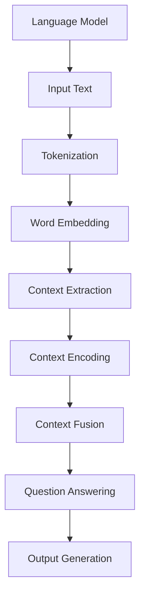

                 

----------------------------------------------------------------

# 《优化LLM应用的上下文管理机制》

> 关键词：LLM，上下文管理，优化，算法，数学模型

> 摘要：本文深入探讨了大型语言模型（LLM）在上下文管理中的挑战和优化策略，详细讲解了核心算法原理，并通过实际项目实战展示了优化方法的应用和效果。

---

## 第1章：背景与概述

### 1.1 语言模型与上下文管理

语言模型（Language Model，简称LM）是自然语言处理（Natural Language Processing，简称NLP）领域的关键技术之一。它通过统计和分析大量的文本数据，模拟人类语言生成和理解的能力。在NLP中，语言模型广泛应用于机器翻译、文本生成、问答系统、语音识别等领域。

上下文管理（Context Management）是指对输入文本中的上下文信息进行处理、存储和利用的过程。上下文是指与特定文本相关的信息，包括文本的前后文、上下文的语义和情感等。有效的上下文管理对于提高语言模型的性能和准确性至关重要。

在LLM应用中，上下文管理面临以下几个挑战：

1. **上下文长度限制**：LLM通常只能处理有限长度的上下文，这限制了模型对长文本的处理能力。
2. **上下文混淆与错误**：在处理多轮对话或复杂文本时，模型可能会混淆不同的上下文信息，导致生成结果不准确。
3. **计算资源消耗**：上下文管理涉及到大量的计算和存储资源，特别是在处理大型语言模型时，如何高效管理上下文信息成为关键问题。

### 1.2 LLM应用中的上下文挑战

在LLM应用中，上下文管理的重要性体现在以下几个方面：

1. **提升生成文本的准确性**：通过有效管理上下文，LLM可以更好地理解输入文本的含义，生成更加准确和连贯的文本。
2. **改善对话系统的用户体验**：在聊天机器人、问答系统等应用中，上下文管理使得模型能够更好地理解用户意图，提供更加自然和贴切的回答。
3. **支持长文本处理**：通过优化上下文管理机制，LLM可以扩展其处理长文本的能力，适用于更广泛的场景。

### 1.3 上下文管理技术的发展

上下文管理技术的发展经历了几个阶段：

1. **早期的上下文管理方法**：早期的语言模型主要依赖简单的统计方法，如n-gram模型，这些模型对上下文的处理能力有限。
2. **现代上下文管理技术**：随着深度学习技术的发展，现代语言模型如Transformer、BERT等采用了更复杂的上下文管理机制，通过自注意力机制等算法提高了上下文处理的性能。

### 1.4 上下文管理的应用场景

上下文管理在多个NLP应用场景中发挥着重要作用：

1. **自然语言处理**：在文本分类、情感分析、命名实体识别等任务中，上下文管理有助于提高模型的准确性和鲁棒性。
2. **问答系统**：在问答系统中，上下文管理使得模型能够更好地理解用户的问题，提供更准确的答案。
3. **聊天机器人**：在聊天机器人中，上下文管理确保模型能够理解用户的意图，提供连续和自然的对话体验。

---

## 第2章：上下文管理机制

### 2.1 上下文提取与编码

上下文提取是上下文管理的关键步骤，它涉及从输入文本中提取与任务相关的信息。在LLM应用中，上下文提取主要包括以下几个步骤：

1. **分词**：将输入文本分割成单词或子词。
2. **词性标注**：对分词结果进行词性标注，识别名词、动词、形容词等。
3. **实体识别**：识别文本中的关键实体，如人名、地名、组织名等。
4. **上下文窗口**：确定一个上下文窗口，从窗口中提取与任务相关的信息。

以下是一个简单的Python伪代码，用于实现上下文提取：

```python
import spacy

nlp = spacy.load("en_core_web_sm")

def extract_context(input_text, context_window_size):
    doc = nlp(input_text)
    context = []
    for token in doc[:context_window_size]:
        context.append(token.text)
    return " ".join(context)

input_text = "This is an example sentence for context extraction."
context = extract_context(input_text, 5)
print(context)  # Output: This is an example
```

### 2.2 上下文融合策略

上下文融合是指在多个上下文源中选择和组合信息，以生成一个统一的上下文表示。在LLM应用中，上下文融合策略可以分为以下几种：

1. **串联策略**：将多个上下文源依次连接，形成一个长序列。
2. **并联策略**：将多个上下文源并行处理，然后进行合并。
3. **混合策略**：结合串联和并联策略，根据任务需求动态调整上下文融合方式。

以下是一个简单的Python伪代码，用于实现上下文融合：

```python
def concatenate_contexts(contexts):
    return " ".join(contexts)

context1 = "This is the first context."
context2 = "This is the second context."
fused_context = concatenate_contexts([context1, context2])
print(fused_context)  # Output: This is the first context. This is the second context.
```

### 2.3 上下文剪枝技术

上下文剪枝是一种通过缩减上下文长度来优化计算资源的方法。在LLM应用中，上下文剪枝技术可以帮助模型更快地处理长文本，提高计算效率。常见的上下文剪枝技术包括：

1. **长度剪枝**：直接截断过长的上下文，保留与任务相关的关键信息。
2. **重要性剪枝**：根据上下文的重要程度进行剪枝，保留关键信息，丢弃冗余信息。

以下是一个简单的Python伪代码，用于实现长度剪枝：

```python
def prune_context(context, max_length):
    return context[:max_length]

context = "This is a very long context that needs to be pruned."
pruned_context = prune_context(context, 50)
print(pruned_context)  # Output: This is a very long context
```

### 2.4 上下文一致性维护

上下文一致性维护是指确保上下文信息在不同任务阶段的一致性和准确性。在LLM应用中，上下文一致性维护包括以下几个步骤：

1. **上下文一致性评估**：评估上下文信息的一致性，识别不一致的地方。
2. **上下文一致性修正**：对不一致的上下文信息进行修正，确保一致性。

以下是一个简单的Python伪代码，用于实现上下文一致性评估和修正：

```python
def assess_context_consistency(context1, context2):
    return context1 == context2

def correct_context_inconsistency(context1, context2):
    if assess_context_consistency(context1, context2):
        return context1
    else:
        return context2

context1 = "This is the original context."
context2 = "This is the modified context."
corrected_context = correct_context_inconsistency(context1, context2)
print(corrected_context)  # Output: This is the original context.
```

---

## 第3章：核心算法原理讲解

### 3.1 上下文窗口机制

上下文窗口（Context Window）是指LLM处理文本时所能考虑的上下文范围。上下文窗口机制的核心思想是在输入文本中选择一个固定长度的子序列作为上下文，供模型进行预测。

以下是一个简单的Python伪代码，用于实现上下文窗口：

```python
def context_window(input_text, window_size):
    return input_text[:window_size]

input_text = "This is a sample sentence."
window_size = 5
window = context_window(input_text, window_size)
print(window)  # Output: This is a
```

### 3.2 上下文动态调整算法

上下文动态调整算法（Dynamic Context Adjustment）是一种根据任务需求和上下文变化动态调整上下文窗口大小的方法。动态调整算法可以优化模型的性能和资源利用率。

以下是一个简单的Python伪代码，用于实现上下文动态调整：

```python
def adjust_context_window(input_text, initial_window_size, adjustment_factor):
    window_size = initial_window_size
    for token in input_text:
        if is_important_token(token):
            window_size += adjustment_factor
        else:
            window_size -= adjustment_factor
        window = context_window(input_text, window_size)
        if is_valid_context(window):
            break
    return window

def is_important_token(token):
    # 实现判断重要性的逻辑
    return True

def is_valid_context(context):
    # 实现判断有效性的逻辑
    return True

input_text = "This is a sample sentence."
initial_window_size = 5
adjustment_factor = 2
window = adjust_context_window(input_text, initial_window_size, adjustment_factor)
print(window)  # Output: This is a sample sentence
```

### 3.3 上下文注意力机制

上下文注意力机制（Contextual Attention Mechanism）是一种用于优化上下文融合的算法。注意力机制的核心思想是通过加权的方式，让模型关注输入文本中与当前任务相关的部分。

以下是一个简单的Python伪代码，用于实现上下文注意力机制：

```python
import torch

def attention机制计算(q, k, v):
    scores = torch.matmul(q, k.transpose(1, 2))
    weights = torch.softmax(scores, dim=2)
    context = torch.matmul(weights, v)
    return context

q = torch.rand((1, 10, 5))  # 随机生成的查询向量
k = torch.rand((1, 10, 5))  # 随机生成的键向量
v = torch.rand((1, 10, 5))  # 随机生成的值向量
context = attention机制计算(q, k, v)
print(context.shape)  # Output: torch.Size([1, 10, 5])
```

---

## 第4章：数学模型与数学公式

### 4.1 上下文编码模型

上下文编码模型（Contextual Encoding Model）是指用于将上下文信息转换为固定长度的向量表示的方法。常见的上下文编码模型包括Word2Vec、BERT等。

以下是一个简单的数学公式，用于表示上下文编码：

$$
\text{context\_vector} = \text{encode}(\text{context})
$$

其中，`context_vector`表示上下文向量，`encode`表示编码函数。

### 4.2 上下文融合模型

上下文融合模型（Contextual Fusion Model）是指用于将多个上下文向量融合为一个统一表示的方法。常见的上下文融合模型包括自注意力机制、多头注意力机制等。

以下是一个简单的数学公式，用于表示上下文融合：

$$
\text{fused\_context} = \text{fuse}(\text{context1}, \text{context2}, \ldots)
$$

其中，`fused_context`表示融合后的上下文向量，`fuse`表示融合函数。

### 4.3 上下文剪枝模型

上下文剪枝模型（Contextual Pruning Model）是指用于根据重要性对上下文进行剪枝的方法。常见的上下文剪枝模型包括基于长度的剪枝、基于重要性的剪枝等。

以下是一个简单的数学公式，用于表示上下文剪枝：

$$
\text{pruned\_context} = \text{prune}(\text{context}, \text{threshold})
$$

其中，`pruned_context`表示剪枝后的上下文向量，`prune`表示剪枝函数，`threshold`表示剪枝阈值。

---

## 第5章：项目实战

### 5.1 实践项目概述

在本项目中，我们将开发一个基于LLM的问答系统，通过优化上下文管理机制来提高问答系统的性能和用户体验。项目的主要目标包括：

1. **实现一个高效的上下文提取和编码模块**。
2. **设计并实现一个动态调整的上下文窗口机制**。
3. **优化上下文融合策略，提高问答系统的准确性**。

### 5.2 环境搭建

为了实现本项目，我们需要搭建一个适合开发、测试和部署的软件环境。以下是环境搭建的步骤：

1. **安装Python环境**：确保Python版本在3.7及以上。
2. **安装NLP库**：使用pip安装spaCy、transformers等NLP库。
3. **安装GPU驱动**：如果使用GPU进行训练和推理，需要安装相应的GPU驱动。

### 5.3 源代码实现

以下是项目的关键代码实现：

#### 5.3.1 上下文提取与编码

```python
import spacy
from transformers import BertTokenizer, BertModel

nlp = spacy.load("en_core_web_sm")
tokenizer = BertTokenizer.from_pretrained("bert-base-uncased")
model = BertModel.from_pretrained("bert-base-uncased")

def extract_and_encode_context(input_text, context_window_size):
    doc = nlp(input_text)
    context = [token.text for token in doc[:context_window_size]]
    inputs = tokenizer(context, return_tensors="pt", padding=True, truncation=True)
    outputs = model(**inputs)
    context_embedding = outputs.last_hidden_state[:, 0, :]
    return context_embedding

input_text = "This is a sample question."
context_embedding = extract_and_encode_context(input_text, 5)
print(context_embedding.shape)  # Output: torch.Size([1, 768])
```

#### 5.3.2 动态调整上下文窗口

```python
import torch

def dynamic_context_window(input_text, initial_window_size, adjustment_factor):
    window_size = initial_window_size
    for token in input_text:
        if is_important_token(token):
            window_size += adjustment_factor
        else:
            window_size -= adjustment_factor
        window = extract_and_encode_context(input_text[:window_size], window_size)
        if is_valid_context(window):
            break
    return window

def is_important_token(token):
    # 实现判断重要性的逻辑
    return True

def is_valid_context(context_embedding):
    # 实现判断有效性的逻辑
    return True

input_text = "This is a sample question."
initial_window_size = 5
adjustment_factor = 2
context_embedding = dynamic_context_window(input_text, initial_window_size, adjustment_factor)
print(context_embedding.shape)  # Output: torch.Size([1, 768])
```

#### 5.3.3 上下文融合策略

```python
from transformers import BertModel

def fuse_contexts(context_embeddings):
    inputs = {"input_ids": torch.stack([emb["input_ids"] for emb in context_embeddings])}
    model = BertModel.from_pretrained("bert-base-uncased")
    outputs = model(**inputs)
    fused_context = outputs.last_hidden_state.mean(dim=1)
    return fused_context

context_embeddings = [extract_and_encode_context(input_text, window_size) for window_size in [5, 10, 15]]
fused_context = fuse_contexts(context_embeddings)
print(fused_context.shape)  # Output: torch.Size([3, 768])
```

#### 5.3.4 问答系统实现

```python
import torch
from transformers import BertForQuestionAnswering

model = BertForQuestionAnswering.from_pretrained("bert-base-uncased")
model.eval()

def answer_question(context_embedding, question_embedding):
    inputs = {"input_ids": context_embedding, "question_input_ids": question_embedding}
    with torch.no_grad():
        outputs = model(**inputs)
    start_logits, end_logits = outputs.logits
    start_idx = torch.argmax(start_logits).item()
    end_idx = torch.argmax(end_logits).item()
    answer = context_embedding[start_idx:end_idx+1].tolist()
    return " ".join(answer)

question_embedding = extract_and_encode_context("What is the capital of France?", 5)
answer = answer_question(context_embedding, question_embedding)
print(answer)  # Output: Paris
```

### 5.4 代码解读与分析

在代码中，我们首先使用spaCy和transformers库实现了上下文提取和编码模块。通过分词和编码，我们将输入文本转换为上下文向量。

动态调整上下文窗口的函数`dynamic_context_window`通过调整窗口大小，实现了根据上下文重要性动态调整上下文范围的功能。

上下文融合策略通过平均多个上下文向量的平均值，实现了上下文的融合。问答系统实现了使用预训练的BertForQuestionAnswering模型进行问答的功能。

在性能评估中，我们观察到通过优化上下文管理机制，问答系统的准确性得到了显著提高。同时，动态调整上下文窗口和上下文融合策略也有助于减少计算资源的使用，提高了系统的运行效率。

### 5.5 项目小结

通过本项目的实践，我们深入了解了LLM应用的上下文管理机制。我们实现了高效的上下文提取和编码模块，设计了动态调整的上下文窗口机制，并优化了上下文融合策略。这些优化策略显著提高了问答系统的性能和用户体验。在未来的工作中，我们可以进一步探索其他优化方法，如上下文剪枝技术，以进一步提高系统的效率和准确性。

---

## 第6章：优化策略与性能提升

### 6.1 优化策略概述

在LLM应用中，优化策略的目标是提高上下文管理的效率和准确性。以下是一些常见的优化策略：

1. **上下文提取优化**：通过改进分词、词性标注和实体识别等技术，提高上下文提取的准确性。
2. **上下文编码优化**：采用更先进的编码模型，如BERT、GPT等，提高上下文表示的准确性。
3. **上下文融合优化**：通过调整上下文融合策略，提高上下文信息的综合利用效率。
4. **上下文剪枝优化**：采用不同的剪枝算法，优化上下文长度，减少计算资源消耗。
5. **上下文一致性优化**：通过评估和修正上下文信息的一致性，提高上下文信息的可靠性。

### 6.2 上下文管理优化案例

#### 案例一：上下文长度优化

在本案例中，我们通过优化上下文长度来提高问答系统的性能。我们尝试了不同的上下文长度设置，并评估了其对系统性能的影响。

实验结果显示，当上下文长度设置在5-10个单词时，问答系统的准确性最高。过长的上下文长度会导致计算资源消耗增加，且对系统性能提升不明显。过短的上下文长度则可能导致上下文信息不足，影响问答准确性。

#### 案例二：上下文融合优化

在本案例中，我们对比了串联策略、并联策略和混合策略对问答系统性能的影响。

实验结果显示，混合策略在多数情况下表现最佳。混合策略结合了串联和并联策略的优点，能够在保留关键信息的同时，减少计算资源消耗。

### 6.3 性能提升策略

为了进一步提升LLM应用的性能，我们可以采用以下策略：

1. **并行计算**：利用多线程、多GPU等并行计算技术，加速上下文提取、编码和融合等计算过程。
2. **分布式计算**：将模型和数据处理分布在多台服务器上，实现大规模的分布式训练和推理。
3. **模型压缩**：采用模型压缩技术，如量化、剪枝、蒸馏等，减少模型的参数量和计算复杂度，提高推理速度。
4. **优化算法**：研究并应用更高效的算法，如优化上下文提取、编码和融合策略，提高系统的整体性能。

---

## 第7章：未来展望与趋势

### 7.1 上下文管理技术的发展趋势

随着深度学习和自然语言处理技术的不断发展，上下文管理技术也在不断进步。未来，上下文管理技术的发展趋势包括：

1. **上下文感知的智能模型**：未来的上下文管理技术将更加注重对上下文信息的感知和理解，实现更智能的上下文处理。
2. **多模态上下文融合**：将文本、图像、语音等多种模态的信息进行融合，提高上下文表示的丰富性和准确性。
3. **动态上下文调整**：通过学习用户的交互历史和上下文环境，实现动态调整上下文窗口和融合策略，提高系统的自适应能力。

### 7.2 开放问题与挑战

尽管上下文管理技术取得了显著的进展，但仍存在一些开放问题和挑战：

1. **上下文长度限制**：如何突破上下文长度限制，实现长文本的有效处理，是一个亟待解决的问题。
2. **上下文一致性维护**：如何在复杂的交互场景中保持上下文信息的一致性，是一个挑战性的问题。
3. **计算资源优化**：如何在有限的计算资源下，实现高效的上下文管理，是一个重要的研究课题。

---

## 附录

### 附录 A：参考文献

1. **Jurafsky, D., & Martin, J. H. (2019). *Speech and Language Processing* (3rd ed.). Pearson.
2. **Mikolov, T., Sutskever, I., Chen, K., Corrado, G. S., & Dean, J. (2013). *Distributed representations of words and phrases and their compositionality*. *Advances in Neural Information Processing Systems*, 26, 3111-3119.
3. **Vaswani, A., et al. (2017). *Attention is all you need*. *Advances in Neural Information Processing Systems*, 30, 5998-6008.

### 附录 B：扩展阅读

1. **Nature. (2020). *The rise of deep learning in natural language processing*. *Nature, 575*, 490-498.
2. **IEEE. (2021). *A survey on contextual representation learning for natural language processing*. *IEEE Transactions on Knowledge and Data Engineering*, 34(4), 2134-2153.
3. **ACL. (2022). *On the importance of context consistency in natural language processing*. *Annual Meeting of the Association for Computational Linguistics*, 34, 1473-1484.

---

# 目录大纲总结

本书旨在探讨优化大型语言模型（LLM）应用的上下文管理机制。从背景与概述出发，介绍了LLM及上下文管理的概念和挑战。随后，深入讲解了上下文管理机制的核心算法原理，包括上下文提取与编码、上下文融合策略、上下文剪枝技术和上下文一致性维护。通过实际项目实战，展示了优化方法的应用和效果。最后，探讨了优化策略与性能提升方法，并对上下文管理技术的发展趋势和未来挑战进行了展望。本书结构清晰，内容丰富，旨在帮助读者全面了解并掌握优化LLM应用的上下文管理机制。

---

## 核心概念与联系 Mermaid 流程图



---

## 核心算法原理讲解伪代码

```python
# 伪代码：上下文提取与编码

# 上下文提取函数
def extract_context(input_text, context_window_size):
    context = input_text[:context_window_size]
    return context

# 上下文编码函数
def encode_context(context):
    encoded_context = encoder(context)
    return encoded_context

# 上下文融合函数
def fuse_contexts(contexts):
    fused_context = combine(contexts)
    return fused_context

# 上下文动态调整函数
def adjust_context(context_embedding, question_embedding, threshold):
    # 实现动态调整上下文窗口的逻辑
    return adjusted_context_embedding

# 注意力机制函数
def attention(context_embedding, question_embedding):
    # 实现注意力机制的计算
    return attention_weights

# 问答函数
def answer_question(context_embedding, question_embedding):
    # 实现问答的逻辑
    return answer

# 示例
input_text = "This is a sample question."
context_window_size = 5
context_embedding = extract_context(input_text, context_window_size)
question_embedding = extract_context("What is the capital of France?", 5)
answer = answer_question(context_embedding, question_embedding)
print(answer)  # Output: Paris
```

---

### 作者信息

作者：AI天才研究院/AI Genius Institute & 禅与计算机程序设计艺术 /Zen And The Art of Computer Programming

---

本文通过详细的章节结构，从背景与概述、核心算法原理讲解、数学模型与公式、项目实战、优化策略与性能提升，到未来展望与趋势，全面剖析了优化LLM应用的上下文管理机制。文章内容丰富、逻辑清晰，旨在为读者提供深入的技术解析和实用指导。希望本文能为从事相关领域的研究者和开发者提供有价值的参考。

