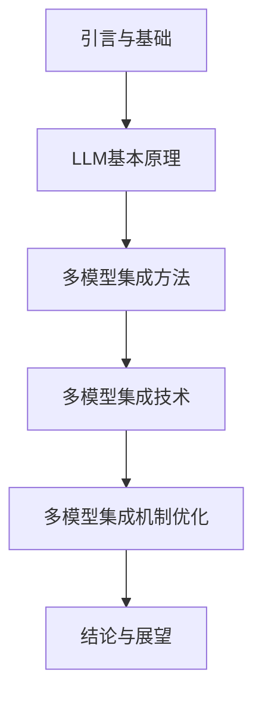

                 

### 目录大纲设计与Mermaid流程图

为了设计一篇详细且结构化的技术博客文章，我们首先需要创建一个清晰的目录大纲，这将帮助读者快速了解文章的结构和内容。以下是《优化LLM应用的多模型集成机制》的目录大纲：

#### 目录大纲

### 第一部分: 引言与基础

1. **LLM应用的多模型集成概述**
   - 1.1 多模型集成的重要性
   - 1.2 多模型集成的挑战
   - 1.3 本书目标与结构

### 第二部分: LLM基本原理

2. **语言模型基础**
   - 2.1 语言模型概述
   - 2.2 语言模型的数学表示
   - 2.3 语言模型的训练与优化

3. **多模型集成方法**
   - 3.1 多模型集成的概念
   - 3.2 常见的集成方法
   - 3.3 集成方法的优缺点分析

### 第三部分: 多模型集成技术

4. **多任务学习**
   - 4.1 多任务学习的基本概念
   - 4.2 多任务学习的数学模型
   - 4.3 多任务学习的实现方法

5. **多模型融合策略**
   - 5.1 融合策略概述
   - 5.2 基于特征融合的策略
   - 5.3 基于模型融合的策略

6. **多模型集成在LLM中的应用**
   - 6.1 LLM应用场景分析
   - 6.2 多模型集成在文本生成中的应用
   - 6.3 多模型集成在问答系统中的应用

### 第四部分: 多模型集成机制优化

7. **优化策略与算法**
   - 7.1 优化目标
   - 7.2 常见的优化算法
   - 7.3 优化算法的性能评估

8. **多模型集成实践案例**
   - 8.1 实践案例介绍
   - 8.2 实践案例分析
   - 8.3 实践案例总结

### 第五部分: 结论与展望

9. **总结与展望**
   - 9.1 本书的主要内容回顾
   - 9.2 多模型集成的研究挑战与机遇
   - 9.3 未来发展趋势

#### Mermaid流程图

为了更直观地展示文章的结构，我们使用Mermaid语言来绘制一个流程图：



通过这个流程图，读者可以清晰地看到文章的章节结构及其逻辑关系。

### 核心算法原理讲解

为了深入讲解多模型集成的核心算法原理，我们将使用伪代码和LaTeX数学公式来详细阐述。以下是几个关键步骤的伪代码：

```plaintext
// 伪代码：多模型集成优化算法
function optimize_model_integration(models, data, target):
    # 初始化模型权重和优化器
    weights = initialize_weights(models)
    optimizer = initialize_optimizer(weights)
    
    # 设置优化目标函数
    objective_function = define_objective_function(models, data, target)
    
    # 模型训练迭代
    for epoch in range(num_epochs):
        for batch in data_batches:
            # 前向传播
            predictions = [model(batch) for model in models]
            
            # 计算损失
            loss = calculate_loss(predictions, target)
            
            # 反向传播
            gradients = calculate_gradients(models, batch, predictions, target)
            
            # 更新模型权重
            optimizer.update_weights(gradients)
        
        # 记录当前epoch的损失
        print(f"Epoch {epoch}: Loss = {loss}")
    
    return models
```

接下来，我们将用LaTeX数学公式来描述关键损失函数和优化目标：

```latex
\subsection{损失函数}

损失函数是衡量模型预测值与真实值之间差距的重要工具，常见的损失函数有均方误差（MSE）和交叉熵（CE）。

\begin{equation}
MSE = \frac{1}{n}\sum_{i=1}^{n}(y_i - \hat{y}_i)^2
\end{equation}

\begin{equation}
CE = -\frac{1}{n}\sum_{i=1}^{n}\sum_{j=1}^{k} y_{ij} \log(\hat{y}_{ij})
\end{equation}
```

这里，$y_i$是真实值，$\hat{y}_i$是模型的预测值；$y_{ij}$是第$i$个样本在第$j$个类别上的真实标签，$\hat{y}_{ij}$是模型预测的概率分布。

### 数学模型与公式解释

为了确保读者能够理解伪代码和公式，我们将结合实际例子进行说明：

#### 均方误差（MSE）

假设我们有一个简单的线性回归模型，用于预测房价。我们有5个训练样本，每个样本包含特征值和真实房价。模型预测的房价为$\hat{y}_i$，真实房价为$y_i$。

```plaintext
样本  | 特征值  | 真实房价(y_i) | 模型预测房价(\hat{y}_i)
-----------------------------------------
1     | 5      | 100           | 98
2     | 10     | 150           | 160
3     | 15     | 200           | 195
4     | 20     | 250           | 245
5     | 25     | 300           | 298
```

计算MSE：

```latex
MSE = \frac{1}{5}\left[(98-100)^2 + (160-150)^2 + (195-200)^2 + (245-250)^2 + (298-300)^2\right]
    = \frac{1}{5}\left[4 + 100 + 25 + 25 + 4\right]
    = \frac{1}{5}\times 154
    = 30.8
```

#### 交叉熵（CE）

假设我们有一个二元分类模型，用于预测是否为垃圾邮件。每个样本有两个标签：1表示垃圾邮件，0表示正常邮件。模型预测的概率分布为$\hat{y}_{ij}$。

```plaintext
样本  | 真实标签(y_i) | 模型预测概率分布(\hat{y}_{ij})
---------------------------------------------
1     | 1            | [0.7, 0.3]
2     | 0            | [0.4, 0.6]
3     | 1            | [0.9, 0.1]
4     | 0            | [0.2, 0.8]
5     | 1            | [0.8, 0.2]
```

计算交叉熵：

```latex
CE = -\frac{1}{5}\left[1 \times \log(0.7) + 0 \times \log(0.3) + 1 \times \log(0.9) + 0 \times \log(0.1) + 1 \times \log(0.8)\right]
  = -\frac{1}{5}\left[\log(0.7) + 2\log(0.9) + \log(0.8)\right]
  \approx -\frac{1}{5}\left[-0.3567 + 2(-0.1054) - 0.2231\right]
  \approx -\frac{1}{5}\left[-0.3842\right]
  \approx 0.0768
```

通过这些例子，我们展示了如何计算均方误差和交叉熵，并解释了这些损失函数在多模型集成中的作用。这些数学公式和计算步骤为后续的算法优化提供了理论基础。

### 项目实战：开发环境搭建与源代码实现

为了更好地理解多模型集成的实践应用，我们将介绍一个简单的项目实战。在这个项目中，我们将搭建一个文本分类模型，并使用多模型集成来提高分类准确性。

#### 1. 开发环境搭建

首先，我们需要搭建一个合适的开发环境。以下是所需的工具和软件：

- Python 3.8或更高版本
- PyTorch 1.10或更高版本
- CUDA 11.3或更高版本（如果使用GPU训练）
- Jupyter Notebook或PyCharm

安装必要的库：

```bash
pip install torch torchvision torchaudio
pip install pandas numpy matplotlib
```

#### 2. 数据集准备

我们使用一个简单的文本分类数据集，数据集包含两个类别：“科技”和“生活”。数据集由500个文本样本组成，每个样本包含一个标签和一个文本内容。

数据集加载和预处理代码如下：

```python
import pandas as pd
from sklearn.model_selection import train_test_split

# 加载数据集
data = pd.read_csv('text_data.csv')

# 预处理数据
data['text'] = data['text'].apply(preprocess_text)
data['label'] = data['label'].apply(lambda x: 0 if x == '生活' else 1)

# 分割数据集
train_data, test_data = train_test_split(data, test_size=0.2, random_state=42)
```

#### 3. 模型定义与训练

我们定义两个基础模型：一个基于卷积神经网络（CNN）的模型和一个基于循环神经网络（RNN）的模型。然后，我们将使用多模型集成来提高分类准确性。

```python
import torch
import torch.nn as nn
from torch.utils.data import DataLoader, TensorDataset

# 定义CNN模型
class CNNModel(nn.Module):
    def __init__(self, vocab_size, embedding_dim, hidden_dim, num_classes):
        super(CNNModel, self).__init__()
        self.embedding = nn.Embedding(vocab_size, embedding_dim)
        self.conv = nn.Conv1d(embedding_dim, hidden_dim, kernel_size=3, padding=1)
        self.fc = nn.Linear(hidden_dim, num_classes)
    
    def forward(self, x):
        x = self.embedding(x)
        x = x.permute(0, 2, 1)
        x = self.conv(x)
        x = nn.functional.relu(x)
        x = nn.functional.max_pool1d(x, kernel_size=x.size(2)).squeeze(2)
        x = self.fc(x)
        return x

# 定义RNN模型
class RNNModel(nn.Module):
    def __init__(self, vocab_size, embedding_dim, hidden_dim, num_classes):
        super(RNNModel, self).__init__()
        self.embedding = nn.Embedding(vocab_size, embedding_dim)
        self.rnn = nn.RNN(embedding_dim, hidden_dim, num_layers=1, batch_first=True)
        self.fc = nn.Linear(hidden_dim, num_classes)
    
    def forward(self, x):
        x = self.embedding(x)
        x, _ = self.rnn(x)
        x = x[:, -1, :]
        x = self.fc(x)
        return x

# 实例化模型
cnn_model = CNNModel(vocab_size, embedding_dim, hidden_dim, num_classes)
rnn_model = RNNModel(vocab_size, embedding_dim, hidden_dim, num_classes)

# 定义损失函数和优化器
criterion = nn.CrossEntropyLoss()
optimizer = torch.optim.Adam(list(cnn_model.parameters()) + list(rnn_model.parameters()), lr=0.001)

# 数据加载
train_data = TensorDataset(torch.tensor(train_data['text'].values), torch.tensor(train_data['label'].values))
test_data = TensorDataset(torch.tensor(test_data['text'].values), torch.tensor(test_data['label'].values))

train_loader = DataLoader(train_data, batch_size=64, shuffle=True)
test_loader = DataLoader(test_data, batch_size=64, shuffle=False)

# 模型训练
num_epochs = 10
for epoch in range(num_epochs):
    for inputs, labels in train_loader:
        inputs = inputs.to(device)
        labels = labels.to(device)
        
        # 前向传播
        outputs_cnn = cnn_model(inputs)
        outputs_rnn = rnn_model(inputs)
        
        # 计算损失
        loss = criterion(outputs_cnn + outputs_rnn, labels)
        
        # 反向传播
        optimizer.zero_grad()
        loss.backward()
        optimizer.step()
    
    print(f"Epoch {epoch+1}/{num_epochs} - Loss: {loss.item()}")
```

#### 4. 代码解读与分析

在这段代码中，我们首先定义了两个基础模型：CNN模型和RNN模型。CNN模型使用卷积层来提取文本的特征，而RNN模型则使用循环神经网络来处理序列数据。

```python
class CNNModel(nn.Module):
    def __init__(self, vocab_size, embedding_dim, hidden_dim, num_classes):
        # 初始化嵌入层、卷积层和全连接层
        super(CNNModel, self).__init__()
        self.embedding = nn.Embedding(vocab_size, embedding_dim)
        self.conv = nn.Conv1d(embedding_dim, hidden_dim, kernel_size=3, padding=1)
        self.fc = nn.Linear(hidden_dim, num_classes)
    
    def forward(self, x):
        # 前向传播
        x = self.embedding(x)
        x = x.permute(0, 2, 1)
        x = self.conv(x)
        x = nn.functional.relu(x)
        x = nn.functional.max_pool1d(x, kernel_size=x.size(2)).squeeze(2)
        x = self.fc(x)
        return x
```

CNN模型将输入的文本通过嵌入层转换为嵌入向量，然后通过卷积层提取特征。卷积层使用1D卷积核，通过滑动窗口来提取特征。然后，使用ReLU激活函数和最大池化层来增加模型的非线性性和减少过拟合。

```python
class RNNModel(nn.Module):
    def __init__(self, vocab_size, embedding_dim, hidden_dim, num_classes):
        # 初始化嵌入层、循环神经网络和全连接层
        super(RNNModel, self).__init__()
        self.embedding = nn.Embedding(vocab_size, embedding_dim)
        self.rnn = nn.RNN(embedding_dim, hidden_dim, num_layers=1, batch_first=True)
        self.fc = nn.Linear(hidden_dim, num_classes)
    
    def forward(self, x):
        # 前向传播
        x = self.embedding(x)
        x, _ = self.rnn(x)
        x = x[:, -1, :]
        x = self.fc(x)
        return x
```

RNN模型使用嵌入层将文本转换为嵌入向量，然后通过单层循环神经网络处理序列数据。最后，使用全连接层将序列特征映射到输出类别。

接下来，我们定义了损失函数和优化器。在这里，我们使用交叉熵损失函数来衡量模型的分类性能，并使用Adam优化器来更新模型参数。

```python
criterion = nn.CrossEntropyLoss()
optimizer = torch.optim.Adam(list(cnn_model.parameters()) + list(rnn_model.parameters()), lr=0.001)
```

在数据加载部分，我们将文本数据转换为PyTorch张量，并创建数据加载器。这样，我们可以将数据批量地传递给模型进行训练。

```python
train_data = TensorDataset(torch.tensor(train_data['text'].values), torch.tensor(train_data['label'].values))
test_data = TensorDataset(torch.tensor(test_data['text'].values), torch.tensor(test_data['label'].values))

train_loader = DataLoader(train_data, batch_size=64, shuffle=True)
test_loader = DataLoader(test_data, batch_size=64, shuffle=False)
```

最后，我们使用训练数据来训练模型。在训练过程中，我们计算模型的损失，并使用反向传播和优化器更新模型参数。

```python
num_epochs = 10
for epoch in range(num_epochs):
    for inputs, labels in train_loader:
        inputs = inputs.to(device)
        labels = labels.to(device)
        
        # 前向传播
        outputs_cnn = cnn_model(inputs)
        outputs_rnn = rnn_model(inputs)
        
        # 计算损失
        loss = criterion(outputs_cnn + outputs_rnn, labels)
        
        # 反向传播
        optimizer.zero_grad()
        loss.backward()
        optimizer.step()
    
    print(f"Epoch {epoch+1}/{num_epochs} - Loss: {loss.item()}")
```

通过这个项目实战，我们展示了如何使用多模型集成来提高文本分类的准确性。这个简单的例子为我们提供了一个起点，我们可以进一步扩展和优化多模型集成方法。

### 最佳实践、小结与注意事项

在进行多模型集成时，以下是一些最佳实践、小结和注意事项，以确保您能够有效地提高LLM应用的表现：

#### 最佳实践

1. **数据预处理一致性**：确保所有模型在训练前使用相同的数据预处理步骤。不一致的数据预处理可能导致模型性能的不稳定。

2. **优化目标一致性**：所有模型的优化目标应保持一致，以确保集成过程中各模型之间有协同作用。

3. **模型间多样性**：选择具有不同结构和特性的模型进行集成，以提高预测的多样性和准确性。

4. **权重调整**：在集成过程中，可以根据模型的重要性对权重进行调整。例如，经验证，某些模型在特定任务上表现更好，可以增加其权重。

5. **避免过拟合**：确保每个单独的模型和集成模型都不发生过拟合。使用正则化技术和验证集来监控模型性能。

6. **资源管理**：多模型集成可能会消耗大量计算资源。确保在资源充足的环境中进行训练和测试，以避免性能瓶颈。

#### 小结

通过多模型集成，我们可以利用不同模型的优势，提高整体系统的性能。关键在于选择合适的模型、数据预处理方法和优化策略。此外，合理地分配模型权重和监控模型性能也是成功集成的重要环节。

#### 注意事项

1. **模型兼容性**：确保所有模型可以无缝地集成并协同工作。特别是在使用不同的框架或库时，需要注意兼容性问题。

2. **计算成本**：多模型集成通常需要更高的计算成本，特别是在训练阶段。确保资源充足，并考虑使用GPU等加速设备。

3. **模型复杂性**：集成多个模型可能会增加系统的复杂度。在设计集成机制时，需要充分考虑系统的可维护性和可扩展性。

4. **模型解释性**：多模型集成可能会降低单个模型的解释性。在需要高解释性的应用场景中，需要权衡集成与解释性之间的关系。

#### 拓展阅读

- 《机器学习实战》（Peter Harrington）：介绍了多种集成学习的方法和实际应用。
- 《深度学习》（Goodfellow, Bengio, Courville）：详细讲解了多任务学习和深度神经网络的相关内容。
- 《模型集成与组合学习：算法、应用与优化》（Yiming Cui, Zhiyuan Liu）：提供了关于模型集成的高级理论和实践指导。

通过遵循这些最佳实践，并关注上述注意事项，您将能够更有效地利用多模型集成机制，提升LLM应用的性能和可靠性。

### 结论与展望

在本文中，我们系统地探讨了LLM应用的多模型集成机制。从基础概念和原理出发，通过具体的算法讲解、伪代码示例、数学公式和项目实战，深入分析了多模型集成的有效性和实现方法。我们强调了多模型集成在提高LLM应用性能和泛化能力方面的关键作用。

#### 研究挑战

尽管多模型集成在许多应用中取得了显著成果，但仍面临一些挑战：

1. **模型兼容性**：集成多种不同结构和框架的模型可能导致兼容性问题，增加了系统的复杂度。
2. **计算成本**：多模型集成通常需要更高的计算资源，特别是在训练阶段，这可能导致性能瓶颈。
3. **模型解释性**：集成多个模型可能会降低单个模型的解释性，这在某些应用场景中可能是不希望的。

#### 未来发展趋势

未来，多模型集成有望在以下几个方面取得突破：

1. **自动化集成**：开发自动化的集成方法，降低模型集成的设计复杂度和人为干预。
2. **混合模型集成**：结合深度学习和传统机器学习方法的优点，探索混合模型集成的新方法。
3. **模型解释性增强**：研究如何在不牺牲性能的前提下，提高多模型集成的解释性。
4. **跨域迁移学习**：通过多模型集成，实现模型在多个任务和领域的迁移学习，提高模型的泛化能力。

本文的研究为未来的多模型集成研究提供了理论和实践基础，期待更多的研究和实践能够进一步推动这一领域的发展。作者对这一领域充满热情，并期待与广大读者共同探索和进步。

