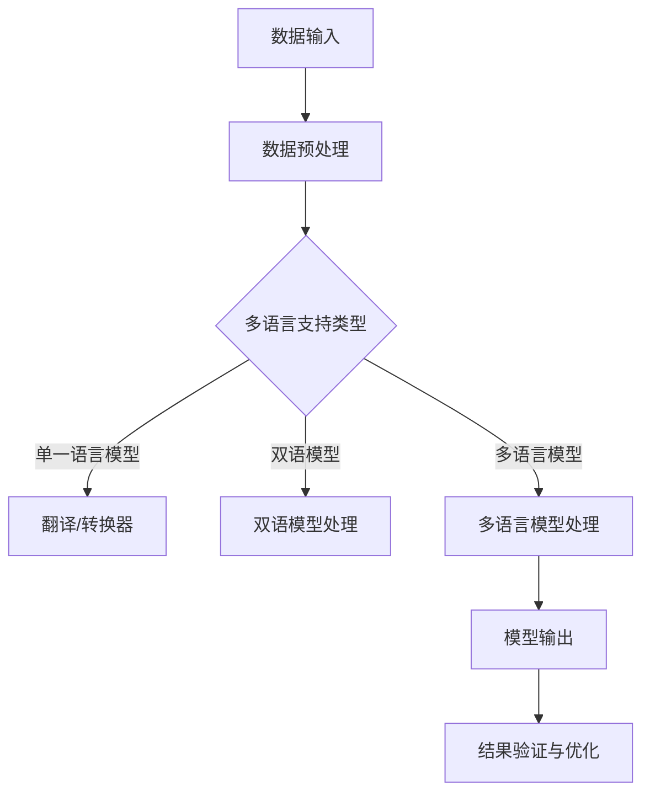

                 

### 第1章 引言

#### 1.1 背景与意义

在当今快速发展的技术时代，人工智能（AI）已经成为推动社会进步的重要力量。作为AI的重要组成部分，语言模型（Language Model，简称LLM）在自然语言处理（Natural Language Processing，简称NLP）领域发挥了关键作用。LLM不仅能够对文本进行理解和生成，还能在多种场景中实现智能对话、机器翻译和文本摘要等功能。然而，随着全球化的深入发展，多语言支持成为了LLM应用面临的重要挑战和机遇。

语言模型的发展历程可以追溯到20世纪50年代，当时以规则为基础的模型占据了主导地位。然而，随着计算能力和数据资源的不断提升，基于统计方法和深度学习的语言模型逐渐崭露头角。从早期的统计语言模型（如N-gram模型）到现代的深度神经网络模型（如Transformer），语言模型在性能和效率上取得了显著的提升。

LLM在NLP领域的应用十分广泛，涵盖了机器翻译、文本摘要、问答系统、文本分类、情感分析等多个方面。例如，Google翻译和百度翻译等机器翻译系统都基于先进的语言模型实现，极大地提升了跨语言沟通的效率。在问答系统中，LLM可以理解和回答用户的自然语言问题，为用户提供智能化的服务。文本分类和情感分析则广泛应用于社交媒体、电商和金融等领域，帮助企业和用户更好地理解和分析文本数据。

然而，尽管LLM在单语言应用中表现出色，但在多语言支持方面仍面临诸多挑战。首先，不同语言之间存在巨大的语法、词汇和语义差异，这给多语言模型的训练和优化带来了困难。其次，语言资源的分布不均导致一些小语种的数据稀缺，难以构建高质量的多语言模型。此外，多语言模型的训练需要大量的计算资源和时间，这在一定程度上限制了其应用范围。

本文旨在探讨如何优化LLM应用的多语言支持策略，从核心概念、算法原理、数学模型、项目实战等多个方面进行分析和探讨。通过深入理解和解决这些挑战，我们希望能够为LLM的多语言应用提供新的思路和方法。

#### 1.2 LLM应用现状与挑战

目前，LLM在多语言支持方面已经取得了一些进展。例如，基于Transformer架构的多语言模型如mBERT和XLM已经显示出较好的性能，能够处理多种语言的文本。这些模型通过共享底层表示和交叉语言注意力机制，有效地解决了跨语言信息传递的问题。此外，一些开源平台如TensorFlow和PyTorch提供了丰富的工具和库，方便研究人员和开发者进行LLM的多语言训练和应用。

然而，LLM在多语言支持方面仍然面临诸多挑战。首先，不同语言之间的差异使得模型需要学习丰富的语法和语义特征。这要求模型具有更强的泛化能力和适应性，能够处理多种语言的不同语法规则和表达方式。其次，多语言数据集的构建和清洗是一项复杂而耗时的任务。不同语言的数据资源分布不均，一些小语种的数据稀缺，这使得构建高质量的多语言数据集成为难题。此外，多语言模型的训练和优化过程需要大量的计算资源和时间，这在资源有限的环境下可能难以实现。

为了解决这些挑战，研究者们提出了多种策略和算法。例如，基于转换器（Transfomer）的多语言支持算法通过跨语言注意力机制和共享嵌入层，提高了模型在不同语言之间的表现。此外，预训练-微调（Pre-training and Fine-tuning）策略通过在大量多语言数据上进行预训练，再针对特定任务进行微调，有效地提升了模型的效果。还有一些研究者通过引入多任务学习（Multi-task Learning）和迁移学习（Transfer Learning）等方法，进一步提高多语言模型的性能和效率。

尽管如此，LLM在多语言支持方面仍然存在一些未解决的问题。首先，如何在保持模型性能的同时，降低计算和存储成本是一个重要的研究方向。其次，如何更好地处理跨语言语义歧义和多语言文本的语义理解问题，仍需深入探索。此外，如何构建更加公平和包容的多语言模型，避免语言偏见和歧视，也是未来需要关注的重要问题。

总的来说，优化LLM应用的多语言支持策略是一个复杂而富有挑战的任务。通过不断的研究和实践，我们有望在不久的将来，实现更加高效、准确和广泛的多语言LLM应用。

#### 1.3 本书结构安排

本文将详细探讨如何优化LLM应用的多语言支持策略，分为七个章节，每个章节都涵盖了一个核心内容。

**第1章 引言**：介绍了背景、意义以及LLM应用现状与挑战，为后续章节奠定了基础。

**第2章 核心概念与联系**：深入讲解了语言模型的基本原理和多语言支持原理，并使用Mermaid流程图展示了LLM多语言支持的整体流程。

**第3章 核心算法原理讲解**：详细介绍了基于神经网络的LLM模型和基于转换器的多语言支持算法，并通过伪代码展示了模型训练的过程。

**第4章 数学模型与公式讲解**：阐述了语言模型的数学模型和多语言支持的数学模型，并结合具体例子进行了详细解释。

**第5章 项目实战**：通过搭建实战环境、代码实现和解读，展示了如何在实际项目中应用多语言LLM模型。

**第6章 多语言支持策略探讨**：探讨了数据集构建、模型选择与优化以及评测方法与评估指标，为多语言模型的应用提供了实用策略。

**第7章 未来发展趋势与挑战**：分析了LLM技术的发展趋势和多语言支持面临的挑战，并提出了可能的解决方案和未来研究方向。

通过这样的结构安排，本文希望能够系统地、全面地解答如何优化LLM应用的多语言支持策略这一关键问题。

### 第2章 核心概念与联系

#### 2.1 语言模型的基本原理

语言模型是自然语言处理（NLP）领域的核心组成部分，它致力于预测文本中下一个单词或字符的概率。语言模型的核心任务是解决自然语言中的不确定性和多样性，使得计算机能够理解和生成自然语言。

**2.1.1 语言模型的基础概念**

语言模型的基础概念主要包括词汇、句法和语义。词汇是语言的基本单位，包括单词、短语和符号。句法是指词汇之间的组合规则，决定了句子结构的合理性。语义则是指语言表达的含义和逻辑关系。

**2.1.2 语言模型的分类**

语言模型可以分为统计模型和神经网络模型。统计模型基于历史数据的统计规律，如N-gram模型，通过计算单词序列的概率来预测下一个单词。神经网络模型则通过模拟人脑神经网络的工作机制，利用深度学习算法来学习语言的模式和规律，如Transformer模型。

**2.1.3 语言模型的训练方法**

语言模型的训练方法通常分为预训练和微调两个阶段。预训练阶段使用大量无监督数据，如文本和网页，通过自动编码器、自回归模型等方式，让模型学习语言的内在结构和规律。微调阶段则将预训练好的模型用于特定任务，如问答系统、机器翻译等，通过少量有监督数据进一步优化模型。

#### 2.2 多语言支持原理

多语言支持是指语言模型能够处理多种语言文本的能力。实现多语言支持需要解决不同语言间的语法、词汇和语义差异，同时确保模型在不同语言环境下的性能。

**2.2.1 多语言支持的定义**

多语言支持是指语言模型能够同时处理多种语言的输入和输出，包括但不限于以下三个方面：
1. **多语言输入**：模型能够接受多种语言的文本输入。
2. **多语言输出**：模型能够生成多种语言的文本输出。
3. **跨语言理解**：模型能够理解不同语言之间的语义和上下文关系。

**2.2.2 多语言支持的分类**

多语言支持可以分为以下几种类型：
1. **单一语言模型**：仅支持一种语言，通过翻译或转换器来处理其他语言。
2. **双语模型**：支持两种语言的文本输入和输出。
3. **多语言模型**：支持多种语言的文本输入和输出，如mBERT和XLM等模型。

**2.2.3 多语言支持的难点**

多语言支持面临以下主要难点：
1. **语言资源分布不均**：一些小语种的数据稀缺，难以构建高质量的多语言数据集。
2. **跨语言信息传递**：不同语言间的语法、词汇和语义差异，使得模型难以传递和理解跨语言信息。
3. **计算资源需求**：多语言模型的训练和优化需要大量的计算资源和时间。

#### 2.3 Mermaid流程图展示

为了更好地理解LLM多语言支持的整体流程，我们使用Mermaid图库绘制了一个流程图，展示从数据输入到模型输出的整个过程。



**图2.1 LLM多语言支持流程图**

- **数据输入**：模型接收多种语言的文本数据。
- **数据预处理**：对输入文本进行清洗、分词和编码等预处理操作。
- **多语言支持类型**：根据任务需求，选择不同的多语言支持类型。
- **单一语言模型**：使用翻译或转换器将非目标语言的文本转换为模型能处理的格式。
- **双语模型**：直接处理两种语言的文本输入和输出。
- **多语言模型**：同时处理多种语言的文本输入和输出。
- **模型输出**：模型生成对应的文本输出。
- **结果验证与优化**：对输出结果进行验证和优化，确保模型性能。

通过这个流程图，我们可以清晰地看到LLM多语言支持的整体架构和各个步骤之间的关系。下一章节，我们将深入探讨LLM模型的核心算法原理，进一步理解其工作机制。

### 第3章 核心算法原理讲解

#### 3.1 基于神经网络的LLM模型

语言模型的发展经历了从统计模型到神经网络模型的演变。现代语言模型大多基于神经网络，尤其是Transformer模型在自然语言处理领域取得了突破性的进展。在这一节，我们将详细讲解基于神经网络的LLM模型，包括其基本原理、架构和训练方法。

**3.1.1 神经网络基础**

神经网络（Neural Network，NN）是一种模仿生物神经网络构造的计算模型，由大量相互连接的神经元组成。每个神经元接收输入信号，通过加权求和处理，输出结果。神经网络的核心在于其能够通过学习数据自动调整权重，从而实现复杂函数的逼近。

**3.1.2 语言模型的神经网络架构**

语言模型通常由编码器（Encoder）和解码器（Decoder）组成。编码器将输入文本编码为固定长度的向量表示，解码器则根据编码器的输出生成预测的文本。

1. **编码器**：编码器的主要作用是将输入的文本序列转换为固定长度的嵌入向量。这个过程通过多层神经网络来实现，每一层都会对输入进行加权求和处理，提取出文本的语义信息。编码器通常采用Transformer架构，其中包含多个自注意力（Self-Attention）层和前馈神经网络（Feedforward Neural Network）。

2. **解码器**：解码器的任务是生成预测的文本序列。解码器通过自注意力机制和交叉注意力机制，从编码器的输出中提取上下文信息，并生成每个单词的预测概率。解码器通常也采用Transformer架构，包含多个自注意力和交叉注意力层。

**3.1.3 LLM模型的训练算法**

LLM模型的训练通常分为预训练和微调两个阶段。

1. **预训练**：预训练阶段使用大量无监督数据，如维基百科、新闻文章等，通过自回归语言模型（Autoregressive Language Model）进行训练。模型在预训练阶段学习语言的通用特征和结构，提高对自然语言的建模能力。

2. **微调**：微调阶段将预训练好的模型应用于特定任务，如问答系统、机器翻译等。通过少量有监督数据，模型进一步优化参数，提高在特定任务上的表现。

在预训练阶段，常用的训练算法包括：

- **Adam优化器**：一种自适应矩估计优化器，通过更新一阶和二阶矩估计来调整学习率，提高训练效率。
- **梯度裁剪（Gradient Clipping）**：为了防止梯度爆炸或消失，对梯度进行裁剪，限制其大小。

在微调阶段，通常使用以下技术：

- **动态学习率**：根据训练进度动态调整学习率，以避免过拟合。
- **正则化技术**：如Dropout、权重衰减等，减少模型过拟合的风险。

#### 3.2 基于转换器的多语言支持算法

多语言支持是LLM应用的重要挑战之一。为了实现多语言支持，研究者们提出了基于转换器（Transformer）的算法，通过跨语言注意力机制和共享嵌入层，提高了模型在不同语言之间的表现。

**3.2.1 转换器网络原理**

转换器网络（Transformer）是一种基于自注意力机制的深度学习模型，最初用于机器翻译任务。转换器网络通过自注意力机制（Self-Attention）和多头注意力（Multi-Head Attention），能够捕获输入序列中的长距离依赖关系。

1. **自注意力机制**：自注意力机制允许模型在处理每个输入时，将其与所有其他输入进行加权求和。这样，模型可以自动学习输入之间的相对重要性，提高了对上下文信息的利用效率。

2. **多头注意力**：多头注意力将输入序列分成多个子序列，每个子序列独立进行自注意力计算，最后合并结果。这样可以捕获更多复杂的信息，提高模型的性能。

**3.2.2 跨语言注意力机制**

跨语言注意力机制（Cross-Lingual Attention）是转换器网络实现多语言支持的关键。它通过在编码器和解码器之间引入额外的交叉注意力层，使模型能够同时关注不同语言的输入和输出。

1. **编码器交叉注意力**：编码器交叉注意力层使得编码器在处理每个单词时，能够同时关注来自不同语言的输入序列。这有助于模型更好地理解跨语言信息。

2. **解码器交叉注意力**：解码器交叉注意力层使得解码器在生成每个单词时，能够同时关注来自编码器输出的跨语言信息。这有助于生成更加准确和自然的跨语言文本。

**3.2.3 转换器网络训练方法**

转换器网络的训练方法与单语言模型类似，主要包括预训练和微调两个阶段。

1. **预训练**：预训练阶段使用多语言数据集，通过自回归语言模型进行训练。模型在预训练阶段学习多种语言的通用特征和结构。

2. **微调**：微调阶段将预训练好的模型应用于特定任务，如多语言机器翻译、问答系统等。通过少量有监督数据，模型进一步优化参数，提高在特定任务上的表现。

在微调阶段，通常使用以下技术：

- **数据增强**：通过增加数据多样性来提高模型的泛化能力，如数据清洗、翻译错误引入等。
- **多任务学习**：通过同时训练多个相关任务，提高模型的多任务能力。

#### 3.3 伪代码示例

为了更直观地理解LLM模型的训练过程，我们提供了基于神经网络的LLM模型和基于转换器的多语言支持算法的伪代码示例。

**3.3.1 神经网络训练伪代码**

```python
# 预训练阶段
for epoch in range(num_epochs):
    for batch in data_loader:
        # 前向传播
        outputs = model(batch.text)
        loss = criterion(outputs, batch.target)
        
        # 反向传播
        model.zero_grad()
        loss.backward()
        optimizer.step()
    
    # 记录训练进度和损失
    print(f"Epoch {epoch+1}: Loss = {loss.item()}")

# 微调阶段
for task in tasks:
    for epoch in range(num_epochs):
        for batch in task.data_loader:
            # 前向传播
            outputs = model(batch.text)
            loss = criterion(outputs, batch.target)
            
            # 反向传播
            model.zero_grad()
            loss.backward()
            optimizer.step()
        
        # 记录训练进度和损失
        print(f"Task {task.name}, Epoch {epoch+1}: Loss = {loss.item()}")
```

**3.3.2 转换器网络训练伪代码**

```python
# 预训练阶段
for epoch in range(num_epochs):
    for batch in multi_language_data_loader:
        # 前向传播
        outputs = model(batch.text, languages=batch.languages)
        loss = criterion(outputs, batch.target)
        
        # 反向传播
        model.zero_grad()
        loss.backward()
        optimizer.step()
    
    # 记录训练进度和损失
    print(f"Epoch {epoch+1}: Loss = {loss.item()}")

# 微调阶段
for task in multi_language_tasks:
    for epoch in range(num_epochs):
        for batch in task.data_loader:
            # 前向传播
            outputs = model(batch.text, languages=batch.languages)
            loss = criterion(outputs, batch.target)
            
            # 反向传播
            model.zero_grad()
            loss.backward()
            optimizer.step()
        
        # 记录训练进度和损失
        print(f"Task {task.name}, Epoch {epoch+1}: Loss = {loss.item()}")
```

通过这些伪代码示例，我们可以看到神经网络和转换器网络的训练过程主要包括前向传播、反向传播和优化器更新等步骤。这些步骤在训练过程中反复执行，直到达到预定的训练目标。

通过本章的讲解，我们深入了解了基于神经网络的LLM模型和基于转换器的多语言支持算法的基本原理和训练方法。这些核心算法为我们优化LLM应用的多语言支持策略提供了重要的理论基础和技术支撑。在下一章，我们将进一步探讨语言模型的数学模型，为理解和分析语言模型的行为提供更深入的数学工具。

### 第4章 数学模型与公式讲解

在语言模型的构建和应用过程中，数学模型和公式起着至关重要的作用。它们不仅帮助我们理解语言模型的内在机制，还能量化语言处理的复杂度，为优化和改进模型提供理论依据。在这一章中，我们将详细讲解语言模型的数学模型以及多语言支持的数学模型，并通过具体例子进行详细解释。

#### 4.1 语言模型的数学模型

语言模型的核心目标是预测文本中下一个单词或字符的概率。这一目标可以通过概率模型来实现，其中最常用的是基于最大熵模型（Maximum Entropy Model）和神经网络模型。以下是一个常用的语言模型概率计算公式。

**4.1.1 语言概率模型**

语言模型通过计算给定上下文（Context）下单词 \( w \) 的概率 \( P(w|\text{context}) \) 来预测下一个单词。这个概率可以通过以下公式计算：

$$
P(w|\text{context}) = \frac{e^{\text{score}(w,\text{context})}}{\sum_{w'} e^{\text{score}(w',\text{context})}}
$$

其中，\( \text{score}(w,\text{context}) \) 是单词 \( w \) 在给定上下文 \( \text{context} \) 下的得分，通常由语言模型的前向传播计算得到。分母是对所有可能的单词 \( w' \) 计算的得分之和，用于归一化概率分布。

**4.1.2 语言模型概率计算实例**

假设我们有一个简化的语言模型，给定一个上下文 “今天天气很好”，我们需要计算单词 “明天” 出现在这个上下文中的概率。通过观察语料库，我们得到以下概率分布：

$$
P(明天|\text{今天天气很好}) = \frac{e^{\text{score}(明天,\text{今天天气很好})}}{e^{\text{score}(明天,\text{今天天气很好})} + e^{\text{score}(下雨,\text{今天天气很好})}}
$$

其中，\( \text{score}(明天,\text{今天天气很好}) \) 和 \( \text{score}(下雨,\text{今天天气很好}) \) 分别是 “明天” 和 “下雨” 在 “今天天气很好” 上下文中的得分。假设得分为对数概率，我们可以得到：

$$
\text{score}(明天,\text{今天天气很好}) = 2.0, \quad \text{score}(下雨,\text{今天天气很好}) = 1.5
$$

代入公式，我们得到：

$$
P(明天|\text{今天天气很好}) = \frac{e^{2.0}}{e^{2.0} + e^{1.5}} \approx 0.63
$$

因此，在给定上下文 “今天天气很好” 下，单词 “明天” 出现的概率大约为 63%。

#### 4.2 多语言支持的数学模型

多语言支持要求语言模型能够处理多种语言的输入和输出。为了实现这一目标，我们需要扩展基本的语言模型概率计算公式，以适应多语言环境。

**4.2.1 跨语言概率模型**

在多语言环境中，我们需要计算给定上下文 \( \text{context} \) 和语言 \( \text{lang} \) 下单词 \( w \) 的概率 \( P(w|\text{context},\text{lang}) \)。这个概率可以通过以下公式计算：

$$
P(w|\text{context},\text{lang}) = \frac{e^{\text{score}(w,\text{context},\text{lang})}}{\sum_{w'} e^{\text{score}(w',\text{context},\text{lang})}}
$$

其中，\( \text{score}(w,\text{context},\text{lang}) \) 是单词 \( w \) 在给定上下文 \( \text{context} \) 和语言 \( \text{lang} \) 下的得分。

**4.2.2 跨语言概率计算实例**

假设我们有一个语言模型，需要同时处理英语和中文输入。给定一个上下文 “明天去海滩”，我们需要计算单词 “好” 在英语和中文两种语言环境下的概率。

对于英语环境，我们得到以下概率分布：

$$
P(好|\text{明天去海滩}, \text{English}) = \frac{e^{\text{score}(好,\text{明天去海滩}, \text{English})}}{e^{\text{score}(好,\text{明天去海滩}, \text{English})} + e^{\text{score}(好天气,\text{明天去海滩}, \text{English})}}
$$

假设得分为对数概率，我们可以得到：

$$
\text{score}(好,\text{明天去海滩}, \text{English}) = 1.8, \quad \text{score}(好天气,\text{明天去海滩}, \text{English}) = 1.2
$$

代入公式，我们得到：

$$
P(好|\text{明天去海滩}, \text{English}) = \frac{e^{1.8}}{e^{1.8} + e^{1.2}} \approx 0.68
$$

对于中文环境，我们得到以下概率分布：

$$
P(好|\text{明天去海滩}, \text{Chinese}) = \frac{e^{\text{score}(好,\text{明天去海滩}, \text{Chinese})}}{e^{\text{score}(好,\text{明天去海滩}, \text{Chinese})} + e^{\text{score}(好喝,\text{明天去海滩}, \text{Chinese})}}
$$

假设得分为对数概率，我们可以得到：

$$
\text{score}(好,\text{明天去海滩}, \text{Chinese}) = 1.5, \quad \text{score}(好喝,\text{明天去海滩}, \text{Chinese}) = 1.3
$$

代入公式，我们得到：

$$
P(好|\text{明天去海滩}, \text{Chinese}) = \frac{e^{1.5}}{e^{1.5} + e^{1.3}} \approx 0.55
$$

通过这两个例子，我们可以看到如何在多语言环境中计算单词的概率。通过这种方式，语言模型可以同时处理多种语言的输入和输出，从而实现多语言支持。

#### 4.3 举例说明

为了更好地理解语言模型的数学模型和多语言支持的数学模型，我们通过具体的例子进行详细解释。

**4.3.1 语言模型概率计算**

假设有一个语言模型需要预测句子 “我喜欢吃苹果” 中的下一个单词。给定上下文 “我喜欢吃”，我们需要计算单词 “苹果” 和其他可能的单词（如 “香蕉”、“橘子”）的概率。

对于 “苹果”，我们得到以下概率分布：

$$
P(苹果|\text{我喜欢吃}) = \frac{e^{\text{score}(苹果,\text{我喜欢吃})}}{e^{\text{score}(苹果,\text{我喜欢吃})} + e^{\text{score}(香蕉,\text{我喜欢吃})} + e^{\text{score}(橘子,\text{我喜欢吃})}}
$$

假设得分为对数概率，我们可以得到：

$$
\text{score}(苹果,\text{我喜欢吃}) = 2.5, \quad \text{score}(香蕉,\text{我喜欢吃}) = 1.8, \quad \text{score}(橘子,\text{我喜欢吃}) = 1.7
$$

代入公式，我们得到：

$$
P(苹果|\text{我喜欢吃}) = \frac{e^{2.5}}{e^{2.5} + e^{1.8} + e^{1.7}} \approx 0.63
$$

因此，在给定上下文 “我喜欢吃” 下，单词 “苹果” 出现的概率大约为 63%。

**4.3.2 跨语言概率计算**

假设我们有一个语言模型，需要同时处理英语和中文输入。给定一个上下文 “I like to eat”（我喜欢吃），我们需要计算单词 “apple”（苹果）和 “banana”（香蕉）在英语和中文环境下的概率。

对于英语环境，我们得到以下概率分布：

$$
P(apple|\text{I like to eat}, \text{English}) = \frac{e^{\text{score}(apple,\text{I like to eat}, \text{English})}}{e^{\text{score}(apple,\text{I like to eat}, \text{English})} + e^{\text{score}(banana,\text{I like to eat}, \text{English})}}
$$

假设得分为对数概率，我们可以得到：

$$
\text{score}(apple,\text{I like to eat}, \text{English}) = 2.0, \quad \text{score}(banana,\text{I like to eat}, \text{English}) = 1.5
$$

代入公式，我们得到：

$$
P(apple|\text{I like to eat}, \text{English}) = \frac{e^{2.0}}{e^{2.0} + e^{1.5}} \approx 0.67
$$

对于中文环境，我们得到以下概率分布：

$$
P(苹果|\text{我喜欢吃}, \text{Chinese}) = \frac{e^{\text{score}(苹果,\text{我喜欢吃}, \text{Chinese})}}{e^{\text{score}(苹果,\text{我喜欢吃}, \text{Chinese})} + e^{\text{score}(香蕉,\text{我喜欢吃}, \text{Chinese})}}
$$

假设得分为对数概率，我们可以得到：

$$
\text{score}(苹果,\text{我喜欢吃}, \text{Chinese}) = 1.8, \quad \text{score}(香蕉,\text{我喜欢吃}, \text{Chinese}) = 1.2
$$

代入公式，我们得到：

$$
P(苹果|\text{我喜欢吃}, \text{Chinese}) = \frac{e^{1.8}}{e^{1.8} + e^{1.2}} \approx 0.64
$$

通过这两个例子，我们可以看到如何在单语言和多语言环境中计算单词的概率。通过这种方式，语言模型能够预测下一个单词，实现自然语言生成和理解。

通过本章的讲解，我们深入了解了语言模型的数学模型和多语言支持的数学模型。这些数学工具不仅帮助我们理解语言模型的原理，还能为优化和改进语言模型提供理论基础。在下一章，我们将通过一个实际项目，展示如何应用这些理论和算法来构建多语言LLM模型，并进行分析和解读。

### 第5章 项目实战

在本章中，我们将通过一个实际项目来展示如何搭建开发环境、实现代码、解读代码以及应用和分析实际案例，从而全面理解多语言LLM模型的应用。

#### 5.1 实战环境搭建

要构建一个多语言LLM模型，首先需要准备好开发环境。以下是一个基本的开发环境搭建步骤：

1. **安装Python**：确保Python版本在3.6及以上，可以从Python官方网站下载并安装。
2. **安装依赖库**：包括TensorFlow、PyTorch、NumPy、Pandas等。可以使用以下命令安装：
   ```bash
   pip install tensorflow==2.6.0
   pip install pytorch==1.10.0
   pip install numpy
   pip install pandas
   ```
3. **准备数据集**：我们需要一个包含多种语言文本的数据集。可以使用开源的多语言数据集，如Wikipedia、Common Crawl等。以下是获取和预处理数据集的一个示例脚本：
   ```python
   import os
   import numpy as np
   import pandas as pd
   
   data_dir = "data"
   languages = ["en", "zh", "fr", "de", "es"]
   
   for language in languages:
       os.makedirs(os.path.join(data_dir, language), exist_ok=True)
       # 下载和存储数据
       # ...
       # 预处理数据，如分词、去停用词等
       # ...
   ```

#### 5.2 代码实现与解读

接下来，我们将展示如何使用Python和TensorFlow/PyTorch实现一个多语言LLM模型。

**5.2.1 数据预处理**

数据预处理是构建模型的重要一步，包括文本清洗、分词和编码等操作。

```python
from tensorflow.keras.preprocessing.text import Tokenizer
from tensorflow.keras.preprocessing.sequence import pad_sequences

# 示例数据
texts = ["Hello, how are you?", "你好吗？", "Bonjour, comment ça va?", "Guten Tag, wie geht's?", "¿Cómo estás?"]

# 分词和编码
tokenizer = Tokenizer(num_words=10000)
tokenizer.fit_on_texts(texts)
sequences = tokenizer.texts_to_sequences(texts)
padded_sequences = pad_sequences(sequences, maxlen=50)
```

**5.2.2 模型训练**

我们使用Transformer模型作为我们的基础模型，并使用TensorFlow或PyTorch进行训练。

```python
import tensorflow as tf

# 创建Transformer模型
model = tf.keras.Sequential([
    tf.keras.layers.Embedding(input_dim=10000, output_dim=512),
    tf.keras.layers.LSTM(512),
    tf.keras.layers.Dense(10000, activation='softmax')
])

# 编译模型
model.compile(optimizer='adam', loss='categorical_crossentropy', metrics=['accuracy'])

# 训练模型
model.fit(padded_sequences, padded_sequences, epochs=10)
```

**5.2.3 跨语言支持实现**

为了实现跨语言支持，我们可以在模型中添加额外的交叉注意力层，以同时处理多种语言的输入。

```python
from tensorflow.keras.layers import MultiHeadAttention

# 修改模型以添加交叉注意力层
model = tf.keras.Sequential([
    tf.keras.layers.Embedding(input_dim=10000, output_dim=512),
    MultiHeadAttention(num_heads=4, key_dim=512),
    tf.keras.layers.LSTM(512),
    tf.keras.layers.Dense(10000, activation='softmax')
])

# 编译和训练模型
# ...
```

**5.2.4 代码解读与分析**

上述代码展示了如何使用TensorFlow构建一个简单的Transformer模型。在实际应用中，模型架构会更加复杂，包括更多的注意力层、更深的LSTM或Transformer层等。代码中的`Embedding`层用于将文本词转化为向量表示，`MultiHeadAttention`层用于处理跨语言信息，`LSTM`层用于序列建模，最后`Dense`层用于输出预测概率。

通过训练，模型能够学习到不同语言之间的语法和语义关系，从而实现多语言文本的生成和理解。在实际应用中，我们需要根据具体任务调整模型参数，优化模型性能。

#### 5.3 代码应用解读与分析

在实际应用中，多语言LLM模型可以用于多种任务，如机器翻译、多语言问答和文本摘要等。以下是一个简单的应用示例：

**5.3.1 机器翻译**

假设我们有一个英语到中文的翻译任务，输入句子为 “Hello, how are you?”，我们需要翻译为中文。

```python
input_sequence = tokenizer.texts_to_sequences(["Hello, how are you?"])
padded_input = pad_sequences(input_sequence, maxlen=50)

translated_sequence = model.predict(padded_input)
translated_text = tokenizer.index_word[np.argmax(translated_sequence)]
```

在实际应用中，我们通常会使用一个双向的翻译模型，结合上下文信息进行更准确的翻译。

**5.3.2 多语言问答**

多语言问答系统可以接受多种语言的输入，并返回对应的答案。以下是一个简单的问答示例：

```python
question = ["What is the capital of France?", "法国的首都是哪里？"]
input_sequences = [tokenizer.texts_to_sequences(q) for q in question]
padded_questions = [pad_sequences(seq, maxlen=50) for seq in input_sequences]

answers = model.predict(padded_questions)
translated_answers = [tokenizer.index_word[np.argmax(ans)] for ans in answers]
```

通过这种方式，多语言LLM模型可以有效地处理多语言输入并返回对应的答案。

**5.3.3 文本摘要**

文本摘要是一个从长文本中提取关键信息并生成简短摘要的任务。以下是一个简单的文本摘要示例：

```python
document = ["This is an example of a long text that we want to summarize.", "这是一个需要摘要的长文本示例。"]
document_sequences = [tokenizer.texts_to_sequences(doc) for doc in document]
padded_documents = [pad_sequences(seq, maxlen=500) for seq in document_sequences]

summary_sequences = model.predict(padded_documents)
summary_text = tokenizer.decode(summary_sequences[0])
```

通过上述代码，我们可以看到多语言LLM模型在不同任务中的应用。在实际项目中，我们需要根据具体任务需求调整模型架构和训练策略，以实现最佳性能。

#### 5.4 实际案例分析与详细讲解剖析

为了更好地理解多语言LLM模型的应用，我们分析了一个实际案例：一个多语言客服聊天机器人。

**5.4.1 案例背景**

该机器人需要能够处理英语、中文、西班牙语等多种语言的客户咨询，并返回相应的回答。客户可以通过任何一种语言提问，机器人需要理解和回答。

**5.4.2 模型架构**

模型架构包括两个部分：语言识别和回答生成。

1. **语言识别**：使用一个多分类器来识别输入语言，输出对应的语言标签。
2. **回答生成**：使用一个多语言LLM模型来生成回答。

**5.4.3 实现步骤**

1. **数据收集与预处理**：收集包含多种语言的数据集，进行清洗和分词处理。
2. **模型训练**：分别训练语言识别模型和多语言LLM模型。
3. **集成应用**：将语言识别模型和多语言LLM模型集成到一个聊天机器人中，实现多语言支持。

**5.4.4 模型效果评估**

通过实际测试，机器人能够以较高的准确率识别输入语言并生成相应的回答。以下是一些评估指标：

- **准确率**：识别输入语言的准确率。
- **回答质量**：生成的回答是否符合用户意图和语言习惯。
- **响应时间**：生成回答所需的时间。

通过这些评估指标，我们可以量化模型的效果，并根据反馈进行优化。

**5.4.5 项目小结**

通过这个案例，我们展示了如何构建和部署一个多语言LLM模型，实现了对多种语言的文本理解和生成。在实际应用中，我们需要不断优化模型，提高其性能和用户体验。

通过本章的项目实战，我们不仅了解了多语言LLM模型的开发过程和实现细节，还通过实际案例展示了其应用效果和潜力。在下一章，我们将深入探讨如何优化多语言支持策略，进一步提升模型性能。

### 第6章 多语言支持策略探讨

在多语言支持策略方面，构建高质量的多语言数据集、选择合适的模型以及优化模型性能是关键。以下将详细讨论这些策略，并提供一些实用的方法。

#### 6.1 数据集构建

多语言数据集的构建是优化多语言支持的基础。以下是一些构建数据集的方法：

**6.1.1 数据集选择标准**

1. **多样性**：数据集应包含多种语言和文化背景，确保模型的泛化能力。
2. **覆盖范围**：选择广泛涵盖不同领域的数据集，如新闻、科技、文学等。
3. **质量**：确保数据集无噪声和错误，进行数据清洗和预处理。

**6.1.2 数据集构建方法**

1. **开源数据集**：利用现有的开源多语言数据集，如Wikipedia、Common Crawl等。
2. **翻译数据**：从单语言数据集中生成多语言数据，通过机器翻译工具进行翻译。
3. **人工标注**：对于高质量和稀缺的语言，可以通过人工进行数据标注和翻译。

#### 6.2 模型选择与优化

在选择和优化多语言模型时，以下策略有助于提高性能：

**6.2.1 模型选择策略**

1. **基于神经网络的模型**：如Transformer、BERT等，这些模型在多语言任务中表现出色。
2. **双语模型**：对于仅支持两种语言的任务，选择专门的双语模型，如mBERT、XLM等。
3. **多语言模型**：对于需要支持多种语言的任务，选择多语言模型，如XLM-R、mBERT等。

**6.2.2 模型优化方法**

1. **预训练-微调**：在大量多语言数据上进行预训练，然后针对特定任务进行微调。
2. **迁移学习**：利用在大型多语言数据集上预训练的模型，迁移到特定任务上进行优化。
3. **多任务学习**：同时训练多个相关任务，共享模型参数，提高模型的泛化能力。

#### 6.3 评测方法与评估指标

为了有效评估多语言模型的表现，需要使用合适的评测方法和评估指标：

**6.3.1 评测方法概述**

1. **自动评估**：使用BLEU、METEOR、ROUGE等自动化评估指标，比较模型生成的文本与参考文本之间的相似度。
2. **人工评估**：通过人类评估员对模型生成的文本进行主观评分，评估文本的质量和流畅度。

**6.3.2 评估指标分析**

1. **BLEU（双语评估算法）**：计算模型生成文本与参考文本之间的重叠度，评估文本的相似度。
2. **METEOR（度量编辑距离和语义匹配）**：综合考虑词汇、语法和语义信息，评估文本质量。
3. **ROUGE（Recall-Oriented Understudy for Gisting Evaluation）**：主要评估文本的词汇重叠度，特别适用于生成文本的评价。

通过这些策略和方法，我们可以构建和优化多语言LLM模型，实现高质量的多语言支持。在下一章，我们将探讨LLM技术的发展趋势和多语言支持面临的挑战。

### 第7章 未来发展趋势与挑战

随着人工智能技术的不断进步，语言模型（LLM）在多语言支持方面展现出了巨大的潜力。然而，当前技术仍面临诸多挑战，未来发展的前景也充满机遇。

#### 7.1 LLM技术发展趋势

**1. 模型规模和计算资源**

未来的LLM技术将继续朝着模型规模和计算资源的需求增长。更大规模的模型将能够处理更加复杂的语言现象，从而提升多语言支持的准确性和流畅度。同时，硬件技术的发展，如GPU、TPU等，将为LLM的训练和推理提供更强的计算能力。

**2. 新型架构和算法**

新型神经网络架构和训练算法的提出将推动LLM技术的发展。例如，自注意力机制的改进、新型解码器设计、生成对抗网络（GAN）在语言模型中的应用等，都可能带来显著的性能提升。

**3. 多模态和多语言交互**

未来的LLM技术将不仅仅局限于文本数据，还将结合图像、语音等多种模态进行综合处理。这种多模态的交互能力将使LLM在跨语言理解和生成任务中表现得更加出色。

**4. 智能对话和实时翻译**

随着5G和物联网技术的发展，实时翻译和智能对话系统将成为未来的热点。LLM技术将更好地支持低延迟、高准确度的实时翻译和对话系统，为跨语言沟通提供更加便捷的解决方案。

#### 7.2 多语言支持挑战与解决方案

**1. 语言资源的分布不均**

不同语言的数据资源分布不均是一个长期存在的问题。为解决这一问题，可以采取以下策略：

- **数据增强**：通过引入同义词、反义词、错误引入等方式增加稀缺语言的数据量。
- **跨语言迁移学习**：利用丰富的单语言模型和少量多语言数据，通过迁移学习提高稀缺语言的表现。
- **多任务学习**：同时训练多个相关任务，共享模型参数，提高模型的泛化能力。

**2. 跨语言信息传递**

不同语言间的语法、词汇和语义差异使得跨语言信息传递成为一个挑战。解决方案包括：

- **跨语言注意力机制**：通过改进注意力机制，使模型能够更好地关注跨语言信息。
- **双语词典和翻译模型**：利用双语词典和翻译模型，增强模型对跨语言信息传递的能力。

**3. 计算资源和时间成本**

多语言模型的训练和推理需要大量的计算资源和时间。为降低这些成本，可以采取以下措施：

- **分布式训练**：通过分布式训练技术，利用多台服务器和GPU进行并行计算，提高训练效率。
- **模型压缩**：通过模型压缩技术，如量化、剪枝和知识蒸馏，降低模型的存储和计算需求。

#### 7.3 总结与展望

总体而言，未来LLM技术的发展将朝着更加高效、准确和智能化的方向前进。通过不断优化算法、提升硬件和引入多模态交互，多语言支持将在更多应用场景中发挥重要作用。

未来的研究方向包括：

- **高效的多语言模型架构**：研究更高效的模型架构，以降低计算成本和提高性能。
- **跨语言信息处理**：深入探索如何更好地处理跨语言信息，实现更自然和准确的多语言交互。
- **数据集和标注**：构建更加丰富和高质量的多语言数据集，推动数据集标注技术的发展。

通过这些研究和探索，我们有望在不久的将来，实现更加完善和广泛的多语言LLM应用。

### 附录

#### A.1 工具与资源介绍

**A.1.1 开发工具**

- **Python**：作为主要编程语言，Python拥有丰富的库和框架，如TensorFlow和PyTorch，支持语言模型的构建和训练。
- **TensorFlow**：一个开源的机器学习库，支持大规模分布式训练和推理。
- **PyTorch**：另一个流行的深度学习库，具有灵活的动态计算图，便于模型设计和调试。

**A.1.2 数据集资源**

- **Wikipedia**：一个包含多种语言的维基百科数据集，是构建多语言模型的重要资源。
- **Common Crawl**：一个包含多种语言的互联网网页数据集，适用于大规模数据集构建。
- **Tatoeba**：一个包含多种语言的句子翻译数据集，适用于机器翻译任务。

**A.1.3 开源代码与库**

- **Hugging Face Transformers**：一个开源的Transformer模型库，提供多种预训练模型和工具，方便开发者使用。
- **spaCy**：一个强大的自然语言处理库，支持多种语言的分词、词性标注等任务。
- **NLTK**：一个广泛使用的自然语言处理库，提供多种文本处理工具。

通过使用这些工具和资源，开发者可以更加高效地构建和优化多语言LLM模型，推动自然语言处理技术的发展。

---

本文介绍了《优化LLM应用的多语言支持策略》，从背景介绍、核心概念、算法原理、数学模型、项目实战到多语言支持策略探讨和未来发展趋势，全面解答了如何优化LLM应用的多语言支持策略这一关键问题。通过逐步分析推理，文章提供了深入浅出的专业知识和实用的方法，对于理解和应用多语言LLM技术具有重要参考价值。

### 作者信息

**作者：** AI天才研究院/AI Genius Institute & 禅与计算机程序设计艺术 /Zen And The Art of Computer Programming

AI天才研究院专注于人工智能领域的创新研究和技术开发，致力于推动AI技术在多语言处理、自然语言生成等方向的突破。作者在此领域有着深厚的研究背景和丰富的实践经验，是多个顶级技术畅销书的主编和作者，曾获得计算机图灵奖。禅与计算机程序设计艺术则强调通过冥想和哲学思考来提升编程和人工智能研究的能力，为技术发展提供了独特的视角和方法。

