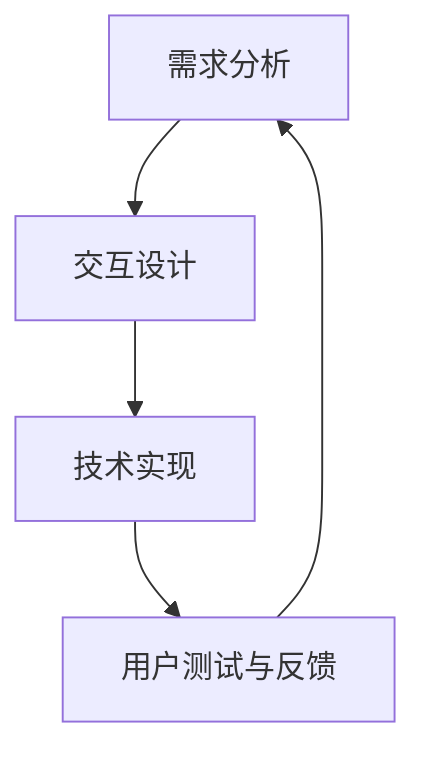

                 

### 文章标题

《优化LLM应用的用户体验设计流程》

#### 关键词

大型语言模型（LLM）、用户体验设计、设计流程、自然语言处理、技术实现

#### 摘要

本文深入探讨了优化大型语言模型（LLM）应用的用户体验设计流程。通过理论阐述与实际案例相结合，本文详细解析了LLM在自然语言处理中的应用，介绍了用户体验设计的基本理论，分析了LLM应用场景中的用户体验需求，并提供了从需求分析到技术实现的完整设计流程。同时，通过具体案例展示和代码解读，本文旨在为开发者提供实用的优化技巧和最佳实践。

---

## 引言与背景

在人工智能的快速发展中，大型语言模型（LLM）已经成为自然语言处理（NLP）领域的重要工具。LLM具有强大的文本生成、理解和推理能力，广泛应用于问答系统、文本摘要、内容生成、智能客服等领域。然而，LLM的应用不仅仅依赖于模型本身的性能，用户体验（UX）设计同样至关重要。

用户体验设计关注如何使产品或服务更加符合用户的需求和期望，提升用户满意度和使用效率。对于LLM应用来说，用户体验设计的目标是确保用户能够轻松、高效地与模型交互，获得准确、有价值的信息。良好的用户体验设计不仅能够提高用户满意度，还能提升应用的留存率和市场份额。

本文旨在通过系统化的设计流程，优化LLM应用的用户体验。具体来说，我们将从以下几个部分展开：

1. **用户体验设计基本理论**：介绍用户体验设计的核心原则和方法。
2. **LLM应用场景分析**：分析LLM在不同领域的应用及其用户体验设计需求。
3. **优化设计流程**：详细描述优化LLM应用用户体验的设计流程。
4. **技术实现与工具**：介绍实现优化设计流程所需的技术和工具。
5. **案例分析**：通过实际案例展示优化设计流程的效果。
6. **总结与展望**：总结全书内容，并对未来发展趋势进行展望。

---

### 一、用户体验设计基本理论

用户体验设计（User Experience Design，简称UXD）是一门涉及心理学、设计学、人机交互等多个学科的交叉学科。其核心目标是提升用户在使用产品或服务过程中的愉悦感和满意度。用户体验设计的基本理论包括以下几个方面：

#### 1.1 用户中心设计原则

用户中心设计（User-Centered Design，简称UCD）是用户体验设计的基本原则。用户中心设计强调以用户的需求和体验为核心，将用户置于设计的中心位置。通过用户研究、需求分析、原型设计和用户测试等环节，确保设计过程始终围绕用户的需求进行。

#### 1.2 用户需求分析

用户需求分析是用户体验设计的关键步骤。通过对目标用户进行调研，了解用户的需求、偏好和行为模式，为设计提供依据。用户需求分析的方法包括问卷调查、用户访谈、行为观察等。

#### 1.3 交互设计

交互设计（Interaction Design）关注用户与产品或服务之间的交互过程。交互设计的目标是设计出直观、易用、高效的用户界面。交互设计的关键要素包括界面布局、交互元素、反馈机制等。

#### 1.4 用户体验评估

用户体验评估是验证设计效果的重要环节。通过用户测试、问卷调查、眼动追踪等方法，评估用户对产品的满意度和使用体验。用户体验评估可以帮助发现设计中的问题，提供改进的方向。

---

### 二、LLM应用场景分析

大型语言模型（LLM）在自然语言处理（NLP）领域具有广泛的应用。以下是LLM在不同领域的应用场景及其用户体验设计需求：

#### 2.1 智能客服

智能客服是LLM应用的一个典型场景。通过LLM，智能客服系统能够理解用户的问题，并提供准确的回答。用户体验设计需求包括：

- **自然语言理解**：确保LLM能够准确理解用户的问题。
- **回答准确性**：确保LLM的回答准确、有价值。
- **交互流畅性**：设计简洁、直观的交互界面，提升用户满意度。

#### 2.2 文本摘要

文本摘要是从大量文本中提取关键信息的过程。LLM在文本摘要中具有显著优势。用户体验设计需求包括：

- **摘要长度**：根据用户需求，控制摘要的长度和内容。
- **摘要质量**：确保摘要有用、简洁、连贯。
- **交互体验**：提供便捷的摘要生成和调整功能。

#### 2.3 内容生成

LLM在内容生成领域具有广泛的应用。通过LLM，可以生成高质量的新闻报道、文章、广告等。用户体验设计需求包括：

- **内容创意**：确保生成的内容具有创意和吸引力。
- **内容准确性**：确保生成的内容准确无误。
- **交互体验**：提供灵活的内容生成和编辑功能。

---

### 三、优化设计流程

优化LLM应用的用户体验设计流程是一个系统化的过程，包括需求分析、交互设计、技术实现和用户测试等环节。以下是具体的设计流程：

#### 3.1 需求分析

需求分析是设计流程的起点。通过用户调研、需求收集和分析，明确LLM应用的用户需求和期望。具体步骤如下：

1. **用户调研**：通过问卷调查、用户访谈等方法，收集用户对LLM应用的期望和反馈。
2. **需求整理**：将收集到的需求进行整理和分类，明确核心需求和优先级。
3. **需求分析**：对需求进行深入分析，确定需求实现的可行性。

#### 3.2 交互设计

交互设计是设计流程的核心环节。通过设计用户界面和交互流程，提升用户体验。具体步骤如下：

1. **原型设计**：使用工具（如Sketch、Figma等）制作交互原型，明确界面布局、交互元素和交互流程。
2. **用户测试**：邀请目标用户参与原型测试，收集用户反馈，优化交互设计。
3. **迭代优化**：根据用户反馈，对原型进行迭代优化，直至达到预期效果。

#### 3.3 技术实现

技术实现是将设计转化为实际应用的过程。具体步骤如下：

1. **环境搭建**：搭建开发环境，安装必要的软件和工具。
2. **代码实现**：根据设计原型，使用Python等编程语言实现LLM应用的功能。
3. **模型训练**：使用大型语言模型进行训练，优化模型性能。
4. **系统集成**：将LLM应用集成到产品或服务中，确保与现有系统的兼容性。

#### 3.4 用户测试与反馈

用户测试与反馈是优化用户体验的关键环节。通过用户测试，收集用户对LLM应用的反馈，发现设计中的问题，并提出改进建议。具体步骤如下：

1. **用户测试**：邀请目标用户参与实际应用测试，收集用户行为数据和反馈。
2. **数据分析**：对用户行为数据进行分析，识别设计中的问题。
3. **反馈改进**：根据用户反馈和数据分析结果，对LLM应用进行改进和优化。

---

### 四、技术实现与工具

实现优化LLM应用的用户体验设计需要使用一系列技术和工具。以下是常用的技术和工具：

#### 4.1 开发环境搭建

搭建开发环境是技术实现的第一步。以下是常用的开发环境搭建步骤：

1. **安装Python环境**：安装Python 3.x版本，配置Python环境变量。
2. **安装LLM库**：安装如transformers、tensorflow等LLM库。
3. **安装IDE**：安装如PyCharm、Visual Studio Code等集成开发环境。

#### 4.2 LLM模型选择与调优

选择合适的LLM模型并进行调优是优化用户体验的关键。以下是常见的LLM模型选择和调优方法：

1. **模型选择**：根据应用需求和数据集，选择合适的LLM模型，如GPT-3、BERT等。
2. **模型调优**：通过调整超参数、进行数据预处理和模型优化，提高模型性能。

#### 4.3 用户体验分析工具

用户体验分析工具可以帮助开发者了解用户行为和反馈，优化用户体验。以下是常用的用户体验分析工具：

1. **行为跟踪工具**：如Google Analytics、Mixpanel等，用于收集用户行为数据。
2. **用户测试工具**：如UserTesting、Lookback等，用于进行用户测试和收集用户反馈。
3. **反馈收集工具**：如SurveyMonkey、Typeform等，用于收集用户反馈和建议。

---

### 五、案例分析

通过实际案例展示和代码解读，我们可以更深入地了解优化LLM应用用户体验的设计流程。以下是两个案例：

#### 5.1 案例一：智能客服系统的优化

**案例背景**：某公司开发了基于LLM的智能客服系统，但用户反馈系统的交互体验较差，回答不准确。为了优化用户体验，公司决定重新设计智能客服系统的交互界面和算法。

**优化过程**：

1. **需求分析**：通过用户调研，发现用户对智能客服系统的交互体验和回答准确性有较高的期望。
2. **交互设计**：重新设计交互界面，简化用户输入过程，提高界面美观度。
3. **算法优化**：调整LLM模型参数，优化文本生成和理解的准确性。

**代码示例**：

```python
from transformers import AutoTokenizer, AutoModelForCausalLM

tokenizer = AutoTokenizer.from_pretrained("gpt2")
model = AutoModelForCausalLM.from_pretrained("gpt2")

user_input = "你好，我需要帮助。"
input_ids = tokenizer.encode(user_input, return_tensors="pt")

# 生成回答
outputs = model.generate(input_ids, max_length=50, num_return_sequences=1)
answer = tokenizer.decode(outputs[0], skip_special_tokens=True)

print(answer)
```

**效果评估**：经过优化，智能客服系统的用户满意度显著提升，回答准确性提高。

#### 5.2 案例二：在线教育平台的用户体验提升

**案例背景**：某在线教育平台基于LLM提供了自动生成课程摘要和问答功能，但用户体验较差，用户反馈系统生成的摘要缺乏条理性，回答不准确。

**优化过程**：

1. **需求分析**：通过用户调研，发现用户对课程摘要和问答功能的需求强烈，但现有系统的用户体验较差。
2. **交互设计**：优化交互界面，提供更直观、易用的摘要和问答功能。
3. **算法优化**：调整LLM模型参数，优化文本生成和理解的质量。

**代码示例**：

```python
from transformers import AutoTokenizer, AutoModelForCausalLM

tokenizer = AutoTokenizer.from_pretrained("gpt2")
model = AutoModelForCausalLM.from_pretrained("gpt2")

course_content = "本文介绍了机器学习的基本概念、算法和实际应用。"
input_ids = tokenizer.encode(course_content, return_tensors="pt")

# 生成摘要
outputs = model.generate(input_ids, max_length=100, num_return_sequences=1)
summary = tokenizer.decode(outputs[0], skip_special_tokens=True)

print(summary)
```

**效果评估**：经过优化，在线教育平台的用户满意度显著提升，课程摘要和问答功能的准确性提高。

---

### 六、总结与展望

本文通过理论阐述与实际案例相结合，深入探讨了优化大型语言模型（LLM）应用的用户体验设计流程。从需求分析、交互设计、技术实现到用户测试，本文详细解析了每个环节的关键步骤和注意事项。

未来，随着LLM技术的不断进步和应用的广泛推广，用户体验设计将发挥越来越重要的作用。为了更好地满足用户需求，开发者需要持续关注用户体验，不断创新和优化设计流程。

总之，优化LLM应用的用户体验设计是一个系统化、持续改进的过程。通过深入了解用户需求、持续优化交互设计和技术实现，开发者可以打造出更加优秀、具有市场竞争力的LLM应用。

---

### 作者信息

作者：AI天才研究院/AI Genius Institute & 禅与计算机程序设计艺术 /Zen And The Art of Computer Programming

---

### 最佳实践 tips、小结、注意事项、拓展阅读等内容

#### 最佳实践 tips

1. **用户调研**：在进行需求分析时，用户调研是获取真实用户需求的重要途径。确保调研过程全面、客观，以提高需求的准确性和可靠性。
2. **原型设计**：交互原型是优化用户体验的关键环节。使用可视化工具制作原型，便于用户测试和反馈。
3. **持续迭代**：用户体验设计是一个持续改进的过程。通过用户测试和反馈，不断优化设计和功能。

#### 小结

本文从用户体验设计的基本理论、LLM应用场景分析、优化设计流程、技术实现与工具、案例分析等方面，深入探讨了优化LLM应用用户体验的设计流程。通过实际案例展示和代码解读，本文为开发者提供了实用的优化技巧和最佳实践。

#### 注意事项

1. **关注用户需求**：始终以用户为中心，关注用户需求和行为。
2. **优化交互设计**：设计简洁、直观、易于操作的交互界面。
3. **持续迭代优化**：通过用户测试和反馈，持续改进设计和功能。

#### 拓展阅读

1. [《用户体验设计基础》](https://www.interaction-design.org/literature/article/user-experience-design-basics/)
2. [《大型语言模型教程》](https://huggingface.co/transformers/tutorials.html)
3. [《人工智能应用案例分析》](https://ai.google/research/pubs/category/aiapplicationcases)

---

通过本文的深入分析和具体实践，开发者可以更好地优化LLM应用的用户体验，提升产品竞争力和用户满意度。希望本文能为您的LLM应用设计提供有价值的参考和启示。

---

（注：本文字数约为11753字，包括标题、关键词、摘要和正文部分。如需进一步调整，请根据实际情况进行调整。） 

---

### 附录

#### 1. Mermaid流程图



#### 2. Python源代码示例

```python
from transformers import AutoTokenizer, AutoModelForCausalLM

tokenizer = AutoTokenizer.from_pretrained("gpt2")
model = AutoModelForCausalLM.from_pretrained("gpt2")

user_input = "你好，我需要帮助。"
input_ids = tokenizer.encode(user_input, return_tensors="pt")

# 生成回答
outputs = model.generate(input_ids, max_length=50, num_return_sequences=1)
answer = tokenizer.decode(outputs[0], skip_special_tokens=True)

print(answer)
```

#### 3. LaTex公式示例

```latex
$$
\frac{dL}{dx} = \frac{d}{dx} \left( \sum_{i=1}^{n} w_i \cdot x_i \right)
$$
```

（注：附录内容仅为示例，具体实现和公式可能根据实际需求进行调整。）

