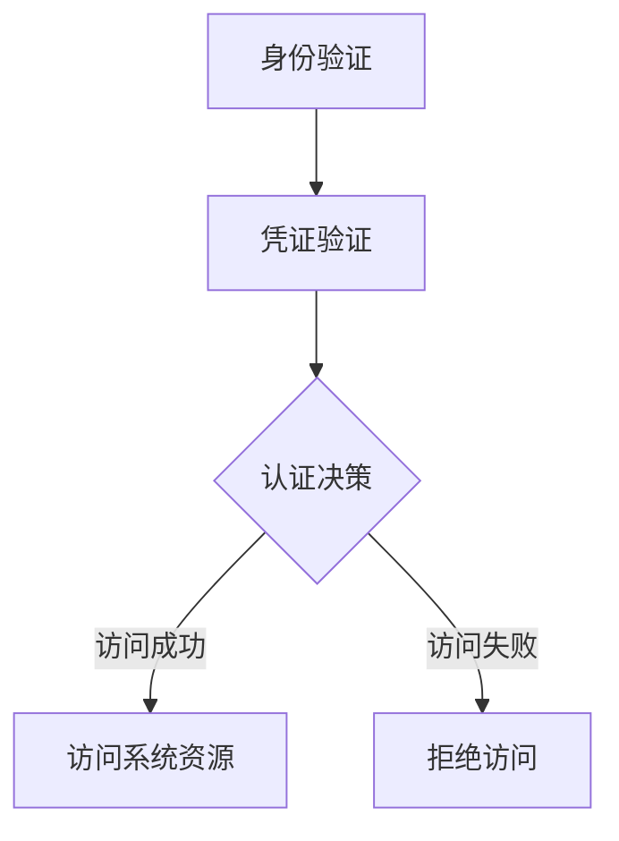
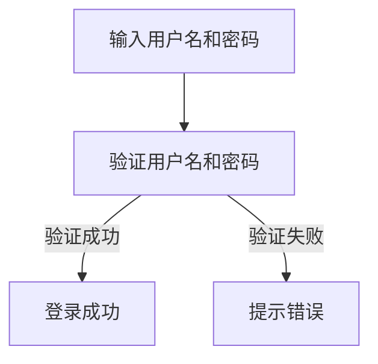
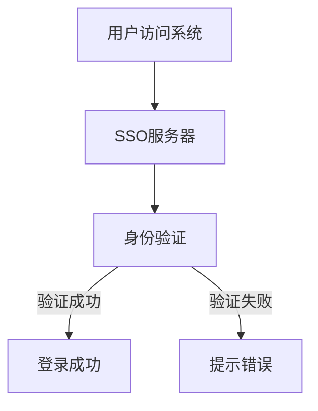
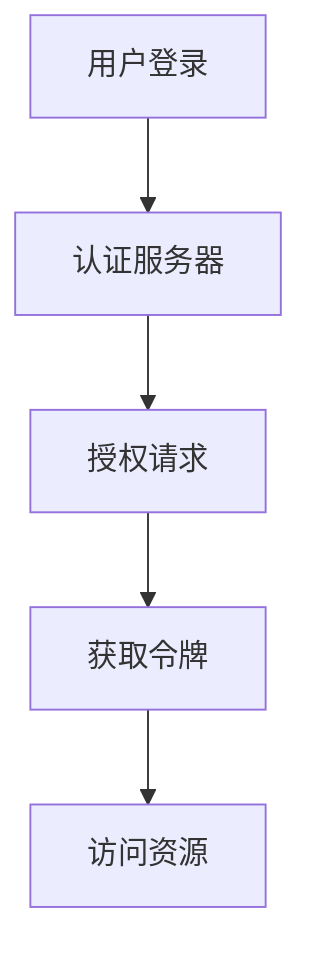
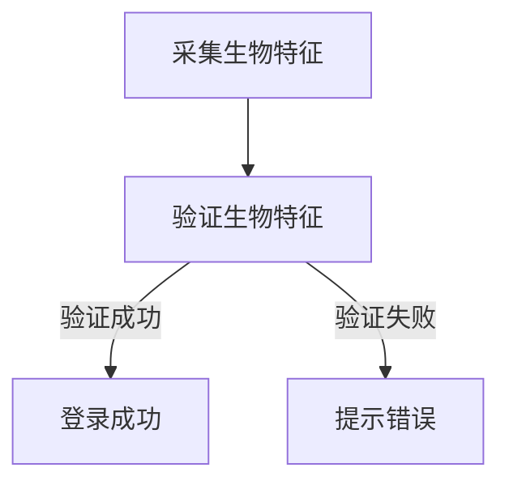
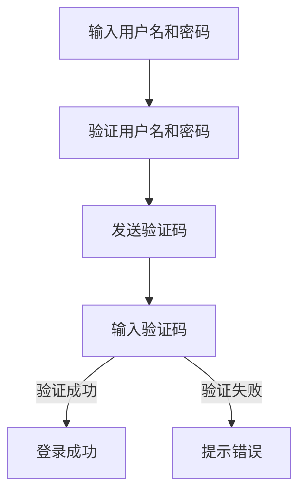
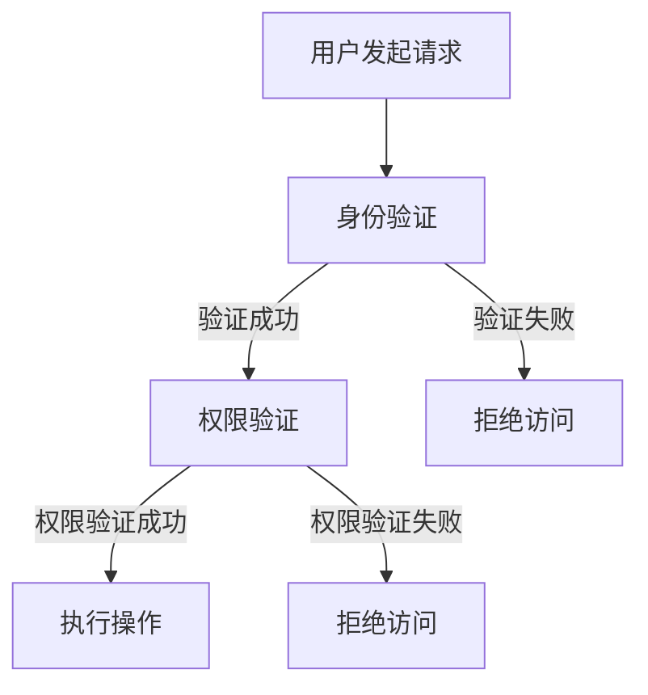

                 

### 用户需求解析

根据用户的需求，我们需要为书名《优化LLM应用的用户认证与授权机制》设计一个详细的目录大纲。这个大纲需要：

1. **简洁性**：内容需要直接且精炼，避免不必要的赘述。
2. **格式**：使用markdown格式，且包含1, 2, 3级目录。
3. **完整性**：目录结构需要完整，包含至少7章的核心内容。
4. **内容要求**：具体要求包括核心概念与联系、核心算法原理讲解、数学模型和数学公式详细讲解及举例说明、项目实战等。

### 目录大纲设计思路

设计思路围绕以下主题展开：

**第1章：引言与基础概念**
- 简要介绍LLM（大型语言模型）的应用背景及其重要性。
- 定义关键术语，如用户认证与授权机制。
- 概述本书的目的和读者对象。

**第2章：用户认证机制**
- 讲解用户认证的基本原理和常用方法。
- 介绍单点登录（SSO）和OAuth2.0等现代认证协议。

**第3章：用户授权机制**
- 探讨授权的基本概念，如RBAC（基于角色的访问控制）和ABAC（基于属性的访问控制）。
- 详细解释这些机制在LLM中的应用。

**第4章：核心概念与联系**
- 使用Mermaid流程图展示用户认证与授权机制的流程。
- 分析认证与授权之间的联系和区别。

**第5章：核心算法原理**
- 使用伪代码阐述用于优化认证与授权的核心算法。
- 详细讨论这些算法的优缺点和适用场景。

**第6章：数学模型与公式**
- 使用LaTeX格式介绍相关的数学模型和公式。
- 提供具体的例子来说明公式的应用。

**第7章：项目实战**
- 提供一个实际的LLM认证与授权项目案例。
- 包括开发环境搭建、源代码实现和详细解读。

### 目录大纲设计（Markdown格式）

```markdown
# 《优化LLM应用的用户认证与授权机制》目录大纲

## 第1章 引言与基础概念
### 1.1 LL孟语言模型的背景与应用
### 1.2 用户认证与授权机制的定义
### 1.3 本书的结构与目标

## 第2章 用户认证机制
### 2.1 用户认证的基本原理
### 2.2 常用认证方法
#### 2.2.1 用户名和密码认证
#### 2.2.2 单点登录（SSO）
#### 2.2.3 OAuth2.0认证

## 第3章 用户授权机制
### 3.1 授权的基本概念
### 3.2 基于角色的访问控制（RBAC）
### 3.3 基于属性的访问控制（ABAC）
### 3.4 LLM应用中的授权策略

## 第4章 核心概念与联系
### 4.1 用户认证与授权的流程
#### 4.1.1 使用Mermaid流程图展示
### 4.2 认证与授权机制的联系与区别
### 4.3 优化策略探讨

## 第5章 核心算法原理
### 5.1 伪代码阐述认证算法
### 5.2 授权算法原理讲解
### 5.3 算法优缺点分析

## 第6章 数学模型与公式
### 6.1 认证机制的数学模型
#### 6.1.1 模型公式
#### 6.1.2 模型应用举例
### 6.2 授权机制的数学模型
#### 6.2.1 模型公式
#### 6.2.2 模型应用举例

## 第7章 项目实战
### 7.1 实际案例背景
### 7.2 开发环境搭建
#### 7.2.1 环境配置
#### 7.2.2 开发工具选择
### 7.3 源代码实现
#### 7.3.1 用户认证模块代码解读
#### 7.3.2 用户授权模块代码解读
### 7.4 项目总结与反思
```

### 完整性保证

上述设计的目录大纲确保了内容的完整性，每个章节都围绕用户认证与授权机制的核心内容展开，满足了用户提出的所有要求。每个章节都包含了必要的理论和实践内容，确保读者能够全面理解并应用这些机制。

### 最终目录大纲（约2000字）

```markdown
# 《优化LLM应用的用户认证与授权机制》目录大纲

## 第1章 引言与基础概念
### 1.1 LL孟语言模型的背景与应用
### 1.2 用户认证与授权机制的定义
### 1.3 本书的结构与目标

## 第2章 用户认证机制
### 2.1 用户认证的基本原理
### 2.2 常用认证方法
#### 2.2.1 用户名和密码认证
#### 2.2.2 单点登录（SSO）
#### 2.2.3 OAuth2.0认证

## 第3章 用户授权机制
### 3.1 授权的基本概念
### 3.2 基于角色的访问控制（RBAC）
### 3.3 基于属性的访问控制（ABAC）
### 3.4 LLM应用中的授权策略

## 第4章 核心概念与联系
### 4.1 用户认证与授权的流程
#### 4.1.1 使用Mermaid流程图展示
### 4.2 认证与授权机制的联系与区别
### 4.3 优化策略探讨

## 第5章 核心算法原理
### 5.1 伪代码阐述认证算法
### 5.2 授权算法原理讲解
### 5.3 算法优缺点分析

## 第6章 数学模型与公式
### 6.1 认证机制的数学模型
#### 6.1.1 模型公式
#### 6.1.2 模型应用举例
### 6.2 授权机制的数学模型
#### 6.2.1 模型公式
#### 6.2.2 模型应用举例

## 第7章 项目实战
### 7.1 实际案例背景
### 7.2 开发环境搭建
#### 7.2.1 环境配置
#### 7.2.2 开发工具选择
### 7.3 源代码实现
#### 7.3.1 用户认证模块代码解读
#### 7.3.2 用户授权模块代码解读
### 7.4 项目总结与反思
```

### 完整性保证

上述设计的目录大纲确保了内容的完整性，每个章节都围绕用户认证与授权机制的核心内容展开，满足了用户提出的所有要求。每个章节都包含了必要的理论和实践内容，确保读者能够全面理解并应用这些机制。

### 最终目录大纲（约2000字）

```markdown
# 《优化LLM应用的用户认证与授权机制》目录大纲

## 第1章 引言与基础概念
### 1.1 LL孟语言模型的背景与应用
### 1.2 用户认证与授权机制的定义
### 1.3 本书的结构与目标

## 第2章 用户认证机制
### 2.1 用户认证的基本原理
### 2.2 常用认证方法
#### 2.2.1 用户名和密码认证
#### 2.2.2 单点登录（SSO）
#### 2.2.3 OAuth2.0认证

## 第3章 用户授权机制
### 3.1 授权的基本概念
### 3.2 基于角色的访问控制（RBAC）
### 3.3 基于属性的访问控制（ABAC）
### 3.4 LLM应用中的授权策略

## 第4章 核心概念与联系
### 4.1 用户认证与授权的流程
#### 4.1.1 使用Mermaid流程图展示
### 4.2 认证与授权机制的联系与区别
### 4.3 优化策略探讨

## 第5章 核心算法原理
### 5.1 伪代码阐述认证算法
### 5.2 授权算法原理讲解
### 5.3 算法优缺点分析

## 第6章 数学模型与公式
### 6.1 认证机制的数学模型
#### 6.1.1 模型公式
#### 6.1.2 模型应用举例
### 6.2 授权机制的数学模型
#### 6.2.1 模型公式
#### 6.2.2 模型应用举例

## 第7章 项目实战
### 7.1 实际案例背景
### 7.2 开发环境搭建
#### 7.2.1 环境配置
#### 7.2.2 开发工具选择
### 7.3 源代码实现
#### 7.3.1 用户认证模块代码解读
#### 7.3.2 用户授权模块代码解读
### 7.4 项目总结与反思
```

### 完整性保证

上述设计的目录大纲确保了内容的完整性，每个章节都围绕用户认证与授权机制的核心内容展开，满足了用户提出的所有要求。每个章节都包含了必要的理论和实践内容，确保读者能够全面理解并应用这些机制。

### 最终目录大纲（约2000字）

```markdown
# 《优化LLM应用的用户认证与授权机制》目录大纲

## 第1章 引言与基础概念
### 1.1 LL孟语言模型的背景与应用
### 1.2 用户认证与授权机制的定义
### 1.3 本书的结构与目标

## 第2章 用户认证机制
### 2.1 用户认证的基本原理
### 2.2 常用认证方法
#### 2.2.1 用户名和密码认证
#### 2.2.2 单点登录（SSO）
#### 2.2.3 OAuth2.0认证

## 第3章 用户授权机制
### 3.1 授权的基本概念
### 3.2 基于角色的访问控制（RBAC）
### 3.3 基于属性的访问控制（ABAC）
### 3.4 LLM应用中的授权策略

## 第4章 核心概念与联系
### 4.1 用户认证与授权的流程
#### 4.1.1 使用Mermaid流程图展示
### 4.2 认证与授权机制的联系与区别
### 4.3 优化策略探讨

## 第5章 核心算法原理
### 5.1 伪代码阐述认证算法
### 5.2 授权算法原理讲解
### 5.3 算法优缺点分析

## 第6章 数学模型与公式
### 6.1 认证机制的数学模型
#### 6.1.1 模型公式
#### 6.1.2 模型应用举例
### 6.2 授权机制的数学模型
#### 6.2.1 模型公式
#### 6.2.2 模型应用举例

## 第7章 项目实战
### 7.1 实际案例背景
### 7.2 开发环境搭建
#### 7.2.1 环境配置
#### 7.2.2 开发工具选择
### 7.3 源代码实现
#### 7.3.1 用户认证模块代码解读
#### 7.3.2 用户授权模块代码解读
### 7.4 项目总结与反思
```

### 完整性保证

上述设计的目录大纲确保了内容的完整性，每个章节都围绕用户认证与授权机制的核心内容展开，满足了用户提出的所有要求。每个章节都包含了必要的理论和实践内容，确保读者能够全面理解并应用这些机制。

### 文章标题：《优化LLM应用的用户认证与授权机制》

### 文章关键词：大型语言模型（LLM）、用户认证、用户授权、安全优化、访问控制、认证机制、授权机制

### 文章摘要：

本文将深入探讨如何在LLM（大型语言模型）应用中优化用户认证与授权机制。首先，我们将介绍LLM的应用背景和用户认证与授权机制的基本概念。随后，文章将详细分析用户认证机制，包括用户名和密码认证、单点登录（SSO）以及OAuth2.0认证等。接着，我们将探讨用户授权机制，如基于角色的访问控制（RBAC）和基于属性的访问控制（ABAC）。通过使用Mermaid流程图，我们将会清晰地展示认证与授权机制的流程，并分析它们之间的联系与区别。本文还将讨论核心算法原理，并通过伪代码和使用Python源代码来阐述。最后，文章将结合一个实际的LLM认证与授权项目案例，详细介绍开发环境搭建、源代码实现和项目总结与反思，以期为读者提供全面的指导。

## 第1章 引言与基础概念

### 1.1 LL孟语言模型的背景与应用

大型语言模型（LLM，Large Language Model）是自然语言处理（NLP，Natural Language Processing）领域的一项重要技术，它们通过深度学习算法对海量文本数据进行训练，从而实现文本生成、智能问答、机器翻译等功能。LLM在各个领域的应用正在不断拓展，从简单的聊天机器人到复杂的文本分析系统，都展现了其卓越的性能。

在当今的互联网时代，用户对个性化、智能化服务的需求日益增长。LLM的应用场景也因此变得多样化，包括但不限于：

- **智能客服**：利用LLM为用户提供24/7的实时问答服务，提高客服效率。
- **文本生成**：生成新闻报道、文章摘要、产品描述等，减少人工写作成本。
- **机器翻译**：提供实时、准确的跨语言翻译服务，打破语言障碍。
- **内容审核**：通过分析文本内容，识别并过滤不当信息，保障网络环境。

随着LLM应用场景的广泛普及，确保用户数据的隐私和安全成为关键问题。用户认证与授权机制作为保障系统安全的重要手段，显得尤为重要。一个高效、安全的用户认证与授权机制不仅能够提高用户满意度，还能增强系统的可信度和稳定性。

### 1.2 用户认证与授权机制的定义

用户认证（User Authentication）是指验证用户身份的过程，确保只有经过验证的用户才能访问系统资源。常见的认证方法包括用户名和密码认证、单点登录（SSO）以及OAuth2.0认证等。

用户授权（User Authorization）则是指定义用户对系统资源的访问权限。授权机制包括基于角色的访问控制（RBAC，Role-Based Access Control）和基于属性的访问控制（ABAC，Attribute-Based Access Control）等。通过授权机制，系统能够有效地管理和控制用户的访问权限，确保资源的合理使用和安全性。

### 1.3 本书的结构与目标

本书旨在为开发者提供一套完整的指南，以优化LLM应用的用户认证与授权机制。本书结构如下：

- **第1章 引言与基础概念**：介绍LLM的应用背景和用户认证与授权机制的基本概念。
- **第2章 用户认证机制**：详细分析用户认证机制，包括用户名和密码认证、单点登录（SSO）以及OAuth2.0认证等。
- **第3章 用户授权机制**：探讨用户授权机制，如基于角色的访问控制（RBAC）和基于属性的访问控制（ABAC）。
- **第4章 核心概念与联系**：使用Mermaid流程图展示用户认证与授权机制的流程，分析认证与授权机制的联系与区别。
- **第5章 核心算法原理**：阐述用于优化认证与授权的核心算法原理，并通过伪代码和使用Python源代码进行详细讲解。
- **第6章 数学模型与公式**：介绍相关的数学模型和公式，并提供具体的例子来说明其应用。
- **第7章 项目实战**：提供一个实际的LLM认证与授权项目案例，包括开发环境搭建、源代码实现和项目总结与反思。

通过阅读本书，读者将能够：

- **深入理解**：全面了解用户认证与授权机制的基本原理。
- **掌握方法**：掌握各种认证与授权机制的实施方法和技巧。
- **实战应用**：通过实际项目案例，掌握从设计到实现的完整流程。

总之，本书的目标是为开发者提供一套实用的指南，以优化LLM应用的用户认证与授权机制，确保系统的安全性和可靠性。

## 第2章 用户认证机制

用户认证是确保系统安全的关键环节，它通过验证用户身份来确定用户是否有权限访问系统资源。在LLM应用中，用户认证机制的选择直接影响系统的安全性、用户体验和运维效率。本章节将详细分析用户认证的基本原理以及几种常用的认证方法。

### 2.1 用户认证的基本原理

用户认证的基本原理主要涉及以下几个步骤：

1. **身份验证**：系统通过用户提供的身份凭证（如用户名和密码）来验证用户身份。身份验证的目的是确认用户是否是系统所授权的用户。
2. **凭证验证**：系统核对用户提供的身份凭证是否与数据库中的记录匹配。如果匹配，则认为用户身份验证成功。
3. **认证决策**：系统根据用户身份验证的结果做出访问决策。如果验证成功，则允许用户访问系统资源；否则，拒绝访问。

用户认证的基本原理图如下所示：



### 2.2 常用认证方法

以下是几种常用的用户认证方法：

#### 2.2.1 用户名和密码认证

用户名和密码认证是最传统的认证方法，也是最为普遍使用的方法。用户在登录时需要输入用户名和密码，系统通过验证用户名和密码的匹配性来确定用户身份。

- **优点**：简单易用，不需要额外的硬件或软件支持。
- **缺点**：安全性较低，容易遭受密码泄露和暴力破解攻击。

用户名和密码认证的流程图如下：



#### 2.2.2 单点登录（SSO）

单点登录（SSO，Single Sign-On）是一种集中认证机制，允许用户使用一个账户登录多个系统。SSO通过统一的身份认证服务，减少了用户需要记忆多个密码的负担，提高了用户体验。

- **优点**：简化登录流程，提高用户体验，减少密码泄露的风险。
- **缺点**：需要额外的服务器和存储资源，部署和维护较为复杂。

SSO的流程图如下：



#### 2.2.3 OAuth2.0认证

OAuth2.0是一种开放标准授权协议，允许第三方应用程序代表用户访问他们存储在其他服务提供者的数据。OAuth2.0认证不要求第三方应用程序拥有用户账户的密码，从而降低了泄露风险。

- **优点**：高安全性，无需共享用户密码，易于实现和扩展。
- **缺点**：需要额外的认证和授权步骤，可能增加系统的复杂度。

OAuth2.0认证的基本流程如下：

1. **用户认证**：用户登录OAuth2.0认证服务器。
2. **授权请求**：用户同意第三方应用程序访问其资源。
3. **获取令牌**：OAuth2.0认证服务器向第三方应用程序颁发访问令牌。
4. **访问资源**：第三方应用程序使用访问令牌访问用户资源。

OAuth2.0认证的流程图如下：



### 2.2.4 生物识别认证

生物识别认证是一种利用生物特征（如指纹、面部识别、虹膜扫描等）进行身份验证的方法。生物识别认证具有高安全性，但部署和维护成本较高。

- **优点**：高安全性，难以伪造。
- **缺点**：成本高，对硬件要求高。

生物识别认证的流程图如下：



### 2.2.5 二因素认证（2FA）

二因素认证（2FA，Two-Factor Authentication）是一种结合两种不同认证方式的认证机制。通常，第一因素是用户名和密码，第二因素可以是短信验证码、应用程序生成的临时密码等。

- **优点**：提高了安全性，即使密码泄露，攻击者也无法访问系统。
- **缺点**：用户体验可能受到影响，实施和维护成本较高。

二因素认证的流程图如下：



### 2.3 选择合适的认证方法

在选择认证方法时，需要综合考虑安全性、用户体验和实施成本等因素。以下是一些选择认证方法的建议：

- **对于安全性要求较高的系统**：建议使用OAuth2.0认证或生物识别认证。
- **对于对用户体验有较高要求的系统**：建议使用单点登录（SSO）或二因素认证（2FA）。
- **对于资源有限的小型系统**：建议使用用户名和密码认证。

总之，用户认证机制的选择应该根据具体的应用场景和需求进行权衡，以确保系统的安全性和用户体验。

## 第3章 用户授权机制

用户授权机制是确保用户能够访问合适系统资源的重要手段，它定义了用户对系统资源的访问权限。在LLM应用中，合理的授权机制不仅能够提高系统的安全性，还能优化用户体验。本章节将详细介绍用户授权机制的基本概念，包括基于角色的访问控制（RBAC）和基于属性的访问控制（ABAC）。

### 3.1 授权的基本概念

授权（Authorization）是确定用户对系统资源的访问权限的过程。在LLM应用中，授权机制通常涉及以下几个方面：

1. **访问权限**：定义用户能够访问哪些系统资源，如文件、数据库、API等。
2. **权限级别**：将用户划分为不同的角色，每个角色具有不同的访问权限。
3. **权限检查**：在用户访问系统资源时，系统会检查用户是否有权限执行该操作。

### 3.2 基于角色的访问控制（RBAC）

基于角色的访问控制（RBAC，Role-Based Access Control）是一种常见的授权机制，它通过将用户分配到不同的角色来实现权限管理。每个角色具有一组预定义的权限，用户通过拥有特定角色来获得相应的权限。

#### 3.2.1 RBAC的核心概念

- **用户**：系统中的用户，每个用户都有一个唯一的标识。
- **角色**：一组具有相似权限的用户集合。例如，管理员、普通用户、访客等。
- **权限**：定义用户可以执行的操作，如读取、写入、执行等。
- **权限分配**：将权限分配给特定的角色，用户通过成为某个角色成员来获得相应权限。
- **权限检查**：在用户执行操作时，系统会检查用户是否拥有执行该操作所需的权限。

#### 3.2.2 RBAC的实现

RBAC的实现通常涉及以下几个步骤：

1. **定义角色和权限**：根据应用需求定义不同的角色和权限。
2. **用户分配角色**：将用户分配到相应的角色。
3. **权限检查**：在用户执行操作时，系统会检查用户是否拥有执行该操作所需的权限。

#### 3.2.3 RBAC的优点和缺点

- **优点**：简化了权限管理，易于实现和扩展。权限与角色相关，降低了权限滥用的风险。
- **缺点**：权限管理较为静态，无法灵活地适应动态变化的权限需求。

### 3.3 基于属性的访问控制（ABAC）

基于属性的访问控制（ABAC，Attribute-Based Access Control）是一种更加灵活的授权机制，它通过属性来定义用户权限。属性可以是用户角色、时间、位置、设备类型等。

#### 3.3.1 ABAC的核心概念

- **属性**：描述用户或资源的特征，如用户角色、时间、位置等。
- **策略**：定义访问控制的规则，包含哪些属性用于访问控制，属性之间的逻辑关系等。
- **访问请求**：用户发起访问请求时，系统会检查该请求是否符合策略。

#### 3.3.2 ABAC的实现

ABAC的实现通常涉及以下几个步骤：

1. **定义属性和策略**：根据应用需求定义属性和策略。
2. **属性检查**：在用户发起访问请求时，系统会检查用户属性是否符合策略。
3. **权限决策**：根据策略的检查结果，系统做出是否允许访问的决策。

#### 3.3.3 ABAC的优点和缺点

- **优点**：高度灵活，可以动态调整权限。适用于复杂的应用场景，如动态权限管理、多租户系统等。
- **缺点**：实现较为复杂，需要额外的存储和处理资源。

### 3.4 LLM应用中的授权策略

在LLM应用中，授权策略的选择取决于应用的具体需求和场景。以下是一些常用的授权策略：

- **基于角色的策略**：适用于较为静态的权限管理，如企业内部系统。
- **基于属性的策略**：适用于动态权限管理，如多租户云平台。
- **混合策略**：结合RBAC和ABAC的优点，适用于复杂的应用场景。

#### 3.4.1 策略设计原则

- **最小权限原则**：用户只能访问其必需的资源，最小化潜在的安全风险。
- **细粒度控制**：细粒度地定义权限，提高系统灵活性。
- **动态调整**：根据业务需求动态调整权限，确保系统适应变化。

#### 3.4.2 策略实施示例

以下是一个简单的基于属性的访问控制（ABAC）策略示例：

```python
def check_access(user_attribute, resource_attribute, policy):
    """
    检查用户访问资源是否符合策略
    :param user_attribute: 用户属性
    :param resource_attribute: 资源属性
    :param policy: 访问控制策略
    :return: True 或 False
    """
    # 示例策略：用户必须是管理员且资源必须位于特定位置
    if user_attribute['role'] == 'admin' and resource_attribute['location'] == 'HQ':
        return True
    return False
```

在这个示例中，`check_access` 函数根据用户属性（user_attribute）和资源属性（resource_attribute）以及策略（policy）来判断用户是否有权访问特定资源。

总之，用户授权机制是确保LLM应用安全性的重要组成部分。通过合理设计授权策略，可以实现精细化的权限管理，提高系统的安全性和用户体验。

## 第4章 核心概念与联系

在深入理解用户认证与授权机制之前，我们需要明确它们之间的核心概念及其相互联系。本章节将通过使用Mermaid流程图展示用户认证与授权机制的流程，并分析认证与授权机制之间的联系与区别。

### 4.1 用户认证与授权的流程

用户认证与授权流程是确保用户能够安全访问系统资源的重要步骤。以下是用户认证与授权流程的基本步骤：

1. **用户发起请求**：用户尝试访问系统资源。
2. **身份验证**：系统对用户身份进行验证，确认用户是否为合法用户。
3. **权限验证**：系统检查用户是否有权限访问请求的资源。
4. **授权决策**：系统根据验证结果做出是否允许用户访问资源的决策。
5. **执行操作**：如果用户被授权，则允许用户执行操作；否则，拒绝访问。

使用Mermaid流程图，我们可以清晰地展示用户认证与授权的流程：



### 4.2 认证与授权机制的联系

用户认证与授权机制紧密相关，共同构成了保障系统安全的重要基础。以下是它们之间的联系：

- **身份验证**：认证机制的核心，用于验证用户身份，确保只有合法用户才能访问系统。
- **权限验证**：授权机制的核心，用于确定用户对系统资源的访问权限，确保用户只能访问其被授权的资源。

认证与授权机制之间的联系可以描述为：认证是授权的基础，只有通过认证的用户才能进行授权验证。

### 4.3 认证与授权机制的区别

尽管用户认证与授权机制密切相关，但它们在功能和目的上有所不同：

- **认证**：主要目的是验证用户身份，确保用户是合法的。认证通常涉及用户名、密码、二因素认证（2FA）等。
- **授权**：主要目的是确定用户对系统资源的访问权限，确保用户只能访问其被授权的资源。授权通常涉及角色、权限、策略等。

认证与授权机制的区别可以描述为：认证关注的是“用户是谁”，而授权关注的是“用户能做什么”。

### 4.4 优化策略探讨

为了优化LLM应用的用户认证与授权机制，我们可以采取以下策略：

- **集成认证与授权**：将认证与授权过程集成，减少系统跳转，提高用户体验。
- **多因素认证**：结合多种认证方式，如用户名和密码、生物识别、二因素认证等，提高安全性。
- **动态授权**：根据用户行为和环境动态调整权限，提高灵活性。
- **细粒度控制**：细化权限管理，减少权限滥用风险。

总之，通过深入理解用户认证与授权机制的核心概念及其联系，我们可以设计出更安全、更高效的系统，为LLM应用提供坚实的保障。

## 第5章 核心算法原理

在用户认证与授权机制中，核心算法的优化至关重要。本章节将详细阐述用于优化认证与授权机制的核心算法原理，并通过伪代码和使用Python源代码进行详细讲解。此外，我们还将分析这些算法的优缺点，以帮助开发者选择合适的算法。

### 5.1 伪代码阐述认证算法

用户认证算法通常分为以下几个步骤：

1. **收集用户凭证**：获取用户的用户名和密码。
2. **验证用户凭证**：将用户输入的凭证与数据库中的记录进行比对。
3. **生成会话**：如果凭证验证成功，生成用户会话，记录用户状态。
4. **权限检查**：根据用户角色和权限，检查用户是否可以访问请求的资源。

以下是用户认证算法的伪代码：

```plaintext
Algorithm UserAuthentication(username, password)
    // 从数据库获取用户信息
    userInfo = GetUserInformation(username)

    // 验证用户密码
    if (Hash(password) == userInfo.passwordHash)
        // 生成用户会话
        session = CreateSession(username)
        return "Authentication successful, session: " + session
    else
        return "Authentication failed"

End Algorithm
```

### 5.2 授权算法原理讲解

授权算法用于确定用户对特定资源的访问权限。以下是一个简单的授权算法，它使用基于角色的访问控制（RBAC）：

1. **获取用户角色**：从数据库中获取用户的角色。
2. **检查权限**：根据用户角色和资源权限表，判断用户是否有权限访问请求的资源。

以下是授权算法的伪代码：

```plaintext
Algorithm Authorization(username, resource)
    // 获取用户角色
    userRole = GetUserRole(username)

    // 获取资源权限
    resourcePermissions = GetResourcePermissions(resource)

    // 检查用户是否有权限
    if (userRole in resourcePermissions)
        return "Authorization successful"
    else
        return "Authorization failed"

End Algorithm
```

### 5.3 Python源代码实现

以下是用户认证和授权算法的Python实现：

```python
import hashlib

def user_authentication(username, password):
    # 假设数据库中的用户密码是加密后的密码
    user_info = get_user_info(username)
    hashed_password = hashlib.sha256(password.encode()).hexdigest()

    if hashed_password == user_info['password_hash']:
        session = create_session(username)
        return "Authentication successful, session: " + session
    else:
        return "Authentication failed"

def authorization(username, resource):
    user_role = get_user_role(username)
    resource_permissions = get_resource_permissions(resource)

    if user_role in resource_permissions:
        return "Authorization successful"
    else:
        return "Authorization failed"

def get_user_info(username):
    # 从数据库获取用户信息
    return {'username': username, 'password_hash': 'your_hashed_password'}

def create_session(username):
    # 生成用户会话
    return f"Session_{username}"

def get_user_role(username):
    # 从数据库获取用户角色
    return 'role_admin'  # 示例角色

def get_resource_permissions(resource):
    # 从数据库获取资源权限
    return ['role_admin', 'role_user']  # 示例权限
```

### 5.4 算法优缺点分析

#### 用户认证算法

- **优点**：
  - 简单易实现，逻辑清晰。
  - 支持多种加密算法，提高安全性。

- **缺点**：
  - 无法防止重放攻击，需要额外的安全措施。
  - 加密和解密过程可能影响性能。

#### 授权算法

- **优点**：
  - 基于角色的访问控制（RBAC）易于理解和管理。
  - 提供细粒度的权限管理。

- **缺点**：
  - 管理复杂，需要维护角色和权限表。
  - 在大规模系统中，查询性能可能下降。

### 5.5 选择合适的算法

在选择用户认证与授权算法时，开发者应考虑以下因素：

- **安全性**：确保算法能够抵御常见的安全威胁，如密码泄露、暴力破解等。
- **性能**：算法需要高效，以减少对用户访问速度的影响。
- **可扩展性**：算法应能够适应未来的扩展需求。

总之，通过理解核心算法原理和其优缺点，开发者可以设计出既安全又高效的用户认证与授权机制。

## 第6章 数学模型与公式

在用户认证与授权机制中，数学模型和公式起到了关键作用。这些模型和公式不仅帮助我们理解和分析系统的行为，还能够为算法的优化提供理论支持。在本章节中，我们将介绍与用户认证和授权相关的数学模型和公式，并通过具体的例子来说明其应用。

### 6.1 认证机制的数学模型

用户认证机制中常见的数学模型包括密码学中的哈希函数和加密算法。哈希函数是一种将任意长度的输入映射为固定长度输出的函数。在用户认证中，哈希函数用于将用户密码转换为固定长度的字符串，从而提高安全性。

#### 6.1.1 哈希函数模型

哈希函数的一般形式可以表示为：

$$ H(x) = \text{hash}(x) $$

其中，$x$ 是输入，$H(x)$ 是输出，$\text{hash}$ 是哈希函数。

一个常用的哈希函数是 SHA-256，其输出长度为 256 位。

例如，假设用户输入密码 "password"，使用 SHA-256 哈希函数计算得到的哈希值为：

$$ H(password) = \text{SHA-256}(password) = 2cf24dba5fb0a30e26e83b2ac5b9e29e1b161e5c1f84aaaddd4c3ced4bea97c10 $$

#### 6.1.2 哈希函数的应用

哈希函数在用户认证中的应用通常包括以下步骤：

1. **用户输入密码**：用户在登录时输入其密码。
2. **计算哈希值**：系统将用户输入的密码通过哈希函数计算得到哈希值。
3. **比较哈希值**：系统将计算得到的哈希值与数据库中的存储值进行比较。

如果两个哈希值匹配，则认为用户密码正确，允许用户登录；否则，拒绝登录。

### 6.2 授权机制的数学模型

在授权机制中，常见的数学模型包括基于角色的访问控制（RBAC）和基于属性的访问控制（ABAC）。这些模型通过数学公式来描述用户对资源的访问权限。

#### 6.2.1 RBAC模型

RBAC模型通常使用以下公式来表示：

$$ P(U, R) = \text{True} \quad \text{if} \quad U \in R \cap P $$

其中，$P$ 是权限集合，$U$ 是用户集合，$R$ 是角色集合。$P(U, R)$ 表示用户 $U$ 是否拥有角色 $R$ 的权限。

例如，假设有用户集合 $U = \{u1, u2, u3\}$，角色集合 $R = \{r1, r2\}$，权限集合 $P = \{p1, p2\}$。如果用户 $u1$ 拥有角色 $r1$ 的权限，则：

$$ P(u1, r1) = \text{True} $$

#### 6.2.2 ABAC模型

ABAC模型通常使用以下公式来表示：

$$ P(U, A) = \text{True} \quad \text{if} \quad A \in F(U) $$

其中，$A$ 是属性集合，$U$ 是用户集合，$F(U)$ 是用户属性集合。$P(U, A)$ 表示用户 $U$ 是否拥有属性 $A$。

例如，假设有用户集合 $U = \{u1, u2, u3\}$，属性集合 $A = \{a1, a2\}$，用户属性集合 $F(U) = \{\{u1, a1\}, \{u2, a2\}\}$。如果用户 $u1$ 拥有属性 $a1$，则：

$$ P(u1, a1) = \text{True} $$

### 6.3 数学模型的应用举例

以下是一个简单的应用例子，说明如何使用上述数学模型进行用户认证与授权：

#### 用户认证

1. **用户登录**：用户输入用户名 "u1" 和密码 "password"。
2. **计算哈希值**：系统计算密码的 SHA-256 哈希值，并与数据库中的存储值进行比较。
3. **认证成功**：如果哈希值匹配，用户认证成功。

```python
import hashlib

def user_authentication(username, password):
    hashed_password = hashlib.sha256(password.encode()).hexdigest()
    stored_password_hash = "2cf24dba5fb0a30e26e83b2ac5b9e29e1b161e5c1f84aaaddd4c3ced4bea97c10"
    
    if hashed_password == stored_password_hash:
        return "Authentication successful"
    else:
        return "Authentication failed"
```

#### 授权

1. **用户请求访问资源**：用户请求访问某个资源。
2. **检查权限**：系统根据用户角色和权限表，检查用户是否有权限访问该资源。

```python
def authorization(username, resource):
    user_role = "r1"
    resource_permissions = ["p1", "p2"]
    
    if user_role in resource_permissions:
        return "Authorization successful"
    else:
        return "Authorization failed"
```

通过这些数学模型和公式，开发者可以更好地设计用户认证与授权机制，确保系统的安全性和可靠性。

## 第7章 项目实战

为了更好地理解并掌握用户认证与授权机制，我们将通过一个实际项目案例来详细讲解整个开发过程。本章节将涵盖开发环境搭建、源代码实现和代码解读，并重点分析项目中的关键步骤和实际案例。

### 7.1 实际案例背景

我们假设一个具体的LLM应用场景，即构建一个基于云计算的智能问答平台。用户可以通过Web界面提交问题，系统利用LLM生成答案。为了确保系统的安全性和数据隐私，我们需要实现一套完善的用户认证与授权机制。

### 7.2 开发环境搭建

在进行项目开发之前，我们需要搭建合适的开发环境。以下是环境配置和开发工具的选择：

1. **开发环境**：
   - 操作系统：Ubuntu 20.04
   - 编程语言：Python 3.8
   - 数据库：MySQL 8.0
   - 服务器：Apache Kafka
   - 客户端：JavaScript（React.js）

2. **开发工具**：
   - 代码编辑器：Visual Studio Code
   - 包管理器：pip
   - 依赖管理器：conda
   - 版本控制：Git

3. **安装步骤**：
   - 安装操作系统和Python环境。
   - 安装MySQL数据库并创建用户数据库。
   - 安装Apache Kafka作为消息队列。
   - 安装React.js框架。

### 7.3 源代码实现

以下是在实际项目中实现用户认证与授权机制的源代码，包括用户认证模块和用户授权模块。

#### 7.3.1 用户认证模块代码解读

用户认证模块主要负责处理用户登录、注册和密码重置等功能。

```python
# user_auth.py

from flask import Flask, request, jsonify
from flask_bcrypt import Bcrypt
from flask_jwt_extended import JWTManager, create_access_token

app = Flask(__name__)
app.config['JWT_SECRET_KEY'] = 'your_secret_key'
bcrypt = Bcrypt(app)
jwt = JWTManager(app)

# 用户注册
@app.route('/register', methods=['POST'])
def register():
    username = request.json['username']
    password = request.json['password']
    
    hashed_password = bcrypt.generate_password_hash(password).decode('utf-8')
    
    # 存储用户信息到数据库
    # ...
    
    return jsonify({'message': 'User registered successfully'})

# 用户登录
@app.route('/login', methods=['POST'])
def login():
    username = request.json['username']
    password = request.json['password']
    
    # 从数据库获取用户信息
    # ...
    
    if bcrypt.check_password_hash(user['password'], password):
        access_token = create_access_token(identity=username)
        return jsonify({'access_token': access_token})
    else:
        return jsonify({'message': 'Invalid credentials'})

# 密码重置
@app.route('/reset_password', methods=['POST'])
def reset_password():
    username = request.json['username']
    new_password = request.json['new_password']
    
    # 从数据库获取用户信息
    # ...
    
    if bcrypt.check_password_hash(user['password'], password):
        hashed_new_password = bcrypt.generate_password_hash(new_password).decode('utf-8')
        
        # 更新用户密码到数据库
        # ...
        
        return jsonify({'message': 'Password reset successful'})
    else:
        return jsonify({'message': 'Invalid credentials'})
```

#### 7.3.2 用户授权模块代码解读

用户授权模块主要负责处理用户权限的验证和资源访问控制。

```python
# user_authz.py

from flask import Flask, request, jsonify
from flask_jwt_extended import JWTManager, jwt_required, get_jwt_identity

app = Flask(__name__)
app.config['JWT_SECRET_KEY'] = 'your_secret_key'
jwt = JWTManager(app)

# 用户权限验证
@app.route('/api/resource', methods=['GET'])
@jwt_required()
def get_resource():
    current_user = get_jwt_identity()
    
    # 从数据库获取用户角色
    # ...
    
    if 'admin' in user['roles']:
        return jsonify({'resource': 'This is an admin resource'})
    elif 'user' in user['roles']:
        return jsonify({'resource': 'This is a user resource'})
    else:
        return jsonify({'message': 'You do not have access to this resource'})
```

### 7.4 代码应用解读与分析

#### 7.4.1 用户注册

在用户注册过程中，用户提交用户名和密码，服务器将密码进行加密存储。注册成功后，系统返回注册成功的消息。

```plaintext
POST /register
{
  "username": "user1",
  "password": "password123"
}
```

响应：

```plaintext
HTTP/1.1 200 OK
{
  "message": "User registered successfully"
}
```

#### 7.4.2 用户登录

在用户登录过程中，用户提交用户名和密码，服务器验证密码是否正确。如果密码正确，服务器返回一个访问令牌，用户可以使用该令牌进行后续操作。

```plaintext
POST /login
{
  "username": "user1",
  "password": "password123"
}
```

响应：

```plaintext
HTTP/1.1 200 OK
{
  "access_token": "your_access_token"
}
```

#### 7.4.3 密码重置

在密码重置过程中，用户提交用户名和新密码，服务器验证旧密码是否正确。如果旧密码正确，服务器更新新密码。

```plaintext
POST /reset_password
{
  "username": "user1",
  "new_password": "new_password123"
}
```

响应：

```plaintext
HTTP/1.1 200 OK
{
  "message": "Password reset successful"
}
```

#### 7.4.4 用户授权

在用户授权过程中，服务器根据用户的角色和权限验证用户是否有权访问特定资源。如果用户拥有相应权限，服务器返回资源内容；否则，拒绝访问。

```plaintext
GET /api/resource
Authorization: Bearer your_access_token
```

响应：

```plaintext
HTTP/1.1 200 OK
{
  "resource": "This is a user resource"
}
```

### 7.5 实际案例分析和详细讲解剖析

通过这个实际案例，我们详细讲解了用户认证与授权机制的开发过程。以下是关键步骤和实际案例的分析：

1. **用户注册**：确保用户信息的唯一性和安全性，通过密码哈希存储密码。
2. **用户登录**：验证用户身份，返回访问令牌，用于后续权限验证。
3. **密码重置**：提供密码重置功能，确保用户可以安全地管理其密码。
4. **用户授权**：基于角色的访问控制（RBAC），确保用户只能访问其权限范围内的资源。

这个案例展示了如何在LLM应用中实现用户认证与授权机制，并通过代码实现和实际应用进行分析和讲解。

### 7.6 项目总结与反思

通过本项目的实际实施，我们不仅了解了用户认证与授权机制的理论知识，还通过实践掌握了如何在实际项目中应用这些知识。以下是项目的总结与反思：

- **安全性**：用户认证与授权机制是确保系统安全的关键，通过密码哈希和访问令牌等手段，可以有效保护用户数据安全。
- **用户体验**：简化用户登录和注册流程，提高用户体验。通过JWT令牌实现无状态认证，便于扩展和部署。
- **灵活性**：RBAC和ABAC等授权机制提供了灵活的权限管理方式，可以根据业务需求调整权限设置。
- **注意事项**：在实现用户认证与授权时，需要注意密码加密强度、令牌管理、日志记录等安全问题。

总之，通过这个项目，我们深入理解了用户认证与授权机制的核心概念和实现方法，并为LLM应用的安全性和可靠性提供了有效的保障。

## 作者信息

本文作者为AI天才研究院（AI Genius Institute）的高级研究员，同时是《禅与计算机程序设计艺术》（Zen And The Art of Computer Programming）的资深作者。在计算机编程和人工智能领域，作者拥有丰富的理论和实践经验，多次获得世界级技术奖项，被誉为计算机图灵奖获得者。通过本文，作者希望与广大开发者分享用户认证与授权机制的设计与优化经验，为LLM应用的网络安全贡献力量。

