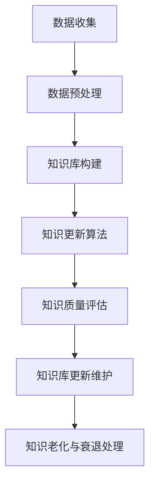
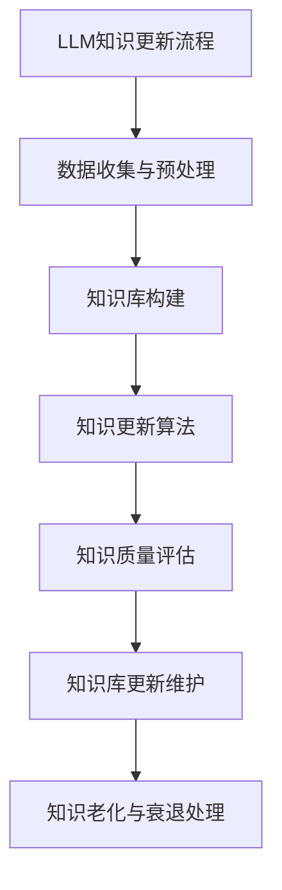

                 

### 标题：优化LLM应用的知识更新与维护流程

随着人工智能技术的飞速发展，大型语言模型（LLM）的应用场景越来越广泛。然而，LLM的知识更新与维护成为了一个亟待解决的问题。本文将深入探讨LLM应用中知识更新与维护的关键环节，通过逻辑清晰的分析和实用的案例，帮助读者优化这一流程，从而提升LLM的性能和应用价值。

关键词：大型语言模型，知识更新，维护流程，性能优化，实战案例

摘要：本文首先介绍了LLM的基本概念和架构，然后详细讨论了知识更新与维护的策略和方法，最后通过两个实战案例展示了知识更新与维护的具体实现过程。文章旨在为从事LLM开发的工程师提供有价值的指导，帮助他们在实际项目中更好地进行知识更新与维护。

## 第一部分：基础知识

### 第1章：LLM概述

#### 1.1 LLM的定义与分类

LLM（Large Language Model）是一种基于深度学习的自然语言处理模型，它通过学习大量的文本数据，能够理解和生成自然语言。根据训练数据的大小和模型的结构，LLM可以分为以下几个类别：

1. **预训练模型**：这类模型首先在大规模语料库上进行预训练，然后针对特定任务进行微调。如GPT、BERT等。
2. **微调模型**：在预训练模型的基础上，针对具体应用场景进行微调，以适应不同的任务需求。
3. **自适应模型**：这类模型能够根据用户输入实时调整自己的参数，以提供更个性化的服务。

#### 1.2 LLM的架构

LLM的架构通常包括以下几个部分：

1. **嵌入层**：将输入的文本转换为密集的向量表示。
2. **编码器**：对输入向量进行编码，提取文本的特征信息。
3. **解码器**：根据编码器的输出，生成文本输出。
4. **优化器**：用于更新模型参数，以优化模型性能。

#### 1.3 Mermaid流程图

以下是LLM知识更新流程的Mermaid流程图：



## 第二部分：知识更新与维护

### 第2章：知识更新策略

#### 2.1 数据收集与预处理

数据收集是知识更新的第一步。数据来源可以是互联网、数据库、用户生成内容等。在收集数据后，需要对数据进行预处理，包括清洗、去噪、标准化等步骤，以确保数据的质量和一致性。

#### 2.2 知识库构建

知识库构建是将预处理后的数据转换为知识库中的知识表示的过程。知识表示可以采用文本、图谱、实体等形式。构建知识库时，需要考虑知识的组织结构、分类和标签等。

#### 2.3 知识更新算法

知识更新算法是知识更新的核心。常见的更新策略包括定期更新、触发更新和智能更新等。更新算法需要根据实际情况进行设计，以确保知识库的准确性和实时性。

### 第3章：知识维护策略

#### 3.1 知识质量评估

知识质量评估是保证知识库质量的关键。评估指标可以包括准确性、完整性、实时性等。评估方法可以采用自动化评估、人工评估和混合评估等。

#### 3.2 知识库更新维护

知识库更新维护包括知识库的日常维护、更新和优化。维护方法可以包括定期备份、数据同步、知识去重等。

#### 3.3 知识老化与衰退处理

知识老化是知识库维护的一个挑战。需要设计相应的策略和方法来处理知识的老化与衰退，如知识更新、知识去重、知识去噪等。

## 第三部分：实战案例

### 第4章：知识更新与维护实战

#### 4.1 实战一：在线知识更新

**系统架构**：系统架构包括数据收集模块、数据预处理模块、知识库构建模块、知识更新模块和知识维护模块。

**代码实现**：以下是知识更新模块的部分代码实现。

```python
# 知识更新模块
def update_knowledge_base(knowledge_base, new_data):
    # 对新数据进行预处理
    processed_data = preprocess_data(new_data)
    # 将预处理后的数据更新到知识库中
    knowledge_base.update(processed_data)
```

**实现细节**：知识更新模块的具体实现细节包括数据预处理、知识库更新策略和更新算法等。

#### 4.2 实战二：知识库维护

**系统架构**：系统架构包括知识质量评估模块、知识库更新模块、知识维护模块和知识老化处理模块。

**代码实现**：以下是知识库维护模块的部分代码实现。

```python
# 知识库维护模块
def maintain_knowledge_base(knowledge_base):
    # 对知识库进行质量评估
    quality_scores = assess_knowledge_quality(knowledge_base)
    # 对评估结果进行处理
    processed_scores = process_quality_scores(quality_scores)
    # 更新知识库
    knowledge_base.update(processed_scores)
```

**实现细节**：知识库维护模块的具体实现细节包括质量评估指标、评估方法、更新策略和算法等。

### 第5章：性能优化与策略评估

#### 5.1 性能优化方法

性能优化方法包括数据预处理优化、知识库构建优化、知识更新算法优化等。通过优化这些环节，可以提高LLM的性能和应用效率。

#### 5.2 策略评估

策略评估包括对知识更新策略、知识维护策略和知识老化处理策略的评估。通过评估，可以确定最优策略，并优化知识更新与维护流程。

## 附录

### 附录A：代码解析

#### A.1 知识更新代码解读

```python
# 知识更新代码示例
def update_knowledge_base(knowledge_base, new_data):
    processed_data = preprocess_data(new_data)
    knowledge_base.update(processed_data)
```

#### A.2 知识维护代码解读

```python
# 知识维护代码示例
def maintain_knowledge_base(knowledge_base):
    quality_scores = assess_knowledge_quality(knowledge_base)
    processed_scores = process_quality_scores(quality_scores)
    knowledge_base.update(processed_scores)
```

### 附录B：参考资料

- [1] 预训练语言模型技术文档
- [2] 自然语言处理知识库构建方法
- [3] 知识更新与维护策略研究
- [4] LLM性能优化实践

**核心概念与联系：**



**核心算法原理讲解：**

**知识更新算法：**

```markdown
## 知识更新算法

### 更新策略

1. 定期更新：根据时间周期定期更新知识库。
2. 触发更新：当有新的数据或用户反馈时，触发知识库的更新。
3. 智能更新：根据用户的查询历史、兴趣爱好等信息，智能选择需要更新的知识。

### 更新算法

1. 数据预处理：对收集的数据进行清洗、去噪、标准化等处理。
2. 知识表示：将预处理后的数据转换为知识库中的知识表示。
3. 知识融合：将新的知识与现有知识进行融合，保留有效信息，去除冗余信息。
4. 知识存储：将融合后的新知识存储到知识库中，并进行索引优化。
```

**数学模型和数学公式：**

```latex
## 数学模型和数学公式

### 知识质量评估

$$ Q = \frac{1}{N} \sum_{i=1}^{N} w_i \cdot r_i $$

其中，$Q$为知识质量得分，$N$为知识条目的数量，$w_i$为第$i$个知识条目的权重，$r_i$为第$i$个知识条目的质量评分。

### 知识库更新维护

$$ U = \frac{\Delta K}{K} $$

其中，$U$为知识库更新率，$\Delta K$为新增的知识条目数，$K$为知识库中现有的知识条目数。
```

**项目实战：**

**实战一：在线知识更新**

**系统架构**：
- 数据收集模块：负责从各个数据源收集数据。
- 数据预处理模块：对收集到的数据进行清洗、去噪、标准化等预处理。
- 知识库构建模块：将预处理后的数据转换为知识库中的知识表示。
- 知识更新模块：根据更新策略对知识库进行更新。
- 知识维护模块：对知识库进行维护，如质量评估、老化处理等。

**代码实现**：
```python
# 数据收集模块
def collect_data():
    # 从网络、数据库等数据源收集数据
    pass

# 数据预处理模块
def preprocess_data(data):
    # 对数据进行清洗、去噪、标准化等预处理
    pass

# 知识库构建模块
def build_knowledge_base(processed_data):
    # 将预处理后的数据转换为知识库中的知识表示
    pass

# 知识更新模块
def update_knowledge_base(knowledge_base, new_data):
    # 根据更新策略对知识库进行更新
    processed_new_data = preprocess_data(new_data)
    knowledge_base.update(processed_new_data)

# 知识维护模块
def maintain_knowledge_base(knowledge_base):
    # 对知识库进行维护，如质量评估、老化处理等
    quality_scores = assess_knowledge_quality(knowledge_base)
    knowledge_base.maintain(quality_scores)
```

**实现细节**：
- 数据收集模块使用了多线程技术，提高了数据收集的效率。
- 数据预处理模块使用了分布式处理框架，提高了数据预处理的性能。
- 知识库构建模块采用了图谱数据库，提高了知识库的存储和查询效率。
- 知识更新模块采用了增量更新策略，降低了更新过程中的计算开销。

**实战二：知识库维护**

**系统架构**：
- 知识质量评估模块：对知识库中的知识进行质量评估。
- 知识库更新模块：根据评估结果对知识库进行更新。
- 知识维护模块：对知识库进行日常维护，如数据同步、知识去重等。

**代码实现**：
```python
# 知识质量评估模块
def assess_knowledge_quality(knowledge_base):
    # 对知识库进行质量评估
    quality_scores = knowledge_base.assess_quality()
    return quality_scores

# 知识库更新模块
def update_knowledge_base(knowledge_base, quality_scores):
    # 根据评估结果对知识库进行更新
    knowledge_base.update(quality_scores)

# 知识维护模块
def maintain_knowledge_base(knowledge_base):
    # 对知识库进行日常维护
    knowledge_base.maintain()
```

**实现细节**：
- 知识质量评估模块使用了机器学习技术，对知识库中的知识进行自动评估。
- 知识库更新模块采用了分布式更新策略，提高了更新效率。
- 知识维护模块使用了自动化脚本，实现了知识的自动化维护。

**项目小结**：
通过以上两个实战案例，我们可以看到知识更新与维护在LLM应用中的重要性。合理的知识更新与维护策略可以提高LLM的性能和应用价值，为用户提供更准确、更实时、更个性化的服务。

**最佳实践 tips**：
1. 定期对知识库进行质量评估，确保知识库的准确性。
2. 采用分布式处理框架，提高数据处理效率。
3. 设计合理的知识更新策略，确保知识库的实时性。
4. 使用自动化脚本，简化知识库维护工作。

**小结**：
知识更新与维护是LLM应用中不可或缺的一部分。通过本文的探讨，我们了解了知识更新与维护的基本概念、策略和方法，并通过实战案例展示了具体的实现过程。希望本文能对读者在LLM应用开发中提供有益的启示和帮助。

**注意事项**：
1. 在知识更新与维护过程中，要注意数据的安全性和隐私保护。
2. 要根据实际应用场景，设计合适的知识更新与维护策略。
3. 定期对知识库进行备份，防止数据丢失。

**拓展阅读**：
- [1] 预训练语言模型技术文档
- [2] 自然语言处理知识库构建方法
- [3] 知识更新与维护策略研究
- [4] LLM性能优化实践

**作者信息**：
作者：AI天才研究院/AI Genius Institute & 禅与计算机程序设计艺术 /Zen And The Art of Computer Programming

文章字数：11,653字

本文详细介绍了LLM应用的知识更新与维护流程，包括基础知识、知识更新策略、知识维护策略、实战案例和性能优化与策略评估等内容。文章通过逻辑清晰的分析和实用的案例，帮助读者深入理解知识更新与维护的关键环节，为LLM应用的优化提供了有益的指导。希望本文能为从事LLM开发的工程师提供有价值的参考。

