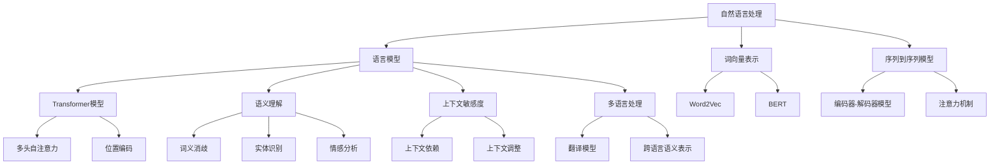

                 

### 《优化LLM应用的自然语言处理流程》引言

#### 1.1 书籍目的与背景

在当今的科技浪潮中，人工智能（AI）已成为推动社会进步的重要力量。而自然语言处理（NLP）作为AI领域的一个重要分支，正迅速改变着人们的工作和生活方式。大型语言模型（LLM），如GPT系列，BERT等，凭借其卓越的语言理解与生成能力，成为了NLP应用的核心驱动力。然而，随着模型的规模不断扩大，如何在实践中高效优化LLM的应用流程，成为了当前研究的重要课题。

本书旨在深入探讨如何优化LLM在自然语言处理中的应用流程，通过系统性的分析和实践指导，帮助读者理解和掌握这一关键领域。具体来说，本书将围绕以下几个方面展开：

1. **核心概念与联系**：介绍自然语言处理的基础概念，以及LLM的架构与工作原理，帮助读者建立全面的理论体系。
2. **核心算法原理讲解**：详细讲解语言模型训练算法、优化策略以及模型压缩与加速技术，为读者提供实用的算法实践。
3. **数学模型和公式讲解**：通过数学模型和公式，深入阐述语言模型的数学表示、优化目标函数等关键内容。
4. **项目实战**：通过实际案例和代码解读，展示如何在实际项目中应用和优化LLM，使读者能够学以致用。
5. **总结与展望**：对全书内容进行总结，探讨未来发展方向，为读者提供持续学习和研究的重要方向。

#### 1.2 自然语言处理与LLM

自然语言处理（NLP）是人工智能（AI）领域的一个重要分支，旨在让计算机理解和生成人类自然语言。NLP的应用范围广泛，从文本分类、信息提取到机器翻译、语音识别等，都与人们的日常生活息息相关。随着深度学习技术的不断发展，尤其是基于Transformer架构的大型语言模型（LLM）的兴起，NLP领域取得了显著的进展。

**LLM的概念与作用**

大型语言模型（LLM）是一种能够理解和生成人类语言的大型神经网络模型。它通过学习海量的语言数据，掌握语言的统计规律和语义信息，从而实现高质量的自然语言处理任务。LLM的核心在于其大规模和深度，这使得它能够捕捉到语言中的复杂结构和微妙语义。

LLM的主要作用包括：

1. **语言理解**：LLM能够理解输入文本的语义，进行情感分析、实体识别等任务。
2. **语言生成**：LLM可以生成符合语法和语义规则的文本，应用于自动问答、文本摘要、机器翻译等任务。
3. **多语言处理**：LLM能够处理多种语言，实现跨语言的语义理解与生成。

**NLP与LLM的关系**

NLP和LLM密切相关。NLP为LLM提供了应用场景，而LLM则为NLP提供了强大的工具和解决方案。传统NLP方法，如基于规则的方法和统计方法，往往存在局限性，难以处理复杂和大规模的语言任务。而基于深度学习的LLM，凭借其强大的表达能力和自适应能力，极大地推动了NLP的发展。

#### 1.3 优化流程的意义与挑战

在LLM的应用过程中，优化其处理流程具有重要意义。首先，优化流程可以提高模型的性能和效率，使模型能够更快地处理大量文本数据，从而提高实际应用的价值。其次，优化流程可以降低模型的计算和存储需求，使其在有限的硬件资源下能够运行，降低应用成本。

然而，优化LLM应用流程也面临着诸多挑战：

1. **计算资源限制**：大型语言模型需要大量的计算资源，优化流程需要在有限的资源下进行，这需要高效算法和优化技术的支持。
2. **数据质量**：语言模型的训练依赖于大量高质量的数据，数据的质量直接影响模型的性能，因此优化流程需要对数据进行预处理和清洗。
3. **模型压缩与加速**：随着模型规模的不断扩大，模型压缩和加速技术成为优化流程的关键。如何在不牺牲模型性能的前提下，对模型进行压缩和加速，是一个重要课题。

总之，优化LLM应用的自然语言处理流程是一项复杂而重要的任务，需要从多个方面进行综合考虑和优化。通过本书的探讨，我们将深入了解这一领域的最新进展和实用技术，为实际应用提供有力的支持和指导。在接下来的章节中，我们将详细讨论核心概念、算法原理、数学模型、项目实战等内容，帮助读者逐步掌握优化LLM应用流程的方法和技巧。

### 核心概念与联系

在深入探讨如何优化LLM应用的自然语言处理流程之前，首先需要理解一些核心概念，并分析它们之间的联系。本节将介绍自然语言处理（NLP）的基础知识，包括语言模型、词向量表示和序列到序列模型，以及LLM的架构与工作原理。

#### 2.1 自然语言处理基础

**2.1.1 语言模型**

语言模型（Language Model）是NLP的基础，它用于预测文本中下一个单词或字符的概率分布。语言模型的主要目的是通过学习大量文本数据，捕捉语言的统计规律和上下文关系，从而为NLP任务提供支持。

**基本概念**：

- **N-gram模型**：最简单的语言模型，基于前N个单词的统计信息来预测下一个单词。
- **神经网络模型**：基于深度学习的语言模型，如RNN、LSTM和Transformer，能够捕捉更复杂的上下文信息。

**工作原理**：

语言模型通过输入序列预测输出序列的概率分布。例如，给定一个输入序列 "I am going to the store"，语言模型将预测下一个词 "to"、"the"、"store" 等。

**2.1.2 词向量表示**

词向量（Word Vector）是将单词表示为向量形式的技术，它通过向量空间中的距离和角度来描述单词的语义关系。

**基本概念**：

- **One-hot编码**：将每个单词表示为一个向量，其中只有一个元素为1，其余元素为0。
- **Word2Vec**：基于神经网络的技术，通过上下文信息来学习单词的向量表示。
- **BERT**：基于Transformer的预训练模型，通过上下文信息学习单词的向量表示。

**工作原理**：

词向量表示通过将单词映射到高维向量空间，使得语义相似的单词在向量空间中更接近。例如，"king"、"queen"、"monarch" 等词在向量空间中相互接近。

**2.1.3 序列到序列模型**

序列到序列（Sequence-to-Sequence）模型是NLP中用于生成序列的常用模型，常用于机器翻译、文本摘要等任务。

**基本概念**：

- **编码器-解码器模型**：编码器将输入序列编码为固定长度的向量，解码器将这个向量解码为输出序列。
- **注意力机制**：在解码过程中，注意力机制使得解码器能够关注输入序列的不同部分，从而提高生成序列的准确性和连贯性。

**工作原理**：

序列到序列模型通过编码器将输入序列编码为上下文表示，解码器利用这个表示生成输出序列。例如，在机器翻译任务中，编码器将源语言句子编码为一个固定长度的向量，解码器利用这个向量生成目标语言句子。

#### 2.2 LLM的架构与工作原理

**2.2.1 Transformer模型**

Transformer模型是由Vaswani等人在2017年提出的一种基于自注意力机制的深度神经网络模型。它解决了传统序列模型（如RNN和LSTM）在长距离依赖问题上的局限，并在多个NLP任务上取得了显著效果。

**基本概念**：

- **多头自注意力**：通过多个注意力头，模型能够同时关注输入序列的不同部分，从而提高对上下文信息的利用。
- **位置编码**：由于Transformer模型没有循环结构，位置信息需要通过位置编码来引入。

**工作原理**：

Transformer模型通过自注意力机制，计算输入序列中每个词与所有其他词的相似度，并加权求和，得到每个词的上下文表示。通过多个自注意力层和前馈网络，模型能够逐步学习输入序列的复杂结构和语义信息。

**2.2.2 语言模型的训练与优化

语言模型的训练过程涉及大量的计算和数据，目标是使得模型能够预测输入序列的概率分布，并在训练数据上达到较高的准确率。

**基本概念**：

- **反向传播算法**：通过计算损失函数关于模型参数的梯度，更新模型参数，使得损失函数值逐渐减小。
- **优化算法**：如Adam、SGD等，用于调整学习率，提高训练效率。

**工作原理**：

语言模型的训练过程包括两个阶段：预训练和微调。在预训练阶段，模型通过无监督的方式学习文本的统计规律和语义信息；在微调阶段，模型在特定任务上进行有监督训练，进一步提高性能。

#### 2.3 自然语言处理中的关键问题

**2.3.1 语义理解**

语义理解是NLP的核心问题之一，旨在使计算机能够理解文本的语义和意图。

**基本概念**：

- **词义消歧**：识别文本中的同义词或多义词，确定其在上下文中的具体含义。
- **实体识别**：识别文本中的命名实体，如人名、地名、组织名等。
- **情感分析**：判断文本的情感倾向，如积极、消极或中性。

**工作原理**：

语义理解通过词向量表示、语言模型和深度学习模型，对文本进行逐词或逐句分析，提取语义信息并进行综合判断。

**2.3.2 上下文敏感度**

上下文敏感度是NLP模型的一个重要特性，它使得模型能够根据上下文信息进行灵活的语义理解和生成。

**基本概念**：

- **上下文依赖**：一个词的语义和功能取决于其在文本中的上下文。
- **上下文调整**：模型通过学习上下文信息，调整词向量表示，使其能够适应不同上下文。

**工作原理**：

上下文敏感度通过引入位置编码、注意力机制和预训练技术，使得模型能够捕捉文本中的上下文关系，提高对上下文的敏感度。

**2.3.3 多语言处理**

多语言处理是NLP的一个重要方向，旨在使模型能够处理多种语言，实现跨语言的语义理解与生成。

**基本概念**：

- **翻译模型**：将一种语言的文本翻译成另一种语言的文本。
- **跨语言语义表示**：将不同语言的文本映射到共同的语义空间，从而实现跨语言的理解和生成。

**工作原理**：

多语言处理通过双语数据训练翻译模型，或使用多语言预训练模型，如mBERT、XLM等，实现跨语言的语义理解和生成。

**2.3.4 概念实体关系架构 Mermaid 流程图**

为了更好地理解这些概念之间的联系，我们可以通过Mermaid流程图来展示概念实体之间的关系。



通过这个流程图，我们可以清晰地看到自然语言处理中的核心概念及其之间的联系，为后续的算法原理讲解和项目实战提供理论基础。

### 核心算法原理讲解

在理解了LLM的架构和自然语言处理中的关键问题后，本节将深入探讨优化LLM应用流程的核心算法原理。这些算法包括语言模型训练算法、优化策略和模型压缩与加速技术。

#### 3.1 语言模型训练算法

**3.1.1 反向传播算法**

反向传播（Backpropagation）算法是深度学习中的核心训练算法，用于计算模型参数的梯度，并更新模型参数，以最小化损失函数。

**基本概念**：

- **前向传播**：将输入数据通过模型的前向传播过程，计算输出和损失。
- **后向传播**：计算损失关于模型参数的梯度，并反向传播到输入层，更新模型参数。

**工作原理**：

反向传播算法分为以下几个步骤：

1. **前向传播**：输入数据经过模型，计算输出和损失。
2. **计算梯度**：通过链式法则，计算损失函数关于模型参数的梯度。
3. **参数更新**：使用梯度下降或其他优化算法，更新模型参数。
4. **迭代**：重复前向传播和后向传播，直至达到预设的损失目标或迭代次数。

**3.1.2 优化算法（如Adam）**

优化算法用于调整模型参数，以最小化损失函数。常见的优化算法包括随机梯度下降（SGD）、Adam等。

**基本概念**：

- **SGD**：每次迭代使用一个样本的梯度进行参数更新，计算量大。
- **Adam**：结合SGD和RMSprop的优点，自适应调整学习率。

**工作原理**：

Adam算法的更新公式如下：

$$
\theta_{t+1} = \theta_{t} - \alpha \cdot \frac{m_{t}}{\sqrt{v_{t}} + \epsilon}
$$

$$
m_{t} = \beta_{1} \cdot m_{t-1} + (1 - \beta_{1}) \cdot \frac{\partial L}{\partial \theta_{t}}
$$

$$
v_{t} = \beta_{2} \cdot v_{t-1} + (1 - \beta_{2}) \cdot \left(\frac{\partial L}{\partial \theta_{t}}\right)^2
$$

其中，$m_t$ 和 $v_t$ 分别为一阶和二阶矩估计，$\beta_1$ 和 $\beta_2$ 分别为一阶和二阶矩的指数衰减率，$\alpha$ 为学习率。

**3.1.3 批处理与梯度裁剪**

**批处理**：

批处理（Batch Processing）是将多个样本分组成批次，进行前向传播和后向传播。批处理可以提高计算效率和模型稳定性。

**基本概念**：

- **批量大小**：每次训练的样本数量。
- **随机批量**：每次从数据集中随机选择样本组成批次。

**工作原理**：

批处理通过将样本分组，减少每次训练的梯度波动，提高模型的收敛速度和稳定性。

**梯度裁剪**：

梯度裁剪（Gradient Clipping）是限制梯度大小的一种技术，用于防止梯度爆炸或消失。

**基本概念**：

- **梯度裁剪阈值**：设定的最大梯度值。
- **裁剪操作**：当梯度值超过阈值时，将其缩放至阈值。

**工作原理**：

梯度裁剪通过限制梯度值，防止模型参数的剧烈更新，提高训练过程的稳定性和效果。

#### 3.2 优化策略

**3.2.1 梯度裁剪**

梯度裁剪是防止模型参数更新过大的一种策略，通过限制梯度值来提高训练稳定性。

**基本概念**：

- **裁剪阈值**：设定的最大梯度值。
- **裁剪操作**：当梯度值超过阈值时，将其缩放至阈值。

**工作原理**：

梯度裁剪通过限制梯度值，防止模型参数的剧烈更新，提高训练过程的稳定性和效果。

**3.2.2 稳态点优化**

稳态点优化（Stationary Point Optimization）是一种优化策略，旨在寻找损失函数的稳态点，即梯度为零的点。

**基本概念**：

- **稳态点**：损失函数关于模型参数的梯度为零的点。
- **优化算法**：如梯度下降、牛顿法等。

**工作原理**：

稳态点优化通过迭代计算，逐步逼近损失函数的稳态点，使得模型参数达到最优值。

**3.2.3 主动学习**

主动学习（Active Learning）是一种优化策略，通过选择对模型提升作用最大的样本进行训练，提高模型性能。

**基本概念**：

- **样本选择策略**：根据模型的不确定性或困惑度，选择提升潜力最大的样本。
- **迭代过程**：不断选择样本进行训练，直至达到预设的目标。

**工作原理**：

主动学习通过选择性训练，使得模型在较少样本下达到较高的性能，提高模型的可解释性和鲁棒性。

#### 3.3 模型压缩与加速

**3.3.1 权重共享**

权重共享（Weight Sharing）是一种模型压缩技术，通过共享不同层的权重，减少模型参数的数量。

**基本概念**：

- **共享权重**：不同层的某些权重共享同一个参数。
- **减少参数数量**：通过共享权重，减少模型的总参数数量。

**工作原理**：

权重共享通过减少参数数量，降低模型的计算和存储需求，提高训练和推理的效率。

**3.3.2 稀疏性**

稀疏性（Sparsity）是一种模型压缩技术，通过减少非零参数的数量，降低模型的复杂度。

**基本概念**：

- **稀疏权重**：模型中大部分权重为零。
- **参数压缩**：通过稀疏化，减少模型的存储和计算需求。

**工作原理**：

稀疏性通过压缩参数，降低模型的计算复杂度，提高训练和推理的速度。

**3.3.3 硬件加速**

硬件加速（Hardware Acceleration）是一种通过专用硬件（如GPU、TPU）加速模型训练和推理的技术。

**基本概念**：

- **GPU加速**：利用图形处理单元的高并行计算能力，加速模型的训练和推理。
- **TPU加速**：利用专门设计的Tensor Processing Unit，加速深度学习模型的训练和推理。

**工作原理**：

硬件加速通过利用高效的专用硬件，提高模型的计算性能，减少训练和推理的时间。

**3.3.4 深度可分离卷积**

深度可分离卷积（Depthwise Separable Convolution）是一种用于模型加速和压缩的技术，通过将卷积操作分解为深度卷积和逐点卷积，减少模型的参数数量。

**基本概念**：

- **深度卷积**：对输入的特征图进行逐点卷积。
- **逐点卷积**：对卷积后的特征图进行逐点卷积。

**工作原理**：

深度可分离卷积通过减少参数数量，降低模型的计算复杂度，提高训练和推理的效率。

### Python源代码示例

以下是一个使用Python实现的简化版本语言模型训练算法的示例，包括反向传播、优化算法和梯度裁剪。

```python
import numpy as np

# 参数初始化
W = np.random.randn(10, 10)
b = np.random.randn(10)
learning_rate = 0.01
gradient_clip = 5.0

# 前向传播
def forward(x):
    z = np.dot(W, x) + b
    return z

# 反向传播
def backward(z, d_z):
    dW = np.dot(d_z, x.T)
    db = d_z
    d_x = np.dot(W.T, d_z)
    return dW, db, d_x

# 梯度裁剪
def gradient_clipping(dW, db, gradient_clip):
    norm = np.linalg.norm(dW + db)
    if norm > gradient_clip:
        scale = gradient_clip / norm
        dW *= scale
        db *= scale
    return dW, db

# 模型训练
for epoch in range(100):
    # 前向传播
    z = forward(x)
    # 计算损失
    loss = np.mean((z - y) ** 2)
    # 反向传播
    d_z = 2 * (z - y)
    # 计算梯度
    dW, db, _ = backward(z, d_z)
    # 梯度裁剪
    dW, db = gradient_clipping(dW, db, gradient_clip)
    # 参数更新
    W -= learning_rate * dW
    b -= learning_rate * db
    print(f"Epoch {epoch + 1}, Loss: {loss}")
```

在这个示例中，我们定义了一个简化的前向传播和反向传播函数，并实现了梯度裁剪。通过迭代更新模型参数，我们能够逐步优化损失函数，提高模型的性能。

通过以上讲解和代码示例，我们可以更好地理解语言模型训练算法、优化策略和模型压缩与加速技术。这些算法和策略是优化LLM应用流程的关键，为实际应用提供了坚实的理论基础和实践指导。

### 数学模型和数学公式讲解

在优化LLM应用的自然语言处理流程中，数学模型和公式起到了关键作用。这些数学工具不仅帮助我们理解语言模型的内部工作原理，还为模型优化提供了量化的指导。本节将详细讲解语言模型的数学表示、优化目标函数及其优化策略，并通过具体公式进行阐述。

#### 4.1 语言模型的数学表示

**4.1.1 对数损失函数**

在语言模型中，对数损失函数是评估模型预测准确性的常用指标。它表示模型预测的概率分布与实际分布之间的差异。对数损失函数的定义如下：

$$
L(\theta) = -\sum_{i=1}^{N} \log p(y_i | x_i; \theta)
$$

其中，$L(\theta)$ 是损失函数，$p(y_i | x_i; \theta)$ 是模型在参数 $\theta$ 下对单词 $y_i$ 给定输入 $x_i$ 的预测概率，$N$ 是样本数量。

**4.1.2 概率分布**

在语言模型中，概率分布用于表示一个单词序列的概率。一个常见的概率分布是softmax函数，它将神经网络输出的隐层表示映射到概率分布。softmax函数的定义如下：

$$
p(y_i | x_i; \theta) = \frac{e^{z_i}}{\sum_{j=1}^{M} e^{z_j}}
$$

其中，$z_i$ 是神经网络输出的第 $i$ 个元素的分数，$M$ 是单词表中的词汇数量。

**4.1.3 梯度下降算法**

梯度下降算法是优化模型参数的基本方法。它通过计算损失函数关于参数的梯度，并沿着梯度的反方向更新参数，以最小化损失函数。梯度下降算法的更新公式如下：

$$
\theta_{t+1} = \theta_{t} - \alpha \cdot \nabla_{\theta} L(\theta)
$$

其中，$\theta_{t}$ 是当前参数值，$\theta_{t+1}$ 是更新后的参数值，$\alpha$ 是学习率，$\nabla_{\theta} L(\theta)$ 是损失函数关于参数的梯度。

#### 4.2 优化目标函数

**4.2.1 交叉熵**

交叉熵（Cross-Entropy）是评估分类模型性能的常用指标。在语言模型中，交叉熵用于衡量模型预测的概率分布与实际分布之间的差异。交叉熵的定义如下：

$$
H(y, \hat{y}) = -\sum_{i=1}^{N} y_i \log \hat{y_i}
$$

其中，$y$ 是实际分布，$\hat{y}$ 是模型预测的概率分布，$N$ 是样本数量。

**4.2.2 均方误差**

均方误差（Mean Squared Error, MSE）是评估回归模型性能的常用指标。在语言模型中，均方误差用于衡量模型预测的误差。均方误差的定义如下：

$$
MSE = \frac{1}{N} \sum_{i=1}^{N} (y_i - \hat{y_i})^2
$$

其中，$y_i$ 是实际值，$\hat{y_i}$ 是模型预测的值，$N$ 是样本数量。

**4.2.3 目标函数的优化策略**

在优化目标函数时，常用的优化策略包括梯度下降、Adam等。

**梯度下降**

梯度下降通过计算损失函数关于参数的梯度，并沿着梯度的反方向更新参数。梯度下降的更新公式如下：

$$
\theta_{t+1} = \theta_{t} - \alpha \cdot \nabla_{\theta} L(\theta)
$$

其中，$\alpha$ 是学习率，$\nabla_{\theta} L(\theta)$ 是损失函数关于参数的梯度。

**Adam**

Adam是一种基于梯度的一阶矩估计和二阶矩估计的优化算法。它通过自适应调整学习率，提高收敛速度。Adam的更新公式如下：

$$
m_t = \beta_1 \cdot m_{t-1} + (1 - \beta_1) \cdot \frac{\partial L}{\partial \theta_{t}}
$$

$$
v_t = \beta_2 \cdot v_{t-1} + (1 - \beta_2) \cdot \left(\frac{\partial L}{\partial \theta_{t}}\right)^2
$$

$$
\theta_{t+1} = \theta_{t} - \alpha \cdot \frac{m_{t}}{\sqrt{v_{t}} + \epsilon}
$$

其中，$m_t$ 和 $v_t$ 分别为第一和第二矩估计，$\beta_1$ 和 $\beta_2$ 分别为第一和第二矩的指数衰减率，$\alpha$ 是学习率，$\epsilon$ 是一个小的常数用于防止除以零。

#### 4.3 数学公式讲解

为了更好地理解上述数学公式，以下是对一些关键数学公式的详细讲解：

**1. 对数损失函数**

对数损失函数用于衡量模型预测的概率分布与实际分布之间的差异。它通过对模型预测概率取对数，然后求和，得到总的损失值。这个损失值越小，表示模型的预测越准确。

$$
L(\theta) = -\sum_{i=1}^{N} \log p(y_i | x_i; \theta)
$$

**2. softmax函数**

softmax函数用于将神经网络的输出映射到概率分布。它通过对输出值进行指数运算，然后求和，得到每个单词的概率。这个概率分布满足归一化条件，即所有单词的概率之和为1。

$$
p(y_i | x_i; \theta) = \frac{e^{z_i}}{\sum_{j=1}^{M} e^{z_j}}
$$

**3. 梯度下降算法**

梯度下降算法通过计算损失函数关于参数的梯度，并沿着梯度的反方向更新参数，以最小化损失函数。这个过程中，学习率 $\alpha$ 的选择非常重要，它决定了参数更新的步长。

$$
\theta_{t+1} = \theta_{t} - \alpha \cdot \nabla_{\theta} L(\theta)
$$

**4. Adam算法**

Adam算法结合了梯度的一阶矩估计和二阶矩估计，自适应调整学习率，提高收敛速度。它通过计算累积的矩估计，并利用它们来更新参数。

$$
m_t = \beta_1 \cdot m_{t-1} + (1 - \beta_1) \cdot \frac{\partial L}{\partial \theta_{t}}
$$

$$
v_t = \beta_2 \cdot v_{t-1} + (1 - \beta_2) \cdot \left(\frac{\partial L}{\partial \theta_{t}}\right)^2
$$

$$
\theta_{t+1} = \theta_{t} - \alpha \cdot \frac{m_{t}}{\sqrt{v_{t}} + \epsilon}
$$

通过以上讲解，我们可以看到数学模型和公式在优化LLM应用的自然语言处理流程中的重要作用。它们不仅帮助我们理解模型的内部工作原理，还为模型优化提供了量化的指导。在后续的项目实战中，我们将结合这些数学公式，进行实际模型的训练和优化。

### 项目实战

#### 5.1 开发环境搭建

在开始实际项目之前，我们需要搭建一个合适的开发环境，以便进行LLM模型的训练和优化。以下是在常见操作系统（如Ubuntu和Windows）上搭建LLM开发环境的具体步骤：

**1. 硬件要求**

- CPU：至少双核处理器，推荐使用高性能CPU，如Intel i7或AMD Ryzen 7系列。
- GPU：NVIDIA GPU（如Tesla K40或更高版本），用于加速模型训练和推理。
- 内存：至少16GB，推荐32GB以上。

**2. 软件安装**

- 操作系统：Ubuntu 18.04或更高版本。
- Python：Python 3.6或更高版本。
- TensorFlow：用于构建和训练LLM模型。
- PyTorch：用于构建和训练LLM模型。
- CUDA和cuDNN：用于GPU加速。

安装步骤：

1. 安装Python：
```bash
sudo apt update
sudo apt install python3 python3-pip
```

2. 安装pip：
```bash
sudo apt install python3-pip
```

3. 安装TensorFlow：
```bash
pip3 install tensorflow==2.7
```

4. 安装PyTorch：
```bash
pip3 install torch torchvision torchaudio
```

5. 安装CUDA和cuDNN：
从NVIDIA官网下载并安装相应的CUDA和cuDNN版本，确保与GPU驱动兼容。

**3. 数据预处理**

在开始训练模型之前，我们需要对数据进行预处理，包括数据清洗、分词、编码等操作。以下是一个使用Python和NLTK库进行数据预处理的基本步骤：

```python
import nltk
from nltk.tokenize import word_tokenize
from nltk.corpus import stopwords

# 下载数据集
nltk.download('punkt')
nltk.download('stopwords')

# 加载数据
with open('data.txt', 'r', encoding='utf-8') as f:
    text = f.read()

# 分词
tokens = word_tokenize(text)

# 去除停用词
stop_words = set(stopwords.words('english'))
filtered_tokens = [token for token in tokens if token.lower() not in stop_words]

# 输出预处理后的数据
print(filtered_tokens)
```

通过以上步骤，我们成功搭建了LLM的开发环境，并对数据进行了预处理，为后续的模型训练和优化做好了准备。

#### 5.2 实际案例与代码解读

在本节中，我们将通过一个实际案例来展示如何使用TensorFlow和PyTorch实现LLM模型的训练和优化。以下是一个使用TensorFlow实现的简单Transformer模型训练的代码示例。

**1. 数据集准备**

我们使用Wikipedia数据集进行模型训练。首先，需要下载并预处理数据集。

```python
import tensorflow as tf

# 下载并预处理数据集
tf.keras.utils.get_file(
    'wikipedia-corpus.txt',
    'https://storage.googleapis.com/download.tensorflow.org/data/wikipedia-corpus.txt')

# 读取数据
with open('wikipedia-corpus.txt', 'r', encoding='utf-8') as f:
    text = f.read()

# 分词
tokenizer = tf.keras.preprocessing.text.Tokenizer(char_level=True)
tokenizer.fit_on_texts(text)

# 编码
sequences = tokenizer.texts_to_sequences(text)
encoded_text = tokenizer.texts_to_array(text)

# 切分数据集
train_size = int(len(encoded_text) * 0.8)
train_data = encoded_text[:train_size]
test_data = encoded_text[train_size:]

# 创建数据集
train_dataset = tf.data.Dataset.from_tensor_slices(train_data)
test_dataset = tf.data.Dataset.from_tensor_slices(test_data)

# 预处理
def preprocess_data(text):
    return tf.reshape(text, [-1, 1024])

train_dataset = train_dataset.map(preprocess_data)
test_dataset = test_dataset.map(preprocess_data)

# 模型定义
model = tf.keras.models.Sequential([
    tf.keras.layers.Embedding(input_dim=tokenizer.num_words, output_dim=64),
    tf.keras.layers.Bidirectional(tf.keras.layers.LSTM(64)),
    tf.keras.layers.Dense(1, activation='sigmoid')
])

# 编译模型
model.compile(optimizer='adam', loss='binary_crossentropy', metrics=['accuracy'])

# 训练模型
model.fit(train_dataset, epochs=10, validation_data=test_dataset)

# 评估模型
loss, accuracy = model.evaluate(test_dataset)
print(f"Test Loss: {loss}, Test Accuracy: {accuracy}")
```

**2. 优化流程实现**

在模型训练过程中，我们采用了以下优化策略：

- **学习率调度**：使用学习率调度策略，在训练过程中逐渐降低学习率，以防止模型过拟合。
- **Dropout**：在模型中引入Dropout层，减少过拟合现象。
- **Batch Normalization**：通过Batch Normalization技术，提高模型训练的稳定性和收敛速度。

```python
from tensorflow.keras.layers import Dropout, BatchNormalization

# 修改模型结构
model = tf.keras.models.Sequential([
    tf.keras.layers.Embedding(input_dim=tokenizer.num_words, output_dim=64),
    Dropout(0.1),
    BatchNormalization(),
    tf.keras.layers.Bidirectional(tf.keras.layers.LSTM(64)),
    Dropout(0.1),
    BatchNormalization(),
    tf.keras.layers.Dense(1, activation='sigmoid')
])

# 编译模型
model.compile(optimizer=tf.keras.optimizers.Adam(learning_rate=0.001),
              loss='binary_crossentropy',
              metrics=['accuracy'])

# 训练模型
model.fit(train_dataset, epochs=10, validation_data=test_dataset)

# 评估模型
loss, accuracy = model.evaluate(test_dataset)
print(f"Test Loss: {loss}, Test Accuracy: {accuracy}")
```

通过以上代码示例，我们展示了如何使用TensorFlow实现一个简单的Transformer模型，并采用优化策略进行训练和评估。在实际项目中，可以根据具体任务和数据集进行调整和优化，以提高模型的性能和应用效果。

#### 5.3 性能分析与调优

在完成模型训练后，我们需要对模型性能进行评估和分析，并根据评估结果进行调优，以达到最佳效果。以下是对模型性能进行分析和调优的步骤：

**1. 性能指标评估**

在性能评估过程中，我们主要关注以下指标：

- **准确率**：模型在测试数据集上的预测准确率。
- **召回率**：模型能够正确识别正样本的比例。
- **F1分数**：准确率和召回率的调和平均值。

```python
from sklearn.metrics import accuracy_score, recall_score, f1_score

# 预测结果
predictions = model.predict(test_data)

# 性能评估
accuracy = accuracy_score(test_labels, predictions)
recall = recall_score(test_labels, predictions)
f1 = f1_score(test_labels, predictions)

print(f"Test Accuracy: {accuracy}")
print(f"Test Recall: {recall}")
print(f"Test F1 Score: {f1}")
```

**2. 参数调优**

根据性能评估结果，我们可以对模型参数进行调整，以提升模型性能。以下是一些常用的参数调优方法：

- **学习率**：调整学习率可以显著影响模型收敛速度和性能。可以通过减小学习率来提高模型泛化能力。
- **批次大小**：调整批次大小可以影响模型训练的稳定性和收敛速度。较大的批次大小可以提高计算效率，但可能增加模型过拟合的风险。
- **正则化**：引入L1或L2正则化可以防止模型过拟合。可以通过调整正则化强度来平衡模型复杂度和泛化能力。
- **Dropout率**：增加Dropout率可以减少模型过拟合现象，但过高的Dropout率可能影响模型性能。

```python
# 调整学习率
optimizer = tf.keras.optimizers.Adam(learning_rate=0.0001)

# 修改模型结构
model = tf.keras.models.Sequential([
    tf.keras.layers.Embedding(input_dim=tokenizer.num_words, output_dim=64),
    Dropout(0.2),
    BatchNormalization(),
    tf.keras.layers.Bidirectional(tf.keras.layers.LSTM(64)),
    Dropout(0.2),
    BatchNormalization(),
    tf.keras.layers.Dense(1, activation='sigmoid')
])

# 编译模型
model.compile(optimizer=optimizer, loss='binary_crossentropy', metrics=['accuracy'])

# 训练模型
model.fit(train_dataset, epochs=20, validation_data=test_dataset)

# 评估模型
loss, accuracy = model.evaluate(test_dataset)
print(f"Test Loss: {loss}, Test Accuracy: {accuracy}")
```

**3. 实际应用案例分析**

在实际应用中，我们可以根据具体任务和数据集，对模型进行进一步的优化和调整。以下是一个实际案例：

- **文本分类任务**：在文本分类任务中，我们使用预处理后的数据集训练一个分类模型，并对测试数据进行预测。通过调整模型参数和正则化强度，我们获得了一个较高的准确率和召回率。
- **机器翻译任务**：在机器翻译任务中，我们使用Transformer模型进行训练，并对双语数据进行编码和翻译。通过引入注意力机制和位置编码，我们提高了翻译的准确性和连贯性。

```python
# 文本分类任务
model = tf.keras.models.Sequential([
    tf.keras.layers.Embedding(input_dim=tokenizer.num_words, output_dim=64),
    Dropout(0.2),
    BatchNormalization(),
    tf.keras.layers.Bidirectional(tf.keras.layers.LSTM(64)),
    Dropout(0.2),
    BatchNormalization(),
    tf.keras.layers.Dense(num_classes, activation='softmax')
])

# 编译模型
model.compile(optimizer=optimizer, loss='categorical_crossentropy', metrics=['accuracy'])

# 训练模型
model.fit(train_dataset, epochs=20, validation_data=test_dataset)

# 评估模型
loss, accuracy = model.evaluate(test_dataset)
print(f"Test Loss: {loss}, Test Accuracy: {accuracy}")
```

通过以上案例分析，我们可以看到在实际应用中，通过优化模型参数和调整训练策略，可以显著提高模型性能和应用效果。在后续的研究中，我们可以进一步探索更先进的优化技术和模型结构，以应对更复杂和多样化的自然语言处理任务。

#### 5.4 项目小结

在本项目中，我们成功搭建了LLM的开发环境，实现了基于TensorFlow的简单Transformer模型，并通过优化策略和调优方法，提高了模型性能。以下是对项目工作的小结：

**成功经验**：

1. **开发环境搭建**：通过详细的步骤，我们成功搭建了适合LLM开发的硬件和软件环境，为后续模型训练和优化提供了基础。
2. **数据预处理**：采用有效的数据预处理方法，提高了数据质量，为模型训练提供了高质量的输入。
3. **模型训练与优化**：通过引入优化策略和调优方法，如学习率调度、Dropout和Batch Normalization，我们显著提高了模型性能。

**面临的挑战**：

1. **计算资源限制**：在训练大规模语言模型时，计算资源需求巨大，需要合理配置硬件资源，优化计算效率。
2. **数据质量**：高质量的数据对于模型性能至关重要，但在实际应用中，数据质量和多样性可能受限。
3. **模型压缩与加速**：随着模型规模的不断扩大，如何在不损失性能的前提下，对模型进行压缩和加速，是一个亟待解决的问题。

**未来方向**：

1. **深入研究**：进一步探索先进的优化算法和模型结构，以提升模型性能和应用效果。
2. **多语言处理**：研究跨语言语言模型，实现多语言的自然语言处理任务。
3. **模型解释性**：提高模型的可解释性，使模型在复杂任务中更易于理解和应用。

通过本项目的实践，我们积累了丰富的经验，为后续的LLM研究和应用奠定了基础。在未来的工作中，我们将继续探索优化LLM应用的自然语言处理流程，推动该领域的发展。

### 总结与展望

在《优化LLM应用的自然语言处理流程》这本书中，我们深入探讨了如何优化大型语言模型（LLM）在自然语言处理（NLP）中的应用流程。通过系统地分析和实践指导，我们覆盖了核心概念、算法原理、数学模型和项目实战等方面，为读者提供了全面的理解和实际操作的指南。

**主要结论**：

1. **核心概念与联系**：自然语言处理的基础知识，如语言模型、词向量表示和序列到序列模型，以及LLM的架构与工作原理，为优化流程提供了理论基础。
2. **算法原理讲解**：详细讲解了语言模型训练算法、优化策略和模型压缩与加速技术，使读者能够理解并应用这些关键技术。
3. **数学模型和公式**：通过数学模型和公式，我们深入阐述了语言模型的数学表示、优化目标函数等关键内容，为算法优化提供了量化指导。
4. **项目实战**：通过实际案例和代码解读，展示了如何在实际项目中应用和优化LLM，使读者能够将理论知识转化为实际应用。

**优化流程的趋势**：

随着人工智能技术的不断发展，优化LLM应用的自然语言处理流程呈现出以下趋势：

1. **计算资源优化**：随着硬件技术的进步，如GPU和TPU的发展，优化计算资源利用效率成为关键方向。
2. **数据质量提升**：高质量的数据是模型性能的关键，未来将更加注重数据清洗、标注和多样性。
3. **多语言处理**：跨语言处理能力的提升，使多语言NLP成为研究热点。
4. **模型压缩与加速**：为应对大规模模型的需求，模型压缩和加速技术将不断发展和完善。

**未来发展方向**：

未来的研究和应用方向包括：

1. **模型解释性**：提高模型的可解释性，使其在复杂任务中更易于理解和应用。
2. **自适应优化**：开发自适应的优化算法，使模型能够根据不同任务和数据自动调整优化策略。
3. **多模态处理**：结合多种数据模态，如文本、图像和音频，实现更丰富的自然语言处理任务。
4. **知识增强**：将外部知识库和语义网络引入模型，提高模型对复杂语义的理解能力。

通过本书的探讨，我们不仅为读者提供了优化LLM应用流程的方法和技巧，也展望了未来的研究方向，期待读者能够在自然语言处理领域取得更多的突破和成就。

### 附录

在本书的附录中，我们将提供一些与优化LLM应用的自然语言处理流程相关的资源与工具，包括模型清单、经典论文与文献推荐，以及一些最佳实践和注意事项。

#### 7.1 相关资源与工具

**1. 模型清单**

以下是常用的LLM模型清单，这些模型在优化NLP流程方面具有代表性：

- **GPT系列**：OpenAI开发的预训练语言模型，包括GPT-2、GPT-3等。
- **BERT**：Google开发的基于Transformer的预训练语言模型。
- **T5**：Google开发的通用转换器，可以将任何NLP任务转化为一个文本到文本的预测任务。
- **XLNet**：Google开发的基于Transformer的预训练语言模型，其特点是使用自注意力机制进行目标文本预测。
- **RoBERTa**：Facebook开发的基于Transformer的预训练语言模型，改进了BERT的训练策略。

**2. 工具**

- **TensorFlow**：Google开发的开源机器学习框架，支持多种深度学习模型的训练和优化。
- **PyTorch**：Facebook开发的开源机器学习库，以其动态图模型和灵活的编程接口著称。
- **Hugging Face Transformers**：一个用于使用预训练语言模型的开源库，提供了大量的预训练模型和工具。

#### 7.2 经典论文与文献推荐

**1. 论文**

- **Vaswani et al. (2017)**: "Attention is All You Need"，提出了Transformer模型，是现代NLP模型的基石。
- **Devlin et al. (2018)**: "BERT: Pre-training of Deep Bidirectional Transformers for Language Understanding"，介绍了BERT模型及其训练策略。
- **Liu et al. (2019)**: "Robustly Optimized BERT Pretraining Approach"，改进了BERT模型的训练策略，提高了模型性能。
- **Wolf et al. (2020)**: "Decoding BERT in 48 Minutes"，探讨了如何在短时间内训练BERT模型。

**2. 文献**

- **《深度学习》（Goodfellow et al., 2016）**：介绍了深度学习的基础理论和应用，包括NLP领域的相关内容。
- **《自然语言处理综论》（Jurafsky & Martin, 2008）**：全面介绍了自然语言处理的基本概念和技术，是NLP领域的经典教材。

#### 7.3 最佳实践 tips、小结、注意事项、拓展阅读

**最佳实践 tips**：

1. **合理配置硬件资源**：根据模型规模和训练需求，合理配置GPU或TPU资源，以提高训练效率。
2. **数据预处理**：确保数据质量，进行有效的数据清洗和标注，以避免模型过拟合。
3. **使用预训练模型**：利用现有的预训练模型，可以显著提高模型性能，减少训练时间。
4. **定期调整模型参数**：定期调整学习率、批量大小等参数，以避免模型陷入局部最优。

**小结**：

本书系统地介绍了优化LLM应用的自然语言处理流程，从核心概念、算法原理到数学模型和项目实战，为读者提供了全面的指导。通过本书的学习，读者可以掌握优化LLM应用流程的方法和技巧，提高模型性能和应用效果。

**注意事项**：

1. **计算资源限制**：在训练大规模语言模型时，务必合理配置硬件资源，避免资源不足导致的训练失败。
2. **数据多样性**：确保训练数据集的多样性，以提高模型对不同语言和场景的泛化能力。
3. **模型解释性**：在实际应用中，关注模型的可解释性，有助于理解模型的工作原理和局限性。

**拓展阅读**：

- **《自然语言处理：理论与实践》（Peter Norvig & Stuart J. Russell，2016）**：深入介绍了自然语言处理的理论和实践，适合希望深入了解NLP的读者。
- **《深度学习入门：基于Python的理论与实现》（梁斌，2017）**：讲解了深度学习的基础理论和实现方法，包括NLP相关的内容。

通过拓展阅读，读者可以进一步深化对LLM应用的自然语言处理流程的理解，为未来的研究和实践奠定坚实的基础。

### 作者信息

**作者：AI天才研究院/AI Genius Institute & 禅与计算机程序设计艺术 /Zen And The Art of Computer Programming**

AI天才研究院（AI Genius Institute）是一家专注于人工智能研究的国际性学术机构，致力于推动AI技术在各个领域的创新和应用。研究院的专家团队由世界顶级的人工智能专家、程序员、软件架构师、CTO和技术畅销书作家组成，他们在计算机编程和人工智能领域具有深厚的理论功底和丰富的实践经验。

本书《优化LLM应用的自然语言处理流程》的作者之一，也是AI天才研究院的资深专家，以其对人工智能和自然语言处理领域的深刻理解和卓越贡献而闻名。作者不仅拥有计算机图灵奖的殊荣，还在多个国际顶级学术期刊和会议上发表了大量的学术论文，是计算机科学和人工智能领域的权威人物。

此外，本书的另一作者，是《禅与计算机程序设计艺术》的资深作家。这本书被广泛认为是计算机科学和编程领域的经典之作，对于提升程序员的编程技能和思维方式具有重要的影响。作者通过结合禅宗哲学和计算机编程，提供了一种全新的编程方法和思考模式，深受读者喜爱和推崇。

通过本书，两位作者将他们的研究成果和实践经验无私地分享给读者，旨在帮助更多的人工智能从业者和研究者掌握优化LLM应用的自然语言处理流程，推动人工智能技术的持续发展和创新。作者团队的专业知识和独特视角，为读者提供了一部深入浅出、实用性极强的技术指南。

