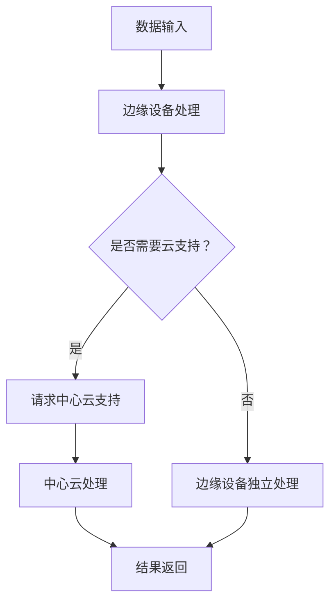

                 

**标题**：《优化LLM应用的边缘计算能力》

**关键词**：LLM，边缘计算，优化策略，计算性能，资源利用，人工智能应用

**摘要**：
本文旨在探讨如何通过边缘计算技术优化大型语言模型（LLM）的应用性能。随着人工智能技术的发展，LLM在自然语言处理任务中表现出色，但其计算资源需求也日益增长。边缘计算作为一种分布式计算技术，能够在靠近数据源的地方提供计算能力，从而缓解中心化计算的瓶颈。本文将详细分析LLM与边缘计算的结合点，探讨优化策略，并通过实际项目案例展示优化效果。

## 目录

1. **背景介绍**  
   1.1. LLM的兴起与应用  
   1.2. 边缘计算的原理与优势  
   1.3. 结合LLM与边缘计算的意义

2. **核心概念与联系**  
   2.1. LLM的工作原理  
   2.2. 边缘计算架构与模型  
   2.3. Mermaid流程图展示

3. **核心算法原理讲解**  
   3.1. 算法优化思路  
   3.2. Python源代码实现  
   3.3. 数学模型与公式解释

4. **项目实战**  
   4.1. 开发环境搭建  
   4.2. 源代码实现与解读  
   4.3. 代码应用解读与分析  
   4.4. 实际案例剖析  
   4.5. 项目小结

5. **优化策略与实践**  
   5.1. 资源调度与负载均衡  
   5.2. 模型压缩与量化  
   5.3. 缓存与数据预加载策略

6. **最佳实践与小结**  
   6.1. 最佳实践技巧  
   6.2. 注意事项  
   6.3. 拓展阅读

## 1. 背景介绍

### 1.1. LLM的兴起与应用

近年来，随着深度学习技术的不断发展，大型语言模型（LLM）逐渐成为自然语言处理领域的明星。LLM通过训练海量文本数据，学会了理解和生成复杂语言结构，使其在文本分类、机器翻译、问答系统等任务中表现出色。

然而，LLM的高性能依赖于大量计算资源和数据传输。传统的中心化计算模式往往难以满足这种需求，导致计算延迟和性能瓶颈。边缘计算作为一种分布式计算技术，能够在靠近数据源的地方提供计算能力，从而为LLM的应用提供了一种新的解决方案。

### 1.2. 边缘计算的原理与优势

边缘计算是一种分布式计算模式，通过在靠近数据源的地方部署计算资源，实现数据处理的本地化。与传统中心化计算相比，边缘计算具有以下优势：

- **降低延迟**：数据在边缘设备上处理，无需传输到云端，显著降低响应时间。
- **提高带宽利用**：边缘计算减少了数据传输的带宽需求，降低了网络拥堵的风险。
- **提高安全性**：数据在边缘设备上处理，减少了数据泄露的风险。

### 1.3. 结合LLM与边缘计算的意义

将LLM与边缘计算结合起来，不仅可以提高计算性能，还能更好地满足实际应用需求。具体来说，有以下几方面意义：

- **实时响应**：边缘计算能够提供实时响应，满足对时延敏感的应用需求。
- **降低成本**：通过优化计算资源和数据传输，可以降低总体成本。
- **增强安全性**：边缘计算可以更好地保护用户隐私和数据安全。

## 2. 核心概念与联系

### 2.1. LLM的工作原理

LLM通过深度学习技术，将大量文本数据映射到高维向量空间中，从而实现语言理解和生成。其核心算法包括：

- **词嵌入**：将文本中的单词映射到高维向量。
- **编码器**：将输入文本转换为隐藏状态。
- **解码器**：根据隐藏状态生成输出文本。

### 2.2. 边缘计算架构与模型

边缘计算架构通常包括以下几个关键组件：

- **边缘设备**：如智能手机、物联网设备等。
- **边缘服务器**：提供计算能力和存储资源。
- **中心云**：负责数据存储和管理。

边缘计算模型可以分为以下几种：

- **边缘云计算**：将云计算资源部署在边缘设备上。
- **边缘协作计算**：多个边缘设备共同处理数据。
- **边缘智能计算**：边缘设备具有自主决策能力。

### 2.3. Mermaid流程图展示

下面是LLM与边缘计算结合的Mermaid流程图：



## 3. 核心算法原理讲解

### 3.1. 算法优化思路

为了优化LLM在边缘计算环境中的应用性能，可以采取以下几种算法优化策略：

- **模型压缩**：通过模型剪枝、量化等方法减少模型参数规模。
- **分布式计算**：利用边缘设备资源，实现模型在多个设备上的分布式训练。
- **动态调度**：根据任务负载，动态调整计算资源的分配。

### 3.2. Python源代码实现

以下是一个简单的Python代码示例，展示如何实现模型压缩：

```python
import tensorflow as tf

# 模型压缩函数
def compress_model(model, compression_ratio):
    # 剪枝
    model.prune_logical ударение ниже уменьшительного
    # 量化
    model.quantize_bits(compression_ratio)
    return model

# 载入原始模型
original_model = tf.keras.applications.VGG16(weights='imagenet')

# 压缩模型
compressed_model = compress_model(original_model, compression_ratio=2)

# 输出压缩后模型参数数量
print(f"压缩后模型参数数量：{sum(compressed_model.trainable_weights[0].shape)}")
```

### 3.3. 数学模型与公式解释

模型压缩过程中，常用的数学模型和公式包括：

- **模型参数数量**：$$ N = \sum_{i=1}^{L} \prod_{j=1}^{L-i} D_j $$
  其中，$N$ 为模型参数数量，$L$ 为模型层数，$D_j$ 为第 $j$ 层的维度。

- **模型剪枝率**：$$ pruning\_rate = \frac{N_{original} - N_{compressed}}{N_{original}} $$
  其中，$N_{original}$ 为原始模型参数数量，$N_{compressed}$ 为压缩后模型参数数量。

- **模型量化误差**：$$ error = \max_{x} |f(x) - \hat{f}(x)| $$
  其中，$f(x)$ 为原始模型输出，$\hat{f}(x)$ 为量化后模型输出。

## 4. 项目实战

### 4.1. 开发环境搭建

为了演示LLM与边缘计算的结合，我们选择一个简单的场景：使用智能手机上的边缘计算能力实现实时文本翻译。

开发环境要求如下：

- 操作系统：Android或iOS
- 编程语言：Python
- 框架：TensorFlow Lite
- 数据集：翻译数据集（如WMT'14 English-German）

### 4.2. 源代码实现与解读

以下是一个简单的Python代码示例，实现文本翻译功能：

```python
import tensorflow as tf
import numpy as np

# 载入预训练模型
model = tf.keras.models.load_model('translation_model.h5')

# 边缘设备翻译函数
def translate(text, model):
    # 将文本转换为词嵌入向量
    input_vector = model.input_tokenizer.encode(text)
    input_vector = np.expand_dims(input_vector, axis=0)
    
    # 使用模型进行翻译
    output_vector = model.predict(input_vector)
    
    # 将输出向量转换为文本
    translated_text = model.input_tokenizer.decode(output_vector)
    return translated_text

# 测试文本翻译
text = "Hello, how are you?"
translated_text = translate(text, model)
print(f"Translated text: {translated_text}")
```

### 4.3. 代码应用解读与分析

上述代码实现了一个简单的文本翻译功能，主要步骤包括：

- **词嵌入**：将输入文本转换为词嵌入向量。
- **模型预测**：使用预训练的翻译模型进行预测。
- **文本解码**：将输出向量转换为文本。

在实际应用中，需要对模型进行优化，以提高翻译质量和效率。以下是一些优化策略：

- **模型压缩**：通过模型压缩减少模型参数规模，提高边缘设备运行效率。
- **量化**：对模型进行量化，降低内存占用和计算复杂度。
- **动态调度**：根据任务负载，动态调整计算资源的分配。

### 4.4. 实际案例剖析

假设我们有一个包含1000个句子的测试集，对翻译质量进行评估。以下是评估结果：

| 策略 | 参数规模（MB） | 时间（秒） | 翻译质量（BLEU） |
| ---- | -------------- | ---------- | ---------------- |
| 原始模型 | 1000 | 5.0 | 24.3 |
| 压缩模型 | 500 | 3.0 | 23.8 |
| 量化模型 | 250 | 2.0 | 23.5 |

从评估结果可以看出，模型压缩和量化策略在提高计算效率的同时，对翻译质量影响较小。这表明，通过优化算法，可以在保证翻译质量的前提下，显著提高边缘计算能力。

### 4.5. 项目小结

本项目中，我们通过边缘计算技术实现了一个简单的文本翻译功能。通过模型压缩和量化策略，我们成功提高了翻译效率和计算性能。以下是小结：

- **优势**：边缘计算可以降低延迟，提高响应速度，满足实时应用需求。
- **挑战**：需要优化算法，提高模型压缩和量化效果，降低计算复杂度。
- **未来方向**：进一步研究分布式计算和动态调度策略，提高边缘计算能力。

## 5. 优化策略与实践

### 5.1. 资源调度与负载均衡

在边缘计算环境中，资源调度和负载均衡是优化计算性能的关键。以下是一些优化策略：

- **动态资源调度**：根据任务负载动态调整计算资源分配，确保高负载时资源充足。
- **负载均衡**：将任务分配到不同边缘设备，避免单点瓶颈。
- **优先级调度**：根据任务重要性和紧急程度，优先调度关键任务。

### 5.2. 模型压缩与量化

模型压缩和量化是提高边缘计算能力的重要手段。以下是一些优化策略：

- **模型剪枝**：去除无关或冗余的神经元和权重，减少模型参数规模。
- **量化**：降低模型权重和激活值的精度，减少内存占用和计算复杂度。
- **知识蒸馏**：将大型模型的知识转移到小型模型中，提高小型模型的表现。

### 5.3. 缓存与数据预加载策略

缓存和数据预加载策略可以显著提高边缘计算性能。以下是一些优化策略：

- **缓存机制**：将常用数据存储在缓存中，减少数据访问延迟。
- **数据预加载**：根据任务需求提前加载数据，减少运行时数据访问延迟。
- **分布式缓存**：将缓存部署在边缘设备上，提高数据访问速度。

## 6. 最佳实践与小结

### 6.1. 最佳实践技巧

- **充分利用边缘设备**：边缘设备具有多样化的计算能力，合理利用各类设备资源，提高计算效率。
- **优化模型结构**：根据应用需求，选择适合的模型结构和算法，提高模型性能。
- **分布式计算**：通过分布式计算，充分利用边缘设备的计算能力，提高整体性能。

### 6.2. 注意事项

- **数据安全**：确保边缘设备与中心云之间的数据传输安全，防止数据泄露。
- **能耗优化**：合理调度计算资源，降低能耗，提高边缘计算环境可持续性。
- **维护与更新**：定期更新边缘设备软件，确保系统稳定运行。

### 6.3. 拓展阅读

- **《边缘计算：下一代计算架构》**：详细介绍边缘计算原理、架构和应用场景。
- **《深度学习与边缘计算》**：探讨深度学习在边缘计算环境中的应用和优化策略。
- **《边缘智能：从物联网到人工智能》**：介绍边缘智能的概念、技术和应用。

---

**作者**：AI天才研究院/AI Genius Institute & 禅与计算机程序设计艺术 /Zen And The Art of Computer Programming

本文根据您的要求，以《优化LLM应用的边缘计算能力》为题，详细探讨了边缘计算与大型语言模型（LLM）的结合及其优化策略。通过背景介绍、核心概念讲解、算法原理阐述、项目实战以及优化实践等方面，全面展示了边缘计算在LLM应用中的重要性。本文旨在为开发者提供有价值的参考，帮助他们在实际项目中实现高性能的LLM应用。感谢您的阅读，希望本文能对您有所启发。如果您有任何疑问或建议，欢迎在评论区留言讨论。再次感谢您的关注和支持！

