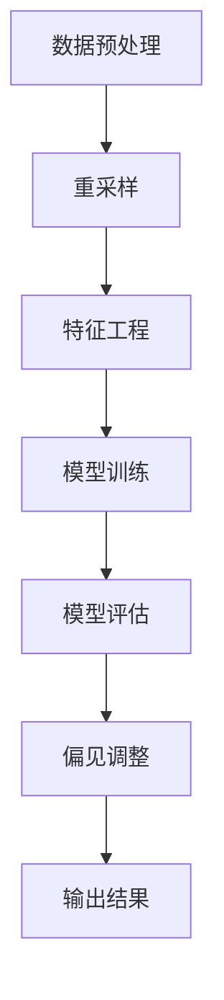
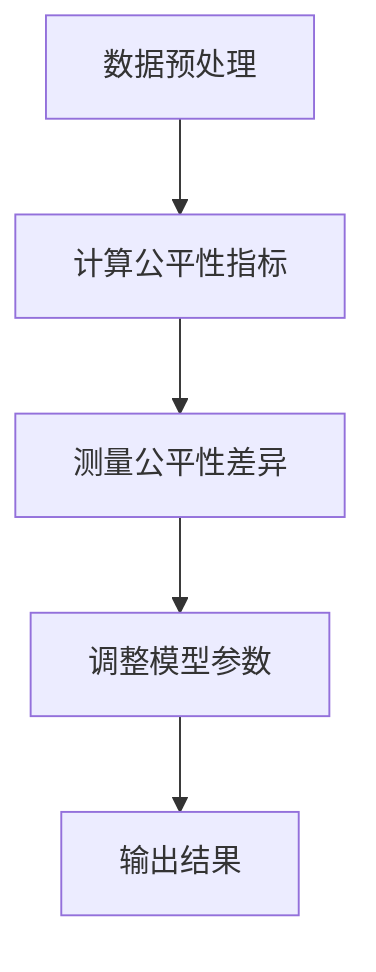

                 

### 引言与背景

在人工智能（AI）技术迅速发展的今天，越来越多的模型被应用于各种实际场景中，如医疗诊断、招聘系统、金融风控等。然而，随着AI技术的普及，一个不容忽视的问题是偏见检测和模型输出公平性问题。这一问题的存在，不仅会对社会公平性造成潜在威胁，还会影响AI技术的长期发展和应用。

首先，伦理与偏见的基本概念需要明确。伦理是指人们在社会生活中应遵循的道德规范和行为准则。偏见，则是指个体或群体对某些事物或人持有的一种不合理、不公平的看法。在人工智能领域，偏见主要表现为AI模型在学习和决策过程中，受到训练数据中固有偏见的影响，导致模型输出对某些群体或个体产生不公平待遇。

其次，模型输出公平性的重要性不可忽视。模型输出公平性指的是AI模型在处理不同数据集时，对各类数据的处理结果保持一致性，不因数据来源、特征或背景等因素而表现出偏见。确保模型输出公平性，不仅有助于保护社会公平，提高模型的可信度和接受度，还能有效避免因偏见导致的错误决策，降低法律和商业风险。

随着AI技术的不断进步，伦理与偏见检测技术也在不断发展。目前，常见的偏见检测技术主要包括数据不平衡处理、特征工程和模型评估指标等。这些技术从不同角度出发，旨在消除或减轻AI模型中的偏见，提高模型输出公平性。

本文将围绕伦理与偏见检测展开讨论，首先介绍伦理与偏见的基本概念，接着探讨偏见检测技术的原理和方法，然后分析模型输出公平性的评估指标，并结合实际案例进行详细讲解。最后，我们将对偏见检测技术的未来发展趋势和挑战进行展望，并总结最佳实践和注意事项。希望通过本文的探讨，能够为读者在AI领域的发展提供有益的参考和启示。

### 伦理与偏见的基本概念

伦理是指人们在道德和社会规范指导下，对行为进行判断和选择的一系列原则和规范。伦理学作为一门研究道德现象和道德原则的学科，涵盖了人类行为的道德判断、道德规范的形成和发展等内容。伦理的核心在于追求公正、公平、尊重和关爱，是人类社会文明进步的重要标志。

在人工智能（AI）领域，伦理问题尤为突出。首先，AI技术的应用范围广泛，从医疗诊断到招聘系统，从金融风控到自动驾驶，AI模型在处理大量数据时，会不可避免地受到训练数据中存在的偏见影响。这种偏见可能源于数据采集过程中的不公正，或数据集中固有的社会和文化偏见。例如，在一个招聘系统中，如果训练数据中包含对某些性别、种族或年龄的歧视，那么模型在处理实际招聘任务时，很可能会对某些群体产生不公平待遇。

偏见，是指个体或群体对某些事物或人持有的一种不合理、不公平的看法。偏见可能源于个人的主观经验、文化背景、社会认知等多种因素。在AI领域，偏见主要表现为模型在处理不同数据集时，对某些特征或群体表现出歧视性倾向。这种偏见不仅会影响模型输出的公正性，还可能加剧社会不公，导致严重的法律和道德问题。

伦理与偏见在AI领域的关系紧密相连。首先，伦理原则是指导AI技术研发和应用的基本准则。确保AI技术的伦理合规，是避免偏见和歧视的根本途径。例如，在医疗诊断中，AI模型必须遵循公平、公正的原则，确保对各类患者提供一致的医疗服务。其次，偏见检测和消除技术是确保模型输出公平性的关键手段。通过技术手段识别和消除模型中的偏见，可以有效提高AI技术的可信度和公正性。

为了更好地理解伦理与偏见在AI领域的影响，我们可以通过一个实际案例进行分析。假设一个招聘系统使用了基于历史数据的AI模型来筛选候选人。如果训练数据中包含对某些性别的歧视，那么模型在处理实际招聘任务时，很可能会对女性候选人产生偏见，从而影响她们的求职机会。这不仅违反了伦理原则，还可能引发法律纠纷和社会不满。

因此，在AI领域，伦理与偏见问题不容忽视。通过深入理解伦理与偏见的基本概念，我们可以更好地识别和解决模型中的偏见问题，确保AI技术的公平、公正和可信性。接下来，本文将详细介绍偏见检测技术，探讨如何通过技术手段消除AI模型中的偏见，从而提高模型输出公平性。

### 偏见检测技术

偏见检测技术是确保模型输出公平性的关键手段。通过识别和消除模型中的偏见，我们可以提高AI技术的可信度和公正性。偏见检测技术主要涵盖数据不平衡处理、特征工程和模型评估指标等方面。下面，我们将详细探讨这些技术的原理和方法。

#### 数据不平衡处理

数据不平衡处理是偏见检测的基础。在实际应用中，数据集中往往存在某些类别或特征的比例失衡，这会导致模型在学习过程中对少数类别或特征产生偏见。为了解决这个问题，我们可以采用以下几种方法：

1. **重采样（Resampling）**：通过增加少数类别或特征的数据量，使数据集在各类别或特征上分布更加均匀。常用的重采样方法包括过采样（Over-sampling）和欠采样（Under-sampling）。过采样通过复制少数类别或特征的数据来增加其样本量；欠采样则通过删除多数类别或特征的数据来减少样本量。

2. **集成学习（Ensemble Learning）**：通过组合多个模型来提高模型的泛化能力，从而减轻数据不平衡问题。常用的集成学习方法包括Bagging和Boosting。Bagging通过训练多个基学习器，并对预测结果进行投票或取平均；Boosting则通过调整基学习器的权重，使对错误分类样本的关注度增加。

3. **生成对抗网络（GAN）**：通过生成对抗网络，我们可以生成与训练数据分布相似的虚假数据，从而平衡数据集。GAN由生成器（Generator）和判别器（Discriminator）组成，生成器和判别器相互竞争，使生成的数据在质量上越来越接近真实数据。

#### 特征工程

特征工程是偏见检测的核心。通过选择和构造合适的特征，我们可以消除或减轻模型中的偏见。以下是一些常见的特征工程技术：

1. **特征选择（Feature Selection）**：通过选择与目标变量高度相关的特征，减少冗余信息，从而降低偏见。常用的特征选择方法包括过滤式（Filter）、包装式（Wrapper）和嵌入式（Embedded）方法。

2. **特征转换（Feature Transformation）**：通过变换原始特征，使其在模型中的表现更加公正。例如，对某些特征进行归一化处理，使其具有相同的量纲；对某些特征进行降维处理，减少特征间的相互影响。

3. **特征加权（Feature Weighting）**：通过调整不同特征在模型中的权重，使模型对偏见性特征的关注度降低。常用的特征加权方法包括L1正则化、L2正则化和交叉验证等。

#### 模型评估指标

模型评估指标是衡量模型偏见程度的重要工具。以下是一些常用的评估指标：

1. **混淆矩阵（Confusion Matrix）**：混淆矩阵可以直观地展示模型对各类别或特征的预测结果。通过分析混淆矩阵，我们可以发现模型可能存在的偏见，从而进行针对性的调整。

2. **公平性指标（Fairness Metrics）**：公平性指标用于评估模型对各类别或特征的预测结果是否公平。常用的公平性指标包括均衡性（Equity）、公平性差异（Fairness Difference）和群体公平性（Group Fairness）等。

3. **AUC-ROC（Area Under the Receiver Operating Characteristic Curve）**：AUC-ROC曲线用于评估模型的分类性能。在评估模型偏见时，我们可以通过计算不同类别或特征在AUC-ROC曲线上的面积差异，来判断模型是否存在偏见。

#### Mermaid流程图

为了更清晰地展示偏见检测技术的原理和方法，我们可以使用Mermaid流程图来描述。以下是一个简单的偏见检测流程：

通过上述流程，我们可以逐步识别和消除模型中的偏见，从而提高模型输出的公平性。

综上所述，偏见检测技术是确保模型输出公平性的关键。通过数据不平衡处理、特征工程和模型评估指标等多种手段，我们可以有效识别和消除AI模型中的偏见，提高模型的可信度和公正性。接下来，我们将进一步探讨如何评估模型输出公平性，确保AI技术在各个领域的应用能够遵循伦理和公平原则。

### 评估模型输出公平性的方法

评估模型输出公平性是确保AI技术公正性的关键步骤。为了实现这一目标，我们需要采用一系列科学、有效的评估指标和方法。以下将介绍几种常用的评估方法，包括公平性指标的计算和公平性差异的测量。

#### 公平性指标的计算

公平性指标是评估模型对各类别或特征处理结果是否公平的重要工具。以下是一些常用的公平性指标：

1. **均衡性（Equity）**：均衡性指标用于衡量模型在各个类别或特征上的预测结果是否均匀。均衡性指标通常通过计算各类别或特征的预测准确率、召回率、F1分数等指标的平均值来评估。公式如下：

   $$ \text{Equity} = \frac{1}{n} \sum_{i=1}^{n} \text{Accuracy}_{i} $$

   其中，\( n \)表示类别或特征的个数，\( \text{Accuracy}_{i} \)表示第\( i \)类别的预测准确率。

2. **公平性差异（Fairness Difference）**：公平性差异指标用于衡量模型在不同类别或特征上的预测结果差异。公平性差异可以通过计算各类别或特征之间的预测准确率差异、召回率差异等来评估。公式如下：

   $$ \text{Fairness Difference} = \frac{1}{n} \sum_{i=1}^{n} \text{Accuracy}_{i} - \text{Accuracy}_{\text{avg}} $$

   其中，\( \text{Accuracy}_{\text{avg}} \)表示所有类别或特征的平均预测准确率。

3. **群体公平性（Group Fairness）**：群体公平性指标用于衡量模型对各个群体（如性别、种族、年龄等）的预测结果是否公平。群体公平性可以通过计算不同群体之间的预测准确率、召回率等差异来评估。公式如下：

   $$ \text{Group Fairness} = \frac{1}{g} \sum_{i=1}^{g} \frac{1}{n_{i}} \sum_{j=1}^{n_{i}} \text{Accuracy}_{ij} $$

   其中，\( g \)表示群体的个数，\( n_{i} \)表示第\( i \)个群体的成员个数，\( \text{Accuracy}_{ij} \)表示第\( i \)个群体中的第\( j \)个成员的预测准确率。

#### 公平性差异的测量

测量公平性差异是评估模型输出公平性的重要步骤。以下几种方法可以帮助我们有效地测量公平性差异：

1. **t-检验（t-Test）**：t-检验是一种统计方法，用于比较两个样本均值是否存在显著差异。在模型输出公平性评估中，我们可以使用t-检验来比较不同类别或特征之间的预测准确率、召回率等指标是否显著不同。通过t-检验，我们可以识别出模型可能存在的偏见，并对其进行调整。

2. **方差分析（ANOVA）**：方差分析是一种用于比较多个样本均值差异的统计方法。在模型输出公平性评估中，我们可以使用ANOVA来比较不同群体之间的预测准确率、召回率等指标是否显著不同。通过ANOVA，我们可以识别出模型在哪些群体上可能存在偏见，并采取相应的措施进行修正。

3. **热力图（Heatmap）**：热力图是一种可视化工具，用于展示不同类别或特征之间的预测准确率、召回率等指标差异。通过热力图，我们可以直观地了解模型在不同类别或特征上的表现，从而发现潜在的偏见。

#### Mermaid流程图

为了更清晰地展示评估模型输出公平性的方法，我们可以使用Mermaid流程图来描述。以下是一个简单的评估流程：

通过上述流程，我们可以逐步计算公平性指标、测量公平性差异，并调整模型参数，从而确保模型输出公平性。

综上所述，评估模型输出公平性是确保AI技术公正性的关键步骤。通过计算公平性指标、测量公平性差异，以及调整模型参数，我们可以有效地识别和消除模型中的偏见，提高模型输出的公平性和可信度。接下来，我们将探讨实际应用中的偏见检测技术，并通过具体案例进行分析和讲解。

### 实际应用与案例分析

在现实世界中，偏见检测技术在多个领域都取得了显著的应用成果。以下将结合具体案例，详细探讨偏见检测技术在招聘、金融风控和其他领域的应用。

#### 招聘中的偏见检测

在招聘过程中，AI模型通常用于筛选候选人，并根据候选人的简历、工作经验等信息进行评分。然而，如果训练数据中包含对某些性别、种族或年龄的偏见，那么模型在处理实际招聘任务时，很可能会对某些群体产生不公平待遇。

一个典型的案例是美国科技公司Amazon的招聘系统。根据媒体报道，该公司的招聘系统曾因性别偏见而存在歧视现象。该系统在评估简历时，对男性候选人的评分更高，导致女性候选人在招聘过程中处于不利地位。后来，Amazon采取了一系列措施，包括调整算法参数、引入偏见检测技术，从而提高了招聘系统的公平性。

具体来说，Amazon使用了基于词嵌入（Word Embedding）和词性标注（Part-of-Speech Tagging）的偏见检测技术。通过分析简历中的语言特征，系统可以识别出可能存在的性别偏见。例如，如果简历中频繁出现与男性相关的词汇，而与女性相关的词汇较少，那么系统会认为该简历存在性别偏见。基于这一分析结果，系统会自动调整候选人的评分，以消除偏见。

#### 金融风控中的偏见检测

在金融风控领域，AI模型常用于风险评估、信用评分等任务。然而，金融数据中往往存在各种偏见，如对某些地区、职业或性别的高风险偏见。这些偏见可能导致模型在评估信用风险时产生偏差，从而影响金融机构的决策。

一个实际的案例是中国某互联网金融平台。该平台在信用评分过程中，发现模型对某些地区（如西部地区）的评分普遍较低，这可能源于数据中存在的地域偏见。为了解决这个问题，平台采取了以下措施：

1. **数据预处理**：通过对训练数据进行重采样和清洗，消除地域偏见。例如，增加西部地区借款人的数据量，减少其他地区借款人的数据量。

2. **特征工程**：重新设计特征，减少地域偏见的影响。例如，引入与地域无关的变量，如借款人的消费习惯、还款记录等。

3. **偏见检测算法**：采用基于词嵌入和神经网络技术的偏见检测算法，识别和消除模型中的地域偏见。例如，通过分析借款人简历中的语言特征，识别出可能存在的地域偏见。

通过这些措施，平台成功提高了信用评分的公平性和准确性，降低了因偏见导致的贷款风险。

#### 其他领域的偏见检测

除了招聘和金融风控，偏见检测技术在其他领域也取得了显著的应用成果。以下是一些典型案例：

1. **医疗诊断**：在医疗诊断中，AI模型常用于疾病预测和风险评估。然而，如果训练数据中包含对某些种族、性别或年龄的偏见，那么模型在处理实际病例时，很可能会对某些群体产生不公平待遇。

   一个典型的案例是美国某医疗保险公司。该公司在疾病预测过程中，发现模型对某些种族的预测准确性较低，这可能源于数据中存在的种族偏见。为了解决这个问题，公司采取了以下措施：

   - **数据清洗**：对训练数据进行清洗，消除种族偏见。例如，删除或修正含有种族歧视性词汇的病历记录。
   - **特征工程**：重新设计特征，减少种族偏见的影响。例如，引入与种族无关的变量，如疾病严重程度、病史等。
   - **偏见检测算法**：采用基于词嵌入和神经网络技术的偏见检测算法，识别和消除模型中的种族偏见。

2. **教育评估**：在教育评估中，AI模型常用于学生成绩预测、学习效果评估等任务。然而，如果训练数据中包含对某些性别、种族或经济背景的偏见，那么模型在处理实际评估任务时，很可能会对某些群体产生不公平待遇。

   一个典型的案例是中国某在线教育平台。该平台在学生成绩预测过程中，发现模型对某些性别和种族的学生预测准确性较低，这可能源于数据中存在的性别和种族偏见。为了解决这个问题，平台采取了以下措施：

   - **数据清洗**：对训练数据进行清洗，消除性别和种族偏见。例如，删除或修正含有性别歧视性词汇和种族歧视性词汇的试题和答案。
   - **特征工程**：重新设计特征，减少性别和种族偏见的影响。例如，引入与性别和种族无关的变量，如学生的学习时长、作业提交情况等。
   - **偏见检测算法**：采用基于词嵌入和神经网络技术的偏见检测算法，识别和消除模型中的性别和种族偏见。

综上所述，偏见检测技术在多个领域取得了显著的应用成果。通过识别和消除模型中的偏见，我们可以提高AI技术的公平性和可信度，从而更好地服务于社会。接下来，我们将探讨偏见检测技术的未来发展趋势和面临的挑战。

### 偏见检测技术的未来发展趋势和挑战

偏见检测技术作为确保AI模型输出公平性的重要手段，正在不断发展和完善。然而，随着AI技术的不断进步和应用场景的扩大，偏见检测技术也面临着一系列新的发展趋势和挑战。

#### 未来发展趋势

1. **多模态偏见检测**：传统的偏见检测技术主要针对文本数据，但随着图像、语音、视频等数据的广泛应用，多模态偏见检测成为未来的重要发展方向。通过结合不同类型的数据，多模态偏见检测可以更全面地识别和消除模型中的偏见。

2. **深度学习和神经网络技术**：深度学习和神经网络技术在AI领域具有广泛的应用，但在偏见检测方面也具有巨大潜力。通过引入深度学习模型，如卷积神经网络（CNN）和循环神经网络（RNN），可以更有效地识别和消除模型中的偏见。

3. **自动化偏见检测工具**：随着偏见检测技术的发展，越来越多的自动化偏见检测工具被推出。这些工具可以自动分析模型和数据，识别潜在的偏见，并生成详细的报告，为开发者和研究人员提供有力的支持。

4. **跨学科研究**：偏见检测技术不仅涉及到计算机科学，还与伦理学、社会学、心理学等领域密切相关。未来，跨学科研究将成为偏见检测技术发展的关键方向，通过综合不同领域的知识，可以更全面地解决偏见问题。

#### 面临的挑战

1. **数据隐私和安全**：偏见检测技术需要分析大量的敏感数据，如个人简历、医疗记录等。如何在保障数据隐私和安全的前提下，进行有效的偏见检测，是当前面临的重要挑战。

2. **可解释性和透明度**：尽管偏见检测技术可以识别和消除模型中的偏见，但如何解释和证明这些操作的有效性，仍然是当前的一个难题。提高偏见检测技术的方法和结果的可解释性，是未来研究的重要方向。

3. **算法公平性和鲁棒性**：偏见检测算法本身可能存在不公平或鲁棒性问题。例如，某些算法可能对某些特定群体产生偏见，或者在面对异常数据时，表现不佳。提高算法的公平性和鲁棒性，是确保偏见检测技术有效性的关键。

4. **伦理和社会责任**：偏见检测技术不仅需要解决技术问题，还涉及到伦理和社会责任。如何平衡技术进步和社会公平，确保偏见检测技术不会加剧社会不公，是未来需要深入探讨的问题。

综上所述，偏见检测技术在未来将继续发展，但同时也面临着一系列新的挑战。通过不断探索和创新，我们可以更好地应对这些挑战，确保AI技术的公平、公正和可信性。接下来，我们将总结本文的主要观点，并探讨偏见检测技术的最佳实践。

### 总结

本文围绕伦理与偏见检测，系统性地探讨了确保模型输出公平性的重要性和方法。首先，我们明确了伦理与偏见的基本概念，并阐述了它们在AI领域的关系。接着，详细介绍了偏见检测技术，包括数据不平衡处理、特征工程和模型评估指标等。通过这些技术，我们可以有效识别和消除模型中的偏见，提高模型输出的公平性和可信度。

评估模型输出公平性是确保AI技术公正性的关键步骤。本文介绍了均衡性、公平性差异和群体公平性等评估指标，以及t-检验、方差分析和热力图等测量方法。通过这些方法，我们可以全面、科学地评估模型输出的公平性，并采取相应措施进行优化。

实际应用与案例分析部分，我们结合招聘、金融风控等领域的具体案例，展示了偏见检测技术的实际应用效果。通过这些案例，我们看到了偏见检测技术在解决实际偏见问题中的重要作用。

未来，偏见检测技术将继续发展，面临新的挑战和机遇。我们呼吁读者关注这些发展趋势，积极参与研究和实践，共同推动AI技术的公平、公正和可持续发展。

### 最佳实践、注意事项及拓展阅读

在进行偏见检测和确保模型输出公平性的过程中，以下是一些最佳实践和注意事项：

1. **数据隐私保护**：在分析敏感数据时，务必遵守数据隐私法规，采用匿名化、加密等技术保护个人隐私。

2. **透明度和可解释性**：提高偏见检测算法的可解释性，确保决策过程的透明度，便于用户理解和信任。

3. **持续监测与优化**：定期对模型进行偏见检测和评估，及时调整和优化模型参数，以应对新出现的偏见问题。

4. **多学科协作**：偏见检测不仅是技术问题，还涉及伦理、社会等多方面。因此，多学科协作有助于更全面地解决偏见问题。

5. **合规性审查**：确保模型输出符合相关法律法规和伦理标准，避免因偏见导致的法律和道德风险。

对于希望进一步了解偏见检测和模型输出公平性的读者，以下是一些建议的拓展阅读资源：

- **书籍**：
  - 《AI伦理学：人工智能的社会责任与道德边界》
  - 《算法偏见：如何消除人工智能中的歧视和偏见》

- **论文**：
  - "Fairness in Machine Learning"（JMLR）
  - "Unfairness in Machine Learning: A Computational Perspective"（NeurIPS）

- **在线课程和讲座**：
  - Coursera上的“AI伦理学”课程
  - edX上的“Bias in AI and Algorithms”专题讲座

通过阅读这些资源和参与相关研究，您可以更深入地了解偏见检测的技术原理和应用实践，为推动AI技术的公平、公正发展贡献自己的力量。

### 作者信息

作者：AI天才研究院/AI Genius Institute & 禅与计算机程序设计艺术 /Zen And The Art of Computer Programming

本文由AI天才研究院撰写，该研究院致力于推动人工智能技术的发展和应用。同时，作者还结合禅与计算机程序设计艺术的理念，为读者带来更具深度和思考的技术分享。希望通过本文，能为读者在AI领域的探索提供有益的参考和启示。

