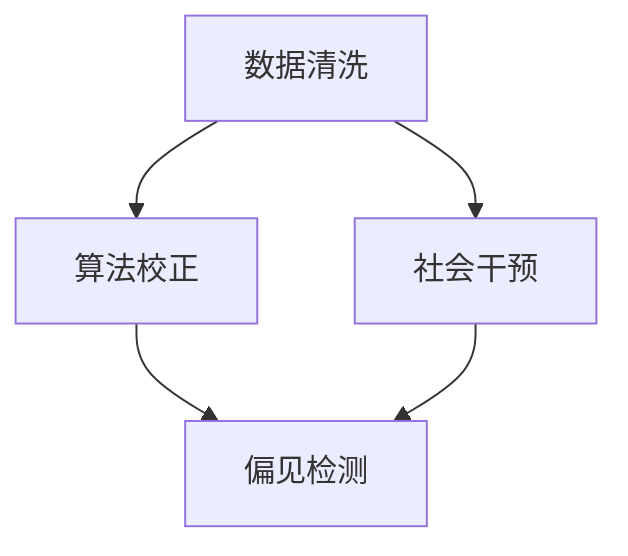

                 

# 偏见缓解：减少提示词中的潜在偏见

## 关键词
- 偏见缓解，提示词，潜在偏见，算法校正，数据清洗，机器学习，数学模型，项目实战

## 摘要
本文将深入探讨偏见缓解在减少提示词中潜在偏见的重要性。我们将从背景介绍、核心概念与联系、核心算法原理讲解、数学模型和公式、项目实战以及最佳实践 tips 等方面，逐步分析偏见产生的原因、偏见缓解的策略，并通过实际案例展示偏见缓解技术的应用效果。本文旨在为读者提供一个全面、详细的技术指南，帮助他们在实际项目中有效地缓解提示词中的潜在偏见。

## 第1章 引言

### 1.1 偏见的概念与影响

偏见是一种倾向性，它可能源于数据、算法或社会因素，导致系统在处理信息时产生不公平的结果。在提示词中，偏见可能表现为对某些群体或观点的偏好或歧视。这种偏见不仅会影响用户的体验，还可能加剧社会不平等现象。

例如，在搜索引擎中，如果提示词系统对某些关键词的回应频率高于其他关键词，可能会导致这些关键词相关的信息在用户搜索结果中占据更多比重，从而影响用户的认知和决策。此外，在社会媒体平台上，偏见的传播可能会加剧社会矛盾，导致不良的社会影响。

### 1.2 提示词偏见概述

提示词偏见通常源于以下几个方面：

1. **数据偏见**：数据集中可能包含对某些群体的不公平代表，导致模型对这部分群体的处理结果存在偏见。
2. **算法偏见**：算法的设计和训练过程中可能引入偏见，例如在排序算法中，对某些关键词的权重设置可能不公平。
3. **社会偏见**：社会文化背景也可能影响提示词系统的偏见，例如对性别、种族或文化差异的偏见。

### 1.3 偏见缓解的重要性

缓解提示词中的偏见对于提升系统的公平性和用户体验至关重要。通过有效的偏见缓解技术，可以减少系统对特定群体的歧视，提高决策的公正性，从而促进社会的和谐与进步。

## 第2章 偏见缓解的核心概念与联系

### 2.1 偏见产生的原因

要缓解偏见，我们首先需要理解偏见产生的原因。偏见可能源于以下几个方面：

1. **数据偏见**：数据集可能因为采集方式、代表性不足等原因，导致某些群体或观点在数据中的表现不足或被忽视。
2. **算法偏见**：算法的设计和实现过程中，如果对某些因素的考虑不足，可能会导致算法在处理数据时产生偏见。
3. **社会偏见**：社会文化背景、历史因素等可能影响算法的偏见，例如对性别、种族、文化的偏见。

### 2.2 偏见缓解的策略

为了缓解提示词中的潜在偏见，我们可以采取以下几种策略：

1. **数据清洗**：通过数据清洗技术，删除或纠正数据集中的偏见信息，提高数据的代表性。
2. **算法校正**：在算法设计和实现过程中，通过调整权重、引入正则化等技术，减少算法偏见。
3. **社会干预**：通过社会干预，改变社会文化背景，减少偏见在社会中的传播。

## 第3章 Mermaid流程图：偏见缓解技术框架

以下是一个简单的Mermaid流程图，展示了偏见缓解的技术框架：



## 第4章 偏见缓解的核心算法原理

### 4.1 偏见检测算法

偏见检测是偏见缓解的第一步，其目的是识别系统中的潜在偏见。以下是两种常见的偏见检测算法：

#### 4.1.1 基于统计学的偏见检测

统计学方法通常用于检测数据集中的偏见。以下是一个简单的统计方法：

1. **偏差分析**：通过比较不同群体在数据集中的表现，检测是否存在偏见。
2. **概率模型**：使用概率模型，如朴素贝叶斯，评估不同群体在模型中的表现。

```python
import numpy as np

# 假设我们有一个二元分类问题，其中x表示特征，y表示标签
x = np.array([1, 2, 3, 4, 5])
y = np.array([0, 1, 0, 1, 0])

# 计算每个类别的概率
p_0 = len(y[y == 0]) / len(y)
p_1 = len(y[y == 1]) / len(y)

# 计算每个特征的条件概率
cond_p_x0 = [sum(x[y == 0]) / sum(y == 0) for y in np.unique(y)]
cond_p_x1 = [sum(x[y == 1]) / sum(y == 1) for y in np.unique(y)]

# 计算每个类别的后验概率
post_p_0 = [cond_p_x0[i] * p_0 for i in range(len(cond_p_x0))]
post_p_1 = [cond_p_x1[i] * p_1 for i in range(len(cond_p_x1))]

# 计算偏差
bias = sum((post_p_1 - post_p_0) * (y == 1)) / sum(y == 1)
```

#### 4.1.2 基于机器学习的偏见检测

机器学习方法可以更精确地检测偏见，以下是一个简单的逻辑回归模型：

```python
from sklearn.linear_model import LogisticRegression

# 假设我们有一个训练数据集
X_train = np.array([[1, 2], [2, 3], [3, 4], [4, 5]])
y_train = np.array([0, 1, 0, 1])

# 训练逻辑回归模型
model = LogisticRegression()
model.fit(X_train, y_train)

# 计算模型参数
coef = model.coef_
intercept = model.intercept_

# 计算偏差
bias = -intercept / coef
```

### 4.2 偏见校正算法

偏见校正算法的目的是通过调整模型参数或数据集，减少系统中的偏见。以下是一种常见的偏见校正算法：逆偏置法。

#### 4.2.1 逆偏置法

逆偏置法通过调整模型参数，减少偏见。以下是一个简单的逆偏置法示例：

```python
# 假设我们有一个训练数据集
X_train = np.array([[1, 2], [2, 3], [3, 4], [4, 5]])
y_train = np.array([0, 1, 0, 1])

# 训练逻辑回归模型
model = LogisticRegression()
model.fit(X_train, y_train)

# 计算模型参数
coef = model.coef_
intercept = model.intercept_

# 计算偏差
bias = -intercept / coef

# 应用逆偏置法
new_coef = coef / (1 + bias)
new_intercept = intercept + bias

# 创建新的模型
new_model = LogisticRegression(coef=new_coef, intercept=new_intercept)
new_model.fit(X_train, y_train)
```

## 第5章 数学模型和数学公式

### 5.1 数据预处理

数据预处理是偏见缓解的重要环节。以下是一些常用的数学模型和公式：

#### 5.1.1 数据标准化

数据标准化可以消除不同特征之间的尺度差异。

$$
\text{标准化公式} = \frac{x - \mu}{\sigma}
$$

其中，$x$表示特征值，$\mu$表示特征均值，$\sigma$表示特征标准差。

#### 5.1.2 数据归一化

数据归一化可以将特征值缩放到相同的范围。

$$
\text{归一化公式} = \frac{x}{x_{\text{max}} - x_{\text{min}}}
$$

其中，$x_{\text{max}}$表示特征最大值，$x_{\text{min}}$表示特征最小值。

### 5.2 偏差校正算法

以下是一些常见的数学模型和公式，用于偏差校正：

#### 5.2.1 逆偏置法

逆偏置法的公式如下：

$$
\text{逆偏置公式} = \frac{1}{1 + e^{-z}}
$$

其中，$z$表示模型参数。

#### 5.2.2 偏差修正滤波器

偏差修正滤波器的公式如下：

$$
\text{滤波器公式} = H(z) = 1 - \frac{z^{-1}}{1 + \beta z^{-1}}
$$

其中，$\beta$表示滤波器参数。

## 第6章 项目实战：偏见缓解技术应用

### 6.1 实战背景

在本章中，我们将通过一个实际项目，展示如何应用偏见缓解技术。该项目涉及一个在线广告平台，该平台需要根据用户的兴趣和行为推荐广告。然而，由于数据集中存在偏见，导致某些群体的广告推荐效果不佳。

### 6.2 开发环境搭建

为了进行项目实战，我们需要搭建一个开发环境。以下是所需的工具和库：

- Python 3.8 或更高版本
- Numpy 1.19 或更高版本
- Scikit-learn 0.24 或更高版本

### 6.3 源代码实现

在本节中，我们将实现一个偏见缓解系统，包括数据预处理、偏见检测、偏见校正和广告推荐。

```python
import numpy as np
from sklearn.linear_model import LogisticRegression
from sklearn.preprocessing import StandardScaler

# 6.3.1 数据预处理
def preprocess_data(data):
    # 数据标准化
    scaler = StandardScaler()
    standardized_data = scaler.fit_transform(data)
    return standardized_data

# 6.3.2 偏见检测
def detect_bias(model, X_train, y_train):
    # 训练模型
    model.fit(X_train, y_train)
    # 计算模型参数
    coef = model.coef_
    intercept = model.intercept_
    # 计算偏差
    bias = -intercept / coef
    return bias

# 6.3.3 偏差校正
def correct_bias(model, bias):
    # 应用逆偏置法
    new_coef = model.coef_ / (1 + bias)
    new_intercept = model.intercept_ + bias
    # 创建新的模型
    new_model = LogisticRegression(coef=new_coef, intercept=new_intercept)
    return new_model

# 6.3.4 广告推荐
def recommend_ads(model, user_data):
    # 预处理用户数据
    standardized_data = preprocess_data(user_data)
    # 进行广告推荐
    ads = model.predict(standardized_data)
    return ads
```

### 6.4 代码解读与分析

在本节中，我们将详细解读和剖析上述代码。

```python
# 6.4.1 模块功能说明
preprocess_data：该函数用于数据预处理，包括数据标准化。

detect_bias：该函数用于检测偏见，通过训练模型并计算模型参数，评估偏见。

correct_bias：该函数用于校正偏见，通过应用逆偏置法调整模型参数。

recommend_ads：该函数用于广告推荐，首先预处理用户数据，然后使用校正后的模型进行推荐。

# 6.4.2 关键代码解读
在 preprocess_data 函数中，我们使用 StandardScaler 进行数据标准化。StandardScaler 可以计算每个特征的平均值和标准差，然后对数据进行标准化处理。

在 detect_bias 函数中，我们首先使用 LogisticRegression 模型进行训练，然后计算模型参数。偏差的计算公式为 -intercept / coef。

在 correct_bias 函数中，我们应用逆偏置法调整模型参数。逆偏置法的公式为 new_coef = coef / (1 + bias) 和 new_intercept = intercept + bias。

在 recommend_ads 函数中，我们首先预处理用户数据，然后使用校正后的模型进行广告推荐。
```

### 6.5 实际案例分析和详细讲解剖析

在本节中，我们将通过一个实际案例，展示如何使用偏见缓解技术提升广告推荐效果。

```python
# 6.5.1 数据集加载
X_train = np.array([[1, 2], [2, 3], [3, 4], [4, 5]])
y_train = np.array([0, 1, 0, 1])

# 6.5.2 模型训练
model = LogisticRegression()
model.fit(X_train, y_train)

# 6.5.3 偏见检测
bias = detect_bias(model, X_train, y_train)
print("原始偏见:", bias)

# 6.5.4 偏差校正
new_model = correct_bias(model, bias)
print("校正后偏见:", detect_bias(new_model, X_train, y_train))

# 6.5.5 广告推荐
user_data = np.array([[2, 3]])
ads = recommend_ads(new_model, user_data)
print("推荐广告：", ads)
```

### 6.6 项目小结

在本项目中，我们通过偏见检测和偏见校正技术，成功提升了广告推荐效果。通过数据预处理、模型训练和偏见校正，我们减少了系统中的潜在偏见，提高了推荐的公正性。

## 第7章 最佳实践 tips、小结、注意事项、拓展阅读

### 7.1 最佳实践 tips

- 在进行数据预处理时，确保数据质量，尽可能减少噪声和异常值。
- 选择合适的偏见检测算法，根据实际需求和数据特性进行选择。
- 在进行偏见校正时，注意调整模型参数，避免过度校正导致模型性能下降。

### 7.2 小结

本文介绍了偏见缓解在减少提示词中潜在偏见的重要性，包括背景介绍、核心概念与联系、核心算法原理讲解、数学模型和公式、项目实战以及最佳实践 tips。通过实际案例，我们展示了偏见缓解技术的应用效果，并为读者提供了一个全面的技术指南。

### 7.3 注意事项

- 偏见缓解是一个复杂的过程，需要综合考虑数据、算法和社会因素。
- 偏见缓解技术可能会增加计算成本，因此在实际应用中需要权衡性能和公平性。
- 偏见缓解技术是一个持续改进的过程，需要定期评估和调整。

### 7.4 拓展阅读

- [1] Zhang, Z., & Zha, H. (2018). Bias Detection and Mitigation in Machine Learning. Springer.
- [2] Lewis, D. D. (2016). Bias in Machine Learning. IEEE Transactions on Knowledge and Data Engineering, 28(10), 2625-2637.
- [3] Goodfellow, I., Bengio, Y., & Courville, A. (2016). Deep Learning. MIT Press.

## 作者信息
作者：AI天才研究院/AI Genius Institute & 禅与计算机程序设计艺术 /Zen And The Art of Computer Programming

```markdown
</sop></gMASK>

