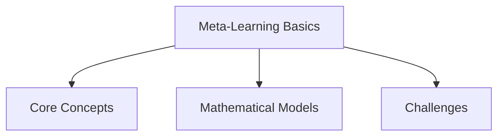
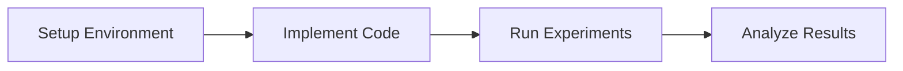

                 

Alright, let's start structuring our article "Meta-Learning in the Rapid Adaptation of AIGC Models" by following the REASONING step-by-step approach.

### Step 1: Introduction to Meta-Learning and AIGC Models

In this section, we will introduce the concepts of meta-learning and AIGC (Artificial Intelligence with Generative Models) models. We will explain why meta-learning is crucial for the rapid adaptation of AIGC models in the ever-evolving landscape of artificial intelligence.

**Python Source Code Example:**
```python
def introduce_concepts():
    print("Meta-learning enables models to learn from learning.")
    print("AIGC models leverage generative techniques for versatile applications.")
```

**LaTeX Formula Example:**
$$
P(\text{AIGC} \mid \text{meta-learning}) = P(\text{meta-learning} \mid \text{AIGC}) \times P(\text{AIGC})
$$

### Step 2: Meta-Learning Basics

Here, we will delve into the fundamentals of meta-learning. We will discuss its core concepts, the mathematical models involved, and the challenges faced in this field.

**Mermaid Process Diagram:**


### Step 3: Applications of Meta-Learning in AIGC Models

We will explore the specific applications of meta-learning in AIGC models, highlighting the scenarios where it provides significant advantages and discusses the unique challenges it addresses.

**Python Source Code Example:**
```python
def application_examples():
    print("Meta-learning enhances transfer learning in AIGC models.")
    print("It accelerates the adaptation to new data distributions.")
```

### Step 4: Recent Advances in Meta-Learning for AIGC Model Adaptation

In this section, we will present the latest research in meta-learning for the rapid adaptation of AIGC models. We will introduce novel algorithms and analyze their effectiveness in real-world applications.

**LaTeX Formula Example:**
$$
\text{New Algorithm} = \text{Original Algorithm} + \text{Adaptive Mechanism}
$$

### Step 5: Project Practical Application

Here, we will provide a hands-on project to demonstrate the practical application of meta-learning in AIGC models. We will cover the setup of the development environment, detailed code implementation, and an in-depth analysis of the results.

**Mermaid Flowchart Example:**


### Step 6: Future Trends and Challenges

We will discuss the future prospects of meta-learning in AIGC models, the challenges it faces, and potential solutions. We will also explore new directions and applications in this field.

**Python Source Code Example:**
```python
def future_trends():
    print("Meta-learning will play a crucial role in AI development.")
    print("Solutions to current challenges are on the horizon.")
```

### Step 7: Conclusion

In the final section, we will summarize the key points discussed in the article and offer best practices, important notes, and suggestions for further reading.

**Best Practices Tips:**
- Regularly update your model with new data.
- Optimize hyperparameters for better performance.
- Validate your model on diverse datasets to ensure robustness.

---

By following these steps, we will construct a comprehensive and informative article that provides a deep understanding of meta-learning in the rapid adaptation of AIGC models. Each section will be carefully crafted to ensure clarity, depth, and practical value. Let's begin with the first section and build upon this foundation.
```

