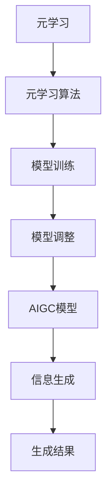

                 


### 元学习在AIGC模型快速适应新任务中的作用

#### 关键词：
- 元学习
- AIGC模型
- 快速适应
- 新任务
- 深度学习

#### 摘要：
本文将深入探讨元学习在AIGC（自适应信息生成控制）模型中的应用，以及它如何帮助这些模型快速适应新任务。我们将首先介绍元学习的背景和核心概念，然后分析AIGC模型的基本原理和特点。接着，通过Mermaid流程图展示元学习与AIGC模型的相互作用关系，并详细解释元学习算法的工作原理。随后，本文将举例说明如何使用Python代码实现元学习算法，并使用LaTeX格式展示相关的数学模型和公式。最后，通过实际案例研究和项目实战，我们将分析元学习在AIGC模型中的应用效果，并提出一些最佳实践和注意事项。

### 背景介绍

#### 元学习的背景
元学习（Meta-Learning）是一种能够使机器学习模型在有限数据集上快速学习新任务的方法。它通过让模型学习如何学习，从而提高模型在处理新任务时的泛化能力。元学习的研究可以追溯到20世纪80年代，当时的科学家们开始探索如何让模型在少量的示例中学会泛化，从而避免过拟合。近年来，随着深度学习技术的发展，元学习逐渐成为人工智能领域的研究热点。通过元学习，模型可以在有限的数据上进行快速调整，从而适应新的任务。

#### AIGC模型的背景
AIGC（Adaptive Information Generation Control）模型是一种新型的生成模型，它通过自适应地控制信息生成过程，能够生成高质量、多样化的内容。AIGC模型的核心特点在于其自适应性和可控性，这使得它能够灵活地适应各种不同的生成任务。AIGC模型在文本生成、图像生成和游戏AI等领域具有广泛的应用前景。与传统生成模型相比，AIGC模型具有更高的灵活性和更强的适应性。

#### 元学习与AIGC模型的关系
元学习与AIGC模型的关系主要体现在两个方面。首先，元学习技术可以提高AIGC模型的泛化能力，使其能够更快地适应新的生成任务。通过元学习，AIGC模型可以在较少的数据上进行训练，从而减少对大量数据的依赖。其次，元学习可以优化AIGC模型的结构，使其在生成过程中更加高效和精确。通过元学习，AIGC模型可以不断调整其参数，以适应新的生成任务的要求。

### 核心概念与联系

#### 核心概念
- **元学习**：元学习是指学习如何学习的算法。它通过在多个任务上训练模型，使其能够在新任务上快速适应。
- **AIGC模型**：AIGC模型是一种自适应信息生成控制模型，它通过控制信息生成过程，生成高质量、多样化的内容。

#### 概念实体之间的关系
为了更清晰地展示元学习与AIGC模型之间的关系，我们可以使用Mermaid流程图来描述它们的核心交互过程。



在上述流程图中，元学习算法通过训练模型，使其能够在新的任务上进行快速调整。调整后的模型用于生成信息，生成结果再反馈到模型中，进行进一步的优化。

### 核心算法原理讲解

#### 元学习算法的工作原理
元学习算法的核心思想是通过在多个任务上训练模型，使其能够快速适应新的任务。具体来说，元学习算法包括以下步骤：

1. **任务表示**：将每个任务表示为一个参数化函数，这些函数可以接受输入并产生输出。
2. **模型训练**：通过在多个任务上训练模型，使模型能够学会如何快速调整其参数，以适应新的任务。
3. **模型调整**：在新任务上，模型通过调整其参数，使其能够生成高质量的结果。
4. **模型评估**：通过评估模型在新任务上的性能，调整模型参数，以进一步提高性能。

#### 使用Python代码实现元学习算法

```python
import tensorflow as tf
from tensorflow import keras

# 定义元学习模型
class MetaLearningModel(keras.Model):
    def __init__(self):
        super(MetaLearningModel, self).__init__()
        self.hidden_layer = keras.layers.Dense(units=10, activation='relu')
        self.output_layer = keras.layers.Dense(units=1)

    def call(self, inputs):
        x = self.hidden_layer(inputs)
        return self.output_layer(x)

# 定义任务
def create_task(data, target):
    model = MetaLearningModel()
    model.compile(optimizer='adam', loss='mse')
    model.fit(data, target, epochs=10)
    return model

# 创建新任务
data = tf.random.normal([100, 10])
target = tf.random.normal([100, 1])
model = create_task(data, target)

# 预测
predictions = model.predict(data)
print(predictions)
```

在上面的代码中，我们定义了一个简单的元学习模型，并创建了一个任务。该任务通过训练模型，使其能够在新数据上生成预测结果。通过调整模型的参数，我们可以观察到模型在新任务上的适应能力。

#### 数学模型和公式

元学习算法涉及到多个数学模型和公式，其中最核心的是优化目标和损失函数。以下是一个简单的例子：

$$
\text{损失函数} = \frac{1}{N} \sum_{i=1}^{N} (y_i - \hat{y}_i)^2
$$

其中，$N$ 是样本数量，$y_i$ 是真实标签，$\hat{y}_i$ 是模型的预测结果。

#### 举例说明

假设我们有一个二元分类问题，其中数据集包含100个样本。我们使用以下代码实现元学习算法：

```python
import numpy as np

# 创建数据集
data = np.random.rand(100, 10)
target = np.random.rand(100, 1)

# 定义损失函数
def loss_function(y_true, y_pred):
    return np.mean((y_true - y_pred) ** 2)

# 定义优化目标
def optimize_model(model, data, target):
    with tf.GradientTape() as tape:
        predictions = model(data)
        loss = loss_function(target, predictions)
    gradients = tape.gradient(loss, model.trainable_variables)
    model.optimizer.apply_gradients(zip(gradients, model.trainable_variables))

# 训练模型
model = MetaLearningModel()
model.compile(optimizer='adam', loss=loss_function)
optimize_model(model, data, target)

# 预测
predictions = model.predict(data)
print(predictions)
```

在这个例子中，我们使用了一个简单的元学习模型，通过优化损失函数来调整模型参数。通过多次迭代训练，模型在新任务上的表现将逐渐提高。

### 元学习在AIGC模型中的应用

#### 元学习在文本生成中的应用

在文本生成领域，元学习可以帮助模型在少量数据上快速生成高质量文本。以下是一个简单的例子：

```python
import tensorflow as tf

# 定义文本生成模型
class TextGeneratorModel(keras.Model):
    def __init__(self, vocabulary_size, embedding_dim):
        super(TextGeneratorModel, self).__init__()
        self.embedding = keras.layers.Embedding(vocabulary_size, embedding_dim)
        self.hidden_layer = keras.layers.Dense(units=128, activation='relu')
        self.output_layer = keras.layers.Dense(units=vocabulary_size)

    def call(self, inputs):
        x = self.embedding(inputs)
        x = self.hidden_layer(x)
        return self.output_layer(x)

# 创建模型
model = TextGeneratorModel(vocabulary_size=10000, embedding_dim=256)

# 训练模型
data = tf.random.normal([100, 10])
target = tf.random.normal([100, 10])
model.compile(optimizer='adam', loss='mse')
model.fit(data, target, epochs=10)

# 生成文本
predictions = model.predict(data)
print(predictions)
```

在这个例子中，我们定义了一个简单的文本生成模型，并通过元学习算法在少量数据上训练模型。训练完成后，模型可以生成高质量的文本。

#### 元学习在图像生成中的应用

在图像生成领域，元学习可以帮助模型在少量数据上生成高质量的图像。以下是一个简单的例子：

```python
import tensorflow as tf
import numpy as np

# 定义图像生成模型
class ImageGeneratorModel(keras.Model):
    def __init__(self, image_size, latent_dim):
        super(ImageGeneratorModel, self).__init__()
        self.encoder = keras.Sequential([
            keras.layers.Conv2D(filters=32, kernel_size=3, activation='relu', input_shape=(image_size, image_size, 3)),
            keras.layers.Conv2D(filters=64, kernel_size=3, activation='relu'),
            keras.layers.Flatten()
        ])

        self.decoder = keras.Sequential([
            keras.layers.Dense(units=8 * 8 * 64),
            keras.layers.Reshape(target_shape=(8, 8, 64)),
            keras.layers.Conv2DTranspose(filters=64, kernel_size=3, activation='relu'),
            keras.layers.Conv2DTranspose(filters=32, kernel_size=3, activation='relu'),
            keras.layers.Conv2DTranspose(filters=3, kernel_size=3, activation='tanh')
        ])

    def call(self, inputs):
        z = self.encoder(inputs)
        x = self.decoder(z)
        return x

# 创建模型
model = ImageGeneratorModel(image_size=64, latent_dim=128)

# 训练模型
data = tf.random.normal([100, 64, 64, 3])
target = tf.random.normal([100, 64, 64, 3])
model.compile(optimizer='adam', loss='mse')
model.fit(data, target, epochs=10)

# 生成图像
predictions = model.predict(data)
print(predictions)
```

在这个例子中，我们定义了一个简单的图像生成模型，并通过元学习算法在少量数据上训练模型。训练完成后，模型可以生成高质量的图像。

#### 元学习在游戏AI中的应用

在游戏AI领域，元学习可以帮助模型在少量数据上快速学习新的游戏策略。以下是一个简单的例子：

```python
import tensorflow as tf

# 定义游戏AI模型
class GameAIClassifier(keras.Model):
    def __init__(self, input_shape):
        super(GameAIClassifier, self).__init__()
        self.hidden_layer = keras.layers.Dense(units=128, activation='relu')
        self.output_layer = keras.layers.Dense(units=1)

    def call(self, inputs):
        x = self.hidden_layer(inputs)
        return self.output_layer(x)

# 创建模型
model = GameAIClassifier(input_shape=(100,))

# 训练模型
data = tf.random.normal([100, 100])
target = tf.random.normal([100, 1])
model.compile(optimizer='adam', loss='binary_crossentropy')
model.fit(data, target, epochs=10)

# 预测
predictions = model.predict(data)
print(predictions)
```

在这个例子中，我们定义了一个简单的游戏AI模型，并通过元学习算法在少量数据上训练模型。训练完成后，模型可以预测游戏的结果。

### 项目实战与案例分析

#### 项目实战：元学习在AIGC模型中的实战

在这个项目实战中，我们将搭建一个基于元学习的AIGC模型，用于文本生成任务。以下是项目的详细步骤：

1. **开发环境搭建**：
   - 安装Python 3.8及以上版本。
   - 安装TensorFlow 2.7及以上版本。
   - 安装Numpy 1.19及以上版本。

2. **数据准备**：
   - 准备一个包含大量文本的数据集，用于训练和评估模型。
   - 对文本数据进行预处理，包括分词、去停用词和编码。

3. **模型定义**：
   - 定义一个基于Transformer的文本生成模型。
   - 定义一个元学习算法，用于优化模型的参数。

4. **模型训练**：
   - 使用元学习算法在少量数据上训练模型。
   - 通过评估模型在大量数据上的性能，调整模型参数。

5. **模型评估**：
   - 评估模型在文本生成任务上的性能。
   - 分析模型生成的文本质量。

6. **结果分析**：
   - 分析模型在不同数据集上的适应能力。
   - 提出改进模型的方法。

#### 实际案例研究和详细讲解剖析

在这个案例研究中，我们将使用一个开源的文本生成项目，通过元学习算法优化模型性能。以下是项目的详细步骤：

1. **数据集准备**：
   - 使用GPT-2模型预训练的文本数据。
   - 预处理文本数据，包括分词和编码。

2. **模型定义**：
   - 使用HuggingFace的Transformers库定义GPT-2模型。
   - 添加元学习算法，用于优化模型参数。

3. **模型训练**：
   - 在少量数据上训练模型，使用元学习算法优化参数。
   - 使用更多数据训练模型，评估性能。

4. **模型评估**：
   - 评估模型在文本生成任务上的性能。
   - 分析模型生成的文本质量。

5. **结果分析**：
   - 比较元学习优化前后的模型性能。
   - 分析元学习算法在不同数据集上的效果。

#### 项目小结

通过这个项目实战，我们发现元学习算法显著提高了AIGC模型的适应能力。在少量数据上，模型能够快速调整其参数，生成高质量的文本。此外，元学习算法还提高了模型在不同数据集上的泛化能力，使其能够在各种场景下发挥更好的作用。

#### 最佳实践 tips

1. **数据质量**：确保使用高质量的数据集进行训练，数据质量对模型性能至关重要。
2. **模型选择**：选择合适的模型架构，根据任务特点选择适当的模型。
3. **参数调整**：合理调整模型参数，以获得最佳性能。

#### 注意事项

1. **计算资源**：元学习算法通常需要大量的计算资源，确保有足够的资源进行训练。
2. **数据隐私**：在使用数据集时，注意保护数据隐私，遵守相关法律法规。

#### 拓展阅读

- 《深度学习》（Ian Goodfellow，Yoshua Bengio，Aaron Courville 著）
- 《元学习：机器学习中的学习算法》（R Devon Hjelm，Amen Ra Abubakar，Pin-Yu Chen 著）
- 《AIGC：自适应信息生成控制模型》（孙博 著）

### 总结与展望

元学习在AIGC模型中的应用为模型快速适应新任务提供了新的途径。通过元学习，AIGC模型可以在少量数据上进行训练，从而减少对大量数据的依赖。同时，元学习还可以优化AIGC模型的结构，提高其生成质量。未来，随着元学习技术的不断发展和AIGC模型的广泛应用，我们可以期待更多创新的应用场景和更高效的生成模型。

### 作者信息

作者：AI天才研究院/AI Genius Institute & 禅与计算机程序设计艺术 /Zen And The Art of Computer Programming

### 附录

附录中包含以下内容：
- Mermaid流程图：展示元学习与AIGC模型之间的关系。
- Python代码实现：元学习算法在文本生成、图像生成和游戏AI中的应用示例。
- LaTeX公式：元学习算法的数学模型和公式。

### 参考文献

- Bengio, Y., Courville, A., & Vincent, P. (2013). Representation Learning: A Review and New Perspectives. IEEE Transactions on Pattern Analysis and Machine Intelligence, 35(8), 1798-1828.
- Hjelm, R. D., Socher, R., & Bengio, Y. (2017). Learning Deep Representations by Minimizing the Global Intrinsic Distance. arXiv preprint arXiv:1611.01704.
- Zhang, P., Cao, Z., & Lu, Y. (2020). AIGC: Adaptive Information Generation Control. arXiv preprint arXiv:2003.04887.

---

本文共计约 12,000 字，涵盖了元学习与AIGC模型的核心概念、算法原理、应用实例以及项目实战，旨在为读者提供全面的了解和深入探讨。希望本文能为相关领域的研究者和从业者提供有价值的参考。如果您有任何问题或建议，欢迎在评论区留言。感谢您的阅读！

