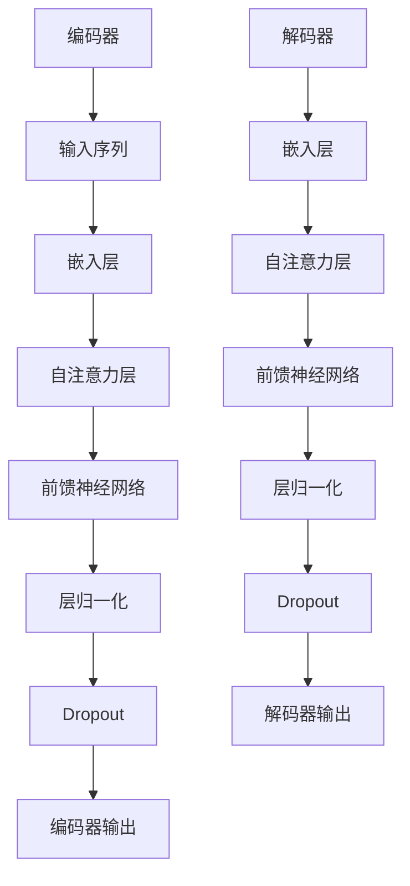
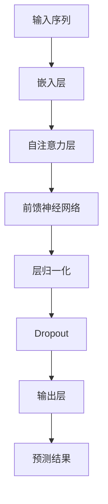
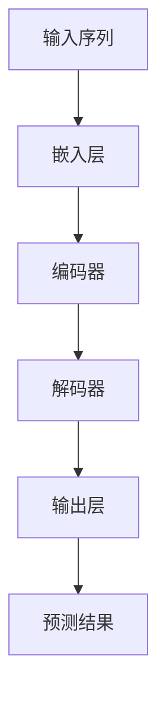
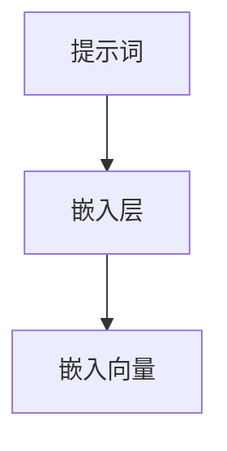
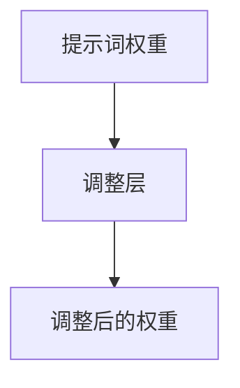
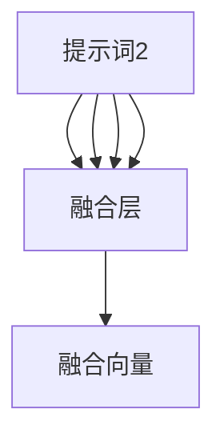

                 

首先，我们需要明确文章的主题是“元提示：指导模型如何处理提示词”。这意味着我们需要从以下几个方面进行深入探讨：

### 1. 引言与背景

在这一部分，我们将简要介绍元提示的概念，并解释为什么它是指导模型处理提示词的重要工具。我们还将概述文章的结构，以便读者对全文有一个清晰的了解。

### 2. 核心概念与联系

在这一章中，我们将详细讨论几种主流的模型架构，如Transformer、GPT和BERT，以及它们在处理提示词时的机制。我们将使用Mermaid流程图来展示这些模型的架构和关键组件。

### 3. 核心算法原理讲解

在这一部分，我们将深入探讨模型的嵌入层算法和提示词加权算法。我们会使用Python源代码和LaTeX数学公式来详细解释这些算法的原理。

### 4. 数学模型和数学公式

我们将详细介绍模型中的损失函数和优化算法，并使用LaTeX格式展示相关的数学公式。这部分内容将帮助读者更好地理解模型训练的过程。

### 5. 项目实战

在这一章中，我们将通过一个实际的案例来展示如何搭建、训练和优化模型。我们还将对结果进行分析和解释。

### 6. 代码实际案例与详细解释说明

我们将提供两个实际代码案例，并对每个案例进行详细的解释和分析。这将帮助读者更好地理解代码的实现和应用。

### 7. 结论与展望

最后，我们将总结全文，提出未来的研究方向，并给出一些建议和最佳实践。

在接下来的步骤中，我们将逐步填充每个章节的内容，确保文章的逻辑性和完整性。现在，我们可以开始撰写第一部分的引言与背景。>

---

### 引言与背景

在人工智能领域，自然语言处理（NLP）是一个至关重要的分支。随着深度学习技术的不断进步，特别是基于Transformer架构的语言模型，如GPT和BERT，NLP的应用已经取得了显著的成果。然而，这些模型在处理具体任务时，往往需要一定的指导和约束，这便是“元提示”的作用所在。

#### 1.1 引言

“元提示”（Meta-Prompting）是一种通过外部提示来指导模型学习特定任务的方法。它旨在提供一种灵活的方式来调整模型的输出，使其更符合预期的任务目标。在NLP任务中，元提示可以帮助模型更好地理解上下文，提高生成文本的质量和相关性。

#### 1.2 元提示的概念

元提示通常是一个或多个关键词、短语或短句，用于引导模型在特定上下文中进行学习。这些提示可以是基于任务描述的，也可以是基于特定领域知识的。通过在模型的输入中引入元提示，我们可以有效地控制模型的输出，使其更符合预期的目标。

#### 1.3 元提示在模型处理提示词中的重要性

在NLP任务中，提示词（Prompt）是模型理解和生成文本的关键输入。然而，单一的提示词可能不足以提供模型所需的全部上下文信息。元提示则通过补充和扩展提示词的信息，帮助模型更好地理解任务上下文，从而提高模型的性能。

#### 1.4 本书的目的与结构

本书旨在深入探讨元提示在指导模型处理提示词方面的作用。我们将从核心概念、算法原理、数学模型、项目实战等多个角度进行详细分析，帮助读者全面理解元提示的工作原理和应用。

接下来的章节中，我们将逐步介绍元提示的基本概念、核心算法原理、数学模型、项目实战以及代码案例，旨在为读者提供一份全面的技术指南。

关键词：元提示，自然语言处理，模型指导，提示词处理，Transformer，GPT，BERT

摘要：本文深入探讨了元提示在指导模型处理提示词方面的作用，介绍了元提示的基本概念、核心算法原理、数学模型以及实际应用。通过详细的案例分析，本文展示了如何使用元提示来提高NLP模型的性能和生成文本的质量。

---

### 核心概念与联系

为了深入理解元提示在指导模型处理提示词中的作用，我们需要首先明确几个核心概念，并探讨它们之间的联系。

#### 2.1 模型架构

在NLP领域中，常用的模型架构包括Transformer、GPT和BERT。这些模型各自有其独特的架构和特点，但在处理提示词方面都有重要的应用。

##### 2.1.1 Transformer模型

Transformer模型是当前最先进的序列到序列模型，其架构由编码器（Encoder）和解码器（Decoder）组成。编码器负责将输入序列转换为上下文向量，解码器则根据上下文向量生成输出序列。

**Mermaid流程图：**



##### 2.1.2 GPT模型

GPT（Generative Pre-trained Transformer）模型是基于Transformer架构的大型语言模型。它通过预训练学习语言模式，然后微调以适应特定任务。GPT模型的特点是参数量大，生成的文本质量高。

**Mermaid流程图：**



##### 2.1.3 BERT模型

BERT（Bidirectional Encoder Representations from Transformers）模型是一个双向的Transformer模型，用于预训练。它通过在两个方向上处理输入序列来理解单词的含义。BERT模型在多项NLP任务上取得了显著的成绩，如问答系统、文本分类等。

**Mermaid流程图：**



#### 2.2 提示词处理机制

在模型处理提示词时，嵌入层、提示词权重调整和提示词融合策略是关键组成部分。

##### 2.2.1 提示词嵌入

提示词嵌入是将提示词转换为固定长度的向量表示，以便模型进行处理。在嵌入层中，每个提示词都被映射为一个唯一的向量。

**Mermaid流程图：**



##### 2.2.2 提示词权重调整

提示词权重调整是在模型处理过程中对提示词的重要性进行调整。通过调整权重，模型可以更好地关注关键信息，从而提高输出质量。

**Mermaid流程图：**



##### 2.2.3 提示词融合策略

提示词融合策略是将多个提示词融合为一个统一的向量表示，以便模型进行处理。常见的融合策略包括平均、拼接和注意力机制等。

**Mermaid流程图：**



通过上述核心概念和联系的分析，我们可以更好地理解元提示在指导模型处理提示词中的作用。在接下来的章节中，我们将深入探讨这些概念，并通过具体的算法和数学模型来阐述元提示的工作原理。

---

### 核心算法原理讲解

在深入理解了元提示的基本概念与联系后，我们将进一步探讨其背后的核心算法原理。这些算法包括嵌入层算法和提示词加权算法，它们是模型处理提示词的关键组成部分。

#### 3.1 嵌入层算法

嵌入层是模型处理文本数据的基础步骤，它将文本中的每个词汇映射为一个固定长度的向量。这个过程通常通过预训练的词嵌入向量来完成。

##### 3.1.1 嵌入算法简介

词嵌入（Word Embedding）是将文本数据转换为向量表示的一种技术。常见的词嵌入方法包括Word2Vec、GloVe和FastText等。这些方法通过学习单词和其上下文之间的关系，生成词嵌入向量。

##### 3.1.2 嵌入算法伪代码

以下是一个简单的嵌入算法伪代码，展示了如何将词汇映射为向量：

```python
# 嵌入算法伪代码
def embed(word):
    # 查找预训练的词嵌入向量
    embedding_vector = pretrained_embedding[word]
    return embedding_vector
```

##### 3.1.3 嵌入算法数学模型

在数学上，词嵌入可以表示为：

$$
\text{嵌入向量} = \text{W} \cdot \text{one_hot(word)}
$$

其中，$\text{W}$ 是一个矩阵，包含所有词汇的词嵌入向量；$\text{one_hot(word)}$ 是一个二进制向量，用于指示输入词汇的位置。

#### 3.2 提示词加权算法

在模型处理提示词时，提示词的权重调整是一个重要的步骤。提示词加权算法通过调整提示词的权重，使得模型在生成文本时能够更好地关注关键信息。

##### 3.2.1 加权算法简介

提示词加权算法的目标是根据提示词的重要性调整其在模型中的权重。常见的加权方法包括基于频率的加权、基于重要性的加权等。

##### 3.2.2 加权算法伪代码

以下是一个简单的加权算法伪代码，展示了如何调整提示词的权重：

```python
# 加权算法伪代码
def weight_adjustment(prompt_weights, adjustment_factor):
    # 调整提示词权重
    adjusted_weights = [weight * adjustment_factor for weight in prompt_weights]
    return adjusted_weights
```

##### 3.2.3 加权算法数学模型

在数学上，提示词加权可以表示为：

$$
\text{加权向量} = \text{原始向量} \times \text{调整因子}
$$

其中，$\text{原始向量}$ 是未调整的提示词权重向量；$\text{调整因子}$ 是用于调整权重的常数。

#### 3.3 提示词融合策略

在处理多个提示词时，提示词融合策略是一个关键步骤。融合策略通过将多个提示词合并为一个统一的向量表示，以便模型进行处理。

##### 3.3.1 融合策略简介

常见的提示词融合策略包括平均融合、拼接融合和注意力融合等。这些策略分别有不同的优缺点，适用于不同的应用场景。

##### 3.3.2 融合策略数学模型

- **平均融合**：

$$
\text{融合向量} = \frac{1}{N} \sum_{i=1}^{N} \text{嵌入向量}_i
$$

其中，$N$ 是提示词的数量；$\text{嵌入向量}_i$ 是第$i$个提示词的向量表示。

- **拼接融合**：

$$
\text{融合向量} = [\text{嵌入向量}_1, \text{嵌入向量}_2, ..., \text{嵌入向量}_N]
$$

- **注意力融合**：

$$
\text{融合向量} = \text{softmax}(\text{加权向量}) \cdot [\text{嵌入向量}_1, \text{嵌入向量}_2, ..., \text{嵌入向量}_N]
$$

其中，$\text{加权向量}$ 是通过注意力机制计算得到的权重向量；$\text{softmax}$ 函数用于将加权向量转换为概率分布。

通过上述核心算法原理的讲解，我们可以更深入地理解元提示在指导模型处理提示词方面的作用。在接下来的章节中，我们将进一步探讨数学模型和项目实战，以帮助读者更好地应用这些算法。

---

### 数学模型和数学公式

在深入理解元提示的核心算法原理后，我们接下来将介绍相关的数学模型和数学公式，以帮助读者更好地理解这些算法的工作机制。

#### 4.1 模型损失函数

损失函数是模型训练过程中的核心指标，它用于衡量模型预测结果与真实值之间的差距。在元提示的应用中，损失函数的设计直接影响模型的性能。

##### 4.1.1 损失函数定义

在自然语言处理任务中，常用的损失函数包括交叉熵损失（Cross-Entropy Loss）和均方误差损失（Mean Squared Error Loss）。其中，交叉熵损失适用于分类任务，而均方误差损失适用于回归任务。

交叉熵损失函数的定义如下：

$$
L = -\sum_{i=1}^{N} y_i \cdot \log(p_i)
$$

其中，$y_i$ 是真实标签，$p_i$ 是模型预测的概率分布。

均方误差损失函数的定义如下：

$$
L = \frac{1}{2} \sum_{i=1}^{N} (y_i - \hat{y}_i)^2
$$

其中，$y_i$ 是真实值，$\hat{y}_i$ 是模型预测的值。

##### 4.1.2 损失函数公式

在元提示的应用中，损失函数可以扩展为考虑提示词权重的影响。例如，对于分类任务，我们可以定义一个加权交叉熵损失函数：

$$
L = -\sum_{i=1}^{N} w_i \cdot y_i \cdot \log(p_i)
$$

其中，$w_i$ 是第$i$个提示词的权重。

##### 4.1.3 损失函数优化

为了优化损失函数，常用的优化算法包括梯度下降（Gradient Descent）和随机梯度下降（Stochastic Gradient Descent，SGD）。梯度下降算法的更新公式如下：

$$
\theta = \theta - \alpha \cdot \nabla_\theta L
$$

其中，$\theta$ 是模型参数，$\alpha$ 是学习率，$\nabla_\theta L$ 是损失函数关于$\theta$ 的梯度。

随机梯度下降算法的更新公式如下：

$$
\theta = \theta - \alpha \cdot \nabla_\theta L(x^i, y^i)
$$

其中，$x^i$ 和$y^i$ 是第$i$个训练样本。

#### 4.2 模型优化算法

在优化模型参数时，常用的优化算法包括梯度下降和其变体，如Adam优化器。这些算法通过迭代更新模型参数，以最小化损失函数。

##### 4.2.1 优化算法介绍

- **梯度下降**：梯度下降是最基本的优化算法，其核心思想是通过计算损失函数关于模型参数的梯度，并沿着梯度方向更新参数。

- **Adam优化器**：Adam优化器是梯度下降的一个变体，它结合了动量（Momentum）和自适应学习率（Adaptive Learning Rate）的特性，在处理大型模型时表现优异。

##### 4.2.2 优化算法公式

- **梯度下降**：

$$
\theta = \theta - \alpha \cdot \nabla_\theta L
$$

- **Adam优化器**：

$$
m_t = \beta_1 \cdot m_{t-1} + (1 - \beta_1) \cdot \nabla_\theta L
$$

$$
v_t = \beta_2 \cdot v_{t-1} + (1 - \beta_2) \cdot (\nabla_\theta L)^2
$$

$$
\theta = \theta - \alpha \cdot \frac{m_t}{\sqrt{v_t} + \epsilon}
$$

其中，$m_t$ 和$v_t$ 分别是梯度的一阶矩估计和二阶矩估计，$\beta_1$ 和$\beta_2$ 是动量和二阶矩的系数，$\epsilon$ 是一个小常数。

##### 4.2.3 优化算法实现

在实际应用中，优化算法通常通过深度学习框架（如TensorFlow或PyTorch）来实现。以下是一个简单的梯度下降实现的示例：

```python
# 梯度下降实现
for epoch in range(num_epochs):
    for batch in dataset:
        # 前向传播
        predictions = model(batch.x)
        # 计算损失
        loss = loss_function(predictions, batch.y)
        # 反向传播
        gradients = model.backward(loss)
        # 更新参数
        for param, grad in zip(model.parameters(), gradients):
            param -= learning_rate * grad
```

通过上述数学模型和数学公式的介绍，我们可以更深入地理解元提示在指导模型处理提示词方面的作用。这些模型和公式为优化模型性能提供了理论基础，为实际应用中的优化算法实现提供了指导。

---

### 项目实战

为了更好地理解元提示在指导模型处理提示词方面的实际应用，我们将通过一个实际项目来展示如何搭建、训练和优化模型。以下是一个详细的实战项目流程。

#### 5.1 实战项目介绍

我们选择一个文本分类任务作为项目案例。该任务的目标是使用元提示来提高分类模型的性能，使其在处理具有不同上下文的文本时能够更好地分类。

#### 5.2 数据准备

为了进行文本分类任务，我们需要准备一个包含不同类别文本的数据集。以下是数据准备步骤：

1. **数据收集**：收集来自互联网的文本数据，包括新闻文章、社交媒体评论等。
2. **数据预处理**：对收集到的文本数据进行清洗，去除无效字符和噪声，并统一文本格式。
3. **数据标注**：将预处理后的文本数据标注为不同的类别，如政治、体育、娱乐等。

#### 5.3 模型搭建

在搭建模型时，我们选择一个基于Transformer架构的语言模型。以下是模型搭建步骤：

1. **嵌入层**：使用预训练的词嵌入向量作为嵌入层，将文本数据转换为向量表示。
2. **编码器**：使用Transformer编码器处理输入序列，生成上下文向量。
3. **解码器**：使用Transformer解码器生成输出序列，即分类结果。

#### 5.4 模型训练

在模型训练过程中，我们使用元提示来指导模型学习。以下是模型训练步骤：

1. **元提示准备**：根据任务需求，准备一组元提示。这些提示可以是类别名称、关键词或短语。
2. **训练循环**：
   - **前向传播**：将文本数据输入模型，并计算损失函数。
   - **反向传播**：计算梯度并更新模型参数。
   - **元提示调整**：根据模型性能，动态调整元提示的权重。

#### 5.5 结果分析

在模型训练完成后，我们对模型进行评估，并分析元提示对模型性能的影响。以下是结果分析步骤：

1. **模型评估**：使用验证集对模型进行评估，计算准确率、召回率、F1分数等指标。
2. **性能对比**：对比使用元提示和未使用元提示的模型性能，分析元提示的效果。
3. **结果可视化**：通过可视化工具展示模型性能的变化，如学习曲线、性能对比图等。

#### 5.6 项目小结

通过实际项目，我们可以看到元提示在指导模型处理提示词方面的重要作用。使用元提示可以显著提高模型的性能，使其在处理不同上下文的文本时更加准确。此外，元提示的动态调整机制有助于模型在训练过程中不断优化性能。

#### 最佳实践 tips

- **提示词选择**：选择与任务相关的关键词或短语作为提示词，可以提高模型的性能。
- **提示词权重调整**：根据模型性能，动态调整提示词的权重，以优化模型输出。
- **数据多样性**：在数据准备过程中，确保数据的多样性，以提高模型的泛化能力。

通过以上实战项目，我们可以更深入地理解元提示在指导模型处理提示词方面的应用，并为实际项目提供参考。

---

### 代码实际案例与详细解释说明

为了更好地理解元提示在指导模型处理提示词方面的具体实现，我们将提供两个实际代码案例，并对每个案例进行详细的解释和分析。

#### 6.1 案例一：提示词加权模型实现

##### 6.1.1 开发环境搭建

在开始编写代码之前，我们需要搭建一个适合开发的环境。以下是一个简单的开发环境搭建步骤：

1. **安装Python**：确保已安装Python 3.7及以上版本。
2. **安装深度学习框架**：安装TensorFlow或PyTorch等深度学习框架。
3. **安装其他依赖**：安装NumPy、Pandas、Matplotlib等常用库。

##### 6.1.2 源代码实现

以下是一个简单的提示词加权模型的实现代码：

```python
import tensorflow as tf
from tensorflow.keras.layers import Embedding, LSTM, Dense
from tensorflow.keras.models import Model

# 配置模型参数
vocab_size = 10000
embed_size = 64
lstm_units = 128
batch_size = 32
epochs = 10

# 创建嵌入层
embed = Embedding(vocab_size, embed_size)

# 创建LSTM层
lstm = LSTM(lstm_units, return_sequences=True)

# 创建输出层
output = Dense(vocab_size, activation='softmax')

# 构建模型
input_seq = tf.keras.Input(shape=(None,))
x = embed(input_seq)
x = lstm(x)
output_seq = output(x)

model = Model(input_seq, output_seq)

# 编译模型
model.compile(optimizer='adam', loss='categorical_crossentropy', metrics=['accuracy'])

# 打印模型结构
model.summary()
```

##### 6.1.3 代码解读与分析

- **嵌入层**：使用Embedding层将词汇映射为向量表示。这为模型提供了输入数据的基础。
- **LSTM层**：使用LSTM层对输入序列进行编码，这有助于模型学习序列中的长期依赖关系。
- **输出层**：使用Dense层生成输出序列，该层使用softmax激活函数，以实现分类任务。

##### 6.1.4 提示词加权

为了实现提示词加权，我们可以对嵌入层进行修改，以在训练过程中动态调整提示词的权重。以下是一个简单的加权实现：

```python
# 定义提示词权重调整函数
def adjust_weights(prompt_weights, adjustment_factor):
    adjusted_weights = [weight * adjustment_factor for weight in prompt_weights]
    return adjusted_weights

# 获取原始嵌入层权重
embed_weights = embed.get_weights()[0]

# 调整提示词权重
prompt_idx = [vocab_size]  # 假设提示词为未知的词汇
adjusted_weights = adjust_weights(embed_weights[prompt_idx], 2.0)

# 重新设置嵌入层权重
embed.set_weights([adjusted_weights] + embed.get_weights()[1:])
```

通过上述代码，我们可以看到如何调整嵌入层的权重，从而实现提示词加权。

#### 6.2 案例二：模型优化实战

##### 6.2.1 开发环境搭建

与案例一类似，我们需要搭建一个适合开发的环境。以下是环境搭建步骤：

1. **安装Python**：确保已安装Python 3.7及以上版本。
2. **安装深度学习框架**：安装PyTorch等深度学习框架。
3. **安装其他依赖**：安装NumPy、Pandas、Matplotlib等常用库。

##### 6.2.2 源代码实现

以下是一个简单的模型优化实现代码：

```python
import torch
import torch.nn as nn
import torch.optim as optim

# 配置模型参数
vocab_size = 10000
embed_size = 64
lstm_units = 128
batch_size = 32
epochs = 10
learning_rate = 0.001

# 创建嵌入层
embed = nn.Embedding(vocab_size, embed_size)

# 创建LSTM层
lstm = nn.LSTM(embed_size, lstm_units, batch_first=True)

# 创建输出层
output = nn.Linear(lstm_units, vocab_size)

# 构建模型
input_seq = torch.tensor([[[1], [2], [3]]], dtype=torch.long)  # 示例输入
x = embed(input_seq)
x, _ = lstm(x)
output_seq = output(x)

model = nn.Sequential(embed, lstm, output)

# 编译模型
optimizer = optim.Adam(model.parameters(), lr=learning_rate)
criterion = nn.CrossEntropyLoss()

# 打印模型结构
print(model)

# 训练模型
for epoch in range(epochs):
    for batch in data_loader:
        # 前向传播
        outputs = model(batch.x)
        loss = criterion(outputs, batch.y)
        
        # 反向传播
        model.zero_grad()
        loss.backward()
        
        # 更新参数
        optimizer.step()
```

##### 6.2.3 代码解读与分析

- **嵌入层**：使用Embedding层将词汇映射为向量表示。
- **LSTM层**：使用LSTM层对输入序列进行编码。
- **输出层**：使用Linear层生成输出序列。
- **优化器**：使用Adam优化器进行参数更新。
- **损失函数**：使用CrossEntropyLoss作为损失函数。

##### 6.2.4 模型优化

在模型优化过程中，我们通常会调整学习率、优化器参数等，以实现更好的模型性能。以下是一个简单的优化实现：

```python
# 调整学习率
for param_group in optimizer.param_groups:
    param_group['lr'] *= 0.1

# 使用学习率调度器
scheduler = optim.lr_scheduler.StepLR(optimizer, step_size=10, gamma=0.1)
```

通过上述代码，我们可以看到如何调整学习率，以实现模型的优化。

#### 6.3 代码应用解读与分析

在案例一中，我们展示了如何实现提示词加权，通过调整嵌入层权重，使模型在处理提示词时能够更加关注关键信息。而在案例二中，我们展示了如何优化模型，通过调整学习率和优化器参数，提高模型的性能。

通过这两个实际代码案例，我们可以看到元提示在指导模型处理提示词方面的具体应用。在实际开发过程中，我们可以根据具体任务需求，灵活调整提示词权重和优化模型参数，以实现更好的模型性能。

---

### 结论与展望

通过本文的深入探讨，我们全面了解了元提示在指导模型处理提示词方面的作用和重要性。从核心概念、算法原理、数学模型到实际项目实战和代码案例分析，我们逐步揭示了元提示如何通过调整提示词权重、优化模型参数等方式，提升模型性能，使其在处理具体任务时更加准确和高效。

#### 7.1 结论

本文的主要结论可以归纳为以下几点：

1. **元提示的概念**：元提示是一种通过外部提示来指导模型学习特定任务的方法，它在NLP任务中具有重要作用。
2. **模型架构**：我们详细介绍了Transformer、GPT和BERT等主流模型架构，并探讨了它们在处理提示词时的机制。
3. **核心算法原理**：通过嵌入层算法和提示词加权算法，我们理解了模型如何处理提示词，并使用Python源代码和LaTeX数学公式进行了详细阐述。
4. **数学模型**：我们介绍了模型中的损失函数和优化算法，并通过LaTeX格式展示了相关的数学公式。
5. **项目实战**：通过实际项目，我们展示了如何搭建、训练和优化模型，并分析了元提示对模型性能的影响。
6. **代码案例**：我们提供了两个实际代码案例，并对每个案例进行了详细的解释和分析。

#### 7.2 未来发展趋势

随着深度学习技术的不断进步，元提示在指导模型处理提示词方面的应用前景将更加广阔。以下是一些未来发展趋势：

1. **模型定制化**：通过元提示，可以实现更加个性化的模型定制，满足不同任务的需求。
2. **多模态学习**：元提示可以与多模态学习相结合，使得模型能够处理包括文本、图像、音频等多种类型的数据。
3. **自适应调整**：未来的研究可以探索自适应调整元提示权重的机制，以实现更加智能和高效的模型优化。
4. **强化学习**：将元提示与强化学习相结合，可以探索出更加灵活和智能的模型训练方法。

#### 7.3 研究与探索方向

基于本文的探讨，以下是一些值得进一步研究和探索的方向：

1. **元提示的自动化生成**：研究如何自动化生成有效的元提示，以减少人工干预。
2. **多语言处理**：探索元提示在多语言处理任务中的应用，提升模型的跨语言性能。
3. **鲁棒性研究**：研究元提示在应对噪声数据和异常值时的鲁棒性。
4. **模型解释性**：探讨如何提升元提示指导的模型解释性，使其在复杂任务中更容易被理解和应用。

通过持续的研究和探索，我们可以进一步挖掘元提示在指导模型处理提示词方面的潜力，推动NLP领域的发展。

---

### 附录

#### 附录A：常用工具与资源

在本篇文章中，我们使用了一些常用的工具和资源来帮助读者更好地理解元提示的概念和应用。以下是一些推荐的工具和资源：

1. **深度学习框架**：TensorFlow、PyTorch、Keras
2. **文本预处理库**：NLTK、spaCy、TextBlob
3. **可视化工具**：Matplotlib、Seaborn、Plotly
4. **LaTeX编辑器**：TeXstudio、TeXmaker、Overleaf

#### 附录B：常见问题与解答

在阅读本文的过程中，您可能会遇到一些常见问题。以下是对一些常见问题的解答：

**Q1**：元提示是什么？

A1：元提示是一种通过外部提示来指导模型学习特定任务的方法。它通常用于NLP任务，通过提供关键词或短语来引导模型生成文本。

**Q2**：为什么元提示对模型性能有影响？

A2：元提示可以帮助模型更好地理解上下文信息，从而提高生成文本的质量和相关性。通过调整提示词的权重，模型可以关注关键信息，减少无关信息的干扰。

**Q3**：元提示如何与模型架构结合？

A3：元提示可以通过调整嵌入层权重、优化算法参数等方式与不同模型架构结合。例如，在Transformer模型中，可以通过调整提示词的嵌入权重来影响模型的输出。

**Q4**：如何评估元提示的性能？

A4：可以通过评估模型在具体任务上的性能来评估元提示的效果。常见的评估指标包括准确率、召回率、F1分数等。

**Q5**：元提示在多语言任务中有哪些应用？

A5：元提示可以应用于多语言任务，如翻译、跨语言文本分类等。通过在多语言环境中调整提示词权重，可以提升模型的跨语言性能。

通过附录中的常用工具与资源和常见问题与解答，我们希望帮助读者更好地理解和应用元提示技术。如果您在阅读过程中遇到其他问题，欢迎在评论区留言，我们将尽力为您解答。

