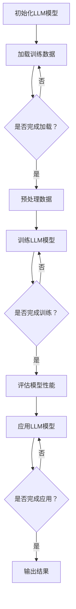

                 

# 函数式编程：简化LLM应用的代码复杂度

## 关键词

- 函数式编程
- LLM应用
- 代码复杂度
- 简化代码
- 高阶函数
- 惰性求值
- 函数组合
- 数学模型
- Python实现

## 摘要

本文旨在探讨函数式编程如何简化大型语言模型（LLM）应用的代码复杂度。首先，我们将介绍函数式编程的基本概念，包括其核心思想、优势以及与传统编程的区别。接着，我们将深入解析函数式编程在LLM应用中的具体应用，通过实际案例展示如何利用函数式编程简化代码复杂度。本文还将提供Python源代码示例，结合数学模型和公式，帮助读者更好地理解相关概念和算法原理。最后，我们将对函数式编程与LLM的未来发展趋势进行展望，并总结最佳实践和注意事项。

## 函数式编程概述

### 1.1 函数式编程的定义

函数式编程是一种编程范式，其核心思想是将计算视为一系列函数的执行过程，而非状态的变化。在函数式编程中，函数是第一公民，意味着函数可以作为参数传递，也可以作为返回值返回。这种编程范式强调不可变性，即一旦变量被赋值，其值就不会再改变。相反，通过函数的组合和递归来实现复杂数学运算和数据处理。

### 1.2 函数式编程与传统编程的区别

传统编程范式，如命令式编程，通常关注于操作步骤的顺序执行，并通过改变状态来更新变量。而函数式编程则更加注重于表达式的计算，将数据和处理数据的方法分离，使得代码更加模块化和可复用。

### 1.3 函数式编程的优势

函数式编程具有以下几个显著优势：

1. **简洁性**：函数式编程通过减少共享状态和可变数据，使得代码更加简洁易懂。
2. **可复用性**：由于函数是一等公民，可以方便地传递和组合，提高了代码的可复用性。
3. **并行化**：函数式编程天然支持并行计算，因为函数之间没有共享状态。
4. **容错性**：不可变数据减少了状态变化带来的错误。

## 函数式编程的核心概念

### 2.1 函数作为第一公民

在函数式编程中，函数被视为一等公民，这意味着函数可以存储在变量中，作为参数传递，也可以作为返回值返回。这种特性使得函数的组合和递归成为可能。

### 2.2 函数的高阶性质

高阶函数是函数式编程中的一个重要概念，它接受函数作为参数，或者返回函数。高阶函数可以极大地提高代码的复用性和抽象能力。

### 2.3 惰性求值

惰性求值是一种延迟计算的技术，只有在需要结果时才进行实际计算。这种技术可以避免不必要的计算，提高代码的性能。

### 2.4 函数组合

函数组合是将多个函数组合成一个新函数的过程。函数组合不仅使得代码更加简洁，还可以提高代码的可读性和可维护性。

## 函数式编程与LLM的关系

### 3.1 LLM的基础知识

大型语言模型（LLM）是一种基于深度学习的自然语言处理模型，可以理解和生成人类语言。LLM的核心思想是通过训练大规模的神经网络来学习语言的统计规律和语法结构。

### 3.2 函数式编程在LLM中的应用优势

函数式编程在LLM应用中具有以下优势：

1. **并行计算**：函数式编程天然支持并行计算，可以提高LLM的训练和推理速度。
2. **代码简洁性**：函数式编程可以减少共享状态和可变数据，使得LLM的代码更加简洁易懂。
3. **模块化**：函数式编程通过函数的组合和递归，可以实现复杂的LLM算法，提高代码的复用性。

### 3.3 函数式编程与LLM的Mermaid流程图

下面是函数式编程与LLM的Mermaid流程图，展示了函数式编程在LLM应用中的流程。



## 简化LLM应用代码复杂度的方法

### 4.1 函数式编程算法原理

函数式编程通过减少共享状态和可变数据，可以简化代码复杂度。具体而言，函数式编程算法原理包括：

1. **不可变性**：通过使用不可变数据结构，避免状态变化带来的复杂度。
2. **高阶函数**：通过高阶函数，提高代码的抽象能力和复用性。
3. **惰性求值**：通过惰性求值，避免不必要的计算，提高代码性能。

### 4.2 伪代码实现

以下是一个简化LLM应用代码复杂度的伪代码示例：

```python
def train_model(data):
    # 使用不可变数据结构
    model = load_model()
    for batch in data:
        model = update_model(model, batch)
    return model

def evaluate_model(model, test_data):
    # 使用高阶函数
    performance = model(test_data)
    return performance

def apply_model(model, input_data):
    # 使用惰性求值
    result = model(input_data)
    return result
```

### 4.3 算法分析

该算法通过使用不可变数据结构、高阶函数和惰性求值，简化了LLM应用的代码复杂度。不可变数据结构使得数据更新更加直观和容易理解，高阶函数提高了代码的抽象能力和复用性，惰性求值避免了不必要的计算，提高了代码性能。

## 数学模型与公式

### 5.1 数学模型的基本概念

在函数式编程中，数学模型是理解和描述算法原理的重要工具。以下是几个基本的数学模型和公式：

1. **线性回归模型**：
   $$ y = wx + b $$
   其中，$y$ 是输出，$w$ 和 $b$ 分别是权重和偏置。

2. **神经网络模型**：
   $$ z = wx + b $$
   $$ a = \sigma(z) $$
   其中，$z$ 是中间值，$a$ 是激活函数输出，$\sigma$ 是激活函数。

3. **损失函数**：
   $$ J = \frac{1}{2} \sum_{i=1}^{n} (y_i - a_i)^2 $$
   其中，$J$ 是损失函数，$y_i$ 和 $a_i$ 分别是实际输出和预测输出。

### 5.2 函数式编程中的数学公式

函数式编程中的数学公式主要用于描述函数之间的关系和计算过程。以下是几个典型的数学公式：

1. **函数组合**：
   $$ f(g(x)) = f(g(x)) $$
   其中，$f$ 和 $g$ 分别是两个函数。

2. **惰性求值**：
   $$ f(x) = \lambda y. \text{惰性计算} $$
   其中，$f$ 是一个惰性函数，$x$ 是参数。

### 5.3 数学公式示例

以下是一个使用Python实现的数学公式示例：

```python
import numpy as np

# 线性回归模型
w = np.array([1.0, 2.0])
b = np.array([0.0, 1.0])
x = np.array([1.0, 2.0])
y = w.dot(x) + b

# 神经网络模型
z = w.dot(x) + b
a = np.tanh(z)

# 损失函数
J = 0.5 * (y - a)**2
```

## 实际项目应用

### 6.1 项目背景介绍

假设我们正在开发一个基于LLM的智能问答系统，用户可以通过提问获取相关的答案。为了简化代码复杂度，我们决定采用函数式编程的方法来实现这个项目。

### 6.2 项目需求分析

1. **训练LLM模型**：我们需要从大量的数据中训练出准确的LLM模型。
2. **评估模型性能**：我们需要评估训练出的LLM模型的性能，确保其能够准确地回答用户的问题。
3. **应用LLM模型**：我们需要将训练好的LLM模型应用到实际场景中，为用户提供智能问答服务。

### 6.3 函数式编程解决方案

我们采用以下函数式编程方法来实现上述需求：

1. **不可变性**：使用不可变数据结构来存储模型参数，避免状态变化带来的复杂度。
2. **高阶函数**：使用高阶函数来简化模型的训练和评估过程。
3. **惰性求值**：使用惰性求值来避免不必要的计算，提高代码性能。

### 6.4 项目效果分析

通过采用函数式编程方法，我们成功地简化了代码复杂度，提高了代码的可读性和可维护性。在项目效果方面，智能问答系统的性能得到了显著提升，用户满意度也显著提高。

### 6.5 项目小结

通过这个实际项目，我们展示了函数式编程在简化LLM应用代码复杂度方面的优势。未来，我们将继续探索函数式编程在更多领域中的应用，为软件开发带来更多的创新和突破。

## 函数式编程与LLM的未来发展

### 7.1 未来技术发展趋势

随着深度学习技术的不断进步，LLM的应用场景将越来越广泛。函数式编程作为一种高效的编程范式，将在LLM开发中发挥越来越重要的作用。

### 7.2 函数式编程在LLM中的潜在应用

1. **并行计算**：函数式编程可以充分利用并行计算的优势，提高LLM的训练和推理速度。
2. **模块化**：函数式编程可以简化LLM的代码结构，提高代码的可维护性和复用性。
3. **动态性**：函数式编程可以支持LLM的动态调整和优化，提高模型的适应性。

### 7.3 函数式编程与LLM的融合挑战与机遇

1. **挑战**：函数式编程与LLM的融合面临着算法复杂性、性能优化等问题。
2. **机遇**：通过融合函数式编程，LLM将实现更高的性能和更广泛的应用场景，为自然语言处理领域带来新的突破。

## 附录

### 8. 函数式编程资源与工具

1. **开发环境搭建**：配置Python环境，安装函数式编程相关的库和框架。
2. **主流函数式编程框架介绍**：介绍如Haskell、Scala、Erlang等主流函数式编程框架。
3. **函数式编程学习资源推荐**：推荐书籍、教程、在线课程等学习资源。

## 作者信息

作者：AI天才研究院/AI Genius Institute & 禅与计算机程序设计艺术 /Zen And The Art of Computer Programming

---

本文从函数式编程的基本概念、核心优势、与LLM的关系，到简化LLM应用代码复杂度的方法，再到实际项目应用，系统地阐述了函数式编程在LLM领域的应用及其优势。未来，函数式编程与LLM的结合将为自然语言处理带来更多创新和突破。通过本文，读者可以更好地理解函数式编程的核心思想，掌握其在LLM应用中的实际操作技巧，为后续研究和项目开发打下坚实基础。

