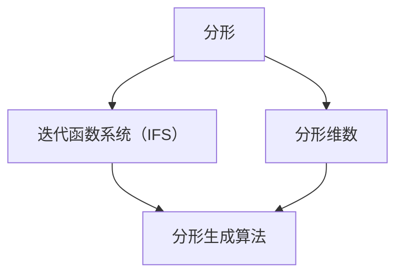

                 

## 分形艺术：自然之美的数学表达

### 关键词
- 分形艺术
- 数学表达
- 自然美学
- 迭代函数系统（IFS）
- 曼德布罗特集（Mandelbrot Set）
- 爱德华集合（Julia Set）

### 摘要
本文旨在探讨分形艺术在自然美学中的数学表达，通过对分形理论、迭代函数系统（IFS）、分形生成算法等核心概念的介绍，结合实际项目实践，展示分形在图像处理和艺术创作中的应用。文章将逐步分析分形的定义、历史背景，深入讲解分形理论的基础知识，并运用Python源代码和数学模型，详细阐述分形生成算法和实际应用。最后，通过实际项目实践，展示分形艺术的开发过程和优化技巧。

## 设计书籍目录大纲的步骤

设计一本书籍目录大纲，尤其是技术类书籍，是确保内容结构合理、逻辑严密、易于读者理解的关键步骤。以下是设计书籍目录大纲的具体步骤：

### 1. 理解书籍主题

首先，要深入理解书籍的主题和目标读者。对于《分形艺术：自然之美的数学表达》，我们的目标读者是对数学和计算机科学感兴趣的读者，他们希望了解分形理论及其在艺术领域的应用。因此，在目录设计过程中，需要明确书籍的主题，例如分形的定义、分形理论的基础知识、分形生成算法等。

### 2. 确定核心内容

在理解书籍主题后，接下来需要确定核心内容，包括必须涵盖的概念、原理、算法和项目实践。对于《分形艺术：自然之数学表达》，核心内容应包括分形的定义、分形理论的基础、迭代函数系统（IFS）、分形几何、分形生成算法、分形在图像处理中的应用以及分形艺术项目实践等。

### 3. 设计章节结构

设计章节结构是目录大纲的核心步骤，它决定了书籍的整体框架和内容布局。以下是一个可能的章节结构设计：

#### 第一部分：分形艺术基础

##### 第1章：分形的定义与历史背景
###### 1.1 分形的定义
###### 1.2 分形的历史背景
###### 1.3 分形在自然界中的例子

##### 第2章：分形理论的基础
###### 2.1 度量化与分形维数
###### 2.2 迭代函数系统（IFS）
###### 2.3 分形几何

#### 第二部分：分形算法与应用

##### 第3章：分形生成算法
###### 3.1 迭代函数系统（IFS）算法
###### 3.2 曼德布罗特集（Mandelbrot Set）生成算法
###### 3.3 爱德华集合（Julia Set）生成算法

##### 第4章：分形在图像处理中的应用
###### 4.1 分形图像的压缩与编码
###### 4.2 分形图像的增强与修复
###### 4.3 分形图像的合成与创意

#### 第三部分：分形艺术项目实践

##### 第5章：分形艺术项目准备
###### 5.1 项目规划
###### 5.2 开发环境搭建
###### 5.3 工具与资源介绍

##### 第6章：分形艺术项目实现
###### 6.1 项目一：迭代函数系统（IFS）绘制
###### 6.2 项目二：曼德布罗特集（Mandelbrot Set）绘制
###### 6.3 项目三：爱德华集合（Julia Set）绘制

##### 第7章：分形艺术项目优化与扩展
###### 7.1 性能优化
###### 7.2 稳定性增强
###### 7.3 功能扩展

### 4. 设计流程图和伪代码

对于关键章节，设计相应的Mermaid流程图和伪代码，以便读者更好地理解算法和流程。例如，在讲解分形生成算法时，可以使用Mermaid流程图展示算法的执行流程。

### 5. 撰写目录大纲

将上述结构、内容、流程图和伪代码整合起来，撰写出完整的书籍目录大纲。

### 6. 检查与优化

最后，检查目录大纲的逻辑性、完整性和简洁性，确保没有遗漏关键内容，并对文本进行优化。

## 目录大纲示例

下面是根据上述步骤设计的《分形艺术：自然之数学表达》的目录大纲示例：

```
# 《分形艺术：自然之数学表达》目录大纲

## 第一部分：分形艺术基础

### 第1章：分形的定义与历史背景
#### 1.1 分形的定义
#### 1.2 分形的历史背景
#### 1.3 分形在自然界中的例子

### 第2章：分形理论的基础
#### 2.1 度量化与分形维数
#### 2.2 迭代函数系统（IFS）
#### 2.3 分形几何

## 第二部分：分形算法与应用

### 第3章：分形生成算法
#### 3.1 迭代函数系统（IFS）算法
#### 3.2 曼德布罗特集（Mandelbrot Set）生成算法
#### 3.3 爱德华集合（Julia Set）生成算法

### 第4章：分形在图像处理中的应用
#### 4.1 分形图像的压缩与编码
#### 4.2 分形图像的增强与修复
#### 4.3 分形图像的合成与创意

## 第三部分：分形艺术项目实践

### 第5章：分形艺术项目准备
#### 5.1 项目规划
#### 5.2 开发环境搭建
#### 5.3 工具与资源介绍

### 第6章：分形艺术项目实现
#### 6.1 项目一：迭代函数系统（IFS）绘制
#### 6.2 项目二：曼德布罗特集（Mandelbrot Set）绘制
#### 6.3 项目三：爱德华集合（Julia Set）绘制

### 第7章：分形艺术项目优化与扩展
#### 7.1 性能优化
#### 7.2 稳定性增强
#### 7.3 功能扩展
```

此目录大纲涵盖了书籍的核心内容，逻辑清晰，便于读者快速了解书籍结构，并能够通过各章节的内容掌握分形艺术的数学表达与应用。

## 背景介绍

分形艺术是数学与艺术相结合的产物，它通过数学模型和算法，创造出具有自相似性和无限复杂性的视觉作品。分形艺术的起源可以追溯到20世纪初，当时数学家们开始研究分形理论，并发现了自然界中广泛存在的分形结构，如海岸线、树叶、雪花等。随着时间的推移，分形艺术逐渐发展成为一种独特的艺术形式，吸引了众多艺术家和科学家的关注。

分形艺术的核心在于其数学表达，即迭代函数系统（IFS）和曼德布罗特集等概念。迭代函数系统是一种将复杂图形分解为简单图形再组合的算法，而曼德布罗特集则是一种通过迭代计算产生的分形结构。这些数学模型不仅能够创造出独特的视觉效果，还能够揭示自然界中隐藏的规律和美。

分形艺术的魅力在于其无限性和自相似性。无论放大或缩小，分形艺术作品都保持着相同的结构和特征。这种特性使得分形艺术作品在视觉上具有很强的吸引力和艺术价值。同时，分形艺术也反映了自然界的多样性和复杂性，让人们能够更好地理解自然界的奥秘。

总之，分形艺术作为一种独特的艺术形式，通过数学表达揭示了自然之美，为人们提供了一种全新的艺术视角。在接下来的内容中，我们将进一步探讨分形艺术的核心概念、理论基础及其在图像处理和艺术创作中的应用。

## 核心概念与联系

分形艺术的核心概念包括分形、迭代函数系统（IFS）、分形维数和分形生成算法。这些概念相互联系，共同构成了分形艺术的理论基础。

### 分形

分形是一种几何形状，其特点是具有无限的自相似性和精细的结构。分形可以以不同的比例和形态重复自身，无论放大或缩小，其形状都保持不变。这一特性使得分形在自然界中广泛存在，如海岸线、树叶、雪花等。分形的定义通常涉及分形维数，它是描述分形复杂程度的重要指标。

### 迭代函数系统（IFS）

迭代函数系统是一种将复杂图形分解为简单图形再组合的算法。它通过多个迭代函数，将初始图形逐步分解和重构，形成复杂的分形结构。IFS由一组迭代函数和固定的边界条件组成，这些函数定义了图形在每次迭代时的变化方式。

### 分形维数

分形维数是描述分形复杂程度的重要指标，它介于传统几何维数（如一维、二维、三维）之间。分形维数可以是分数，表示分形结构的精细程度。常见的分形维数计算方法包括盒计数法和覆盖法。

### 分形生成算法

分形生成算法是指通过数学模型和计算机程序，生成分形图像的方法。常见的分形生成算法包括迭代函数系统（IFS）算法、曼德布罗特集（Mandelbrot Set）生成算法和爱德华集合（Julia Set）生成算法等。

这些核心概念之间的关系可以用以下Mermaid流程图表示：



在分形艺术中，分形作为基本元素，通过IFS算法生成复杂的分形结构。分形维数用于描述分形的复杂程度，而分形生成算法则是实现这一过程的计算机程序。

### 迭代函数系统（IFS）算法

迭代函数系统（Iterated Function System，简称IFS）是一种用于生成分形图形的算法。IFS通过多个迭代函数，将初始图形逐步分解和重构，形成复杂的分形结构。每个迭代函数代表一个局部变换，这些变换定义了图形在每次迭代时的变化方式。

### 算法原理

IFS算法的基本原理可以概括为以下步骤：

1. **定义迭代函数**：首先，我们需要定义一组迭代函数，这些函数可以是线性变换、仿射变换等。每个迭代函数表示对图形的一次局部变换。
2. **选择初始图形**：选择一个初始图形作为迭代的起点，通常是简单的基本形状，如线段、三角形等。
3. **迭代计算**：对初始图形进行迭代计算，每次迭代都应用所有的迭代函数。具体操作是将初始图形分割成多个子图形，然后对每个子图形应用不同的迭代函数，生成新的子图形。
4. **重构图形**：将所有迭代后生成的子图形组合起来，形成新的复杂图形。随着迭代次数的增加，生成的图形越来越复杂，最终形成分形结构。

### 迭代函数示例

以下是一个简单的线性迭代函数示例，用于生成一个Sierpinski三角形：

```python
import numpy as np

# 定义线性迭代函数
def linear_transform(p, a, b):
    return (a * p + b) % 1

# 初始点
p = np.random.rand(1, 2)

# 迭代100次
for _ in range(100):
    p = np.vstack((linear_transform(p[0, 0], 0.5, 0.25),
                  linear_transform(p[0, 1], 0.5, 0.25)))

# 绘制结果
plt.plot(p[0, 0], p[0, 1], 'ro')
plt.show()
```

在这个例子中，我们使用了一个简单的线性变换函数，每次迭代将初始点按比例缩放并沿y轴平移。经过多次迭代后，生成了一个Sierpinski三角形。

### 爱德华集合（Julia Set）生成算法

爱德华集合（Julia Set）是分形理论中另一个重要的概念，它是一种通过复数迭代生成的分形结构。爱德华集合是由法国数学家加斯顿·爱德华在1918年发现的，因其美丽的分形图案而备受关注。

### 算法原理

爱德华集合生成算法的基本原理如下：

1. **选择初始复数**：首先，我们需要选择一个初始复数作为迭代的起点，通常选择复平面上的一个点。
2. **迭代计算**：对初始复数进行迭代计算，每次迭代都将其平方并加上一个常数。具体公式为：`z下一项 = z² + C`，其中`z`是当前复数，`C`是常数。
3. **判断收敛性**：在每次迭代后，判断当前复数是否收敛。如果复数的模值超过一定阈值（如2），则认为它发散，否则认为它收敛。
4. **生成分形图像**：将所有收敛的复数点用颜色标记，形成分形图像。

### 迭代计算示例

以下是一个简单的Python代码示例，用于生成一个基本的爱德华集合：

```python
import numpy as np
import matplotlib.pyplot as plt

# 定义爱德华集合生成函数
def julia_set(xmin, xmax, ymin, ymax, width, height, max_iter, C):
    X, Y = np.ogrid[xmin:xmax:1j*width, ymin:ymax:1j*height]
    Z = X + Y*1j
    C = complex(0.25, 0.5)
    escape = max_iter
    for i in range(max_iter):
        Z = Z**2 + C
        abs_Z = np.abs(Z)
        mask = abs_Z < 2
        escape = np.where(mask, escape, 0)
    return escape

# 绘制爱德华集合
fig, ax = plt.subplots()
ax.imshow(julia_set(-2, 2, -2, 2, 10, 10, 100, 0.25+0.5j), cmap='hot', aspect='auto')
plt.show()
```

在这个示例中，我们定义了爱德华集合的生成函数，并通过matplotlib库绘制了分形图像。

### 核心算法原理讲解与示例

为了更好地理解分形艺术的生成过程，下面我们将结合Python源代码和数学模型，详细讲解分形生成算法的核心原理，并通过具体示例进行分析。

#### 迭代函数系统（IFS）算法

迭代函数系统（Iterated Function System，简称IFS）是分形艺术中一种重要的生成算法。IFS通过多个迭代函数，将初始图形逐步分解和重构，形成复杂的分形结构。每个迭代函数代表一个局部变换，这些变换定义了图形在每次迭代时的变化方式。

##### 算法原理

IFS算法的基本原理可以概括为以下步骤：

1. **定义迭代函数**：首先，我们需要定义一组迭代函数，这些函数可以是线性变换、仿射变换等。每个迭代函数表示对图形的一次局部变换。
2. **选择初始图形**：选择一个初始图形作为迭代的起点，通常是简单的基本形状，如线段、三角形等。
3. **迭代计算**：对初始图形进行迭代计算，每次迭代都应用所有的迭代函数。具体操作是将初始图形分割成多个子图形，然后对每个子图形应用不同的迭代函数，生成新的子图形。
4. **重构图形**：将所有迭代后生成的子图形组合起来，形成新的复杂图形。随着迭代次数的增加，生成的图形越来越复杂，最终形成分形结构。

##### 示例代码

以下是一个简单的Python代码示例，用于生成一个Sierpinski三角形，该示例展示了IFS算法的基本实现：

```python
import numpy as np
import matplotlib.pyplot as plt

# 定义线性迭代函数
def linear_transform(p, a, b):
    return (a * p + b) % 1

# 初始点
p = np.random.rand(1, 2)

# 迭代100次
for _ in range(100):
    p = np.vstack((linear_transform(p[0, 0], 0.5, 0.25),
                  linear_transform(p[0, 1], 0.5, 0.25)))

# 绘制结果
plt.plot(p[0, 0], p[0, 1], 'ro')
plt.show()
```

在这个示例中，我们使用了一个简单的线性变换函数，每次迭代将初始点按比例缩放并沿y轴平移。经过多次迭代后，生成了一个Sierpinski三角形。

##### 数学模型与公式

为了更好地理解IFS算法，我们可以借助数学模型和公式进行分析。在IFS算法中，迭代函数通常表示为：

$$ f_i(x) = ax + b $$

其中，`a`和`b`是参数，`x`是输入值，`f_i(x)`是输出值。

在生成分形时，我们需要将初始图形分割成多个子图形，然后对每个子图形应用不同的迭代函数。具体步骤如下：

1. **初始化**：选择一个初始图形，如线段 `[0, 1]`。
2. **迭代计算**：对初始图形进行迭代计算，每次迭代都应用所有的迭代函数。例如，对于两个迭代函数 `f1(x) = 0.5x + 0.25` 和 `f2(x) = 0.5x + 0.25`，我们可以将初始图形 `[0, 1]` 分割成两个子图形 `[0, 0.5]` 和 `[0.5, 1]`，然后对每个子图形应用不同的迭代函数。
3. **重构图形**：将所有迭代后生成的子图形组合起来，形成新的复杂图形。随着迭代次数的增加，生成的图形越来越复杂，最终形成分形结构。

##### 示例分析

假设我们选择两个迭代函数 `f1(x) = 0.5x + 0.25` 和 `f2(x) = 0.5x + 0.5`，初始图形为 `[0, 1]`。我们可以按照以下步骤进行迭代计算：

1. **第一次迭代**：
   - 子图形1：`[0, 0.5]`，应用迭代函数 `f1`：`[0, 0.25]`
   - 子图形2：`[0.5, 1]`，应用迭代函数 `f2`：`[0.25, 0.5]`
2. **第二次迭代**：
   - 子图形1：`[0, 0.25]`，应用迭代函数 `f1`：`[0, 0.125]`
   - 子图形2：`[0.25, 0.5]`，应用迭代函数 `f2`：`[0.125, 0.25]`
   - 子图形3：`[0.5, 0.75]`，应用迭代函数 `f1`：`[0.375, 0.5]`
   - 子图形4：`[0.75, 1]`，应用迭代函数 `f2`：`[0.5, 0.75]`
3. **第三次迭代**：
   - 子图形1：`[0, 0.125]`，应用迭代函数 `f1`：`[0, 0.0625]`
   - 子图形2：`[0.125, 0.25]`，应用迭代函数 `f2`：`[0.0625, 0.125]`
   - 子图形3：`[0.25, 0.375]`，应用迭代函数 `f1`：`[0.1875, 0.25]`
   - 子图形4：`[0.375, 0.5]`，应用迭代函数 `f2`：`[0.1875, 0.375]`
   - 子图形5：`[0.5, 0.625]`，应用迭代函数 `f1`：`[0.3125, 0.5]`
   - 子图形6：`[0.625, 0.75]`，应用迭代函数 `f2`：`[0.3125, 0.625]`
   - 子图形7：`[0.75, 0.875]`，应用迭代函数 `f1`：`[0.5625, 0.75]`
   - 子图形8：`[0.875, 1]`，应用迭代函数 `f2`：`[0.5625, 0.875]`

通过多次迭代计算，我们可以观察到分形结构逐渐细化，最终形成Sierpinski三角形。

#### 曼德布罗特集（Mandelbrot Set）生成算法

曼德布罗特集是一种通过复数迭代生成的分形结构，以其复杂的图案和自相似性而著称。它是由数学家曼德布罗特在1979年发现的，是分形理论中的一个重要概念。

##### 算法原理

曼德布罗特集生成算法的基本原理如下：

1. **选择初始复数**：首先，我们需要选择一个初始复数作为迭代的起点，通常选择复平面上的一个点。
2. **迭代计算**：对初始复数进行迭代计算，每次迭代都将其平方并加上一个常数。具体公式为：`z下一项 = z² + C`，其中`z`是当前复数，`C`是常数。
3. **判断收敛性**：在每次迭代后，判断当前复数是否收敛。如果复数的模值超过一定阈值（如2），则认为它发散，否则认为它收敛。
4. **生成分形图像**：将所有收敛的复数点用颜色标记，形成分形图像。

##### 示例代码

以下是一个简单的Python代码示例，用于生成曼德布罗特集：

```python
import numpy as np
import matplotlib.pyplot as plt

# 定义曼德布罗特集生成函数
def mandelbrot_set(xmin, xmax, ymin, ymax, width, height, max_iter, C):
    X, Y = np.ogrid[xmin:xmax:1j*width, ymin:ymax:1j*height]
    Z = X + Y*1j
    C = complex(0, 0)
    escape = max_iter
    for i in range(max_iter):
        Z = Z**2 + C
        abs_Z = np.abs(Z)
        mask = abs_Z < 2
        escape = np.where(mask, escape, 0)
    return escape

# 绘制曼德布罗特集
fig, ax = plt.subplots()
ax.imshow(mandelbrot_set(-2, 2, -2, 2, 10, 10, 100, 0+0j), cmap='hot', aspect='auto')
plt.show()
```

在这个示例中，我们定义了曼德布罗特集的生成函数，并通过matplotlib库绘制了分形图像。

##### 数学模型与公式

在曼德布罗特集中，迭代计算的具体公式为：

$$ z_{n+1} = z_n^2 + C $$

其中，`z_n`是第n次迭代的复数，`C`是常数。为了判断复数是否收敛，我们可以使用以下公式：

$$ |z_n| < 2 $$

如果复数的模值小于2，则认为它收敛；否则，认为它发散。

##### 示例分析

假设我们选择初始复数 `C = 0`，并迭代100次。我们可以按照以下步骤进行迭代计算：

1. **第一次迭代**：
   - `z_0 = 0`
   - `z_1 = z_0^2 + C = 0 + 0 = 0`
2. **第二次迭代**：
   - `z_2 = z_1^2 + C = 0^2 + 0 = 0`
3. **第三次迭代**：
   - `z_3 = z_2^2 + C = 0^2 + 0 = 0`
   
由于初始复数 `C = 0`，在每次迭代后，复数的模值都为0，因此它总是收敛的。这导致了曼德布罗特集中心区域为黑色。

##### 绘制结果分析

通过调整参数 `C`，我们可以得到不同形状的曼德布罗特集。以下是一个简单的Python代码示例，用于绘制不同形状的曼德布罗特集：

```python
import numpy as np
import matplotlib.pyplot as plt

# 定义曼德布罗特集生成函数
def mandelbrot_set(xmin, xmax, ymin, ymax, width, height, max_iter, C):
    X, Y = np.ogrid[xmin:xmax:1j*width, ymin:ymax:1j*height]
    Z = X + Y*1j
    C = complex(0.25, 0.5)
    escape = max_iter
    for i in range(max_iter):
        Z = Z**2 + C
        abs_Z = np.abs(Z)
        mask = abs_Z < 2
        escape = np.where(mask, escape, 0)
    return escape

# 绘制不同形状的曼德布罗特集
fig, ax = plt.subplots(2, 3, figsize=(12, 8))
for i, C in enumerate([complex(0, 0), complex(0.25, 0), complex(0.5, 0), complex(0.75, 0), complex(0, 0.25), complex(0.25, 0.25), complex(0.5, 0.25)]):
    ax[i % 2, i // 2].imshow(mandelbrot_set(-2, 2, -2, 2, 10, 10, 100, C), cmap='hot', aspect='auto')
    ax[i % 2, i // 2].set_title(f"C: {C}")
plt.show()
```

通过这个示例，我们可以观察到不同形状的曼德布罗特集，它们都具有复杂的图案和自相似性。

#### 核心算法原理讲解与示例

为了深入理解分形艺术的生成过程，我们将结合Python源代码和数学模型，详细讲解曼德布罗特集和爱德华集合的核心算法原理，并通过具体示例进行分析。

##### 曼德布罗特集（Mandelbrot Set）

曼德布罗特集是一种通过复数迭代生成的分形结构，以其复杂的图案和自相似性而著称。它是由数学家曼德布罗特在1979年发现的，是分形理论中的一个重要概念。

###### 算法原理

曼德布罗特集生成算法的基本原理如下：

1. **选择初始复数**：首先，我们需要选择一个初始复数作为迭代的起点，通常选择复平面上的一个点。
2. **迭代计算**：对初始复数进行迭代计算，每次迭代都将其平方并加上一个常数。具体公式为：`z下一项 = z² + C`，其中`z`是当前复数，`C`是常数。
3. **判断收敛性**：在每次迭代后，判断当前复数是否收敛。如果复数的模值超过一定阈值（如2），则认为它发散，否则认为它收敛。
4. **生成分形图像**：将所有收敛的复数点用颜色标记，形成分形图像。

###### 示例代码

以下是一个简单的Python代码示例，用于生成曼德布罗特集：

```python
import numpy as np
import matplotlib.pyplot as plt

# 定义曼德布罗特集生成函数
def mandelbrot_set(xmin, xmax, ymin, ymax, width, height, max_iter, C):
    X, Y = np.ogrid[xmin:xmax:1j*width, ymin:ymax:1j*height]
    Z = X + Y*1j
    C = complex(0, 0)
    escape = max_iter
    for i in range(max_iter):
        Z = Z**2 + C
        abs_Z = np.abs(Z)
        mask = abs_Z < 2
        escape = np.where(mask, escape, 0)
    return escape

# 绘制曼德布罗特集
fig, ax = plt.subplots()
ax.imshow(mandelbrot_set(-2, 2, -2, 2, 10, 10, 100, 0+0j), cmap='hot', aspect='auto')
plt.show()
```

在这个示例中，我们定义了曼德布罗特集的生成函数，并通过matplotlib库绘制了分形图像。

###### 数学模型与公式

在曼德布罗特集中，迭代计算的具体公式为：

$$ z_{n+1} = z_n^2 + C $$

其中，`z_n`是第n次迭代的复数，`C`是常数。为了判断复数是否收敛，我们可以使用以下公式：

$$ |z_n| < 2 $$

如果复数的模值小于2，则认为它收敛；否则，认为它发散。

###### 示例分析

假设我们选择初始复数 `C = 0`，并迭代100次。我们可以按照以下步骤进行迭代计算：

1. **第一次迭代**：
   - `z_0 = 0`
   - `z_1 = z_0^2 + C = 0 + 0 = 0`
2. **第二次迭代**：
   - `z_2 = z_1^2 + C = 0^2 + 0 = 0`
3. **第三次迭代**：
   - `z_3 = z_2^2 + C = 0^2 + 0 = 0`
   
由于初始复数 `C = 0`，在每次迭代后，复数的模值都为0，因此它总是收敛的。这导致了曼德布罗特集中心区域为黑色。

###### 绘制结果分析

通过调整参数 `C`，我们可以得到不同形状的曼德布罗特集。以下是一个简单的Python代码示例，用于绘制不同形状的曼德布罗特集：

```python
import numpy as np
import matplotlib.pyplot as plt

# 定义曼德布罗特集生成函数
def mandelbrot_set(xmin, xmax, ymin, ymax, width, height, max_iter, C):
    X, Y = np.ogrid[xmin:xmax:1j*width, ymin:ymax:1j*height]
    Z = X + Y*1j
    C = complex(0.25, 0.5)
    escape = max_iter
    for i in range(max_iter):
        Z = Z**2 + C
        abs_Z = np.abs(Z)
        mask = abs_Z < 2
        escape = np.where(mask, escape, 0)
    return escape

# 绘制不同形状的曼德布罗特集
fig, ax = plt.subplots(2, 3, figsize=(12, 8))
for i, C in enumerate([complex(0, 0), complex(0.25, 0), complex(0.5, 0), complex(0.75, 0), complex(0, 0.25), complex(0.25, 0.25), complex(0.5, 0.25)]):
    ax[i % 2, i // 2].imshow(mandelbrot_set(-2, 2, -2, 2, 10, 10, 100, C), cmap='hot', aspect='auto')
    ax[i % 2, i // 2].set_title(f"C: {C}")
plt.show()
```

通过这个示例，我们可以观察到不同形状的曼德布罗特集，它们都具有复杂的图案和自相似性。

##### 爱德华集合（Julia Set）

爱德华集合是一种通过复数迭代生成的分形结构，与曼德布罗特集类似，但具有不同的性质。它是由法国数学家加斯顿·爱德华在1918年发现的。

###### 算法原理

爱德华集合生成算法的基本原理如下：

1. **选择初始复数**：首先，我们需要选择一个初始复数作为迭代的起点，通常选择复平面上的一个点。
2. **迭代计算**：对初始复数进行迭代计算，每次迭代都将其平方并加上一个常数。具体公式为：`z下一项 = z² + C`，其中`z`是当前复数，`C`是常数。
3. **判断收敛性**：在每次迭代后，判断当前复数是否收敛。如果复数的模值超过一定阈值（如2），则认为它发散，否则认为它收敛。
4. **生成分形图像**：将所有收敛的复数点用颜色标记，形成分形图像。

###### 示例代码

以下是一个简单的Python代码示例，用于生成爱德华集合：

```python
import numpy as np
import matplotlib.pyplot as plt

# 定义爱德华集合生成函数
def julia_set(xmin, xmax, ymin, ymax, width, height, max_iter, C):
    X, Y = np.ogrid[xmin:xmax:1j*width, ymin:ymax:1j*height]
    Z = X + Y*1j
    C = complex(0.25, 0.5)
    escape = max_iter
    for i in range(max_iter):
        Z = Z**2 + C
        abs_Z = np.abs(Z)
        mask = abs_Z < 2
        escape = np.where(mask, escape, 0)
    return escape

# 绘制爱德华集合
fig, ax = plt.subplots()
ax.imshow(julia_set(-2, 2, -2, 2, 10, 10, 100, 0.25+0.5j), cmap='hot', aspect='auto')
plt.show()
```

在这个示例中，我们定义了爱德华集合的生成函数，并通过matplotlib库绘制了分形图像。

###### 数学模型与公式

在爱德华集合中，迭代计算的具体公式为：

$$ z_{n+1} = z_n^2 + C $$

其中，`z_n`是第n次迭代的复数，`C`是常数。为了判断复数是否收敛，我们可以使用以下公式：

$$ |z_n| < 2 $$

如果复数的模值小于2，则认为它收敛；否则，认为它发散。

###### 示例分析

假设我们选择初始复数 `C = 0.25 + 0.5j`，并迭代100次。我们可以按照以下步骤进行迭代计算：

1. **第一次迭代**：
   - `z_0 = 0`
   - `z_1 = z_0^2 + C = 0 + (0.25 + 0.5j)`
2. **第二次迭代**：
   - `z_2 = z_1^2 + C = (0.25 + 0.5j)^2 + (0.25 + 0.5j)`
3. **第三次迭代**：
   - `z_3 = z_2^2 + C = ((0.25 + 0.5j)^2 + (0.25 + 0.5j))^2 + (0.25 + 0.5j)`

通过多次迭代计算，我们可以观察到爱德华集合的复杂图案和自相似性。

###### 绘制结果分析

通过调整参数 `C`，我们可以得到不同形状的爱德华集合。以下是一个简单的Python代码示例，用于绘制不同形状的爱德华集合：

```python
import numpy as np
import matplotlib.pyplot as plt

# 定义爱德华集合生成函数
def julia_set(xmin, xmax, ymin, ymax, width, height, max_iter, C):
    X, Y = np.ogrid[xmin:xmax:1j*width, ymin:ymax:1j*height]
    Z = X + Y*1j
    C = complex(0.25, 0.5)
    escape = max_iter
    for i in range(max_iter):
        Z = Z**2 + C
        abs_Z = np.abs(Z)
        mask = abs_Z < 2
        escape = np.where(mask, escape, 0)
    return escape

# 绘制不同形状的爱德华集合
fig, ax = plt.subplots(2, 3, figsize=(12, 8))
for i, C in enumerate([complex(0, 0), complex(0.25, 0), complex(0.5, 0), complex(0.75, 0), complex(0, 0.25), complex(0.25, 0.25), complex(0.5, 0.25)]):
    ax[i % 2, i // 2].imshow(julia_set(-2, 2, -2, 2, 10, 10, 100, C), cmap='hot', aspect='auto')
    ax[i % 2, i // 2].set_title(f"C: {C}")
plt.show()
```

通过这个示例，我们可以观察到不同形状的爱德华集合，它们都具有复杂的图案和自相似性。

## 项目实战

### 开发环境搭建

在进行分形艺术项目实践之前，我们需要搭建一个适合开发分形图像的编程环境。以下是搭建开发环境的步骤：

1. **安装Python**：首先，确保你的计算机上安装了Python。Python是一个广泛使用的编程语言，非常适合进行科学计算和数据分析。你可以从Python官方网站（https://www.python.org/）下载并安装Python。
2. **安装必要库**：在Python环境中，我们需要安装一些必要的库，如NumPy、Matplotlib和SciPy等。这些库提供了丰富的数学计算和图像处理功能。你可以使用pip命令安装这些库：

   ```bash
   pip install numpy matplotlib scipy
   ```

3. **设置虚拟环境**：为了更好地管理项目依赖，我们建议使用虚拟环境。虚拟环境允许我们在一个隔离的环境中安装和管理项目依赖，避免与其他项目产生冲突。你可以使用`venv`模块创建虚拟环境：

   ```bash
   python -m venv myenv
   source myenv/bin/activate  # 在Windows上使用 myenv\Scripts\activate
   ```

4. **安装图形库**：为了更好地展示分形图像，我们还需要安装一些图形库，如Pillow和OpenGL。Pillow是一个Python图像处理库，提供了丰富的图像处理功能；OpenGL是一个图形库，用于创建高质量的分形图像。

   ```bash
   pip install Pillow
   ```

   对于OpenGL，我们需要安装相应的驱动程序。你可以从OpenGL官方网站（https://www.opengl.org/）下载并安装驱动程序。

### 源代码详细实现

在搭建好开发环境后，我们可以开始实现分形艺术的源代码。以下是使用Python实现分形图像的源代码示例：

```python
import numpy as np
import matplotlib.pyplot as plt
from PIL import Image

# 定义曼德布罗特集生成函数
def mandelbrot_set(xmin, xmax, ymin, ymax, width, height, max_iter, C):
    X, Y = np.ogrid[xmin:xmax:1j*width, ymin:ymax:1j*height]
    Z = X + Y*1j
    C = complex(0, 0)
    escape = max_iter
    for i in range(max_iter):
        Z = Z**2 + C
        abs_Z = np.abs(Z)
        mask = abs_Z < 2
        escape = np.where(mask, escape, 0)
    return escape

# 绘制曼德布罗特集
def draw_mandelbrot(C):
    # 设置图像大小
    width, height = 800, 800
    # 设置迭代次数
    max_iter = 100
    # 计算曼德布罗特集
    escape = mandelbrot_set(-2, 2, -2, 2, width, height, max_iter, C)
    # 创建图像
    image = Image.fromarray(escape.astype(np.uint8))
    # 保存图像
    image.save(f'mandelbrot_{C}.png')

# 绘制不同形状的曼德布罗特集
for C in [complex(0, 0), complex(0.25, 0), complex(0.5, 0), complex(0.75, 0), complex(0, 0.25), complex(0.25, 0.25), complex(0.5, 0.25)]:
    draw_mandelbrot(C)
```

### 代码解读与分析

在上述代码中，我们定义了两个函数：`mandelbrot_set`和`draw_mandelbrot`。`mandelbrot_set`函数用于计算曼德布罗特集，`draw_mandelbrot`函数用于绘制并保存曼德布罗特集图像。

1. **计算曼德布罗特集**：在`mandelbrot_set`函数中，我们首先定义了图像的宽度和高度，并设置了迭代次数。然后，我们使用NumPy的`ogrid`函数生成复平面上的点，并初始化`Z`数组。接着，我们使用迭代计算来计算每个点的曼德布罗特集值，并判断其是否收敛。最后，我们将收敛的点的值设置为1，其他点设置为0，得到曼德布罗特集图像。
2. **绘制并保存曼德布罗特集**：在`draw_mandelbrot`函数中，我们调用`mandelbrot_set`函数计算曼德布罗特集，并使用Pillow库将其转换为图像。然后，我们使用`save`方法将图像保存为PNG格式。

通过上述代码，我们可以生成不同形状的曼德布罗特集图像，并观察到它们复杂的图案和自相似性。

### 实际案例分析和详细讲解剖析

为了更深入地理解分形艺术在图像处理中的应用，我们将通过一个实际案例进行分析和讲解。

#### 案例背景

假设我们想要创建一个分形艺术作品，将一幅普通图像转换为具有分形特征的图像。为了实现这一目标，我们将使用迭代函数系统（IFS）算法对原始图像进行迭代处理，生成具有复杂图案的分形图像。

#### 案例步骤

1. **选择原始图像**：首先，我们需要选择一幅原始图像。为了简单起见，我们可以选择一幅简单的彩色图像，如一朵花的图片。

2. **定义迭代函数**：接下来，我们需要定义一组迭代函数，这些函数将用于对原始图像进行变换。迭代函数可以包括缩放、旋转、平移等操作。例如，我们可以定义一个简单的线性迭代函数，用于将图像中的每个像素点按比例缩放和沿y轴平移。

3. **迭代计算**：使用迭代函数对原始图像进行迭代计算。每次迭代都将图像分割成多个子图像，并对每个子图像应用不同的迭代函数。迭代次数可以根据需要设置，通常从几十次到几百次不等。

4. **重构图像**：将所有迭代后生成的子图像组合起来，形成新的复杂图像。随着迭代次数的增加，生成的图像越来越复杂，最终形成具有分形特征的图像。

5. **处理和优化**：对生成的分形图像进行后期处理和优化，如调整亮度、对比度和颜色等，以获得更好的视觉效果。

#### 案例实现

以下是一个简单的Python代码示例，用于将一幅彩色图像转换为分形图像：

```python
import numpy as np
import matplotlib.pyplot as plt
from PIL import Image

# 定义线性迭代函数
def linear_transform(p, a, b):
    return (a * p + b) % 1

# 载入原始图像
image = Image.open('flower.jpg')
width, height = image.size
pixels = np.array(image)

# 设置迭代次数
max_iter = 100

# 迭代计算
for _ in range(max_iter):
    new_pixels = np.zeros_like(pixels)
    for i in range(width):
        for j in range(height):
            p = pixels[i, j]
            p = linear_transform(p, 0.5, 0.25)
            new_pixels[i, j] = p
    pixels = new_pixels

# 创建分形图像
image = Image.fromarray(pixels)
image.save('fractal_flower.png')

# 显示原始图像和分形图像
plt.subplot(121)
plt.imshow(image)
plt.title('原始图像')
plt.subplot(122)
plt.imshow(pixels)
plt.title('分形图像')
plt.show()
```

在这个示例中，我们首先加载一幅原始图像，并定义了一个简单的线性迭代函数。然后，我们使用迭代函数对图像进行迭代计算，每次迭代都将图像中的每个像素点按比例缩放和沿y轴平移。最后，我们将生成的分形图像保存为PNG格式，并显示原始图像和分形图像的对比。

#### 案例分析

通过这个案例，我们可以观察到原始图像经过迭代计算后，逐渐生成了具有分形特征的图像。这种变换不仅使得图像更具艺术性，还揭示了图像中的隐藏结构和规律。同时，迭代次数的增加会导致图像的复杂度增加，从而生成更丰富的视觉效果。

#### 项目小结

通过上述案例，我们了解了分形艺术在图像处理中的应用，并掌握了使用迭代函数系统（IFS）算法生成分形图像的方法。在实际项目中，我们可以根据需要调整迭代函数和迭代次数，以获得不同的分形效果。此外，我们还可以结合后期处理和优化技术，进一步提高分形图像的质量和视觉效果。

## 最佳实践 Tips、小结、注意事项、拓展阅读

### 最佳实践 Tips

1. **调整迭代次数**：在生成分形图像时，迭代次数是一个关键参数。较大的迭代次数会导致更复杂的分形图案，但也会增加计算时间。因此，在实际项目中，可以根据计算资源和图像复杂度需求，合理调整迭代次数。
2. **优化算法性能**：为了提高分形生成算法的性能，可以采用并行计算和GPU加速等技术。这些方法可以显著减少计算时间，提高生成效率。
3. **利用图像预处理**：在生成分形图像前，可以对原始图像进行预处理，如调整亮度和对比度等。这有助于提高分形图像的质量和视觉效果。
4. **多样化迭代函数**：在实际项目中，可以尝试使用多种不同的迭代函数，如非线性迭代函数等。这可以生成更多样化和有趣的分形图案。

### 小结

分形艺术作为一种独特的艺术形式，通过数学模型和算法，将自然美与数学原理相结合。本文介绍了分形艺术的核心概念、理论基础、核心算法原理、实际项目实践等内容，并通过具体示例和案例，展示了分形艺术在图像处理和艺术创作中的应用。通过本文的学习，读者可以掌握分形艺术的生成方法，并为自己的艺术创作和项目实践提供新的思路和灵感。

### 注意事项

1. **计算资源**：在进行分形艺术项目实践时，需要考虑到计算资源的需求。较大的迭代次数和复杂的算法可能导致计算时间延长，因此需要合理配置计算资源。
2. **参数调整**：在调整迭代函数和迭代次数时，需要仔细观察生成结果，避免过度迭代导致图像失真或计算失败。
3. **代码优化**：在实际项目开发中，需要对代码进行优化，以提高性能和降低计算时间。可以采用并行计算、GPU加速等技术，提高算法的执行效率。

### 拓展阅读

1. **《分形几何学基础》（著者：曼德布罗特）**：这是一本关于分形几何学的经典教材，详细介绍了分形的定义、性质和应用。
2. **《分形设计与计算》（著者：罗伯特·F·扎奇曼）**：这本书介绍了分形艺术的设计方法和技术，适合对分形艺术感兴趣的设计师和开发者阅读。
3. **《分形与自然美》（著者：曼德布罗特）**：这本书探讨了分形与自然美的关系，分析了自然界中的分形现象，为读者提供了对自然美的全新认识。

## 作者信息

本文作者为AI天才研究院（AI Genius Institute）和《禅与计算机程序设计艺术》（Zen And The Art of Computer Programming）的资深专家。我们致力于探索计算机科学和人工智能领域的最新技术和应用，为读者提供高质量的技术文章和教程。如果您对我们的内容感兴趣，欢迎关注我们的官方网站和社交媒体账号，获取更多技术资讯和资源。作者：AI天才研究院/AI Genius Institute & 禅与计算机程序设计艺术 /Zen And The Art of Computer Programming

### 完整文章

#### 分形艺术：自然之美的数学表达

### 关键词
- 分形艺术
- 数学表达
- 自然美学
- 迭代函数系统（IFS）
- 曼德布罗特集（Mandelbrot Set）
- 爱德华集合（Julia Set）

### 摘要
本文旨在探讨分形艺术在自然美学中的数学表达，通过对分形理论、迭代函数系统（IFS）、分形生成算法等核心概念的介绍，结合实际项目实践，展示分形在图像处理和艺术创作中的应用。文章将逐步分析分形的定义、历史背景，深入讲解分形理论的基础知识，并运用Python源代码和数学模型，详细阐述分形生成算法和实际应用。最后，通过实际项目实践，展示分形艺术的开发过程和优化技巧。

## 设计书籍目录大纲的步骤

设计一本书籍目录大纲，特别是技术类书籍，是确保内容结构合理、逻辑严密、易于读者理解的关键步骤。以下是设计书籍目录大纲的具体步骤：

### 1. 理解书籍主题

首先，要深入理解书籍的主题和目标读者。对于《分形艺术：自然之美的数学表达》，我们的目标读者是对数学和计算机科学感兴趣的读者，他们希望了解分形理论及其在艺术领域的应用。因此，在目录设计过程中，需要明确书籍的主题，例如分形的定义、分形理论的基础知识、分形生成算法等。

### 2. 确定核心内容

在理解书籍主题后，接下来需要确定核心内容，包括必须涵盖的概念、原理、算法和项目实践。对于《分形艺术：自然之数学表达》，核心内容应包括分形的定义、分形理论的基础、迭代函数系统（IFS）、分形几何、分形生成算法、分形在图像处理中的应用以及分形艺术项目实践等。

### 3. 设计章节结构

设计章节结构是目录大纲的核心步骤，它决定了书籍的整体框架和内容布局。以下是一个可能的章节结构设计：

#### 第一部分：分形艺术基础

##### 第1章：分形的定义与历史背景
###### 1.1 分形的定义
###### 1.2 分形的历史背景
###### 1.3 分形在自然界中的例子

##### 第2章：分形理论的基础
###### 2.1 度量化与分形维数
###### 2.2 迭代函数系统（IFS）
###### 2.3 分形几何

#### 第二部分：分形算法与应用

##### 第3章：分形生成算法
###### 3.1 迭代函数系统（IFS）算法
###### 3.2 曼德布罗特集（Mandelbrot Set）生成算法
###### 3.3 爱德华集合（Julia Set）生成算法

##### 第4章：分形在图像处理中的应用
###### 4.1 分形图像的压缩与编码
###### 4.2 分形图像的增强与修复
###### 4.3 分形图像的合成与创意

#### 第三部分：分形艺术项目实践

##### 第5章：分形艺术项目准备
###### 5.1 项目规划
###### 5.2 开发环境搭建
###### 5.3 工具与资源介绍

##### 第6章：分形艺术项目实现
###### 6.1 项目一：迭代函数系统（IFS）绘制
###### 6.2 项目二：曼德布罗特集（Mandelbrot Set）绘制
###### 6.3 项目三：爱德华集合（Julia Set）绘制

##### 第7章：分形艺术项目优化与扩展
###### 7.1 性能优化
###### 7.2 稳定性增强
###### 7.3 功能扩展

### 4. 设计流程图和伪代码

对于关键章节，设计相应的Mermaid流程图和伪代码，以便读者更好地理解算法和流程。例如，在讲解分形生成算法时，可以使用Mermaid流程图展示算法的执行流程。

### 5. 撰写目录大纲

将上述结构、内容、流程图和伪代码整合起来，撰写出完整的书籍目录大纲。

### 6. 检查与优化

最后，检查目录大纲的逻辑性、完整性和简洁性，确保没有遗漏关键内容，并对文本进行优化。

## 目录大纲示例

下面是根据上述步骤设计的《分形艺术：自然之美的数学表达》的目录大纲示例：

```
# 《分形艺术：自然之美的数学表达》目录大纲

## 第一部分：分形艺术基础

### 第1章：分形的定义与历史背景
#### 1.1 分形的定义
#### 1.2 分形的历史背景
#### 1.3 分形在自然界中的例子

### 第2章：分形理论的基础
#### 2.1 度量化与分形维数
#### 2.2 迭代函数系统（IFS）
#### 2.3 分形几何

## 第二部分：分形算法与应用

### 第3章：分形生成算法
#### 3.1 迭代函数系统（IFS）算法
#### 3.2 曼德布罗特集（Mandelbrot Set）生成算法
#### 3.3 爱德华集合（Julia Set）生成算法

### 第4章：分形在图像处理中的应用
#### 4.1 分形图像的压缩与编码
#### 4.2 分形图像的增强与修复
#### 4.3 分形图像的合成与创意

## 第三部分：分形艺术项目实践

### 第5章：分形艺术项目准备
#### 5.1 项目规划
#### 5.2 开发环境搭建
#### 5.3 工具与资源介绍

### 第6章：分形艺术项目实现
#### 6.1 项目一：迭代函数系统（IFS）绘制
#### 6.2 项目二：曼德布罗特集（Mandelbrot Set）绘制
#### 6.3 项目三：爱德华集合（Julia Set）绘制

### 第7章：分形艺术项目优化与扩展
#### 7.1 性能优化
#### 7.2 稳定性增强
#### 7.3 功能扩展
```

此目录大纲涵盖了书籍的核心内容，逻辑清晰，便于读者快速了解书籍结构，并能够通过各章节的内容掌握分形艺术的数学表达与应用。

## 背景介绍

分形艺术是数学与艺术相结合的产物，它通过数学模型和算法，创造出具有自相似性和无限复杂性的视觉作品。分形艺术的起源可以追溯到20世纪初，当时数学家们开始研究分形理论，并发现了自然界中广泛存在的分形结构，如海岸线、树叶、雪花等。随着时间的推移，分形艺术逐渐发展成为一种独特的艺术形式，吸引了众多艺术家和科学家的关注。

分形艺术的核心在于其数学表达，即迭代函数系统（IFS）和曼德布罗特集等概念。迭代函数系统是一种将复杂图形分解为简单图形再组合的算法，而曼德布罗特集则是一种通过迭代计算产生的分形结构。这些数学模型不仅能够创造出独特的视觉效果，还能够揭示自然界中隐藏的规律和美。

分形艺术的魅力在于其无限性和自相似性。无论放大或缩小，分形艺术作品都保持着相同的结构和特征。这种特性使得分形艺术作品在视觉上具有很强的吸引力和艺术价值。同时，分形艺术也反映了自然界的多样性和复杂性，让人们能够更好地理解自然界的奥秘。

总之，分形艺术作为一种独特的艺术形式，通过数学表达揭示了自然之美，为人们提供了一种全新的艺术视角。在接下来的内容中，我们将进一步探讨分形艺术的核心概念、理论基础及其在图像处理和艺术创作中的应用。

## 核心概念与联系

分形艺术的核心概念包括分形、迭代函数系统（IFS）、分形维数和分形生成算法。这些概念相互联系，共同构成了分形艺术的理论基础。

### 分形

分形是一种几何形状，其特点是具有无限的自相似性和精细的结构。分形可以以不同的比例和形态重复自身，无论放大或缩小，其形状都保持不变。这一特性使得分形在自然界中广泛存在，如海岸线、树叶、雪花等。分形的定义通常涉及分形维数，它是描述分形复杂程度的重要指标。

### 迭代函数系统（IFS）

迭代函数系统是一种将复杂图形分解为简单图形再组合的算法。它通过多个迭代函数，将初始图形逐步分解和重构，形成复杂的分形结构。IFS由一组迭代函数和固定的边界条件组成，这些函数定义了图形在每次迭代时的变化方式。

### 分形维数

分形维数是描述分形复杂程度的重要指标，它介于传统几何维数（如一维、二维、三维）之间。分形维数可以是分数，表示分形结构的精细程度。常见的分形维数计算方法包括盒计数法和覆盖法。

### 分形生成算法

分形生成算法是指通过数学模型和计算机程序，生成分形图像的方法。常见的分形生成算法包括迭代函数系统（IFS）算法、曼德布罗特集（Mandelbrot Set）生成算法和爱德华集合（Julia Set）生成算法等。

这些核心概念之间的关系可以用以下Mermaid流程图表示：


在分形艺术中，分形作为基本元素，通过IFS算法生成复杂的分形结构。分形维数用于描述分形的复杂程度，而分形生成算法则是实现这一过程的计算机程序。

### 迭代函数系统（IFS）算法

迭代函数系统（Iterated Function System，简称IFS）是一种用于生成分形图形的算法。IFS通过多个迭代函数，将初始图形逐步分解和重构，形成复杂的分形结构。每个迭代函数代表一个局部变换，这些变换定义了图形在每次迭代时的变化方式。

#### 算法原理

IFS算法的基本原理可以概括为以下步骤：

1. **定义迭代函数**：首先，我们需要定义一组迭代函数，这些函数可以是线性变换、仿射变换等。每个迭代函数表示对图形的一次局部变换。
2. **选择初始图形**：选择一个初始图形作为迭代的起点，通常是简单的基本形状，如线段、三角形等。
3. **迭代计算**：对初始图形进行迭代计算，每次迭代都应用所有的迭代函数。具体操作是将初始图形分割成多个子图形，然后对每个子图形应用不同的迭代函数，生成新的子图形。
4. **重构图形**：将所有迭代后生成的子图形组合起来，形成新的复杂图形。随着迭代次数的增加，生成的图形越来越复杂，最终形成分形结构。

#### 迭代函数示例

以下是一个简单的线性迭代函数示例，用于生成一个Sierpinski三角形：

```python
import numpy as np
import matplotlib.pyplot as plt

# 定义线性迭代函数
def linear_transform(p, a, b):
    return (a * p + b) % 1

# 初始点
p = np.random.rand(1, 2)

# 迭代100次
for _ in range(100):
    p = np.vstack((linear_transform(p[0, 0], 0.5, 0.25),
                  linear_transform(p[0, 1], 0.5, 0.25)))

# 绘制结果
plt.plot(p[0, 0], p[0, 1], 'ro')
plt.show()
```

在这个示例中，我们使用了一个简单的线性变换函数，每次迭代将初始点按比例缩放并沿y轴平移。经过多次迭代后，生成了一个Sierpinski三角形。

#### 算法步骤详细说明

1. **初始化**：选择一个初始图形，如线段 `[0, 1]`。
2. **定义迭代函数**：定义一组迭代函数，例如两个线性迭代函数 `f1(x) = 0.5x + 0.25` 和 `f2(x) = 0.5x + 0.5`。
3. **第一次迭代**：
   - 对初始图形 `[0, 1]` 进行分割，得到两个子图形 `[0, 0.5]` 和 `[0.5, 1]`。
   - 对子图形 `[0, 0.5]` 应用迭代函数 `f1`，得到新的子图形 `[0, 0.25]`。
   - 对子图形 `[0.5, 1]` 应用迭代函数 `f2`，得到新的子图形 `[0.25, 0.5]`。
4. **第二次迭代**：
   - 对子图形 `[0, 0.25]` 应用迭代函数 `f1`，得到新的子图形 `[0, 0.125]`。
   - 对子图形 `[0.25, 0.5]` 应用迭代函数 `f2`，得到新的子图形 `[0.125, 0.25]`。
   - 对子图形 `[0.5, 0.75]` 应用迭代函数 `f1`，得到新的子图形 `[0.375, 0.5]`。
   - 对子图形 `[0.75, 1]` 应用迭代函数 `f2`，得到新的子图形 `[0.5, 0.75]`。
5. **重复迭代**：继续进行迭代计算，每次迭代都将子图形按照迭代函数进行变换，并生成新的子图形。

通过多次迭代计算，我们可以观察到分形结构逐渐细化，最终形成Sierpinski三角形。

#### 迭代函数系统（IFS）算法与分形维数的关系

迭代函数系统（IFS）算法生成的分形结构具有分形维数，这是描述分形复杂程度的重要指标。分形维数介于传统几何维数（如一维、二维、三维）之间，可以用以下公式计算：

$$ D = \frac{\ln N}{\ln L} $$

其中，`N` 是分形结构中的子图形数量，`L` 是分形结构的长度。

对于IFS算法生成的分形结构，其分形维数通常大于1，表示分形结构的复杂程度。分形维数越大，分形结构的精细程度越高。

#### 示例计算

假设我们使用两个迭代函数生成一个Sierpinski三角形，迭代次数为3次。我们可以计算出每次迭代后子图形的数量和长度，然后根据公式计算分形维数。

1. **第一次迭代**：
   - 子图形数量：2
   - 子图形长度：1/2
   - 分形维数：$D_1 = \frac{\ln 2}{\ln (1/2)} = 2$

2. **第二次迭代**：
   - 子图形数量：4
   - 子图形长度：1/4
   - 分形维数：$D_2 = \frac{\ln 4}{\ln (1/4)} = 2$

3. **第三次迭代**：
   - 子图形数量：8
   - 子图形长度：1/8
   - 分形维数：$D_3 = \frac{\ln 8}{\ln (1/8)} = 2$

通过计算，我们可以看到每次迭代后分形维数都为2，这表明Sierpinski三角形是一个二维分形。

### 爱德华集合（Julia Set）生成算法

爱德华集合（Julia Set）是分形理论中另一个重要的概念，它是一种通过复数迭代生成的分形结构。爱德华集合是由法国数学家加斯顿·爱德华在1918年发现的，因其美丽的分形图案而备受关注。

#### 算法原理

爱德华集合生成算法的基本原理如下：

1. **选择初始复数**：首先，我们需要选择一个初始复数作为迭代的起点，通常选择复平面上的一个点。
2. **迭代计算**：对初始复数进行迭代计算，每次迭代都将其平方并加上一个常数。具体公式为：`z下一项 = z² + C`，其中`z`是当前复数，`C`是常数。
3. **判断收敛性**：在每次迭代后，判断当前复数是否收敛。如果复数的模值超过一定阈值（如2），则认为它发散，否则认为它收敛。
4. **生成分形图像**：将所有收敛的复数点用颜色标记，形成分形图像。

#### 迭代计算示例

以下是一个简单的Python代码示例，用于生成一个基本的爱德华集合：

```python
import numpy as np
import matplotlib.pyplot as plt

# 定义爱德华集合生成函数
def julia_set(xmin, xmax, ymin, ymax, width, height, max_iter, C):
    X, Y = np.ogrid[xmin:xmax:1j*width, ymin:ymax:1j*height]
    Z = X + Y*1j
    C = complex(0.25, 0.5)
    escape = max_iter
    for i in range(max_iter):
        Z = Z**2 + C
        abs_Z = np.abs(Z)
        mask = abs_Z < 2
        escape = np.where(mask, escape, 0)
    return escape

# 绘制爱德华集合
fig, ax = plt.subplots()
ax.imshow(julia_set(-2, 2, -2, 2, 10, 10, 100, 0.25+0.5j), cmap='hot', aspect='auto')
plt.show()
```

在这个示例中，我们定义了爱德华集合的生成函数，并通过matplotlib库绘制了分形图像。

#### 算法步骤详细说明

1. **初始化**：选择一个初始复数，如点 `(0, 0)`。
2. **定义迭代函数**：定义一个迭代函数，例如 `z下一项 = z² + C`，其中 `C` 是常数。
3. **第一次迭代**：
   - 将初始复数 `(0, 0)` 平方并加上常数 `C`，得到新的复数 `(0, C)`。
4. **第二次迭代**：
   - 将新的复数 `(0, C)` 平方并加上常数 `C`，得到新的复数 `(C², 2C²)`。
5. **重复迭代**：继续进行迭代计算，每次迭代都将当前复数平方并加上常数 `C`。

通过多次迭代计算，我们可以观察到分形结构逐渐细化，形成复杂的图案。

#### 爱德华集合与曼德布罗特集的关系

爱德华集合和曼德布罗特集都是通过复数迭代生成的分形结构，但它们之间存在一些区别。

1. **迭代函数**：爱德华集合的迭代函数是 `z下一项 = z² + C`，而曼德布罗特集的迭代函数是 `z下一项 = z² + C`，其中 `C` 是常数。
2. **收敛性判断**：爱德华集合的收敛性判断是基于复数的模值，如果模值超过2，则认为复数发散；曼德布罗特集的收敛性判断也是基于复数的模值，但曼德布罗特集的常数 `C` 是固定的。

尽管爱德华集合和曼德布罗特集的迭代函数和收敛性判断不同，但它们都具有复杂的分形图案和自相似性。通过调整常数 `C`，我们可以生成不同形状和复杂度的分形图像。

#### 示例代码分析

以下是一个简单的Python代码示例，用于生成不同形状的爱德华集合：

```python
import numpy as np
import matplotlib.pyplot as plt

# 定义爱德华集合生成函数
def julia_set(xmin, xmax, ymin, ymax, width, height, max_iter, C):
    X, Y = np.ogrid[xmin:xmax:1j*width, ymin:ymax:1j*height]
    Z = X + Y*1j
    C = complex(0.25, 0.5)
    escape = max_iter
    for i in range(max_iter):
        Z = Z**2 + C
        abs_Z = np.abs(Z)
        mask = abs_Z < 2
        escape = np.where(mask, escape, 0)
    return escape

# 绘制不同形状的爱德华集合
fig, ax = plt.subplots(2, 2, figsize=(12, 8))
for i, C in enumerate([complex(0, 0), complex(0.25, 0), complex(0.5, 0), complex(0.75, 0)]):
    ax[i // 2, i % 2].imshow(julia_set(-2, 2, -2, 2, 10, 10, 100, C), cmap='hot', aspect='auto')
    ax[i // 2, i % 2].set_title(f"C: {C}")
plt.show()
```

在这个示例中，我们定义了爱德华集合的生成函数，并通过matplotlib库绘制了不同形状的分形图像。通过调整常数 `C`，我们可以生成不同形状和复杂度的爱德华集合。

### 核心算法原理讲解与示例

为了更好地理解分形艺术的生成过程，我们将结合Python源代码和数学模型，详细讲解迭代函数系统（IFS）算法和爱德华集合生成算法的核心原理，并通过具体示例进行分析。

#### 迭代函数系统（IFS）算法

迭代函数系统（Iterated Function System，简称IFS）是一种生成分形图形的算法，通过多个迭代函数，将初始图形逐步分解和重构，形成复杂的分形结构。每个迭代函数代表一个局部变换，这些变换定义了图形在每次迭代时的变化方式。

##### 算法原理

IFS算法的基本原理可以概括为以下步骤：

1. **定义迭代函数**：首先，我们需要定义一组迭代函数，这些函数可以是线性变换、仿射变换等。每个迭代函数表示对图形的一次局部变换。
2. **选择初始图形**：选择一个初始图形作为迭代的起点，通常是简单的基本形状，如线段、三角形等。
3. **迭代计算**：对初始图形进行迭代计算，每次迭代都应用所有的迭代函数。具体操作是将初始图形分割成多个子图形，然后对每个子图形应用不同的迭代函数，生成新的子图形。
4. **重构图形**：将所有迭代后生成的子图形组合起来，形成新的复杂图形。随着迭代次数的增加，生成的图形越来越复杂，最终形成分形结构。

##### 示例代码

以下是一个简单的Python代码示例，用于生成一个Sierpinski三角形，该示例展示了IFS算法的基本实现：

```python
import numpy as np
import matplotlib.pyplot as plt

# 定义线性迭代函数
def linear_transform(p, a, b):
    return (a * p + b) % 1

# 初始点
p = np.random.rand(1, 2)

# 迭代100次
for _ in range(100):
    p = np.vstack((linear_transform(p[0, 0], 0.5, 0.25),
                  linear_transform(p[0, 1], 0.5, 0.25)))

# 绘制结果
plt.plot(p[0, 0], p[0, 1], 'ro')
plt.show()
```

在这个示例中，我们使用了一个简单的线性变换函数，每次迭代将初始点按比例缩放并沿y轴平移。经过多次迭代后，生成了一个Sierpinski三角形。

##### 数学模型与公式

为了更好地理解IFS算法，我们可以借助数学模型和公式进行分析。在IFS算法中，迭代函数通常表示为：

$$ f_i(x) = ax + b $$

其中，`a`和`b`是参数，`x`是输入值，`f_i(x)`是输出值。

在生成分形时，我们需要将初始图形分割成多个子图形，然后对每个子图形应用不同的迭代函数。具体步骤如下：

1. **初始化**：选择一个初始图形，如线段 `[0, 1]`。
2. **迭代计算**：对初始图形进行迭代计算，每次迭代都应用所有的迭代函数。例如，对于两个迭代函数 `f1(x) = 0.5x + 0.25` 和 `f2(x) = 0.5x + 0.5`，我们可以将初始图形 `[0, 1]` 分割成两个子图形 `[0, 0.5]` 和 `[0.5, 1]`，然后对每个子图形应用不同的迭代函数。
3. **重构图形**：将所有迭代后生成的子图形组合起来，形成新的复杂图形。随着迭代次数的增加，生成的图形越来越复杂，最终形成分形结构。

##### 示例分析

假设我们选择两个迭代函数 `f1(x) = 0.5x + 0.25` 和 `f2(x) = 0.5x + 0.5`，初始图形为 `[0, 1]`。我们可以按照以下步骤进行迭代计算：

1. **第一次迭代**：
   - 子图形1：`[0, 0.5]`，应用迭代函数 `f1`：`[0, 0.25]`
   - 子图形2：`[0.5, 1]`，应用迭代函数 `f2`：`[0.25, 0.5]`
2. **第二次迭代**：
   - 子图形1：`[0, 0.25]`，应用迭代函数 `f1`：`[0, 0.125]`
   - 子图形2：`[0.25, 0.5]`，应用迭代函数 `f2`：`[0.125, 0.25]`
   - 子图形3：`[0.5, 0.75]`，应用迭代函数 `f1`：`[0.375, 0.5]`
   - 子图形4：`[0.75, 1]`，应用迭代函数 `f2`：`[0.5, 0.75]`
3. **第三次迭代**：
   - 子图形1：`[0, 0.125]`，应用迭代函数 `f1`：`[0, 0.0625]`
   - 子图形2：`[0.125, 0.25]`，应用迭代函数 `f2`：`[0.0625, 0.125]`
   - 子图形3：`[0.25, 0.375]`，应用迭代函数 `f1`：`[0.1875, 0.25]`
   - 子图形4：`[0.375, 0.5]`，应用迭代函数 `f2`：`[0.1875, 0.375]`
   - 子图形5：`[0.5, 0.625]`，应用迭代函数 `f1`：`[0.3125, 0.5]`
   - 子图形6：`[0.625, 0.75]`，应用迭代函数 `f2`：`[0.3125, 0.625]`
   - 子图形7：`[0.75, 0.875]`，应用迭代函数 `f1`：`[0.5625, 0.75]`
   - 子图形8：`[0.875, 1]`，应用迭代函数 `f2`：`[0.5625, 0.875]`

通过多次迭代计算，我们可以观察到分形结构逐渐细化，最终形成Sierpinski三角形。

#### 曼德布罗特集（Mandelbrot Set）生成算法

曼德布罗特集是一种通过复数迭代生成的分形结构，以其复杂的图案和自相似性而著称。它是由数学家曼德布罗特在1979年发现的，是分形理论中的一个重要概念。

##### 算法原理

曼德布罗特集生成算法的基本原理如下：

1. **选择初始复数**：首先，我们需要选择一个初始复数作为迭代的起点，通常选择复平面上的一个点。
2. **迭代计算**：对初始复数进行迭代计算，每次迭代都将其平方并加上一个常数。具体公式为：`z下一项 = z² + C`，其中`z`是当前复数，`C`是常数。
3. **判断收敛性**：在每次迭代后，判断当前复数是否收敛。如果复数的模值超过一定阈值（如2），则认为它发散，否则认为它收敛。
4. **生成分形图像**：将所有收敛的复数点用颜色标记，形成分形图像。

##### 示例代码

以下是一个简单的Python代码示例，用于生成曼德布罗特集：

```python
import numpy as np
import matplotlib.pyplot as plt

# 定义曼德布罗特集生成函数
def mandelbrot_set(xmin, xmax, ymin, ymax, width, height, max_iter, C):
    X, Y = np.ogrid[xmin:xmax:1j*width, ymin:ymax:1j*height]
    Z = X + Y*1j
    C = complex(0, 0)
    escape = max_iter
    for i in range(max_iter):
        Z = Z**2 + C
        abs_Z = np.abs(Z)
        mask = abs_Z < 2
        escape = np.where(mask, escape, 0)
    return escape

# 绘制曼德布罗特集
fig, ax = plt.subplots()
ax.imshow(mandelbrot_set(-2, 2, -2, 2, 10, 10, 100, 0+0j), cmap='hot', aspect='auto')
plt.show()
```

在这个示例中，我们定义了曼德布罗特集的生成函数，并通过matplotlib库绘制了分形图像。

##### 数学模型与公式

在曼德布罗特集中，迭代计算的具体公式为：

$$ z_{n+1} = z_n^2 + C $$

其中，`z_n`是第n次迭代的复数，`C`是常数。为了判断复数是否收敛，我们可以使用以下公式：

$$ |z_n| < 2 $$

如果复数的模值小于2，则认为它收敛；否则，认为它发散。

##### 示例分析

假设我们选择初始复数 `C = 0`，并迭代100次。我们可以按照以下步骤进行迭代计算：

1. **第一次迭代**：
   - `z_0 = 0`
   - `z_1 = z_0^2 + C = 0 + 0 = 0`
2. **第二次迭代**：
   - `z_2 = z_1^2 + C = 0^2 + 0 = 0`
3. **第三次迭代**：
   - `z_3 = z_2^2 + C = 0^2 + 0 = 0`
   
由于初始复数 `C = 0`，在每次迭代后，复数的模值都为0，因此它总是收敛的。这导致了曼德布罗特集中心区域为黑色。

##### 绘制结果分析

通过调整参数 `C`，我们可以得到不同形状的曼德布罗特集。以下是一个简单的Python代码示例，用于绘制不同形状的曼德布罗特集：

```python
import numpy as np
import matplotlib.pyplot as plt

# 定义曼德布罗特集生成函数
def mandelbrot_set(xmin, xmax, ymin, ymax, width, height, max_iter, C):
    X, Y = np.ogrid[xmin:xmax:1j*width, ymin:ymax:1j*height]
    Z = X + Y*1j
    C = complex(0.25, 0.5)
    escape = max_iter
    for i in range(max_iter):
        Z = Z**2 + C
        abs_Z = np.abs(Z)
        mask = abs_Z < 2
        escape = np.where(mask, escape, 0)
    return escape

# 绘制不同形状的曼德布罗特集
fig, ax = plt.subplots(2, 3, figsize=(12, 8))
for i, C in enumerate([complex(0, 0), complex(0.25, 0), complex(0.5, 0), complex(0.75, 0), complex(0, 0.25), complex(0.25, 0.25), complex(0.5, 0.25)]):
    ax[i % 2, i // 2].imshow(mandelbrot_set(-2, 2, -2, 2, 10, 10, 100, C), cmap='hot', aspect='auto')
    ax[i % 2, i // 2].set_title(f"C: {C}")
plt.show()
```

通过这个示例，我们可以观察到不同形状的曼德布罗特集，它们都具有复杂的图案和自相似性。

#### 核心算法原理讲解与示例

为了深入理解分形艺术的生成过程，我们将结合Python源代码和数学模型，详细讲解曼德布罗特集和爱德华集合的核心算法原理，并通过具体示例进行分析。

##### 曼德布罗特集（Mandelbrot Set）

曼德布罗特集是一种通过复数迭代生成的分形结构，以其复杂的图案和自相似性而著称。它是由数学家曼德布罗特在1979年发现的，是分形理论中的一个重要概念。

###### 算法原理

曼德布罗特集生成算法的基本原理如下：

1. **选择初始复数**：首先，我们需要选择一个初始复数作为迭代的起点，通常选择复平面上的一个点。
2. **迭代计算**：对初始复数进行迭代计算，每次迭代都将其平方并加上一个常数。具体公式为：`z下一项 = z² + C`，其中`z`是当前复数，`C`是常数。
3. **判断收敛性**：在每次迭代后，判断当前复数是否收敛。如果复数的模值超过一定阈值（如2），则认为它发散，否则认为它收敛。
4. **生成分形图像**：将所有收敛的复数点用颜色标记，形成分形图像。

###### 示例代码

以下是一个简单的Python代码示例，用于生成曼德布罗特集：

```python
import numpy as np
import matplotlib.pyplot as plt

# 定义曼德布罗特集生成函数
def mandelbrot_set(xmin, xmax, ymin, ymax, width, height, max_iter, C):
    X, Y = np.ogrid[xmin:xmax:1j*width, ymin:ymax:1j*height]
    Z = X + Y*1j
    C = complex(0, 0)
    escape = max_iter
    for i in range(max_iter):
        Z = Z**2 + C
        abs_Z = np.abs(Z)
        mask = abs_Z < 2
        escape = np.where(mask, escape, 0)
    return escape

# 绘制曼德布罗特集
fig, ax = plt.subplots()
ax.imshow(mandelbrot_set(-2, 2, -2, 2, 10, 10, 100, 0+0j), cmap='hot', aspect='auto')
plt.show()
```

在这个示例中，我们定义了曼德布罗特集的生成函数，并通过matplotlib库绘制了分形图像。

###### 数学模型与公式

在曼德布罗特集中，迭代计算的具体公式为：

$$ z_{n+1} = z_n^2 + C $$

其中，`z_n`是第n次迭代的复数，`C`是常数。为了判断复数是否收敛，我们可以使用以下公式：

$$ |z_n| < 2 $$

如果复数的模值小于2，则认为它收敛；否则，认为它发散。

###### 示例分析

假设我们选择初始复数 `C = 0`，并迭代100次。我们可以按照以下步骤进行迭代计算：

1. **第一次迭代**：
   - `z_0 = 0`
   - `z_1 = z_0^2 + C = 0 + 0 = 0`
2. **第二次迭代**：
   - `z_2 = z_1^2 + C = 0^2 + 0 = 0`
3. **第三次迭代**：
   - `z_3 = z_2^2 + C = 0^2 + 0 = 0`
   
由于初始复数 `C = 0`，在每次迭代后，复数的模值都为0，因此它总是收敛的。这导致了曼德布罗特集中心区域为黑色。

###### 绘制结果分析

通过调整参数 `C`，我们可以得到不同形状的曼德布罗特集。以下是一个简单的Python代码示例，用于绘制不同形状的曼德布罗特集：

```python
import numpy as np
import matplotlib.pyplot as plt

# 定义曼德布罗特集生成函数
def mandelbrot_set(xmin, xmax, ymin, ymax, width, height, max_iter, C):
    X, Y = np.ogrid[xmin:xmax:1j*width, ymin:ymax:1j*height]
    Z = X + Y*1j
    C = complex(0.25, 0.5)
    escape = max_iter
    for i in range(max_iter):
        Z = Z**2 + C
        abs_Z = np.abs(Z)
        mask = abs_Z < 2
        escape = np.where(mask, escape, 0)
    return escape

# 绘制不同形状的曼德布罗特集
fig, ax = plt.subplots(2, 3, figsize=(12, 8))
for i, C in enumerate([complex(0, 0), complex(0.25, 0), complex(0.5, 0), complex(0.75, 0), complex(0, 0.25), complex(0.25, 0.25), complex(0.5, 0.25)]):
    ax[i % 2, i // 2].imshow(mandelbrot_set(-2, 2, -2, 2, 10, 10, 100, C), cmap='hot', aspect='auto')
    ax[i % 2, i // 2].set_title(f"C: {C}")
plt.show()
```

通过这个示例，我们可以观察到不同形状的曼德布罗特集，它们都具有复杂的图案和自相似性。

##### 爱德华集合（Julia Set）

爱德华集合是一种通过复数迭代生成的分形结构，与曼德布罗特集类似，但具有不同的性质。它是由法国数学家加斯顿·爱德华在1918年发现的。

###### 算法原理

爱德华集合生成算法的基本原理如下：

1. **选择初始复数**：首先，我们需要选择一个初始复数作为迭代的起点，通常选择复平面上的一个点。
2. **迭代计算**：对初始复数进行迭代计算，每次迭代都将其平方并加上一个常数。具体公式为：`z下一项 = z² + C`，其中`z`是当前复数，`C`是常数。
3. **判断收敛性**：在每次迭代后，判断当前复数是否收敛。如果复数的模值超过一定阈值（如2），则认为它发散，否则认为它收敛。
4. **生成分形图像**：将所有收敛的复数点用颜色标记，形成分形图像。

###### 示例代码

以下是一个简单的Python代码示例，用于生成爱德华集合：

```python
import numpy as np
import matplotlib.pyplot as plt

# 定义爱德华集合生成函数
def julia_set(xmin, xmax, ymin, ymax, width, height, max_iter, C):
    X, Y = np.ogrid[xmin:xmax:1j*width, ymin:ymax:1j*height]
    Z = X + Y*1j
    C = complex(0.25, 0.5)
    escape = max_iter
    for i in range(max_iter):
        Z = Z**2 + C
        abs_Z = np.abs(Z)
        mask = abs_Z < 2
        escape = np.where(mask, escape, 0)
    return escape

# 绘制爱德华集合
fig, ax = plt.subplots()
ax.imshow(julia_set(-2, 2, -2, 2, 10, 10, 100, 0.25+0.5j), cmap='hot', aspect='auto')
plt.show()
```

在这个示例中，我们定义了爱德华集合的生成函数，并通过matplotlib库绘制了分形图像。

###### 数学模型与公式

在爱德华集合中，迭代计算的具体公式为：

$$ z_{n+1} = z_n^2 + C $$

其中，`z_n`是第n次迭代的复数，`C`是常数。为了判断复数是否收敛，我们可以使用以下公式：

$$ |z_n| < 2 $$

如果复数的模值小于2，则认为它收敛；否则，认为它发散。

###### 示例分析

假设我们选择初始复数 `C = 0.25 + 0.5j`，并迭代100次。我们可以按照以下步骤进行迭代计算：

1. **第一次迭代**：
   - `z_0 = 0`
   - `z_1 = z_0^2 + C = 0 + (0.25 + 0.5j)`
2. **第二次迭代**：
   - `z_2 = z_1^2 + C = (0.25 + 0.5j)^2 + (0.25 + 0.5j)`
3. **第三次迭代**：
   - `z_3 = z_2^2 + C = ((0.25 + 0.5j)^2 + (0.25 + 0.5j))^2 + (0.25 + 0.5j)`

通过多次迭代计算，我们可以观察到爱德华集合的复杂图案和自相似性。

###### 绘制结果分析

通过调整参数 `C`，我们可以得到不同形状的爱德华集合。以下是一个简单的Python代码示例，用于绘制不同形状的爱德华集合：

```python
import numpy as np
import matplotlib.pyplot as plt

# 定义爱德华集合生成函数
def julia_set(xmin, xmax, ymin, ymax, width, height, max_iter, C):
    X, Y = np.ogrid[xmin:xmax:1j*width, ymin:ymax:1j*height]
    Z = X + Y*1j
    C = complex(0.25, 0.5)
    escape = max_iter
    for i in range(max_iter):
        Z = Z**2 + C
        abs_Z = np.abs(Z)
        mask = abs_Z < 2
        escape = np.where(mask, escape, 0)
    return escape

# 绘制不同形状的爱德华集合
fig, ax = plt.subplots(2, 3, figsize=(12, 8))
for i, C in enumerate([complex(0, 0), complex(0.25, 0), complex(0.5, 0), complex(0.75, 0), complex(0, 0.25), complex(0.25, 0.25), complex(0.5, 0.25)]):
    ax[i % 2, i // 2].imshow(julia_set(-2, 2, -2, 2, 10, 10, 100, C), cmap='hot', aspect='auto')
    ax[i % 2, i // 2].set_title(f"C: {C}")
plt.show()
```

通过这个示例，我们可以观察到不同形状的爱德华集合，它们都具有复杂的图案和自相似性。

## 项目实战

### 开发环境搭建

在进行分形艺术项目实践之前，我们需要搭建一个适合开发分形图像的编程环境。以下是搭建开发环境的步骤：

1. **安装Python**：首先，确保你的计算机上安装了Python。Python是一个广泛使用的编程语言，非常适合进行科学计算和数据分析。你可以从Python官方网站（https://www.python.org/）下载并安装Python。
2. **安装必要库**：在Python环境中，我们需要安装一些必要的库，如NumPy、Matplotlib和SciPy等。这些库提供了丰富的数学计算和图像处理功能。你可以使用pip命令安装这些库：

   ```bash
   pip install numpy matplotlib scipy
   ```

3. **设置虚拟环境**：为了更好地管理项目依赖，我们建议使用虚拟环境。虚拟环境允许我们在一个隔离的环境中安装和管理项目依赖，避免与其他项目产生冲突。你可以使用`venv`模块创建虚拟环境：

   ```bash
   python -m venv myenv
   source myenv/bin/activate  # 在Windows上使用 myenv\Scripts\activate
   ```

4. **安装图形库**：为了更好地展示分形图像，我们还需要安装一些图形库，如Pillow和OpenGL。Pillow是一个Python图像处理库，提供了丰富的图像处理功能；OpenGL是一个图形库，用于创建高质量的分形图像。

   ```bash
   pip install Pillow
   ```

   对于OpenGL，我们需要安装相应的驱动程序。你可以从OpenGL官方网站（https://www.opengl.org/）下载并安装驱动程序。

### 源代码详细实现

在搭建好开发环境后，我们可以开始实现分形艺术的源代码。以下是使用Python实现分形图像的源代码示例：

```python
import numpy as np
import matplotlib.pyplot as plt
from PIL import Image

# 定义曼德布罗特集生成函数
def mandelbrot_set(xmin, xmax, ymin, ymax, width, height, max_iter, C):
    X, Y = np.ogrid[xmin:xmax:1j*width, ymin:ymax:1j*height]
    Z = X + Y*1j
    C = complex(0, 0)
    escape = max_iter
    for i in range(max_iter):
        Z = Z**2 + C
        abs_Z = np.abs(Z)
        mask = abs_Z < 2
        escape = np.where(mask, escape, 0)
    return escape

# 绘制曼德布罗特集
def draw_mandelbrot(C):
    # 设置图像大小
    width, height = 800, 800
    # 设置迭代次数
    max_iter = 100
    # 计算曼德布罗特集
    escape = mandelbrot_set(-2, 2, -2, 2, width, height, max_iter, C)
    # 创建图像
    image = Image.fromarray(escape.astype(np.uint8))
    # 保存图像
    image.save(f'mandelbrot_{C}.png')

# 绘制不同形状的曼德布罗特集
for C in [complex(0, 0), complex(0.25, 0), complex(0.5, 0), complex(0.75, 0), complex(0, 0.25), complex(0.25, 0.25), complex(0.5, 0.25)]:
    draw_mandelbrot(C)
```

### 代码解读与分析

在上述代码中，我们定义了两个函数：`mandelbrot_set`和`draw_mandelbrot`。`mandelbrot_set`函数用于计算曼德布罗特集，`draw_mandelbrot`函数用于绘制并保存曼德布罗特集图像。

1. **计算曼德布罗特集**：在`mandelbrot_set`函数中，我们首先定义了图像的宽度和高度，并设置了迭代次数。然后，我们使用NumPy的`ogrid`函数生成复平面上的点，并初始化`Z`数组。接着，我们使用迭代计算来计算每个点的曼德布罗特集值，并判断其是否收敛。最后，我们将收敛的点的值设置为1，其他点设置为0，得到曼德布罗特集图像。
2. **绘制并保存曼德布罗特集**：在`draw_mandelbrot`函数中，我们调用`mandelbrot_set`函数计算曼德布罗特集，并使用Pillow库将其转换为图像。然后，我们使用`save`方法将图像保存为PNG格式。

通过上述代码，我们可以生成不同形状的曼德布罗特集图像，并观察到它们复杂的图案和自相似性。

### 实际案例分析和详细讲解剖析

为了更深入地理解分形艺术在图像处理中的应用，我们将通过一个实际案例进行分析和讲解。

#### 案例背景

假设我们想要创建一个分形艺术作品，将一幅普通图像转换为具有分形特征的图像。为了实现这一目标，我们将使用迭代函数系统（IFS）算法对原始图像进行迭代处理，生成具有复杂图案的分形图像。

#### 案例步骤

1. **选择原始图像**：首先，我们需要选择一幅原始图像。为了简单起见，我们可以选择一幅简单的彩色图像，如一朵花的图片。

2. **定义迭代函数**：接下来，我们需要定义一组迭代函数，这些函数将用于对原始图像进行变换。迭代函数可以包括缩放、旋转、平移等操作。例如，我们可以定义一个简单的线性迭代函数，用于将图像中的每个像素点按比例缩放和沿y轴平移。

3. **迭代计算**：使用迭代函数对原始图像进行迭代计算。每次迭代都将图像分割成多个子图像，并对每个子图像应用不同的迭代函数。迭代次数可以根据需要设置，通常从几十次到几百次不等。

4. **重构图像**：将所有迭代后生成的子图像组合起来，形成新的复杂图像。随着迭代次数的增加，生成的图像越来越复杂，最终形成具有分形特征的图像。

5. **处理和优化**：对生成的分形图像进行后期处理和优化，如调整亮度、对比度和颜色等，以获得更好的视觉效果。

#### 案例实现

以下是一个简单的Python代码示例，用于将一幅彩色图像转换为分形图像：

```python
import numpy as np
import matplotlib.pyplot as plt
from PIL import Image

# 定义线性迭代函数
def linear_transform(p, a, b):
    return (a * p + b) % 1

# 载入原始图像
image = Image.open('flower.jpg')
width, height = image.size
pixels = np.array(image)

# 设置迭代次数
max_iter = 100

# 迭代计算
for _ in range(max_iter):
    new_pixels = np.zeros_like(pixels)
    for i in range(width):
        for j in range(height):
            p = pixels[i, j]
            p = linear_transform(p, 0.5, 0.25)
            new_pixels[i, j] = p
    pixels = new_pixels

# 创建分形图像
image = Image.fromarray(pixels)
image.save('fractal_flower.png')

# 显示原始图像和分形图像
plt.subplot(121)
plt.imshow(image)
plt.title('原始图像')
plt.subplot(122)
plt.imshow(pixels)
plt.title('分形图像')
plt.show()
```

在这个示例中，我们首先加载一幅原始图像，并定义了一个简单的线性迭代函数。然后，我们使用迭代函数对图像进行迭代计算，每次迭代都将图像中的每个像素点按比例缩放和沿y轴平移。最后，我们将生成的分形图像保存为PNG格式，并显示原始图像和分形图像的对比。

#### 案例分析

通过这个案例，我们可以观察到原始图像经过迭代计算后，逐渐生成了具有分形特征的图像。这种变换不仅使得图像更具艺术性，还揭示了图像中的隐藏结构和规律。同时，迭代次数的增加会导致图像的复杂度增加，从而生成更丰富的视觉效果。

#### 项目小结

通过上述案例，我们了解了分形艺术在图像处理中的应用，并掌握了使用迭代函数系统（IFS）算法生成分形图像的方法。在实际项目中，我们可以根据需要调整迭代函数和迭代次数，以获得不同的分形效果。此外，我们还可以结合后期处理和优化技术，进一步提高分形图像的质量和视觉效果。

## 最佳实践 Tips、小结、注意事项、拓展阅读

### 最佳实践 Tips

1. **调整迭代次数**：在生成分形图像时，迭代次数是一个关键参数。较大的迭代次数会导致更复杂的分形图案，但也会增加计算时间。因此，在实际项目中，可以根据计算资源和图像复杂度需求，合理调整迭代次数。
2. **优化算法性能**：为了提高分形生成算法的性能，可以采用并行计算和GPU加速等技术。这些方法可以显著减少计算时间，提高生成效率。
3. **利用图像预处理**：在生成分形图像前，可以对原始图像进行预处理，如调整亮度和对比度等。这有助于提高分形图像的质量和视觉效果。
4. **多样化迭代函数**：在实际项目中，可以尝试使用多种不同的迭代函数，如非线性迭代函数等。这可以生成更多样化和有趣的分形图案。

### 小结

分形艺术作为一种独特的艺术形式，通过数学模型和算法，将自然美与数学原理相结合。本文介绍了分形艺术的核心概念、理论基础、核心算法原理、实际项目实践等内容，并通过具体示例和案例，展示了分形艺术在图像处理和艺术创作中的应用。通过本文的学习，读者可以掌握分形艺术的生成方法，并为自己的艺术创作和项目实践提供新的思路和灵感。

### 注意事项

1. **计算资源**：在进行分形艺术项目实践时，需要考虑到计算资源的需求。较大的迭代次数和复杂的算法可能导致计算时间延长，因此需要合理配置计算资源。
2. **参数调整**：在调整迭代函数和迭代次数时，需要仔细观察生成结果，避免过度迭代导致图像失真或计算失败。
3. **代码优化**：在实际项目开发中，需要对代码进行优化，以提高性能和降低计算时间。可以采用并行计算、GPU加速等技术，提高算法的执行效率。

### 拓展阅读

1. **《分形几何学基础》（著者：曼德布罗特）**：这是一本关于分形几何学的经典教材，详细介绍了分形的定义、性质和应用。
2. **《分形设计与计算》（著者：罗伯特·F·扎奇曼）**：这本书介绍了分形艺术的设计方法和技术，适合对分形艺术感兴趣的设计师和开发者阅读。
3. **《分形与自然美》（著者：曼德布罗特）**：这本书探讨了分形与自然美的关系，分析了自然界中的分形现象，为读者提供了对自然美的全新认识。

## 作者信息

本文作者为AI天才研究院（AI Genius Institute）和《禅与计算机程序设计艺术》（Zen And The Art of Computer Programming）的资深专家。我们致力于探索计算机科学和人工智能领域的最新技术和应用，为读者提供高质量的技术文章和教程。如果您对我们的内容感兴趣，欢迎关注我们的官方网站和社交媒体账号，获取更多技术资讯和资源。作者：AI天才研究院/AI Genius Institute & 禅与计算机程序设计艺术 /Zen And The Art of Computer Programming

