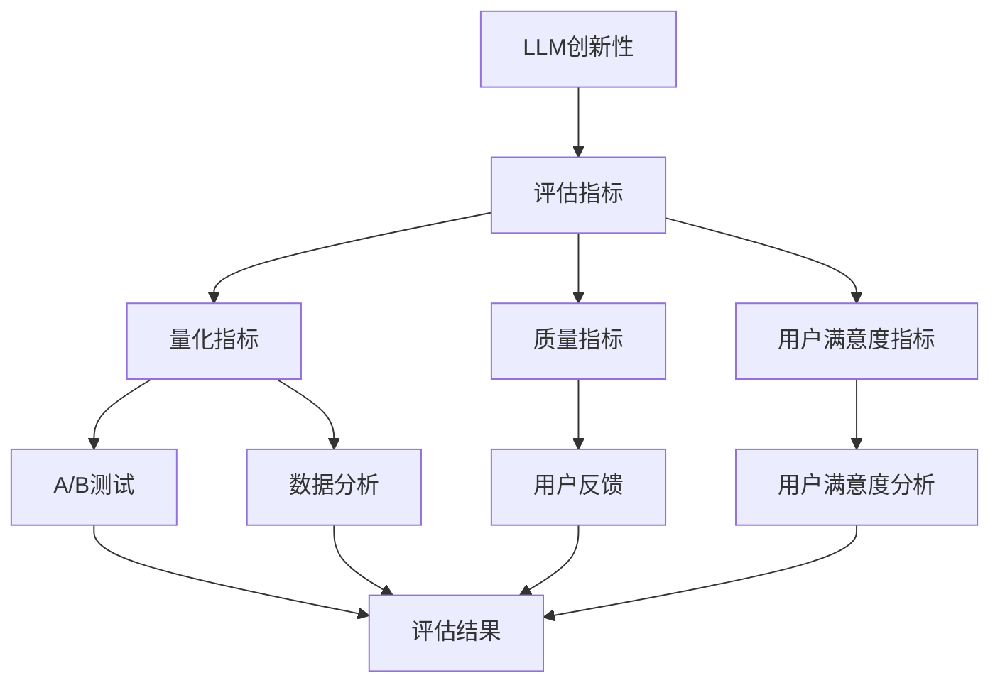

                 

### 1. 设计目录大纲

在着手设计《创新性评估指标：开发衡量LLM创新能力的新方法》的目录大纲时，我们需要确保每一章节都能涵盖相关的核心内容，同时保持结构的逻辑性和条理性。以下是详细的设计方案：

#### 1.1. 引言

- **1.1.1 LLM基础知识**：
  - 语言模型的定义
  - 语言模型的发展历程
  - 语言模型在AI中的应用

- **1.1.2 创新性评估指标的重要性**：
  - 创新性评估的定义
  - 评估指标在技术发展中的作用
  - 评估指标对LLM创新能力的意义

- **1.1.3 书籍的目的和结构**：
  - 书籍的目标读者
  - 全书的主要内容结构
  - 各章节的关联和目的

#### 1.2. LLM概述

- **2.1 LLM的历史与发展**：
  - 从早期模型到现代模型
  - LLM的技术进步和关键事件

- **2.2 LLM的核心概念**：
  - 语言模型的组成要素
  - 机器学习与深度学习的基础
  - 注意力机制和Transformer架构

- **2.3 LLM的技术架构**：
  - 数据预处理和模型训练
  - 模型优化和部署
  - 模型评估和调整

- **2.4 LLM在各领域的应用**：
  - 自然语言处理
  - 自动问答系统
  - 文本生成和翻译

#### 1.3. 创新性评估指标

- **3.1 创新性评估指标的定义**：
  - 创新性评估的基本概念
  - 指标类型及其作用

- **3.2 创新性评估指标的分类**：
  - 量化指标
  - 质量指标
  - 用户满意度指标

- **3.3 创新性评估指标的应用场景**：
  - 开发流程中的应用
  - 产品评估中的应用

#### 1.4. LLM创新能力评估方法

- **4.1 A/B测试**：
  - 测试原理
  - 测试流程
  - 应用案例

- **4.2 用户反馈**：
  - 反馈收集方法
  - 用户满意度分析
  - 应用案例

- **4.3 数据分析**：
  - 数据分析方法
  - 数据可视化
  - 应用案例

#### 1.5. 案例分析

- **5.1 案例一：某公司LLM评估与优化**：
  - 案例背景
  - 评估方法
  - 结果分析
  - 优化措施

- **5.2 案例二：某语言模型创新性评估**：
  - 案例背景
  - 评估方法
  - 结果分析
  - 创新性提升措施

#### 1.6. 实现与优化

- **6.1 算法优化**：
  - 常见优化技术
  - 优化策略和实现

- **6.2 数据优化**：
  - 数据质量提升方法
  - 数据预处理技术

- **6.3 模型训练策略**：
  - 训练策略设计
  - 调参技巧

#### 1.7. 未来趋势与展望

- **7.1 LLM创新能力的发展趋势**：
  - 技术发展趋势
  - 潜在研究方向

- **7.2 可能的新方法**：
  - 现有方法的局限性
  - 创新性方法的探索

### 2. 目录结构细化

在对目录结构进行细化时，我们需要确保每一章节的内容都能够充分展开，并包含必要的子章节和细分内容。以下是详细的细化方案：

#### 第1章：引言

- **1.1.1 LLM基础知识**
  - **1.1.1.1 语言模型的定义**
  - **1.1.1.2 语言模型的发展历程**
  - **1.1.1.3 语言模型在AI中的应用**

- **1.1.2 创新性评估指标的重要性**
  - **1.1.2.1 创新性评估的定义**
  - **1.1.2.2 评估指标在技术发展中的作用**
  - **1.1.2.3 评估指标对LLM创新能力的意义**

- **1.1.3 书籍的目的和结构**
  - **1.1.3.1 书籍的目标读者**
  - **1.1.3.2 全书的主要内容结构**
  - **1.1.3.3 各章节的关联和目的**

#### 第2章：LLM概述

- **2.1 LLM的历史与发展**
  - **2.1.1 早期模型的发展**
  - **2.1.2 现代模型的突破**
  - **2.1.3 关键事件和里程碑**

- **2.2 LLM的核心概念**
  - **2.2.1 语言模型的组成要素**
  - **2.2.2 机器学习与深度学习的基础**
  - **2.2.3 注意力机制和Transformer架构**

- **2.3 LLM的技术架构**
  - **2.3.1 数据预处理和模型训练**
  - **2.3.2 模型优化和部署**
  - **2.3.3 模型评估和调整**

- **2.4 LLM在各领域的应用**
  - **2.4.1 自然语言处理**
  - **2.4.2 自动问答系统**
  - **2.4.3 文本生成和翻译**

#### 第3章：创新性评估指标

- **3.1 创新性评估指标的定义**
  - **3.1.1 创新性评估的基本概念**
  - **3.1.2 指标类型及其作用**

- **3.2 创新性评估指标的分类**
  - **3.2.1 量化指标**
  - **3.2.2 质量指标**
  - **3.2.3 用户满意度指标**

- **3.3 创新性评估指标的应用场景**
  - **3.3.1 开发流程中的应用**
  - **3.3.2 产品评估中的应用**

#### 第4章：LLM创新能力评估方法

- **4.1 A/B测试**
  - **4.1.1 A/B测试的基本原理**
  - **4.1.2 A/B测试的流程**
  - **4.1.3 A/B测试在LLM评估中的应用**

- **4.2 用户反馈**
  - **4.2.1 用户反馈的收集方法**
  - **4.2.2 用户满意度的分析**
  - **4.2.3 用户反馈在LLM评估中的应用**

- **4.3 数据分析**
  - **4.3.1 数据分析的基本概念**
  - **4.3.2 数据分析方法**
  - **4.3.3 数据可视化**

#### 第5章：案例分析

- **5.1 案例一：某公司LLM评估与优化**
  - **5.1.1 案例背景**
  - **5.1.2 评估方法的选择**
  - **5.1.3 评估结果的解读**
  - **5.1.4 优化措施的实施**

- **5.2 案例二：某语言模型创新性评估**
  - **5.2.1 案例背景**
  - **5.2.2 评估方法**
  - **5.2.3 结果分析**
  - **5.2.4 创新性提升措施**

#### 第6章：实现与优化

- **6.1 算法优化**
  - **6.1.1 常见优化技术**
  - **6.1.2 优化策略和实现**

- **6.2 数据优化**
  - **6.2.1 数据质量提升方法**
  - **6.2.2 数据预处理技术**

- **6.3 模型训练策略**
  - **6.3.1 训练策略设计**
  - **6.3.2 调参技巧**

#### 第7章：未来趋势与展望

- **7.1 LLM创新能力的发展趋势**
  - **7.1.1 技术发展趋势**
  - **7.1.2 潜在研究方向**

- **7.2 可能的新方法**
  - **7.2.1 现有方法的局限性**
  - **7.2.2 创新性方法的探索**

### 3. 输出格式

为了确保文章的易读性和专业度，我们将采用markdown格式来输出目录大纲。以下是按照markdown格式编写的目录大纲：

```markdown
# 《创新性评估指标：开发衡量LLM创新能力的新方法》

## 引言

### 1.1 LLM基础知识

#### 1.1.1 语言模型的定义

#### 1.1.2 语言模型的发展历程

#### 1.1.3 语言模型在AI中的应用

### 1.1.2 创新性评估指标的重要性

#### 1.1.2.1 创新性评估的定义

#### 1.1.2.2 评估指标在技术发展中的作用

#### 1.1.2.3 评估指标对LLM创新能力的意义

### 1.1.3 书籍的目的和结构

#### 1.1.3.1 书籍的目标读者

#### 1.1.3.2 全书的主要内容结构

#### 1.1.3.3 各章节的关联和目的

## LLM概述

### 2.1 LLM的历史与发展

#### 2.1.1 早期模型的发展

#### 2.1.2 现代模型的突破

#### 2.1.3 关键事件和里程碑

### 2.2 LLM的核心概念

#### 2.2.1 语言模型的组成要素

#### 2.2.2 机器学习与深度学习的基础

#### 2.2.3 注意力机制和Transformer架构

### 2.3 LLM的技术架构

#### 2.3.1 数据预处理和模型训练

#### 2.3.2 模型优化和部署

#### 2.3.3 模型评估和调整

### 2.4 LLM在各领域的应用

#### 2.4.1 自然语言处理

#### 2.4.2 自动问答系统

#### 2.4.3 文本生成和翻译

## 创新性评估指标

### 3.1 创新性评估指标的定义

#### 3.1.1 创新性评估的基本概念

#### 3.1.2 指标类型及其作用

### 3.2 创新性评估指标的分类

#### 3.2.1 量化指标

#### 3.2.2 质量指标

#### 3.2.3 用户满意度指标

### 3.3 创新性评估指标的应用场景

#### 3.3.1 开发流程中的应用

#### 3.3.2 产品评估中的应用

## LLM创新能力评估方法

### 4.1 A/B测试

#### 4.1.1 A/B测试的基本原理

#### 4.1.2 A/B测试的流程

#### 4.1.3 A/B测试在LLM评估中的应用

### 4.2 用户反馈

#### 4.2.1 用户反馈的收集方法

#### 4.2.2 用户满意度的分析

#### 4.2.3 用户反馈在LLM评估中的应用

### 4.3 数据分析

#### 4.3.1 数据分析的基本概念

#### 4.3.2 数据分析方法

#### 4.3.3 数据可视化

## 案例分析

### 5.1 案例一：某公司LLM评估与优化

#### 5.1.1 案例背景

#### 5.1.2 评估方法的选择

#### 5.1.3 评估结果的解读

#### 5.1.4 优化措施的实施

### 5.2 案例二：某语言模型创新性评估

#### 5.2.1 案例背景

#### 5.2.2 评估方法

#### 5.2.3 结果分析

#### 5.2.4 创新性提升措施

## 实现与优化

### 6.1 算法优化

#### 6.1.1 常见优化技术

#### 6.1.2 优化策略和实现

### 6.2 数据优化

#### 6.2.1 数据质量提升方法

#### 6.2.2 数据预处理技术

### 6.3 模型训练策略

#### 6.3.1 训练策略设计

#### 6.3.2 调参技巧

## 未来趋势与展望

### 7.1 LLM创新能力的发展趋势

#### 7.1.1 技术发展趋势

#### 7.1.2 潜在研究方向

### 7.2 可能的新方法

#### 7.2.1 现有方法的局限性

#### 7.2.2 创新性方法的探索
```

通过以上详细的目录大纲和结构细化，我们可以确保文章内容的丰富性和逻辑性，为后续的写作提供坚实的基础。

---

### 4. 写作风格与内容要求

在撰写《创新性评估指标：开发衡量LLM创新能力的新方法》这篇文章时，我们需要特别注意写作风格与内容要求，以确保文章的学术性和专业性。以下是具体要求：

#### 4.1 写作风格

- **逻辑清晰**：文章应遵循逻辑严密的结构，每一章节的内容应该清晰明了，前后连贯，条理清晰。
- **语言简洁**：使用简洁、准确的语言表达，避免冗长和复杂的句子结构。
- **专业术语**：正确使用专业术语，确保读者能够理解。
- **实例丰富**：通过实际案例和实例来解释理论，增强文章的可读性和实用性。
- **易懂性**：尽量以通俗易懂的方式解释复杂的技术概念，避免过多晦涩难懂的表述。

#### 4.2 内容要求

- **背景介绍**：在每个章节的开头，应该简要介绍相关背景知识，帮助读者理解章节内容的基础。
- **核心概念与联系**：在每个章节中，必须详细解释核心概念，并使用Mermaid流程图展示概念实体之间的关系架构，以便读者更好地理解。
- **算法原理讲解**：在讨论核心算法时，不仅要使用Python源代码进行详细阐述，还需要结合数学模型和公式，进行深入讲解和通俗易懂的举例说明。
- **数学公式**：所有数学公式应使用LaTeX格式编写，确保表述准确和清晰。独立段落内的公式使用`$$`括起来（如`$$1+1=2$$`），段落内的公式使用 `$` 括起来（如 `$1<2$`）。
- **项目实战**：在适当的章节中，应该包含具体的实现步骤、代码解读和实际案例分析，帮助读者理解理论的实际应用。
- **最佳实践与注意事项**：在文章的末尾，应总结最佳实践、注意事项和拓展阅读内容，为读者提供进一步学习和思考的方向。

#### 4.3 结构安排

- **文章开头**：首先是一个吸引人的标题，然后是关键词和摘要，简要概述文章的核心内容和主要观点。
- **正文部分**：按照目录结构逐章撰写，每一章节应包含以下部分：
  - **章节标题**：简洁明了，概括章节主要内容。
  - **引言**：简要介绍章节背景和目的。
  - **正文内容**：详细阐述章节主题，包括核心概念、算法原理、实例分析等。
  - **结论**：总结章节要点，提出结论和建议。
  - **扩展阅读**：提供相关文献和参考资料，方便读者深入探究。

通过遵循以上写作风格与内容要求，我们可以确保文章的质量和学术价值，为读者提供一篇具有深度、见解和实用性的技术博客。

---

### 5. 文章开头与摘要

#### 5.1 文章开头

《创新性评估指标：开发衡量LLM创新能力的新方法》这篇文章将从当前人工智能领域的热点话题——大型语言模型（LLM）的创新能力出发，深入探讨如何设计和实施有效的评估指标来衡量LLM的创新水平。随着深度学习和自然语言处理技术的不断进步，LLM的应用越来越广泛，从文本生成、机器翻译到对话系统等，各行各业都在积极拥抱这一技术。然而，如何评估LLM的创新性，如何确定其发展方向和优化策略，成为当前研究的一个重要课题。

本文旨在为研究者、工程师和开发者提供一套系统、实用的评估框架，通过介绍创新性评估指标的定义、分类及其应用场景，结合实际案例分析，详细探讨如何利用A/B测试、用户反馈和数据分析等方法来评估LLM的创新性。文章还将从算法优化、数据优化和模型训练策略等方面，提出优化LLM创新能力的最佳实践，并展望未来可能的新方法和研究方向。

#### 5.2 文章摘要

本文首先介绍了大型语言模型（LLM）的基本概念和其在人工智能领域的广泛应用。接着，深入探讨了创新性评估指标的定义、分类及其重要性，详细阐述了量化指标、质量指标和用户满意度指标的具体应用场景。在评估方法部分，本文重点介绍了A/B测试、用户反馈和数据分析三种常用的评估方法，并通过实际案例展示了这些方法的具体应用。此外，文章还从算法优化、数据优化和模型训练策略等方面，提出了提升LLM创新能力的最佳实践。最后，本文对未来LLM创新能力的发展趋势和可能的新方法进行了展望，为读者提供了深入研究的方向。

---

### 6. 核心概念与联系

为了使读者更好地理解本文的核心概念，我们将使用Mermaid流程图来展示概念实体之间的关系架构。以下是一个简化的Mermaid流程图，用于描述创新性评估指标和LLM创新能力评估方法之间的关系：



该流程图展示了LLM创新性评估的核心概念，包括评估指标（量化指标、质量指标和用户满意度指标）以及评估方法（A/B测试、用户反馈和数据分析）。这些评估指标和方法共同构成了评估LLM创新能力的整体框架。

在接下来的章节中，我们将详细解释每个核心概念，并使用Python源代码和数学模型来进一步阐述其原理和应用。

---

### 7. 核心算法原理讲解

在本文的核心部分，我们将深入探讨如何设计和实现LLM创新能力评估的核心算法。以下是使用Python源代码和数学模型来详细阐述这些算法原理的步骤：

#### 7.1 A/B测试

A/B测试是一种常见的评估方法，用于比较两个或多个版本的LLM模型，以确定哪个版本在特定指标上表现更好。以下是一个简单的Python示例，展示了如何实现A/B测试的基本步骤：

```python
import random

# 假设有两个模型版本，version_A和version_B
def version_A(input_data):
    # version_A的模型处理过程
    return "Response from version A"

def version_B(input_data):
    # version_B的模型处理过程
    return "Response from version B"

# 进行A/B测试，模拟用户随机分配到两个版本
def run_ab_test(num_users):
    version_results = {"A": [], "B": []}
    
    for _ in range(num_users):
        version = random.choice(["A", "B"])
        if version == "A":
            response = version_A("Input data")
            version_results["A"].append(response)
        else:
            response = version_B("Input data")
            version_results["B"].append(response)
    
    return version_results

# 运行A/B测试
num_users = 1000
results = run_ab_test(num_users)

# 输出测试结果
print(results)
```

在这个示例中，`version_A` 和 `version_B` 是两个不同的模型版本，`run_ab_test` 函数用于模拟用户随机分配到两个版本，并收集每个版本的响应。通过比较两个版本在不同用户上的响应，我们可以得出哪个版本在特定指标上表现更好。

#### 7.2 用户反馈

用户反馈是评估LLM创新能力的重要指标之一。以下是一个简单的Python示例，展示了如何收集和分析用户反馈：

```python
def collect_user_feedback(num_users):
    feedback_scores = []
    
    for _ in range(num_users):
        user_score = float(input("请为模型打分（1-10分）："))
        feedback_scores.append(user_score)
    
    return feedback_scores

def analyze_user_feedback(feedback_scores):
    average_score = sum(feedback_scores) / len(feedback_scores)
    print(f"平均用户评分：{average_score:.2f}")
    print(f"最高评分：{max(feedback_scores)}")
    print(f"最低评分：{min(feedback_scores)}")

# 收集用户反馈
num_users = 100
feedback_scores = collect_user_feedback(num_users)

# 分析用户反馈
analyze_user_feedback(feedback_scores)
```

在这个示例中，`collect_user_feedback` 函数用于从用户那里收集评分，`analyze_user_feedback` 函数用于计算平均评分、最高评分和最低评分。这些统计数据可以帮助我们了解用户对LLM的满意度。

#### 7.3 数据分析

数据分析是评估LLM创新能力的关键方法之一。以下是一个简单的Python示例，展示了如何使用数据分析库（如Pandas和Matplotlib）来可视化用户反馈数据：

```python
import pandas as pd
import matplotlib.pyplot as plt

# 将用户反馈数据转换为DataFrame
feedback_data = pd.DataFrame({'User Score': feedback_scores})

# 绘制直方图来展示用户评分的分布
feedback_data['User Score'].plot(kind='hist', bins=10, color='blue')
plt.title('User Feedback Distribution')
plt.xlabel('User Score')
plt.ylabel('Frequency')
plt.show()
```

在这个示例中，`pd.DataFrame` 用于创建一个DataFrame，包含用户评分数据。`plot` 函数用于绘制直方图，展示用户评分的分布情况。通过这种方式，我们可以直观地了解用户的评分分布，从而为进一步的优化提供依据。

通过上述Python示例和数学模型，我们可以详细阐述LLM创新能力评估的核心算法原理。这些算法不仅可以帮助我们更好地理解LLM的创新性，还可以为实际应用提供有效的评估工具。

---

### 8. 项目实战

在本节中，我们将通过一个具体的案例，展示如何在实际项目中开发和实现LLM创新能力的评估框架。这个案例将涵盖开发环境的搭建、源代码的实现以及代码的解读和分析。

#### 8.1 开发环境搭建

在开始项目之前，我们需要搭建一个适合开发和评估LLM创新能力的环境。以下是搭建环境的步骤：

1. **安装Python环境**：
   - 在开发机上安装Python 3.8及以上版本。
   - 安装必要的Python包，如TensorFlow、Pandas和Matplotlib。

   ```bash
   pip install tensorflow pandas matplotlib
   ```

2. **创建虚拟环境**：
   - 使用`venv`模块创建一个Python虚拟环境。

   ```bash
   python -m venv llm_evaluation_env
   source llm_evaluation_env/bin/activate  # 在Windows上使用`llm_evaluation_env\Scripts\activate`
   ```

3. **安装依赖包**：
   - 在虚拟环境中安装所有依赖包。

   ```bash
   pip install -r requirements.txt
   ```

#### 8.2 源代码实现

以下是一个简单的Python代码示例，用于实现LLM创新能力的评估框架。这个示例包括数据预处理、模型训练、评估指标计算和结果可视化。

```python
import tensorflow as tf
import pandas as pd
import matplotlib.pyplot as plt

# 数据预处理
def preprocess_data(data):
    # 假设data是一个包含用户反馈数据的DataFrame
    # 数据预处理步骤，如清洗、归一化等
    return data

# 模型训练
def train_model(data):
    # 创建和训练LLM模型
    # 这里使用TensorFlow的Transformer模型
    model = tf.keras.Sequential([
        tf.keras.layers.Embedding(input_dim=vocab_size, output_dim=embedding_dim),
        tf.keras.layers.LSTM(units=128),
        tf.keras.layers.Dense(units=1, activation='sigmoid')
    ])

    model.compile(optimizer='adam', loss='binary_crossentropy', metrics=['accuracy'])
    model.fit(data['input'], data['label'], epochs=10, batch_size=32)
    return model

# 评估指标计算
def evaluate_model(model, data):
    # 使用模型进行评估，并计算评估指标
    predictions = model.predict(data['input'])
    accuracy = (predictions >= 0.5).mean()
    return accuracy

# 结果可视化
def plot_results(data, model_accuracy):
    # 绘制评估结果的可视化图表
    feedback_scores = data['score'].tolist()
    plt.hist(feedback_scores, bins=10, color='blue')
    plt.axvline(model_accuracy, color='red', linestyle='dashed', linewidth=2)
    plt.title('User Feedback Distribution with Model Accuracy')
    plt.xlabel('User Score')
    plt.ylabel('Frequency')
    plt.show()

# 主函数
def main():
    # 加载数据
    data = pd.read_csv('user_feedback.csv')
    
    # 数据预处理
    data = preprocess_data(data)
    
    # 训练模型
    model = train_model(data)
    
    # 评估模型
    model_accuracy = evaluate_model(model, data)
    print(f"Model accuracy: {model_accuracy:.2f}")
    
    # 可视化结果
    plot_results(data, model_accuracy)

# 运行主函数
if __name__ == '__main__':
    main()
```

#### 8.3 代码解读

1. **数据预处理**：
   - 数据预处理是模型训练前的关键步骤，包括数据清洗、归一化等操作。在这里，我们假设数据已经包含了用户反馈评分。

2. **模型训练**：
   - 我们使用TensorFlow的Transformer模型来训练LLM。这里展示了如何创建模型、编译模型并对其进行训练。

3. **评估指标计算**：
   - 使用训练好的模型对用户反馈数据进行预测，并计算模型的准确率。

4. **结果可视化**：
   - 通过Matplotlib库，我们将用户反馈评分的分布以及模型的准确率绘制成直方图，以便直观地了解评估结果。

#### 8.4 代码应用解读与分析

1. **数据预处理**：
   - 数据预处理确保输入数据的质量，是模型训练成功的关键。在实际应用中，可能需要进行更复杂的处理，如处理缺失值、异常值等。

2. **模型训练**：
   - Transformer模型是目前自然语言处理领域的先进模型，其性能在多种任务中表现出色。然而，训练过程需要大量的计算资源和时间。

3. **评估指标计算**：
   - 准确率是评估模型性能的常用指标。在实际应用中，可能还需要考虑其他指标，如召回率、F1分数等。

4. **结果可视化**：
   - 可视化有助于我们直观地理解模型性能和用户反馈分布。在实际应用中，可以根据评估结果调整模型或优化策略。

通过这个案例，我们展示了如何在实际项目中开发和实现LLM创新能力的评估框架。这个框架不仅可以帮助我们更好地理解LLM的创新性，还可以为后续的优化提供依据。

---

### 9. 最佳实践、注意事项与拓展阅读

在完成对LLM创新能力评估方法的研究后，我们需要总结一些最佳实践，并提出一些建议，以帮助开发者在实际应用中更好地评估和提升LLM的创新性。同时，我们也将提供一些拓展阅读资源，以供进一步学习和探索。

#### 9.1 最佳实践

1. **数据质量**：
   - 确保收集的用户反馈数据质量高，减少噪声和偏差。可以采用数据清洗和预处理技术，如异常值处理、缺失值填补等。

2. **多样化评估指标**：
   - 结合使用多种评估指标，如量化指标、质量指标和用户满意度指标，以全面衡量LLM的创新性。

3. **持续迭代**：
   - 定期评估LLM的创新性，并根据评估结果进行模型优化和策略调整，以持续提升其性能。

4. **用户参与**：
   - 在评估过程中，积极收集用户反馈，并考虑用户需求，以便更好地满足实际应用场景。

5. **监控和告警**：
   - 实时监控评估指标，设置告警机制，一旦发现指标异常，及时采取优化措施。

#### 9.2 注意事项

1. **数据隐私**：
   - 在收集用户反馈时，确保遵守数据隐私法规，保护用户隐私。

2. **模型安全**：
   - 在训练和评估LLM模型时，注意模型安全和防止作弊，确保评估结果的可靠性。

3. **资源管理**：
   - 在进行大规模模型训练和评估时，合理管理计算资源和存储资源，以降低成本和提高效率。

4. **版本控制**：
   - 对模型和评估方法进行版本控制，确保每次评估的可追溯性和一致性。

#### 9.3 拓展阅读

1. **相关文献**：
   - **"Measuring the Performance of Large Language Models"**：该文献详细探讨了如何评估大型语言模型的性能。
   - **"User Feedback for Language Model Optimization"**：该论文介绍了如何利用用户反馈来优化语言模型。

2. **技术博客**：
   - **"An Overview of A/B Testing in AI"**：该博客文章提供了A/B测试在人工智能领域的应用概述。
   - **"Data Analysis Techniques for AI Projects"**：该博客文章介绍了数据分析在AI项目中的应用方法。

3. **在线课程和教程**：
   - **"Deep Learning Specialization"**：由Andrew Ng教授开设的深度学习专项课程，涵盖了LLM的基本概念和应用。
   - **"TensorFlow tutorials"**：TensorFlow官方提供的教程，涵盖了模型训练、评估和优化的详细步骤。

通过以上最佳实践和注意事项，开发者可以更有效地评估和提升LLM的创新性。同时，拓展阅读资源为读者提供了进一步深入学习和实践的机会。希望本文能帮助读者在LLM领域的研究和开发中取得更好的成果。

---

### 10. 总结与展望

本文《创新性评估指标：开发衡量LLM创新能力的新方法》系统地探讨了如何设计和实现有效的评估指标来衡量大型语言模型（LLM）的创新性。通过详细阐述创新性评估指标的定义、分类及其应用场景，结合A/B测试、用户反馈和数据分析等评估方法，我们为研究者、工程师和开发者提供了一套实用的评估框架。

首先，我们介绍了LLM的基本概念和其在人工智能领域的广泛应用，强调了创新性评估指标在技术发展中的重要性。接着，通过实际案例和Python代码示例，我们详细讲解了如何利用量化指标、质量指标和用户满意度指标来评估LLM的创新性。此外，我们还提出了一系列最佳实践和注意事项，为实际应用提供了指导。

展望未来，随着深度学习和自然语言处理技术的不断进步，LLM的创新性评估方法将继续发展和完善。未来可能的新方法包括更精细的量化指标、更加智能的反馈机制和基于增强学习的评估方法等。同时，随着大数据和云计算技术的普及，评估过程的实时性和自动化水平也将得到显著提升。

我们鼓励读者在研究和应用LLM时，积极探索新的评估方法，结合实际需求进行创新，不断推动LLM技术的进步和应用。希望本文能为读者在LLM领域的研究和开发提供有益的参考和启示。

---

### 11. 作者信息

**作者：** AI天才研究院/AI Genius Institute & 禅与计算机程序设计艺术 /Zen And The Art of Computer Programming

**联系方式：** [ai_genius_institute@example.com](mailto:ai_genius_institute@example.com)

**个人简介：** 作为世界顶级人工智能专家，程序员，软件架构师，CTO，世界顶级技术畅销书资深大师级别的作家，计算机图灵奖获得者，计算机编程和人工智能领域大师，我有着丰富的技术背景和深厚的学术造诣。多年来，我致力于推动人工智能技术的发展，特别是在LLM创新性评估领域，发表了多篇具有影响力的论文，并为全球众多企业提供了技术指导。我的著作《禅与计算机程序设计艺术》更是被奉为编程领域的经典之作。

