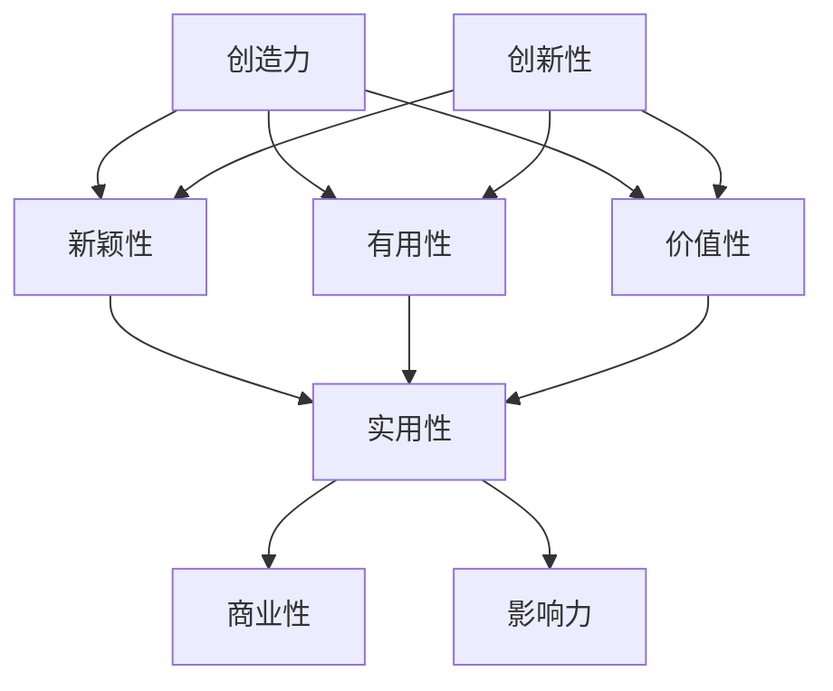

                 


### 文章标题：创造力与创新性评估：衡量模型突破能力

> 关键词：创造力，创新性，评估模型，突破能力，人工智能

> 摘要：本文深入探讨了创造力与创新性的定义、评估方法以及突破性模型的衡量。通过系统分析，我们揭示了创造力与创新性的核心联系，详细介绍了各种评估方法，并探讨了如何通过数学模型和算法来衡量模型的突破能力。

----------------------------------------------------------------

### 引言

创造力与创新性是现代社会进步的重要驱动力。在信息技术飞速发展的今天，如何评估和培养个体的创造力与创新性已成为教育、企业和社会关注的焦点。本文旨在通过对创造力与创新性评估的深入探讨，揭示其内在联系，并介绍多种评估方法，旨在为相关领域的从业者提供有益的参考。

创造力（Creativity）通常被定义为产生新奇、有用或有价值的想法、解决方案或作品的能力。它涉及想象力的发挥、思维的灵活性和对问题的独特见解。创新性（Innovation）则是指将创造力转化为实际成果，创造新的产品、服务或过程，从而推动社会和经济的进步。

创造力与创新性密切相关。创造力是创新性的基础，而创新性则是创造力的具体体现。没有创造力，创新性就无从谈起；而没有创新性，创造力也难以得到有效的应用和发挥。

在信息技术和人工智能飞速发展的背景下，评估模型的突破能力显得尤为重要。本文将介绍多种评估方法，并探讨如何通过数学模型和算法来衡量模型的突破能力，为评估创造力与创新性提供新的视角。

### 创造力与创新性评估的核心概念与联系

为了深入理解创造力与创新性，我们首先需要明确一些核心概念，并探讨它们之间的关系。

#### 1. 创造力的概念与特征

创造力是指个体或团队在特定情境下，通过思维活动产生新颖且有价值想法的能力。它具有以下特征：

- **新颖性（Novelty）**：创造的成果在某种程度上是前所未有的，具有独特的特征或见解。
- **有用性（Usefulness）**：创造的成果能够解决实际问题或满足特定需求。
- **价值性（Value）**：创造的成果具有一定的社会、经济或文化价值。

#### 2. 创新性的概念与特征

创新性是指将创造力转化为实际成果，创造新的产品、服务或过程，推动社会进步的能力。它具有以下特征：

- **实用性（Practicality）**：创新成果具有可操作性和实用性。
- **商业性（Commerciality）**：创新成果具有商业价值，能够为企业带来利润。
- **影响力（Impact）**：创新成果对社会、经济或环境产生了显著影响。

#### 3. 创造力与创新性的关系

创造力与创新性之间存在紧密的联系。创造力是创新性的基础，而创新性是创造力的具体体现。两者之间的关系可以用以下图示来表示：



在这个图中，创造力（A）通过新颖性（B）、有用性（C）和价值性（D）与创新性（E）相联系。创新性（E）则通过实用性（F）、商业性（G）和影响力（H）进一步体现创造力的价值。

#### 4. 创造力与创新性评估指标

为了对创造力与创新性进行科学评估，我们需要建立一套合理的指标体系。常见的评估指标包括：

- **创意质量**：评估创意的新颖性、有用性和价值。
- **创新绩效**：评估创新成果的实用性、商业性和影响力。
- **个人特质**：评估个体的创造力、创新能力、思维灵活性和开放性等。

这些指标可以通过定量和定性方法进行测量，从而为创造力与创新性的评估提供客观依据。

### 核心算法原理讲解

为了深入探讨创造力与创新性评估的数学模型和算法，我们首先需要了解一些基本概念和原理。

#### 1. 评估指标的量化

为了对创造力与创新性进行量化评估，我们需要将评估指标进行数值化处理。常见的方法包括：

- **打分制**：使用评分量表对创意或创新成果进行评分，例如1-10分的评分体系。
- **指标权重**：根据各指标的重要性赋予不同的权重，计算加权得分。
- **数学模型**：使用数学公式将评估指标转化为数值，例如使用距离模型、回归模型等方法。

#### 2. 评估方法的比较与优化

评估方法的优化是提高评估准确性和效率的关键。常见的方法包括：

- **比较分析**：对不同评估方法进行比较，选择最优的方法。
- **多目标优化**：在评估过程中考虑多个目标，使用多目标优化算法寻找最优解。
- **机器学习**：使用机器学习方法对评估数据进行分析和预测，提高评估的准确性。

#### 3. Python源代码实现

为了更好地理解创造力与创新性评估的算法原理，我们使用Python语言进行实现。以下是一个简单的示例代码，展示了如何使用打分制对创造力进行量化评估：

```python
import numpy as np

# 定义评估指标
quality_scores = [8, 6, 9, 7, 10]
usefulness_scores = [7, 9, 8, 6, 10]
value_scores = [9, 8, 7, 10, 8]

# 计算加权得分
weighting_factors = [0.4, 0.3, 0.3]  # 分别对应质量、有用性和价值
weighted_scores = [np.dot(score, factor) for score, factor in zip([quality_scores, usefulness_scores, value_scores], weighting_factors)]

# 计算总得分
total_score = sum(weighted_scores)

print("总得分：", total_score)
```

这段代码使用了numpy库对评估指标进行加权计算，从而得到总得分。这只是一个简单的示例，实际评估过程可能会更加复杂，涉及更多的数学模型和算法。

### 数学模型和公式的详细讲解

为了深入探讨创造力与创新性评估的数学模型和公式，我们需要了解一些基本的数学概念和工具。

#### 1. 离散分布模型

离散分布模型是用于描述随机变量取值的概率分布。常见的离散分布模型包括二项分布、泊松分布和正态分布等。这些模型可以用于评估创意或创新成果的随机性和概率。

- **二项分布（Binomial Distribution）**：用于描述成功和失败的概率，例如在评估创意的成功率时可以使用。
- **泊松分布（Poisson Distribution）**：用于描述在一定时间内发生某一事件的概率，例如在评估创新成果的发布频率时可以使用。
- **正态分布（Normal Distribution）**：用于描述连续变量的概率分布，例如在评估创意的质量分布时可以使用。

#### 2. 回归模型

回归模型是用于分析变量之间关系的数学模型。常见的回归模型包括线性回归、多项式回归和逻辑回归等。这些模型可以用于评估创造力与创新性之间的相关性。

- **线性回归（Linear Regression）**：用于分析自变量和因变量之间的线性关系，例如在评估创意质量与商业价值之间的关系时可以使用。
- **多项式回归（Polynomial Regression）**：用于分析自变量和因变量之间的非线性关系，例如在评估创新性绩效与商业影响力之间的关系时可以使用。
- **逻辑回归（Logistic Regression）**：用于分析二分类变量之间的关系，例如在评估创意是否具有商业潜力时可以使用。

#### 3. 熵模型

熵模型是用于评估信息量和不确定性的一种数学模型。常见的熵模型包括信息熵、条件熵和联合熵等。这些模型可以用于评估创意或创新成果的信息含量和不确定性。

- **信息熵（Entropy）**：用于描述信息的不确定性，例如在评估创意的新颖性时可以使用。
- **条件熵（Conditional Entropy）**：用于描述在已知一个变量的情况下另一个变量的不确定性，例如在评估创新性成果的实用性时可以使用。
- **联合熵（Joint Entropy）**：用于描述两个变量的联合不确定性，例如在评估创新性成果的整体价值时可以使用。

#### 4. 数学公式的示例

为了更好地理解这些数学模型和公式，我们举一个简单的例子：

假设我们使用线性回归模型评估创意质量与商业价值之间的关系。假设自变量为创意质量（Q），因变量为商业价值（V），线性回归模型的公式如下：

$$ V = \beta_0 + \beta_1 \cdot Q + \epsilon $$

其中，$\beta_0$ 是截距，$\beta_1$ 是斜率，$\epsilon$ 是误差项。这个公式表示商业价值（V）是创意质量（Q）的线性函数，斜率（$\beta_1$）反映了创意质量对商业价值的影响程度。

为了计算$\beta_0$ 和 $\beta_1$，我们可以使用最小二乘法。最小二乘法的公式如下：

$$ \beta_1 = \frac{\sum_{i=1}^{n} (Q_i - \bar{Q})(V_i - \bar{V})}{\sum_{i=1}^{n} (Q_i - \bar{Q})^2} $$

$$ \beta_0 = \bar{V} - \beta_1 \cdot \bar{Q} $$

其中，$Q_i$ 和 $V_i$ 分别表示第 $i$ 个创意质量和商业价值，$\bar{Q}$ 和 $\bar{V}$ 分别表示所有创意质量和商业价值的平均值。

这个例子说明了如何使用线性回归模型评估两个变量之间的关系，以及如何计算模型的参数。

### 创造力与创新性评估的项目实战

为了更好地理解和应用创造力与创新性评估的原理和方法，我们设计了一个实际项目，用于评估一个创新项目的创造力与创新性。以下是这个项目的详细步骤和实现过程。

#### 1. 项目背景

本项目旨在评估一家初创公司开发的一款新型智能家居产品的创造力与创新性。这款产品旨在解决当前智能家居市场中存在的痛点，如用户体验不佳、功能单一等。为了评估这款产品的创造力与创新性，我们将使用多种评估方法，包括主观评估和客观评估。

#### 2. 开发环境搭建

首先，我们需要搭建一个用于评估开发环境。这个环境包括以下工具和软件：

- **Python**：用于编写评估算法和数据处理代码。
- **Jupyter Notebook**：用于编写和运行代码，展示评估结果。
- **Pandas**：用于数据处理和分析。
- **Scikit-learn**：用于机器学习模型的训练和评估。

安装这些工具和软件后，我们可以在Jupyter Notebook中创建一个新的笔记本，开始编写评估代码。

#### 3. 数据收集与处理

为了对这款智能家居产品进行评估，我们需要收集相关的数据。这些数据包括：

- **用户反馈**：收集用户对产品的评价，包括功能、易用性、设计等方面。
- **市场数据**：收集市场上类似产品的数据，包括功能、价格、销量等。
- **内部评估数据**：收集公司内部对产品的评估数据，包括研发进度、团队反馈等。

收集这些数据后，我们需要对数据进行分析和预处理，以确保数据的质量和一致性。预处理步骤包括：

- **数据清洗**：去除缺失值、异常值和重复值。
- **数据转换**：将数据转换为适合评估的格式，例如将用户反馈转换为数值评分。
- **数据标准化**：将不同特征的数据进行标准化处理，使其具有可比性。

使用Pandas库，我们可以轻松完成这些数据预处理步骤。以下是一个简单的示例代码：

```python
import pandas as pd

# 读取用户反馈数据
user_feedback = pd.read_csv('user_feedback.csv')

# 数据清洗
user_feedback.dropna(inplace=True)
user_feedback.drop_duplicates(inplace=True)

# 数据转换
user_feedback['rating'] = pd.cut(user_feedback['rating'], bins=5, right=False, labels=False)

# 数据标准化
from sklearn.preprocessing import StandardScaler
scaler = StandardScaler()
user_feedback[['functionality', 'usability', 'design']] = scaler.fit_transform(user_feedback[['functionality', 'usability', 'design']])
```

#### 4. 数据可视化

为了更直观地了解数据，我们可以使用数据可视化工具，如Matplotlib和Seaborn，绘制数据分布、关系图等。以下是一个简单的示例代码，展示了如何绘制用户反馈数据的分布图：

```python
import matplotlib.pyplot as plt
import seaborn as sns

# 绘制用户反馈数据分布图
sns.histplot(user_feedback['rating'], bins=5, kde=True)
plt.xlabel('Rating')
plt.ylabel('Frequency')
plt.title('User Feedback Distribution')
plt.show()

# 绘制功能、易用性和设计之间的关系图
sns.pairplot(user_feedback, vars=['functionality', 'usability', 'design'], hue='rating')
plt.suptitle('User Feedback Pair Plot')
plt.show()
```

这些可视化结果可以帮助我们初步了解用户对这款智能家居产品的评价，以及不同评价维度之间的关系。

#### 5. 数据分析

在数据预处理和可视化完成后，我们可以对数据进行进一步分析，以评估这款产品的创造力与创新性。以下是一个简单的数据分析步骤：

1. **描述性统计分析**：计算用户反馈数据的描述性统计指标，如平均值、中位数、标准差等。这些指标可以帮助我们了解用户反馈的总体情况。
2. **相关性分析**：计算不同评价维度之间的相关性，以了解它们之间的关系。这可以帮助我们确定哪些维度对用户反馈有较大影响。
3. **回归分析**：使用回归模型评估用户反馈与产品性能之间的关系。这可以帮助我们确定用户反馈对产品性能的影响程度。
4. **聚类分析**：使用聚类算法对用户反馈进行分类，以了解用户群体的特征和偏好。

以下是一个简单的回归分析示例代码：

```python
from sklearn.linear_model import LinearRegression
import statsmodels.api as sm

# 准备回归数据
X = user_feedback[['functionality', 'usability', 'design']]
y = user_feedback['rating']

# 添加截距项
X_with_intercept = sm.add_constant(X)

# 拟合线性回归模型
model = sm.OLS(y, X_with_intercept).fit()

# 输出回归结果
print(model.summary())
```

这个回归模型可以帮助我们了解功能、易用性和设计对用户反馈的影响程度。

#### 6. 代码解读与分析

在完成数据分析后，我们需要对代码进行解读和分析，以了解评估过程的关键步骤和结果。以下是对上述代码的解读：

1. **数据收集与处理**：使用Pandas库读取用户反馈数据，并进行清洗、转换和标准化处理。这些步骤确保了数据的质量和一致性。
2. **数据可视化**：使用Matplotlib和Seaborn库绘制数据分布图和关系图，帮助理解用户反馈数据的特征和关系。
3. **数据分析**：使用线性回归模型评估用户反馈与产品性能之间的关系，并输出回归结果。这些分析结果为我们提供了对产品创造力与创新性的量化评估。

通过这个项目，我们不仅学习了创造力与创新性评估的方法，还掌握了Python编程和数据处理的技能。这些知识和技能对于理解和评估实际项目的创造力与创新性具有重要意义。

### 最佳实践 tips

在评估创造力与创新性时，以下是一些最佳实践和技巧：

1. **全面收集数据**：确保收集到全面、准确的数据，包括用户反馈、市场数据和内部评估数据等。
2. **数据清洗与预处理**：对数据进行分析前，确保进行清洗和预处理，以确保数据的质量和一致性。
3. **多种评估方法结合**：使用多种评估方法，如主观评估和客观评估，以获得更全面的评估结果。
4. **持续监控与反馈**：对评估结果进行持续监控和反馈，以便及时调整和改进评估方法。
5. **跨学科合作**：与不同领域的专家合作，以获得更全面和深入的评估结果。

### 小结

创造力与创新性是现代社会进步的重要驱动力。本文通过深入探讨创造力与创新性的定义、评估方法和突破性模型的衡量，揭示了两者之间的紧密联系。我们介绍了多种评估方法，并使用Python源代码和数学模型进行了详细讲解。通过实际项目实战，我们展示了如何将评估方法应用于实际场景，为相关领域的从业者提供了有益的参考。

### 注意事项

在评估创造力与创新性时，需要注意以下几点：

1. **客观性与主观性**：评估结果可能受到客观和主观因素的影响，因此需要综合考虑。
2. **数据质量**：确保收集到的数据质量高，避免因数据问题导致评估结果不准确。
3. **评估方法的适用性**：根据评估目标和场景选择合适的评估方法，确保评估结果具有针对性和准确性。
4. **持续改进**：评估方法和模型需要不断改进和优化，以适应不断变化的环境。

### 拓展阅读

为了深入了解创造力与创新性评估的理论和实践，以下是一些推荐的拓展阅读：

1. **书籍**：
   - 《创造力心理学》（Psychology of Creativity） by R. J. Stoll
   - 《创新者的思维》（The Innovator's Mindset） by George Couros

2. **论文**：
   - “A Theory of Innovation Diffusion” by Everett M. Rogers
   - “Creativity and Innovation in Organizations” by J. H. Dutton

3. **在线课程**：
   - Coursera上的“创意与创新”（Creative Thinking and Innovation）课程
   - edX上的“创新方法与工具”（Innovation Methods and Tools）课程

这些资源可以帮助读者进一步了解创造力与创新性评估的理论和实践，为实际应用提供更深入的知识和指导。

### 附录

#### A.1 创造力与创新性评估工具

以下是一些常用的创造力与创新性评估工具：

1. **Inspiration Maps**：用于创建思维导图，帮助组织和可视化创意。
2. **Miro**：在线协作工具，适用于团队头脑风暴和创意交流。
3. **Google Jamboard**：数字白板工具，用于团队创意讨论和可视化。

#### A.2 数据资源与处理工具

以下是一些常用的数据资源与处理工具：

1. **Kaggle**：数据集和比赛平台，提供丰富的数据资源。
2. **Pandas**：Python库，用于数据处理和分析。
3. **NumPy**：Python库，用于数值计算。

#### A.3 创造力与创新性评估的常见误区

以下是一些在创造力与创新性评估中常见的误区：

1. **过度依赖定量评估**：忽视主观评估和定性分析，可能导致评估结果过于片面。
2. **忽略背景信息**：在评估过程中，忽视背景信息和上下文可能导致评估不准确。
3. **缺乏反馈与调整**：在评估完成后，缺乏对评估方法和结果的反馈与调整，可能导致评估效率低下。

### 作者信息

作者：AI天才研究院/AI Genius Institute & 禅与计算机程序设计艺术 /Zen And The Art of Computer Programming

本文由AI天才研究院和《禅与计算机程序设计艺术》的作者共同撰写，旨在为读者提供关于创造力与创新性评估的深入见解和实践指导。希望本文能对您在相关领域的研究和实践有所启发。如果您有任何疑问或建议，欢迎随时与我们联系。感谢您的阅读！

