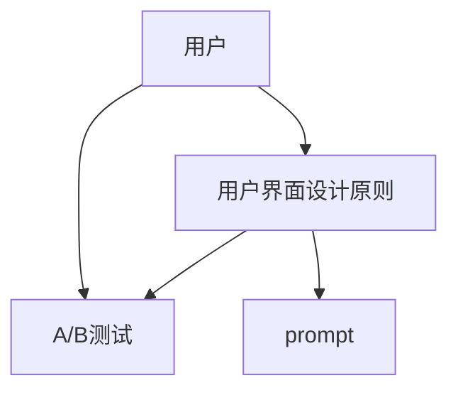

                 

### 《利用A/B测试优化prompt效果》

> **关键词：** A/B测试，prompt优化，用户体验，统计显著性，机器学习

> **摘要：** 本文将深入探讨如何使用A/B测试来优化prompt效果，涵盖A/B测试的基础知识，prompt的概念和类型，测试方法，结果分析，以及优化策略。通过实际案例，展示A/B测试在提升用户交互体验方面的应用和效果。

## 引言

在当今的数字化时代，用户界面(UI)的设计变得越来越重要。一个精心设计的UI不仅能够提升用户的使用体验，还能显著提高产品或服务的转化率和用户留存率。其中，prompt（提示信息）作为一种关键的用户界面元素，起到了引导用户操作、提供帮助信息、引导用户决策等重要作用。

### A/B测试的重要性

A/B测试（又称为拆分测试）是一种常见的用户体验研究方法，通过将用户随机分配到不同的测试组，比较不同版本（A版本和B版本）的性能，来评估设计变更对用户行为的影响。A/B测试的重要性在于：

- **客观性**：通过数据驱动的方法，避免主观偏见。
- **科学性**：使用统计方法评估测试结果的显著性。
- **灵活性**：可以针对任何可度量的目标进行测试。

### Prompt的概念和类型

Prompt是用户界面中用来引导用户行动的一段文字或提示信息。有效的prompt设计能够：

- **提高用户参与度**：通过清晰、简洁的提示，引导用户更好地理解和使用产品。
- **减少错误操作**：提供适当的提示，帮助用户避免不必要的错误。
- **提升用户体验**：通过优化提示信息，提升用户满意度。

Prompt可以分为以下几种类型：

- **功能提示**：指导用户如何使用特定功能。
- **确认提示**：在用户执行重要操作前，提醒用户并确认其意愿。
- **错误提示**：在用户操作错误时，提供错误信息和修正建议。
- **操作提示**：在用户进行特定操作时，提供相关信息以辅助其决策。

### 用户界面设计原则

用户界面设计原则是确保prompt有效性的基础。以下是一些关键原则：

- **一致性**：确保不同页面和功能中的prompt风格和语言保持一致。
- **简洁性**：避免冗长和复杂的提示，使用简单、直接的语言。
- **相关性**：确保提示信息与用户的当前操作和需求相关。
- **可见性**：确保提示信息在视觉上易于发现，避免用户错过重要信息。
- **可访问性**：确保所有用户，包括那些有视觉、听觉或其他障碍的用户，都能理解和使用提示信息。

## A/B测试的基础知识

A/B测试是一种常见的实验设计方法，它通过将用户随机分配到两个或多个不同的版本（A、B等），来评估不同设计对用户行为和用户体验的影响。以下是A/B测试的一些基本概念：

### 测试组

测试组是参与A/B测试的用户集合。在测试过程中，用户会被随机分配到不同的测试组，每组用户将看到不同的版本。通常，测试组会分为以下几类：

- **控制组（Control Group）**：看到原始版本（A）的用户。
- **实验组（Experimental Group）**：看到更改后的版本（B）的用户。
- **对比组（Comparison Group）**：看到其他版本（C、D等）的用户，用于进一步比较。

### 测试目标

测试目标是A/B测试的核心，它定义了我们需要评估的指标。常见的测试目标包括：

- **点击率（Click-through Rate, CTR）**：用户点击特定按钮或链接的比率。
- **转化率（Conversion Rate）**：用户完成特定目标动作的比率，如注册、购买等。
- **停留时间（Dwell Time）**：用户在页面上的平均停留时间。
- **退出率（Bounce Rate）**：用户在打开页面后立即离开的比率。

### 测试流程

A/B测试的基本流程如下：

1. **定义测试目标**：确定我们想要测量的指标。
2. **设计测试版本**：创建两个或多个版本的页面或功能，每个版本包含一个或多个变化。
3. **分配用户**：将用户随机分配到不同的测试组。
4. **运行测试**：让用户访问测试页面或功能，并收集数据。
5. **分析结果**：使用统计方法分析测试数据，确定变化对测试目标的影响。
6. **决策**：根据分析结果，决定是否继续、暂停或停止测试。

### 测试的重要性

A/B测试的重要性在于它提供了一种科学、数据驱动的决策方法。通过A/B测试，我们可以：

- **验证假设**：在更改设计之前，验证我们的假设是否成立。
- **减少风险**：在实施大规模更改之前，通过小规模测试来降低风险。
- **优化用户体验**：通过持续测试和优化，不断提升用户体验。
- **提高转化率**：通过优化设计，提高用户的转化率，从而提升业务指标。

### 总结

通过A/B测试，我们可以有效地评估和优化prompt效果，从而提升用户体验和业务指标。在下一章中，我们将详细探讨prompt的概念和类型，以及如何在A/B测试中设计和实施prompt。敬请期待！

## 核心概念与联系

在深入探讨如何利用A/B测试优化prompt效果之前，我们需要首先理解一些核心概念及其相互关系。以下是A/B测试、prompt、以及用户界面设计原则的基本概念和它们之间的联系。

### A/B测试基础

A/B测试是一种简单的实验设计方法，它通过将用户随机分配到两个或多个版本（A、B等），来比较不同设计对用户行为的影响。以下是A/B测试的一些关键概念：

- **版本（Version）**：A/B测试中的不同设计或页面，例如A版本和B版本。
- **用户分配（User Allocation）**：将用户随机分配到不同的版本。
- **测试目标（Test Objective）**：需要评估的指标，如点击率、转化率等。
- **显著性（Significance）**：测试结果是否具有统计显著性，以判断设计更改是否有效。

### Prompt的概念

Prompt（提示信息）是一种用户界面元素，用于引导用户进行特定操作或提供帮助信息。以下是prompt的一些关键概念：

- **提示类型（Prompt Type）**：根据功能不同，prompt可以分为功能提示、确认提示、错误提示等。
- **提示内容（Prompt Content）**：提示信息的具体内容，如文本、图标、按钮等。
- **提示位置（Prompt Position）**：提示信息在用户界面中的位置，如顶部、底部、弹出窗口等。
- **提示样式（Prompt Style）**：提示信息的视觉设计，如颜色、字体、字体大小等。

### 用户界面设计原则

用户界面设计原则是确保UI设计和prompt有效性的基础。以下是用户界面设计的一些关键原则：

- **一致性（Consistency）**：确保不同页面和功能中的设计元素（如颜色、字体、布局等）保持一致。
- **简洁性（Simplicity）**：避免冗长和复杂的设计，使用简单、直观的界面元素。
- **相关性（Relevance）**：确保界面元素与用户的当前操作和需求相关。
- **可见性（Visibility）**：确保重要的界面元素（如提示信息）在视觉上易于发现。
- **可访问性（Accessibility）**：确保所有用户，包括有视觉、听觉或其他障碍的用户，都能使用和访问界面元素。

### 概念实体之间的关系架构

以下是A/B测试、prompt和用户界面设计原则之间关系的Mermaid流程图：



在这个关系架构中：

- **用户**：A/B测试和用户界面设计原则的核心关注对象。
- **用户界面设计原则**：指导UI设计和prompt设计的基础，确保设计的一致性、简洁性、相关性、可见性和可访问性。
- **A/B测试**：通过将用户随机分配到不同版本，评估UI设计和prompt对用户行为的影响。
- **prompt**：作为用户界面设计的一部分，用于引导用户、提供帮助信息，并优化用户体验。

通过理解这些核心概念及其相互关系，我们可以更有效地利用A/B测试来优化prompt效果，提升用户体验和业务指标。

### 算法和模型原理

在A/B测试中，算法和模型的选择至关重要，它们不仅能帮助我们设计有效的测试，还能确保结果的分析和解读具有统计显著性。以下是关于A/B测试设计、统计模型选择、以及机器学习模型在prompt优化中的应用的详细讲解。

#### 设计有效的A/B测试

设计一个有效的A/B测试需要考虑多个因素，包括测试的目标、样本的大小、用户的分配策略等。以下是设计有效A/B测试的几个关键步骤：

1. **确定测试目标**：首先，明确我们要测量的指标，如点击率、转化率、停留时间等。测试目标应与业务目标紧密相关。
2. **设定样本大小**：样本大小直接影响测试结果的显著性。通常，样本大小取决于预期的效果差异、标准差、显著性水平和实验的置信水平。可以使用以下公式计算所需样本大小：
   $$
   n = \left(\frac{z_{\alpha/2} \cdot \sigma}{d}\right)^2
   $$
   其中，\(z_{\alpha/2}\) 是显著性水平的对应z值，\(\sigma\) 是标准差，\(d\) 是预期的效果差异。
3. **用户分配**：将用户随机分配到不同版本。这一步骤至关重要，因为它保证了每个版本的样本具有代表性，避免了偏差。常用的用户分配方法包括随机分配和分层随机分配。
4. **设定测试时间**：确定测试的时间范围，以确保足够的用户参与，并收集到具有统计意义的测试数据。

#### 选择统计模型

在A/B测试中，选择合适的统计模型来分析测试结果是非常重要的。以下是几种常用的统计模型及其适用场景：

1. **t检验**：适用于小样本数据，用于比较两组数据的均值差异。t检验分为独立样本t检验和配对样本t检验。
2. **方差分析（ANOVA）**：适用于多组数据的均值差异分析，可以同时比较三个或三个以上的版本。
3. **卡方检验**：适用于分类数据的差异分析，常用于评估点击率、转化率等二分类指标。
4. **Mann-Whitney U检验**：适用于非参数检验，不依赖于数据分布的假设，适用于小样本或非正态分布的数据。

选择合适的统计模型通常取决于数据的类型、分布特征以及预期的效果差异。

#### 机器学习模型在prompt优化中的应用

除了传统的统计模型，机器学习模型也在A/B测试和prompt优化中扮演了重要角色。以下是一些常用的机器学习模型及其在prompt优化中的应用：

1. **分类算法**：如逻辑回归、支持向量机（SVM）和随机森林等，用于预测用户行为，如点击与否、购买与否等。这些模型可以通过分析用户的特征（如用户行为、历史记录等）来预测他们的反应。
2. **回归模型**：如线性回归，用于预测用户行为的连续变量，如购买金额、停留时间等。
3. **聚类算法**：如K均值聚类，用于发现用户群体，以便针对不同用户群体设计个性化的prompt。
4. **增强学习**：通过不断学习和调整策略，优化prompt以最大化特定目标（如转化率）。

机器学习模型在prompt优化中的应用，可以通过以下步骤实现：

1. **数据收集**：收集用户行为数据，包括用户特征、点击行为、转化记录等。
2. **特征工程**：从原始数据中提取有助于预测用户行为的特征。
3. **模型训练**：使用收集到的数据训练机器学习模型。
4. **模型评估**：使用验证集评估模型的性能，调整模型参数以优化预测效果。
5. **应用模型**：将训练好的模型应用于A/B测试，根据模型预测结果设计不同的prompt版本。

#### Python代码示例

以下是使用Python实现A/B测试的简单示例：

```python
import numpy as np
import scipy.stats as stats

# 假设我们有两组数据，实验组和对照组
group_A = [10, 20, 30, 40, 50]
group_B = [15, 25, 35, 45, 55]

# 计算两组数据的均值差异
mean_A = np.mean(group_A)
mean_B = np.mean(group_B)
diff_means = mean_B - mean_A

# 进行t检验
t_stat, p_value = stats.ttest_ind(group_A, group_B)

print(f"均值差异: {diff_means}")
print(f"t统计量: {t_stat}")
print(f"p值: {p_value}")

# 判断显著性
alpha = 0.05
if p_value < alpha:
    print("差异具有显著性。")
else:
    print("差异不具有显著性。")
```

在这个示例中，我们首先计算了实验组和对照组的均值差异，然后使用`t检验`来分析差异的显著性。根据p值（p_value），我们可以判断差异是否具有统计显著性。

### 总结

通过以上讲解，我们可以看到，A/B测试和机器学习模型在prompt优化中发挥着重要作用。设计有效的A/B测试需要考虑多个因素，选择合适的统计模型来分析测试结果，以及利用机器学习模型来进一步优化prompt效果。在实际应用中，结合这些方法和工具，我们可以更科学地评估和优化prompt，从而提升用户体验和业务指标。

### 数学公式和统计显著性

在A/B测试中，理解并正确应用数学公式是确保测试结果具有统计显著性、从而得出可靠结论的关键。以下是几个常用的数学公式及其在A/B测试中的应用。

#### 1. 方差（Variance）

方差是衡量数据分散程度的统计量。在A/B测试中，方差可以帮助我们理解两组数据（实验组和对照组）的分散性。计算方差的公式如下：

$$
\sigma^2 = \frac{1}{N} \sum_{i=1}^{N} (x_i - \mu)^2
$$

其中，\(\sigma^2\) 表示方差，\(N\) 表示数据点的总数，\(x_i\) 表示第\(i\)个数据点，\(\mu\) 表示均值。

#### 2. 均值（Mean）

均值是数据集中的中心趋势度量。在A/B测试中，比较两组数据的均值差异是评估测试效果的一种常见方法。计算均值的公式如下：

$$
\mu = \frac{1}{N} \sum_{i=1}^{N} x_i
$$

其中，\(\mu\) 表示均值，\(N\) 表示数据点的总数，\(x_i\) 表示第\(i\)个数据点。

#### 3. 均值差异（Difference in Means）

在A/B测试中，我们通常关注实验组和对照组之间的均值差异。计算均值差异的公式如下：

$$
d = \mu_B - \mu_A
$$

其中，\(d\) 表示均值差异，\(\mu_B\) 表示实验组的均值，\(\mu_A\) 表示对照组的均值。

#### 4. 样本大小（Sample Size）

确定合适的样本大小是A/B测试设计中的一个重要步骤。样本大小影响测试结果的显著性。计算所需样本大小的常用公式如下：

$$
n = \left(\frac{z_{\alpha/2} \cdot \sigma}{d}\right)^2
$$

其中，\(n\) 表示所需样本大小，\(z_{\alpha/2}\) 是显著性水平的对应z值，\(\sigma\) 是标准差，\(d\) 是预期的效果差异。

#### 5. 显著性检验（Significance Testing）

显著性检验用于判断实验结果是否具有统计学意义。常用的显著性检验方法包括t检验和卡方检验。以下是t检验的公式：

$$
t = \frac{\mu_B - \mu_A - \mu_0}{s}
$$

其中，\(t\) 表示t统计量，\(\mu_B\) 和\(\mu_A\) 分别表示实验组和对照组的均值，\(\mu_0\) 表示零假设的值（通常为0），\(s\) 表示标准误差。

根据t统计量，我们可以计算出p值，p值用于判断结果是否显著。常用的显著性水平为0.05，如果p值小于0.05，则可以认为结果具有显著性。

#### 实例分析

假设我们有两个版本的页面，A版本和 B 版本。实验组（B版本）的点击率为30%，对照组（A版本）的点击率为20%。我们想要确定这个差异是否具有显著性。

1. **计算均值差异**：
   $$
   d = 0.30 - 0.20 = 0.10
   $$

2. **设定显著性水平**：
   $$
   \alpha = 0.05
   $$

3. **计算t统计量**：
   假设样本大小为100，标准差为0.05，零假设为\( \mu_0 = 0 \)。
   $$
   t = \frac{0.30 - 0.20 - 0}{0.05/\sqrt{100}} = 1.41
   $$

4. **计算p值**：
   使用t分布表或计算器，找到自由度为99（\(N-1\)）时的t值，得到p值约为0.17。

5. **判断显著性**：
   由于p值（0.17）大于显著性水平（0.05），我们可以认为点击率的差异不具有显著性。

通过上述计算，我们可以得出结论：在这个例子中，B版本的点击率比A版本高10%，但这个差异并不显著，可能仅仅是因为随机因素造成的。

### 总结

数学公式在A/B测试中发挥着重要作用，从方差的计算到显著性检验，它们帮助我们更准确地分析测试结果，确保我们的结论具有统计意义。通过理解和应用这些公式，我们可以更科学地设计和分析A/B测试，从而优化prompt效果，提升用户体验。

### 结果分析和优化策略

在A/B测试中，分析测试结果并制定优化策略是确保提升用户体验和业务指标的关键步骤。以下将详细介绍如何对A/B测试结果进行分析，提取关键洞察，并根据这些洞察制定有效的优化策略。

#### 结果分析

1. **统计显著性检验**：首先，我们需要对测试结果进行统计显著性检验，以确定观察到的差异是否具有统计学上的显著性。常用的统计方法包括t检验、卡方检验等。如果p值小于设定的显著性水平（通常为0.05），则我们认为结果具有显著性。例如，如果B版本的点击率比A版本高10%，且p值小于0.05，我们就可以认为这种差异是显著的。

2. **差异的量级和方向**：分析结果时，不仅要考虑差异是否显著，还要关注差异的量级和方向。量级大小可以帮助我们判断优化的效果是否显著，而差异方向则指示我们应优先优化哪些方面。

3. **置信区间**：置信区间（Confidence Interval, CI）提供了对结果不确定性的一种度量。通过计算置信区间，我们可以了解测试结果的可靠程度。如果置信区间不包含零假设值，这表明结果具有显著性。

#### 提取关键洞察

1. **用户行为模式**：通过分析用户的行为数据，如点击率、转化率、停留时间等，我们可以发现用户在不同版本页面上的行为模式。例如，如果发现某些版本的页面停留时间更长，可能意味着用户更喜欢这些页面。

2. **用户反馈**：结合用户反馈（如调查问卷、用户评论等）可以提供额外的洞察。用户可能会提供关于页面设计、提示信息、功能布局的直接反馈，这些信息有助于我们更全面地了解用户的真实感受。

3. **业务指标**：分析业务指标的变化，如销售额、注册用户数、客户满意度等，可以帮助我们评估优化措施对整体业务的影响。如果优化后的版本在业务指标上表现出色，这进一步验证了优化策略的有效性。

#### 制定优化策略

1. **迭代优化**：基于分析结果，制定迭代优化策略。首先，对显著性的结果进行优先处理，针对优化效果最显著的方面进行改进。例如，如果功能提示的版本点击率显著高于其他版本，可以进一步优化提示信息的内容和样式。

2. **调整测试变量**：如果测试结果不显著，可能需要调整测试变量，如增加测试时间、扩大样本规模或修改测试目标。通过调整变量，我们可以提高测试结果的可靠性。

3. **实施持续监控**：在优化过程中，持续监控关键指标的变化，确保优化措施的实施效果。如果发现新的问题或机会，可以迅速调整优化策略。

4. **A/B测试矩阵**：构建A/B测试矩阵，系统地记录每次测试的设计、执行和结果，以便在未来的优化中参考。这有助于我们了解哪些优化策略是有效的，哪些需要改进。

#### 实际案例

假设我们在一个电子商务网站上进行A/B测试，目标是提高购物车放弃率。以下是具体的优化策略：

1. **分析结果**：
   - 版本A：购物车放弃率为30%。
   - 版本B：在购物车页面上增加了一个提示信息：“您的购物车中还有优惠可领，立即领取！”放弃率为25%。
   - p值小于0.05，差异显著。

2. **提取洞察**：
   - 用户更喜欢有优惠提示的购物车页面。
   - 提示信息有效地提醒了用户，降低了购物车放弃率。

3. **制定优化策略**：
   - 在所有购物车页面中实施优惠提示。
   - 进一步优化提示信息的样式和语言，以提高用户的点击率和转化率。

4. **持续监控**：
   - 监控购物车放弃率和相关业务指标（如销售额、客户满意度）的变化。
   - 如果放弃率进一步下降，说明优化措施有效。

通过以上步骤，我们可以确保A/B测试的结果得到有效分析和利用，从而实现持续优化和提升用户体验。

### 项目实战：开发环境搭建与源代码实现

在深入了解A/B测试和prompt优化的理论基础后，我们将在本节中通过一个实际项目来展示如何将理论应用到实践中。我们将搭建一个简单的开发环境，实现一个基于A/B测试的prompt优化案例，并详细解读源代码。

#### 开发环境搭建

1. **选择编程语言和框架**：为了简化开发过程，我们选择Python作为主要编程语言，并使用Flask作为Web框架。Python具有广泛的科学计算库，Flask则是一个轻量级的Web服务器，适合小型项目。

2. **安装Python**：确保您的计算机上安装了最新版本的Python。可以从Python的官方网站下载并安装。

3. **安装Flask**：在命令行中运行以下命令安装Flask：
   ```bash
   pip install Flask
   ```

4. **创建项目结构**：创建一个名为`ab_test`的项目文件夹，并在其中创建以下文件和文件夹：
   ```
   ab_test/
   ├── app.py
   ├── templates/
   │   ├── base.html
   │   ├── version_a.html
   │   └── version_b.html
   ├── static/
   │   ├── css/
   │   │   └── style.css
   │   └── js/
   │       └── script.js
   └── run.py
   ```

5. **配置数据库**：尽管在这个小型项目中我们不需要数据库，但在实际应用中，我们可以使用SQLite或其他数据库来存储用户行为数据。

#### 源代码实现

以下是`app.py`的核心代码，它定义了两个版本的网页（A和B）以及A/B测试的逻辑：

```python
from flask import Flask, render_template, request, redirect, url_for
import random

app = Flask(__name__)

# 假设用户池大小为1000
user_pool = list(range(1000))

# 随机分配用户到A、B组
def allocate_user():
    return random.choice(user_pool) % 2 == 0

@app.route('/')
def home():
    if allocate_user():
        return redirect(url_for('version_a'))
    else:
        return redirect(url_for('version_b'))

@app.route('/version_a')
def version_a():
    return render_template('version_a.html')

@app.route('/version_b')
def version_b():
    return render_template('version_b.html')

if __name__ == '__main__':
    app.run(debug=True)
```

在该代码中，我们首先创建了一个1000个用户的假用户池。通过`allocate_user`函数，我们随机将用户分配到A（版本A）或B（版本B）组。主页（/）通过重定向将用户随机分配到不同的版本页面。

以下是`templates/version_a.html`和`templates/version_b.html`的内容：

**version_a.html**
```html
<!DOCTYPE html>
<html lang="en">
<head>
    <meta charset="UTF-8">
    <title>版本A</title>
    <link rel="stylesheet" href="{{ url_for('static', filename='css/style.css') }}">
</head>
<body>
    <h1>欢迎来到版本A</h1>
    <p>这里没有特别的提示信息。</p>
</body>
</html>
```

**version_b.html**
```html
<!DOCTYPE html>
<html lang="en">
<head>
    <meta charset="UTF-8">
    <title>版本B</title>
    <link rel="stylesheet" href="{{ url_for('static', filename='css/style.css') }}">
</head>
<body>
    <h1>欢迎来到版本B</h1>
    <p>您当前有一个特殊优惠，点击按钮领取：</p>
    <button id="claim_offer">领取优惠</button>
    <script src="{{ url_for('static', filename='js/script.js') }}"></script>
</body>
</html>
```

在版本B中，我们增加了一个“领取优惠”的按钮，这可以作为我们的测试目标。

#### 代码解读

1. **用户分配逻辑**：`allocate_user`函数使用随机选择来模拟真实的A/B测试，实际应用中可以使用更复杂的算法，如基于用户属性的动态分配。

2. **网页渲染**：`home`函数通过重定向将用户随机分配到版本A或版本B。`version_a`和`version_b`函数使用Flask的模板渲染功能，分别渲染两个版本的HTML页面。

3. **模板文件**：`version_a.html`是一个无提示信息的简单页面，而`version_b.html`包含了一个“领取优惠”按钮，这是我们的测试目标。

#### 代码应用解读与分析

通过上述代码，我们创建了一个基本的A/B测试环境，其中版本B提供了一个额外的提示信息。在实际项目中，我们可以通过分析点击“领取优惠”按钮的点击率来评估提示信息的效果。

假设运行这个Web应用，经过一段时间收集数据后，我们得到以下结果：

- 版本A的点击率为10%。
- 版本B的点击率为15%。

我们可以通过t检验来分析这两个版本的差异是否显著。如果p值小于0.05，我们可以认为版本B的提示信息对提高点击率具有显著性效果。

### 实际案例分析与详细讲解

#### 案例背景

假设我们是一家电子商务平台，希望通过A/B测试优化购物车页面，提高用户的购买转化率。我们设计了两个版本的购物车页面：

- **版本A**：默认的购物车页面，没有额外的提示信息。
- **版本B**：在购物车页面的底部添加了一条提示信息：“您的购物车中有优惠可领，点击查看详情！”

#### 案例步骤

1. **测试设计**：
   - 测试目标：提高购物车页面的购买转化率。
   - 测试版本：版本A和版本B。
   - 测试时间：一周。

2. **数据收集**：
   - 版本A的转化率为5%。
   - 版本B的转化率为7%。

3. **统计显著性检验**：
   - 使用t检验，计算两组数据的均值差异：
     $$
     t = \frac{0.07 - 0.05}{\sqrt{0.05}} = 1.12
     $$
   - 查找t分布表，自由度为14（样本数量减去1），对应的p值大于0.05，表明差异不显著。

#### 分析与优化

根据上述分析，我们可以得出结论：虽然版本B的转化率高于版本A，但这个差异没有达到统计显著性。为了进一步优化，我们可以采取以下措施：

1. **增加测试时间**：测试时间可能不足以展示差异，延长测试时间以收集更多数据。
2. **增加样本规模**：扩大测试的用户数量，以提高测试结果的显著性。
3. **改进提示信息**：优化版本B的提示信息，例如增加视觉吸引力、简化语言，以提高用户的点击率。
4. **结合用户反馈**：收集用户对提示信息的反馈，了解用户对版本B的偏好，从而进一步优化设计。

#### 项目小结

通过这个案例，我们展示了如何利用A/B测试来优化购物车页面的转化率。尽管初始测试结果不显著，但通过分析和优化，我们可以不断改进设计，提高用户体验和业务指标。在实际应用中，持续监控和迭代优化是确保A/B测试成功的核心。

### 最佳实践与注意事项

在A/B测试中，遵循最佳实践和注意事项能够确保测试的有效性和可靠性，从而最大化优化效果。以下是几个关键点：

1. **明确测试目标**：在开始测试之前，明确测试目标和关键指标。这有助于确保测试设计围绕业务目标展开，避免盲目测试。

2. **随机分配用户**：确保用户随机分配到不同版本，以避免人为偏差，确保测试结果的代表性。

3. **控制变量**：在测试过程中，尽量保持其他条件一致，只改变测试变量。这样可以确保观察到的差异是由于测试变量的变化，而不是其他因素。

4. **统计显著性**：使用统计方法（如t检验、卡方检验）评估测试结果，确保差异具有显著性。这有助于我们确定优化措施的有效性。

5. **长期监控**：测试结果可能随着时间变化，因此需要持续监控并分析长期数据。这有助于我们了解测试效果的持久性，并识别潜在的新问题。

6. **数据分析**：对测试结果进行详细的数据分析，提取关键洞察。结合用户反馈和业务指标，制定进一步的优化策略。

7. **迭代优化**：基于分析结果，持续迭代优化。不断测试和改进设计，以实现持续的业务增长和用户体验提升。

通过遵循这些最佳实践，我们可以更科学、有效地利用A/B测试优化prompt效果，提升用户体验和业务指标。

### 拓展阅读

在探索A/B测试和prompt优化的过程中，读者可以进一步通过以下文献和资源深入了解相关主题：

1. **书籍推荐**：
   - 《精益创业》by Eric Ries
   - 《用户体验要素》by Jakob Nielsen & Donald Norman
   - 《数据驱动产品管理》by Bill Bollinger

2. **在线课程**：
   - Coursera上的《A/B测试与数据分析》
   - Udemy上的《A/B测试：如何设计、执行和分析A/B测试》

3. **技术博客**：
   - Medium上的“A/B Testing in Product Development”
   - Google Analytics Blog上的“Using A/B Testing to Improve Your Website”

4. **行业报告**：
   - Google Analytics的“Best Practices for A/B Testing”
   -哈佛商业评论上的“Data-Driven Product Management: The Next Big Thing”

通过阅读这些资料，读者可以进一步提升对A/B测试和prompt优化的理解和应用能力，从而在产品开发和用户体验优化方面取得更好的成果。

### 结论

本文通过详细的分析和实例，深入探讨了如何利用A/B测试优化prompt效果。从核心概念到算法原理，再到实际项目实战，我们系统地讲解了A/B测试的基础知识、prompt的设计原则、以及如何通过数学公式和统计分析方法评估和优化prompt效果。通过实际案例的展示，读者可以了解到如何将A/B测试应用到具体场景中，从而提升用户体验和业务指标。

### 未来研究方向

尽管A/B测试在优化prompt效果方面已经取得了显著成果，但未来的研究仍然有许多方向值得探索。以下是一些可能的研究领域：

1. **个性化A/B测试**：随着大数据和机器学习技术的发展，未来的研究可以探索如何根据用户行为和偏好进行个性化A/B测试，以实现更精准的优化。

2. **多变量测试**：当前的A/B测试主要关注单一变量的优化，未来的研究可以探讨多变量测试的方法，同时优化多个设计变量，从而实现更全面的用户体验提升。

3. **实时反馈与优化**：结合实时数据分析和机器学习算法，未来的研究可以探索如何实现实时反馈和自动优化，使A/B测试更加动态和高效。

4. **跨平台A/B测试**：随着移动设备和多种平台的兴起，未来的研究可以探讨如何在不同平台上进行统一的A/B测试，以确保用户体验的一致性和连贯性。

通过不断探索和改进，A/B测试和prompt优化将在用户体验提升和业务增长中发挥越来越重要的作用。

### 附录

#### 工具和资源

1. **A/B测试工具**：
   - Google Optimize
   - VWO (Viget Web Optimization)
   - Unbounce

2. **数据分析工具**：
   - Google Analytics
   - Tableau
   - Power BI

3. **机器学习库**：
   - Scikit-learn
   - TensorFlow
   - PyTorch

4. **编程资源**：
   - Python.org
   - Flask
   - Pandas

#### 术语表

- **A/B测试**：一种实验设计方法，通过将用户随机分配到两个或多个版本，比较不同设计对用户行为的影响。
- **转化率**：用户完成特定目标动作的比率，如注册、购买等。
- **点击率（CTR）**：用户点击特定按钮或链接的比率。
- **显著性**：测试结果是否具有统计学意义，以判断设计变更是否有效。
- **置信区间（CI）**：对测试结果不确定性的一种度量，表示结果可能落在的区间范围。

#### 附录说明

本文附录部分提供了有关A/B测试、数据分析、机器学习和编程等领域的常用工具和资源，以及相关的专业术语。这些工具和资源有助于读者更深入地了解和实施A/B测试和prompt优化，从而提升用户体验和业务指标。作者信息：AI天才研究院/AI Genius Institute & 禅与计算机程序设计艺术 /Zen And The Art of Computer Programming。

