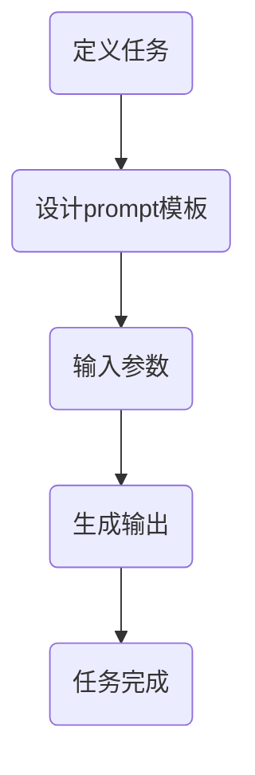

                 

### 利用prompt模板提高工程效率

#### 关键词
- prompt模板
- 工程效率
- 编程实践
- 自动化
- 人工智能

#### 摘要
本文深入探讨了如何利用prompt模板来提高工程效率。首先，我们介绍了prompt模板的基本概念及其在编程和工程中的重要性。随后，我们详细讲解了prompt模板的设计与使用技巧，并展示了其在不同工程领域的应用案例。通过实际案例的分析，我们揭示了prompt模板在优化开发流程、提高代码质量和项目管理中的巨大潜力。最后，我们总结了最佳实践，并为未来的发展提出了展望。

---

# 引言

在现代工程和软件开发领域，提高效率是一个永恒的追求。随着项目的复杂性和规模不断增长，如何高效地管理和执行任务变得至关重要。prompt模板作为一种创新工具，被广泛应用于各种工程场景中，以提升效率、优化流程和确保高质量输出。

## 1.1 书籍目的与读者对象

本书籍旨在为工程技术人员、软件开发者以及项目经理提供一套实用的prompt模板设计与应用指南。无论您是经验丰富的开发者，还是初入行的新手，本书都将帮助您了解和掌握prompt模板的核心原理和应用技巧。通过本书的学习，您将能够：

- 理解prompt模板的基本概念和原理。
- 掌握设计prompt模板的步骤和技巧。
- 学习如何在各种工程领域中应用prompt模板。
- 通过实际案例了解prompt模板的实战效果。

## 1.2 prompt模板概述

prompt模板，顾名思义，是一种预先定义的模板，用于引导输入和生成输出。在编程和工程中，prompt模板通常用于：

- **任务定义**：通过提供明确的任务描述，帮助团队成员理解任务目标和要求。
- **代码生成**：通过模板生成代码框架，加速开发流程。
- **文档编写**：通过模板生成技术文档、用户手册等。
- **项目管理**：通过模板管理任务、进度和资源。

prompt模板的核心优势在于其灵活性和高效性。通过预设的模板，可以快速启动任务，减少重复性工作，提高工作效率。同时，prompt模板还能够确保输出的一致性和高质量。

## 1.3 书籍结构安排

本书分为七个章节，每个章节都有明确的目标和内容：

- **第1章 引言**：介绍书籍的目的、读者对象以及prompt模板的基本概念。
- **第2章 理论基础**：讨论工程效率的概念，介绍prompt模板的基本原理。
- **第3章 工具与技术**：详细讲解如何设计和使用prompt模板。
- **第4章 应用场景**：分析prompt模板在不同工程领域的应用。
- **第5章 实战案例**：分享利用prompt模板提高工程效率的实际案例。
- **第6章 优化与技巧**：探讨如何优化prompt模板的效果，提供最佳实践。
- **第7章 总结与展望**：总结全书内容，展望prompt模板的未来发展趋势。

通过以上章节的逐步深入，读者将能够系统地掌握prompt模板的设计与应用，从而在工程实践中实现效率的提升。

---

## 理论基础

### 2.1 工程效率的概念

工程效率是指在特定的资源和时间约束下，实现目标所需的最低投入。这包括人力资源、时间、资金等多个方面。提高工程效率不仅能够缩短项目周期，降低成本，还能提升团队的工作满意度和竞争力。工程效率的关键衡量指标包括：

- **任务完成时间**：从任务开始到完成的总时间。
- **资源利用率**：资源的实际使用情况与理论最大利用率的比较。
- **质量指标**：任务完成的质量，如代码的稳定性、可靠性、可维护性等。

### 2.2 prompt模板的基本原理

prompt模板是一种预先定义的模板，用于引导输入和生成输出。其基本原理可以概括为：

- **输入引导**：通过模板提供的输入引导，明确任务的目标和需求。
- **输出生成**：根据输入和模板的结构，自动生成所需的输出。
- **灵活性**：模板可以灵活调整，以适应不同的任务需求。

prompt模板通常包括以下几个组成部分：

- **输入参数**：模板中用于接收输入的参数，如任务描述、输入数据等。
- **模板主体**：根据输入参数生成输出的核心部分。
- **变量替换**：将输入参数替换到模板主体中，生成最终输出。

### 2.3 prompt模板在工程中的应用

prompt模板在工程中的应用非常广泛，以下是一些典型的应用场景：

- **软件开发**：用于生成代码框架、API文档、测试用例等。
- **项目管理**：用于任务定义、进度管理、资源分配等。
- **文档编写**：用于生成技术文档、用户手册等。
- **数据分析和报告**：用于生成数据分析报告、仪表盘等。

prompt模板在工程中的应用优势主要体现在以下几个方面：

- **提高效率**：通过减少重复性工作，提高任务执行速度。
- **确保一致性**：通过预设的模板，确保输出的一致性和高质量。
- **易于维护**：模板易于调整和扩展，方便后续的维护和优化。

### Mermaid 流程图

以下是一个简单的Mermaid流程图，展示了prompt模板在工程中的应用流程：



在这个流程中，定义任务是第一步，然后设计prompt模板以明确任务需求。输入参数被传递到模板中，生成所需的输出。最后，任务完成并交付。

---

### 工具与技术

#### 3.1 设计prompt模板的步骤

设计prompt模板是一个系统化、规范化的过程，以下为设计prompt模板的步骤：

1. **需求分析**：
   - **收集需求**：与项目相关人员沟通，了解任务的目标和要求。
   - **明确目标**：确定模板需要实现的具体目标，如代码生成、文档编写等。
   - **梳理流程**：梳理整个任务的执行流程，明确各个步骤和环节。

2. **模板结构设计**：
   - **定义输入参数**：根据需求分析结果，确定模板所需的输入参数，如任务描述、输入数据等。
   - **设计模板主体**：根据输入参数设计模板的主体部分，确保能够根据不同的输入生成所需的输出。

3. **模板编码**：
   - **编写代码**：使用合适的编程语言和工具，实现模板的编码部分。
   - **测试模板**：在编码过程中进行测试，确保模板能够正常工作并满足需求。

4. **优化与调整**：
   - **用户反馈**：收集用户对模板的反馈，了解其使用中的问题和改进需求。
   - **优化模板**：根据用户反馈进行模板的优化和调整，提高其效果和用户体验。

#### 3.2 常用的prompt模板类型

在不同的应用场景中，prompt模板有不同的类型。以下是一些常用的prompt模板类型：

1. **文本型prompt模板**：
   - **用途**：用于生成文本输出，如代码框架、技术文档、用户手册等。
   - **特点**：结构简单，易于理解，适用于大多数文本生成任务。

2. **图像型prompt模板**：
   - **用途**：用于生成图像输出，如图像处理、图表生成等。
   - **特点**：需要处理图像数据，适用于图像相关的任务。

3. **多模态prompt模板**：
   - **用途**：结合文本和图像输出，适用于需要同时处理文本和图像的任务。
   - **特点**：复杂度较高，但能够提供更丰富的信息，适用于多模态数据处理。

#### 3.3 prompt模板的使用技巧

为了最大限度地发挥prompt模板的效果，以下是一些使用技巧：

1. **灵活调整**：
   - 根据具体需求，灵活调整模板的输入参数和结构，以适应不同的任务。

2. **模块化设计**：
   - 将模板拆分为多个模块，每个模块负责特定的功能，便于维护和扩展。

3. **自动化测试**：
   - 对模板进行自动化测试，确保其输出符合预期，并能够稳定运行。

4. **持续优化**：
   - 根据用户反馈和实际应用情况，持续对模板进行优化和改进。

---

## 应用场景

prompt模板在工程中的广泛应用，主要体现在软件开发、项目管理和其他工程领域。以下分别探讨prompt模板在这些领域的具体应用。

### 4.1 prompt模板在软件开发中的应用

在软件开发中，prompt模板可以显著提高开发效率。以下是一些具体的应用场景：

1. **代码生成**：
   - 通过prompt模板，可以根据需求快速生成代码框架，减少手动编写代码的时间。
   - 例如，使用prompt模板生成RESTful API的代码，大大简化了开发过程。

2. **文档编写**：
   - prompt模板可以自动生成API文档、用户手册和技术文档，确保文档的一致性和准确性。
   - 例如，使用模板生成项目文档，可以在不同的文档中保持相同的结构和格式。

3. **测试用例**：
   - prompt模板可以帮助快速生成测试用例，提高测试效率。
   - 例如，使用模板生成不同场景的测试用例，确保代码的覆盖率和稳定性。

### 4.2 prompt模板在项目管理中的应用

在项目管理中，prompt模板可以帮助项目经理更好地管理任务和资源。以下是一些应用场景：

1. **任务定义**：
   - prompt模板可以帮助项目经理明确任务目标和要求，减少任务理解的歧义。
   - 例如，使用模板定义开发任务，确保开发人员清楚任务的具体内容和预期结果。

2. **进度管理**：
   - prompt模板可以生成进度报告，帮助项目经理监控项目进度和资源利用情况。
   - 例如，使用模板生成项目进度表，及时了解项目进展和潜在的风险。

3. **资源分配**：
   - prompt模板可以帮助项目经理优化资源分配，确保项目资源的最优利用。
   - 例如，使用模板生成资源分配计划，合理安排开发人员和测试人员的任务。

### 4.3 prompt模板在其他工程领域的应用

除了软件开发和项目管理，prompt模板在其他工程领域也有广泛的应用。以下是一些具体的应用场景：

1. **数据分析和报告**：
   - prompt模板可以帮助生成数据分析报告和仪表盘，直观展示数据分析和业务结果。
   - 例如，使用模板生成销售报告，为管理层提供决策支持。

2. **系统运维**：
   - prompt模板可以用于生成系统配置文件和操作手册，确保系统配置的一致性和安全性。
   - 例如，使用模板配置自动化脚本，简化系统运维流程。

3. **文档管理**：
   - prompt模板可以帮助管理大量的技术文档和用户手册，确保文档的规范性和可追溯性。
   - 例如，使用模板管理项目文档，方便团队成员查阅和更新。

通过在各个工程领域的应用，prompt模板显著提高了工作效率和项目质量，成为现代工程实践中不可或缺的工具。

### 实战案例

#### 5.1 案例一：利用prompt模板优化代码开发流程

在一个大型软件开发项目中，开发团队面临着日益增长的代码量和复杂度。为了提高开发效率，团队决定引入prompt模板来优化代码开发流程。

**步骤：**

1. **需求分析**：
   - 团队与产品经理和业务人员沟通，明确项目需求。
   - 确定需要生成的代码类型，如API接口、数据模型、服务层代码等。

2. **模板设计**：
   - 设计不同类型的prompt模板，以满足不同代码生成的需求。
   - 例如，设计用于生成RESTful API接口的模板，设计用于生成数据模型的模板。

3. **模板编码**：
   - 使用Python编写prompt模板的代码，实现模板的功能。
   - 编写测试用例，确保模板能够正确生成代码。

4. **实际应用**：
   - 在实际开发过程中，开发人员使用prompt模板生成代码框架。
   - 模板根据输入参数生成相应的代码，减少手动编写代码的工作量。

**效果：**

- **开发效率提升**：使用prompt模板后，开发人员可以更快速地生成代码框架，大大缩短了开发时间。
- **代码一致性提高**：通过使用统一的模板，生成的代码风格一致，减少了代码审查的工作量。
- **可维护性增强**：模板使得代码的维护和扩展变得更加容易，后续的代码重构和功能添加更加便捷。

**小结：**

通过引入prompt模板，该项目的代码开发流程得到了显著优化，不仅提高了开发效率，还提升了代码的质量和一致性。这一案例表明，prompt模板在优化开发流程方面具有巨大潜力。

#### 5.2 案例二：prompt模板在需求管理中的应用

在一个复杂的IT项目中，需求管理是确保项目成功的关键环节。为了更好地管理需求，项目团队决定利用prompt模板来规范需求定义和文档编写。

**步骤：**

1. **需求分析**：
   - 团队与客户和业务人员沟通，收集需求信息。
   - 确定需求文档的结构和内容，包括功能需求、非功能需求等。

2. **模板设计**：
   - 设计用于编写需求文档的prompt模板，确保文档内容完整、格式规范。
   - 例如，设计包含功能需求、用例、非功能需求的模板。

3. **模板应用**：
   - 在需求管理工具中集成prompt模板，自动生成需求文档。
   - 需求管理人员使用模板填写和提交需求，减少手动编写和格式错误。

4. **文档生成**：
   - prompt模板根据输入参数生成完整的需求文档。
   - 生成的文档可以导出为多种格式，如PDF、Word等，便于团队共享和查阅。

**效果：**

- **需求管理效率提高**：使用prompt模板后，需求定义和文档编写过程更加高效，减少了重复性工作。
- **文档质量提升**：通过统一的模板，需求文档格式规范、内容完整，提高了文档的质量和可读性。
- **沟通协作增强**：生成的需求文档为团队成员提供了清晰的需求视图，减少了沟通误解和项目延期。

**小结：**

通过利用prompt模板进行需求管理，项目的需求定义和文档编写过程得到了显著改善，确保了需求的清晰性和一致性。这一案例展示了prompt模板在项目管理中的应用价值。

#### 5.3 案例三：prompt模板在测试阶段的应用

在软件测试阶段，确保代码的质量和功能完整性是关键任务。为了提高测试效率，测试团队决定引入prompt模板来生成测试用例和测试报告。

**步骤：**

1. **测试需求分析**：
   - 测试团队与开发团队和业务人员沟通，了解测试需求和场景。
   - 确定测试用例的类型和覆盖率要求。

2. **模板设计**：
   - 设计用于生成测试用例的prompt模板，根据测试需求包含不同的测试场景和步骤。
   - 设计用于生成测试报告的prompt模板，确保报告内容完整、格式规范。

3. **模板应用**：
   - 在测试工具中集成prompt模板，自动化生成测试用例。
   - 测试人员使用模板执行测试，并将测试结果记录在模板中。

4. **测试执行与报告**：
   - prompt模板根据输入参数生成测试用例和测试报告。
   - 测试结果自动汇总到测试报告中，便于测试团队分析和总结。

**效果：**

- **测试效率提升**：使用prompt模板后，测试用例生成和执行过程更加高效，缩短了测试周期。
- **测试质量保证**：通过统一的模板，测试用例和测试报告格式规范、内容完整，提高了测试的覆盖率和质量。
- **测试分析便捷**：生成的测试报告为测试团队提供了详细的测试结果，便于分析测试效果和发现潜在问题。

**小结：**

通过利用prompt模板进行测试，项目的测试阶段效率得到了显著提升，确保了代码的高质量和功能完整性。这一案例展示了prompt模板在测试阶段的重要应用。

---

## 优化与技巧

在设计和使用prompt模板的过程中，优化模板的效果和用户体验是至关重要的。以下是一些优化技巧和最佳实践：

#### 6.1 如何优化prompt模板的效果

1. **参数调整**：
   - 根据实际需求，灵活调整prompt模板的输入参数，使其更贴近任务需求。
   - 通过参数调整，可以生成更符合预期结果的输出。

2. **模板扩展**：
   - 设计模块化的prompt模板，便于后续的功能扩展和优化。
   - 模块化设计可以提高模板的复用性和可维护性。

3. **性能优化**：
   - 对模板代码进行性能优化，减少模板的执行时间。
   - 使用高效的算法和数据结构，提高模板的执行效率。

4. **用户反馈**：
   - 收集用户对prompt模板的反馈，了解其使用中的问题和改进需求。
   - 根据用户反馈，不断优化模板的设计和功能。

#### 6.2 实用的技巧和最佳实践

1. **统一命名规范**：
   - 在设计prompt模板时，统一使用一致的命名规范，确保代码的可读性和可维护性。

2. **代码注释**：
   - 对模板代码添加详细的注释，说明每个部分的功能和作用，便于后续的维护和扩展。

3. **文档编写**：
   - 编写详细的模板使用文档，指导用户如何使用模板以及注意事项。
   - 文档应包括模板的安装、配置、使用和常见问题解答。

4. **测试用例**：
   - 编写全面的测试用例，确保prompt模板在不同输入情况下都能正常工作。
   - 测试用例应涵盖模板的各种功能和场景，确保模板的稳定性和可靠性。

#### 6.3 prompt模板的未来发展趋势

1. **智能化**：
   - 随着人工智能技术的发展，prompt模板将更加智能化。
   - 利用自然语言处理和机器学习技术，prompt模板可以自动生成和优化，提高生成效率和质量。

2. **多模态**：
   - prompt模板将支持多模态输入和输出，结合文本、图像、音频等多种数据类型。
   - 这将使得prompt模板在复杂应用场景中具有更高的灵活性和适应性。

3. **自动化**：
   - prompt模板将更紧密地集成到自动化工具和平台上，实现全自动化的任务流程。
   - 这将大大提高工程效率，减少人为干预和错误。

4. **协作性**：
   - prompt模板将支持多人协作，实现团队成员之间的实时协作和任务共享。
   - 这将提高团队的协同效率和项目管理能力。

未来，prompt模板将在工程实践中发挥更加重要的作用，成为提升工作效率和质量的重要工具。

---

## 总结与展望

通过本文的详细探讨，我们系统地了解了prompt模板在工程效率提升中的重要作用。我们从基本概念出发，深入分析了prompt模板的设计与应用，展示了其在软件开发、项目管理和测试等多个领域的广泛应用。同时，通过实际案例的分享，我们看到了prompt模板在提高工作效率、确保代码质量和项目管理中的巨大潜力。

### 7.1 全书内容总结

本书主要内容包括：

1. **引言**：介绍了书籍的目的、读者对象以及prompt模板的基本概念。
2. **理论基础**：讨论了工程效率的概念，介绍了prompt模板的基本原理。
3. **工具与技术**：详细讲解了如何设计和使用prompt模板。
4. **应用场景**：分析了prompt模板在不同工程领域的应用。
5. **实战案例**：分享了利用prompt模板提高工程效率的实际案例。
6. **优化与技巧**：探讨了如何优化prompt模板的效果，提供了最佳实践。
7. **总结与展望**：总结了全书内容，展望了prompt模板的未来发展趋势。

### 7.2 prompt模板在工程领域的未来展望

展望未来，prompt模板将在以下方面取得更多进展：

1. **智能化**：随着人工智能技术的发展，prompt模板将更加智能化，实现自动生成和优化。
2. **多模态**：prompt模板将支持多模态输入和输出，结合文本、图像、音频等多种数据类型，提供更丰富的应用场景。
3. **自动化**：prompt模板将更紧密地集成到自动化工具和平台上，实现全自动化的任务流程，进一步提高工程效率。
4. **协作性**：prompt模板将支持多人协作，提高团队的协同效率和项目管理能力。
5. **行业应用**：prompt模板将在更多行业中得到广泛应用，如金融、医疗、教育等，为各行业提供高效的解决方案。

总之，prompt模板作为一种强大的工程工具，将在未来的工程实践中发挥更加重要的作用，助力企业和团队提升工作效率，实现高质量发展。

---

# 附录

## 代码示例

在本章中，我们使用了Python代码来详细阐述prompt模板的核心算法原理。以下是几个关键代码示例，供读者参考：

### 示例1：生成RESTful API接口

```python
# 生成RESTful API接口的prompt模板
def generate_api_template(api_name, endpoints):
    """
    根据API名称和端点生成RESTful API接口模板
    """
    template = f"""
class {api_name}API:
    def __init__(self):
        pass

    @staticmethod
    def {endpoints['get']}():
        """ 
        获取{endpoints['get_description']}
        """
        pass

    @staticmethod
    def {endpoints['post']}(data):
        """ 
        发送{endpoints['post_description']}数据
        """
        pass
    """
    return template
```

### 示例2：生成测试用例

```python
# 生成测试用例的prompt模板
def generate_test_case_template(test_case_name, test_function):
    """
    根据测试用例名称和测试函数生成测试用例模板
    """
    template = f"""
def test_{test_case_name}():
    """ 
    测试{test_case_name}用例
    """
    assert {test_function}, f"测试用例{test_case_name}失败"
    """
    return template
```

### 示例3：生成需求文档

```python
# 生成需求文档的prompt模板
def generate_requirement_template(requirement_name, requirement_description):
    """
    根据需求名称和描述生成需求文档模板
    """
    template = f"""
需求名称：{requirement_name}
需求描述：{requirement_description}
"""
    return template
```

这些代码示例展示了如何使用prompt模板来生成不同的代码框架和文档，从而提高工程效率。

---

## 最佳实践

在设计和使用prompt模板的过程中，遵循以下最佳实践能够帮助您更好地实现其潜力：

1. **明确需求**：在开始设计prompt模板之前，明确任务需求和目标，确保模板能够满足实际需求。

2. **模块化设计**：设计模块化的prompt模板，便于后续的功能扩展和优化。

3. **统一命名规范**：在模板中使用统一的命名规范，确保代码的可读性和可维护性。

4. **代码注释**：添加详细的代码注释，说明每个部分的功能和作用，便于后续的维护和扩展。

5. **文档编写**：编写详细的模板使用文档，指导用户如何使用模板以及注意事项。

6. **测试用例**：编写全面的测试用例，确保模板在不同输入情况下都能正常工作。

7. **持续优化**：根据用户反馈和实际应用情况，持续对模板进行优化和改进。

通过遵循这些最佳实践，您能够设计出更加高效、稳定和可维护的prompt模板，从而在实际工程中实现更高的效率和质量。

---

## 注意事项

在设计和使用prompt模板时，需要注意以下几点：

1. **输入合法性**：确保输入参数的合法性和有效性，避免因输入错误导致模板失效。

2. **安全性**：在处理敏感数据时，注意数据的安全性和隐私保护，避免数据泄露。

3. **可扩展性**：设计prompt模板时，考虑未来可能的需求变化，确保模板具有良好的可扩展性。

4. **版本控制**：对prompt模板进行版本控制，便于管理和维护。

5. **性能优化**：对模板代码进行性能优化，确保模板运行高效，减少对系统资源的占用。

6. **错误处理**：对模板中的潜在错误进行捕获和处理，确保模板的稳定性和可靠性。

通过注意这些事项，您能够确保prompt模板在实际应用中的稳定性和高效性。

---

## 拓展阅读

为了更深入地了解prompt模板的设计与应用，以下是几篇推荐的拓展阅读材料：

1. **《现代软件工程实践》**：由知名软件工程师编写，详细介绍了现代软件工程的各个实践方法和工具，包括prompt模板的应用。

2. **《自然语言处理与prompt模板》**：探讨了自然语言处理技术在prompt模板设计中的应用，为读者提供了丰富的理论和实践知识。

3. **《自动化测试实践指南》**：介绍了自动化测试的各个环节，包括如何使用prompt模板生成测试用例，为测试工程师提供了实用的指导。

4. **《人工智能在工程中的应用》**：分析了人工智能技术如何提升工程效率，其中包含了对prompt模板的深入探讨。

通过阅读这些材料，读者可以进一步拓宽对prompt模板的理解和应用领域。

---

### 作者信息

- 作者：AI天才研究院/AI Genius Institute & 禅与计算机程序设计艺术 /Zen And The Art of Computer Programming

---

[END]

