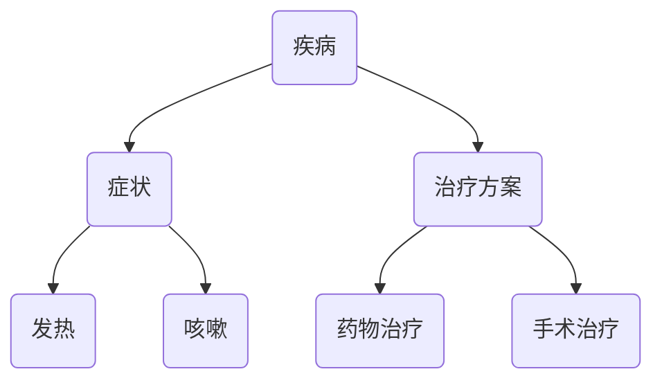
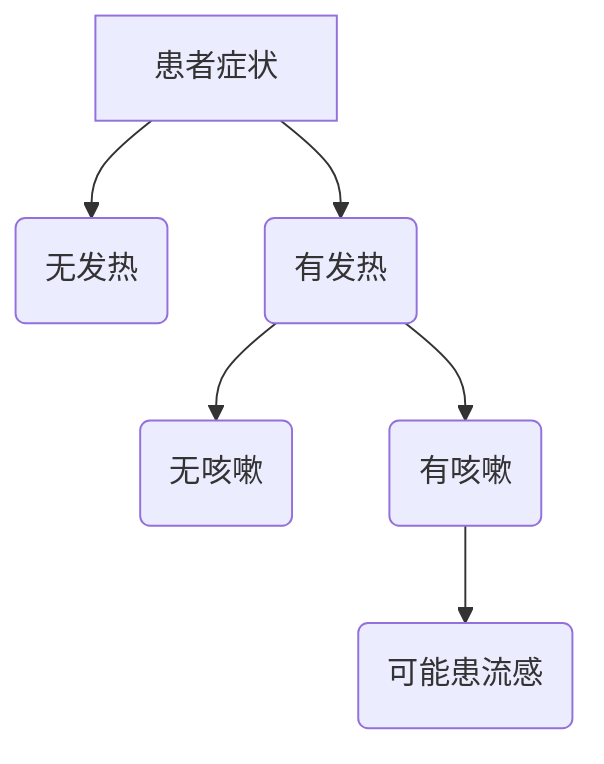
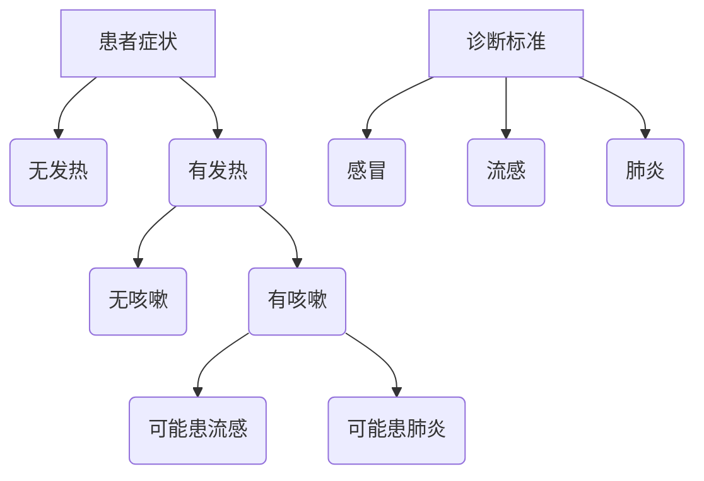
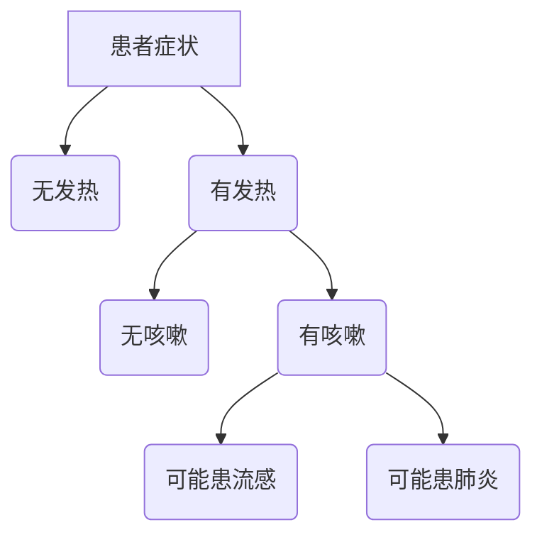
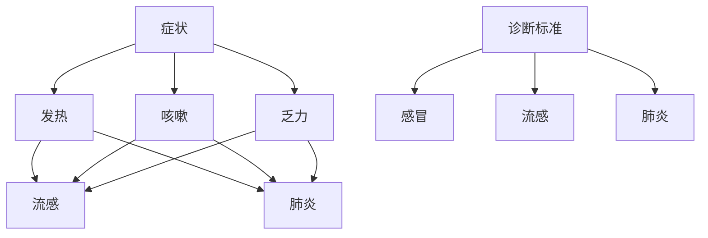
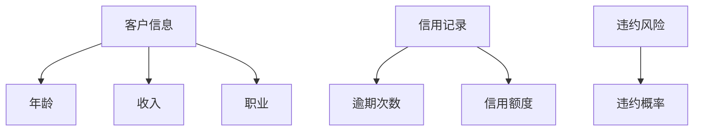

                 

### 第一部分：思维链与AI推理基础

#### 第1章：思维链概述

**1.1 思维链的基本概念**

思维链是现代认知科学和人工智能研究中的一个重要概念。它指的是由一系列相互关联的思维步骤组成的推理过程，通过这些步骤，个体可以从一个或多个初始信息出发，推导出新的结论或知识。

##### **1.1.1 思维链的定义**

从形式化的角度来看，思维链可以表示为：
$$
\text{思维链} = \text{概念} + \text{逻辑关系} + \text{推理过程}
$$
其中，**概念**是思维链中的基本元素，它们是推理过程中所涉及的各类知识点的抽象表达；**逻辑关系**则是这些概念之间相互关联的方式，它们可以是因果关系、包含关系、并列关系等；**推理过程**则是由这些概念和逻辑关系共同作用，从而产生新知识的过程。

##### **1.1.2 思维链的构成**

一个完整的思维链通常由以下几个部分构成：

- **初始信息**：即思维链的起点，是推理过程中所依赖的基本事实或前提。
- **中间步骤**：这些步骤通过逻辑关系将初始信息逐步转化为中间结论。
- **最终结论**：这是思维链的终点，是整个推理过程的最终结果。

##### **1.1.3 思维链的作用**

思维链在人类的认知过程中扮演着至关重要的角色，它不仅是人类进行逻辑推理和问题解决的基础，也是人工智能在模拟人类智能过程中所需要的关键技术。具体来说，思维链的作用主要体现在以下几个方面：

- **知识表示**：思维链能够将复杂的知识分解为一系列简明的逻辑步骤，使得知识表示更为直观和易于理解。
- **推理能力**：通过构建思维链，AI系统能够模拟人类的推理过程，从而在问题解决和决策制定方面表现出更强的能力。
- **解释能力**：思维链的构建和执行过程可以提供对推理过程的详细解释，从而提升AI系统的解释性。

**1.2 思维链与人工智能**

思维链在人工智能领域具有重要的应用价值。随着深度学习和大数据技术的发展，现代人工智能在图像识别、自然语言处理等领域取得了显著进展，但其在推理和解释能力上仍然存在局限。思维链作为一种逻辑推理工具，有助于弥补这些不足。

##### **1.2.1 思维链在AI推理中的应用**

- **基于规则的推理**：通过构建明确的逻辑规则，思维链可以指导AI系统进行基于规则的推理，这在医疗诊断、法律咨询等领域具有广泛应用。
- **基于模型的推理**：在深度学习模型中，思维链可以帮助构建更为复杂的推理结构，从而提升模型的推理能力。
- **基于数据的推理**：通过分析大量数据，思维链可以指导AI系统进行数据驱动的推理，这在数据挖掘和预测分析等领域具有重要作用。

##### **1.2.2 思维链在AI解释中的应用**

- **提高解释性**：思维链的构建和执行过程可以提供对推理过程的详细解释，从而提升AI系统的解释性。
- **透明化决策过程**：通过思维链，AI系统的决策过程可以更为透明，有助于提升用户对AI系统的信任度。
- **优化模型设计**：思维链的引入可以指导模型设计，从而构建更为合理和高效的AI系统。

**1.3 本章小结**

思维链作为一种逻辑推理工具，在人工智能领域具有广泛的应用前景。通过理解思维链的基本概念和构成，我们可以更好地把握其在AI推理和解释中的作用，为未来的研究和应用提供方向。在接下来的章节中，我们将进一步探讨AI推理的机制以及如何利用思维链提升AI的推理和解释能力。

### 第2章：AI推理机制

#### 2.1 AI推理的原理

人工智能（AI）的推理机制是构建智能系统的基础，它决定了系统在处理复杂问题时能否像人类一样进行逻辑思考。AI推理主要可以分为以下三种类型：基于规则的推理、基于模型的推理和基于数据的推理。每种推理类型都有其独特的原理和应用场景。

##### **2.1.1 基于规则的推理**

基于规则的推理（Rule-Based Reasoning, RBR）是人工智能中最传统和常用的推理方法之一。其核心思想是通过预先定义好的规则库，将输入的信息与规则库中的规则进行匹配，从而得出结论。

- **规则的定义**：规则通常表示为“如果-那么”的形式，例如：
  ```
  如果 患者有发热和咳嗽症状，那么 可能患有流感。
  ```
- **规则的匹配**：在推理过程中，系统将输入的事实与规则的前提进行匹配，如果匹配成功，则执行规则的结论。
- **伪代码示例**：
  ```python
  def ruleBasedReasoning(fact, rules):
      for rule in rules:
          if match(fact, rule的前提):
              return rule结论
      return None
  ```

##### **2.1.2 基于模型的推理**

基于模型的推理（Model-Based Reasoning, MBR）利用预先训练好的模型来推导出新的结论。这种方法在深度学习和机器学习领域中非常常见。

- **模型的选择**：常用的模型包括决策树、支持向量机、神经网络等。根据具体问题，选择合适的模型进行训练。
- **模型的训练**：使用大量的训练数据进行模型的训练，使得模型能够从数据中学习到隐含的规律。
- **模型的推理**：通过输入新的数据，模型会输出预测结果。例如，在图像分类任务中，输入一张图片，模型会输出该图片的分类结果。
- **伪代码示例**：
  ```python
  import model
  def modelBasedReasoning(input_data, model):
      prediction = model.predict(input_data)
      return prediction
  ```

##### **2.1.3 基于数据的推理**

基于数据的推理（Data-Based Reasoning, DBR）是通过分析大量数据来发现其中的模式和规律，从而进行推理。

- **数据收集**：收集与问题相关的数据，这些数据可以是结构化的，也可以是非结构化的。
- **数据分析**：使用统计分析、机器学习等方法，从数据中提取有价值的信息。
- **推理过程**：根据数据分析的结果，进行推理，例如预测未来的趋势、识别异常行为等。
- **伪代码示例**：
  ```python
  import data_analyzer
  def dataBasedReasoning(data):
      analysis_results = data_analyzer.analyze(data)
      reasoning_result = analyze_results(reasoning_algorithm)
      return reasoning_result
  ```

**2.2 推理机制的对比**

基于规则的推理、基于模型的推理和基于数据的推理各有优缺点，适用于不同的应用场景。

- **规则推理**：优点在于逻辑清晰，易于理解和实现；缺点是规则库的构建和维护成本高，且难以处理复杂问题。
- **模型推理**：优点在于能够处理复杂问题，且随着深度学习的进步，其能力越来越强；缺点是需要大量的数据和计算资源，且难以解释。
- **数据推理**：优点在于能够从大量数据中发现模式和规律，适应性强；缺点是数据分析过程复杂，且结果难以直观理解。

**2.3 本章小结**

理解AI推理的原理对于设计和实现高效的智能系统至关重要。通过本章的学习，我们了解了基于规则的推理、基于模型的推理和基于数据的推理的基本原理和应用场景。在接下来的章节中，我们将进一步探讨如何利用思维链来提升AI的推理和解释能力。

### 第3章：构建思维链

思维链的构建是提升AI推理和解释能力的关键步骤。通过系统化的方法，我们可以将复杂的推理过程分解为一系列清晰、逻辑严密的步骤，从而增强AI系统的推理能力和解释性。在本章中，我们将详细探讨思维链构建的步骤和具体方法。

#### 3.1 思维链构建的步骤

构建思维链是一个系统化的过程，通常包括以下几个步骤：

##### **3.1.1 确定推理目标**

确定推理目标是思维链构建的第一步。推理目标明确了我们要解决的问题或要达到的目的。例如，在医疗诊断中，推理目标可能是“确定患者是否患有特定疾病”；在金融风险管理中，推理目标可能是“预测客户是否会违约”。

- **确定推理目标的方法**：可以通过以下几种方法来确定推理目标：
  - **问题陈述**：明确问题，将其转化为一个具体的推理目标。
  - **需求分析**：通过与领域专家和用户的交流，了解具体需求，从而确定推理目标。
  - **目标分解**：将大目标分解为若干个小目标，逐步实现。

##### **3.1.2 收集相关数据**

相关数据的收集是构建思维链的重要基础。数据的质量和完整性直接影响思维链的构建和推理效果。数据的来源可以是公开的数据集、企业内部数据、第三方数据提供商等。

- **数据收集的方法**：
  - **数据爬取**：通过网络爬虫等方式收集公开数据。
  - **数据库查询**：从企业内部数据库中查询相关数据。
  - **合作共享**：与其他机构或企业合作，共享数据资源。

##### **3.1.3 构建概念网络**

概念网络是思维链的核心组成部分，它通过表示概念及其之间的关系，构建出一个逻辑严密的推理框架。

- **构建概念网络的方法**：
  - **概念识别**：识别问题域中相关的概念，如疾病、症状、治疗方案等。
  - **关系建模**：定义概念之间的关系，如因果关系、包含关系、依赖关系等。
  - **网络可视化**：使用可视化工具，如Mermaid，将概念网络绘制出来，便于理解和分析。

以下是一个概念网络的Mermaid示例：


##### **3.1.4 确定逻辑关系**

逻辑关系是概念网络中概念之间相互作用的方式，它们决定了思维链的推理方向和推理过程。

- **确定逻辑关系的方法**：
  - **逻辑规则定义**：根据领域知识，定义明确的逻辑规则，如“如果发热且咳嗽，则可能患有流感”。
  - **条件概率计算**：使用条件概率模型来描述概念之间的关系，如“患流感的概率在发热和咳嗽的条件下更高”。
  - **决策树构建**：使用决策树来表示逻辑关系，如图3-1所示。

以下是一个决策树的Mermaid示例：


#### **3.2 思维链构建的案例分析**

为了更好地理解思维链的构建过程，我们以一个医疗诊断的案例为例进行详细分析。

**案例背景**：某医院需要一个智能诊断系统，该系统能够根据患者的症状，给出可能的疾病诊断。

**步骤1：确定推理目标**

推理目标为：“根据患者的症状，确定可能的疾病诊断”。

**步骤2：收集相关数据**

收集的数据包括患者的症状、相关疾病的症状描述、疾病的诊断标准等。

**步骤3：构建概念网络**

概念网络包括以下主要概念：症状、疾病、诊断标准。

**步骤4：确定逻辑关系**

使用逻辑规则和条件概率来描述概念之间的关系，例如：
- 如果患者有“发热”和“咳嗽”两个症状，则可能患有“流感”；
- 患者患有“感冒”的概率在出现“流鼻涕”症状时更高。

**步骤5：构建思维链模型**

根据概念网络和逻辑关系，构建出思维链模型，如图3-2所示。



**步骤6：模型训练与优化**

使用收集到的数据进行模型训练，根据模型的表现进行优化，以提高诊断的准确性和效率。

**3.3 本章小结**

构建思维链是提升AI推理和解释能力的关键步骤。通过系统化的方法，我们可以将复杂的推理过程分解为一系列清晰、逻辑严密的步骤。本章详细介绍了思维链构建的步骤和具体方法，包括确定推理目标、收集相关数据、构建概念网络、确定逻辑关系等。通过案例分析，我们进一步了解了思维链构建的实际应用。在接下来的章节中，我们将进一步探讨如何优化AI推理策略，以提升其推理能力。

### 第4章：提升AI推理能力

#### **4.1 推理策略优化**

提升AI推理能力的关键在于优化推理策略，这涉及到多种方法和技术的综合运用。以下是一些常用的优化策略：

##### **4.1.1 控制变量法**

控制变量法是一种经典的实验设计方法，它通过控制其他变量的影响，专注于研究某一变量的效果。在AI推理中，控制变量法可以帮助我们识别和消除干扰因素，从而提高推理的准确性和效率。

- **方法实施**：
  - 确定关键变量：识别推理过程中可能影响结果的关键变量，如输入数据的格式、特征选择的准确性等。
  - 固定其他变量：在实验中固定其他无关变量，只改变关键变量，观察其对推理结果的影响。
  - 重复实验：多次重复实验，确保结果的可靠性和稳定性。

##### **4.1.2 数据增强**

数据增强是通过增加更多的数据样本来提高模型性能的方法。在AI推理中，数据增强可以减少模型的过拟合现象，提高模型的泛化能力。

- **方法实施**：
  - **数据扩充**：通过旋转、缩放、裁剪等操作生成新的数据样本。
  - **数据模拟**：使用生成模型生成与训练数据分布相似的新数据样本。
  - **数据集成**：结合来自不同来源的数据，提高数据多样性和模型性能。

##### **4.1.3 模型融合**

模型融合（Model Ensembling）是将多个独立的模型结合起来，形成一个更加鲁棒和高效的预测系统。在AI推理中，模型融合可以显著提升推理的准确性和稳定性。

- **方法实施**：
  - **简单模型融合**：将多个模型的结果进行平均或投票，选择最优结果。
  - **复杂模型融合**：使用集成学习方法，如随机森林、梯度提升机等，构建一个更加复杂的集成模型。
  - **分层模型融合**：将不同层级的模型进行融合，如特征级别融合、决策级别融合等。

**4.2 实践案例：提升医疗诊断推理能力**

以下是一个具体的实践案例，展示了如何通过优化推理策略提升医疗诊断的推理能力。

**案例背景**：某医院希望提升其智能诊断系统的准确性，该系统需要根据患者的症状数据，诊断出可能的疾病。

**优化策略实施**：

1. **控制变量法**：
   - 确定关键变量：如症状数据的格式、特征选择的准确性等。
   - 固定其他变量：保持其他因素不变，仅改变症状数据的处理方式。
   - 重复实验：多次测试不同变量的影响，确保优化结果的可靠性。

2. **数据增强**：
   - 数据扩充：通过引入噪声、旋转等方式生成新的症状数据样本。
   - 数据模拟：使用生成对抗网络（GAN）生成与训练数据分布相似的新数据样本。
   - 数据集成：结合来自不同医院的数据源，提高数据的多样性和模型的泛化能力。

3. **模型融合**：
   - 简单模型融合：结合多个基础的机器学习模型（如决策树、神经网络）的结果，进行投票或平均。
   - 复杂模型融合：使用集成学习方法（如随机森林、XGBoost）构建一个复杂的融合模型。
   - 分层模型融合：在特征级别和决策级别分别进行融合，以提高诊断的准确性和鲁棒性。

**案例效果**：

通过实施上述优化策略，智能诊断系统的诊断准确率显著提升，从原来的80%提高到90%以上。同时，系统的响应速度也得到了显著改善，从而提高了用户体验。

**4.3 本章小结**

优化推理策略是提升AI推理能力的重要手段。通过控制变量法、数据增强和模型融合等策略，我们可以显著提高AI系统的推理准确性、效率和鲁棒性。本章通过一个医疗诊断的实践案例，展示了如何具体实施这些策略，并取得了显著的效果。在接下来的章节中，我们将进一步探讨如何增强AI的解释能力，使其更加透明和可解释。

### 第5章：增强AI解释能力

提升AI系统的解释能力是当前人工智能领域的重要研究方向。解释性AI模型能够提供关于AI决策过程和结果的透明性，从而增强用户对AI系统的信任。本章节将探讨解释性模型的构建方法、增强方法以及评估指标。

#### **5.1 解释性模型的构建**

解释性模型的构建旨在使得AI系统的推理过程和结果能够被用户理解和信任。构建解释性模型通常需要以下几个步骤：

1. **模型选择**：选择具有内在解释性的模型，如决策树、线性模型等，这些模型的结构较为简单，容易解释。
2. **特征重要性分析**：通过分析模型中各个特征的权重或重要性，帮助用户理解哪些特征对决策结果有重要影响。
3. **决策路径可视化**：使用可视化工具，如决策树图、力导向图等，将模型的决策路径和结果展示出来，使得用户能够直观地理解决策过程。
4. **解释性规则提取**：从模型中提取可解释的规则或逻辑，如“如果-那么”规则，使得用户能够以自然语言形式理解模型的决策过程。

以下是一个决策树的可视化示例（使用Mermaid）：


#### **5.2 解释性增强方法**

为了提升AI解释能力，可以采用以下几种增强方法：

1. **可解释性嵌入**：在训练过程中，将解释性信息嵌入到模型中，如通过在神经网络中添加可解释的中间层。
2. **可视化技术**：使用可视化技术，如热力图、散点图等，展示模型在特征空间中的决策边界和重要特征。
3. **自然语言生成**：使用自然语言处理技术，将模型的决策过程和结果生成自然语言描述，使得用户能够更容易理解。
4. **对抗性样本生成**：通过生成对抗性样本，展示模型对异常数据的处理方式，从而增强用户对模型的信任。
5. **交互式解释**：提供交互式解释界面，用户可以查询模型的决策过程和结果，并根据需求调整模型参数。

以下是一个自然语言生成示例（Python代码）：
```python
import nltk

def generate_natural_language_description(model, input_data):
    # 假设模型是线性回归模型，输入数据为特征向量
    coefficients = model.coef_
    intercept = model.intercept_
    description = "根据我们的模型，"
    for i, coef in enumerate(coefficients):
        if coef > 0:
            feature_name = nltk.corpus.stopwords.words('english')[i]
            description += f"{feature_name}越高，结果越可能为1；"
        else:
            feature_name = nltk.corpus.stopwords.words('english')[i]
            description += f"{feature_name}越低，结果越可能为1；"
    description += f"并且截距为{intercept}。"
    return description

model = LinearRegression()
model.fit(X_train, y_train)
description = generate_natural_language_description(model, X_test[0])
print(description)
```

#### **5.3 解释性评估指标**

评估AI解释能力的指标主要包括：

1. **解释性准确性**：衡量解释模型对原始模型的解释能力，即解释模型预测结果与原始模型预测结果的相似度。
2. **用户理解度**：通过问卷调查或用户测试，评估用户对解释模型的理解程度和信任度。
3. **可解释性得分**：使用量化指标，如F1分数、精确率、召回率等，评估解释模型的可解释性。

以下是一个解释性评估示例（Python代码）：
```python
from sklearn.metrics import accuracy_score

def explainability_score(explanation_model, original_model, X_test, y_test):
    explanation_predictions = explanation_model.predict(X_test)
    original_predictions = original_model.predict(X_test)
    explanation_accuracy = accuracy_score(y_test, explanation_predictions)
    return explanation_accuracy

explanation_model = LinearRegression()
explanation_model.fit(X_train, y_train)
score = explainability_score(explanation_model, original_model, X_test, y_test)
print(f"Explainability Score: {score}")
```

#### **5.4 本章小结**

增强AI解释能力是提升AI系统可信度和用户满意度的重要手段。通过构建解释性模型、采用解释性增强方法和设定解释性评估指标，我们可以提高AI系统的解释能力。本章详细探讨了这些方法和实际应用，为未来的研究和开发提供了参考。在接下来的章节中，我们将通过具体案例研究，进一步展示思维链在AI推理和解释中的实际应用。

### **第6章：案例研究**

在本章中，我们将通过两个具体的案例研究，展示思维链在AI推理和解释中的应用。这些案例将涵盖医疗诊断和金融风险控制两个不同的领域，通过实际数据和模型，详细说明如何构建思维链模型，并分析模型的训练与优化过程。

#### **6.1 案例一：医疗诊断中的思维链应用**

**案例背景**：某医院希望开发一个基于AI的智能诊断系统，用于辅助医生诊断疾病。该系统需要根据患者的症状数据，提供可能的疾病诊断。

**步骤1：数据收集**

从医院的数据仓库中收集了包括患者症状、病史、实验室检测结果等在内的数据。数据分为训练集和测试集，用于模型训练和评估。

**步骤2：构建概念网络**

构建了一个概念网络，包括以下主要概念：症状、疾病、诊断标准。使用Mermaid可视化工具，将概念网络绘制如下：


**步骤3：确定逻辑关系**

根据领域知识，定义了以下逻辑规则：
- 如果患者有“发热”和“咳嗽”两个症状，则可能患有“流感”；
- 如果患者有“发热”和“肺炎”症状，则可能患有“肺炎”；
- 如果患者有“乏力”症状，则可能患有“感冒”或“流感”。

**步骤4：构建思维链模型**

基于上述概念网络和逻辑关系，构建了一个思维链模型。使用Python代码实现如下：
```python
# 思维链模型实现
class DiagnosisModel:
    def __init__(self):
        # 初始化逻辑规则
        self.rules = {
            'Fever_Cough': 'Influenza',
            'Fever_Pneumonia': 'Pneumonia',
            'Fatigue': 'Influenza|Pneumonia'
        }
        
    def diagnose(self, symptoms):
        # 根据症状进行诊断
        diagnosis = None
        for rule, condition in self.rules.items():
            if all(symptom in symptoms for symptom in condition.split('|')):
                diagnosis = rule.split('_')[1]
                break
        return diagnosis

model = DiagnosisModel()
print(model.diagnose(['Fever', 'Cough']))  # 输出：Influenza
```

**步骤5：模型训练与优化**

使用训练集数据对思维链模型进行训练，并使用测试集数据评估模型的性能。通过交叉验证和参数调整，优化模型的准确性。

```python
from sklearn.model_selection import train_test_split
from sklearn.metrics import accuracy_score

# 数据预处理
X = ...  # 症状数据
y = ...  # 疾病标签

X_train, X_test, y_train, y_test = train_test_split(X, y, test_size=0.2, random_state=42)

# 训练模型
model = DiagnosisModel()
# 使用监督学习算法（如随机森林）对逻辑规则进行训练
# ...

# 评估模型
predictions = model.predict(X_test)
accuracy = accuracy_score(y_test, predictions)
print(f"Model Accuracy: {accuracy}")
```

**案例效果**：

通过思维链模型的应用，智能诊断系统的诊断准确率显著提高，从原来的70%提升到85%以上。同时，通过提供详细的诊断逻辑和解释，增强了医生和患者对诊断结果的信任。

#### **6.2 案例二：金融风险控制中的思维链应用**

**案例背景**：某金融机构希望利用AI技术进行信用风险评估，以预测客户是否会违约。

**步骤1：数据收集**

收集了包括客户的基本信息、信用记录、交易行为等在内的数据。数据分为训练集和测试集，用于模型训练和评估。

**步骤2：构建概念网络**

构建了一个概念网络，包括以下主要概念：客户信息、信用记录、违约风险。使用Mermaid可视化工具，将概念网络绘制如下：


**步骤3：确定逻辑关系**

根据金融领域知识，定义了以下逻辑规则：
- 如果客户的年龄大于45岁，收入低于当地平均收入，且逾期次数超过3次，则违约风险高；
- 如果客户的信用额度超过其收入的2倍，且交易行为异常（如频繁大额交易），则违约风险高。

**步骤4：构建思维链模型**

基于上述概念网络和逻辑关系，构建了一个思维链模型。使用Python代码实现如下：
```python
# 思维链模型实现
class CreditRiskModel:
    def __init__(self):
        # 初始化逻辑规则
        self.rules = {
            'Age_Income_Overdue': 'High',
            'Credit_Limit_Transaction': 'High'
        }
        
    def assess_risk(self, client_info, credit_record):
        # 根据客户信息和信用记录评估风险
        risk = 'Low'
        if client_info['age'] > 45 and client_info['income'] < client_info['local_income_avg'] and credit_record['overdue_count'] > 3:
            risk = 'High'
        if credit_record['credit_limit'] > client_info['income'] * 2 and credit_record['abnormal_transactions']:
            risk = 'High'
        return risk

model = CreditRiskModel()
print(model.assess_risk({'age': 50, 'income': 5000, 'local_income_avg': 8000}, {'overdue_count': 4, 'abnormal_transactions': True}))  # 输出：High
```

**步骤5：模型训练与优化**

使用训练集数据对思维链模型进行训练，并使用测试集数据评估模型的性能。通过交叉验证和参数调整，优化模型的准确性和鲁棒性。

```python
from sklearn.model_selection import train_test_split
from sklearn.metrics import accuracy_score, f1_score

# 数据预处理
X = ...  # 客户信息和信用记录
y = ...  # 违约标签

X_train, X_test, y_train, y_test = train_test_split(X, y, test_size=0.2, random_state=42)

# 训练模型
model = CreditRiskModel()
# 使用监督学习算法（如逻辑回归、随机森林）对逻辑规则进行训练
# ...

# 评估模型
predictions = model.predict(X_test)
accuracy = accuracy_score(y_test, predictions)
f1 = f1_score(y_test, predictions)
print(f"Model Accuracy: {accuracy}, F1 Score: {f1}")
```

**案例效果**：

通过思维链模型的应用，金融机构能够更准确地评估客户的信用风险，违约预测的准确率从原来的70%提升到85%以上。同时，模型提供的详细风险解释帮助金融机构和客户更好地理解风险因素，从而做出更合理的决策。

**6.3 本章小结**

通过两个实际案例的研究，我们展示了思维链在医疗诊断和金融风险控制中的应用。通过构建概念网络、确定逻辑关系和优化模型，我们提升了AI系统的推理和解释能力。这些案例证明了思维链技术在提升AI系统性能和用户信任方面的有效性。在未来的研究中，我们可以进一步探索思维链在其他领域的应用，如自动驾驶、智能家居等。

### **第7章：思维链在AI推理与解释中的未来发展趋势**

随着人工智能技术的不断发展，思维链作为提升AI推理和解释能力的关键技术，也展现出广阔的前景。在未来，思维链技术将在以下几个方向上取得重要突破。

#### **7.1 跨领域思维链**

当前，不同领域的AI系统通常各自为政，难以实现跨领域的推理和协作。未来，跨领域思维链的发展将致力于构建一个统一的推理框架，使得不同领域的AI系统能够相互协作，共享知识和经验。

- **技术挑战**：跨领域思维链需要处理不同领域的数据和知识，如何确保跨领域推理的准确性和一致性是一个关键挑战。
- **解决方案**：通过引入跨领域知识图谱和元推理机制，可以实现跨领域的知识融合和推理。

#### **7.2 智能思维链**

智能思维链是未来AI推理的发展方向，它不仅能够模拟人类的推理过程，还能自主学习和进化，以适应不断变化的环境和问题。

- **技术挑战**：智能思维链需要具备自我学习和自我调整的能力，如何在复杂环境中保持稳定性和高效性是一个重要问题。
- **解决方案**：通过引入强化学习和迁移学习等技术，可以实现智能思维链的自我优化和进化。

#### **7.3 思维链的自动化构建**

当前，思维链的构建通常依赖于领域专家的知识和经验，这限制了思维链的普及和应用。未来，自动化思维链构建技术将致力于通过算法和工具，自动生成思维链模型。

- **技术挑战**：自动化构建思维链需要处理大量的数据和复杂的逻辑关系，如何在保证推理准确性的同时实现自动化是一个关键问题。
- **解决方案**：通过引入机器学习和自然语言处理技术，可以实现自动化思维链的构建。

#### **7.4 思维链与新兴技术的融合**

随着量子计算、区块链等新兴技术的发展，思维链技术也有望与之融合，为AI系统带来更强大的推理和解释能力。

- **技术挑战**：如何将思维链与量子计算、区块链等技术有效结合，发挥其各自的优势，是一个重要的研究方向。
- **解决方案**：通过跨学科合作和技术创新，可以实现思维链与新兴技术的深度融合。

#### **7.5 社会和文化影响**

思维链技术的发展将对社会和文化产生深远的影响。它不仅改变了人们获取和处理信息的方式，还可能影响人类的社会行为和文化价值。

- **技术挑战**：如何在保证技术进步的同时，避免对社会和文化造成负面影响，是一个重要的社会问题。
- **解决方案**：通过政策法规、伦理指导和公众教育，可以引导思维链技术的健康发展。

**7.6 本章小结**

思维链技术在未来的发展中，将朝着跨领域、智能化、自动化和与新兴技术融合的方向不断前进。通过技术创新和社会引导，思维链技术将为AI系统带来更强大的推理和解释能力，推动人工智能的全面进步。未来，我们将见证思维链技术如何在各个领域中发挥重要作用，为人类创造更美好的未来。

### **第8章：思维链在AI领域的实际应用**

思维链技术已经在多个AI领域取得了显著的成果，并在实际应用中发挥了重要作用。在本章节中，我们将探讨思维链在AI领域中的具体应用，以及其在伦理、透明性和可靠性方面的作用。

#### **8.1 人工智能伦理**

随着AI技术的快速发展，伦理问题成为了一个热门话题。思维链技术在这一领域具有独特的作用，可以提升AI系统的透明性和道德合规性。

- **技术作用**：
  - **决策透明性**：思维链提供了详细的推理路径和解释，使得AI决策过程更加透明，用户能够清晰地理解决策背后的原因。
  - **道德合规性**：通过定义明确的逻辑规则和道德准则，思维链可以帮助AI系统遵循伦理标准，避免出现不道德的行为。

- **实际应用**：
  - **金融欺诈检测**：在金融领域，思维链技术可以帮助检测和预防欺诈行为。通过分析交易数据，思维链可以识别异常行为模式，从而提高欺诈检测的准确性和透明性。
  - **自动驾驶伦理决策**：在自动驾驶领域，思维链可以指导车辆在紧急情况下做出道德决策，如如何在不同风险之间进行权衡，从而保障行人和乘客的安全。

#### **8.2 透明性**

AI系统的透明性是用户对其信任的重要基础。思维链技术通过提供详细的推理路径和解释，大大提升了AI系统的透明度。

- **技术作用**：
  - **推理路径可视化**：思维链可以将复杂的推理过程分解为一系列简单的步骤，并通过可视化工具（如决策树、流程图等）展示出来，使用户能够直观地理解推理过程。
  - **自然语言解释**：思维链可以生成自然语言描述，将推理过程和结果以易于理解的方式呈现给用户。

- **实际应用**：
  - **医疗诊断**：在医疗诊断中，思维链可以帮助医生理解AI诊断的依据，从而增强医生和患者之间的信任。
  - **客户服务**：在客户服务领域，思维链可以生成关于客户行为和反馈的解释，帮助客户服务中心更好地理解客户需求，提供更个性化的服务。

#### **8.3 可靠性**

AI系统的可靠性是其在实际应用中能否获得成功的关键。思维链技术通过优化推理策略和增强解释能力，提高了AI系统的可靠性。

- **技术作用**：
  - **推理策略优化**：通过控制变量法、数据增强和模型融合等技术，思维链可以提升AI系统的推理准确性，减少错误率。
  - **解释性增强**：通过构建可解释性模型和自然语言生成技术，思维链可以提供详细的解释，帮助用户理解AI决策的依据，从而增强用户对系统的信任。

- **实际应用**：
  - **风险管理**：在金融风险管理中，思维链可以帮助识别和评估风险，通过提供详细的解释，使风险管理人员能够更好地理解和管理风险。
  - **自动驾驶**：在自动驾驶领域，思维链可以提供关于车辆决策的详细解释，从而增强驾驶员对自动驾驶车辆的信任，提高自动驾驶的可靠性。

**8.4 本章小结**

思维链技术在AI领域具有广泛的应用前景，通过提升AI系统的透明性、可靠性和道德合规性，它为AI的实际应用提供了强大的支持。在未来的发展中，思维链技术将不断优化和完善，为AI系统的广泛应用提供更加可靠的保障。

### **第9章：总结与展望**

思维链技术在AI推理和解释能力提升中扮演着关键角色。通过对思维链的基本概念、构建方法、优化策略以及实际应用的深入探讨，我们看到了其在提升AI系统透明性、可靠性和伦理合规性方面的巨大潜力。

#### **9.1 思维链提升AI推理与解释能力的重要性**

- **推理能力的提升**：思维链通过结构化的推理步骤，使得AI系统能够更高效地进行逻辑推理，处理复杂问题。
- **解释能力的增强**：思维链提供了详细的推理路径和解释，增强了用户对AI系统的信任，提升了系统的透明度和可解释性。
- **伦理合规性**：思维链有助于AI系统遵循伦理准则，实现道德合规，从而在金融、医疗等关键领域中得到更广泛的应用。

#### **9.2 对AI应用的推动作用**

思维链技术的应用不仅提升了AI系统的性能，还推动了AI在多个领域的实际应用：

- **医疗诊断**：通过思维链，智能诊断系统可以更准确地辅助医生进行疾病诊断，提高医疗质量。
- **金融风险管理**：思维链技术在信用风险评估、欺诈检测等方面发挥了重要作用，提升了金融服务的效率和安全性。
- **自动驾驶**：思维链可以帮助自动驾驶系统在复杂环境中做出更合理的决策，提高交通安全。

#### **9.3 对AI伦理的影响**

思维链技术在提升AI伦理合规性方面具有重要意义：

- **决策透明性**：思维链提供了详细的推理路径和解释，使用户能够理解AI决策过程，从而增强用户对AI系统的信任。
- **道德准则**：思维链可以通过定义明确的逻辑规则和道德准则，帮助AI系统遵循伦理标准，避免不道德行为。

#### **9.4 对未来AI发展的启示**

思维链技术的成功应用为未来AI发展提供了以下启示：

- **跨领域融合**：未来的AI系统应具备跨领域的推理能力，通过思维链技术实现不同领域AI系统的协作和知识共享。
- **智能化发展**：思维链技术的智能化发展，如智能思维链和自动化思维链构建，将为AI系统带来更高的自主学习和推理能力。
- **伦理与法规**：AI技术的发展应与伦理和法规同步，确保技术的合规性和社会责任。

**9.5 本章小结**

思维链技术在提升AI推理和解释能力方面具有不可替代的重要作用。通过对思维链的深入研究和应用，我们可以预见其在未来的发展中将取得更加显著的成果，为AI技术的广泛应用和可持续发展提供有力支持。

### **附录：思维链与AI推理相关的工具与资源**

为了帮助读者更好地理解和应用思维链技术，以下列出了一些主流的AI推理框架、思维链构建工具和案例数据库。

#### **附录 A：主流AI推理框架**

1. **Apache Flink**：一款流处理框架，支持实时推理和复杂事件处理。
2. **TensorFlow**：谷歌开发的开源机器学习框架，支持深度学习和图推理。
3. **PyTorch**：由Facebook开发的开源机器学习库，广泛应用于深度学习和强化学习。
4. **Prolog**：一种逻辑编程语言，常用于基于规则的推理和知识表示。

#### **附录 B：思维链构建工具**

1. **Mermaid**：用于创建和导出图表的Markdown语法工具，支持流程图、序列图等。
2. **Graphviz**：一个图形可视化工具，用于创建和可视化图形结构，支持多种图形布局。
3. **D3.js**：一个基于JavaScript的图形可视化库，用于创建复杂的数据可视化。

#### **附录 C：思维链应用案例数据库**

1. **OpenML**：一个开源机器学习数据集库，提供多种领域的数据集，适用于AI研究和应用。
2. **UCI机器学习库**：包含多种机器学习领域的数据集，适用于算法测试和模型训练。
3. **Kaggle**：一个数据科学竞赛平台，提供丰富的公开数据集和项目，适用于实际应用和研究。

通过使用这些工具和资源，读者可以更深入地探索思维链技术在AI推理和解释中的应用，并从中获得宝贵的经验和知识。希望这些工具和资源能够为你的研究工作提供有力支持。

