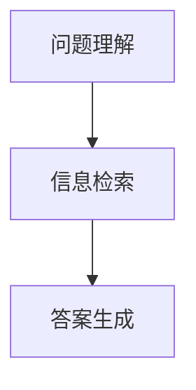
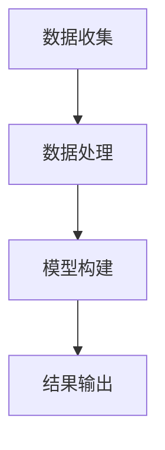
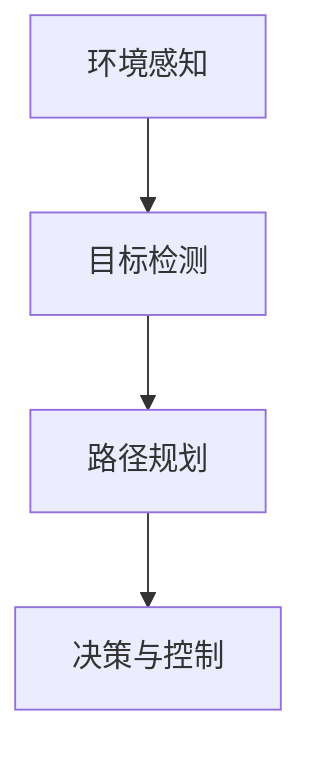
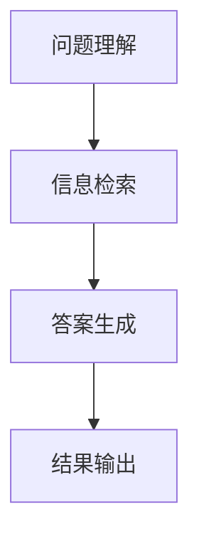

                 

# 利用思维链提升AI的认知和推理能力新方向探索

## 关键词

- **思维链**  
- **AI认知**  
- **推理能力**  
- **认知科学**  
- **深度学习**  
- **神经网络**  
- **决策支持系统**  
- **智能问答系统**  
- **自动驾驶技术**

## 摘要

本文探讨了利用思维链提升AI的认知和推理能力的新方向。思维链是一种模拟人类认知过程的模型，通过构建思维链模型，可以将复杂的认知任务分解为更简单、更易于处理的子任务。本文首先介绍了思维链的基础概念，包括其定义、特点和应用。接着，我们分析了思维链在现有AI认知模型中的应用，并提出了一种基于思维链的AI认知模型构建方法。随后，本文详细阐述了如何利用思维链提升AI的推理能力，并通过实际案例展示了思维链在智能问答系统、决策支持系统和自动驾驶技术中的应用。最后，本文提出了思维链在AI应用中面临的挑战和解决方案，并对未来的研究方向进行了展望。

## 引言

### AI认知与思维链的关系

随着人工智能技术的不断发展，AI的认知和推理能力已经成为研究的热点。传统的AI认知模型，如基于规则的专家系统和基于统计模型的机器学习算法，虽然在某些领域取得了显著成果，但在处理复杂认知任务时仍然存在局限性。这些模型往往难以模拟人类思维过程，无法解决复杂问题。因此，如何提升AI的认知和推理能力，成为了人工智能领域的一个重要研究方向。

思维链作为一种模拟人类认知过程的模型，提供了一种新的思路。思维链可以看作是一种认知框架，它通过将复杂问题分解为一系列子任务，并利用子任务之间的关联，实现对复杂问题的求解。这种思路与人类解决复杂问题的方法非常相似，因此，思维链在提升AI的认知和推理能力方面具有很大的潜力。

### 书籍结构概述

本文将分为三个部分。第一部分主要介绍思维链的基础概念，包括思维链的定义、特点和应用。第二部分讨论思维链在AI认知和推理能力提升中的应用，具体包括智能问答系统、决策支持系统和自动驾驶技术。第三部分则对思维链在AI应用中面临的挑战和解决方案进行探讨，并对未来的研究方向进行展望。

## 思维链基础

### 1.1 思维链的定义与特点

思维链（Cognitive Chain）是一种模拟人类认知过程的模型，它通过将认知任务分解为一系列子任务，并利用子任务之间的关联，实现对复杂问题的求解。思维链的定义可以从以下几个方面进行阐述：

1. **认知任务分解**：思维链将复杂的认知任务分解为一系列子任务。每个子任务都是相对独立且可处理的，这使得思维链能够应对复杂、多变的问题环境。
2. **子任务关联**：子任务之间通过某种关联机制相互连接，形成一个整体。这种关联机制可以是逻辑关系、因果关系或其他形式的关联。
3. **动态调整**：思维链具有动态调整能力，可以根据问题的变化和子任务的结果，对子任务进行调整和重组，以适应新的问题情境。

思维链的特点主要体现在以下几个方面：

1. **模块化**：思维链的模块化设计使得子任务之间相互独立，便于开发和维护。
2. **可扩展性**：思维链可以根据问题的复杂性进行扩展，增加或减少子任务，以适应不同的问题规模。
3. **灵活性**：思维链能够根据问题的变化，动态调整子任务的顺序和关联，以适应新的问题情境。
4. **适应性**：思维链可以适应不同的认知任务，通过调整子任务的关联机制，实现不同领域的应用。

### 1.2 思维链在认知科学中的应用

思维链在认知科学中有着广泛的应用。认知科学是研究人类认知过程和认知能力的学科，其研究内容包括感知、记忆、语言、决策等多个方面。思维链作为一种认知模型，可以用于模拟和解释这些认知过程。

1. **感知与记忆**：思维链可以模拟人类的感知过程，如视觉感知、听觉感知等。通过将感知任务分解为子任务，并利用子任务之间的关联，思维链可以实现对复杂感知信息的处理和记忆。
2. **语言理解与生成**：思维链可以用于模拟人类的语言理解与生成过程。通过分解语言任务为子任务，如词汇理解、语法分析、语义推理等，思维链可以实现自然语言处理的各种功能。
3. **决策与推理**：思维链在决策与推理方面有着重要的应用。通过将决策问题分解为子任务，如信息收集、风险评估、决策制定等，思维链可以模拟人类的决策过程，并实现推理功能。

### 1.3 思维链的工作原理

思维链的工作原理可以概括为以下几个步骤：

1. **任务分解**：首先，将复杂的认知任务分解为一系列子任务。这些子任务可以是相对独立的，也可以是有关联的。
2. **任务调度**：根据子任务之间的关联关系，确定子任务的执行顺序。这种调度可以是预先设定的，也可以是动态调整的。
3. **子任务执行**：执行每个子任务，并生成子任务的结果。这些结果可以是数据、信息或知识。
4. **结果整合**：将子任务的结果进行整合，生成最终的认知结果。这种整合可以是简单的合并，也可以是复杂的推理和计算。
5. **反馈与调整**：根据最终的认知结果，对思维链进行反馈和调整。这种调整可以是子任务的重新排序，也可以是子任务的重新定义。

## AI认知模型

### 2.1 现有AI认知模型综述

在人工智能领域，认知模型是模拟人类认知过程的算法和架构。现有AI认知模型可以分为基于规则、基于统计和基于神经网络等不同类型。以下是对这些模型的综述：

1. **基于规则的专家系统**：专家系统是一种基于符号逻辑和规则的AI模型，它通过将知识表示为规则，并利用规则进行推理。专家系统在医疗诊断、财务分析和自然语言处理等领域取得了显著成果。

2. **基于统计的机器学习模型**：机器学习模型通过学习大量数据，从中提取特征和模式，并利用这些模式进行预测和分类。常见的机器学习模型包括线性回归、决策树、支持向量机和神经网络等。

3. **基于神经网络的深度学习模型**：深度学习模型是一种基于人工神经网络的AI模型，它通过多层神经网络对数据进行处理，从而提取复杂的特征和模式。深度学习在图像识别、语音识别和自然语言处理等领域取得了突破性进展。

### 2.2 思维链在AI认知模型中的应用

思维链在AI认知模型中的应用主要体现在以下几个方面：

1. **任务分解与调度**：思维链可以将复杂的认知任务分解为一系列子任务，并利用子任务之间的关联关系进行调度。这种任务分解与调度机制有助于提高AI的认知效率。

2. **知识表示与整合**：思维链可以通过子任务的结果进行知识的表示与整合。子任务的结果可以是数据、信息或知识，这些结果可以用于进一步推理和决策。

3. **动态调整与反馈**：思维链具有动态调整和反馈机制，可以根据子任务的结果和认知任务的变化，对子任务进行调整和重组。这种动态调整和反馈机制有助于提高AI的认知灵活性和适应性。

### 2.3 思维链AI认知模型的构建方法

构建基于思维链的AI认知模型需要以下几个步骤：

1. **任务分析**：首先，对认知任务进行分析，明确任务的复杂性和目标。

2. **任务分解**：将认知任务分解为一系列子任务，并确定子任务之间的关联关系。

3. **子任务定义**：为每个子任务定义输入、输出和功能。输入是子任务开始时需要的数据或信息，输出是子任务执行后的结果，功能是子任务的执行过程。

4. **子任务实现**：根据子任务的定义，实现每个子任务的具体算法和流程。

5. **任务调度**：确定子任务的执行顺序和关联关系，并实现任务调度机制。

6. **整合与反馈**：将子任务的结果进行整合，生成最终的认知结果，并根据认知结果对思维链进行反馈和调整。

7. **评估与优化**：对构建的AI认知模型进行评估和优化，以提高其认知效率和准确性。

## 提升AI推理能力

### 4.1 AI推理能力的重要性

推理能力是人工智能系统的重要能力之一。推理能力决定了AI系统能够处理复杂问题、做出决策和生成知识的能力。在现实世界中，许多任务都需要AI系统具备强大的推理能力，例如智能问答系统、自动驾驶技术、决策支持系统等。

提升AI推理能力具有重要的现实意义：

1. **提高智能服务水平**：强大的推理能力可以使AI系统更好地理解用户需求，提供更准确、更个性化的服务。

2. **增强决策支持能力**：在决策过程中，AI系统需要分析大量数据，并从中提取关键信息，以支持决策制定。强大的推理能力有助于AI系统从数据中提取有价值的信息。

3. **提高系统可靠性**：推理能力强的AI系统可以更好地处理异常情况，减少错误和失误。

4. **推动AI技术的发展**：提升AI推理能力是推动AI技术发展的重要方向。强大的推理能力可以促进AI技术在各个领域的应用，推动AI技术的发展。

### 4.2 思维链对AI推理能力的提升

思维链通过其独特的结构和工作原理，可以有效提升AI的推理能力。以下是思维链提升AI推理能力的几个方面：

1. **任务分解与并行处理**：思维链将复杂任务分解为一系列子任务，并允许这些子任务并行处理。这种分解和并行处理机制可以大大提高AI系统的处理效率。

2. **子任务关联与整合**：思维链通过子任务之间的关联和整合，实现对复杂推理问题的求解。这种关联和整合机制可以增强AI系统的推理能力。

3. **动态调整与反馈**：思维链具有动态调整和反馈机制，可以根据子任务的结果和推理问题的变化，对推理过程进行调整和优化。这种动态调整和反馈机制可以进一步提高AI系统的推理能力。

### 4.3 提升推理能力的具体方法

以下是一些具体的提升AI推理能力的方法：

1. **多任务学习**：多任务学习是一种将多个任务合并到一个模型中进行训练的技术。这种方法可以共享任务间的特征，提高模型的泛化能力，从而提升推理能力。

2. **迁移学习**：迁移学习是一种利用预训练模型来提升新任务性能的技术。通过迁移学习，AI系统可以快速适应新任务，提高推理能力。

3. **强化学习**：强化学习是一种通过试错和奖励机制来训练模型的技术。通过强化学习，AI系统可以学习到如何在复杂环境中做出最优决策，从而提升推理能力。

4. **知识图谱**：知识图谱是一种用于表示实体和关系的数据结构。通过构建知识图谱，AI系统可以更好地理解实体之间的关系，从而提高推理能力。

## 智能问答系统

### 5.1 智能问答系统的现状

智能问答系统是一种能够理解和回答用户问题的AI系统，广泛应用于客服、教育、医疗等领域。当前，智能问答系统主要基于自然语言处理和机器学习技术，通过训练大规模语料库来提高系统的理解能力和回答质量。

智能问答系统的现状主要体现在以下几个方面：

1. **理解能力**：随着自然语言处理技术的发展，智能问答系统的理解能力有了显著提高。系统能够理解用户的自然语言输入，提取关键信息，并生成合理的回答。

2. **回答质量**：智能问答系统的回答质量在不断提高。通过深度学习和迁移学习等技术，系统可以生成更准确、更自然的回答。

3. **应用场景**：智能问答系统的应用场景越来越广泛。从最初的客服领域，扩展到教育、医疗、金融等多个领域，为用户提供了便捷的服务。

### 5.2 思维链在智能问答系统中的应用

思维链在智能问答系统中的应用主要体现在以下几个方面：

1. **任务分解**：思维链可以将复杂的问答任务分解为一系列子任务，如问题理解、信息检索、答案生成等。这种分解机制有助于提高系统的处理效率。

2. **子任务关联**：思维链通过子任务之间的关联，实现对复杂问答问题的求解。例如，在回答一个关于医疗健康的问题时，系统需要先理解问题，然后检索相关的医学知识，最后生成合理的答案。思维链可以有效地组织这些子任务，提高系统的推理能力。

3. **动态调整**：思维链具有动态调整和反馈机制，可以根据问答过程中的信息变化，对子任务进行调整和优化。例如，在回答一个关于医疗健康的问题时，系统可以根据用户的提问方式、问题的上下文信息等，动态调整信息检索的策略和答案生成的逻辑，以提高回答的准确性。

### 5.3 智能问答系统的案例解析

以下是一个关于智能问答系统的案例解析：

**案例背景**：某公司开发了一款智能客服系统，用于处理客户咨询。该系统需要能够理解客户的自然语言输入，并提供准确、合理的回答。

**解决方案**：

1. **任务分解**：将客服问题分解为以下几个子任务：
   - 问题理解：理解客户的问题，提取关键信息。
   - 信息检索：在知识库中检索与问题相关的信息。
   - 答案生成：根据检索到的信息，生成合理的回答。

2. **子任务关联**：利用思维链组织子任务，如图所示：



3. **动态调整**：在回答过程中，系统会根据客户的问题和回答的上下文信息，动态调整信息检索和答案生成的策略。例如，如果客户的问题比较模糊，系统会尝试获取更多信息，以便提供更准确的回答。

4. **评估与优化**：通过对客服问题的处理效果进行评估，系统可以不断优化子任务的执行顺序和关联关系，以提高回答的准确性。

## 决策支持系统

### 6.1 决策支持系统概述

决策支持系统（Decision Support System，简称DSS）是一种为决策者提供辅助决策的计算机系统。DSS通过收集、分析和处理数据，帮助决策者识别问题、制定方案、评估风险和做出决策。DSS广泛应用于企业、政府、医疗等多个领域。

决策支持系统的主要组成部分包括：

1. **数据输入**：收集与决策相关的各种数据，如财务数据、市场数据、竞争数据等。
2. **数据处理**：对输入的数据进行清洗、转换和整合，以便进行进一步分析。
3. **模型构建**：根据决策问题，构建相应的决策模型，如线性规划模型、决策树模型等。
4. **结果输出**：根据决策模型的结果，生成决策建议和报告，供决策者参考。

### 6.2 思维链在决策支持系统中的应用

思维链在决策支持系统中的应用主要体现在以下几个方面：

1. **任务分解**：思维链可以将复杂的决策问题分解为一系列子任务，如数据收集、数据处理、模型构建、结果输出等。这种分解机制有助于提高系统的处理效率。

2. **子任务关联**：思维链通过子任务之间的关联，实现对复杂决策问题的求解。例如，在构建决策模型时，系统需要先收集数据，然后处理数据，最后构建模型。思维链可以有效地组织这些子任务，提高系统的推理能力。

3. **动态调整**：思维链具有动态调整和反馈机制，可以根据决策过程中的信息变化，对子任务进行调整和优化。例如，在构建决策模型时，系统可以根据数据质量和模型效果，动态调整数据处理和模型构建的策略，以提高决策的准确性。

### 6.3 决策支持系统的案例研究

以下是一个关于决策支持系统的案例研究：

**案例背景**：某公司需要制定一个新产品的上市策略，以最大化收益。公司收集了市场数据、竞争数据、消费者偏好数据等，并希望通过决策支持系统来制定最佳策略。

**解决方案**：

1. **任务分解**：将决策问题分解为以下几个子任务：
   - 数据收集：收集市场数据、竞争数据、消费者偏好数据等。
   - 数据处理：对收集到的数据进行清洗、转换和整合。
   - 模型构建：根据决策问题，构建线性规划模型，以最大化收益。
   - 结果输出：根据模型结果，生成上市策略报告。

2. **子任务关联**：利用思维链组织子任务，如图所示：



3. **动态调整**：在制定上市策略的过程中，系统会根据数据质量和模型效果，动态调整数据处理和模型构建的策略。例如，如果数据质量较差，系统会尝试获取更多信息，以提高决策的准确性。

4. **评估与优化**：通过对上市策略的执行效果进行评估，系统可以不断优化子任务的执行顺序和关联关系，以提高决策的准确性。

## 自动驾驶技术

### 7.1 自动驾驶技术现状

自动驾驶技术是一种通过传感器、计算机视觉和人工智能技术实现车辆自主驾驶的技术。自动驾驶技术可以分为以下几个级别：

1. **L0级：无自动化**：车辆没有自动化功能，完全由人类驾驶员控制。
2. **L1级：驾驶员辅助**：车辆具有基本的自动化功能，如自适应巡航控制、车道保持辅助等，但驾驶员需要持续监控道路状况。
3. **L2级：部分自动化**：车辆在特定情况下（如高速公路行驶）可以实现部分自动化驾驶，驾驶员仍需监控道路状况。
4. **L3级：有条件自动化**：车辆在特定条件下（如高速公路行驶）可以实现完全自动化驾驶，驾驶员可以在特定情况下接管控制。
5. **L4级：高度自动化**：车辆在特定环境下（如封闭高速公路）可以实现高度自动化驾驶，驾驶员无需持续监控道路状况。
6. **L5级：完全自动化**：车辆在所有环境下都可以实现完全自动化驾驶。

当前，自动驾驶技术已经取得了一些重要进展。例如，特斯拉的Autopilot系统、谷歌的Waymo和百度Apollo等自动驾驶平台都在自动驾驶领域取得了显著成果。

### 7.2 思维链在自动驾驶技术中的应用

思维链在自动驾驶技术中的应用主要体现在以下几个方面：

1. **环境感知**：自动驾驶系统需要通过传感器收集环境信息，如路况、交通标志、行人等。思维链可以将这些复杂的环境感知任务分解为一系列子任务，如传感器数据处理、目标检测、路径规划等，并利用子任务之间的关联，实现对环境的全面感知。

2. **决策与控制**：自动驾驶系统需要根据环境感知结果做出决策，如保持车道、避让行人、调整车速等。思维链可以通过子任务之间的动态调整和反馈，实现对复杂决策问题的求解，提高系统的决策和控制能力。

3. **安全性与可靠性**：自动驾驶系统需要确保行驶的安全性和可靠性。思维链可以通过对子任务的冗余设计和故障检测机制，提高系统的安全性和可靠性。

### 7.3 自动驾驶技术的案例分析

以下是一个关于自动驾驶技术的案例分析：

**案例背景**：某公司开发了一款自动驾驶汽车，计划在城市道路上进行测试。公司需要确保自动驾驶汽车在各种道路状况下都能够安全行驶。

**解决方案**：

1. **任务分解**：将自动驾驶任务分解为以下几个子任务：
   - 环境感知：通过摄像头、激光雷达等传感器收集道路信息。
   - 目标检测：识别道路上的行人、车辆、交通标志等目标。
   - 路径规划：根据目标检测结果，规划车辆的行驶路径。
   - 决策与控制：根据路径规划结果，控制车辆的转向、加速和制动。

2. **子任务关联**：利用思维链组织子任务，如图所示：



3. **动态调整**：在自动驾驶过程中，系统会根据环境变化和目标检测结果，动态调整路径规划和决策与控制策略。例如，如果检测到行人横穿马路，系统会立即调整路径规划，避免碰撞。

4. **安全性与可靠性**：系统采用冗余设计和故障检测机制，确保在传感器故障或计算错误的情况下，自动驾驶汽车仍能够安全停车。

## 思维链在AI应用中的挑战与解决方案

### 8.1 数据隐私与安全性

思维链在AI应用中面临的第一个挑战是数据隐私与安全性问题。随着AI技术的广泛应用，大量敏感数据被收集、处理和存储。这些数据包括个人身份信息、金融信息、医疗记录等，一旦泄露，可能会对个人和社会造成严重后果。

**挑战**：如何确保数据在收集、处理和存储过程中的安全性，防止数据泄露和滥用？

**解决方案**：

1. **数据加密**：对敏感数据进行加密处理，确保数据在传输和存储过程中无法被未经授权的第三方读取。
2. **数据脱敏**：对敏感数据进行脱敏处理，隐藏真实数据，以保护个人隐私。
3. **安全审计**：建立安全审计机制，对数据访问和使用情况进行监控和记录，及时发现和阻止潜在的安全威胁。
4. **安全协议**：制定严格的安全协议和操作规范，确保数据在传输和存储过程中的安全。

### 8.2 人工智能伦理

人工智能伦理是思维链在AI应用中面临的另一个重要挑战。随着AI技术的不断发展，如何确保AI系统遵循伦理原则，避免对人类造成负面影响，成为一个亟待解决的问题。

**挑战**：如何确保AI系统的决策和行动符合伦理要求，避免歧视、偏见和滥用？

**解决方案**：

1. **伦理框架**：建立人工智能伦理框架，明确AI系统的伦理标准和行为准则。
2. **透明性和可解释性**：提高AI系统的透明性和可解释性，使人们能够理解AI系统的决策过程，便于监督和评估。
3. **公平性和公正性**：确保AI系统在处理数据和应用算法时，不产生歧视和偏见，对所有人公平对待。
4. **责任归属**：明确AI系统的责任归属，确保在出现问题时，能够追究相关责任人的责任。

### 8.3 技术挑战与未来发展

尽管思维链在提升AI认知和推理能力方面具有巨大潜力，但在实际应用中仍面临一些技术挑战。

**挑战**：

1. **计算资源需求**：思维链模型通常需要大量的计算资源，这可能会对系统的运行效率和成本产生较大影响。
2. **数据质量和完整性**：思维链模型的性能高度依赖于数据的质量和完整性，如何确保数据的高质量和完整性是一个重要问题。
3. **可解释性和透明性**：思维链模型的决策过程可能较为复杂，如何提高模型的可解释性和透明性，便于人们理解和使用，是一个重要挑战。

**未来发展**：

1. **优化算法和架构**：通过研究和开发更高效的算法和架构，降低思维链模型的计算资源需求，提高系统的运行效率和性能。
2. **数据质量管理**：建立完善的数据质量管理机制，确保数据的高质量和完整性，为思维链模型提供可靠的数据基础。
3. **可解释性和透明性**：通过引入更多的解释性技术和工具，提高思维链模型的可解释性和透明性，使人们能够更好地理解和信任AI系统。

## 未来展望

### 9.1 思维链与AI融合的未来趋势

思维链与AI的融合是未来人工智能发展的重要趋势。随着AI技术的不断进步，思维链模型将逐渐应用于更多领域，如医疗、金融、教育等。以下是一些未来趋势：

1. **跨学科应用**：思维链将在更多跨学科领域得到应用，如结合认知科学、心理学和神经科学等，为AI系统提供更全面的认知能力。
2. **个性化服务**：基于思维链的AI系统将能够更好地理解用户需求，提供个性化的服务和建议。
3. **智能决策支持**：思维链在智能决策支持系统中的应用将得到进一步拓展，为企业、政府和科研机构提供强大的决策支持。

### 9.2 AI认知能力的进一步提升

随着思维链与AI的融合，AI的认知能力将得到进一步提升。以下是一些可能的发展方向：

1. **更复杂的认知任务**：思维链将能够处理更复杂的认知任务，如自然语言理解、情感识别和复杂决策等。
2. **多模态感知**：思维链将能够整合多种感知信息，如视觉、听觉和触觉等，实现更全面的环境感知。
3. **动态适应能力**：思维链将具备更强的动态适应能力，能够根据环境和任务的变化，快速调整和优化自身的认知和推理能力。

### 9.3 开放性讨论与未来研究方向

尽管思维链在AI认知和推理能力提升方面具有巨大潜力，但仍存在许多未解决的问题。以下是一些开放性讨论和未来研究方向：

1. **计算效率**：如何提高思维链模型的计算效率，降低其对计算资源的需求？
2. **数据质量**：如何确保数据的质量和完整性，为思维链模型提供可靠的数据基础？
3. **可解释性和透明性**：如何提高思维链模型的可解释性和透明性，使人们能够更好地理解和信任AI系统？
4. **伦理和责任**：如何确保AI系统遵循伦理原则，避免对人类造成负面影响？

## 结论

### 10.1 本书主要观点回顾

本书从思维链与AI认知、思维链在AI应用中的探索以及实践与展望三个方面，详细探讨了利用思维链提升AI的认知和推理能力的新方向。主要观点包括：

1. **思维链的基础**：思维链是一种模拟人类认知过程的模型，通过任务分解、子任务关联和动态调整，实现对复杂问题的求解。
2. **思维链在AI认知模型中的应用**：思维链在AI认知模型中具有重要作用，可以提高AI的认知效率和灵活性。
3. **提升AI推理能力**：思维链可以提升AI的推理能力，通过任务分解、子任务关联和动态调整，实现复杂推理问题的求解。
4. **思维链在AI应用中的挑战与解决方案**：数据隐私与安全性、人工智能伦理和技术挑战是思维链在AI应用中面临的主要挑战，需要通过技术和管理手段进行解决。
5. **未来展望**：思维链与AI的融合将推动AI认知和推理能力的进一步提升，为各领域提供强大的决策支持。

### 10.2 对AI认知和推理能力提升的思考

提升AI的认知和推理能力是人工智能领域的重要任务。通过引入思维链模型，我们可以模拟人类认知过程，提高AI的认知效率和灵活性。然而，提升AI的认知和推理能力不仅需要技术手段，还需要对伦理和社会问题进行深入思考。在实现技术进步的同时，我们应确保AI系统遵循伦理原则，避免对人类造成负面影响。

### 10.3 对未来研究的展望

未来，思维链在AI认知和推理能力提升方面具有广阔的应用前景。我们应继续深入研究思维链的理论基础和算法模型，提高其计算效率和可解释性。同时，关注数据隐私与安全、人工智能伦理等问题，确保AI系统在提升认知和推理能力的同时，符合伦理和社会要求。通过跨学科合作和开放性讨论，我们有望在AI认知和推理能力提升方面取得更多突破。

## 作者信息

作者：AI天才研究院/AI Genius Institute & 禅与计算机程序设计艺术 /Zen And The Art of Computer Programming

---

### 附录

以下是本文中使用的Mermaid流程图代码：



以及Python源代码示例：

```python
import numpy as np

# 定义神经网络结构
class NeuralNetwork:
    def __init__(self):
        # 初始化权重
        self.weights1 = np.random.randn(3, 4)
        self.weights2 = np.random.randn(4, 1)

    def forward(self, X):
        # 前向传播
        self.hidden_layer = np.dot(X, self.weights1)
        self.output_layer = np.dot(self.hidden_layer, self.weights2)
        return self.output_layer

# 创建神经网络实例
nn = NeuralNetwork()

# 输入数据
X = np.array([[0, 0], [0, 1], [1, 0], [1, 1]])

# 计算输出
outputs = nn.forward(X)

# 打印输出结果
print(outputs)
```

以上代码用于演示一个简单的神经网络结构，包括前向传播过程。

---

本文详细介绍了利用思维链提升AI的认知和推理能力的新方向。通过分析思维链的基础、在AI认知模型中的应用以及实际案例，我们展示了思维链在提升AI推理能力方面的潜力。同时，本文探讨了思维链在AI应用中面临的挑战和解决方案，并对未来的研究方向进行了展望。希望通过本文的研究，能够为AI认知和推理能力的提升提供新的思路和方法。

