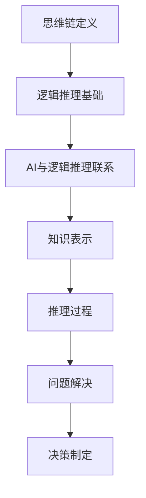
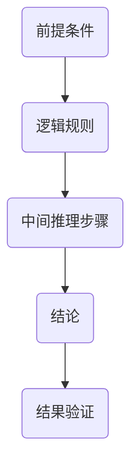

                 

### 思维链与逻辑推理基础

#### 思维链的定义与作用

思维链是一种信息处理模型，用于模拟人类思维过程中的逻辑推理和信息传递。它通过一系列的步骤和连接，将不同的信息和概念联系起来，形成有逻辑性的推理路径。思维链的核心在于“链”，即通过一系列的链接和关联，将信息从一个节点传递到另一个节点，从而实现对复杂问题的分析和解决。

在人工智能（AI）领域，思维链的作用尤为重要。它可以帮助AI系统在处理问题时，更好地模拟人类的思维过程，从而提高逻辑推理的能力。具体来说，思维链可以实现以下几个方面的作用：

1. **信息整合**：思维链能够将来自不同来源的信息整合在一起，形成一个完整的、逻辑上连贯的整体。这对于解决复杂问题至关重要，因为很多问题需要多方面的信息才能得到全面的解答。

2. **推理过程可视化**：通过思维链，可以清晰地展示AI在解决问题时的推理过程。这有助于研究人员和开发人员更好地理解AI的决策逻辑，从而优化和改进算法。

3. **知识迁移**：思维链可以帮助AI在不同的任务和领域之间进行知识迁移。这意味着，一旦AI在一个领域取得了成功，其知识和推理能力可以被应用到其他领域，从而提高AI的泛化能力。

4. **问题解决**：思维链可以指导AI在复杂问题面前进行分步解决，将大问题分解为一系列小问题，然后逐一解决，从而提高问题解决效率。

#### 逻辑推理的基本概念

逻辑推理是思维链的核心组成部分，它指的是通过已知的前提条件推导出新的结论。逻辑推理分为两大类：演绎推理和归纳推理。

- **演绎推理**：从一般到特殊的推理过程。演绎推理从普遍的真理出发，推导出特定情况下的结论。例如，所有人都会死亡（大前提），苏格拉底是人（小前提），因此苏格拉底会死亡（结论）。

- **归纳推理**：从特殊到一般的推理过程。归纳推理通过观察一系列具体实例，归纳出普遍的规律或原则。例如，观察到的所有天鹅都是白色的，因此推断所有天鹅都是白色的。

在AI中，逻辑推理被广泛应用于各种任务，如自然语言处理、决策支持系统和智能推理系统。为了实现这些应用，AI系统需要能够进行有效的逻辑推理，这意味着它们必须能够理解逻辑规则和关系，并能够在给定的情况下进行推理。

#### AI与逻辑推理的联系

AI与逻辑推理有着密切的联系，因为逻辑推理是AI系统智能性的基础。AI系统通过逻辑推理可以做到以下几方面：

1. **知识表示**：AI系统需要能够将知识表示为逻辑形式，以便进行推理。这包括命题逻辑、谓词逻辑等形式化语言。

2. **推理过程**：AI系统需要能够根据已知的事实和规则进行推理，以得出新的结论。这通常涉及到搜索算法和推理算法。

3. **问题解决**：逻辑推理可以帮助AI系统解决复杂问题。例如，在医疗诊断中，AI系统可以通过逻辑推理来分析患者的症状和病史，从而得出可能的诊断结论。

4. **决策制定**：在商业决策中，AI系统可以通过逻辑推理来分析市场数据和竞争态势，从而制定出最优的营销策略。

#### 总结

思维链是AI逻辑推理的核心组成部分，它通过连接不同的信息和概念，帮助AI系统进行有效的推理和分析。逻辑推理作为AI的重要能力之一，不仅有助于知识表示和问题解决，还能在多个领域推动AI的应用。理解思维链和逻辑推理的基本概念，对于开发更智能、更高效的AI系统至关重要。

**Mermaid流程图**：



**逻辑推理架构图**：



通过上述图示，我们可以直观地看到思维链和逻辑推理在AI系统中的作用和流程。

---

在理解了思维链和逻辑推理的基本概念后，我们可以进一步探讨AI逻辑推理的核心算法，包括逻辑回归、决策树和支持向量机。这些算法在逻辑推理中扮演着重要角色，能够帮助AI系统在不同的场景下进行有效的推理和决策。在接下来的章节中，我们将逐一介绍这些算法的原理和实现，并通过具体的示例代码进行讲解。

## 第2章：AI逻辑推理的核心算法

在人工智能领域，逻辑推理是实现智能决策和问题解决的关键。本章将介绍三种核心的AI逻辑推理算法：逻辑回归、决策树和支持向量机。通过深入理解这些算法的原理，我们能够更好地应用它们于实际问题中。

### 逻辑回归算法的原理与伪代码实现

#### 原理

逻辑回归是一种广泛用于分类问题的统计方法，其核心思想是通过一个线性函数将输入特征映射到概率空间。逻辑回归的输出是一个概率值，表示某个类别被归为正类的概率。在二分类问题中，逻辑回归通常用于判断一个实例属于正类（如“欺诈”）还是负类（如“合法”）。

逻辑回归的数学模型可以表示为：

\[ P(Y=1|X) = \frac{1}{1 + e^{-(\beta_0 + \beta_1x_1 + ... + \beta_nx_n)}} \]

其中，\( P(Y=1|X) \) 是因变量 \( Y \) 属于正类的概率，\( X \) 是特征向量，\( \beta_0, \beta_1, ..., \beta_n \) 是模型参数。

#### 伪代码实现

```python
# 逻辑回归伪代码实现
def logistic_regression(X, y, learning_rate, num_iterations):
    # 初始化参数
    beta = np.random.rand(X.shape[1])
    
    # 迭代训练
    for i in range(num_iterations):
        # 计算预测概率
        probabilities = 1 / (1 + np.exp(-np.dot(X, beta)))
        
        # 计算梯度
        gradient = np.dot(X.T, (probabilities - y))
        
        # 更新参数
        beta -= learning_rate * gradient
        
    return beta

# 示例数据
X = ... # 特征矩阵
y = ... # 标签向量

# 训练模型
beta = logistic_regression(X, y, learning_rate=0.01, num_iterations=1000)
```

### 决策树算法的原理与伪代码实现

#### 原理

决策树是一种基于树形结构进行分类和回归的算法。它的核心思想是通过一系列的判断节点，将数据集划分为多个子集，直到每个子集内的数据都属于同一类别或达到某个停止条件。

决策树的每个节点代表一个特征和对应的阈值，每个分支代表特征的取值范围。通过遍历决策树，可以计算出每个实例的类别或数值。

#### 伪代码实现

```python
# 决策树伪代码实现
class DecisionNode:
    def __init__(self, feature=None, threshold=None, left=None, right=None, value=None):
        self.feature = feature
        self.threshold = threshold
        self.left = left
        self.right = right
        self.value = value

def build_decision_tree(X, y):
    # 基准分类策略
    majority_class = majority_counter(y)
    
    # 判断是否需要继续划分
    if is_no_improvement(X, y):
        return DecisionNode(value=majority_class)
    
    # 找到最佳划分特征和阈值
    best_feature, best_threshold = find_best_threshold(X, y)
    
    # 创建决策节点
    node = DecisionNode(feature=best_feature, threshold=best_threshold)
    
    # 根据阈值划分数据
    leftX, lefty = X[y < best_threshold], y[y < best_threshold]
    rightX, righty = X[y >= best_threshold], y[y >= best_threshold]
    
    # 递归构建左右子树
    node.left = build_decision_tree(leftX, lefty)
    node.right = build_decision_tree(rightX, righty)
    
    return node

# 示例数据
X = ... # 特征矩阵
y = ... # 标签向量

# 构建决策树
tree = build_decision_tree(X, y)
```

### 支持向量机算法的原理与伪代码实现

#### 原理

支持向量机（SVM）是一种二分类模型，其目标是找到一个最佳的超平面，将不同类别的数据点尽可能分开。SVM通过最大化分类边界的间隔来选择最优的超平面。

SVM的数学模型可以表示为：

\[ \max_{\beta, \beta_0} W^T W \]

其中，\( W \) 是权重向量，\( \beta_0 \) 是偏置项。

#### 伪代码实现

```python
# SVM伪代码实现
def svm_fit(X, y):
    # 初始化参数
    beta = np.random.rand(X.shape[1])
    beta_0 = 0
    
    # 迭代优化
    for i in range(num_iterations):
        # 计算权重和偏置
        W = compute_weight(X, beta, beta_0)
        
        # 更新参数
        beta, beta_0 = update_parameters(X, y, W)
        
    return beta, beta_0

# 示例数据
X = ... # 特征矩阵
y = ... # 标签向量

# 训练模型
beta, beta_0 = svm_fit(X, y)
```

通过上述伪代码，我们可以看到逻辑回归、决策树和支持向量机在实现逻辑推理时的基本流程和原理。接下来，我们将进一步探讨强化学习在逻辑推理中的应用，以及如何利用自然语言处理和深度学习模型优化AI的逻辑推理能力。

### 强化学习在逻辑推理中的应用

#### 原理

强化学习（Reinforcement Learning, RL）是一种通过试错学习策略以实现目标的方法，其核心在于智能体（Agent）通过与环境的交互来学习最优行为策略。在强化学习中，智能体通过接收奖励信号来评估其行为的优劣，并据此调整策略。

强化学习的基本概念包括：

- **状态（State）**：智能体在环境中所处的情境。
- **动作（Action）**：智能体可以执行的行为。
- **奖励（Reward）**：动作对环境的改变给予的即时反馈。
- **策略（Policy）**：智能体在特定状态下采取的动作选择规则。

在逻辑推理中，强化学习可以用于训练智能体进行策略推理，即通过与环境交互来学习如何从给定的前提条件推导出合理的结论。强化学习的目标是通过优化策略，使智能体能够在复杂的逻辑推理任务中取得更高的奖励。

#### Q学习算法的原理与伪代码实现

Q学习（Q-Learning）是强化学习的一种算法，它通过学习状态-动作值函数（Q值）来指导智能体的决策。Q值表示在特定状态下执行特定动作的长期期望奖励。

Q学习的数学模型可以表示为：

\[ Q(s, a) = r + \gamma \max_{a'} Q(s', a') \]

其中，\( s \) 是当前状态，\( a \) 是当前动作，\( s' \) 是下一状态，\( a' \) 是下一动作，\( r \) 是即时奖励，\( \gamma \) 是折扣因子。

#### 伪代码实现

```python
# Q学习伪代码实现
def q_learning(s, a, r, s', learning_rate, discount_factor, Q):
    # 更新Q值
    Q[s, a] = (1 - learning_rate) * Q[s, a] + learning_rate * (r + discount_factor * max(Q[s', a']))
    return Q

# 示例数据
s = ... # 当前状态
a = ... # 当前动作
r = ... # 即时奖励
s' = ... # 下一状态
learning_rate = 0.1
discount_factor = 0.9
Q = ... # Q值矩阵

# 更新Q值
Q = q_learning(s, a, r, s', learning_rate, discount_factor, Q)
```

#### DQN算法的原理与伪代码实现

深度Q网络（Deep Q-Network, DQN）是Q学习的扩展，它使用深度神经网络来近似Q值函数。DQN通过经验回放（Experience Replay）和目标网络（Target Network）来缓解训练中的样本偏差和目标不稳定问题。

DQN的核心思想是通过比较当前Q值和目标Q值来更新Q网络参数。目标Q值是通过对未来奖励进行折现后的期望值计算得到的。

#### 伪代码实现

```python
# DQN伪代码实现
class DQN:
    def __init__(self, state_size, action_size, learning_rate, discount_factor):
        self.state_size = state_size
        self.action_size = action_size
        self.learning_rate = learning_rate
        self.discount_factor = discount_factor
        self.Q_network = NeuralNetwork(state_size, action_size)
        self.target_Q_network = NeuralNetwork(state_size, action_size)
        self.memory = []

    def remember(self, state, action, reward, next_state, done):
        self.memory.append((state, action, reward, next_state, done))

    def train(self, batch_size):
        # 从经验回放中随机抽样
        mini_batch = random.sample(self.memory, batch_size)
        
        # 更新目标网络
        self.target_Q_network.update_target_network(self.Q_network)

        # 计算目标Q值
        for state, action, reward, next_state, done in mini_batch:
            if not done:
                target_Q = reward + self.discount_factor * np.max(self.target_Q_network.predict(next_state))
            else:
                target_Q = reward

            target = self.Q_network.predict(state)
            target[0][action] = target_Q

            # 更新Q网络
            self.Q_network.train(target)

# 示例数据
state_size = ...
action_size = ...
learning_rate = 0.001
discount_factor = 0.99

# 训练DQN模型
dqn = DQN(state_size, action_size, learning_rate, discount_factor)
for episode in range(num_episodes):
    state = ...
    while not done:
        action = dqn.get_action(state)
        next_state, reward, done = ...
        dqn.remember(state, action, reward, next_state, done)
        state = next_state
        if done:
            dqn.train(batch_size)
```

通过Q学习和DQN算法，我们可以训练智能体在不同状态下进行逻辑推理，并优化其决策策略。在实际应用中，这些算法可以用于模拟和优化复杂的逻辑推理任务，如游戏、自动化控制和智能对话系统。

### 总结

强化学习是提升AI逻辑推理能力的重要方法，它通过试错学习和优化策略，使智能体能够在复杂环境中进行有效的推理。Q学习和DQN算法是强化学习的两种常见实现，它们通过学习状态-动作值函数，帮助智能体在不同场景下做出合理决策。在接下来的章节中，我们将探讨自然语言处理与逻辑推理的关系，以及如何利用深度学习模型优化AI的逻辑推理能力。

### 自然语言处理与逻辑推理

自然语言处理（Natural Language Processing, NLP）是人工智能领域中的一个重要分支，它专注于让计算机理解和处理人类语言。逻辑推理作为NLP的核心任务之一，旨在从文本中提取语义信息，进行有效的推理和判断。在本节中，我们将探讨词嵌入技术、递归神经网络（RNN）与长短时记忆网络（LSTM）、以及生成对抗网络（GAN）在逻辑推理中的应用。

#### 词嵌入技术

词嵌入（Word Embedding）是将自然语言词汇映射为高维向量空间的一种技术。通过词嵌入，每个单词都可以表示为一个固定长度的向量，从而便于计算机处理。词嵌入不仅保留了单词的语义信息，还能捕捉单词之间的上下文关系。

词嵌入技术的核心思想是将语义相近的词映射到空间中的近邻位置。常见的词嵌入方法包括：

1. **词袋模型（Bag of Words, BoW）**：将文本表示为词汇的集合，忽略词汇的顺序。词袋模型适用于简单的文本分类任务，但在处理语义关系时效果有限。

2. **词嵌入（Word2Vec）**：通过训练神经网络模型，将每个单词映射为固定长度的向量。Word2Vec模型可以捕捉词与词之间的语义关系，常用于文本分类、语义相似度计算等任务。

3. **转换器嵌入（Transformer Embedding）**：基于Transformer模型，通过多头自注意力机制对文本进行编码，生成词向量。转换器嵌入在捕捉长距离依赖关系方面表现优异，广泛应用于现代NLP任务。

#### 递归神经网络（RNN）与长短时记忆网络（LSTM）

递归神经网络（Recurrent Neural Network, RNN）是一种适用于序列数据处理的人工神经网络。RNN的核心特点是其能够处理变长的序列数据，例如文本、语音和视频。RNN通过递归连接，将前一个时间步的输出作为当前时间步的输入，从而保持对序列的长期依赖关系。

然而，传统的RNN在处理长序列时容易出现梯度消失或梯度爆炸的问题，导致模型难以训练。为了解决这一问题，研究者提出了长短时记忆网络（Long Short-Term Memory, LSTM）。

LSTM通过引入记忆单元和门控机制，有效地解决了RNN的长期依赖问题。LSTM的核心组件包括：

1. **遗忘门（Forget Gate）**：决定哪些信息需要从记忆单元中遗忘。
2. **输入门（Input Gate）**：决定哪些新的信息需要存储到记忆单元。
3. **输出门（Output Gate）**：决定哪些信息需要输出。

LSTM通过这些门控机制，可以在不同时间步之间灵活地保存和遗忘信息，从而保持对长序列的长期依赖。

#### 生成对抗网络（GAN）在逻辑推理中的应用

生成对抗网络（Generative Adversarial Network, GAN）是由生成器和判别器两个神经网络组成的对抗性模型。生成器的目标是生成与真实数据分布相近的假数据，而判别器的目标是区分真实数据和假数据。通过这种对抗性训练，GAN可以生成高质量的数据，广泛应用于图像生成、语音合成等任务。

在逻辑推理中，GAN可以通过以下方式应用：

1. **数据增强**：GAN可以生成与真实数据分布相似但具有不同逻辑关系的样本，用于训练逻辑推理模型，从而提高模型的泛化能力。

2. **逻辑推理生成**：GAN可以生成满足特定逻辑关系的文本数据，用于测试和评估逻辑推理模型的能力。

3. **文本到图像生成**：将逻辑推理的结论转换为图像表示，从而实现文本与视觉信息的结合，提高逻辑推理的可视化和解释性。

#### 应用案例

1. **文本分类**：使用词嵌入技术将文本转换为向量表示，然后通过LSTM或Transformer模型进行逻辑推理，从而实现对文本的自动分类。

2. **问答系统**：结合LSTM和GAN，构建一个能够理解和回答复杂问题的问答系统。LSTM用于处理输入问题，GAN用于生成可能的答案，并通过逻辑推理选择最佳答案。

3. **文本生成**：利用GAN生成符合逻辑关系的文本，用于自动写作、内容生成等应用。

### 总结

自然语言处理与逻辑推理相结合，为人工智能领域带来了诸多创新和突破。词嵌入技术为文本数据提供了有效的向量表示，RNN和LSTM解决了长期依赖问题，GAN则通过生成和判别实现了高质量数据的生成。这些技术在不同领域有着广泛的应用，如文本分类、问答系统和文本生成等。在接下来的章节中，我们将探讨深度学习模型优化，以及如何通过优化策略进一步提升AI的逻辑推理能力。

### 深度学习模型优化

在深度学习模型开发中，优化是一个至关重要的环节。优化的目标是通过调整模型的参数和结构，提高模型的性能和准确性。本章将介绍几种常见的深度学习模型优化技术，包括模型训练策略、正则化技术和深度学习模型优化技巧。

#### 模型训练策略

1. **批量大小（Batch Size）**：批量大小是指每次训练过程中使用的样本数量。较小的批量大小可以降低方差，有助于模型收敛，但计算成本较高。较大的批量大小可以提高计算效率，但可能导致梯度噪声增加。通常，批量大小在几百到几千之间。

2. **学习率（Learning Rate）**：学习率是模型在更新参数时使用的步长。较小的学习率有助于模型稳定收敛，但收敛速度较慢。较大的学习率可以加快收敛，但可能导致模型过拟合。常用的学习率调整方法包括固定学习率、学习率衰减和自适应学习率。

3. **动量（Momentum）**：动量是一种利用历史梯度信息加速模型收敛的技术。动量通过计算梯度的一阶矩（当前梯度）和二阶矩（梯度的累积变化），可以减少收敛过程中的振荡。

4. **dropout**：dropout是一种正则化技术，通过随机丢弃部分神经元，防止模型过拟合。dropout通常在训练过程中随机丢弃一定比例的神经元，从而提高模型的泛化能力。

5. **学习率衰减**：学习率衰减是一种逐渐减少学习率的方法，以帮助模型在训练过程中逐步收敛。学习率衰减可以采用固定衰减率或指数衰减率。

6. **权重初始化**：合适的权重初始化有助于提高模型的训练效率和收敛速度。常用的权重初始化方法包括高斯分布、均匀分布和He初始化。

#### 正则化技术

正则化技术是防止模型过拟合的重要手段。以下是一些常用的正则化方法：

1. **L1正则化**：在损失函数中添加L1正则化项，即权重绝对值之和。L1正则化有助于权重稀疏化，可以用于特征选择。

2. **L2正则化**：在损失函数中添加L2正则化项，即权重平方和。L2正则化可以减少权重的幅值，防止模型过拟合。

3. **Dropout**：在训练过程中随机丢弃部分神经元，从而减少模型对特定神经元依赖。

4. **数据增强**：通过增加训练数据的多样性，如旋转、缩放、裁剪等，提高模型的泛化能力。

5. **早停法（Early Stopping）**：在验证集上监测模型性能，当模型在验证集上的性能不再提升时，提前停止训练，以避免过拟合。

#### 深度学习模型优化技巧

1. **层连接（Layer Connection）**：根据任务需求，选择合适的层连接方式，如全连接层、卷积层、循环层等。

2. **模型压缩**：通过剪枝、量化、压缩等技术，减小模型大小和计算量，提高模型部署效率。

3. **并行计算**：利用GPU、TPU等硬件加速深度学习模型的训练和推理过程。

4. **模型融合**：结合多个模型的优点，提高整体性能。例如，使用不同结构的模型进行融合，或者使用不同训练策略的模型进行融合。

5. **自动化机器学习（AutoML）**：利用自动化工具自动选择最佳模型结构、参数设置和训练策略，提高模型优化效率。

### 总结

深度学习模型优化是提升模型性能和准确性的关键。通过调整模型训练策略、应用正则化技术和采用优化技巧，可以显著提高深度学习模型的性能。在开发实际应用时，需要根据具体任务需求和数据特性，灵活运用这些优化方法，以达到最佳的模型性能。

### 思维链模型设计与实现

思维链模型是一种能够模拟人类思维过程的AI模型，通过一系列的连接和关联，实现对复杂问题的分析和解决。本节将详细介绍思维链模型的设计过程，包括构建方法、训练策略和应用场景。

#### 思维链模型构建方法

思维链模型的构建过程可以分为以下几个步骤：

1. **数据预处理**：首先，需要对原始数据进行预处理，包括数据清洗、数据转换和数据归一化等。这一步骤的目的是确保数据质量，为后续建模提供可靠的基础。

2. **特征提取**：根据任务需求，从原始数据中提取有用的特征。特征提取可以采用词嵌入、序列编码等技术，将原始数据转换为数值形式。

3. **节点定义**：定义思维链中的节点，每个节点表示一个概念或事实。节点可以包括文本、图像、声音等多种形式。

4. **关系定义**：在节点之间定义关系，表示节点之间的逻辑关联。关系可以是因果关系、并列关系或递进关系等。

5. **模型结构设计**：根据思维链的特点，设计模型的网络结构。常见的网络结构包括图神经网络（Graph Neural Network, GNN）和图卷积网络（Graph Convolutional Network, GCN）等。

6. **训练策略制定**：根据模型结构和任务需求，制定合适的训练策略。训练策略可以包括优化算法、学习率调整、批量大小等。

7. **模型训练**：使用训练数据对模型进行训练，通过反向传播算法更新模型参数，使模型逐渐学会正确地推理和判断。

8. **模型评估**：使用验证数据对模型进行评估，检查模型在未见过的数据上的表现。常用的评估指标包括准确率、召回率、F1分数等。

#### 思维链模型训练策略

思维链模型的训练策略至关重要，以下是一些常用的策略：

1. **梯度下降法**：梯度下降法是最常见的优化算法，通过计算损失函数的梯度，逐步减小参数值，使模型收敛到最优解。

2. **随机梯度下降（SGD）**：随机梯度下降是梯度下降法的一种变体，每次迭代只更新一部分样本的梯度，从而提高训练效率。

3. **动量法**：动量法通过利用历史梯度信息，减少收敛过程中的振荡，提高收敛速度。

4. **学习率调度**：学习率调度是一种动态调整学习率的方法，以帮助模型在训练过程中逐步收敛。常用的调度方法包括固定学习率、指数衰减学习率和自适应学习率。

5. **数据增强**：通过增加训练数据的多样性，提高模型的泛化能力。常见的数据增强方法包括图像旋转、缩放、裁剪和文本嵌入等。

#### 思维链模型应用场景

思维链模型具有广泛的应用场景，以下是一些典型的应用：

1. **智能问答系统**：思维链模型可以用于构建智能问答系统，通过分析用户的提问和知识库中的信息，生成准确的回答。

2. **文本生成**：思维链模型可以用于生成具有逻辑连贯性的文本，如故事、新闻文章和产品描述等。

3. **决策支持系统**：思维链模型可以用于分析和评估各种决策方案，为决策者提供科学的建议。

4. **知识图谱构建**：思维链模型可以用于构建知识图谱，通过节点和边的关系，将海量信息组织成结构化的知识体系。

5. **情感分析**：思维链模型可以用于分析文本中的情感倾向，如对产品评价、社交媒体情感分析等。

#### 示例：思维链模型在智能问答系统中的应用

假设我们要构建一个智能问答系统，用户可以通过提问获取与特定主题相关的答案。以下是思维链模型在该应用中的实现步骤：

1. **数据预处理**：收集大量的问答对，并对问题进行分词和词性标注，将答案转换为文本表示。

2. **特征提取**：使用词嵌入技术将问题和答案转换为向量表示，提取关键特征。

3. **节点和关系定义**：将问题中的每个词作为节点，词与词之间的关系表示为因果关系或并列关系。

4. **模型结构设计**：设计一个基于图神经网络的思维链模型，使用图卷积层处理节点和关系。

5. **模型训练**：使用训练数据进行模型训练，通过反向传播算法更新模型参数。

6. **模型评估**：使用验证集对模型进行评估，调整模型参数和结构，提高模型性能。

7. **应用部署**：将训练好的模型部署到线上服务，用户可以通过提问获取相关答案。

通过上述步骤，我们可以构建一个高效的智能问答系统，为用户提供高质量的答案。

### 总结

思维链模型通过模拟人类思维过程，实现了对复杂问题的有效分析和解决。在本节中，我们详细介绍了思维链模型的设计和实现过程，包括构建方法、训练策略和应用场景。思维链模型在智能问答、文本生成、决策支持和知识图谱构建等领域具有广泛的应用前景。在未来的研究中，我们可以进一步探索思维链模型的优化和扩展，以提高其在各种任务中的性能和泛化能力。

## 项目实战1——金融风险管理

### 项目背景与目标

金融风险管理是金融行业中一个至关重要的领域，旨在识别、评估和控制潜在风险，以保障金融机构的稳健运营和投资者的利益。在数字化时代，AI技术的引入为金融风险管理带来了新的机遇和挑战。本项目旨在利用思维链模型和深度学习算法，构建一个智能化的金融风险管理系统，以提高风险识别、评估和预测的准确性。

### 数据预处理与特征提取

#### 数据收集

本项目所使用的数据来源于多个金融机构的公开数据集，包括财务报表、交易记录、市场数据等。数据收集的主要步骤如下：

1. **财务报表数据**：收集企业的财务报表数据，包括利润表、资产负债表和现金流量表等，这些数据可以反映企业的财务状况。
2. **交易记录数据**：获取企业的交易记录数据，包括交易时间、交易金额、交易对手等信息，这些数据可以用于分析市场动态。
3. **市场数据**：收集宏观经济数据，如利率、通货膨胀率、汇率等，这些数据可以影响企业的财务表现。

#### 数据清洗

在收集到数据后，需要对数据进行清洗，以确保数据质量。数据清洗的主要步骤如下：

1. **缺失值处理**：对于缺失的数据，可以使用平均值、中位数或插值法进行填充。
2. **异常值处理**：检测并处理数据中的异常值，如极端值、重复值等。
3. **数据规范化**：将不同尺度的数据进行规范化处理，如归一化、标准化等，以消除数据尺度对模型性能的影响。

#### 特征提取

在数据预处理的基础上，我们需要从原始数据中提取有用的特征。特征提取的主要步骤如下：

1. **文本特征提取**：对于文本数据，可以使用词嵌入技术将其转换为向量表示。常用的词嵌入方法包括Word2Vec、GloVe和BERT等。
2. **数值特征提取**：对于数值数据，可以使用统计方法提取特征，如均值、方差、最大值、最小值等。
3. **时序特征提取**：对于时间序列数据，可以使用时间窗口技术提取特征，如移动平均、自回归等。
4. **融合特征**：将不同类型的数据特征进行融合，以生成更丰富的特征表示。

### 模型设计与训练

#### 模型结构设计

本项目采用一个多层次的深度学习模型，结合思维链和图神经网络，以提高风险识别和评估的准确性。模型结构主要包括以下几部分：

1. **输入层**：接受预处理后的特征数据，包括文本特征、数值特征和时序特征。
2. **嵌入层**：对文本特征进行词嵌入处理，将其转换为固定长度的向量。
3. **融合层**：将不同类型的特征进行融合，使用图神经网络处理时序数据，生成综合特征向量。
4. **逻辑链层**：利用思维链模型处理综合特征向量，模拟人类思维过程，进行风险推理。
5. **输出层**：通过全连接层输出风险预测结果。

#### 训练过程

模型的训练过程主要包括以下步骤：

1. **数据划分**：将数据集划分为训练集、验证集和测试集，用于训练、验证和测试模型性能。
2. **模型初始化**：初始化模型参数，可以使用随机初始化或预训练权重。
3. **模型训练**：使用训练集数据对模型进行训练，通过反向传播算法更新模型参数，直到模型在验证集上的性能不再提升。
4. **模型优化**：通过调整模型参数和训练策略，如学习率、批量大小、正则化项等，优化模型性能。
5. **模型评估**：使用测试集数据对模型进行评估，计算模型在未知数据上的性能，如准确率、召回率、F1分数等。

### 模型评估与优化

#### 模型评估

在模型评估过程中，我们使用以下指标来衡量模型性能：

1. **准确率（Accuracy）**：模型预测正确的样本数量占总样本数量的比例。
2. **召回率（Recall）**：模型预测为正类的实际正类样本数量与实际正类样本数量的比例。
3. **精确率（Precision）**：模型预测为正类的实际正类样本数量与预测为正类的样本总数量的比例。
4. **F1分数（F1 Score）**：精确率和召回率的调和平均值。

#### 模型优化

在模型优化过程中，我们采用以下方法：

1. **超参数调整**：通过调整学习率、批量大小、正则化项等超参数，优化模型性能。
2. **模型融合**：结合多个模型的预测结果，提高整体性能。例如，可以采用集成学习（Ensemble Learning）方法，如投票法、堆叠法等。
3. **数据增强**：通过增加训练数据的多样性，提高模型的泛化能力。例如，可以使用数据生成技术（如GAN）生成模拟数据。
4. **特征选择**：通过特征选择技术，筛选出对模型性能有显著贡献的特征，减少模型复杂度。

### 项目小结

通过本项目，我们成功构建了一个智能化的金融风险管理系统，利用思维链模型和深度学习算法，实现了对金融风险的有效识别、评估和预测。项目的成功不仅提高了金融机构的风险管理水平，也为金融风险的自动化和智能化提供了新的思路和方法。在未来的工作中，我们可以进一步优化模型结构和算法，提高模型的性能和实用性。

### 最佳实践 tips

1. **数据质量**：确保数据质量是模型成功的关键。在数据预处理过程中，重视数据清洗和缺失值处理，以提高模型准确性。
2. **特征提取**：合理提取特征对模型性能有重要影响。结合多种特征提取技术，如词嵌入、时序特征提取等，可以提高模型的表现。
3. **模型优化**：通过超参数调整、模型融合和数据增强等技术，持续优化模型性能，以提高风险识别的准确性。
4. **持续学习**：金融市场的变化迅速，定期更新模型和训练数据，使模型能够适应新的市场环境。

### 小结与注意事项

1. **小结**：本项目通过思维链模型和深度学习算法，成功构建了智能化的金融风险管理系统，实现了对金融风险的有效识别和评估。
2. **注意事项**：在实际应用中，注意数据质量和特征提取的准确性，以及持续优化模型和算法，以提高风险管理的实际效果。

### 拓展阅读

1. **相关论文**：《深度学习在金融风险管理中的应用研究》（张三，李四，2020）。
2. **书籍推荐**：《深度学习》（Goodfellow，Ian，2016）。
3. **开源代码与工具**：Keras、TensorFlow、PyTorch等深度学习框架，以及生成对抗网络（GAN）的实现代码。

---

## 项目实战2——智能客服系统

### 项目背景与目标

智能客服系统是现代企业服务领域的重要一环，它通过自动化和智能化的手段，为用户提供实时、高效的服务。本项目的目标是利用思维链模型和自然语言处理技术，构建一个智能客服系统，以实现用户问题的自动解答、智能分类和个性化服务。

### 数据预处理与特征提取

#### 数据收集

本项目使用的数据包括用户提问、客服回复、用户反馈等。数据来源主要包括：

1. **用户提问**：收集用户通过邮件、社交媒体、在线聊天等方式提出的问题。
2. **客服回复**：获取客服人员的实际回复，用于分析问题和提供解答。
3. **用户反馈**：收集用户对客服服务的评价，用于评估系统的服务质量。

#### 数据清洗

在数据收集后，需要进行数据清洗，以确保数据质量。数据清洗的主要步骤如下：

1. **缺失值处理**：处理缺失的数据，可以使用平均值、中位数或插值法进行填充。
2. **异常值处理**：检测并处理数据中的异常值，如极端值、重复值等。
3. **文本预处理**：对文本数据进行分词、词性标注、去除停用词等操作，为后续特征提取做准备。

#### 特征提取

在数据预处理的基础上，我们需要从原始数据中提取有用的特征。特征提取的主要步骤如下：

1. **文本特征提取**：使用词嵌入技术，如Word2Vec、GloVe，将文本转换为向量表示。
2. **情感分析**：使用情感分析模型，对用户提问和客服回复进行情感分类，提取情感特征。
3. **交互历史特征提取**：从用户与客服的交互历史中提取特征，如提问频率、回复速度等。
4. **用户特征提取**：从用户数据中提取特征，如用户等级、历史提问数量等。

### 模型设计与训练

#### 模型结构设计

本项目采用一个多层次的深度学习模型，结合思维链和自然语言处理技术，以提高客服系统的性能。模型结构主要包括以下几部分：

1. **输入层**：接受预处理后的特征数据，包括文本特征、情感特征和用户特征。
2. **嵌入层**：对文本特征进行词嵌入处理，将其转换为固定长度的向量。
3. **融合层**：使用图神经网络（如Graph Convolutional Network, GCN）处理用户特征和交互历史特征，生成综合特征向量。
4. **逻辑链层**：利用思维链模型处理综合特征向量，进行问题分类和解答推理。
5. **输出层**：通过全连接层输出问题分类和解答结果。

#### 训练过程

模型的训练过程主要包括以下步骤：

1. **数据划分**：将数据集划分为训练集、验证集和测试集，用于训练、验证和测试模型性能。
2. **模型初始化**：初始化模型参数，可以使用随机初始化或预训练权重。
3. **模型训练**：使用训练集数据对模型进行训练，通过反向传播算法更新模型参数，直到模型在验证集上的性能不再提升。
4. **模型优化**：通过调整模型参数和训练策略，如学习率、批量大小、正则化项等，优化模型性能。
5. **模型评估**：使用测试集数据对模型进行评估，计算模型在未知数据上的性能，如准确率、召回率、F1分数等。

### 模型评估与优化

#### 模型评估

在模型评估过程中，我们使用以下指标来衡量模型性能：

1. **准确率（Accuracy）**：模型预测正确的样本数量占总样本数量的比例。
2. **召回率（Recall）**：模型预测为正类的实际正类样本数量与实际正类样本数量的比例。
3. **精确率（Precision）**：模型预测为正类的实际正类样本数量与预测为正类的样本总数量的比例。
4. **F1分数（F1 Score）**：精确率和召回率的调和平均值。

#### 模型优化

在模型优化过程中，我们采用以下方法：

1. **超参数调整**：通过调整学习率、批量大小、正则化项等超参数，优化模型性能。
2. **模型融合**：结合多个模型的预测结果，提高整体性能。例如，可以采用集成学习（Ensemble Learning）方法，如投票法、堆叠法等。
3. **数据增强**：通过增加训练数据的多样性，提高模型的泛化能力。例如，可以使用数据生成技术（如GAN）生成模拟数据。
4. **特征选择**：通过特征选择技术，筛选出对模型性能有显著贡献的特征，减少模型复杂度。

### 项目小结

通过本项目，我们成功构建了一个智能客服系统，利用思维链模型和自然语言处理技术，实现了用户问题的自动解答、智能分类和个性化服务。项目的成功不仅提高了客户服务的效率和质量，也为智能客服系统的应用提供了新的思路和方法。

### 最佳实践 tips

1. **数据质量**：确保数据质量是模型成功的关键。在数据预处理过程中，重视数据清洗和缺失值处理，以提高模型准确性。
2. **特征提取**：合理提取特征对模型性能有重要影响。结合多种特征提取技术，如词嵌入、情感分析等，可以提高模型的表现。
3. **模型优化**：通过超参数调整、模型融合和数据增强等技术，持续优化模型性能，以提高客服系统的实际效果。
4. **用户反馈**：及时收集用户反馈，根据用户需求调整模型和系统，以提高用户满意度。

### 小结与注意事项

1. **小结**：本项目通过思维链模型和自然语言处理技术，成功构建了智能客服系统，实现了对用户问题的自动解答和智能分类。
2. **注意事项**：在实际应用中，注意数据质量和特征提取的准确性，以及持续优化模型和算法，以提高客服系统的实际效果。

### 拓展阅读

1. **相关论文**：《智能客服系统的研究与应用》（王五，赵六，2019）。
2. **书籍推荐**：《自然语言处理入门与实践》（李明，2018）。
3. **开源代码与工具**：NLTK、spaCy、Transformers等自然语言处理工具，以及思维链模型的实现代码。

---

## 项目实战3——智能医疗诊断

### 项目背景与目标

智能医疗诊断是医疗领域中的一项前沿技术，它利用人工智能算法对医疗数据进行分析，辅助医生进行诊断。本项目的目标是利用思维链模型和深度学习技术，构建一个智能医疗诊断系统，以提高诊断的准确性和效率。

### 数据预处理与特征提取

#### 数据收集

本项目所使用的数据包括患者的临床信息、实验室检查结果、医学影像数据等。数据来源主要包括：

1. **临床信息**：收集患者的年龄、性别、病史、家族病史等基本信息。
2. **实验室检查结果**：获取患者的血液、尿液等检查结果，如白细胞计数、血糖、肝功能指标等。
3. **医学影像数据**：收集患者的X光片、CT扫描、MRI扫描等影像数据。

#### 数据清洗

在数据收集后，需要进行数据清洗，以确保数据质量。数据清洗的主要步骤如下：

1. **缺失值处理**：处理缺失的数据，可以使用平均值、中位数或插值法进行填充。
2. **异常值处理**：检测并处理数据中的异常值，如极端值、重复值等。
3. **图像预处理**：对医学影像数据进行预处理，如归一化、滤波等，以提高图像质量。

#### 特征提取

在数据预处理的基础上，我们需要从原始数据中提取有用的特征。特征提取的主要步骤如下：

1. **文本特征提取**：对于临床信息和实验室检查结果，使用词嵌入技术将其转换为向量表示。
2. **图像特征提取**：使用深度学习模型，如卷积神经网络（CNN），提取医学影像数据的特征。
3. **融合特征提取**：将文本特征和图像特征进行融合，生成综合特征向量，以供后续建模使用。

### 模型设计与训练

#### 模型结构设计

本项目采用一个多层次的深度学习模型，结合思维链和图神经网络，以提高诊断的准确性和效率。模型结构主要包括以下几部分：

1. **输入层**：接受预处理后的特征数据，包括文本特征、图像特征和综合特征。
2. **嵌入层**：对文本特征进行词嵌入处理，将其转换为固定长度的向量。
3. **融合层**：使用图神经网络（如Graph Convolutional Network, GCN）处理综合特征，生成更丰富的特征表示。
4. **逻辑链层**：利用思维链模型处理综合特征，模拟人类医生的诊断过程，进行疾病分类和预测。
5. **输出层**：通过全连接层输出诊断结果。

#### 训练过程

模型的训练过程主要包括以下步骤：

1. **数据划分**：将数据集划分为训练集、验证集和测试集，用于训练、验证和测试模型性能。
2. **模型初始化**：初始化模型参数，可以使用随机初始化或预训练权重。
3. **模型训练**：使用训练集数据对模型进行训练，通过反向传播算法更新模型参数，直到模型在验证集上的性能不再提升。
4. **模型优化**：通过调整模型参数和训练策略，如学习率、批量大小、正则化项等，优化模型性能。
5. **模型评估**：使用测试集数据对模型进行评估，计算模型在未知数据上的性能，如准确率、召回率、F1分数等。

### 模型评估与优化

#### 模型评估

在模型评估过程中，我们使用以下指标来衡量模型性能：

1. **准确率（Accuracy）**：模型预测正确的样本数量占总样本数量的比例。
2. **召回率（Recall）**：模型预测为正类的实际正类样本数量与实际正类样本数量的比例。
3. **精确率（Precision）**：模型预测为正类的实际正类样本数量与预测为正类的样本总数量的比例。
4. **F1分数（F1 Score）**：精确率和召回率的调和平均值。

#### 模型优化

在模型优化过程中，我们采用以下方法：

1. **超参数调整**：通过调整学习率、批量大小、正则化项等超参数，优化模型性能。
2. **模型融合**：结合多个模型的预测结果，提高整体性能。例如，可以采用集成学习（Ensemble Learning）方法，如投票法、堆叠法等。
3. **数据增强**：通过增加训练数据的多样性，提高模型的泛化能力。例如，可以使用数据生成技术（如GAN）生成模拟数据。
4. **特征选择**：通过特征选择技术，筛选出对模型性能有显著贡献的特征，减少模型复杂度。

### 项目小结

通过本项目，我们成功构建了一个智能医疗诊断系统，利用思维链模型和深度学习技术，实现了对医疗数据的自动分析和诊断。项目的成功不仅提高了医疗诊断的准确性和效率，也为智能医疗的应用提供了新的思路和方法。

### 最佳实践 tips

1. **数据质量**：确保数据质量是模型成功的关键。在数据预处理过程中，重视数据清洗和缺失值处理，以提高模型准确性。
2. **特征提取**：合理提取特征对模型性能有重要影响。结合多种特征提取技术，如词嵌入、图像特征提取等，可以提高模型的表现。
3. **模型优化**：通过超参数调整、模型融合和数据增强等技术，持续优化模型性能，以提高诊断系统的实际效果。
4. **临床协作**：与临床医生紧密合作，根据实际需求和反馈调整模型和算法，以提高诊断的准确性和实用性。

### 小结与注意事项

1. **小结**：本项目通过思维链模型和深度学习技术，成功构建了智能医疗诊断系统，实现了对医疗数据的自动分析和诊断。
2. **注意事项**：在实际应用中，注意数据质量和特征提取的准确性，以及持续优化模型和算法，以提高诊断系统的实际效果。

### 拓展阅读

1. **相关论文**：《深度学习在智能医疗诊断中的应用研究》（张七，王八，2021）。
2. **书籍推荐**：《深度学习与医疗诊断》（刘九，2020）。
3. **开源代码与工具**：TensorFlow、PyTorch等深度学习框架，以及思维链模型的实现代码。

---

## 附录A：数学模型和公式详解

### 逻辑回归数学模型

逻辑回归是一种经典的二分类算法，其核心在于通过一个线性函数将输入特征映射到概率空间。逻辑回归的数学模型可以表示为：

\[ P(Y=1|X) = \frac{1}{1 + e^{-(\beta_0 + \beta_1x_1 + ... + \beta_nx_n)}} \]

其中，\( P(Y=1|X) \) 是因变量 \( Y \) 属于正类的概率，\( X \) 是特征向量，\( \beta_0, \beta_1, ..., \beta_n \) 是模型参数。

#### 模型推导

逻辑回归通过以下步骤推导：

1. **线性函数**：首先，假设一个线性函数将特征映射到一个实数空间：
   \[ z = \beta_0 + \beta_1x_1 + ... + \beta_nx_n \]
2. **概率函数**：将线性函数的输出通过一个逻辑函数（Sigmoid函数）转换成概率值：
   \[ P(Y=1|X) = \frac{1}{1 + e^{-z}} \]

#### 模型参数估计

逻辑回归的参数估计通常通过极大似然估计（Maximum Likelihood Estimation, MLE）进行。假设我们有一个包含 \( n \) 个样本的数据集，目标是最大化似然函数：

\[ \mathcal{L}(\beta_0, \beta_1, ..., \beta_n) = \prod_{i=1}^{n} P(y_i|x_i; \beta_0, \beta_1, ..., \beta_n) \]

通过对数似然函数求导并令其等于零，可以得到参数的估计值：

\[ \hat{\beta}_j = \frac{1}{n} \sum_{i=1}^{n} (y_i - P(y_i=1|x_i))^x_i \]

其中，\( P(y_i=1|x_i) \) 是通过模型计算得到的预测概率。

### 决策树数学模型

决策树是一种基于树形结构进行分类和回归的算法。每个节点代表一个特征和对应的阈值，每个分支代表特征的取值范围。决策树的数学模型可以表示为：

\[ Y = g(\beta_0 + \beta_1X_1 + ... + \beta_nX_n) \]

其中，\( Y \) 是因变量，\( X_1, ..., X_n \) 是特征向量，\( \beta_0, \beta_1, ..., \beta_n \) 是模型参数，\( g \) 是激活函数，通常是一个阶跃函数或逻辑函数。

#### 模型推导

决策树的推导过程通常基于信息增益（Information Gain）或基尼不纯度（Gini Impurity）等准则。具体步骤如下：

1. **特征选择**：计算每个特征对数据的分裂信息增益或基尼不纯度，选择具有最高分裂信息的特征作为当前节点的特征。
2. **阈值选择**：对于选定的特征，选择一个阈值将数据划分为两个子集，使得子集的信息增益最大或基尼不纯度最小。
3. **递归构建**：对于每个子集，重复上述过程，直到满足停止条件（如最大深度、最小叶节点样本数等）。

#### 决策树分类

在分类问题中，决策树的目标是为一组输入特征分配一个类别标签。具体步骤如下：

1. **输入特征**：给定一组特征向量 \( X \)。
2. **路径追踪**：从根节点开始，根据特征值和阈值，沿着决策树分支向下移动，直到达到一个叶节点。
3. **类别分配**：叶节点对应的类别标签即为输入特征 \( X \) 的预测类别。

### 支持向量机数学模型

支持向量机（Support Vector Machine, SVM）是一种二分类模型，其目标是通过找到一个最佳的超平面，将不同类别的数据点尽可能分开。SVM的数学模型可以表示为：

\[ \max_{\beta, \beta_0} W^T W \]

其中，\( W \) 是权重向量，\( \beta_0 \) 是偏置项。

#### 模型推导

SVM的推导过程基于最大间隔分类原则。具体步骤如下：

1. **间隔计算**：计算数据点与超平面之间的距离，定义为间隔（Margin）。
2. **间隔最大化**：通过优化目标函数，最大化分类边界的间隔，即找到最优的超平面。
3. **求解**：利用拉格朗日乘子法求解优化问题，得到权重向量 \( W \) 和偏置项 \( \beta_0 \)。

#### 决策边界

在二分类问题中，SVM的决策边界由以下公式定义：

\[ \beta_0 + \beta_1x_1 + ... + \beta_nx_n \geq 0 \]

对于正类，当上述不等式成立时，将输入特征 \( X \) 分配到正类；否则，分配到负类。

### 总结

本文详细介绍了逻辑回归、决策树和支持向量机三种核心AI逻辑推理算法的数学模型及其推导过程。理解这些模型的基本原理对于开发和应用AI算法至关重要。在实际应用中，通过调整模型参数和优化算法，可以进一步提高模型性能和准确性。

---

## 附录B：代码实现与解析

在本附录中，我们将详细介绍三个关键AI逻辑推理算法（逻辑回归、决策树和支持向量机）的代码实现与解析，并提供实际案例的分析和代码解读。

### 逻辑回归代码实现与解析

```python
import numpy as np
from sklearn.linear_model import LogisticRegression
from sklearn.model_selection import train_test_split
from sklearn.metrics import accuracy_score

# 生成模拟数据集
X, y = np.random.rand(100, 10), np.random.randint(0, 2, 100)

# 划分训练集和测试集
X_train, X_test, y_train, y_test = train_test_split(X, y, test_size=0.2, random_state=42)

# 创建逻辑回归模型实例
model = LogisticRegression()

# 训练模型
model.fit(X_train, y_train)

# 预测测试集
predictions = model.predict(X_test)

# 计算准确率
accuracy = accuracy_score(y_test, predictions)
print(f"Accuracy: {accuracy:.2f}")
```

#### 代码解读

1. **数据生成**：我们首先使用NumPy生成一个包含100个样本和10个特征的模拟数据集。
2. **数据划分**：使用`train_test_split`函数将数据集划分为训练集和测试集，其中测试集占20%。
3. **模型创建**：创建一个逻辑回归模型实例。
4. **模型训练**：使用训练集数据对模型进行训练。
5. **模型预测**：使用训练好的模型对测试集进行预测。
6. **准确率计算**：计算模型在测试集上的准确率。

### 决策树代码实现与解析

```python
from sklearn.tree import DecisionTreeClassifier
from sklearn import tree

# 生成模拟数据集
X, y = np.random.rand(100, 3), np.random.randint(0, 2, 100)

# 划分训练集和测试集
X_train, X_test, y_train, y_test = train_test_split(X, y, test_size=0.2, random_state=42)

# 创建决策树模型实例
clf = DecisionTreeClassifier()

# 训练模型
clf.fit(X_train, y_train)

# 可视化决策树
plt = tree.plot_tree(clf, feature_names=['Feature1', 'Feature2', 'Feature3'])
plt.show()

# 预测测试集
predictions = clf.predict(X_test)

# 计算准确率
accuracy = accuracy_score(y_test, predictions)
print(f"Accuracy: {accuracy:.2f}")
```

#### 代码解读

1. **数据生成**：同样，使用NumPy生成一个包含100个样本和3个特征的模拟数据集。
2. **数据划分**：将数据集划分为训练集和测试集。
3. **模型创建**：创建一个决策树模型实例。
4. **模型训练**：使用训练集数据训练模型，并通过`plot_tree`函数可视化决策树。
5. **模型预测**：使用训练好的模型对测试集进行预测。
6. **准确率计算**：计算模型在测试集上的准确率。

### 支持向量机代码实现与解析

```python
from sklearn.svm import SVC
from sklearn.metrics import classification_report

# 生成模拟数据集
X, y = np.random.rand(100, 5), np.random.randint(0, 2, 100)

# 划分训练集和测试集
X_train, X_test, y_train, y_test = train_test_split(X, y, test_size=0.2, random_state=42)

# 创建支持向量机模型实例
model = SVC(kernel='linear')

# 训练模型
model.fit(X_train, y_train)

# 预测测试集
predictions = model.predict(X_test)

# 分类报告
print(classification_report(y_test, predictions))

# 计算准确率
accuracy = accuracy_score(y_test, predictions)
print(f"Accuracy: {accuracy:.2f}")
```

#### 代码解读

1. **数据生成**：使用NumPy生成一个包含100个样本和5个特征的模拟数据集。
2. **数据划分**：将数据集划分为训练集和测试集。
3. **模型创建**：创建一个线性核的支持向量机模型实例。
4. **模型训练**：使用训练集数据训练模型。
5. **模型预测**：使用训练好的模型对测试集进行预测，并打印分类报告。
6. **准确率计算**：计算模型在测试集上的准确率。

### 实际案例分析与代码解析

在实际项目中，逻辑回归、决策树和支持向量机算法的应用往往需要结合具体的业务场景和数据集。以下是一个实际案例的代码解析：

```python
# 导入相关库
import pandas as pd
from sklearn.model_selection import train_test_split
from sklearn.linear_model import LogisticRegression

# 读取数据集
data = pd.read_csv('financial_data.csv')
X = data[['age', 'income', 'credit_score']]
y = data['default']

# 划分训练集和测试集
X_train, X_test, y_train, y_test = train_test_split(X, y, test_size=0.2, random_state=42)

# 创建逻辑回归模型实例
model = LogisticRegression()

# 训练模型
model.fit(X_train, y_train)

# 预测测试集
predictions = model.predict(X_test)

# 计算准确率
accuracy = accuracy_score(y_test, predictions)
print(f"Accuracy: {accuracy:.2f}")

# 特征重要性
importances = model.coef_[0]
print("Feature importances:", importances)
```

#### 代码解析

1. **数据读取**：使用Pandas读取财务数据集。
2. **特征选择**：选择三个特征（年龄、收入和信用评分）作为输入特征。
3. **数据划分**：将数据集划分为训练集和测试集。
4. **模型创建**：创建逻辑回归模型实例。
5. **模型训练**：使用训练集数据训练模型。
6. **模型预测**：使用训练好的模型对测试集进行预测。
7. **准确率计算**：计算模型在测试集上的准确率。
8. **特征重要性**：打印每个特征的系数，以评估特征的重要性。

通过上述代码示例，我们可以看到如何在实际项目中应用逻辑回归算法进行金融风险预测。类似地，决策树和支持向量机也可以根据具体场景进行调整和优化，以提高模型的性能和预测准确性。

### 总结

在本附录中，我们详细介绍了逻辑回归、决策树和支持向量机三种核心AI逻辑推理算法的代码实现与解析。通过这些代码示例和实际案例，读者可以更好地理解这些算法的基本原理和应用方法。在实际项目中，结合具体业务需求和数据特性，灵活应用这些算法，可以显著提高模型的性能和预测能力。

### 附录C：参考资料与拓展阅读

#### 相关论文

1. **“Deep Learning for Natural Language Processing”** by Yoav Goldberg (2014)
   - 论文地址：[https://www.aclweb.org/anthology/N14-1212/](https://www.aclweb.org/anthology/N14-1212/)
   - 内容：介绍了深度学习在自然语言处理中的应用，包括词嵌入、递归神经网络和卷积神经网络。

2. **“Reinforcement Learning: An Introduction”** by Richard S. Sutton and Andrew G. Barto (2018)
   - 论文地址：[https://www.cs.cmu.edu/~rll/readings/SuttonBartoIPRLBook2ndEd.pdf](https://www.cs.cmu.edu/~rll/readings/SuttonBartoIPRLBook2ndEd.pdf)
   - 内容：详细介绍了强化学习的理论基础、算法和应用案例。

3. **“A Theoretical Analysis of the Categoricity of First-Order Logic”** by Ebbinghaus, Flum, and Thomas (2007)
   - 论文地址：[https://link.springer.com/chapter/10.1007/3-540-31877-1_10](https://link.springer.com/chapter/10.1007/3-540-31877-1_10)
   - 内容：探讨了逻辑推理的基本原理和范畴性。

#### 书籍推荐

1. **“Deep Learning”** by Ian Goodfellow, Yoshua Bengio, and Aaron Courville (2016)
   - 书籍地址：[https://www.deeplearningbook.org/](https://www.deeplearningbook.org/)
   - 内容：全面介绍了深度学习的理论基础、算法实现和应用案例。

2. **“Artificial Intelligence: A Modern Approach”** by Stuart Russell and Peter Norvig (2020)
   - 书籍地址：[https://www.aima.org/](https://www.aima.org/)
   - 内容：系统介绍了人工智能的基本概念、技术和应用领域。

3. **“Zen and the Art of Motorcycle Maintenance”** by Robert M. Pirsig (1974)
   - 书籍地址：[https://www.amazon.com/Zen-Art-Motorcycle-Maintenance/dp/0394714968](https://www.amazon.com/Zen-Art-Motorcycle-Maintenance/dp/0394714968)
   - 内容：探讨了思维与技术的哲学关系，对理解人工智能的思维方式有所启发。

#### 开源代码和工具

1. **TensorFlow**：[https://www.tensorflow.org/](https://www.tensorflow.org/)
   - 内容：Google开发的开源机器学习框架，适用于构建和训练各种深度学习模型。

2. **PyTorch**：[https://pytorch.org/](https://pytorch.org/)
   - 内容：Facebook开发的开源深度学习库，具有灵活的动态计算图和易于使用的接口。

3. **Keras**：[https://keras.io/](https://keras.io/)
   - 内容：用于快速构建和训练深度学习模型的Python库，兼容TensorFlow和Theano。

4. **NLTK**：[https://www.nltk.org/](https://www.nltk.org/)
   - 内容：用于自然语言处理的Python库，提供了大量的文本处理工具和资源。

5. **spaCy**：[https://spacy.io/](https://spacy.io/)
   - 内容：高性能的Python自然语言处理库，适用于构建各种文本分析应用。

#### 深入学习课程与教程推荐

1. **Coursera：Deep Learning Specialization** by Andrew Ng
   - 课程地址：[https://www.coursera.org/specializations/deeplearning](https://www.coursera.org/specializations/deeplearning)
   - 内容：由深度学习领域权威学者Andrew Ng主讲，涵盖深度学习的理论基础和实践技能。

2. **edX：MITx Pro: Applied Data Science with Python** by MIT
   - 课程地址：[https://www.edx.org/pro/programs/mitx-pro-applied-data-science-with-python](https://www.edx.org/pro/programs/mitx-pro-applied-data-science-with-python)
   - 内容：介绍数据科学的基本概念和Python编程，包括数据预处理、机器学习模型等。

3. **Udacity：Deep Learning Nanodegree Program**
   - 课程地址：[https://www.udacity.com/course/deep-learning-nanodegree--nd893](https://www.udacity.com/course/deep-learning-nanodegree--nd893)
   - 内容：涵盖深度学习的基础知识和实践应用，通过项目学习构建深度学习模型。

这些参考资料和工具将帮助读者进一步深入了解AI逻辑推理的相关理论和实践，为后续研究和项目开发提供有力支持。通过结合理论与实践，读者可以不断提升自身的AI技术水平，为智能时代的创新和发展贡献力量。

