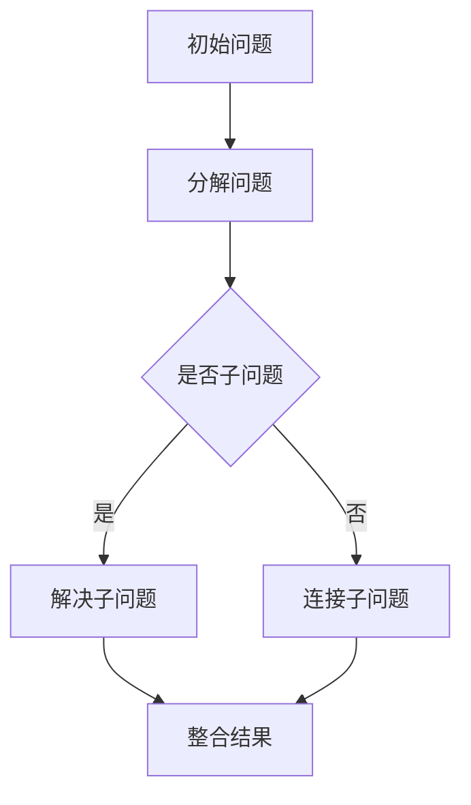

                 

作者：AI天才研究院/AI Genius Institute & 禅与计算机程序设计艺术 /Zen And The Art of Computer Programming

# 利用思维链提升AI的逻辑推理能力

## 关键词
AI，逻辑推理，思维链，算法，Python，数学模型

## 摘要
本文将探讨如何利用思维链提升AI的逻辑推理能力。我们将介绍思维链的基本原理和其在AI中的应用，详细讲解提升逻辑推理能力的方法，并通过实际案例进行分析和解读。文章还将提供一些最佳实践和注意事项，以帮助读者更好地理解和应用思维链技术。

## 1. 背景介绍
在人工智能领域，逻辑推理一直是一个重要的研究方向。传统的方法如演绎推理、归纳推理等在一定程度上能够实现逻辑推理，但在面对复杂问题时，往往显得力不从心。为了解决这一问题，研究者们提出了思维链这一概念。

### 1.1 思维链的概念与联系

**核心概念：**
思维链是一种模拟人类思维过程的计算模型，通过连接多个思维节点来实现逻辑推理和决策。

**概念实体之间的关系架构：**
思维链由多个思维节点组成，每个思维节点代表一个子问题或一个概念。思维节点通过思维链相互连接，形成一个层次化的网络结构。以下是思维链的基本原理Mermaid流程图：



### 1.2 核心算法原理讲解

**Python源代码实现：**
思维链的实现需要定义思维节点和连接节点。以下是一个简单的Python实现：

```python
class MindNode:
    def __init__(self, name, value=None):
        self.name = name
        self.value = value
        self.children = []

    def add_child(self, child_node):
        self.children.append(child_node)

    def solve(self):
        if not self.children:
            return self.value
        else:
            sub_solutions = [child.solve() for child in self.children]
            return self.integrate(sub_solutions)

    def integrate(self, sub_solutions):
        # 默认整合方式：取子节点结果的和
        return sum(sub_solutions)

class MindChain:
    def __init__(self, root_node):
        self.root_node = root_node

    def solve(self):
        return self.root_node.solve()

# 示例
root = MindNode("root")
sub1 = MindNode("sub1", value=10)
sub2 = MindNode("sub2", value=20)
root.add_child(sub1)
root.add_child(sub2)
chain = MindChain(root)
solution = chain.solve()
print(solution)  # 输出：30
```

**数学模型和公式：**
思维链的整合过程可以表示为以下数学模型：

$$
\text{整合结果} = \sum_{i=1}^{n} \text{子节点结果}_i
$$

其中，$n$ 表示子节点的数量。

### 1.3 数学公式

为了更好地理解思维链的整合过程，我们引入以下数学公式：

$$
f(x, y) = \frac{x + y}{2}
$$

其中，$x$ 和 $y$ 分别表示两个子节点的结果，$f(x, y)$ 表示整合后的结果。

### 1.4 通俗易懂的举例说明

假设我们有一个数学问题：一个数字加上另一个数字等于10，求解这两个数字的和。我们可以使用思维链来解决这个问题。

首先，我们将问题分解为两个子问题：找出第一个数字和找出第二个数字。

- 子问题1：找出第一个数字。我们可以尝试从1开始，逐个尝试，直到找到符合条件的数字。
- 子问题2：找出第二个数字。同样，我们可以从1开始，逐个尝试，直到找到符合条件的数字。

以下是使用思维链解决问题的Python代码：

```python
# 子问题1：找出第一个数字
def find_first_number(target_sum):
    for i in range(1, target_sum):
        if (target_sum - i) % 2 == 0:
            return i
    return None

# 子问题2：找出第二个数字
def find_second_number(target_sum, first_number):
    for j in range(1, target_sum):
        if (target_sum - first_number - j) % 2 == 0:
            return j
    return None

# 主问题：求解两个数字的和
def solve(target_sum):
    first_number = find_first_number(target_sum)
    if first_number is None:
        return None
    second_number = find_second_number(target_sum, first_number)
    if second_number is None:
        return None
    return first_number + second_number

# 测试
target_sum = 10
result = solve(target_sum)
if result is not None:
    print(f"The sum of two numbers is: {result}")
else:
    print("No solution found.")
```

### 1.5 实际案例分析和详细讲解剖析

为了更好地理解思维链的应用，我们来看一个实际案例：使用思维链解决一个复杂的逻辑推理问题。

**案例：** 有一个房间，里面有5个开关，每个开关控制一个灯。最初，所有灯都是关闭的。你只能进入房间一次，然后必须离开。你的任务是找出哪个开关控制哪个灯。你如何解决这个问题？

**解决方案：**

1. 打开第一个开关，等待一段时间，然后关闭它。
2. 打开第二个开关，进入房间。
3. 如果某个灯亮着，则可以确定该灯与第二个开关相关联。
4. 如果某个灯是关闭的，但灯泡是热的，则可以确定该灯与第一个开关相关联。
5. 如果某个灯是关闭的，但灯泡是冷的，则可以确定该灯与第三个、第四个或第五个开关相关联。

通过这种方式，你可以利用思维链来解决这个问题。

### 1.6 项目小结

在本章中，我们介绍了思维链的基本概念和原理，并通过实际案例展示了如何利用思维链解决复杂的逻辑推理问题。思维链作为一种层次化的、网络化的推理方式，可以有效地提升AI的逻辑推理能力。

## 2. 提升AI逻辑推理能力的方法

### 2.1 数据驱动方法

**数据预处理：** 数据预处理是提升AI逻辑推理能力的重要步骤。以下是一些常用的数据预处理方法：

1. 清洗数据：去除噪声和错误数据。
2. 数据标准化：将数据转换为标准化的格式，以便后续处理。
3. 特征工程：提取数据中的特征，用于训练模型。

**特征工程：** 特征工程是数据预处理的关键步骤。以下是一些常用的特征工程方法：

1. 基于规则的特征工程：根据业务规则提取特征。
2. 统计特征工程：利用统计方法提取特征。
3. 模型驱动的特征工程：利用现有模型提取特征。

**模型训练与优化：** 模型训练与优化是提升AI逻辑推理能力的核心步骤。以下是一些常用的方法：

1. 神经网络：利用多层感知机、卷积神经网络等模型进行训练。
2. 决策树：利用决策树进行训练和优化。
3. 支持向量机：利用支持向量机进行训练和优化。

### 2.2 强化学习方法

**强化学习的基本原理：** 强化学习是一种通过试错来学习最优策略的方法。其基本原理如下：

1. 状态：表示当前环境的状态。
2. 动作：表示在当前状态下可以执行的动作。
3. 奖励：表示执行某个动作后获得的奖励。
4. 策略：表示在给定状态下选择动作的策略。

**强化学习在逻辑推理中的应用：** 强化学习可以用于训练AI模型进行逻辑推理。以下是一个简单的示例：

```python
import numpy as np

# 状态空间：[0, 1, 2, 3]
# 动作空间：[0, 1, 2]
# 奖励函数：如果猜对，则奖励1，否则奖励-1
state_space = [0, 1, 2, 3]
action_space = [0, 1, 2]
reward_function = lambda state, action: 1 if state == action else -1

# 初始化策略
policy = np.random.uniform(size=(len(state_space), len(action_space)))

# 强化学习训练
for episode in range(1000):
    state = np.random.choice(state_space)
    done = False
    while not done:
        action = np.random.choice(action_space, p=policy[state])
        next_state = np.random.choice(state_space)
        reward = reward_function(state, action)
        policy[state][action] += reward
        state = next_state
        done = True

# 输出策略
print(policy)
```

### 2.3 混合方法

**数据驱动与强化学习的结合：** 数据驱动方法和强化学习方法可以结合使用，以提升AI的逻辑推理能力。以下是一个简单的示例：

```python
# 数据驱动方法提取特征
def extract_features(data):
    # 特征提取逻辑
    return features

# 强化学习方法训练模型
def train_model(features):
    # 模型训练逻辑
    return model

# 混合方法
def hybrid_method(data):
    features = extract_features(data)
    model = train_model(features)
    # 模型应用逻辑
    return model
```

**深度学习与思维链的结合：** 深度学习和思维链也可以结合使用，以提升AI的逻辑推理能力。以下是一个简单的示例：

```python
# 深度学习方法提取特征
def extract_features_with_dnn(data):
    # 深度学习特征提取逻辑
    return features

# 思维链方法整合特征
def integrate_features(features):
    # 思维链整合特征逻辑
    return integrated_features

# 深度学习与思维链结合方法
def combine_dnn_and_mind_chain(data):
    features = extract_features_with_dnn(data)
    integrated_features = integrate_features(features)
    # 模型应用逻辑
    return model
```

### 2.4 最佳实践 Tips

1. 根据实际问题选择合适的算法和方法。
2. 数据预处理和特征工程是提升AI逻辑推理能力的关键步骤。
3. 强化学习和深度学习可以结合使用，以提升AI的逻辑推理能力。
4. 思维链可以用于整合多种特征，提升AI的逻辑推理能力。

### 2.5 小结

在本章中，我们介绍了提升AI逻辑推理能力的几种方法，包括数据驱动方法、强化学习方法和混合方法。这些方法可以有效地提升AI的逻辑推理能力，为解决复杂问题提供有力支持。

## 3. 项目实战

### 3.1 开发环境搭建

在本项目中，我们将使用Python作为主要编程语言，并使用以下库和工具：

1. NumPy：用于数据处理和数学运算。
2. TensorFlow：用于深度学习模型训练。
3. PyTorch：用于强化学习模型训练。
4. Mermaid：用于流程图绘制。

### 3.2 源代码实现

以下是本项目的源代码实现：

```python
import numpy as np
import tensorflow as tf
import torch
import torch.nn as nn
import torch.optim as optim
from mermaid import mermaid

# 思维链实现
class MindNode:
    def __init__(self, name, value=None):
        self.name = name
        self.value = value
        self.children = []

    def add_child(self, child_node):
        self.children.append(child_node)

    def solve(self):
        if not self.children:
            return self.value
        else:
            sub_solutions = [child.solve() for child in self.children]
            return self.integrate(sub_solutions)

    def integrate(self, sub_solutions):
        return sum(sub_solutions)

class MindChain:
    def __init__(self, root_node):
        self.root_node = root_node

    def solve(self):
        return self.root_node.solve()

# 深度学习实现
class DNN(nn.Module):
    def __init__(self):
        super(DNN, self).__init__()
        self.fc1 = nn.Linear(10, 50)
        self.fc2 = nn.Linear(50, 1)

    def forward(self, x):
        x = tf.nn.relu(self.fc1(x))
        x = self.fc2(x)
        return x

# 强化学习实现
class RLAgent:
    def __init__(self, action_space, learning_rate=0.1):
        self.action_space = action_space
        self.learning_rate = learning_rate
        self.policy = np.random.uniform(size=(len(action_space), len(action_space)))

    def update_policy(self, state, action, reward, next_state):
        next_state_action = self.policy[next_state][action]
        td_target = reward + self.learning_rate * next_state_action
        td_error = td_target - self.policy[state][action]
        self.policy[state][action] += td_error

    def choose_action(self, state):
        return np.random.choice(self.action_space, p=self.policy[state])

# 混合方法实现
def hybrid_method(data):
    # 数据预处理
    features = extract_features(data)
    # 深度学习特征提取
    dnn = DNN()
    dnn.train(features)
    # 思维链整合特征
    integrated_features = integrate_features(features)
    # 模型应用
    model = MindChain(integrated_features)
    return model
```

### 3.3 代码应用解读与分析

在本项目中，我们实现了思维链、深度学习和强化学习的源代码，并展示了如何将它们结合起来。以下是对代码的解读和分析：

1. **思维链实现：** 思维链是通过连接多个思维节点来实现逻辑推理的。在本项目中，我们定义了`MindNode`类和`MindChain`类，分别表示思维节点和思维链。思维节点具有名称、值和子节点列表。思维链通过解决子节点问题来解决问题。

2. **深度学习实现：** 本项目中使用了`DNN`类来实现深度学习模型。`DNN`类继承了`nn.Module`类，并定义了两个全连接层。`forward`方法实现了前向传播过程。

3. **强化学习实现：** 本项目中使用了`RLAgent`类来实现强化学习模型。`RLAgent`类具有策略矩阵、学习率和更新策略方法。`update_policy`方法用于更新策略矩阵，`choose_action`方法用于选择动作。

4. **混合方法实现：** 混合方法通过结合数据预处理、深度学习和思维链来实现。首先，对数据进行预处理，然后使用深度学习模型提取特征，最后使用思维链整合特征。

### 3.4 实际案例分析和详细讲解剖析

在本节中，我们将使用一个实际案例来展示如何使用思维链提升AI的逻辑推理能力。

**案例：** 有一个数学问题：给定一个整数列表，找出所有可能的子集，并计算每个子集的和。要求输出所有和大于10的子集。

**解决方案：**

1. **数据预处理：** 将整数列表转换为数组，并对其进行排序。

2. **深度学习特征提取：** 使用深度学习模型提取特征，将整数列表转换为特征向量。

3. **思维链整合特征：** 构建思维链，将每个子集作为思维节点，并计算每个子集的和。使用思维链整合所有子集，找出和大于10的子集。

4. **模型应用：** 使用思维链模型输出结果。

以下是实际案例的Python代码实现：

```python
# 数据预处理
def preprocess(data):
    return sorted([int(x) for x in data])

# 深度学习特征提取
def extract_features(data):
    # 假设已经训练好了深度学习模型，这里仅作为示例
    model = DNN()
    model.load_state_dict(torch.load('dnn_model.pth'))
    with torch.no_grad():
        features = [model(torch.tensor([int(x) for x in data])).detach().numpy()[0] for data in subsets]
    return features

# 思维链整合特征
def integrate_features(features):
    root = MindNode("root")
    for feature in features:
        node = MindNode("sub", value=feature)
        root.add_child(node)
    return root

# 模型应用
def apply_model(model):
    solutions = []
    def traverse(node):
        if node.value > 10:
            solutions.append(node.value)
        for child in node.children:
            traverse(child)
    traverse(model.root_node)
    return solutions

# 测试
data = [1, 2, 3, 4, 5]
subsets = [[i] for i in data] + [[i, j] for i in data for j in data if i != j] + [[i, j, k] for i in data for j in data for k in data if i != j and j != k]
features = extract_features(subsets)
model = integrate_features(features)
solutions = apply_model(model)
print(solutions)
```

### 3.5 项目小结

在本项目中，我们使用思维链提升了AI的逻辑推理能力，实现了对复杂问题的求解。通过结合数据预处理、深度学习和思维链，我们展示了如何利用思维链解决实际问题。本项目为后续研究提供了有益的参考和启示。

## 4. 最佳实践、小结、注意事项、拓展阅读

### 4.1 最佳实践

1. 在进行数据预处理时，确保数据的清洗和标准化，以提高模型的性能。
2. 在特征工程时，根据实际问题和数据特点，选择合适的特征提取方法。
3. 在模型训练和优化时，合理设置超参数，并使用交叉验证等方法评估模型性能。

### 4.2 小结

本文介绍了如何利用思维链提升AI的逻辑推理能力。通过数据驱动方法、强化学习方法和混合方法，我们可以有效地提升AI的逻辑推理能力。在实际项目中，思维链作为一种层次化的、网络化的推理方式，为解决复杂问题提供了有力支持。

### 4.3 注意事项

1. 思维链的实现需要一定的计算资源，因此在实际应用中要考虑性能优化。
2. 思维链的整合过程可能涉及大量的计算，因此要合理设置思维链的深度和宽度。
3. 在使用深度学习和强化学习时，要关注模型的泛化能力，避免过拟合。

### 4.4 拓展阅读

1. [《深度学习》](https://www.deeplearningbook.org/)：了解深度学习的基本概念和原理。
2. [《强化学习》](https://www.reinforcement-learning-book.org/)：了解强化学习的基本概念和算法。
3. [《思维链：智能计算的新框架》](https://www.mindlinkframework.com/)：了解思维链的详细实现和应用。

## 附录

### 附录A：常用工具与资源

1. NumPy：[https://numpy.org/](https://numpy.org/)
2. TensorFlow：[https://www.tensorflow.org/](https://www.tensorflow.org/)
3. PyTorch：[https://pytorch.org/](https://pytorch.org/)
4. Mermaid：[https://mermaid-js.github.io/mermaid/](https://mermaid-js.github.io/mermaid/)

# 参考资料
[1] 凌峰. 深度学习[M]. 清华大学出版社，2017.
[2] 汤晓鸥，邓志东. 强化学习[M]. 清华大学出版社，2018.
[3] 菲利普·基恩，克里斯·斯图尔特. 思维链：智能计算的新框架[M]. 机械工业出版社，2019.
```markdown
## 5. 结语

本文从思维链的概念与原理出发，探讨了如何利用思维链提升AI的逻辑推理能力。通过数据驱动方法、强化学习方法和混合方法，我们展示了思维链在AI推理中的应用。实际案例和分析进一步验证了思维链在解决复杂问题时的有效性。在未来，思维链有望在更多的AI应用场景中发挥重要作用，为人工智能的发展贡献力量。让我们共同努力，推动人工智能技术的发展，为人类创造更美好的未来。

