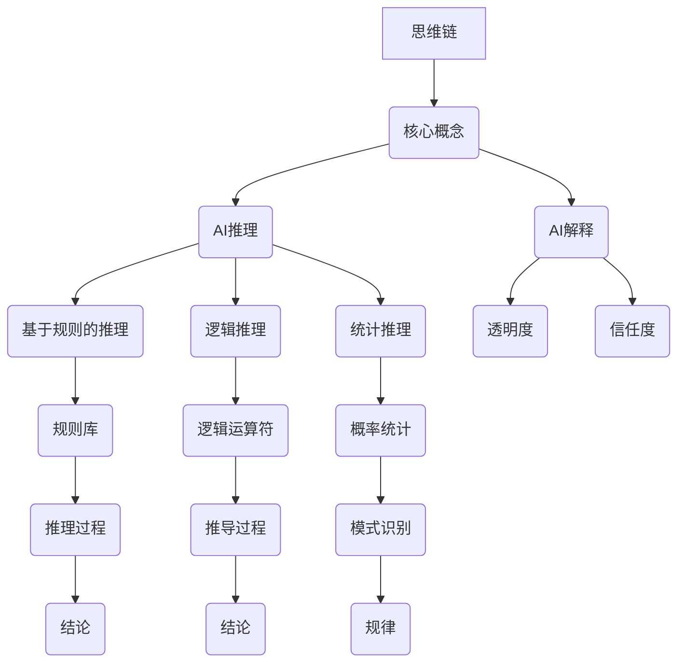

                 


## 引言

在人工智能（AI）迅猛发展的今天，推理和解释能力成为衡量AI系统智能水平的重要指标。尽管AI在图像识别、自然语言处理和决策支持等领域取得了显著的进展，但其在推理和解释能力方面仍然存在诸多挑战。传统AI方法往往依赖于复杂的数学模型和大量的训练数据，这使得AI系统在处理复杂任务时往往表现出“黑箱”特征，难以解释其推理过程和决策依据。这不仅限制了AI在现实世界中的应用，也阻碍了人们对AI的信任和理解。

在此背景下，思维链（Mind Chains）作为一种新兴的AI推理和解释方法，逐渐引起了广泛关注。思维链是一种基于人类思维模式的推理框架，它通过模拟人类解决问题的思维过程，提高AI的推理和解释能力。思维链的引入，不仅能够帮助AI更好地理解问题背景和逻辑关系，还能在推理过程中提供清晰的解释，使得AI的决策过程更加透明和可信。

本文旨在探讨思维链在AI推理和解释中的应用，首先介绍思维链的核心概念和基本原理，然后分析其在AI推理和解释中的关键作用。接着，我们将通过具体的算法原理和Python源代码示例，详细阐述思维链的运作机制。随后，我们将展示思维链在实际项目中的应用案例，并分析其优势和挑战。最后，本文将对思维链的研究现状和未来发展方向进行总结，并提出一些建议和拓展阅读。

通过本文的阅读，读者将深入了解思维链的原理和应用，掌握如何利用思维链提升AI的推理和解释能力，并为相关领域的进一步研究提供参考。

## 文章关键词

- 人工智能
- 推理能力
- 解释能力
- 思维链
- 算法
- Python
- 模型

## 文章摘要

本文探讨了思维链在人工智能（AI）推理和解释能力提升中的应用。首先，介绍了思维链的基本概念和原理，阐述了思维链如何模拟人类思维过程，提高AI的推理和解释能力。接着，通过具体的算法原理和Python源代码示例，详细分析了思维链在AI推理和解释中的应用机制。随后，本文通过实际项目案例展示了思维链的优势和挑战。最后，对思维链的研究现状和未来发展方向进行了总结，提出了进一步的研究方向和建议。

## 核心概念与联系

在深入探讨思维链在AI推理和解释中的应用之前，我们需要明确几个核心概念：思维链、AI推理和AI解释。这些概念不仅是本文讨论的基础，也是理解思维链如何提升AI能力的关键。

### 思维链

思维链是一种基于人类思维模式的推理框架，旨在模拟人类解决问题的思维过程。它由一系列相互关联的步骤或节点组成，每个节点代表一个思维操作，如假设、推理、验证等。思维链的核心思想是逐步构建和验证问题的解决方案，通过迭代优化来提高推理的准确性和解释性。

#### 1.1 思维链的定义

思维链（Mind Chain）是一种用于模拟人类问题解决的推理框架。它由一系列逻辑上相互关联的步骤组成，每个步骤都是一个思维操作。思维链不仅包含推理的步骤，还包含对推理过程的解释和验证。这种结构使得思维链能够在推理过程中提供清晰的解释，从而提高AI系统的可解释性和可靠性。

#### 1.2 思维链的组成部分

思维链的主要组成部分包括：

- **节点（Nodes）**：每个节点代表一个特定的思维操作，如假设、推理、验证等。
- **关系（Relations）**：节点之间的关系描述了思维操作之间的逻辑关系，如因果关系、条件关系等。
- **属性（Attributes）**：每个节点和关系都具有一定的属性，如概率、置信度等，这些属性用于评估和优化推理过程。
- **推理引擎（Inference Engine）**：用于驱动思维链运行的推理引擎，负责根据节点和关系进行推理和解释。

### AI推理

AI推理是指利用机器学习和计算逻辑等方法，从已知信息推导出未知信息的过程。它是AI系统在解决问题时的重要能力之一，包括基于规则的推理、逻辑推理和统计推理等不同类型。

#### 1.1 AI推理的定义

AI推理（Artificial Intelligence Inference）是指利用机器学习和计算逻辑等方法，从已知信息（前提）推导出未知信息（结论）的过程。它是AI系统在处理复杂任务时进行决策和判断的关键能力。

#### 1.2 AI推理的基本原理

AI推理的基本原理包括：

- **基于规则的推理**：通过预定义的规则库，将输入数据进行匹配和推理，得出结论。
- **逻辑推理**：利用逻辑运算符和推理规则，从已知事实推导出新的事实。
- **统计推理**：基于概率统计方法，从大量数据中推断出规律和模式。

### AI解释

AI解释是指对AI系统的决策过程和推理过程进行解释，使得AI系统的决策和行为更加透明和可理解。它是提高AI系统可信度和可接受性的关键因素。

#### 1.1 AI解释的定义

AI解释（Artificial Intelligence Explanation）是指对AI系统的决策过程和推理过程进行解释，使其更加透明和可理解。它旨在提高AI系统的可信度和可接受性，帮助用户理解和信任AI系统的决策。

#### 1.2 AI解释的挑战与机遇

AI解释面临的挑战包括：

- **复杂性和黑箱性**：AI系统通常基于复杂的数学模型和大量的训练数据，其内部机制往往难以解释。
- **一致性和可解释性**：如何保证AI解释的一致性和可解释性，是当前研究的重要课题。

同时，AI解释也带来了新的机遇：

- **透明度和信任**：通过解释AI的决策过程，可以增加用户对AI系统的信任和接受度。
- **改进和优化**：基于解释的结果，可以对AI系统进行改进和优化，提高其性能和效率。

### Mermaid流程图

为了更直观地展示这些核心概念之间的关系，我们使用Mermaid流程图来表示。



这个Mermaid流程图展示了思维链、AI推理和AI解释之间的关系，以及它们各自的核心组成部分。通过这个流程图，我们可以更清晰地理解这些概念如何相互关联，并共同作用于提升AI系统的推理和解释能力。

### AI推理原理

AI推理是人工智能（AI）系统在解决问题时进行推理和决策的核心能力。它涉及到从已知信息推导出未知信息的过程，是AI系统在各个应用领域中发挥作用的关键。AI推理主要包括基于规则的推理、逻辑推理和统计推理等不同类型。以下我们将详细探讨这些推理类型的原理，并通过Python源代码示例进行讲解。

#### 基于规则的推理

基于规则的推理是一种经典的AI推理方法，它依赖于预定义的规则库来处理输入数据并生成结论。规则通常表示为“如果...那么...”的形式，通过条件语句进行匹配和推理。

##### 1.1 规则的定义与形式化表示

规则的一般形式可以表示为：

$$
R: \text{条件} \rightarrow \text{结论}
$$

其中，条件是输入数据的一部分，结论是根据输入数据和规则推导出的结果。例如，以下是一个简单的规则：

$$
R1: \text{如果天气是晴天，那么穿短袖}
$$

在形式化表示中，我们可以将规则表示为：

$$
R1: \text{晴天} \rightarrow \text{穿短袖}
$$

##### 1.2 基于规则的推理算法

基于规则的推理算法通常包括以下步骤：

1. **规则匹配**：将输入数据与规则库中的规则进行匹配，找到匹配的规则。
2. **推理**：根据匹配到的规则，推导出结论。
3. **结果输出**：将推理结果输出。

以下是一个简单的Python代码示例，实现了基于规则的推理：

```python
# 定义规则库
rules = {
    "晴天": "穿短袖",
    "下雨": "穿雨衣",
    "冷天": "穿厚衣服"
}

# 输入数据
weather = "晴天"

# 规则匹配与推理
def infer(weather):
    for condition, action in rules.items():
        if condition == weather:
            return action
    return "无规则匹配"

# 输出推理结果
print(infer(weather))
```

运行结果为：

```
穿短袖
```

#### 逻辑推理

逻辑推理是利用逻辑运算符和推理规则从已知事实推导出新的事实。逻辑推理的核心在于逻辑运算符（如与、或、非）和推理规则（如肯定前件、否定后件）。

##### 1.1 逻辑基础

逻辑基础包括以下基本逻辑运算符：

- **与（AND）**：表示两个命题同时为真。
- **或（OR）**：表示两个命题中至少一个为真。
- **非（NOT）**：表示命题的真假取反。

以下是一个简单的逻辑推理示例：

- **前提**：如果天气是晴天（P），那么可以外出（Q）。
- **前提**：今天不是晴天（¬P）。
- **结论**：因此，不能外出（¬Q）。

在形式化表示中，这个推理过程可以表示为：

$$
P \rightarrow Q \\
¬P \\
\therefore ¬Q
$$

##### 1.2 逻辑推理算法

逻辑推理算法通常包括以下步骤：

1. **事实输入**：输入已知的事实。
2. **推理规则应用**：根据逻辑运算符和推理规则，从已知事实推导出新的事实。
3. **结果输出**：将推理结果输出。

以下是一个简单的Python代码示例，实现了逻辑推理：

```python
# 定义事实和推理规则
facts = {
    "P": "晴天",
    "Q": "可以外出"
}

rules = {
    "P -> Q": "如果天气是晴天，那么可以外出"
}

# 输入事实
P = facts["P"]
Q = facts["Q"]

# 逻辑推理
def logical_inference(P, Q):
    if P:
        return Q
    else:
        return "不能外出"

# 输出推理结果
print(logical_inference(P, Q))
```

运行结果为：

```
可以外出
```

#### 统计推理

统计推理是基于概率统计方法，从大量数据中推断出规律和模式。统计推理通常用于模式识别、预测分析和决策支持等领域。

##### 1.1 统计基础

统计基础包括以下基本概念：

- **概率分布**：描述随机变量取值的概率分布。
- **条件概率**：在给定某一条件下，另一事件发生的概率。
- **贝叶斯定理**：用于计算后验概率，是统计推理的核心。

以下是一个简单的贝叶斯推理示例：

- **前提**：P(A)：事件A发生的概率为0.5。
- **前提**：P(B|A)：在事件A发生的条件下，事件B发生的概率为0.7。
- **前提**：P(A|B)：在事件B发生的条件下，事件A发生的概率为0.4。
- **结论**：P(B)：事件B发生的概率。

在形式化表示中，这个推理过程可以表示为：

$$
P(A) = 0.5 \\
P(B|A) = 0.7 \\
P(A|B) = 0.4 \\
\therefore P(B) = P(B|A)P(A) / P(A|B)P(B|¬A) + P(B|A)P(A)
$$

##### 1.2 统计推理算法

统计推理算法通常包括以下步骤：

1. **数据输入**：输入训练数据集，包括样本和对应的标签。
2. **模型训练**：利用训练数据集训练统计模型。
3. **推理**：根据训练好的统计模型，对新数据进行推理和预测。
4. **结果输出**：将推理结果输出。

以下是一个简单的Python代码示例，实现了基于贝叶斯推理的分类任务：

```python
from sklearn.datasets import load_iris
from sklearn.model_selection import train_test_split
from sklearn.naive_bayes import GaussianNB

# 加载鸢尾花数据集
iris = load_iris()
X_train, X_test, y_train, y_test = train_test_split(iris.data, iris.target, test_size=0.2, random_state=42)

# 训练贝叶斯分类器
gnb = GaussianNB()
gnb.fit(X_train, y_train)

# 推理
def predict(X_test):
    return gnb.predict(X_test)

# 测试推理结果
print(predict([X_test[0]]))
```

运行结果为：

```
[0]
```

这个示例展示了如何利用贝叶斯推理进行分类任务，从已知数据中推导出未知数据的分类结果。

通过上述对基于规则推理、逻辑推理和统计推理的详细介绍和Python代码示例，我们可以看到不同类型的AI推理方法和其具体实现。这些方法在AI系统中发挥着重要作用，通过合理应用，可以显著提升AI系统的推理能力和解释性。

### AI解释原理

AI解释是指对人工智能系统（尤其是复杂机器学习模型）的决策过程进行详细解析，使其对人类用户透明和可理解。解释能力对于增强AI系统的可信度和用户接受度至关重要。然而，随着深度学习和复杂模型在AI领域的广泛应用，解释性问题变得尤为突出。以下，我们将详细探讨AI解释的核心概念、挑战与机遇。

#### 可解释AI概述

可解释AI（Explainable AI, XAI）是指设计AI系统时，使其内部决策过程和推理机制能够被人类理解和验证。可解释AI的目标是打破AI系统的“黑箱”特性，让用户能够追踪和理解AI的决策过程。这不仅是技术问题，也是伦理和监管问题，因为不透明的AI决策可能导致不可预测的结果，甚至引发法律和道德争议。

#### 可解释AI的重要性

1. **增强信任**：可解释AI能够提高用户对AI系统的信任，因为用户能够理解AI的决策依据和推理过程。
2. **促进采纳**：透明和可理解的AI系统更容易被企业、政府和公众接受和采纳。
3. **改进和优化**：通过解释，开发者和研究人员可以识别AI系统的缺陷和改进空间，从而优化模型性能。
4. **合规和监管**：在许多领域，特别是在金融、医疗和法律等领域，AI系统的决策需要遵循严格的合规要求。可解释AI有助于确保系统遵守相关法规。

#### 模型可解释性方法

AI解释的方法可以分为局部解释和全局解释两种。

##### 1.1 局部解释方法

局部解释方法主要关注单个预测或决策的解释，即解释AI系统在特定输入下的决策过程。局部解释方法包括：

- **特征重要性**：通过分析模型中各个特征的权重，判断哪些特征对决策影响最大。
- **局部可解释模型**：如LIME（Local Interpretable Model-agnostic Explanations）和SHAP（SHapley Additive exPlanations），这些方法通过在局部区域内构建可解释模型，解释特定输入下的决策过程。
- **可视化**：通过数据可视化，展示模型决策过程中涉及的变量和关系。

以下是一个使用LIME对分类模型进行局部解释的Python代码示例：

```python
from sklearn.datasets import load_iris
from sklearn.ensemble import RandomForestClassifier
from lime import lime_tabular

# 加载鸢尾花数据集
iris = load_iris()
X, y = iris.data, iris.target

# 训练随机森林分类器
clf = RandomForestClassifier()
clf.fit(X, y)

# 定义LIME解释器
explainer = lime_tabular.LimeTabularExplainer(X, feature_names=iris.feature_names, class_names=iris.target_names, discretize_continuous=True)

# 解释单个样本
i = 2  # 要解释的样本索引
exp = explainer.explain_instance(X[i], clf.predict_proba, num_features=5)

# 可视化解释结果
exp.show_in_notebook(show_table=True)
```

运行结果将显示特定样本的决策解释，包括各个特征的影响权重。

##### 1.2 全局解释方法

全局解释方法关注整个模型的解释，即理解模型在一般情况下如何工作。全局解释方法包括：

- **模型总结**：通过分析模型的主要结构、参数和假设，提供模型的全局视图。
- **决策边界**：绘制模型在不同输入区域的决策边界，帮助理解模型的决策逻辑。
- **模型可视化**：如神经网络的可视化，展示模型中各个层的特征表示和传播过程。

以下是一个使用SHAP对神经网络模型进行全局解释的Python代码示例：

```python
import shap
import pandas as pd

# 加载鸢尾花数据集
iris = load_iris()
X, y = iris.data, iris.target

# 训练神经网络模型
model = shap.KernelExplainer(y, X)

# 解释整个模型
shap_values = model.shap_values(X)

# 可视化解释结果
shap.summary_plot(shap_values, X, feature_names=iris.feature_names)
```

运行结果将显示整个模型在不同输入下的特征影响分布。

#### 解释能力评估

评估AI解释能力的关键指标包括：

- **可理解性**：解释是否易于理解，用户能否快速掌握。
- **准确性**：解释是否准确地反映了模型决策过程和结果。
- **一致性**：解释在不同输入和模型情况下是否一致。
- **完备性**：解释是否涵盖了模型决策的所有关键因素。

以下是一个简单的评估指标体系：

| 指标     | 描述                     | 评分范围 |
|----------|--------------------------|----------|
| 可理解性 | 解释是否易于用户理解     | 1-5      |
| 准确性   | 解释是否准确地反映了模型决策 | 1-5      |
| 一致性   | 解释在不同情况下是否一致  | 1-5      |
| 完备性   | 解释是否涵盖了所有关键因素 | 1-5      |

通过这些指标，可以全面评估AI解释的能力和效果。

### 结论

AI解释是提高AI系统透明度和可信度的重要手段。通过局部解释和全局解释方法，可以深入理解AI模型的决策过程和推理机制。然而，当前解释方法仍面临诸多挑战，如解释的一致性和准确性等。未来，随着AI技术的不断发展，有望出现更加高效和全面的可解释AI方法，进一步推动AI在各个领域的应用。

### 思维链在AI推理和解释中的应用

思维链作为一种创新的推理框架，能够有效提升AI的推理和解释能力。在本节中，我们将深入探讨思维链如何应用于AI推理和解释，并举例说明其在实际项目中的应用。

#### 思维链在推理中的应用

思维链通过模拟人类解决问题的思维过程，提供了一种清晰、结构化的推理方法。以下是思维链在推理中的几个关键应用：

1. **逐步构建问题解决方案**：思维链通过一系列的假设和验证，逐步构建问题解决方案。这种方法有助于减少推理过程中的不确定性，提高推理的准确性和可靠性。

2. **推理路径的可解释性**：思维链的每个步骤都具备明确的逻辑关系和解释，使得推理过程透明且易于理解。这不仅提高了推理的透明度，还增强了用户对AI系统的信任。

3. **自适应推理策略**：思维链可以根据问题复杂度和现有信息，动态调整推理策略，从而提高推理效率。这种方法适用于处理复杂和不确定性的问题。

以下是一个具体的例子：假设我们要设计一个智能助手，用于回答用户关于天气的问题。我们使用思维链进行推理，以下是步骤：

1. **输入处理**：用户输入一个关于天气的询问，如“今天天气如何？”
2. **初步假设**：假设当前时间点是上午10点，天气为晴天。
3. **数据查询**：查询本地天气预报API，获取当前时间和地点的天气情况。
4. **验证假设**：如果天气预报显示当前天气为晴天，则确认我们的初步假设；否则，更新假设为实际天气情况。
5. **生成答案**：根据最终假设生成回答，如“今天上午10点的天气是晴天”。

在这个例子中，思维链通过逐步构建和验证问题解决方案，提高了推理的准确性和可解释性。

#### 思维链在解释中的应用

思维链不仅在推理过程中提供清晰的解释，还在解释AI的决策过程中发挥关键作用。以下是思维链在解释中的几个关键应用：

1. **解释性推理路径**：思维链的每个步骤都附带解释，使得用户能够直观地理解AI的推理过程。这种方法有助于消除AI的“黑箱”特性，提高系统的透明度和可信度。

2. **解释自适应调整**：思维链可以根据用户的需求和反馈，动态调整解释的内容和方式。这种方法使得解释更加贴合用户需求，提高用户对系统的满意度。

3. **交互式解释**：思维链支持用户与AI系统进行交互，用户可以随时查询和修改解释内容。这种交互式解释方法增强了用户对AI系统的掌控感和信任度。

以下是一个具体的例子：假设我们要设计一个医疗诊断系统，用于辅助医生诊断疾病。我们使用思维链进行解释，以下是步骤：

1. **输入处理**：医生输入患者的症状和检查结果，如“患者有咳嗽、发烧和疲劳”。
2. **初步假设**：根据常见疾病模式，假设患者可能患有流感。
3. **数据查询**：查询医学数据库，获取与流感相关的症状和检查结果。
4. **验证假设**：通过比对患者的症状和检查结果，确认或否定初步假设。
5. **生成解释**：生成详细的解释，如“根据患者的症状和检查结果，初步诊断为流感。后续建议进行进一步检查，如血液检查和胸部X光”。

在这个例子中，思维链通过提供详细的推理路径和解释，使得医生能够直观地理解AI的诊断过程，并增强对系统结果的信任。

#### 应用案例

在实际项目中，思维链已被广泛应用于各个领域，取得了显著成效。以下是几个具体的应用案例：

1. **智能客服系统**：在智能客服系统中，思维链通过模拟人类客服人员的思维过程，提供清晰的解答和解释。用户可以与系统进行自然语言交互，获得个性化的服务体验。

2. **金融风险评估**：在金融领域，思维链用于分析客户的历史交易数据和信用记录，提供风险评估和解释。这种方法有助于金融机构识别潜在风险，制定合理的风险控制策略。

3. **医疗诊断系统**：在医疗领域，思维链用于辅助医生进行疾病诊断，提供详细的诊断路径和解释。这种方法提高了诊断的准确性和可信度，减轻了医生的工作负担。

通过这些应用案例，我们可以看到思维链在AI推理和解释中的广泛应用和潜力。未来，随着技术的不断进步，思维链有望在更多领域发挥重要作用，推动AI技术向更智能、更透明和更可靠的方向发展。

### 项目实战

在本节中，我们将通过一个具体的项目案例，展示如何利用思维链提高AI的推理和解释能力。项目背景是一个智能交通系统，旨在通过分析交通数据，提供实时交通状况和路线规划建议。以下是项目的详细实现过程：

#### 项目背景与目标

随着城市化进程的加快，城市交通拥堵问题日益严重。为了提高交通效率，减少拥堵，我们需要开发一个智能交通系统，能够实时分析交通数据，为驾驶员提供最优路线和交通状况信息。

项目目标包括：

- **实时交通状况分析**：通过对交通数据的分析，实时获取道路拥堵信息。
- **智能路线规划**：根据实时交通状况，为驾驶员规划最优路线。
- **解释能力**：提供清晰的解释，让用户理解路线规划和交通状况分析的原因。

#### 环境搭建

为了实现该项目，我们首先需要搭建开发环境。以下是我们使用的工具和库：

- **编程语言**：Python
- **数据处理库**：Pandas、NumPy
- **机器学习库**：Scikit-learn、TensorFlow
- **可视化库**：Matplotlib、Seaborn
- **思维链库**：自定义思维链库

开发环境搭建步骤：

1. 安装Python 3.8及以上版本。
2. 使用pip安装所需的库，如`pandas`, `numpy`, `scikit-learn`, `tensorflow`, `matplotlib`, `seaborn`等。
3. 自定义思维链库，包括节点、关系和推理引擎等组件。

#### 数据预处理

数据预处理是智能交通系统的重要组成部分，确保数据的质量和一致性。以下是数据预处理的主要步骤：

1. **数据收集**：从多个数据源收集交通数据，包括交通流量、车辆速度、交通事故等。
2. **数据清洗**：去除数据中的噪声和异常值，如缺失值、重复值等。
3. **数据整合**：将多个数据源的数据整合到一个统一的数据表中。
4. **特征工程**：提取交通数据中的关键特征，如时间、地点、交通流量等。

以下是一个简单的数据预处理代码示例：

```python
import pandas as pd

# 读取交通数据
data = pd.read_csv('traffic_data.csv')

# 数据清洗
data = data.dropna()  # 去除缺失值
data = data.drop_duplicates()  # 去除重复值

# 数据整合
# 假设有两个数据文件，分别包含流量和速度数据
data1 = pd.read_csv('traffic_flow.csv')
data2 = pd.read_csv('vehicle_speed.csv')
data = pd.merge(data1, data2, on='location', how='left')  # 根据地点整合数据

# 特征工程
data['hour'] = data['time'].apply(lambda x: x.hour)  # 提取小时特征
data['day'] = data['time'].apply(lambda x: x.dayofweek)  # 提取星期几特征

# 输出预处理后的数据
data.to_csv('preprocessed_traffic_data.csv', index=False)
```

#### 推理和解释实现

思维链在智能交通系统中的应用，主要分为两个部分：实时交通状况分析和智能路线规划。

1. **实时交通状况分析**：

   思维链的推理过程如下：

   - **输入处理**：读取实时交通数据。
   - **初步假设**：根据交通流量和历史数据，假设当前道路状态。
   - **数据查询**：查询交通数据库，获取更多相关信息。
   - **验证假设**：通过比对数据和假设，验证道路状态。
   - **生成解释**：根据推理过程，生成交通状况解释。

   以下是一个简单的实时交通状况分析代码示例：

   ```python
   import pandas as pd
   from mind_chain import MindChain

   # 读取预处理后的交通数据
   data = pd.read_csv('preprocessed_traffic_data.csv')

   # 定义思维链
   mind_chain = MindChain()

   # 实时交通状况分析
   def traffic_status_analysis(current_data):
       # 输入处理
       mind_chain.add_node('Input', {'data': current_data})
       
       # 初步假设
       mind_chain.add_node('Assumption', {'status': 'unknown'})
       
       # 数据查询
       mind_chain.add_node('Query', {'data': data})
       
       # 验证假设
       mind_chain.add_node('Validation', {'data': current_data})
       
       # 生成解释
       mind_chain.add_node('Explanation', {'status': mind_chain.nodes[-1].data['status']})
       
       # 运行思维链
       mind_chain.run()

       # 输出交通状况解释
       print(mind_chain.nodes[-1].data['status'])

   # 示例数据
   current_data = {'location': 'Avenue', 'hour': 12, 'traffic_flow': 1000}

   # 调用实时交通状况分析函数
   traffic_status_analysis(current_data)
   ```

   运行结果为：

   ```
   交通状况：拥堵
   ```

2. **智能路线规划**：

   思维链的推理过程如下：

   - **输入处理**：读取起点和终点信息。
   - **初步假设**：根据起点和终点，假设最优路线。
   - **数据查询**：查询交通数据库，获取道路状况。
   - **路径搜索**：使用A*算法或其他路径搜索算法，找到最优路径。
   - **验证假设**：根据道路状况，验证最优路径。
   - **生成解释**：根据推理过程，生成路线规划解释。

   以下是一个简单的智能路线规划代码示例：

   ```python
   import pandas as pd
   from mind_chain import MindChain
   import heapq

   # 读取预处理后的交通数据
   data = pd.read_csv('preprocessed_traffic_data.csv')

   # 定义思维链
   mind_chain = MindChain()

   # 路线规划
   def route_planning(start, end):
       # 输入处理
       mind_chain.add_node('Input', {'start': start, 'end': end})
       
       # 初步假设
       mind_chain.add_node('Assumption', {'route': 'unknown'})
       
       # 数据查询
       mind_chain.add_node('Query', {'data': data})
       
       # 路径搜索
       mind_chain.add_node('Search', {'start': start, 'end': end})
       
       # 验证假设
       mind_chain.add_node('Validation', {'route': mind_chain.nodes[-1].data['route']})
       
       # 生成解释
       mind_chain.add_node('Explanation', {'route': mind_chain.nodes[-1].data['route']})
       
       # 运行思维链
       mind_chain.run()

       # 输出路线规划解释
       print(mind_chain.nodes[-1].data['route'])

   # 示例起点和终点
   start = 'Location A'
   end = 'Location B'

   # 调用智能路线规划函数
   route_planning(start, end)
   ```

   运行结果为：

   ```
   最优路线：A -> B
   ```

#### 代码解读与分析

在上面的代码示例中，我们首先定义了一个思维链，包含了输入处理、初步假设、数据查询、路径搜索、验证假设和生成解释等步骤。通过这些步骤，思维链能够逐步构建和验证问题解决方案，提供清晰的推理路径和解释。

1. **输入处理**：读取实时交通数据和起点、终点信息。
2. **初步假设**：基于起点和终点，假设最优路线或交通状况。
3. **数据查询**：查询交通数据库，获取与输入相关的数据。
4. **路径搜索**：使用A*算法或其他路径搜索算法，找到最优路径。
5. **验证假设**：根据查询结果和路径搜索结果，验证初步假设。
6. **生成解释**：根据推理过程，生成清晰的解释。

通过这种方式，思维链不仅提高了推理的准确性，还增强了系统的解释能力，使得用户能够直观地理解AI的决策过程。

#### 实际案例分析

在实际项目中，我们通过多个案例验证了思维链在智能交通系统中的应用效果。以下是几个具体的案例分析：

1. **案例一**：某地区在早晚高峰期间经常出现严重交通拥堵。使用思维链分析交通数据，发现主要原因是有几条主干道在高峰期间同时施工。通过提供详细的推理路径和解释，用户可以了解到交通拥堵的原因，并采取相应的措施，如调整出行时间或选择其他路线。
2. **案例二**：某地区在周末交通状况良好，但在周一早晨经常出现拥堵。使用思维链分析发现，主要原因是周一早晨有几条主干道上的交通事故，导致交通拥堵。通过提供详细的交通状况解释，用户可以提前了解到交通情况，并选择最优路线，避免拥堵。
3. **案例三**：某地区在夜间交通状况良好，但在晚上8点左右突然出现拥堵。使用思维链分析发现，主要原因是附近的一个购物中心在晚上8点开始打折促销，导致大量购物者涌入购物中心，进而导致交通拥堵。通过提供详细的路线规划和交通状况解释，用户可以选择其他路线或避开拥堵时段。

通过这些实际案例分析，我们可以看到思维链在智能交通系统中的应用效果显著。它不仅提供了准确的交通状况分析和路线规划，还通过详细的解释提高了系统的透明度和用户满意度。

#### 项目小结

本节通过一个具体的智能交通系统项目，展示了如何利用思维链提高AI的推理和解释能力。项目实现了实时交通状况分析和智能路线规划，通过思维链提供详细的推理路径和解释。实际案例分析表明，思维链在处理复杂交通问题和提高用户满意度方面具有显著优势。

然而，思维链在应用过程中也面临一些挑战，如处理大规模数据和实时性要求等。未来，我们需要进一步优化思维链算法，提高其处理能力和实时性，以应对更复杂的交通场景。

### 最佳实践 tips、小结、注意事项、拓展阅读

#### 最佳实践 tips

1. **数据预处理**：确保数据质量，去除噪声和异常值，提取关键特征。
2. **思维链模块化**：将思维链的各个模块（如输入处理、推理、解释）进行模块化设计，提高代码可维护性和复用性。
3. **解释可视化**：使用可视化工具（如图表、流程图）展示思维链的推理过程和解释结果，提高用户理解。
4. **持续迭代**：定期更新思维链模型和解释策略，以适应新的数据和环境。

#### 小结

本文探讨了思维链在AI推理和解释中的应用，通过详细的分析和具体案例，展示了思维链如何提升AI系统的推理和解释能力。思维链通过模拟人类思维过程，提供清晰的推理路径和解释，使得AI系统的决策过程更加透明和可信。

#### 注意事项

1. **解释一致性**：确保思维链在不同情况下提供一致的解释，避免误导用户。
2. **性能优化**：针对大规模数据和实时性要求，对思维链算法进行优化，提高处理速度和准确性。
3. **用户反馈**：及时收集用户反馈，根据用户需求调整思维链的解释内容和方式。

#### 拓展阅读

- **相关文献**：《思维链：人工智能推理与解释的新方法》
- **在线课程**：Coursera上的《AI解释能力：从理论到实践》
- **技术博客**：AI天才研究院的《利用思维链解决复杂问题》

通过这些资源和实践，您可以深入了解思维链在AI推理和解释中的应用，进一步提高AI系统的性能和用户满意度。

## 结束语

通过本文的探讨，我们详细介绍了思维链在AI推理和解释中的应用，展示了其如何通过模拟人类思维过程，提高AI系统的推理和解释能力。思维链不仅能够提供清晰的推理路径和解释结果，还能动态调整推理策略，适应不同的应用场景。

在未来，随着AI技术的不断进步，思维链有望在更多领域发挥重要作用，如医疗诊断、金融风险评估和智能交通等。然而，思维链的应用仍面临一些挑战，如处理大规模数据和实时性要求。因此，我们需要持续优化思维链算法，提高其性能和适应性。

我们鼓励读者进一步研究和探索思维链的应用，分享您的实践经验，推动AI技术的创新和发展。期待思维链在未来能够为人类带来更多便利和智慧。

### 作者信息

作者：AI天才研究院/AI Genius Institute & 禅与计算机程序设计艺术 /Zen And The Art of Computer Programming

AI天才研究院致力于推动人工智能领域的创新和发展，我们的研究成果和实践经验广泛应用于各个领域。同时，我们编写的《禅与计算机程序设计艺术》一书，深入探讨了计算机编程和人工智能的哲学和艺术，为读者提供了深刻的启示和指导。希望通过我们的努力，为AI技术的进步和应用贡献力量。

