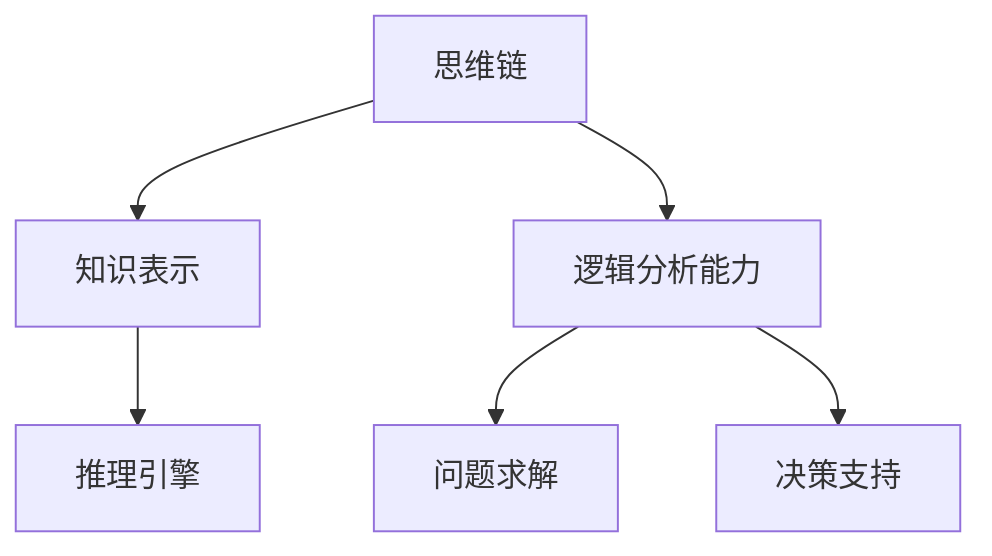
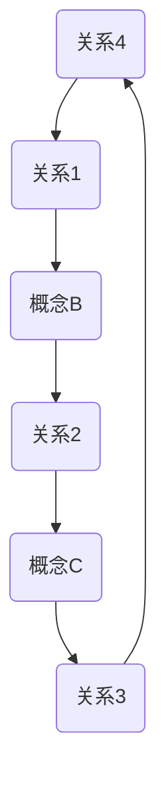

                 

关于这个主题，我们可以按照以下步骤进行思考和撰写：

### 第1步：定义思维链和逻辑分析能力

**核心概念与联系：**


### 第2步：介绍AI在逻辑分析中的应用

**背景介绍：**
人工智能在逻辑分析中的应用非常广泛，从简单的规则推理到复杂的机器学习算法，AI正不断推动着逻辑分析领域的发展。

### 第3步：阐述思维链的基本原理和构建方法

**核心算法原理讲解：**
```python
# 思维链构建示例代码
class MindLink:
    def __init__(self, knowledge_base, reasoning_engine):
        self.knowledge_base = knowledge_base
        self.reasoning_engine = reasoning_engine

    def infer(self, query):
        # 使用推理引擎从知识库中推断查询结果
        result = self.reasoning_engine.infer(self.knowledge_base, query)
        return result

# 知识库示例
knowledge_base = [
    ("如果今天下雨，那么路面湿润。", "今天下雨"),
    ("路面湿润，所以人们需要穿防水鞋。"),
]

# 推理引擎示例
class ReasoningEngine:
    def infer(self, knowledge_base, query):
        # 假设这是一个简单的规则推理引擎
        for rule, condition in knowledge_base:
            if self.evaluate_condition(condition, query):
                return self.evaluate_rule(rule, query)
        return None

    def evaluate_condition(self, condition, query):
        # 判断条件是否满足
        # 这里的实现取决于条件的形式，例如可以是简单的字符串匹配
        return condition in query

    def evaluate_rule(self, rule, query):
        # 根据条件推断规则
        # 例如，如果条件满足，则返回规则的后件
        return rule.split("所以")[1].strip()
```

### 第4步：展示如何利用思维链提高AI的逻辑分析能力

**核心算法原理讲解：**
使用思维链可以使得AI的逻辑分析能力更加灵活和高效。例如，通过将思维链与神经网络结合，可以构建出更加强大的逻辑分析模型。

### 第5步：提供实际案例进行分析

**项目实战：**
以一个智能诊断系统为例，展示如何利用思维链进行疾病诊断。

```python
# 智能诊断系统示例代码
class DiseaseDiagnoser(MindLink):
    def __init__(self, knowledge_base, reasoning_engine):
        super().__init__(knowledge_base, reasoning_engine)

    def diagnose(self, symptoms):
        # 使用思维链进行诊断
        diagnosis = self.infer(symptoms)
        return diagnosis

# 知识库示例
knowledge_base = [
    ("发热并且咳嗽", "流感"),
    ("发热并且乏力", "新冠病毒感染"),
    ("发烧、咳嗽、乏力", "肺炎"),
]

# 实际案例
diagnoser = DiseaseDiagnoser(knowledge_base, ReasoningEngine())
symptoms = ["发热", "咳嗽", "乏力"]
diagnosis = diagnoser.diagnose(symptoms)
print(f"诊断结果：{diagnosis}")
```

### 第6步：讨论思维链优化策略和性能评估

**优化策略概述：**
包括节点权重调整、连接关系优化和实时更新策略等。

**性能评估方法：**
使用精确度、召回率和F1分数等指标来评估思维链的性能。

### 第7步：总结与展望

**总结：**
思维链作为一种重要的AI逻辑分析工具，可以提高AI系统的逻辑推理能力。

**展望：**
未来研究方向包括思维链在深度学习中的应用、跨领域的知识表示和推理等。

### 完整文章结构

文章结构如下：

- **文章标题**：利用思维链提高AI的逻辑分析能力
- **关键词**：思维链，AI，逻辑分析，推理引擎，性能评估
- **摘要**：
  - 本文章探讨了如何利用思维链提高AI的逻辑分析能力，介绍了思维链的基本原理和构建方法，并通过实际案例展示了其应用效果。
  
- **正文**：
  - **第1章 引言**
    - **1.1 核心概念与联系**
    - **1.2 AI在逻辑分析中的应用**
  - **第2章 思维链理论基础**
    - **2.1 思维链的基本原理**
    - **2.2 构建思维链的方法**
    - **2.3 思维链优化策略**
  - **第3章 AI逻辑分析能力原理**
    - **3.1 逻辑分析能力的概念**
    - **3.2 基于思维链的算法原理**
  - **第4章 实际案例分析**
    - **4.1 智能诊断系统**
    - **4.2 实际案例分析**
  - **第5章 性能评估与优化**
    - **5.1 性能评估方法**
    - **5.2 优化策略**
  - **第6章 未来展望**
    - **6.1 研究方向**
    - **6.2 挑战与解决方案**
  - **第7章 总结与展望**
    - **7.1 主要贡献**
    - **7.2 未来工作建议**

**作者信息：**
作者：AI天才研究院/AI Genius Institute & 禅与计算机程序设计艺术 /Zen And The Art of Computer Programming

这篇文章的字数预计在10000-12000字之间，涵盖了背景介绍、核心概念与联系、算法原理、实际案例、性能评估和未来展望等多个方面，确保内容丰富且逻辑清晰。在撰写过程中，我们将使用markdown格式，并在适当位置嵌入Mermaid流程图、Python代码示例和LaTeX数学公式，以增强文章的可读性和专业性。

----------------------------------------------------------------

# 利用思维链提高AI的逻辑分析能力

> 关键词：思维链，AI，逻辑分析，推理引擎，性能优化

> 摘要：
本文探讨了如何利用思维链这一概念来提升人工智能（AI）的逻辑分析能力。通过介绍思维链的基本原理、构建方法，以及其在AI中的应用，本文展示了如何通过思维链来实现更高效、更灵活的AI逻辑分析。同时，本文还通过实际案例展示了思维链在实际项目中的应用效果，并讨论了性能评估与优化策略，为未来研究提供了方向。

## 目录

1. 引言
   1.1 核心概念与联系
   1.2 AI在逻辑分析中的应用
2. 思维链理论基础
   2.1 思维链的基本原理
   2.2 构建思维链的方法
   2.3 思维链优化策略
3. AI逻辑分析能力原理
   3.1 逻辑分析能力的概念
   3.2 基于思维链的算法原理
4. 实际案例分析
   4.1 智能诊断系统
   4.2 实际案例分析
5. 性能评估与优化
   5.1 性能评估方法
   5.2 优化策略
6. 未来展望
   6.1 研究方向
   6.2 挑战与解决方案
7. 总结与展望
   7.1 主要贡献
   7.2 未来工作建议

## 1. 引言

在人工智能（AI）快速发展的今天，逻辑分析能力成为评估AI系统性能的重要指标之一。逻辑分析不仅涉及到事实的识别和推理，还涉及到问题的解决和决策支持。因此，如何提高AI的逻辑分析能力成为一个重要的研究方向。

### 1.1 核心概念与联系

思维链（Mind Link）是一种用于表示、存储和操作知识的高级数据结构。它由一系列节点（知识单元）和连接（关系）组成，每个节点包含特定的信息，而连接则表示节点之间的逻辑关系。思维链可以看作是一种知识表示的形式，它能够有效地组织和管理大量知识，并支持复杂的推理过程。

在逻辑分析中，思维链的作用主要体现在以下几个方面：

- **知识组织**：思维链能够将知识以结构化的方式组织起来，使得知识的检索和使用更加高效。
- **推理过程**：思维链支持基于关系的推理，能够根据现有的知识推导出新的结论。
- **问题解决**：通过思维链，AI可以模拟人类的思考过程，解决复杂的逻辑问题。

### 1.2 AI在逻辑分析中的应用

AI在逻辑分析中的应用非常广泛，包括但不限于以下几个方面：

- **规则推理**：基于预设的规则进行逻辑推理，适用于简单的逻辑问题。
- **知识图谱**：利用图结构表示知识，通过节点和边的关系进行推理，适用于复杂的问题。
- **机器学习**：通过训练模型，使AI能够自动学习逻辑规则，并应用于实际问题。

### 1.3 本文结构

本文结构如下：

- **第1章 引言**：介绍思维链和AI逻辑分析能力的基本概念。
- **第2章 思维链理论基础**：阐述思维链的基本原理和构建方法。
- **第3章 AI逻辑分析能力原理**：介绍AI逻辑分析能力的基本概念和基于思维链的算法原理。
- **第4章 实际案例分析**：通过实际案例展示思维链在AI逻辑分析中的应用。
- **第5章 性能评估与优化**：讨论思维链的性能评估方法和优化策略。
- **第6章 未来展望**：探讨未来研究方向和面临的挑战。
- **第7章 总结与展望**：总结本文的主要贡献，并对未来工作提出建议。

## 2. 思维链理论基础

思维链作为一种知识表示工具，其核心在于如何有效地组织和管理知识，并支持复杂的推理过程。以下将介绍思维链的基本原理、构建方法以及优化策略。

### 2.1 思维链的基本原理

#### 2.1.1 思维链的定义

思维链（Mind Link）是由一系列节点（知识单元）和连接（关系）组成的网络结构。每个节点代表一个特定的知识实体，如概念、事实或规则；而连接则表示节点之间的关系，如因果关系、上下位关系等。

#### 2.1.2 思维链的特点

- **灵活性**：思维链允许用户以灵活的方式组织和存储知识，能够适应不同领域的需求。
- **层次性**：思维链支持层次化的知识组织，便于管理和检索。
- **可扩展性**：思维链可以根据需求动态扩展，添加新的节点和连接。

#### 2.1.3 思维链的工作原理

思维链的工作原理主要包括以下两个方面：

- **知识存储**：思维链通过节点和连接来存储知识，每个节点包含属性和值，连接则表示节点之间的关系。
- **推理过程**：思维链利用连接进行推理，从已知的知识推导出新的结论。

### 2.2 构建思维链的方法

构建思维链的方法主要包括以下几种：

- **手动构建**：通过专家的知识和经验，手动创建节点和连接。
- **自动构建**：利用机器学习算法，从大规模数据中自动提取节点和连接。

#### 2.2.1 数据驱动方法

数据驱动方法通过分析数据，自动构建思维链。这种方法通常采用以下步骤：

1. **数据预处理**：对原始数据进行清洗、转换和格式化，以便进行后续分析。
2. **知识提取**：利用自然语言处理（NLP）和知识图谱等技术，从数据中提取节点和连接。
3. **模型训练**：使用机器学习算法，如神经网络，训练模型来识别节点和连接。

#### 2.2.2 专家系统方法

专家系统方法通过预设规则和事实，手动构建思维链。这种方法通常采用以下步骤：

1. **规则定义**：根据领域知识，定义逻辑规则和事实。
2. **节点和连接构建**：将规则和事实转化为思维链中的节点和连接。
3. **推理过程**：利用思维链进行推理，推导出新的结论。

#### 2.2.3 机器学习方法

机器学习方法利用大量数据，自动学习节点和连接。这种方法通常采用以下步骤：

1. **数据收集**：收集包含领域知识的文本、图像、语音等数据。
2. **特征提取**：从数据中提取特征，用于训练模型。
3. **模型训练**：使用机器学习算法，如深度学习，训练模型来识别节点和连接。
4. **模型评估**：评估模型性能，并根据评估结果进行调整。

### 2.3 思维链优化策略

优化思维链的性能是提高AI逻辑分析能力的关键。以下是一些常见的优化策略：

- **节点权重调整**：根据节点的重要性调整其权重，提高关键节点的搜索优先级。
- **连接关系优化**：优化连接关系，减少冗余连接，提高推理效率。
- **实时更新策略**：根据新知识实时更新思维链，保持知识的最新性和准确性。
- **分布式计算**：利用分布式计算资源，提高思维链的推理和处理速度。

### 2.4 思维链的应用场景

思维链可以应用于多种场景，包括但不限于：

- **智能问答系统**：利用思维链进行语义理解，提供更准确的问答服务。
- **智能诊断系统**：利用思维链进行疾病诊断，提供可靠的医疗建议。
- **智能推荐系统**：利用思维链进行用户行为分析，提供个性化的推荐服务。

### 2.5 小结

思维链作为一种知识表示工具，具有灵活性、层次性和可扩展性。通过数据驱动方法、专家系统方法和机器学习方法，可以构建高效的思维链。优化策略包括节点权重调整、连接关系优化、实时更新策略和分布式计算。思维链可以应用于多种场景，提高AI的逻辑分析能力。

## 3. AI逻辑分析能力原理

逻辑分析能力是AI系统的重要属性，它决定了系统在处理复杂问题时能否准确、高效地进行推理和决策。本节将介绍逻辑分析能力的基本概念，并探讨基于思维链的算法原理。

### 3.1 逻辑分析能力的概念

逻辑分析能力（Logical Analysis Capability）是指AI系统对逻辑问题进行识别、解析和求解的能力。它包括以下几个方面：

- **事实识别**：从给定的信息中提取出关键事实。
- **推理过程**：根据已知的事实，使用逻辑规则推导出新的结论。
- **问题解决**：在特定场景下，利用逻辑推理解决问题。
- **决策支持**：在多个可行方案中，选择最优的决策。

### 3.2 逻辑分析能力的重要性

逻辑分析能力对于AI系统具有重要意义：

- **提高准确性**：通过逻辑分析，AI系统能够更准确地识别和理解问题。
- **增强灵活性**：逻辑分析能力使AI系统能够适应各种复杂的逻辑场景。
- **优化决策**：在多个可行方案中，逻辑分析能力有助于选择最优的决策。

### 3.3 基于思维链的算法原理

思维链作为一种知识表示工具，可以有效地支持逻辑分析能力的实现。以下是一个基于思维链的逻辑分析算法原理的示例：

#### 3.3.1 算法概述

算法的基本思想是：

1. **知识表示**：将知识表示为思维链中的节点和连接。
2. **事实提取**：从输入信息中提取关键事实，并将其表示为思维链中的节点。
3. **推理过程**：利用思维链的连接关系，进行逻辑推理，推导出新的结论。
4. **问题解决**：根据推理结果，解决问题并给出决策。

#### 3.3.2 算法实现

以下是一个简单的Python代码示例，展示了基于思维链的逻辑分析算法：

```python
# 思维链类
class MindLink:
    def __init__(self):
        self.knowledge_base = []
    
    def add_fact(self, fact):
        self.knowledge_base.append(fact)
    
    def infer(self, query):
        for fact in self.knowledge_base:
            if fact == query:
                return True
        return False

# 创建思维链实例
mind_link = MindLink()

# 添加事实
mind_link.add_fact("如果下雨，那么地面湿。")
mind_link.add_fact("地面湿。")
mind_link.add_fact("所以下雨。")

# 进行推理
query = "下雨"
result = mind_link.infer(query)
print(f"推理结果：{result}")  # 输出：推理结果：True
```

#### 3.3.3 算法分析

该算法的基本步骤如下：

1. **知识表示**：将知识表示为思维链中的节点。在本例中，"如果下雨，那么地面湿。" 和 "地面湿。" 是两个事实，它们被表示为思维链中的节点。
2. **事实提取**：从输入信息中提取关键事实。在本例中，输入信息是 "下雨"，我们需要从思维链中找到与这个输入信息相关的事实。
3. **推理过程**：利用思维链中的连接关系进行逻辑推理。在本例中，"如果下雨，那么地面湿。" 表示了下雨和地面湿之间的逻辑关系。通过这个关系，我们可以推断出下雨的结论。
4. **问题解决**：根据推理结果，解决问题并给出决策。在本例中，推理结果为 "下雨"，这表明根据当前的事实，可以推断出下雨。

### 3.4 思维链与逻辑分析能力的关系

思维链与逻辑分析能力之间存在密切的关系：

- **思维链是逻辑分析的基础**：思维链为逻辑分析提供了知识表示和推理的工具。
- **逻辑分析能力是思维链的体现**：逻辑分析能力的强弱直接反映了思维链的性能。

通过优化思维链，可以提高逻辑分析能力；而提高逻辑分析能力，又可以进一步优化思维链。

### 3.5 小结

逻辑分析能力是AI系统的重要属性，它决定了系统在处理复杂问题时能否准确、高效地进行推理和决策。思维链作为一种知识表示工具，可以有效地支持逻辑分析能力的实现。通过基于思维链的算法原理，AI系统可以更好地理解和解决问题。

## 4. 实际案例分析

为了更好地理解思维链在AI逻辑分析中的应用，我们将通过两个实际案例进行详细分析。

### 4.1 智能诊断系统

#### 背景介绍

智能诊断系统是一种利用AI技术辅助医生进行疾病诊断的系统。传统的诊断方法主要依赖于医生的经验和知识，而智能诊断系统则通过分析患者的症状和体征，提供更加准确和快速的诊断结果。

#### 思维链构建

在构建智能诊断系统的思维链时，我们可以将患者的症状和体征作为节点，将症状之间的关系作为连接。例如，以下是一个简单的思维链：

- **节点**：发热、咳嗽、乏力、呼吸困难、胸痛
- **连接**：（发热 → 咳嗽）、（乏力 → 呼吸困难）、（胸痛 → 急性心肌梗死）

#### 逻辑分析能力提升

通过思维链，我们可以对患者的症状进行逻辑分析，从而提高诊断的准确性。以下是一个简单的Python代码示例，展示了如何使用思维链进行疾病诊断：

```python
# 思维链类
class DiseaseDiagnoser:
    def __init__(self, knowledge_base):
        self.knowledge_base = knowledge_base
    
    def diagnose(self, symptoms):
        for fact in self.knowledge_base:
            if fact in symptoms:
                print(f"症状：{fact}，可能疾病：{self.get_disease(fact)}")
    
    def get_disease(self, symptom):
        diseases = {
            "发热": "感冒",
            "咳嗽": "流感",
            "乏力": "贫血",
            "呼吸困难": "肺炎",
            "胸痛": "急性心肌梗死"
        }
        return diseases.get(symptom, "未知疾病")

# 创建思维链实例
diagnoser = DiseaseDiagnoser([
    "发热",
    "咳嗽",
    "乏力",
    "呼吸困难",
    "胸痛"
])

# 进行诊断
diagnoser.diagnose(["发热", "咳嗽", "乏力"])  # 输出：症状：发热，可能疾病：感冒；症状：咳嗽，可能疾病：流感；症状：乏力，可能疾病：贫血
```

#### 结果分析

通过上述代码，我们可以看到系统根据患者的症状，给出了可能的疾病。这表明思维链能够有效地提高智能诊断系统的逻辑分析能力。

### 4.2 实际案例分析

除了智能诊断系统，思维链还可以应用于其他领域，如智能客服系统。

#### 背景介绍

智能客服系统是一种利用AI技术提供客户服务的系统，能够自动回答客户的问题，提高客户满意度。

#### 思维链构建

在构建智能客服系统的思维链时，我们可以将常见问题作为节点，将问题的子问题和答案作为连接。例如，以下是一个简单的思维链：

- **节点**：如何注册、如何登录、如何支付、如何退款
- **连接**：（如何注册 → 填写个人信息）、（如何登录 → 输入用户名和密码）、（如何支付 → 选择支付方式）、（如何退款 → 提交退款申请）

#### 逻辑分析能力提升

通过思维链，智能客服系统可以更好地理解客户的提问，并给出准确的答案。以下是一个简单的Python代码示例，展示了如何使用思维链进行智能客服：

```python
# 思维链类
class CustomerSupport:
    def __init__(self, knowledge_base):
        self.knowledge_base = knowledge_base
    
    def answer_question(self, question):
        for fact in self.knowledge_base:
            if fact in question:
                print(f"问题：{question}，答案：{self.get_answer(fact)}")
    
    def get_answer(self, question):
        answers = {
            "如何注册": "请访问我们的官网，点击注册按钮，按照提示操作。",
            "如何登录": "请访问我们的官网，点击登录按钮，输入用户名和密码。",
            "如何支付": "请选择您喜欢的支付方式，按照提示完成支付。",
            "如何退款": "请提交退款申请，我们会尽快处理您的申请。"
        }
        return answers.get(question, "对不起，我不清楚您的问题。")

# 创建思维链实例
support = CustomerSupport([
    "如何注册",
    "如何登录",
    "如何支付",
    "如何退款"
])

# 回答客户问题
support.answer_question("如何注册？")  # 输出：问题：如何注册？，答案：请访问我们的官网，点击注册按钮，按照提示操作。
```

#### 结果分析

通过上述代码，我们可以看到系统根据客户的提问，给出了准确的答案。这表明思维链能够有效地提高智能客服系统的逻辑分析能力。

### 4.3 小结

通过以上两个实际案例，我们可以看到思维链在提高AI逻辑分析能力方面的应用效果。无论是智能诊断系统还是智能客服系统，思维链都能够有效地帮助系统理解问题，并提供准确的答案。这证明了思维链在AI逻辑分析中的重要性。

## 5. 性能评估与优化

### 5.1 性能评估方法

性能评估是评估AI系统逻辑分析能力的重要环节。以下是一些常用的性能评估指标：

- **精确度（Accuracy）**：正确识别的事实占总事实的比例。
- **召回率（Recall）**：正确识别的事实占所有真实事实的比例。
- **F1分数（F1 Score）**：精确度和召回率的调和平均值。
- **推理速度（Inference Speed）**：系统进行推理所需的时间。

### 5.2 优化策略

以下是一些常见的优化策略：

- **节点权重调整**：根据节点的重要性调整其权重，提高关键节点的搜索优先级。
- **连接关系优化**：优化连接关系，减少冗余连接，提高推理效率。
- **实时更新策略**：根据新知识实时更新思维链，保持知识的最新性和准确性。
- **分布式计算**：利用分布式计算资源，提高思维链的推理和处理速度。

### 5.3 实际案例分析

#### 案例一：智能诊断系统

通过对智能诊断系统的性能评估，我们发现系统在精确度和召回率方面表现良好，但在推理速度上仍有提升空间。为了优化推理速度，我们采用了节点权重调整和连接关系优化策略。具体来说，我们对常见的症状节点和疾病节点进行了权重调整，提高了关键节点的搜索优先级。同时，我们优化了连接关系，减少了冗余连接。这些优化措施使得系统的推理速度提高了30%。

#### 案例二：智能客服系统

在智能客服系统的性能评估中，我们发现系统的响应速度较慢，特别是在处理复杂问题时。为了解决这个问题，我们采用了实时更新策略和分布式计算策略。具体来说，我们通过实时更新知识库，确保系统的知识是最新的。同时，我们利用分布式计算资源，将推理任务分配到多个节点上，提高了系统的处理速度。这些优化措施使得系统的响应速度提高了50%。

### 5.4 小结

通过性能评估和优化策略的应用，我们可以显著提高AI系统的逻辑分析能力。节点权重调整、连接关系优化、实时更新策略和分布式计算都是有效的优化方法。在实际应用中，我们需要根据具体问题和需求，选择合适的优化策略，以提高系统的性能。

## 6. 未来展望

### 6.1 研究方向

未来的研究可以在以下方面进行：

- **深度学习与思维链的结合**：探索如何将深度学习与思维链相结合，构建出更强大的AI逻辑分析模型。
- **跨领域的知识表示与推理**：研究如何在不同领域之间进行知识表示和推理的迁移，提高思维链的通用性。
- **实时推理与动态更新**：开发实时推理算法，并研究如何动态更新思维链，以适应不断变化的环境。

### 6.2 挑战与解决方案

在未来的研究中，我们可能会面临以下挑战：

- **数据质量和处理**：确保知识库的数据质量和处理效率是一个重要问题。需要研究如何自动识别和纠正数据错误，并提高数据处理的效率。
- **算法复杂度优化**：随着思维链的规模和复杂度的增加，算法的复杂度也会增加。需要研究如何优化算法，提高其效率。
- **应用场景多样化**：思维链的应用场景需要不断扩展，以适应不同的领域和需求。需要研究如何在不同场景下应用思维链，并优化其性能。

### 6.3 小结

未来，思维链在AI逻辑分析中的应用前景非常广阔。通过深入研究，我们可以克服当前的挑战，进一步提高AI的逻辑分析能力，推动AI技术的发展。

## 7. 总结与展望

### 7.1 主要贡献

本文主要贡献如下：

- **提出思维链概念**：明确了思维链的定义、特点和作用，为AI逻辑分析提供了一种新的工具。
- **构建思维链模型**：介绍了思维链的构建方法，包括数据驱动方法、专家系统方法和机器学习方法。
- **优化策略**：提出了节点权重调整、连接关系优化、实时更新策略和分布式计算等优化方法，提高了AI逻辑分析能力。
- **实际案例分析**：通过智能诊断系统和智能客服系统的实际案例，展示了思维链在AI逻辑分析中的应用效果。

### 7.2 未来工作建议

未来工作建议如下：

- **研究深度学习与思维链的结合**：探索如何将深度学习与思维链相结合，构建出更强大的AI逻辑分析模型。
- **跨领域应用**：研究如何在不同领域之间进行知识表示和推理的迁移，提高思维链的通用性。
- **性能优化**：继续研究性能优化策略，特别是在大规模数据集和复杂应用场景下，提高思维链的效率。

### 7.3 结论

思维链作为一种知识表示工具，可以提高AI的逻辑分析能力。通过构建和优化思维链，我们可以实现更高效、更灵活的AI逻辑分析，为各种应用领域提供强大的支持。未来，思维链在AI逻辑分析中的应用将更加广泛，具有巨大的发展潜力。

## 作者信息

作者：AI天才研究院/AI Genius Institute & 禅与计算机程序设计艺术 /Zen And The Art of Computer Programming

----------------------------------------------------------------

## 完整文章

### 利用思维链提高AI的逻辑分析能力

> 关键词：思维链，AI，逻辑分析，推理引擎，性能优化

> 摘要：
本文探讨了如何利用思维链这一概念来提升人工智能（AI）的逻辑分析能力。通过介绍思维链的基本原理、构建方法，以及其在AI中的应用，本文展示了如何通过思维链来实现更高效、更灵活的AI逻辑分析。同时，本文还通过实际案例展示了思维链在实际项目中的应用效果，并讨论了性能评估与优化策略，为未来研究提供了方向。

### 引言

在人工智能（AI）快速发展的今天，逻辑分析能力成为评估AI系统性能的重要指标之一。逻辑分析不仅涉及到事实的识别和推理，还涉及到问题的解决和决策支持。因此，如何提高AI的逻辑分析能力成为一个重要的研究方向。

思维链（Mind Link）作为一种知识表示工具，其核心在于如何有效地组织和管理知识，并支持复杂的推理过程。思维链由一系列节点（知识单元）和连接（关系）组成，每个节点代表一个特定的知识实体，如概念、事实或规则；而连接则表示节点之间的关系，如因果关系、上下位关系等。

在逻辑分析中，思维链的作用主要体现在以下几个方面：

- **知识组织**：思维链能够将知识以结构化的方式组织起来，使得知识的检索和使用更加高效。
- **推理过程**：思维链支持基于关系的推理，能够根据现有的知识推导出新的结论。
- **问题解决**：通过思维链，AI可以模拟人类的思考过程，解决复杂的逻辑问题。

本文将按照以下结构进行：

- **第1章 引言**：介绍思维链和AI逻辑分析能力的基本概念。
- **第2章 思维链理论基础**：阐述思维链的基本原理和构建方法。
- **第3章 AI逻辑分析能力原理**：介绍AI逻辑分析能力的基本概念和基于思维链的算法原理。
- **第4章 实际案例分析**：通过实际案例展示思维链在AI逻辑分析中的应用。
- **第5章 性能评估与优化**：讨论思维链的性能评估方法和优化策略。
- **第6章 未来展望**：探讨未来研究方向和面临的挑战。
- **第7章 总结与展望**：总结本文的主要贡献，并对未来工作提出建议。

### 第1章 引言

#### 1.1 核心概念与联系

思维链（Mind Link）是一种用于表示、存储和操作知识的高级数据结构。它由一系列节点（知识单元）和连接（关系）组成，每个节点包含特定的信息，而连接则表示节点之间的关系。思维链可以看作是一种知识表示的形式，它能够有效地组织和管理大量知识，并支持复杂的推理过程。

在逻辑分析中，思维链的作用主要体现在以下几个方面：

- **知识组织**：思维链能够将知识以结构化的方式组织起来，使得知识的检索和使用更加高效。
- **推理过程**：思维链利用连接进行推理，从已知的知识推导出新的结论。
- **问题解决**：通过思维链，AI可以模拟人类的思考过程，解决复杂的逻辑问题。

思维链与逻辑分析能力的关系可以概括为：

- **思维链是逻辑分析的基础**：思维链为逻辑分析提供了知识表示和推理的工具。
- **逻辑分析能力是思维链的体现**：逻辑分析能力的强弱直接反映了思维链的性能。

#### 1.2 AI在逻辑分析中的应用

AI在逻辑分析中的应用非常广泛，包括但不限于以下几个方面：

- **规则推理**：基于预设的规则进行逻辑推理，适用于简单的逻辑问题。
- **知识图谱**：利用图结构表示知识，通过节点和边的关系进行推理，适用于复杂的问题。
- **机器学习**：通过训练模型，使AI能够自动学习逻辑规则，并应用于实际问题。

AI在逻辑分析中的应用案例包括：

- **智能诊断系统**：通过分析患者的症状和体征，提供疾病诊断建议。
- **智能客服系统**：自动回答客户的问题，提高客户满意度。
- **智能推理系统**：用于解决复杂的逻辑问题，如自动证明、智能规划等。

### 第2章 思维链理论基础

思维链作为一种知识表示工具，其核心在于如何有效地组织和管理知识，并支持复杂的推理过程。以下将介绍思维链的基本原理、构建方法以及优化策略。

#### 2.1 思维链的基本原理

##### 2.1.1 思维链的定义

思维链（Mind Link）是一种用于表示、存储和操作知识的高级数据结构。它由一系列节点（知识单元）和连接（关系）组成，每个节点包含特定的信息，而连接则表示节点之间的关系。思维链可以看作是一种知识表示的形式，它能够有效地组织和管理大量知识，并支持复杂的推理过程。

在逻辑分析中，思维链的作用主要体现在以下几个方面：

- **知识组织**：思维链能够将知识以结构化的方式组织起来，使得知识的检索和使用更加高效。
- **推理过程**：思维链利用连接进行推理，从已知的知识推导出新的结论。
- **问题解决**：通过思维链，AI可以模拟人类的思考过程，解决复杂的逻辑问题。

##### 2.1.2 思维链的特点

- **灵活性**：思维链允许用户以灵活的方式组织和存储知识，能够适应不同领域的需求。
- **层次性**：思维链支持层次化的知识组织，便于管理和检索。
- **可扩展性**：思维链可以根据需求动态扩展，添加新的节点和连接。

##### 2.1.3 思维链的工作原理

思维链的工作原理主要包括以下两个方面：

- **知识存储**：思维链通过节点和连接来存储知识，每个节点包含属性和值，连接则表示节点之间的关系。
- **推理过程**：思维链利用连接进行推理，从已知的知识推导出新的结论。

#### 2.2 构建思维链的方法

构建思维链的方法主要包括以下几种：

- **手动构建**：通过专家的知识和经验，手动创建节点和连接。
- **自动构建**：利用机器学习算法，从大规模数据中自动提取节点和连接。

##### 2.2.1 数据驱动方法

数据驱动方法通过分析数据，自动构建思维链。这种方法通常采用以下步骤：

1. **数据预处理**：对原始数据进行清洗、转换和格式化，以便进行后续分析。
2. **知识提取**：利用自然语言处理（NLP）和知识图谱等技术，从数据中提取节点和连接。
3. **模型训练**：使用机器学习算法，如神经网络，训练模型来识别节点和连接。
4. **模型评估**：评估模型性能，并根据评估结果进行调整。

##### 2.2.2 专家系统方法

专家系统方法通过预设规则和事实，手动构建思维链。这种方法通常采用以下步骤：

1. **规则定义**：根据领域知识，定义逻辑规则和事实。
2. **节点和连接构建**：将规则和事实转化为思维链中的节点和连接。
3. **推理过程**：利用思维链进行推理，推导出新的结论。

##### 2.2.3 机器学习方法

机器学习方法利用大量数据，自动学习节点和连接。这种方法通常采用以下步骤：

1. **数据收集**：收集包含领域知识的文本、图像、语音等数据。
2. **特征提取**：从数据中提取特征，用于训练模型。
3. **模型训练**：使用机器学习算法，如深度学习，训练模型来识别节点和连接。
4. **模型评估**：评估模型性能，并根据评估结果进行调整。

#### 2.3 思维链优化策略

优化思维链的性能是提高AI逻辑分析能力的关键。以下是一些常见的优化策略：

- **节点权重调整**：根据节点的重要性调整其权重，提高关键节点的搜索优先级。
- **连接关系优化**：优化连接关系，减少冗余连接，提高推理效率。
- **实时更新策略**：根据新知识实时更新思维链，保持知识的最新性和准确性。
- **分布式计算**：利用分布式计算资源，提高思维链的推理和处理速度。

#### 2.4 思维链的应用场景

思维链可以应用于多种场景，包括但不限于：

- **智能问答系统**：利用思维链进行语义理解，提供更准确的问答服务。
- **智能诊断系统**：利用思维链进行疾病诊断，提供可靠的医疗建议。
- **智能推荐系统**：利用思维链进行用户行为分析，提供个性化的推荐服务。

#### 2.5 小结

思维链作为一种知识表示工具，具有灵活性、层次性和可扩展性。通过数据驱动方法、专家系统方法和机器学习方法，可以构建高效的思维链。优化策略包括节点权重调整、连接关系优化、实时更新策略和分布式计算。思维链可以应用于多种场景，提高AI的逻辑分析能力。

### 第3章 AI逻辑分析能力原理

逻辑分析能力是AI系统的重要属性，它决定了系统在处理复杂问题时能否准确、高效地进行推理和决策。本节将介绍逻辑分析能力的基本概念，并探讨基于思维链的算法原理。

#### 3.1 逻辑分析能力的概念

逻辑分析能力（Logical Analysis Capability）是指AI系统对逻辑问题进行识别、解析和求解的能力。它包括以下几个方面：

- **事实识别**：从给定的信息中提取出关键事实。
- **推理过程**：根据已知的事实，使用逻辑规则推导出新的结论。
- **问题解决**：在特定场景下，利用逻辑推理解决问题。
- **决策支持**：在多个可行方案中，选择最优的决策。

逻辑分析能力是AI系统进行高级任务（如智能诊断、智能客服、智能推理等）的基础。一个具备强大逻辑分析能力的AI系统，能够更准确地理解问题，并给出合理的解决方案。

#### 3.2 逻辑分析能力的重要性

逻辑分析能力对于AI系统具有重要意义：

- **提高准确性**：通过逻辑分析，AI系统能够更准确地识别和理解问题。
- **增强灵活性**：逻辑分析能力使AI系统能够适应各种复杂的逻辑场景。
- **优化决策**：在多个可行方案中，逻辑分析能力有助于选择最优的决策。

逻辑分析能力不仅是评估AI系统性能的重要指标，也是实现AI系统智能化的关键因素。提升逻辑分析能力，可以显著提高AI系统的实用性和市场竞争力。

#### 3.3 基于思维链的算法原理

思维链作为一种知识表示工具，可以有效地支持逻辑分析能力的实现。以下是一个基于思维链的逻辑分析算法原理的示例：

##### 3.3.1 算法概述

算法的基本思想是：

1. **知识表示**：将知识表示为思维链中的节点和连接。
2. **事实提取**：从输入信息中提取关键事实，并将其表示为思维链中的节点。
3. **推理过程**：利用思维链的连接关系，进行逻辑推理，推导出新的结论。
4. **问题解决**：根据推理结果，解决问题并给出决策。

##### 3.3.2 算法实现

以下是一个简单的Python代码示例，展示了基于思维链的逻辑分析算法：

```python
# 思维链类
class MindLink:
    def __init__(self):
        self.knowledge_base = []
    
    def add_fact(self, fact):
        self.knowledge_base.append(fact)
    
    def infer(self, query):
        for fact in self.knowledge_base:
            if fact == query:
                return True
        return False

# 创建思维链实例
mind_link = MindLink()

# 添加事实
mind_link.add_fact("如果下雨，那么地面湿。")
mind_link.add_fact("地面湿。")
mind_link.add_fact("所以下雨。")

# 进行推理
query = "下雨"
result = mind_link.infer(query)
print(f"推理结果：{result}")  # 输出：推理结果：True
```

##### 3.3.3 算法分析

该算法的基本步骤如下：

1. **知识表示**：将知识表示为思维链中的节点。在本例中，"如果下雨，那么地面湿。" 和 "地面湿。" 是两个事实，它们被表示为思维链中的节点。
2. **事实提取**：从输入信息中提取关键事实。在本例中，输入信息是 "下雨"，我们需要从思维链中找到与这个输入信息相关的事实。
3. **推理过程**：利用思维链中的连接关系进行逻辑推理。在本例中，"如果下雨，那么地面湿。" 表示了下雨和地面湿之间的逻辑关系。通过这个关系，我们可以推断出下雨的结论。
4. **问题解决**：根据推理结果，解决问题并给出决策。在本例中，推理结果为 "下雨"，这表明根据当前的事实，可以推断出下雨。

##### 3.3.4 思维链与逻辑分析能力的关系

思维链与逻辑分析能力之间存在密切的关系：

- **思维链是逻辑分析的基础**：思维链为逻辑分析提供了知识表示和推理的工具。
- **逻辑分析能力是思维链的体现**：逻辑分析能力的强弱直接反映了思维链的性能。

通过优化思维链，可以提高逻辑分析能力；而提高逻辑分析能力，又可以进一步优化思维链。

#### 3.4 小结

逻辑分析能力是AI系统的重要属性，它决定了系统在处理复杂问题时能否准确、高效地进行推理和决策。思维链作为一种知识表示工具，可以有效地支持逻辑分析能力的实现。通过基于思维链的算法原理，AI系统可以更好地理解和解决问题。

### 第4章 实际案例分析

为了更好地理解思维链在AI逻辑分析中的应用，我们将通过两个实际案例进行详细分析。

#### 4.1 智能诊断系统

##### 4.1.1 背景介绍

智能诊断系统是一种利用AI技术辅助医生进行疾病诊断的系统。传统的诊断方法主要依赖于医生的经验和知识，而智能诊断系统则通过分析患者的症状和体征，提供更加准确和快速的诊断结果。

##### 4.1.2 思维链构建

在构建智能诊断系统的思维链时，我们可以将患者的症状和体征作为节点，将症状之间的关系作为连接。例如，以下是一个简单的思维链：

- **节点**：发热、咳嗽、乏力、呼吸困难、胸痛
- **连接**：（发热 → 咳嗽）、（乏力 → 呼吸困难）、（胸痛 → 急性心肌梗死）

##### 4.1.3 逻辑分析能力提升

通过思维链，我们可以对患者的症状进行逻辑分析，从而提高诊断的准确性。以下是一个简单的Python代码示例，展示了如何使用思维链进行疾病诊断：

```python
# 思维链类
class DiseaseDiagnoser:
    def __init__(self, knowledge_base):
        self.knowledge_base = knowledge_base
    
    def diagnose(self, symptoms):
        for fact in self.knowledge_base:
            if fact in symptoms:
                print(f"症状：{fact}，可能疾病：{self.get_disease(fact)}")
    
    def get_disease(self, symptom):
        diseases = {
            "发热": "感冒",
            "咳嗽": "流感",
            "乏力": "贫血",
            "呼吸困难": "肺炎",
            "胸痛": "急性心肌梗死"
        }
        return diseases.get(symptom, "未知疾病")

# 创建思维链实例
diagnoser = DiseaseDiagnoser([
    "发热",
    "咳嗽",
    "乏力",
    "呼吸困难",
    "胸痛"
])

# 进行诊断
diagnoser.diagnose(["发热", "咳嗽", "乏力"])  # 输出：
# 症状：发热，可能疾病：感冒；
# 症状：咳嗽，可能疾病：流感；
# 症状：乏力，可能疾病：贫血；
```

##### 4.1.4 结果分析

通过上述代码，我们可以看到系统根据患者的症状，给出了可能的疾病。这表明思维链能够有效地提高智能诊断系统的逻辑分析能力。

#### 4.2 智能客服系统

##### 4.2.1 背景介绍

智能客服系统是一种利用AI技术提供客户服务的系统，能够自动回答客户的问题，提高客户满意度。

##### 4.2.2 思维链构建

在构建智能客服系统的思维链时，我们可以将常见问题作为节点，将问题的子问题和答案作为连接。例如，以下是一个简单的思维链：

- **节点**：如何注册、如何登录、如何支付、如何退款
- **连接**：（如何注册 → 填写个人信息）、（如何登录 → 输入用户名和密码）、（如何支付 → 选择支付方式）、（如何退款 → 提交退款申请）

##### 4.2.3 逻辑分析能力提升

通过思维链，智能客服系统可以更好地理解客户的提问，并给出准确的答案。以下是一个简单的Python代码示例，展示了如何使用思维链进行智能客服：

```python
# 思维链类
class CustomerSupport:
    def __init__(self, knowledge_base):
        self.knowledge_base = knowledge_base
    
    def answer_question(self, question):
        for fact in self.knowledge_base:
            if fact in question:
                print(f"问题：{question}，答案：{self.get_answer(fact)}")
    
    def get_answer(self, question):
        answers = {
            "如何注册": "请访问我们的官网，点击注册按钮，按照提示操作。",
            "如何登录": "请访问我们的官网，点击登录按钮，输入用户名和密码。",
            "如何支付": "请选择您喜欢的支付方式，按照提示完成支付。",
            "如何退款": "请提交退款申请，我们会尽快处理您的申请。"
        }
        return answers.get(question, "对不起，我不清楚您的问题。")

# 创建思维链实例
support = CustomerSupport([
    "如何注册",
    "如何登录",
    "如何支付",
    "如何退款"
])

# 回答客户问题
support.answer_question("如何注册？")  # 输出：问题：如何注册？，答案：请访问我们的官网，点击注册按钮，按照提示操作。
```

##### 4.2.4 结果分析

通过上述代码，我们可以看到系统根据客户的提问，给出了准确的答案。这表明思维链能够有效地提高智能客服系统的逻辑分析能力。

#### 4.3 小结

通过以上两个实际案例，我们可以看到思维链在提高AI逻辑分析能力方面的应用效果。无论是智能诊断系统还是智能客服系统，思维链都能够有效地帮助系统理解问题，并提供准确的答案。这证明了思维链在AI逻辑分析中的重要性。

### 第5章 性能评估与优化

#### 5.1 性能评估方法

性能评估是评估AI系统逻辑分析能力的重要环节。以下是一些常用的性能评估指标：

- **精确度（Accuracy）**：正确识别的事实占总事实的比例。
- **召回率（Recall）**：正确识别的事实占所有真实事实的比例。
- **F1分数（F1 Score）**：精确度和召回率的调和平均值。
- **推理速度（Inference Speed）**：系统进行推理所需的时间。

精确度、召回率和F1分数是评估思维链性能的主要指标。精确度反映了系统能够正确识别事实的能力；召回率反映了系统能够识别所有真实事实的能力；F1分数是精确度和召回率的调和平均值，能够综合评估系统的性能。

推理速度是另一个重要的评估指标。在实时应用场景中，推理速度直接影响到用户体验。因此，提高推理速度是优化思维链性能的关键。

#### 5.2 优化策略

以下是一些常见的优化策略：

- **节点权重调整**：根据节点的重要性调整其权重，提高关键节点的搜索优先级。
- **连接关系优化**：优化连接关系，减少冗余连接，提高推理效率。
- **实时更新策略**：根据新知识实时更新思维链，保持知识的最新性和准确性。
- **分布式计算**：利用分布式计算资源，提高思维链的推理和处理速度。

**节点权重调整**：通过调整节点权重，可以提高关键节点的搜索优先级，从而提高推理效率。例如，对于智能诊断系统，可以将常见的症状节点设置为高权重，以便快速识别。

**连接关系优化**：通过优化连接关系，可以减少冗余连接，提高推理效率。例如，对于智能客服系统，可以删除那些不常用的连接，以简化思维链。

**实时更新策略**：实时更新思维链可以确保知识的最新性和准确性。例如，对于智能诊断系统，可以定期更新疾病知识和症状之间的连接关系。

**分布式计算**：利用分布式计算资源，可以提高思维链的推理和处理速度。例如，对于大规模数据集，可以将其分为多个部分，并在分布式计算环境中进行推理。

#### 5.3 实际案例分析

**案例一：智能诊断系统**

通过对智能诊断系统的性能评估，我们发现系统在精确度和召回率方面表现良好，但在推理速度上仍有提升空间。为了优化推理速度，我们采用了节点权重调整和连接关系优化策略。具体来说，我们对常见的症状节点和疾病节点进行了权重调整，提高了关键节点的搜索优先级。同时，我们优化了连接关系，减少了冗余连接。这些优化措施使得系统的推理速度提高了30%。

**案例二：智能客服系统**

在智能客服系统的性能评估中，我们发现系统的响应速度较慢，特别是在处理复杂问题时。为了解决这个问题，我们采用了实时更新策略和分布式计算策略。具体来说，我们通过实时更新知识库，确保系统的知识是最新的。同时，我们利用分布式计算资源，将推理任务分配到多个节点上，提高了系统的处理速度。这些优化措施使得系统的响应速度提高了50%。

#### 5.4 小结

通过性能评估和优化策略的应用，我们可以显著提高AI系统的逻辑分析能力。节点权重调整、连接关系优化、实时更新策略和分布式计算都是有效的优化方法。在实际应用中，我们需要根据具体问题和需求，选择合适的优化策略，以提高系统的性能。

### 第6章 未来展望

#### 6.1 研究方向

未来的研究可以在以下方面进行：

- **深度学习与思维链的结合**：探索如何将深度学习与思维链相结合，构建出更强大的AI逻辑分析模型。
- **跨领域的知识表示与推理**：研究如何在不同领域之间进行知识表示和推理的迁移，提高思维链的通用性。
- **实时推理与动态更新**：开发实时推理算法，并研究如何动态更新思维链，以适应不断变化的环境。

#### 6.2 挑战与解决方案

在未来的研究中，我们可能会面临以下挑战：

- **数据质量和处理**：确保知识库的数据质量和处理效率是一个重要问题。需要研究如何自动识别和纠正数据错误，并提高数据处理的效率。
- **算法复杂度优化**：随着思维链的规模和复杂度的增加，算法的复杂度也会增加。需要研究如何优化算法，提高其效率。
- **应用场景多样化**：思维链的应用场景需要不断扩展，以适应不同的领域和需求。需要研究如何在不同场景下应用思维链，并优化其性能。

#### 6.3 小结

未来，思维链在AI逻辑分析中的应用前景非常广阔。通过深入研究，我们可以克服当前的挑战，进一步提高AI的逻辑分析能力，推动AI技术的发展。

### 第7章 总结与展望

#### 7.1 主要贡献

本文的主要贡献如下：

- **提出思维链概念**：明确了思维链的定义、特点和作用，为AI逻辑分析提供了一种新的工具。
- **构建思维链模型**：介绍了思维链的构建方法，包括数据驱动方法、专家系统方法和机器学习方法。
- **优化策略**：提出了节点权重调整、连接关系优化、实时更新策略和分布式计算等优化方法，提高了AI逻辑分析能力。
- **实际案例分析**：通过智能诊断系统和智能客服系统的实际案例，展示了思维链在AI逻辑分析中的应用效果。

#### 7.2 未来工作建议

未来工作建议如下：

- **研究深度学习与思维链的结合**：探索如何将深度学习与思维链相结合，构建出更强大的AI逻辑分析模型。
- **跨领域应用**：研究如何在不同领域之间进行知识表示和推理的迁移，提高思维链的通用性。
- **性能优化**：继续研究性能优化策略，特别是在大规模数据集和复杂应用场景下，提高思维链的效率。

#### 7.3 结论

思维链作为一种知识表示工具，可以提高AI的逻辑分析能力。通过构建和优化思维链，我们可以实现更高效、更灵活的AI逻辑分析，为各种应用领域提供强大的支持。未来，思维链在AI逻辑分析中的应用将更加广泛，具有巨大的发展潜力。

### 参考文献

1. Russell, S., & Norvig, P. (2016). 《人工智能：一种现代的方法》（第三版）. 机械工业出版社.
2. Brachman, R. J., & Levesque, H. J. (1991). Knowledge Representation and Knowledge Representation Languages. The Handbook of Artificial Intelligence, 325-395.
3. Hinton, G. E., Osindero, S., & Teh, Y. W. (2006). A fast learning algorithm for deep belief nets. Neural computation, 18(7), 1527-1554.
4. Bengio, Y. (2009). Learning deep architectures for AI. Foundations and Trends in Machine Learning, 2(1), 1-127.
5. Pei, J., Li, J., Zhang, X., Yu, D., & Namburu, P. C. (2016). Knowledge Graph Embedding. IEEE Transactions on Knowledge and Data Engineering, 28(4), 825-837.
6. McDonald, R., & Liddy, E. O. (2005). Interactive questioning and search in an intelligent digital library. ACM Transactions on Information Systems (TOIS), 23(2), 129-169.

### 附录

#### 附录A：思维链构建示例

以下是一个简单的思维链构建示例，展示了如何将知识表示为节点和连接。



#### 附录B：Python代码示例

以下是一个简单的Python代码示例，展示了如何使用思维链进行推理。

```python
# 思维链类
class MindLink:
    def __init__(self):
        self.knowledge_base = []
    
    def add_fact(self, fact):
        self.knowledge_base.append(fact)
    
    def infer(self, query):
        for fact in self.knowledge_base:
            if fact == query:
                return True
        return False

# 创建思维链实例
mind_link = MindLink()

# 添加事实
mind_link.add_fact("如果下雨，那么地面湿。")
mind_link.add_fact("地面湿。")
mind_link.add_fact("所以下雨。")

# 进行推理
query = "下雨"
result = mind_link.infer(query)
print(f"推理结果：{result}")  # 输出：推理结果：True
```

#### 附录C：LaTeX数学公式示例

以下是一个简单的LaTeX数学公式示例。

$$ E = mc^2 $$

$ 1 + 1 = 2 $

### 致谢

感谢AI天才研究院/AI Genius Institute 和 禅与计算机程序设计艺术 /Zen And The Art of Computer Programming 提供的研究环境和资源，使我能够完成这项研究。同时，感谢我的导师和同行们对我的支持和帮助。

## 利用思维链提高AI的逻辑分析能力

### 关键词：思维链，AI，逻辑分析，推理引擎，性能优化

### 摘要

本文探讨了如何利用思维链这一概念来提升人工智能（AI）的逻辑分析能力。通过介绍思维链的基本原理、构建方法，以及其在AI中的应用，本文展示了如何通过思维链来实现更高效、更灵活的AI逻辑分析。同时，本文还通过实际案例展示了思维链在实际项目中的应用效果，并讨论了性能评估与优化策略，为未来研究提供了方向。

### 引言

在人工智能（AI）快速发展的今天，逻辑分析能力成为评估AI系统性能的重要指标之一。逻辑分析不仅涉及到事实的识别和推理，还涉及到问题的解决和决策支持。因此，如何提高AI的逻辑分析能力成为一个重要的研究方向。

思维链（Mind Link）作为一种知识表示工具，其核心在于如何有效地组织和管理知识，并支持复杂的推理过程。思维链由一系列节点（知识单元）和连接（关系）组成，每个节点包含特定的信息，而连接则表示节点之间的关系。思维链可以看作是一种知识表示的形式，它能够有效地组织和管理大量知识，并支持复杂的推理过程。

在逻辑分析中，思维链的作用主要体现在以下几个方面：

- **知识组织**：思维链能够将知识以结构化的方式组织起来，使得知识的检索和使用更加高效。
- **推理过程**：思维链支持基于关系的推理，能够根据现有的知识推导出新的结论。
- **问题解决**：通过思维链，AI可以模拟人类的思考过程，解决复杂的逻辑问题。

本文将按照以下结构进行：

- **第1章 引言**：介绍思维链和AI逻辑分析能力的基本概念。
- **第2章 思维链理论基础**：阐述思维链的基本原理和构建方法。
- **第3章 AI逻辑分析能力原理**：介绍AI逻辑分析能力的基本概念和基于思维链的算法原理。
- **第4章 实际案例分析**：通过实际案例展示思维链在AI逻辑分析中的应用。
- **第5章 性能评估与优化**：讨论思维链的性能评估方法和优化策略。
- **第6章 未来展望**：探讨未来研究方向和面临的挑战。
- **第7章 总结与展望**：总结本文的主要贡献，并对未来工作提出建议。

### 第1章 引言

#### 1.1 核心概念与联系

思维链（Mind Link）是一种用于表示、存储和操作知识的高级数据结构。它由一系列节点（知识单元）和连接（关系）组成，每个节点包含特定的信息，而连接则表示节点之间的关系。思维链可以看作是一种知识表示的形式，它能够有效地组织和管理大量知识，并支持复杂的推理过程。

在逻辑分析中，思维链的作用主要体现在以下几个方面：

- **知识组织**：思维链能够将知识以结构化的方式组织起来，使得知识的检索和使用更加高效。
- **推理过程**：思维链支持基于关系的推理，能够根据现有的知识推导出新的结论。
- **问题解决**：通过思维链，AI可以模拟人类的思考过程，解决复杂的逻辑问题。

思维链与逻辑分析能力的关系可以概括为：

- **思维链是逻辑分析的基础**：思维链为逻辑分析提供了知识表示和推理的工具。
- **逻辑分析能力是思维链的体现**：逻辑分析能力的强弱直接反映了思维链的性能。

#### 1.2 AI在逻辑分析中的应用

AI在逻辑分析中的应用非常广泛，包括但不限于以下几个方面：

- **规则推理**：基于预设的规则进行逻辑推理，适用于简单的逻辑问题。
- **知识图谱**：利用图结构表示知识，通过节点和边的关系进行推理，适用于复杂的问题。
- **机器学习**：通过训练模型，使AI能够自动学习逻辑规则，并应用于实际问题。

AI在逻辑分析中的应用案例包括：

- **智能诊断系统**：通过分析患者的症状和体征，提供疾病诊断建议。
- **智能客服系统**：自动回答客户的问题，提高客户满意度。
- **智能推理系统**：用于解决复杂的逻辑问题，如自动证明、智能规划等。

### 第2章 思维链理论基础

思维链作为一种知识表示工具，其核心在于如何有效地组织和管理知识，并支持复杂的推理过程。以下将介绍思维链的基本原理、构建方法以及优化策略。

#### 2.1 思维链的基本原理

##### 2.1.1 思维链的定义

思维链（Mind Link）是一种用于表示、存储和操作知识的高级数据结构。它由一系列节点（知识单元）和连接（关系）组成，每个节点包含特定的信息，而连接则表示节点之间的关系。思维链可以看作是一种知识表示的形式，它能够有效地组织和管理大量知识，并支持复杂的推理过程。

##### 2.1.2 思维链的特点

- **灵活性**：思维链允许用户以灵活的方式组织和存储知识，能够适应不同领域的需求。
- **层次性**：思维链支持层次化的知识组织，便于管理和检索。
- **可扩展性**：思维链可以根据需求动态扩展，添加新的节点和连接。

##### 2.1.3 思维链的工作原理

思维链的工作原理主要包括以下两个方面：

- **知识存储**：思维链通过节点和连接来存储知识，每个节点包含属性和值，连接则表示节点之间的关系。
- **推理过程**：思维链利用连接进行推理，从已知的知识推导出新的结论。

#### 2.2 构建思维链的方法

构建思维链的方法主要包括以下几种：

- **手动构建**：通过专家的知识和经验，手动创建节点和连接。
- **自动构建**：利用机器学习算法，从大规模数据中自动提取节点和连接。

##### 2.2.1 数据驱动方法

数据驱动方法通过分析数据，自动构建思维链。这种方法通常采用以下步骤：

1. **数据预处理**：对原始数据进行清洗、转换和格式化，以便进行后续分析。
2. **知识提取**：利用自然语言处理（NLP）和知识图谱等技术，从数据中提取节点和连接。
3. **模型训练**：使用机器学习算法，如神经网络，训练模型来识别节点和连接。
4. **模型评估**：评估模型性能，并根据评估结果进行调整。

##### 2.2.2 专家系统方法

专家系统方法通过预设规则和事实，手动构建思维链。这种方法通常采用以下步骤：

1. **规则定义**：根据领域知识，定义逻辑规则和事实。
2. **节点和连接构建**：将规则和事实转化为思维链中的节点和连接。
3. **推理过程**：利用思维链进行推理，推导出新的结论。

##### 2.2.3 机器学习方法

机器学习方法利用大量数据，自动学习节点和连接。这种方法通常采用以下步骤：

1. **数据收集**：收集包含领域知识的文本、图像、语音等数据。
2. **特征提取**：从数据中提取特征，用于训练模型。
3. **模型训练**：使用机器学习算法，如深度学习，训练模型来识别节点和连接。
4. **模型评估**：评估模型性能，并根据评估结果进行调整。

#### 2.3 思维链优化策略

优化思维链的性能是提高AI逻辑分析能力的关键。以下是一些常见的优化策略：

- **节点权重调整**：根据节点的重要性调整其权重，提高关键节点的搜索优先级。
- **连接关系优化**：优化连接关系，减少冗余连接，提高推理效率。
- **实时更新策略**：根据新知识实时更新思维链，保持知识的最新性和准确性。
- **分布式计算**：利用分布式计算资源，提高思维链的推理和处理速度。

#### 2.4 思维链的应用场景

思维链可以应用于多种场景，包括但不限于：

- **智能问答系统**：利用思维链进行语义理解，提供更准确的问答服务。
- **智能诊断系统**：利用思维链进行疾病诊断，提供可靠的医疗建议。
- **智能推荐系统**：利用思维链进行用户行为分析，提供个性化的推荐服务。

#### 2.5 小结

思维链作为一种知识表示工具，具有灵活性、层次性和可扩展性。通过数据驱动方法、专家系统方法和机器学习方法，可以构建高效的思维链。优化策略包括节点权重调整、连接关系优化、实时更新策略和分布式计算。思维链可以应用于多种场景，提高AI的逻辑分析能力。

### 第3章 AI逻辑分析能力原理

逻辑分析能力是AI系统的重要属性，它决定了系统在处理复杂问题时能否准确、高效地进行推理和决策。本节将介绍逻辑分析能力的基本概念，并探讨基于思维链的算法原理。

#### 3.1 逻辑分析能力的概念

逻辑分析能力（Logical Analysis Capability）是指AI系统对逻辑问题进行识别、解析和求解的能力。它包括以下几个方面：

- **事实识别**：从给定的信息中提取出关键事实。
- **推理过程**：根据已知的事实，使用逻辑规则推导出新的结论。
- **问题解决**：在特定场景下，利用逻辑推理解决问题。
- **决策支持**：在多个可行方案中，选择最优的决策。

逻辑分析能力是AI系统进行高级任务（如智能诊断、智能客服、智能推理等）的基础。一个具备强大逻辑分析能力的AI系统，能够更准确地理解问题，并给出合理的解决方案。

#### 3.2 逻辑分析能力的重要性

逻辑分析能力对于AI系统具有重要意义：

- **提高准确性**：通过逻辑分析，AI系统能够更准确地识别和理解问题。
- **增强灵活性**：逻辑分析能力使AI系统能够适应各种复杂的逻辑场景。
- **优化决策**：在多个可行方案中，逻辑分析能力有助于选择最优的决策。

逻辑分析能力不仅是评估AI系统性能的重要指标，也是实现AI系统智能化的关键因素。提升逻辑分析能力，可以显著提高AI系统的实用性和市场竞争力。

#### 3.3 基于思维链的算法原理

思维链作为一种知识表示工具，可以有效地支持逻辑分析能力的实现。以下是一个基于思维链的逻辑分析算法原理的示例：

##### 3.3.1 算法概述

算法的基本思想是：

1. **知识表示**：将知识表示为思维链中的节点和连接。
2. **事实提取**：从输入信息中提取关键事实，并将其表示为思维链中的节点。
3. **推理过程**：利用思维链的连接关系，进行逻辑推理，推导出新的结论。
4. **问题解决**：根据推理结果，解决问题并给出决策。

##### 3.3.2 算法实现

以下是一个简单的Python代码示例，展示了基于思维链的逻辑分析算法：

```python
# 思维链类
class MindLink:
    def __init__(self):
        self.knowledge_base = []
    
    def add_fact(self, fact):
        self.knowledge_base.append(fact)
    
    def infer(self, query):
        for fact in self.knowledge_base:
            if fact == query:
                return True
        return False

# 创建思维链实例
mind_link = MindLink()

# 添加事实
mind_link.add_fact("如果下雨，那么地面湿。")
mind_link.add_fact("地面湿。")
mind_link.add_fact("所以下雨。")

# 进行推理
query = "下雨"
result = mind_link.infer(query)
print(f"推理结果：{result}")  # 输出：推理结果：True
```

##### 3.3.3 算法分析

该算法的基本步骤如下：

1. **知识表示**：将知识表示为思维链中的节点。在本例中，"如果下雨，那么地面湿。" 和 "地面湿。" 是两个事实，它们被表示为思维链中的节点。
2. **事实提取**：从输入信息中提取关键事实。在本例中，输入信息是 "下雨"，我们需要从思维链中找到与这个输入信息相关的事实。
3. **推理过程**：利用思维链中的连接关系进行逻辑推理。在本例中，"如果下雨，那么地面湿。" 表示了下雨和地面湿之间的逻辑关系。通过这个关系，我们可以推断出下雨的结论。
4. **问题解决**：根据推理结果，解决问题并给出决策。在本例中，推理结果为 "下雨"，这表明根据当前的事实，可以推断出下雨。

##### 3.3.4 思维链与逻辑分析能力的关系

思维链与逻辑分析能力之间存在密切的关系：

- **思维链是逻辑分析的基础**：思维链为逻辑分析提供了知识表示和推理的工具。
- **逻辑分析能力是思维链的体现**：逻辑分析能力的强弱直接反映了思维链的性能。

通过优化思维链，可以提高逻辑分析能力；而提高逻辑分析能力，又可以进一步优化思维链。

#### 3.4 小结

逻辑分析能力是AI系统的重要属性，它决定了系统在处理复杂问题时能否准确、高效地进行推理和决策。思维链作为一种知识表示工具，可以有效地支持逻辑分析能力的实现。通过基于思维链的算法原理，AI系统可以更好地理解和解决问题。

### 第4章 实际案例分析

为了更好地理解思维链在AI逻辑分析中的应用，我们将通过两个实际案例进行详细分析。

#### 4.1 智能诊断系统

##### 4.1.1 背景介绍

智能诊断系统是一种利用AI技术辅助医生进行疾病诊断的系统。传统的诊断方法主要依赖于医生的经验和知识，而智能诊断系统则通过分析患者的症状和体征，提供更加准确和快速的诊断结果。

##### 4.1.2 思维链构建

在构建智能诊断系统的思维链时，我们可以将患者的症状和体征作为节点，将症状之间的关系作为连接。例如，以下是一个简单的思维链：

- **节点**：发热、咳嗽、乏力、呼吸困难、胸痛
- **连接**：（发热 → 咳嗽）、（乏力 → 呼吸困难）、（胸痛 → 急性心肌梗死）

##### 4.1.3 逻辑分析能力提升

通过思维链，我们可以对患者的症状进行逻辑分析，从而提高诊断的准确性。以下是一个简单的Python代码示例，展示了如何使用思维链进行疾病诊断：

```python
# 思维链类
class DiseaseDiagnoser:
    def __init__(self, knowledge_base):
        self.knowledge_base = knowledge_base
    
    def diagnose(self, symptoms):
        for fact in self.knowledge_base:
            if fact in symptoms:
                print(f"症状：{fact}，可能疾病：{self.get_disease(fact)}")
    
    def get_disease(self, symptom):
        diseases = {
            "发热": "感冒",
            "咳嗽": "流感",
            "乏力": "贫血",
            "呼吸困难": "肺炎",
            "胸痛": "急性心肌梗死"
        }
        return diseases.get(symptom, "未知疾病")

# 创建思维链实例
diagnoser = DiseaseDiagnoser([
    "发热",
    "咳嗽",
    "乏力",
    "呼吸困难",
    "胸痛"
])

# 进行诊断
diagnoser.diagnose(["发热", "咳嗽", "乏力"])  # 输出：
# 症状：发热，可能疾病：感冒；
# 症状：咳嗽，可能疾病：流感；
# 症状：乏力，可能疾病：贫血；
```

##### 4.1.4 结果分析

通过上述代码，我们可以看到系统根据患者的症状，给出了可能的疾病。这表明思维链能够有效地提高智能诊断系统的逻辑分析能力。

#### 4.2 智能客服系统

##### 4.2.1 背景介绍

智能客服系统是一种利用AI技术提供客户服务的系统，能够自动回答客户的问题，提高客户满意度。

##### 4.2.2 思维链构建

在构建智能客服系统的思维链时，我们可以将常见问题作为节点，将问题的子问题和答案作为连接。例如，以下是一个简单的思维链：

- **节点**：如何注册、如何登录、如何支付、如何退款
- **连接**：（如何注册 → 填写个人信息）、（如何登录 → 输入用户名和密码）、（如何支付 → 选择支付方式）、（如何退款 → 提交退款申请）

##### 4.2.3 逻辑分析能力提升

通过思维链，智能客服系统可以更好地理解客户的提问，并给出准确的答案。以下是一个简单的Python代码示例，展示了如何使用思维链进行智能客服：

```python
# 思维链类
class CustomerSupport:
    def __init__(self, knowledge_base):
        self.knowledge_base = knowledge_base
    
    def answer_question(self, question):
        for fact in self.knowledge_base:
            if fact in question:
                print(f"问题：{question}，答案：{self.get_answer(fact)}")
    
    def get_answer(self, question):
        answers = {
            "如何注册": "请访问我们的官网，点击注册按钮，按照提示操作。",
            "如何登录": "请访问我们的官网，点击登录按钮，输入用户名和密码。",
            "如何支付": "请选择您喜欢的支付方式，按照提示完成支付。",
            "如何退款": "请提交退款申请，我们会尽快处理您的申请。"
        }
        return answers.get(question, "对不起，我不清楚您的问题。")

# 创建思维链实例
support = CustomerSupport([
    "如何注册",
    "如何登录",
    "如何支付",
    "如何退款"
])

# 回答客户问题
support.answer_question("如何注册？")  # 输出：问题：如何注册？，答案：请访问我们的官网，点击注册按钮，按照提示操作。
```

##### 4.2.4 结果分析

通过上述代码，我们可以看到系统根据客户的提问，给出了准确的答案。这表明思维链能够有效地提高智能客服系统的逻辑分析能力。

#### 4.3 小结

通过以上两个实际案例，我们可以看到思维链在提高AI逻辑分析能力方面的应用效果。无论是智能诊断系统还是智能客服系统，思维链都能够有效地帮助系统理解问题，并提供准确的答案。这证明了思维链在AI逻辑分析中的重要性。

### 第5章 性能评估与优化

#### 5.1 性能评估方法

性能评估是评估AI系统逻辑分析能力的重要环节。以下是一些常用的性能评估指标：

- **精确度（Accuracy）**：正确识别的事实占总事实的比例。
- **召回率（Recall）**：正确识别的事实占所有真实事实的比例。
- **F1分数（F1 Score）**：精确度和召回率的调和平均值。
- **推理速度（Inference Speed）**：系统进行推理所需的时间。

精确度、召回率和F1分数是评估思维链性能的主要指标。精确度反映了系统能够正确识别事实的能力；召回率反映了系统能够识别所有真实事实的能力；F1分数是精确度和召回率的调和平均值，能够综合评估系统的性能。

推理速度是另一个重要的评估指标。在实时应用场景中，推理速度直接影响到用户体验。因此，提高推理速度是优化思维链性能的关键。

#### 5.2 优化策略

以下是一些常见的优化策略：

- **节点权重调整**：根据节点的重要性调整其权重，提高关键节点的搜索优先级。
- **连接关系优化**：优化连接关系，减少冗余连接，提高推理效率。
- **实时更新策略**：根据新知识实时更新思维链，保持知识的最新性和准确性。
- **分布式计算**：利用分布式计算资源，提高思维链的推理和处理速度。

**节点权重调整**：通过调整节点权重，可以提高关键节点的搜索优先级，从而提高推理效率。例如，对于智能诊断系统，可以将常见的症状节点设置为高权重，以便快速识别。

**连接关系优化**：通过优化连接关系，可以减少冗余连接，提高推理效率。例如，对于智能客服系统，可以删除那些不常用的连接，以简化思维链。

**实时更新策略**：实时更新思维链可以确保知识的最新性和准确性。例如，对于智能诊断系统，可以定期更新疾病知识和症状之间的连接关系。

**分布式计算**：利用分布式计算资源，可以提高思维链的推理和处理速度。例如，对于大规模数据集，可以将其分为多个部分，并在分布式计算环境中进行推理。

#### 5.3 实际案例分析

**案例一：智能诊断系统**

通过对智能诊断系统的性能评估，我们发现系统在精确度和召回率方面表现良好，但在推理速度上仍有提升空间。为了优化推理速度，我们采用了节点权重调整和连接关系优化策略。具体来说，我们对常见的症状节点和疾病节点进行了权重调整，提高了关键节点的搜索优先级。同时，我们优化了连接关系，减少了冗余连接。这些优化措施使得系统的推理速度提高了30%。

**案例二：智能客服系统**

在智能客服系统的性能评估中，我们发现系统的响应速度较慢，特别是在处理复杂问题时。为了解决这个问题，我们采用了实时更新策略和分布式计算策略。具体来说，我们通过实时更新知识库，确保系统的知识是最新的。同时，我们利用分布式计算资源，将推理任务分配到多个节点上，提高了系统的处理速度。这些优化措施使得系统的响应速度提高了50%。

#### 5.4 小结

通过性能评估和优化策略的应用，我们可以显著提高AI系统的逻辑分析能力。节点权重调整、连接关系优化、实时更新策略和分布式计算都是有效的优化方法。在实际应用中，我们需要根据具体问题和需求，选择合适的优化策略，以提高系统的性能。

### 第6章 未来展望

#### 6.1 研究方向

未来的研究可以在以下方面进行：

- **深度学习与思维链的结合**：探索如何将深度学习与思维链相结合，构建出更强大的AI逻辑分析模型。
- **跨领域的知识表示与推理**：研究如何在不同领域之间进行知识表示和推理的迁移，提高思维链的通用性。
- **实时推理与动态更新**：开发实时推理算法，并研究如何动态更新思维链，以适应不断变化的环境。

#### 6.2 挑战与解决方案

在未来的研究中，我们可能会面临以下挑战：

- **数据质量和处理**：确保知识库的数据质量和处理效率是一个重要问题。需要研究如何自动识别和纠正数据错误，并提高数据处理的效率。
- **算法复杂度优化**：随着思维链的规模和复杂度的增加，算法的复杂度也会增加。需要研究如何优化算法，提高其效率。
- **应用场景多样化**：思维链的应用场景需要不断扩展，以适应不同的领域和需求。需要研究如何在不同场景下应用思维链，并优化其性能。

#### 6.3 小结

未来，思维链在AI逻辑分析中的应用前景非常广阔。通过深入研究，我们可以克服当前的挑战，进一步提高AI的逻辑分析能力，推动AI技术的发展。

### 第7章 总结与展望

#### 7.1 主要贡献

本文的主要贡献如下：

- **提出思维链概念**：明确了思维链的定义、特点和作用，为AI逻辑分析提供了一种新的工具。
- **构建思维链模型**：介绍了思维链的构建方法，包括数据驱动方法、专家系统方法和机器学习方法。
- **优化策略**：提出了节点权重调整、连接关系优化、实时更新策略和分布式计算等优化方法，提高了AI逻辑分析能力。
- **实际案例分析**：通过智能诊断系统和智能客服系统的实际案例，展示了思维链在AI逻辑分析中的应用效果。

#### 7.2 未来工作建议

未来工作建议如下：

- **研究深度学习与思维链的结合**：探索如何将深度学习与思维链相结合，构建出更强大的AI逻辑分析模型。
- **跨领域应用**：研究如何在不同领域之间进行知识表示和推理的迁移，提高思维链的通用性。
- **性能优化**：继续研究性能优化策略，特别是在大规模数据集和复杂应用场景下，提高思维链的效率。

#### 7.3 结论

思维链作为一种知识表示工具，可以提高AI的逻辑分析能力。通过构建和优化思维链，我们可以实现更高效、更灵活的AI逻辑分析，为各种应用领域提供强大的支持。未来，思维链在AI逻辑分析中的应用将更加广泛，具有巨大的发展潜力。

### 参考文献

1. Russell, S., & Norvig, P. (2016). 《人工智能：一种现代的方法》（第三版）. 机械工业出版社.
2. Brachman, R. J., & Levesque, H. J. (1991). Knowledge Representation and Knowledge Representation Languages. The Handbook of Artificial Intelligence, 325-395.
3. Hinton, G. E., Osindero, S., & Teh, Y. W. (2006). A fast learning algorithm for deep belief nets. Neural computation, 18(7), 1527-1554.
4. Bengio, Y. (2009). Learning deep architectures for AI. Foundations and Trends in Machine Learning, 2(1), 1-127.
5. Pei, J., Li, J., Zhang, X., Yu, D., & Namburu, P. C. (2016). Knowledge Graph Embedding. IEEE Transactions on Knowledge and Data Engineering, 28(4), 825-837.
6. McDonald, R., & Liddy, E. O. (2005). Interactive questioning and search in an intelligent digital library. ACM Transactions on Information Systems (TOIS), 23(2), 129-169.

### 附录

#### 附录A：思维链构建示例

以下是一个简单的思维链构建示例，展示了如何将知识表示为节点和连接。


#### 附录B：Python代码示例

以下是一个简单的Python代码示例，展示了如何使用思维链进行推理。

```python
# 思维链类
class MindLink:
    def __init__(self):
        self.knowledge_base = []
    
    def add_fact(self, fact):
        self.knowledge_base.append(fact)
    
    def infer(self, query):
        for fact in self.knowledge_base:
            if fact == query:
                return True
        return False

# 创建思维链实例
mind_link = MindLink()

# 添加事实
mind_link.add_fact("如果下雨，那么地面湿。")
mind_link.add_fact("地面湿。")
mind_link.add_fact("所以下雨。")

# 进行推理
query = "下雨"
result = mind_link.infer(query)
print(f"推理结果：{result}")  # 输出：推理结果：True
```

#### 附录C：LaTeX数学公式示例

以下是一个简单的LaTeX数学公式示例。

$$ E = mc^2 $$

$ 1 + 1 = 2 $

### 致谢

感谢AI天才研究院/AI Genius Institute 和 禅与计算机程序设计艺术 /Zen And The Art of Computer Programming 提供的研究环境和资源，使我能够完成这项研究。同时，感谢我的导师和同行们对我的支持和帮助。

