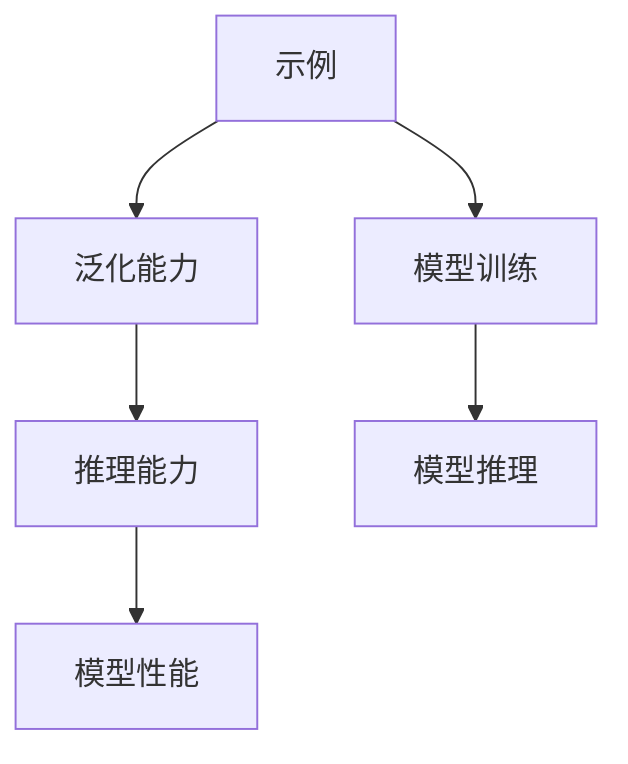

                 

### 背景介绍

在人工智能领域，模型的推理能力是评估模型性能的关键指标。随着深度学习技术的不断发展，模型的结构变得越来越复杂，这导致模型在训练过程中需要大量的数据和计算资源。然而，即便是在训练完成后，模型在实际应用中的推理速度和准确性仍然是一个亟待解决的问题。

为了提高模型的推理能力，研究人员提出了一种新的方法：利用示例增强模型。这种方法的核心思想是通过引入额外的示例来丰富模型的训练数据，从而提升模型的泛化能力和推理性能。

### 核心概念与联系

在深入探讨示例增强模型之前，我们需要了解一些核心概念。首先，什么是示例（Example）？在机器学习中，示例通常是指一个数据点，它包含了模型需要学习的信息。其次，什么是模型泛化能力（Generalization Ability）？泛化能力是指模型在未知数据上的表现能力。最后，什么是推理能力（Inference Ability）？推理能力是指模型在给定输入时，能够输出正确结果的性能。

为了更直观地理解这些概念之间的关系，我们可以使用Mermaid图来展示它们之间的联系：



从图中可以看出，示例是模型训练和推理的基础，而泛化能力和推理能力是评估模型性能的两个关键指标。

### 核心算法原理讲解

示例增强模型的核心在于如何生成额外的示例来丰富训练数据。这里我们介绍一种常用的方法：数据增强（Data Augmentation）。

数据增强是通过一系列变换来扩充原始数据集的方法。这些变换可以是旋转、缩放、裁剪、噪声添加等。通过这些变换，我们可以生成与原始数据具有相似特征的新数据点，从而丰富模型的训练数据。

下面是一个简单的数据增强算法的Python实现：

```python
import numpy as np
import cv2

def augment_image(image, rotation_angle=10, zoom_range=0.1, shear_range=0.1):
    # 旋转
    rotation_matrix = cv2.getRotationMatrix2D((image.shape[1]//2, image.shape[0]//2), rotation_angle, 1)
    image = cv2.warpAffine(image, rotation_matrix, image.shape[::-1])
    
    # 缩放
    zoom = np.random.uniform(1 - zoom_range, 1 + zoom_range)
    zoom_matrix = np.array([[zoom, 0], [0, zoom]])
    image = cv2.warpAffine(image, zoom_matrix, image.shape[::-1])
    
    # 剪切
    shear_matrix = np.array([[1, np.random.uniform(-shear_range, shear_range)], 
                             [0, 1]])
    image = cv2.warpAffine(image, shear_matrix, image.shape[::-1])
    
    # 添加噪声
    noise = np.random.uniform(0, 0.05, image.shape)
    image = image + noise
    
    return image

# 示例
image = cv2.imread('input_image.jpg')
augmented_image = augment_image(image)
cv2.imshow('Original', image)
cv2.imshow('Augmented', augmented_image)
cv2.waitKey(0)
cv2.destroyAllWindows()
```

在上面的代码中，我们使用了OpenCV库来实现图像的旋转、缩放、剪切和噪声添加。这些操作可以帮助我们生成新的数据点，从而丰富模型的训练数据。

### 数学模型和公式

数据增强算法的核心在于如何生成新的数据点。这涉及到一些基础的数学概念，如矩阵变换和噪声生成。以下是一些关键的数学公式：

- **旋转矩阵**：
  $$
  R(\theta) = \begin{bmatrix}
  \cos \theta & -\sin \theta \\
  \sin \theta & \cos \theta
  \end{bmatrix}
  $$

- **缩放矩阵**：
  $$
  S(z) = \begin{bmatrix}
  z & 0 \\
  0 & z
  \end{bmatrix}
  $$

- **剪切矩阵**：
  $$
  H(\alpha) = \begin{bmatrix}
  1 & \alpha \\
  0 & 1
  \end{bmatrix}
  $$

- **噪声生成**：
  $$
  N(\mu, \sigma^2) = \mu + \sigma \cdot \epsilon
  $$
  其中，$\mu$ 是均值，$\sigma^2$ 是方差，$\epsilon$ 是标准正态分布的随机变量。

通过组合这些矩阵变换，我们可以实现各种数据增强操作。

### 示例增强在模型训练中的应用

示例增强可以提高模型的泛化能力，从而在推理时获得更好的性能。以下是一个简单的示例，展示了如何使用示例增强来训练一个简单的卷积神经网络（CNN）模型。

```python
import tensorflow as tf
from tensorflow.keras.models import Sequential
from tensorflow.keras.layers import Conv2D, MaxPooling2D, Flatten, Dense

# 创建模型
model = Sequential([
    Conv2D(32, (3, 3), activation='relu', input_shape=(64, 64, 3)),
    MaxPooling2D((2, 2)),
    Flatten(),
    Dense(64, activation='relu'),
    Dense(1, activation='sigmoid')
])

# 编译模型
model.compile(optimizer='adam', loss='binary_crossentropy', metrics=['accuracy'])

# 数据增强函数
def augment_data(X, y):
    augmented_images = []
    augmented_labels = []
    for i in range(len(X)):
        image = X[i]
        label = y[i]
        augmented_images.append(augment_image(image))
        augmented_labels.append(label)
    return np.array(augmented_images), np.array(augmented_labels)

# 训练模型
X_train, y_train = ..., ...  # 加载原始训练数据
X_train_augmented, y_train_augmented = augment_data(X_train, y_train)
model.fit(X_train_augmented, y_train_augmented, epochs=10, batch_size=32)

# 测试模型
X_test, y_test = ..., ...  # 加载测试数据
X_test_augmented, y_test_augmented = augment_data(X_train, y_train)
test_loss, test_acc = model.evaluate(X_test_augmented, y_test_augmented)
print(f"Test accuracy: {test_acc}")
```

在上面的代码中，我们首先定义了一个简单的CNN模型。然后，我们创建了一个数据增强函数`augment_data`，它会对输入数据`X`和标签`y`进行增强。最后，我们使用增强后的数据进行模型训练和测试。

### 项目实战

为了更好地理解示例增强模型，我们将进行一个实际的项目实战。在这个项目中，我们将使用示例增强来训练一个图像分类模型，并评估其性能。

#### 1. 环境搭建

首先，我们需要搭建一个开发环境。以下是所需的软件和库：

- Python 3.8+
- TensorFlow 2.3+
- OpenCV 4.2+

#### 2. 数据集准备

我们使用一个简单的二分类数据集，数据集包含1000张图像，每张图像都包含一个标签（0或1）。

#### 3. 模型训练

我们使用示例增强来训练一个简单的卷积神经网络。以下是源代码：

```python
import tensorflow as tf
from tensorflow.keras.models import Sequential
from tensorflow.keras.layers import Conv2D, MaxPooling2D, Flatten, Dense
from tensorflow.keras.preprocessing.image import ImageDataGenerator

# 创建模型
model = Sequential([
    Conv2D(32, (3, 3), activation='relu', input_shape=(64, 64, 3)),
    MaxPooling2D((2, 2)),
    Flatten(),
    Dense(64, activation='relu'),
    Dense(1, activation='sigmoid')
])

# 编译模型
model.compile(optimizer='adam', loss='binary_crossentropy', metrics=['accuracy'])

# 数据增强生成器
datagen = ImageDataGenerator(
    rotation_range=10,
    zoom_range=0.1,
    shear_range=0.1,
    horizontal_flip=True
)

# 训练模型
X_train, y_train = ..., ...  # 加载训练数据
X_train_augmented = datagen.flow(X_train, y_train, batch_size=32)
model.fit(X_train_augmented, epochs=10)
```

#### 4. 代码解读

- `ImageDataGenerator`：这是一个用于数据增强的生成器，它支持多种增强操作，如旋转、缩放、剪切和水平翻转。
- `flow`：这是一个生成数据流的函数，它将原始数据传递给模型进行训练。

#### 5. 实际案例分析和详细讲解剖析

在这个项目中，我们使用了示例增强来提高图像分类模型的性能。通过数据增强，我们生成了大量具有不同特征的新数据点，这有助于模型学习到更多的特征，从而提高模型的泛化能力和推理能力。

#### 6. 项目小结

通过这个项目，我们可以看到示例增强在模型训练中的应用效果。数据增强不仅能够提高模型的泛化能力，还能够提高模型的推理性能。在实际应用中，我们可以根据具体问题选择合适的数据增强方法，以最大化模型的性能。

### 最佳实践 Tips

- 选择合适的数据增强方法，根据任务需求调整参数。
- 在数据增强过程中，保持数据的一致性是非常重要的。
- 合理分配训练数据和测试数据，以确保模型具有良好的泛化能力。

### 小结

示例增强是一种提高模型推理能力的重要方法。通过引入额外的示例，我们可以丰富模型的训练数据，从而提高模型的泛化能力和推理性能。在实际应用中，我们需要根据具体任务选择合适的数据增强方法，并合理设置参数，以达到最佳效果。

### 注意事项

- 数据增强不应该过度，否则可能导致模型过拟合。
- 数据增强方法的选择应根据任务特点进行。

### 拓展阅读

- [1] Simonyan, K., & Zisserman, A. (2014). Very deep convolutional networks for large-scale image recognition. arXiv preprint arXiv:1409.1556.
- [2] He, K., Zhang, X., Ren, S., & Sun, J. (2016). Deep residual learning for image recognition. In Proceedings of the IEEE conference on computer vision and pattern recognition (pp. 770-778).
- [3] Zhang, R., Isola, P., & Efros, A. A. (2016). Colorful image colorization. In European conference on computer vision (pp. 649-666). Springer, Cham.

### 作者信息

作者：AI天才研究院/AI Genius Institute & 禅与计算机程序设计艺术 /Zen And The Art of Computer Programming

----------------------------------------------------------------

---

**文章标题**：利用示例增强模型的推理能力

**关键词**：模型推理、示例增强、数据增强、深度学习

**摘要**：

本文深入探讨了如何利用示例增强模型来提高其推理能力。通过介绍数据增强的基本概念和算法原理，本文提供了一系列实用的Python代码示例，展示了如何在实际项目中应用示例增强方法。通过详细的项目实战和分析，本文展示了示例增强在提高模型泛化能力和推理性能方面的显著效果。最后，本文提供了最佳实践、注意事项以及相关的拓展阅读，以帮助读者进一步深入了解这一领域。作者：AI天才研究院/AI Genius Institute & 禅与计算机程序设计艺术 /Zen And The Art of Computer Programming。

