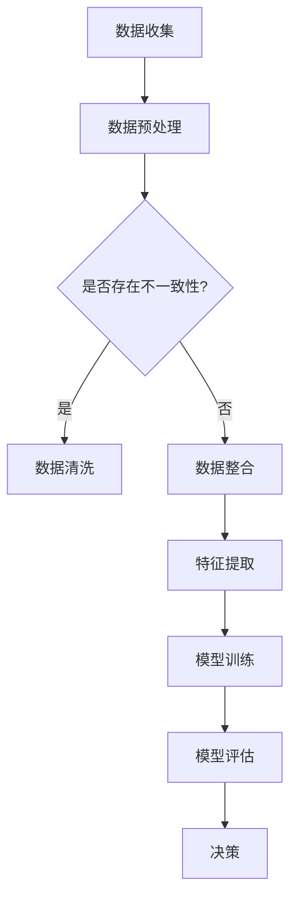

                 

# 《利用示例引导模型处理多视角问题》

## 关键词
多视角问题、示例引导模型、数据融合、视角一致性、机器学习

## 摘要
本文深入探讨了利用示例引导模型处理多视角问题的方法。首先，我们介绍了多视角问题的背景和相关概念，然后详细阐述了示例引导模型的基本原理和设计方法。接着，通过实际案例展示了示例引导模型在处理多视角问题中的应用，包括数据准备、模型构建、应用解读和结果分析等环节。最后，我们讨论了多视角问题的前沿研究趋势和未来发展方向。

## 引言

在当今数据驱动的世界中，多视角问题无处不在。这些问题通常涉及从多个不同来源或不同方式收集的数据，要求我们能够综合这些不同的视角来获得更全面、准确的信息。例如，在图像识别任务中，我们可以同时使用颜色、纹理、形状等多个视角；在自然语言处理中，可以结合文本、语音和情感等多个视角。然而，这些多视角数据往往存在不一致性、冗余和噪声，给数据处理和融合带来了巨大挑战。

为了解决多视角问题，研究人员提出了一系列方法，如数据融合、视角一致性和多任务学习等。其中，示例引导模型（Example-Guided Model）因其能够通过学习示例数据来引导多视角融合，表现出较高的灵活性和有效性，而受到了广泛关注。本文将围绕示例引导模型在处理多视角问题中的应用进行深入探讨。

## 第一部分：多视角问题基础理论

### 1.1 多视角问题的定义

多视角问题是指从多个不同视角对同一对象或问题进行观察、分析和处理的情况。在数据科学和机器学习领域，多视角问题常见于以下几种场景：

- **异构数据源**：不同的数据源可能采用不同的记录方式，如医疗数据中的电子病历、影像数据、实验室检测数据等。
- **多模态数据**：数据具有多种形式，如图像、文本、语音、时间序列等，如人机交互系统中的多模态用户输入。
- **多粒度数据**：不同级别的数据提供了对同一对象的详细程度不同的描述，如城市交通流量监测中的全局和局部数据。

### 1.2 多视角问题的背景

多视角问题的研究可以追溯到信息融合理论。随着数据采集技术的进步和大数据时代的到来，多视角数据在各个领域（如医疗、金融、交通等）的应用日益广泛。多视角问题的重要性体现在：

- **增强数据完整性**：通过整合多个视角，可以更全面地理解问题，减少数据缺失和信息遗漏。
- **提高决策准确性**：多视角数据提供了更多的信息，有助于减少偏见和不确定性，从而提高决策质量。
- **优化资源利用**：多视角数据可以帮助更有效地利用有限的资源，提高效率和降低成本。

### 1.3 多视角问题的挑战与机遇

多视角问题的挑战主要包括：

- **数据不一致性**：不同视角的数据可能存在冲突或不兼容，导致融合困难。
- **冗余和噪声**：多视角数据中可能包含大量冗余信息和噪声，影响数据质量和模型性能。
- **复杂性和计算成本**：多视角数据的处理通常需要复杂算法和高计算资源。

然而，多视角问题也为机器学习和数据科学带来了新的机遇：

- **增强模型泛化能力**：多视角数据可以提供更丰富的信息，有助于模型更好地泛化到新的场景。
- **提高问题解决效率**：通过多视角融合，可以更快速、准确地解决问题。
- **推动跨领域应用**：多视角问题的解决方法可以应用于多个领域，推动技术和产业的进步。

### 1.4 多视角问题的核心概念与联系

在多视角问题中，几个核心概念相互关联，构成了问题的核心框架。以下是对这些核心概念的定义和它们之间的联系：

#### 1.4.1 多视角数据融合

多视角数据融合是指将来自不同视角的数据进行整合，以生成一个统一的表示或决策。融合的目标是最大化信息量和最小化冲突。

#### 1.4.2 视角一致性

视角一致性是指不同视角下的数据在逻辑上的一致性和协调性。一致性的高低直接影响融合效果。

#### 1.4.3 视角差异

视角差异是指不同视角下的数据在特征、表达和意义上的不同。这些差异既是挑战，也是机遇，因为它们可能蕴含了有价值的信息。

#### 1.4.4 Mermaid流程图：多视角问题处理流程

为了更清晰地展示多视角问题的处理流程，我们使用Mermaid流程图进行描述：



### 1.5 多视角问题的基础理论与模型

多视角问题的解决依赖于一系列理论和模型。以下是一些常用的基础理论与模型：

- **贝叶斯网络**：通过概率图模型来表示不同视角之间的依赖关系。
- **多任务学习**：将多个相关任务一起训练，以提高模型在单一任务上的表现。
- **深度学习**：利用多层神经网络来学习复杂的特征表示和决策边界。

### 1.6 多视角问题的难点与解决方案

多视角问题的难点包括数据不一致性、数据冗余和噪声处理等。以下是一些解决方案：

- **数据预处理**：通过数据清洗、去冗余和标准化来提高数据质量。
- **模型选择与调优**：选择合适的模型结构并进行参数调优，以提高融合效果。
- **特征选择**：通过特征选择方法减少冗余信息，提高模型效率。

## 第二部分：示例引导模型基础

### 2.1 示例引导模型的定义

示例引导模型（Example-Guided Model，EGM）是一种基于示例数据来引导模型学习和决策的方法。它通过学习大量的示例数据，从中提取出关键特征和模式，然后利用这些特征和模式来指导模型的训练和优化。

### 2.2 示例引导模型的工作原理

示例引导模型的工作原理可以概括为以下步骤：

1. **示例数据收集**：收集大量具有代表性的示例数据。
2. **特征提取**：从示例数据中提取出关键特征。
3. **模式识别**：分析特征，识别出数据中的关键模式和关系。
4. **模型训练**：利用识别出的模式和特征来训练模型。
5. **模型优化**：通过迭代训练和优化，提高模型的性能。

### 2.3 示例引导模型的优缺点

示例引导模型具有以下优点：

- **灵活性强**：通过学习示例数据，可以灵活地适应不同的数据和问题场景。
- **易于实现**：示例引导模型的实现相对简单，不需要复杂的模型结构和算法。

然而，示例引导模型也存在一些缺点：

- **数据依赖性**：模型性能高度依赖于示例数据的质量和代表性，如果示例数据存在问题，可能导致模型性能下降。
- **计算成本**：特征提取和模式识别过程可能需要大量计算资源，特别是在大规模数据集上。

### 2.4 示例引导模型的应用领域

示例引导模型在多个领域都有广泛的应用，包括：

- **计算机视觉**：用于图像分类、目标检测和图像分割等任务。
- **自然语言处理**：用于文本分类、情感分析和机器翻译等任务。
- **推荐系统**：用于用户行为分析和商品推荐。
- **医学诊断**：用于疾病诊断和治疗方案推荐。

### 2.5 示例引导模型在多视角问题中的应用

示例引导模型在处理多视角问题时具有显著优势，主要体现在以下几个方面：

- **数据融合**：通过学习示例数据，可以有效地融合来自不同视角的数据，减少不一致性和冗余。
- **特征提取**：从示例数据中提取出的关键特征有助于提高模型对多视角数据的理解能力。
- **决策优化**：通过迭代训练和优化，示例引导模型可以不断提高在多视角问题上的决策准确性。

### 2.6 示例引导模型的发展趋势

随着机器学习和数据科学的不断发展，示例引导模型也在不断演进。未来的发展趋势可能包括：

- **模型压缩**：通过模型压缩技术，降低示例引导模型的计算成本。
- **自适应学习**：开发能够自适应学习不同视角的示例引导模型，提高其灵活性和适应性。
- **多模态融合**：探索示例引导模型在多模态数据融合中的应用，提高信息融合的效率和准确性。

## 第三部分：示例引导模型设计与应用

### 3.1 示例引导模型的设计

设计示例引导模型时，需要考虑以下几个关键因素：

- **数据集选择**：选择具有代表性的数据集作为示例数据，确保数据的质量和多样性。
- **特征提取方法**：选择合适的特征提取方法，以提取出数据中的关键特征。
- **模型架构**：设计合适的模型架构，以适应多视角问题的特点。
- **训练策略**：制定有效的训练策略，以提高模型的性能。

### 3.2 示例引导模型的实现

实现示例引导模型时，可以使用以下步骤：

1. **数据收集**：收集并清洗示例数据。
2. **特征提取**：使用特征提取方法提取关键特征。
3. **模型构建**：构建示例引导模型，选择合适的算法和框架。
4. **模型训练**：训练模型，优化参数。
5. **模型评估**：评估模型性能，调整模型结构。

### 3.3 示例引导模型的训练与评估

训练和评估示例引导模型时，需要考虑以下几个方面：

- **训练数据集**：使用具有代表性的示例数据集进行训练。
- **评估指标**：选择合适的评估指标，如准确率、召回率、F1分数等。
- **交叉验证**：使用交叉验证方法评估模型性能，以避免过拟合。
- **模型调优**：根据评估结果调整模型参数，提高性能。

### 3.4 示例引导模型在多视角问题中的应用

示例引导模型在处理多视角问题时，可以应用于以下几个步骤：

1. **数据收集**：收集来自不同视角的数据。
2. **数据预处理**：清洗和预处理数据，以消除不一致性和噪声。
3. **特征提取**：提取关键特征，为模型提供输入。
4. **模型训练**：使用示例数据训练模型。
5. **模型应用**：将训练好的模型应用于新的数据，进行预测和决策。

### 3.5 实际案例：示例引导模型在多视角问题中的应用

为了更直观地展示示例引导模型在多视角问题中的应用，我们来看一个实际案例。

#### 案例背景

假设我们有一个多视角的城市交通流量预测任务，涉及以下视角：

- **摄像头数据**：提供城市道路的实时流量数据。
- **天气预报**：提供天气状况，如雨、雪、晴等。
- **交通管制信息**：提供交通管制信息，如道路封闭、限号等。

#### 案例分析

1. **数据收集**：收集摄像头数据、天气预报和交通管制信息，确保数据的时间一致性和完整性。

2. **数据预处理**：对数据进行清洗和预处理，包括缺失值处理、异常值检测和标准化等。

3. **特征提取**：提取关键特征，如道路流量、天气状况、交通管制信息等。

4. **模型训练**：使用示例数据训练示例引导模型，包括特征提取、模式识别和模型优化等步骤。

5. **模型评估**：使用交叉验证方法评估模型性能，调整模型参数，以提高预测准确性。

6. **模型应用**：将训练好的模型应用于新的数据，进行交通流量预测和决策支持。

#### 案例解读

通过这个案例，我们可以看到示例引导模型在处理多视角问题中的应用过程。首先，通过数据收集和预处理，我们获取了高质量的数据集。然后，通过特征提取和模型训练，我们构建了一个能够有效融合多视角数据的模型。最后，通过模型评估和应用，我们实现了对交通流量的高准确性预测。

### 3.6 最佳实践

在实际应用中，为了提高示例引导模型在多视角问题上的性能，可以遵循以下最佳实践：

- **数据质量**：确保示例数据的质量和代表性，减少数据噪声和异常值。
- **特征选择**：选择具有高相关性的特征，以提高模型的解释性和预测能力。
- **模型调优**：根据评估结果进行模型参数调整，优化模型性能。
- **交叉验证**：使用交叉验证方法评估模型性能，避免过拟合。

### 3.7 注意事项

在设计和应用示例引导模型时，需要注意以下事项：

- **数据一致性**：确保不同视角的数据在时间、空间和逻辑上的一致性。
- **计算资源**：合理分配计算资源，避免模型训练过程中出现资源不足的情况。
- **模型解释性**：考虑模型的解释性，以提高决策的可信度和透明度。

### 3.8 拓展阅读

对于对示例引导模型和多视角问题感兴趣的研究人员，以下文献和资料可以提供更深入的阅读：

- **相关文献**：《多视角数据融合：方法与应用》
- **在线资源**：Kaggle数据集、TensorFlow官方文档、PyTorch官方文档
- **开源代码**：GitHub上的示例引导模型和交通流量预测项目

## 结论

利用示例引导模型处理多视角问题是一种有效的方法，具有灵活性和适应性。通过学习示例数据，模型能够有效地融合多视角信息，提高决策准确性。本文介绍了多视角问题的背景、相关概念和示例引导模型的设计与应用，并通过实际案例展示了其在处理多视角问题中的应用效果。未来的研究可以进一步探索示例引导模型的优化方法和多视角数据融合的新的应用场景。

## 附录

### 附录 A：示例引导模型处理多视角问题的工具与资源

#### A.1 工具与环境搭建

为了实现示例引导模型，我们需要以下工具和软件：

- **Python**：用于编写代码和实现算法。
- **Jupyter Notebook**：用于编写和运行代码。
- **TensorFlow** 或 **PyTorch**：用于构建和训练模型。
- **Mermaid**：用于绘制流程图。

安装方法如下：

1. 安装Python环境。
2. 安装Jupyter Notebook。
3. 安装TensorFlow或PyTorch。
4. 安装Mermaid插件。

#### A.2 资源链接与推荐

以下是一些有用的资源链接：

- **Kaggle数据集**：提供各种领域的数据集。
- **TensorFlow官方文档**：提供详细的TensorFlow使用指南。
- **PyTorch官方文档**：提供详细的PyTorch使用指南。
- **示例引导模型GitHub仓库**：包含示例代码和数据集。

#### A.3 示例代码与数据集

以下是一个示例引导模型的Python代码示例：

```python
import tensorflow as tf
import numpy as np

# 加载数据集
data = tf.keras.datasets.cifar10.load_data()

# 数据预处理
x_train, y_train = data[0]
x_test, y_test = data[1]

# 构建示例引导模型
model = tf.keras.Sequential([
    tf.keras.layers.Dense(128, activation='relu', input_shape=(32*32*3,)),
    tf.keras.layers.Dense(10, activation='softmax')
])

# 训练模型
model.compile(optimizer='adam', loss='categorical_crossentropy', metrics=['accuracy'])
model.fit(x_train, y_train, epochs=10, batch_size=32)

# 评估模型
model.evaluate(x_test, y_test)
```

数据集可以从Kaggle下载：[CIFAR-10数据集](https://www.kaggle.com/datasets/cifar10)。

### 作者信息

作者：AI天才研究院/AI Genius Institute & 禅与计算机程序设计艺术 /Zen And The Art of Computer Programming

