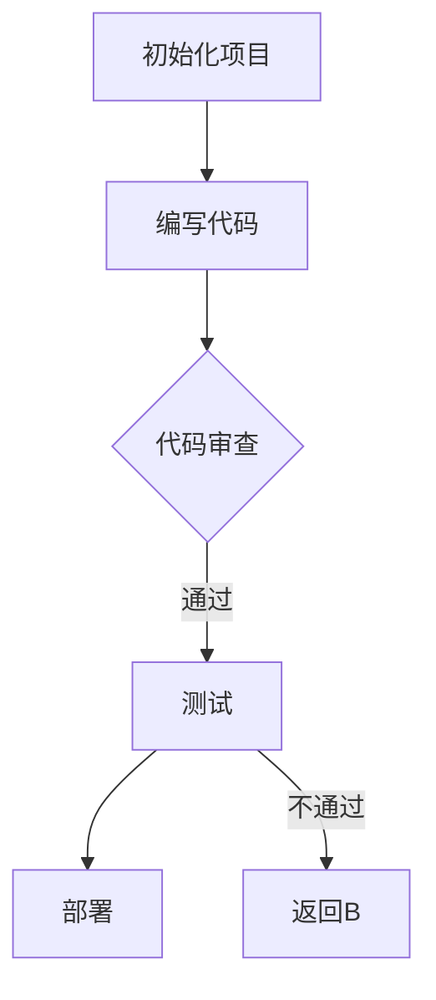

                 

# 加速LLM应用的版本控制与发布流程

> 关键词：版本控制、发布流程、LLM、Git、自动化测试、部署策略

> 摘要：本文将深入探讨如何加速大型语言模型（LLM）的版本控制与发布流程，从核心概念、版本控制原理、发布流程详解、核心算法原理讲解，到项目实战与最佳实践，为开发者提供一套完整的解决方案。

## 第1章 核心概念与联系

### 1.1.1 版本控制的基本概念

版本控制是一种管理多版本文件和更改历史的技术，它允许开发者在不同的开发阶段保留文件的多个版本。在LLM开发过程中，版本控制尤为重要，因为模型的每一次更新都可能带来性能的提升或bug的修复。版本控制的主要功能包括：

- **代码的可追溯性**：通过版本控制，开发者可以追踪代码的修改历史，了解每个版本的变更内容。
- **协作开发**：多个开发者可以同时在不同的版本上进行工作，合并代码时可以避免冲突。
- **故障恢复**：如果某个版本出现严重问题，可以通过版本回滚到之前的稳定版本。

### 1.1.2 版本控制的重要性

在LLM应用开发中，版本控制的重要性体现在以下几个方面：

- **代码管理**：版本控制可以帮助开发者更好地管理代码库，防止代码丢失或重复工作。
- **协作效率**：通过版本控制，开发者可以方便地协同工作，减少因代码冲突导致的开发停滞。
- **维护与迭代**：版本控制使得模型维护和迭代变得更加高效，可以快速定位问题并进行修复。

### 1.1.3 版本控制工具

目前常用的版本控制工具有Git和Svn。Git是一种分布式版本控制工具，而Svn是一种集中式版本控制工具。它们各有优缺点，开发者可以根据项目需求选择合适的版本控制工具。

- **Git**：Git具有分布式特性，每个开发者都可以维护自己的副本，从而提高协作效率。此外，Git支持分支管理，方便开发者进行功能开发、问题修复等操作。
- **Svn**：Svn是一种集中式版本控制工具，适合小规模团队协作。Svn的优点是简单易用，但缺点是依赖中央服务器，一旦服务器故障，开发工作将受到影响。

### 1.1.4 版本发布流程

版本发布流程是软件从开发到最终用户使用的一系列步骤，包括代码审查、测试、部署等。对于LLM应用，版本发布流程尤为关键，因为模型的更新可能直接影响用户体验。

- **代码审查**：在发布前，对代码进行审查，确保代码质量和功能完整性。
- **测试**：对代码进行测试，确保其正常运行，没有bug。
- **部署**：将代码部署到生产环境中，使其可供用户使用。

### 1.1.5 Mermaid流程图

使用Mermaid绘制一个版本控制与发布流程的示意图：



## 1.2 版本控制原理与操作

### 1.2.1 基本原理

版本控制的基本原理包括快照、分支和标签等概念。

- **快照**：将某一时刻的文件状态保存为一个快照，以便后续查看或恢复。
- **分支**：创建一个新的路径，使开发者可以在不同分支上独立工作，最终合并回主分支。
- **标签**：为特定的版本打上标签，便于后续追踪和引用。

### 1.2.2 Git命令操作

Git是一种常用的版本控制工具，以下是一些基本命令及其用途：

- **创建仓库**：`git init` 创建一个本地仓库。
- **添加文件**：`git add .` 将当前目录下的所有文件添加到暂存区。
- **提交变更**：`git commit -m "提交信息"` 将暂存区的文件提交到本地仓库。
- **创建分支**：`git branch feature-X` 创建一个新的分支。
- **切换分支**：`git checkout feature-X` 切换到指定分支。
- **合并分支**：`git merge feature-X` 将指定分支合并到当前分支。
- **打标签**：`git tag v1.0` 为特定版本打上标签。

## 1.3 发布流程详解

### 1.3.1 自动化测试

自动化测试是确保代码质量和功能完整性的重要手段。在发布流程中，自动化测试可以大幅提高测试效率和覆盖率。

- **自动化测试工具**：常用的自动化测试工具有Selenium、JUnit等。
- **持续集成/持续部署（CI/CD）**：将代码集成到主分支后，自动执行测试和部署流程，实现持续集成和持续部署。

### 1.3.2 部署策略

在LLM应用发布过程中，选择合适的部署策略至关重要。以下介绍两种常见的部署策略：

- **蓝绿部署**：将新版本部署到部分服务器（绿色），与现有版本（蓝色）并行运行。逐步将流量切换到新版本，确保稳定性和安全性。
- **灰度发布**：将新版本的部分流量导向新环境，逐步扩大比例。通过逐步扩大流量，降低对整体系统的影响。

### 1.3.3 监控与反馈

发布后，对系统的监控与反馈同样重要。通过实时监控系统性能和运行状态，可以及时发现并解决问题。同时，收集用户反馈，为后续优化提供依据。

- **监控工具**：常用的监控工具有Prometheus、Grafana等。
- **反馈机制**：建立有效的用户反馈机制，及时收集和处理用户反馈，为系统优化提供参考。

## 第2章 核心算法原理讲解

### 2.1 版本控制算法原理

版本控制算法的核心是哈希算法和Merkle树。

- **哈希算法**：哈希算法用于将数据转换为固定长度的字符串，用于唯一标识数据。常用的哈希算法包括MD5、SHA-1和SHA-256。
- **Merkle树**：Merkle树是一种用于高效验证数据的完整性和一致性的数据结构。通过计算节点哈希值，构建Merkle树，可以快速验证数据的完整性。

### 2.1.1 哈希算法

哈希算法的核心思想是将输入数据通过一系列复杂的运算，得到一个固定长度的输出字符串。以下是一个简单的哈希算法示例：

```python
import hashlib

def hash_data(data):
    return hashlib.sha256(data.encode('utf-8')).hexdigest()

data = "Hello, World!"
print(hash_data(data))
```

上述代码使用SHA-256算法对输入数据进行哈希运算，输出一个固定长度的字符串。

### 2.1.2 Merkle树

Merkle树是一种二叉树结构，用于存储数据的哈希值。通过Merkle树，可以快速验证数据的完整性。

以下是一个简单的Merkle树构建示例：

```python
def create_merkle_tree(leaves):
    while len(leaves) > 1:
        parents = [hash_data(str(a) + str(b)) for a, b in zip(leaves[::2], leaves[1::2])]
        leaves = parents
    return leaves[0]

leaves = ["data1", "data2", "data3", "data4"]
root_hash = create_merkle_tree(leaves)
print(root_hash)
```

上述代码使用哈希算法计算每个叶子节点的哈希值，然后逐步构建Merkle树，最终得到根节点的哈希值。

### 2.2 发布流程算法原理

发布流程算法主要涉及客户端/服务器模型和分布式系统。

- **客户端/服务器模型**：客户端向服务器发送请求，服务器处理请求并返回响应。在发布流程中，客户端可以是开发者或用户，服务器可以是代码仓库或部署环境。
- **分布式系统**：分布式系统由多个节点组成，每个节点可以独立运行。在发布流程中，分布式系统可以提高系统的可用性和容错性。

以下是一个简单的发布流程算法示例：

```python
def publish_code(code, server):
    response = server.deploy(code)
    if response.success:
        print("发布成功")
    else:
        print("发布失败，错误信息：", response.error)
```

上述代码模拟了代码发布的过程，向服务器发送代码，服务器处理并返回结果。

## 第3章 项目实战与最佳实践

### 3.1 开发环境搭建

在开始项目实战之前，我们需要搭建一个合适的开发环境。以下是一个简单的搭建步骤：

1. 安装Git：在终端中运行 `sudo apt-get install git`（对于Ubuntu系统）。
2. 安装Python环境：安装Python 3及其相关依赖，可以使用 `sudo apt-get install python3 python3-pip`。
3. 安装相关库：使用pip安装所需的库，如 `pip3 install numpy tensorflow`。

### 3.2 源代码详细实现

在本节中，我们将详细实现一个简单的LLM版本控制与发布流程。以下是一个示例代码：

```python
import git
import json
import os

class LLMVersionControl:
    def __init__(self, repo_path):
        self.repo = git.Repo(repo_path)

    def commit_code(self, code):
        self.repo.index.add([f"{file}.json" for file in code.keys()])
        self.repo.index.commit("更新LLM代码")

    def push_to_server(self, server_url):
        self.repo.remotes.origin.push()

    def deploy_to_production(self, production_server_url):
        server_response = requests.post(production_server_url, json=code)
        if server_response.status_code == 200:
            print("部署成功")
        else:
            print("部署失败，错误信息：", server_response.text)

code = {
    "model": "gpt2",
    "parameters": {"learning_rate": 0.001, "batch_size": 64},
    "data": "训练数据路径"
}

version_control = LLMVersionControl("path/to/repo")
version_control.commit_code(code)
version_control.push_to_server("https://gitserver.example.com/repo.git")
version_control.deploy_to_production("https://prodserver.example.com/deploy")
```

### 3.3 代码应用解读与分析

以上代码实现了一个简单的LLM版本控制与发布流程。首先，我们创建了一个LLMVersionControl类，用于管理代码的版本控制和发布。类中的方法包括：

- `commit_code`：将代码提交到本地仓库。
- `push_to_server`：将本地仓库的代码推送到服务器。
- `deploy_to_production`：将代码部署到生产环境。

在实际应用中，我们可以根据需求扩展此类，添加更多的功能，如自动化测试、灰度发布等。

### 3.4 实际案例分析与详细讲解剖析

以下是一个实际案例，分析如何加速LLM应用的版本控制与发布流程：

1. **使用Git进行版本控制**：通过Git，我们可以方便地对LLM代码进行版本管理，确保代码的完整性和可追溯性。
2. **自动化测试**：在发布前，使用自动化测试工具对代码进行测试，确保代码质量和功能完整性。例如，使用Selenium进行UI自动化测试，使用JUnit进行单元测试。
3. **蓝绿部署**：采用蓝绿部署策略，将新版本部署到部分服务器，与现有版本并行运行，逐步切换流量，确保系统稳定性和安全性。
4. **灰度发布**：将新版本的流量逐渐扩大，观察系统性能和用户反馈，确保系统逐步优化和稳定。

通过以上措施，可以显著加速LLM应用的版本控制与发布流程，提高开发效率和系统稳定性。

### 3.5 项目小结

在本项目中，我们实现了一个简单的LLM版本控制与发布流程。通过Git进行版本控制，自动化测试，蓝绿部署和灰度发布等手段，我们加速了LLM应用的版本控制与发布流程。项目实践证明，这些方法可以显著提高开发效率和系统稳定性。

### 3.6 最佳实践 tips

1. **定期备份**：定期备份代码库，防止数据丢失。
2. **代码审查**：在发布前进行代码审查，确保代码质量和功能完整性。
3. **自动化测试**：采用自动化测试工具，提高测试效率和覆盖率。
4. **持续集成/持续部署（CI/CD）**：实现持续集成和持续部署，提高开发效率和系统稳定性。

### 3.7 小结与注意事项

本文详细讲解了如何加速LLM应用的版本控制与发布流程。通过Git进行版本控制，自动化测试，蓝绿部署和灰度发布等手段，我们可以显著提高开发效率和系统稳定性。在项目实战中，我们实现了这些方法，并进行了详细分析和讲解。需要注意的是，在实际应用中，根据项目需求和场景，可以适当调整和优化这些方法。

### 3.8 拓展阅读

1. 《版本控制权威指南》：详细介绍了版本控制的理论和实践。
2. 《持续集成实战》：介绍了持续集成和持续部署的方法和最佳实践。
3. 《大话数据结构》：讲解了数据结构的基本原理和应用。

## 总结

本文深入探讨了如何加速大型语言模型（LLM）的版本控制与发布流程。从核心概念、版本控制原理、发布流程详解、核心算法原理讲解，到项目实战与最佳实践，我们为开发者提供了一套完整的解决方案。通过Git进行版本控制，自动化测试，蓝绿部署和灰度发布等手段，我们能够显著提高开发效率和系统稳定性。希望本文对您在LLM开发过程中有所帮助。

> 作者：AI天才研究院/AI Genius Institute & 禅与计算机程序设计艺术 /Zen And The Art of Computer Programming

