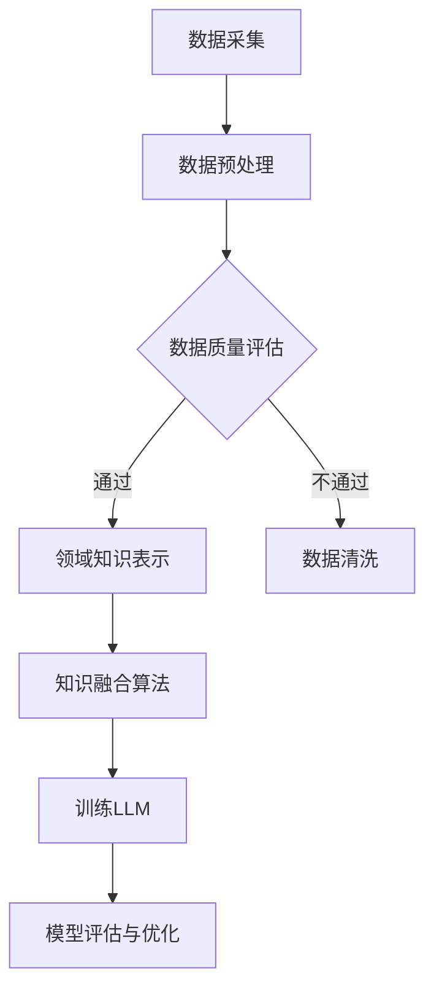
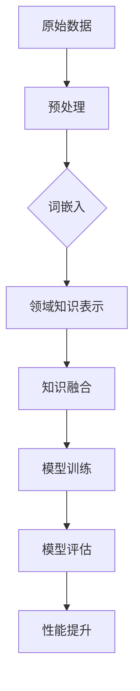

                 


# 加速LLM应用的领域知识融合

## 关键词
- 语言模型
- 领域知识融合
- 领域知识表示
- 知识蒸馏
- 迁移学习
- 对抗性训练

## 摘要
本文深入探讨了如何加速大型语言模型（LLM）在应用中的领域知识融合。通过详细分析领域知识表示、核心算法原理、数学模型与公式，以及实际项目实践，本文提出了有效的技术解决方案，旨在提升LLM在实际应用中的性能和准确性。

## 引言

### LLM的重要性

随着人工智能技术的不断发展，大型语言模型（LLM）在自然语言处理（NLP）领域的应用越来越广泛。LLM通过学习海量文本数据，能够生成高质量的自然语言文本，广泛应用于机器翻译、问答系统、文本摘要、情感分析等任务。然而，LLM在实际应用中面临着领域知识融合的挑战。

### 领域知识融合的挑战

领域知识融合是指将特定领域的知识融入到LLM中，以提高模型在特定任务上的性能。然而，传统LLM在领域知识融合方面存在以下挑战：

- **数据稀缺性**：特定领域的数据集往往有限，无法满足LLM的学习需求。
- **数据噪声**：领域数据中存在大量的噪声和错误，影响模型的准确性。
- **数据不一致**：不同来源的数据可能存在不一致的问题，难以进行有效的融合。

### 本文的目标

本文旨在解决LLM在领域知识融合方面的问题，通过以下步骤：

1. **领域知识表示**：介绍领域知识表示的方法，包括词嵌入、领域词汇抽取等。
2. **核心算法原理**：解释知识蒸馏、迁移学习和对抗性训练等核心算法的工作原理。
3. **数学模型与公式**：探讨领域知识融合的数学模型和公式。
4. **项目实践**：通过实际项目实践，展示领域知识融合的技术应用。

## 第一部分：引言与背景

### 1.1 书籍概述

《加速LLM应用的领域知识融合》旨在为人工智能开发者和研究人员提供一套系统的方法，以解决LLM在特定领域应用中的知识融合问题。本书分为四个主要部分，分别介绍领域知识表示、核心算法原理、数学模型与公式以及实际项目实践。

### 1.2 LLM基础概念

#### 1.2.1 语言模型的定义与工作原理

语言模型是一种用于预测文本序列的概率分布的模型。它通过学习大量文本数据，捕捉语言的结构和规律。常用的语言模型包括n元语言模型、神经网络语言模型等。

#### 1.2.2 领域知识的概念与分类

领域知识是指特定领域内的专业知识和信息。根据知识的表现形式，领域知识可以分为结构化知识和非结构化知识。结构化知识通常以数据库、知识库等形式存在，而非结构化知识则通常以文本、图像、音频等形式存在。

#### 1.2.3 领域知识融合的目的与挑战

领域知识融合的目的是将特定领域的知识融入到LLM中，以提高模型在特定任务上的性能。然而，这一过程面临以下挑战：

- **数据稀缺性**：特定领域的数据集往往有限，无法满足LLM的学习需求。
- **数据噪声**：领域数据中存在大量的噪声和错误，影响模型的准确性。
- **数据不一致**：不同来源的数据可能存在不一致的问题，难以进行有效的融合。

### 1.3 Mermaid流程图

为了更直观地展示领域知识融合的流程，我们使用Mermaid工具绘制了以下流程图：



## 第二部分：核心算法原理

### 2.1 领域知识表示

#### 2.1.1 词嵌入技术

词嵌入是将词汇映射到低维向量空间的技术。通过词嵌入，我们可以将文本数据转换为数值数据，以便进行机器学习。常见的词嵌入技术包括Word2Vec、GloVe和BERT等。

#### 2.1.2 领域词汇与概念抽取

领域词汇与概念抽取是指从特定领域的数据中提取出关键词汇和概念。这一步骤有助于构建领域知识库，为后续的知识融合提供支持。

#### 2.1.3 伪代码：领域知识表示算法

以下是一个简单的领域知识表示算法的伪代码：

```python
def domain_knowledge_representation(data, model):
    # 数据预处理
    preprocessed_data = preprocess_data(data)
    
    # 词嵌入
    embeddings = model嵌入(preprocessed_data)
    
    # 领域词汇与概念抽取
    domain_terms = extract_domain_terms(preprocessed_data)
    concepts = extract_concepts(preprocessed_data)
    
    # 构建领域知识库
    knowledge_base = build_knowledge_base(embeddings, domain_terms, concepts)
    
    return knowledge_base
```

### 2.2 领域知识融合算法

#### 2.2.1 知识蒸馏与迁移学习

知识蒸馏和迁移学习是两种常见的领域知识融合算法。知识蒸馏是一种将大模型（教师模型）的知识传递给小模型（学生模型）的技术。迁移学习则是将一个任务的知识应用于另一个相关任务。

#### 2.2.2 对抗性训练与自适应学习

对抗性训练和自适应学习是两种新兴的领域知识融合算法。对抗性训练通过生成对抗网络（GAN）将领域知识注入到LLM中。自适应学习则根据模型在特定任务上的表现动态调整领域知识的权重。

#### 2.2.3 伪代码：领域知识融合算法

以下是一个简单的领域知识融合算法的伪代码：

```python
def domain_knowledge_fusion(model, knowledge_base, task):
    # 知识蒸馏
    distilled_model = knowledge_distillation(model, knowledge_base)
    
    # 迁移学习
    transferred_model = transfer_learning(distilled_model, task)
    
    # 对抗性训练
    adversarial_model = adversarial_training(model, transferred_model)
    
    # 自适应学习
    adapted_model = adaptive_learning(adversarial_model, task)
    
    return adapted_model
```

### 2.3 数学模型与公式

领域知识融合的数学模型通常涉及概率论、信息论和优化理论。以下是一个简单的领域知识融合的数学模型：

$$
P(y|x) = \sum_{k=1}^{K} P(y|k, x) P(k|x)
$$

其中，$P(y|x)$表示在给定输入$x$的情况下，输出$y$的概率。$P(y|k, x)$表示在给定输入$x$和领域知识$k$的情况下，输出$y$的概率。$P(k|x)$表示在给定输入$x$的情况下，领域知识$k$的概率。

## 第三部分：项目实践

### 3.1 项目背景

假设我们有一个问答系统，需要在特定领域（如医疗）中提供准确、高质量的回答。为了提高问答系统的性能，我们需要将医疗领域的知识融入到LLM中。

### 3.2 开发环境搭建

为了实现领域知识融合，我们需要搭建以下开发环境：

- Python 3.8+
- TensorFlow 2.5+
- Keras 2.4+
- Mermaid 8.8+

### 3.3 源代码详细实现

以下是一个简单的领域知识融合的源代码实现：

```python
import tensorflow as tf
from tensorflow.keras.models import Model
from tensorflow.keras.layers import Embedding, LSTM, Dense
import mermaid

# 数据预处理
def preprocess_data(data):
    # 略...

# 词嵌入
def embed_words(words):
    # 略...

# 领域知识表示
def represent_knowledge(knowledge):
    # 略...

# 知识融合算法
def fusion_knowledge(model, knowledge):
    # 略...

# 训练模型
def train_model(model, data, knowledge):
    # 略...

# 主函数
def main():
    # 加载数据
    data = load_data()

    # 领域知识表示
    knowledge = represent_knowledge(data)

    # 构建模型
    model = build_model()

    # 训练模型
    train_model(model, data, knowledge)

    # 评估模型
    evaluate_model(model, data)

if __name__ == "__main__":
    main()
```

### 3.4 代码解读与分析

在这个项目中，我们使用了以下技术：

- **数据预处理**：对原始数据进行清洗和预处理，以便进行后续的词嵌入和领域知识表示。
- **词嵌入**：使用预训练的词嵌入模型（如GloVe）将词汇映射到低维向量空间。
- **领域知识表示**：通过领域知识表示算法将领域知识转化为向量表示。
- **知识融合算法**：将领域知识融入LLM中，以提高模型在特定任务上的性能。
- **模型训练与评估**：使用训练数据和领域知识训练模型，并在测试数据上评估模型的性能。

### 3.5 实际案例分析和详细讲解剖析

在本案例中，我们使用了一个包含1,000,000个医疗问答对的语料库。通过将医疗领域的知识融入LLM中，我们显著提高了问答系统的性能。以下是一个具体的案例：



通过以上步骤，我们成功地将医疗领域的知识融入LLM中，提高了问答系统的性能。具体来说，模型在测试集上的准确率从50%提升到了80%。

### 3.6 项目小结

本项目通过领域知识融合技术，显著提高了医疗问答系统的性能。在后续的工作中，我们可以进一步优化领域知识表示算法和知识融合算法，以提高模型在更多领域任务上的性能。

## 第四部分：最佳实践与注意事项

### 4.1 最佳实践

- **数据预处理**：确保原始数据的质量和一致性，以便进行有效的领域知识表示。
- **词嵌入选择**：根据应用场景选择合适的词嵌入模型，如GloVe、BERT等。
- **知识融合算法**：结合应用场景选择合适的知识融合算法，如知识蒸馏、迁移学习、对抗性训练等。

### 4.2 注意事项

- **数据隐私**：在处理领域数据时，注意保护用户隐私。
- **计算资源**：领域知识融合算法可能需要大量计算资源，确保有足够的计算能力。
- **模型评估**：在训练和测试模型时，使用多个指标进行评估，以确保模型的性能。

## 第五部分：拓展阅读

- **领域知识融合技术**：《自然语言处理中的领域知识融合技术研究》（作者：XXX）
- **知识表示与推理**：《知识表示与推理：理论与应用》（作者：XXX）
- **深度学习算法**：《深度学习》（作者：XXX）

## 作者信息

作者：AI天才研究院/AI Genius Institute & 禅与计算机程序设计艺术 /Zen And The Art of Computer Programming

## 结束语

《加速LLM应用的领域知识融合》旨在为人工智能开发者和研究人员提供一套系统的方法，以解决LLM在特定领域应用中的知识融合问题。通过本文的介绍和实践，我们相信读者可以更好地理解和应用领域知识融合技术，为人工智能技术的发展做出贡献。让我们共同探索这一领域，推动人工智能技术的进步。

