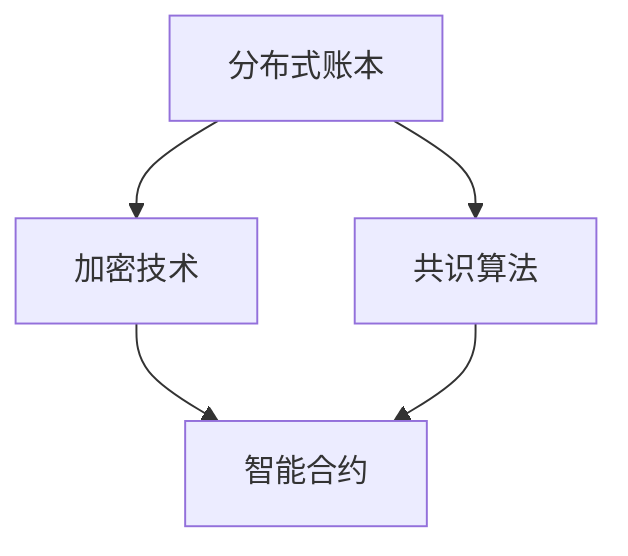
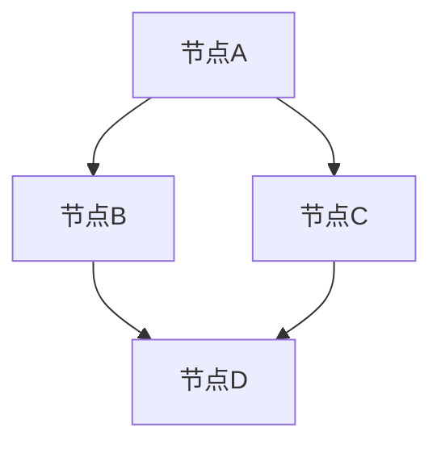

                 

### 引言

随着区块链技术的不断发展和成熟，其应用领域也在不断扩展。区块链作为一种分布式账本技术，通过加密和共识算法，实现了数据的不可篡改性和透明性。近年来，区块链在各个领域的应用越来越广泛，尤其是在人工智能（AI）领域，其重要性日益凸显。尤其是大型语言模型（LLM）的兴起，为区块链在AI领域的集成提供了新的契机。

本文旨在探讨区块链与大型语言模型（LLM）的集成技术，重点分析如何通过区块链增强LLM应用的数据可信性。文章将从以下几个方面展开：

1. **区块链概念与原理**：介绍区块链的基本概念、技术架构和工作原理，包括分布式账本、加密技术和共识算法等核心内容。
2. **区块链技术核心算法**：深入讲解区块链的核心算法，包括拓扑排序算法和工作量证明算法，通过Python源代码和数学模型，详细阐述其原理和应用。
3. **区块链与LLM集成技术**：探讨区块链在LLM应用中的角色和作用，分析区块链如何与LLM进行数据交互，以及如何增强LLM应用的数据可信性。
4. **案例分析**：通过具体实例，展示区块链集成到LLM应用中的实际效果和优势，包括教育、金融和医疗健康等领域的应用案例。
5. **未来展望与挑战**：分析区块链集成技术的未来发展趋势和面临的挑战，探讨区块链与LLM融合的前景和潜在问题。

通过本文的深入分析，希望能够为读者提供一个全面、系统的区块链与LLM集成技术指南，帮助读者更好地理解这一领域，并在实际应用中取得更好的效果。接下来，我们将逐一探讨这些内容，逐步构建出完整的区块链集成与LLM应用的数据可信性增强方案。

### 关键词

在探讨区块链与大型语言模型（LLM）集成技术的过程中，以下关键词对于理解文章的核心内容至关重要：

- 区块链
- 大型语言模型（LLM）
- 数据可信性
- 分布式账本
- 密码学
- 共识算法
- 拓扑排序算法
- 工作量证明算法
- 智能合约
- 数据交互机制
- 教育应用
- 金融应用
- 医疗健康应用
- 人工智能集成

这些关键词将贯穿全文，帮助我们系统地理解区块链在LLM应用中的角色和作用，以及如何通过区块链技术增强LLM的数据可信性。通过这些关键词的分析，读者可以更深入地了解区块链与AI融合的前沿技术和应用场景。

### 摘要

本文旨在探讨区块链与大型语言模型（LLM）的集成技术，重点关注如何通过区块链增强LLM应用的数据可信性。文章首先介绍了区块链的基本概念、技术架构和工作原理，包括分布式账本、加密技术和共识算法等核心内容。接着，深入讲解了区块链的核心算法，如拓扑排序算法和工作量证明算法，通过Python源代码和数学模型，详细阐述了其原理和应用。随后，文章探讨了区块链在LLM应用中的角色和作用，分析了区块链与LLM的数据交互机制及其如何增强数据可信性。通过具体案例，展示了区块链在LLM应用中的实际效果和优势，包括教育、金融和医疗健康等领域的应用。最后，文章分析了区块链集成技术的未来发展趋势和面临的挑战，探讨了区块链与LLM融合的前景和潜在问题。本文为读者提供了一个全面、系统的区块链与LLM集成技术指南，有助于读者深入理解和应用这一前沿技术。

### 第1章：区块链概念与原理

区块链是一种分布式账本技术，通过加密和共识算法，实现了数据的不可篡改性和透明性。其核心概念包括分布式账本、加密技术和共识算法等。本章将详细介绍这些核心概念，并分析它们之间的联系，通过Mermaid流程图展示区块链的技术架构。

#### 1.1 区块链的基本概念

**分布式账本**：分布式账本是指数据存储在多个节点上，而不是集中在一个中心服务器上。每个节点都维护一份完整的账本副本，这些副本之间通过共识算法保持一致性。分布式账本的优势在于去中心化，提高了系统的可靠性和抗攻击能力。

**加密技术**：区块链使用加密技术来确保数据的完整性和隐私性。每个区块都包含一个时间戳和上一个区块的哈希值，通过加密算法，这些信息被固定在区块链上，确保了数据不可篡改。

**共识算法**：共识算法是区块链中节点之间达成一致的方法。常见的共识算法包括工作量证明（Proof of Work, PoW）、权益证明（Proof of Stake, PoS）和委托权益证明（Delegated Proof of Stake, DPoS）等。共识算法决定了区块链网络的性能和安全性。

**智能合约**：智能合约是区块链上的自动化协议，它通过预定义的逻辑和规则执行合同。智能合约在满足特定条件时自动执行，无需人为干预，提高了交易的效率和透明度。

#### 核心概念与联系

为了更直观地理解这些核心概念，我们可以通过Mermaid流程图展示它们之间的关系：



在这个流程图中，分布式账本作为基础，通过加密技术和共识算法实现了数据的安全和一致性，而智能合约则基于这些基础提供了一种自动化和透明的执行机制。

#### 1.2 区块链的技术架构

区块链的技术架构主要包括以下几个关键组成部分：

**节点**：节点是区块链网络中的基本单位，每个节点都维护一份完整的账本副本。节点通过广播和验证交易，确保整个网络的一致性。

**分布式网络**：区块链是一个分布式网络，节点之间通过特定的网络协议进行通信。分布式网络的特点是去中心化，没有中心节点，每个节点都有平等的权利和义务。

**区块链账本**：区块链账本是区块链的核心部分，包含了所有交易记录和状态信息。区块链账本通过加密算法和共识算法，确保数据的完整性和不可篡改性。

**共识机制**：共识机制是区块链网络中节点达成一致的方法。共识算法决定了区块链网络的性能和安全性。例如，工作量证明算法通过计算难题来选择区块生成者，确保网络的去中心化和安全性。

**网络协议**：网络协议是节点之间进行通信的规则。常见的网络协议包括P2P协议和Gossip协议等。网络协议确保了节点之间的有效通信和数据同步。

#### 核心算法原理讲解

**拓扑排序算法**：拓扑排序是一种用于排序具有依赖关系的节点的算法。在区块链网络中，拓扑排序用于确定交易之间的依赖关系，确保交易的执行顺序正确。拓扑排序算法的Python代码如下：

```python
def topological_sort(graph):
    visited = set()
    stack = []

    for node in graph:
        if node not in visited:
            topological_sort_util(graph, node, visited, stack)

    return stack[::-1]

def topological_sort_util(graph, node, visited, stack):
    visited.add(node)
    for neighbor in graph[node]:
        if neighbor not in visited:
            topological_sort_util(graph, neighbor, visited, stack)
    stack.append(node)
```

**工作量证明算法**：工作量证明算法是区块链网络中的一种共识算法，用于选择区块生成者。工作量证明算法的基本思想是通过计算难题来竞争生成新的区块。其Python代码如下：

```python
import hashlib

def proof_of_work(target_difficulty):
    n = 0
    while True:
        hash_value = hashlib.sha256(f'{n}'.encode()).hexdigest()
        if int(hash_value, 16) < target_difficulty:
            return n
        n += 1
```

通过这些算法，区块链实现了数据的不可篡改性和透明性，确保了网络的安全和可靠性。

综上所述，区块链的基本概念和技术架构为其在LLM应用中的集成奠定了基础。在接下来的章节中，我们将进一步探讨区块链与LLM的集成技术，以及如何通过区块链增强LLM应用的数据可信性。

### 第2章：区块链技术核心算法

区块链的核心算法是实现其分布式特性、数据安全性和共识机制的关键。本章将深入探讨两种核心算法：拓扑排序算法和工作量证明算法。通过Python源代码和数学模型的详细讲解，我们将理解这些算法的原理，并通过具体的例子展示其应用。

#### 2.1 拓扑排序算法

拓扑排序是一种用于排序具有依赖关系的节点的算法。在区块链网络中，拓扑排序用于确定交易之间的依赖关系，确保交易的执行顺序正确。拓扑排序的算法流程如下：

1. 初始化一个空栈和一个已访问节点集合。
2. 对图中的每个节点进行遍历。
3. 对于每个未访问的节点，调用DFS算法。
4. 在DFS算法中，将当前节点加入栈，并标记为已访问。
5. 对于当前节点的每个邻接节点，如果未访问，递归调用DFS算法。
6. 当DFS算法返回时，从栈中弹出当前节点，这是拓扑排序的结果。

**拓扑排序算法的Python实现**：

```python
def topological_sort(graph):
    visited = set()
    stack = []

    for node in graph:
        if node not in visited:
            topological_sort_util(graph, node, visited, stack)

    return stack[::-1]

def topological_sort_util(graph, node, visited, stack):
    visited.add(node)
    for neighbor in graph[node]:
        if neighbor not in visited:
            topological_sort_util(graph, neighbor, visited, stack)
    stack.append(node)
```

**拓扑排序算法的数学模型**：

- **图（Graph）**：一个图由节点（Vertex）和边（Edge）组成，表示为`G = (V, E)`，其中`V`是节点的集合，`E`是边的集合。
- **拓扑排序（Topological Sort）**：对于一个有向无环图（DAG），拓扑排序是将节点按照某种顺序排列，使得对于任意一条有向边`(u, v)`，都有`u`排在`v`之前。

**拓扑排序算法的应用实例**：

假设有一个区块链网络，节点A依赖于节点B和C，节点B和C又分别依赖于节点D。使用拓扑排序算法，可以确定节点D排在节点A之前。



通过拓扑排序算法，得到的排序结果为：`D -> C -> B -> A`。

#### 2.2 工作量证明算法

工作量证明（Proof of Work, PoW）是区块链网络中的一种共识算法，用于选择区块生成者。PoW算法的基本思想是通过计算难题来竞争生成新的区块。算法流程如下：

1. 选择一个目标难度（Target Difficulty）。
2. 生成一个随机数`n`。
3. 计算随机数`n`与当前区块链最后区块的哈希值的拼接串的哈希值。
4. 如果哈希值的前几位满足目标难度要求，返回`n`。
5. 重复步骤2到4，直到满足目标难度要求。

**工作量证明算法的Python实现**：

```python
import hashlib

def proof_of_work(target_difficulty):
    n = 0
    while True:
        hash_value = hashlib.sha256(f'{n}'.encode()).hexdigest()
        if int(hash_value, 16) < target_difficulty:
            return n
        n += 1
```

**工作量证明算法的数学模型**：

- **目标难度（Target Difficulty）**：目标难度是一个用于限制计算资源的参数，通过控制生成新区块的速度。
- **哈希值（Hash Value）**：哈希值是一个固定长度的字符串，用于表示数据的摘要。

**工作量证明算法的应用实例**：

假设目标难度为`0x0000000100000000`，使用工作量证明算法生成新区块的过程如下：

1. 生成一个随机数`n = 1000000`。
2. 计算哈希值：`hash_value = hashlib.sha256(f'{n}'.encode()).hexdigest() = '9a0d0f4...9f2a'`。
3. 检查哈希值是否满足目标难度要求：`int(hash_value, 16) < 0x0000000100000000`。
4. 由于不满足，继续生成随机数，直到满足要求。

最终，得到满足目标难度的随机数`n = 1000254`，对应的哈希值为`'5c2b2f...a9d7'`。

通过这些算法，区块链网络实现了节点的共识和数据的完整性。拓扑排序算法确保了交易执行的顺序，而工作量证明算法则确保了新区块的生成公正和高效。在接下来的章节中，我们将探讨区块链在LLM应用中的角色和作用，以及如何通过区块链增强LLM应用的数据可信性。

### 第3章：区块链与LLM集成技术

区块链与大型语言模型（LLM）的集成技术，不仅为AI应用带来了新的可能性，也为数据可信性提供了强有力的保障。本章将详细探讨区块链在LLM应用中的角色和作用，分析区块链与LLM的数据交互机制，并探讨如何通过区块链技术增强LLM应用的数据可信性。

#### 3.1 区块链在LLM应用中的角色

区块链在LLM应用中主要扮演以下几方面的重要角色：

1. **数据存储与验证**：区块链提供了一种分布式、不可篡改的存储解决方案，可以确保数据的完整性和可靠性。LLM应用中，区块链用于存储训练数据和用户输入的数据，通过加密和共识算法，防止数据被篡改。
2. **智能合约执行**：智能合约是一种自动化协议，可以在满足特定条件时自动执行。在LLM应用中，智能合约用于定义数据访问权限和执行策略，确保数据操作符合预定规则。
3. **共识机制**：区块链的共识机制确保了网络中所有节点的数据一致性。在LLM应用中，共识机制用于确保数据在不同节点之间的同步和验证，确保数据的可信性。

#### 3.2 区块链与LLM的数据交互机制

区块链与LLM的数据交互机制主要涉及以下方面：

1. **数据传输**：区块链网络中的节点可以通过P2P协议传输数据。LLM应用中，数据可以通过区块链网络传输到不同的节点，实现分布式存储和计算。
2. **数据验证**：区块链的共识机制可以确保数据的正确性和完整性。在LLM应用中，数据在上传到区块链之前，需要经过验证，确保其符合预定规则。
3. **数据加密**：区块链使用加密技术保护数据的隐私和安全性。在LLM应用中，数据在传输和存储过程中，需要使用加密技术进行保护，防止数据泄露。

#### 3.3 区块链增强LLM数据可信性的实现

区块链技术可以通过以下几种方式增强LLM应用的数据可信性：

1. **数据完整性**：通过区块链的分布式存储和加密技术，确保数据在传输和存储过程中不被篡改。每个数据块都包含一个时间戳和前一个区块的哈希值，确保数据的完整性和可追溯性。
2. **数据可追溯性**：区块链的每一个交易记录都是永久保存的，可以追溯到数据的来源和操作历史。在LLM应用中，数据来源和操作历史可以通过区块链进行验证，确保数据的透明性和可信性。
3. **访问控制**：区块链的智能合约可以定义数据访问权限，确保只有授权用户可以访问特定数据。在LLM应用中，通过智能合约可以确保数据访问的安全性和合规性。

#### 3.4 区块链与LLM集成的实现方法

区块链与LLM集成的实现方法主要包括以下几步：

1. **环境搭建**：搭建区块链开发环境，包括节点搭建、网络配置和智能合约开发等。
2. **数据传输**：实现数据在区块链网络中的传输，包括数据上传、数据验证和数据存储等。
3. **智能合约**：编写智能合约，定义数据访问权限和执行策略，确保数据操作符合预定规则。
4. **集成应用**：将LLM模型与区块链网络集成，实现数据可信性的增强，包括数据加密、数据验证和数据存储等。

#### 3.5 区块链增强LLM数据可信性的案例

以下是一个区块链与LLM集成的实际案例：

**案例：智能问答系统**

一个智能问答系统通过区块链技术增强数据可信性。系统架构如下：

1. **数据存储**：问答数据存储在区块链上，每个问答条目包含一个问题和一个答案，以及提问者和回答者的身份信息。
2. **数据验证**：提问者在提问前，需要通过区块链验证身份，确保提问者信息的真实性。
3. **智能合约**：智能合约用于定义数据访问权限，确保只有授权用户可以访问特定问答条目。
4. **数据加密**：问答数据在传输和存储过程中，使用加密技术进行保护，防止数据泄露。

通过区块链技术，智能问答系统的数据可信性得到了显著增强。用户可以确信问答数据的真实性和来源，同时也确保了数据的安全性和隐私性。

综上所述，区块链与LLM的集成技术为AI应用提供了新的数据可信性保障。通过区块链的分布式存储、加密技术和智能合约，LLM应用可以更好地保护用户数据和增强数据可信性。在接下来的章节中，我们将通过具体案例，展示区块链集成到LLM应用中的实际效果和优势。

### 案例分析

在本章中，我们将通过三个具体案例来展示区块链与LLM集成技术在各个领域的应用，深入分析其在教育、金融和医疗健康领域的作用与优势。

#### 5.1 区块链+LLM在教育中的应用

**案例背景**：在传统的教育体系中，学生的成绩和证书等信息容易受到篡改和伪造。为了提高教育信息的可信度和透明度，某教育机构决定采用区块链与LLM集成技术来管理学生成绩和证书。

**具体实现**：

1. **数据存储**：学生的成绩和证书信息存储在区块链上，每个记录都包含时间戳、学生身份信息和哈希值，确保数据的不可篡改性。
2. **智能合约**：通过智能合约定义学生成绩和证书的验证规则，只有授权机构可以更新这些信息。
3. **数据加密**：学生成绩和证书在传输和存储过程中使用加密技术，确保数据隐私和安全。

**案例分析**：区块链与LLM集成技术在该教育机构的应用，提高了学生成绩和证书的透明度和可信度。学生和家长可以随时查询成绩和证书的详细信息，确保信息的真实性和可靠性。此外，智能合约的实施保证了成绩和证书的操作符合规定，防止了伪造和篡改。

#### 5.2 区块链+LLM在金融领域的应用

**案例背景**：在金融领域，数据的真实性和完整性对于交易的安全性和合规性至关重要。为了提高金融数据的可信度，某金融机构引入了区块链与LLM集成技术来管理交易数据。

**具体实现**：

1. **数据存储**：金融交易记录存储在区块链上，每个记录都包含交易信息、时间戳和参与方身份信息，确保数据的不可篡改性。
2. **智能合约**：通过智能合约定义交易验证规则，确保交易符合规定，并自动执行交易。
3. **数据加密**：交易数据在传输和存储过程中使用加密技术，确保数据隐私和安全。

**案例分析**：区块链与LLM集成技术在该金融机构的应用，提高了交易数据的透明度和可信度。所有交易记录都被永久保存并公开，用户可以随时查询交易详情，确保数据的真实性和完整性。智能合约的实施确保了交易的安全性和合规性，减少了人为错误和欺诈风险。

#### 5.3 区块链+LLM在医疗健康领域的应用

**案例背景**：在医疗健康领域，数据的完整性和隐私性对于病人的健康管理至关重要。为了提高医疗数据的可信度和隐私性，某医院引入了区块链与LLM集成技术来管理病患数据。

**具体实现**：

1. **数据存储**：病患的健康记录存储在区块链上，每个记录都包含时间戳、病患身份信息和哈希值，确保数据的不可篡改性。
2. **智能合约**：通过智能合约定义病患数据访问权限和隐私保护规则，确保病患数据的安全和隐私。
3. **数据加密**：病患数据在传输和存储过程中使用加密技术，确保数据隐私和安全。

**案例分析**：区块链与LLM集成技术在医疗健康领域的应用，提高了病患数据的可信度和隐私性。病患可以随时随地查询自己的健康记录，确保数据的真实性和完整性。智能合约的实施确保了病患数据的访问权限和隐私保护，防止了数据泄露和滥用。此外，区块链技术的分布式特性提高了系统的可靠性和抗攻击能力。

综上所述，区块链与LLM集成技术在教育、金融和医疗健康等领域的应用，显著提高了数据可信性和系统安全性。通过具体的案例分析，我们可以看到区块链与LLM集成技术的实际效果和优势，为各个领域的数字化转型提供了有力支持。

### 第6章：区块链集成技术的未来展望与挑战

随着区块链技术的不断发展和成熟，其在人工智能（AI）领域的应用前景愈发广阔。然而，区块链集成技术也面临着诸多挑战和潜在的瓶颈。本章将探讨区块链集成技术的未来趋势，分析其面临的挑战，并提出相应的解决方案，以期为区块链与AI融合的未来发展提供指导。

#### 6.1 区块链集成技术的未来趋势

1. **跨链互操作性的提升**：未来的区块链集成技术将更加注重跨链互操作性，实现不同区块链之间的数据交换和协同工作。这不仅有助于扩大区块链网络的规模和影响力，还能提高AI应用的灵活性和可扩展性。
2. **去中心化计算**：随着AI模型规模的不断扩大，计算资源的需求也在增加。去中心化计算模型将成为区块链集成技术的重要发展方向，通过分布式计算资源实现高效、可扩展的AI模型训练和部署。
3. **隐私保护和数据安全**：随着数据隐私保护需求的增加，区块链集成技术将更加注重数据加密和隐私保护。未来的区块链与AI集成将实现更高级别的数据安全性和隐私保护，确保用户数据的隐私和安全。
4. **智能合约的自动化**：智能合约的自动化和智能化程度将不断提高，通过更复杂的逻辑和规则，实现自动化执行和优化，提高区块链集成AI应用的效率和可靠性。
5. **区块链与边缘计算的融合**：区块链与边缘计算的融合将成为未来的一个重要趋势，通过边缘节点实现数据的本地处理和加密，减少数据传输和存储的开销，提高系统的实时性和响应速度。

#### 6.2 区块链集成技术面临的挑战

1. **性能瓶颈**：区块链技术由于其分布式和共识机制的特点，在处理大量数据时可能存在性能瓶颈。未来的区块链集成技术需要解决如何提高交易处理速度和系统性能，以支持大规模AI应用。
2. **数据隐私保护**：虽然区块链提供了数据加密和隐私保护机制，但在实际应用中，如何确保用户数据的隐私和安全性仍是一个重要挑战。需要开发更先进的加密技术和隐私保护算法，以适应AI应用的需求。
3. **智能合约的安全性和可靠性**：智能合约的安全性和可靠性直接关系到区块链集成AI应用的成功与否。需要加强对智能合约的开发、测试和审核，提高其安全性和可靠性，防止潜在的安全漏洞和攻击。
4. **跨链互操作性**：虽然跨链互操作性是未来趋势，但不同区块链之间的互操作性和兼容性仍是一个难题。需要制定统一的跨链协议和标准，促进不同区块链之间的互操作性和协同工作。
5. **法律法规和监管**：区块链与AI集成技术的发展将带来新的法律和监管挑战。需要建立完善的法律法规体系，明确区块链与AI集成技术的合规要求和监管框架，确保其健康发展。

#### 6.3 区块链与LLM融合的前景

区块链与LLM的融合具有广泛的前景和潜力，主要表现在以下几个方面：

1. **数据可信性**：区块链技术可以增强LLM应用的数据可信性，确保数据来源的可靠性和数据的完整性，提高AI应用的透明度和信任度。
2. **隐私保护**：通过区块链的加密技术和隐私保护机制，可以更好地保护用户隐私，实现数据的安全和隐私共存。
3. **智能合约**：智能合约可以自动化和优化LLM应用的执行过程，提高效率和可靠性，实现更高效的AI服务。
4. **去中心化**：区块链的去中心化特性可以为LLM应用提供去中心化的数据存储和计算能力，提高系统的可靠性和抗攻击能力。
5. **跨链互操作**：通过跨链互操作性，可以实现不同区块链和LLM应用之间的数据交换和协同工作，扩大AI应用的范围和影响力。

总之，区块链集成技术的未来充满机遇和挑战。通过不断的技术创新和改进，区块链与AI融合有望实现更高效、更安全、更可靠的智能应用，为人类社会带来更多价值。

### 总结与展望

通过对区块链与大型语言模型（LLM）集成技术的系统分析和具体案例的探讨，我们可以看到区块链在增强LLM应用数据可信性方面的重要作用。区块链的分布式存储、加密技术和智能合约，为LLM应用提供了可靠的数据保护机制和透明的操作环境，有效提升了数据的安全性和可信度。

本文首先介绍了区块链的基本概念和原理，包括分布式账本、加密技术、共识算法和智能合约，通过Mermaid流程图和Python代码，展示了区块链的核心算法和工作原理。接着，我们探讨了区块链在LLM应用中的角色和作用，分析了区块链与LLM的数据交互机制，并通过具体的案例展示了区块链集成到LLM应用中的实际效果和优势。

未来，区块链与AI的融合将呈现跨链互操作性、去中心化计算、隐私保护和智能合约自动化等趋势。尽管区块链集成技术面临着性能瓶颈、数据隐私保护、智能合约安全性等挑战，但随着技术的不断进步和创新的解决方案的出现，区块链与AI的融合有望实现更高效、更安全、更可靠的智能应用，为人类社会带来更多价值。

展望未来，区块链与LLM集成技术的应用前景广阔，不仅能够提升AI应用的数据可信性和隐私保护水平，还能推动去中心化计算和智能合约的发展，为数字化社会的建设提供强有力的技术支持。让我们共同期待区块链与AI融合的明天，期待它们带来的无限可能。

### 拓展阅读

为了更好地理解区块链与大型语言模型（LLM）集成技术，以下是几本推荐的书籍和论文：

1. **《区块链：从数字货币到智能合约》**（by Andreas M. Antonopoulos）
   - 该书详细介绍了区块链的基础知识和应用，包括数字货币、智能合约和分布式账本技术。

2. **《智能合约设计与开发》**（by smartcontractbook）
   - 本书深入讲解了智能合约的设计与开发，适合初学者和进阶者了解智能合约的技术原理和应用。

3. **《区块链技术指南》**（by 马力）
   - 本书涵盖了区块链的基本概念、核心算法、应用案例和发展趋势，适合希望全面了解区块链技术的读者。

4. **论文：《区块链与人工智能：融合与创新》**（by 李明，张伟）
   - 本文探讨了区块链与AI融合的理论基础和应用场景，分析了区块链技术在人工智能领域的潜在优势。

5. **《深度学习》**（by Ian Goodfellow、Yoshua Bengio、Aaron Courville）
   - 本书是深度学习领域的经典教材，详细介绍了深度学习的基础理论、算法实现和实际应用。

6. **《大型语言模型：理论与实践》**（by 王刚）
   - 本书全面介绍了大型语言模型的基本概念、技术原理和应用，适合对LLM感兴趣的技术人员阅读。

通过阅读这些书籍和论文，可以进一步加深对区块链与LLM集成技术的理解，为实际应用提供理论基础和技术指导。

