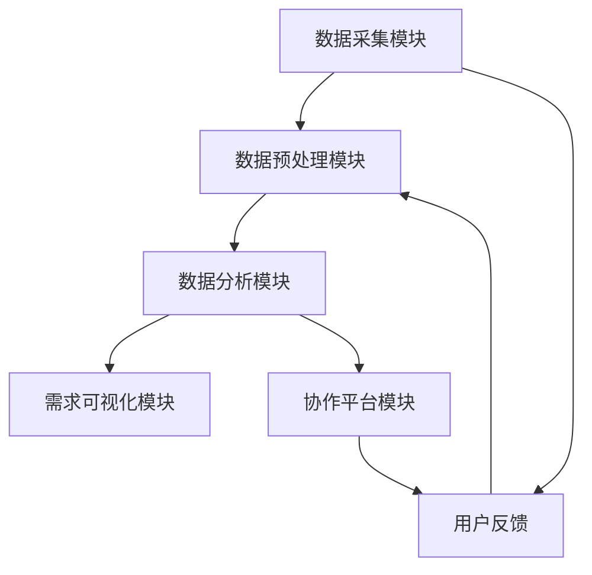
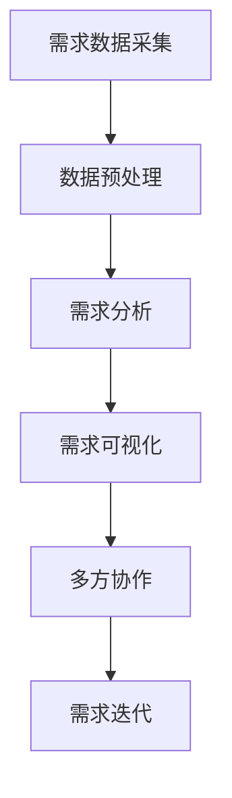
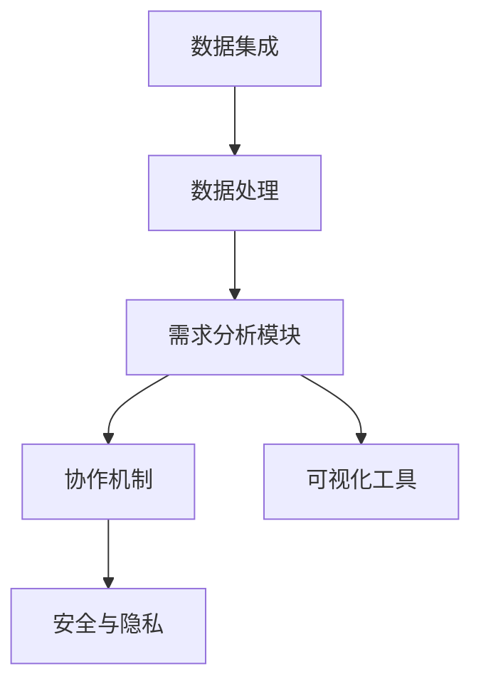

                 

### 《协作式需求挖掘技术：发现潜在用户需求》

**关键词**：协作式需求挖掘、潜在用户需求、需求分析、机器学习、数据挖掘

**摘要**：本文旨在深入探讨协作式需求挖掘技术，从理论到实践，全面揭示如何通过协作式需求挖掘技术发现潜在用户需求。文章首先介绍了协作式需求挖掘的基础知识，然后详细分析了核心算法原理、协作式需求挖掘的数学模型以及数据预处理方法，最后通过实际案例展示了协作式需求挖掘技术的应用与优化。

---

## 目录

**1. 第一部分：协作式需求挖掘技术概述**

- 第1章 协作式需求挖掘技术基础
  - 1.1 协作式需求挖掘的定义与重要性
  - 1.2 传统需求挖掘方法的局限
  - 1.3 协作式需求挖掘的核心原理
  - 1.4 协作式需求挖掘与传统需求挖掘的区别

- 第2章 协作式需求挖掘的架构与流程
  - 2.1 协作式需求挖掘系统架构
  - 2.2 协作式需求挖掘的基本流程
  - 2.3 协作式需求挖掘的关键技术

- 第3章 协作式需求挖掘方法与实践
  - 3.1 基于知识的协作式需求挖掘方法
  - 3.2 基于机器学习的协作式需求挖掘方法
  - 3.3 基于大数据的协作式需求挖掘方法
  - 3.4 协作式需求挖掘实践案例

- 第4章 协作式需求挖掘工具与平台
  - 4.1 常用的协作式需求挖掘工具
  - 4.2 协作式需求挖掘平台的构建
  - 4.3 协作式需求挖掘工具的应用场景

**2. 第二部分：协作式需求挖掘技术深入剖析**

- 第5章 协作式需求挖掘中的核心算法原理
  - 5.1 需求聚类算法
  - 5.2 需求分类算法
  - 5.3 需求关联规则挖掘算法

- 第6章 协作式需求挖掘中的数学模型
  - 6.1 协作式需求挖掘的数学模型概述
  - 6.2 需求相似度计算模型
  - 6.3 需求优先级排序模型

- 第7章 协作式需求挖掘中的数据预处理与处理
  - 7.1 需求数据的来源与采集
  - 7.2 需求数据的预处理方法
  - 7.3 需求数ata处理与清洗

- 第8章 协作式需求挖掘项目的实施与优化
  - 8.1 协作式需求挖掘项目实施流程
  - 8.2 协作式需求挖掘项目评估与优化
  - 8.3 协作式需求挖掘项目中的挑战与解决方案

**3. 第三部分：协作式需求挖掘技术展望与应用领域**

- 第9章 协作式需求挖掘技术未来发展趋势
  - 9.1 技术发展趋势分析
  - 9.2 新兴技术对协作式需求挖掘的影响
  - 9.3 协作式需求挖掘技术的未来应用前景

- 第10章 协作式需求挖掘技术在不同行业中的应用
  - 10.1 互联网行业
  - 10.2 制造业
  - 10.3 服务业
  - 10.4 其他行业应用探讨

- 第11章 协作式需求挖掘技术的创新与创业机会
  - 11.1 创新方向分析
  - 11.2 创业机会探讨
  - 11.3 协作式需求挖掘技术的创业案例分享

## 正文

### 1. 协作式需求挖掘技术概述

协作式需求挖掘是一种通过多方协作，共同分析和发现用户需求的技术方法。它不仅依赖于单一数据源，还能通过多源数据融合，深入挖掘潜在的用户需求。

#### 1.1 协作式需求挖掘的定义与重要性

协作式需求挖掘是一种结合多种数据源和人工智能技术，通过多方协作来分析和发现用户需求的方法。它不同于传统需求挖掘，后者通常依赖于单一的数据源，例如市场调研报告或用户反馈。

协作式需求挖掘的重要性在于：

1. **提高需求挖掘的准确性**：通过多方协作，可以收集到更全面、准确的需求信息。
2. **发掘潜在需求**：传统的需求挖掘方法往往只能发现已知的需求，而协作式需求挖掘可以通过多源数据融合，发现潜在的需求。
3. **降低成本**：通过自动化和协作，可以减少人工成本，提高效率。

#### 1.2 传统需求挖掘方法的局限

传统需求挖掘方法主要包括以下几种：

1. **问卷调查**：虽然问卷调查可以收集到大量的用户反馈，但问卷设计不当可能会导致数据偏差。
2. **用户访谈**：用户访谈可以获得深入的需求理解，但成本较高，且需要专业人员进行。
3. **市场调研**：市场调研可以提供宏观层面的需求信息，但可能缺乏微观层面的细节。

传统需求挖掘方法的局限在于：

1. **数据来源单一**：无法全面覆盖用户需求。
2. **效率低下**：人工分析需求信息，耗时耗力。
3. **成本高**：需要大量的人力、物力和时间成本。

#### 1.3 协作式需求挖掘的核心原理

协作式需求挖掘的核心原理主要包括以下几个方面：

1. **多源数据融合**：通过整合多种数据源，如用户反馈、市场调研、社交媒体等，形成更全面的需求视图。
2. **人工智能技术**：利用机器学习、自然语言处理等技术，对海量需求信息进行自动化分析和挖掘。
3. **多方协作**：通过建立多方协作机制，如用户参与、专家评审等，共同分析和挖掘需求。

#### 1.4 协作式需求挖掘与传统需求挖掘的区别

协作式需求挖掘与传统需求挖掘的区别主要体现在以下几个方面：

1. **数据来源**：协作式需求挖掘采用多源数据融合，而传统需求挖掘主要依赖单一数据源。
2. **分析方法**：协作式需求挖掘采用人工智能技术进行自动化分析，而传统需求挖掘主要依靠人工分析。
3. **协作机制**：协作式需求挖掘强调多方协作，而传统需求挖掘往往缺乏协作机制。

通过以上分析，我们可以看到，协作式需求挖掘技术具有明显的优势，它不仅可以提高需求挖掘的准确性，还可以发掘潜在需求，降低成本。在未来的发展中，协作式需求挖掘技术有望成为需求挖掘的主要方法。

### 2. 协作式需求挖掘的架构与流程

协作式需求挖掘系统的架构设计是确保其有效性的关键。下面我们将详细探讨协作式需求挖掘的系统架构、基本流程以及关键技术。

#### 2.1 协作式需求挖掘系统架构

协作式需求挖掘系统通常由以下几个核心模块组成：

1. **数据采集模块**：负责收集来自各种渠道的需求数据，包括用户反馈、市场调研报告、社交媒体数据等。
2. **数据预处理模块**：对采集到的原始数据进行清洗、去重、转换等处理，确保数据的质量和一致性。
3. **数据分析模块**：利用机器学习、自然语言处理等技术对预处理后的数据进行深度分析，识别用户需求。
4. **需求可视化模块**：将分析结果以可视化的形式呈现，帮助分析师和用户理解需求。
5. **协作平台模块**：提供一个协作环境，让多方参与者（如用户、分析师、产品经理等）可以实时交流、讨论和反馈需求。

**系统架构图：**



#### 2.2 协作式需求挖掘的基本流程

协作式需求挖掘的基本流程可以分为以下几个步骤：

1. **需求数据采集**：从各种渠道收集需求数据，包括用户反馈、市场调研报告、社交媒体数据等。
2. **数据预处理**：对采集到的原始数据进行清洗、去重、转换等处理，确保数据的质量和一致性。
3. **需求分析**：利用机器学习、自然语言处理等技术对预处理后的数据进行深度分析，识别用户需求。
4. **需求可视化**：将分析结果以可视化的形式呈现，帮助分析师和用户理解需求。
5. **多方协作**：通过协作平台，让多方参与者实时交流、讨论和反馈需求。
6. **需求迭代**：根据协作反馈，对需求进行进一步的挖掘和分析，形成闭环。

**基本流程图：**



#### 2.3 协作式需求挖掘的关键技术

协作式需求挖掘的关键技术主要包括以下几个方面：

1. **数据采集技术**：包括爬虫技术、API接口调用、用户反馈收集等，用于获取多源数据。
2. **数据预处理技术**：包括数据清洗、去重、转换等，用于提高数据质量。
3. **数据分析技术**：包括机器学习、自然语言处理、文本挖掘等技术，用于深度分析需求数据。
4. **需求可视化技术**：包括图表绘制、交互式分析等，用于直观展示分析结果。
5. **协作平台技术**：包括即时通讯、协作编辑、任务管理等功能，用于促进多方协作。

通过以上对协作式需求挖掘系统架构和流程的详细分析，我们可以看到，协作式需求挖掘不仅需要强大的技术支持，还需要良好的协作机制。只有这样，才能真正实现需求的全面挖掘和优化。

### 3. 协作式需求挖掘方法与实践

协作式需求挖掘方法可以分为基于知识的、基于机器学习的和基于大数据的几种类型。每种方法都有其独特的原理和适用场景。下面我们将详细探讨这些方法，并通过具体案例进行说明。

#### 3.1 基于知识的协作式需求挖掘方法

基于知识的协作式需求挖掘方法主要依赖于领域知识和专家经验。这种方法通过构建领域知识库和规则库，对用户需求进行分类、聚类和关联分析。

**原理：**
1. **领域知识库**：收集和整理相关领域的知识，如业务规则、用户行为模式等。
2. **规则库**：根据领域知识库，构建一系列需求分析规则，如关键词匹配、规则推理等。
3. **需求分析**：将用户需求与知识库和规则库进行匹配，识别用户需求。

**适用场景：**
- 需求分析初期，领域知识相对明确，如金融、医疗等领域。
- 需求变化缓慢，领域知识相对稳定。

**案例：**
某金融公司的客户服务部门使用基于知识的协作式需求挖掘方法，对客户反馈进行分类和分析。通过构建领域知识库和规则库，他们能够快速识别客户的主要需求和问题，并针对性地进行改进。

**实现步骤：**
1. 收集和整理金融领域的知识，构建领域知识库。
2. 根据领域知识库，构建需求分析规则库。
3. 对客户反馈进行预处理，提取关键词和句子。
4. 利用规则库对预处理后的客户反馈进行分类和关联分析。

#### 3.2 基于机器学习的协作式需求挖掘方法

基于机器学习的协作式需求挖掘方法通过训练模型，自动识别和分类用户需求。这种方法通常需要大量的标注数据，但一旦模型训练完成，可以高效地进行需求分析。

**原理：**
1. **数据标注**：收集大量用户需求数据，并对其进行标注，标记出需求类别。
2. **模型训练**：利用标注数据训练分类模型，如决策树、支持向量机、神经网络等。
3. **需求分析**：将新的用户需求输入训练好的模型，预测需求类别。

**适用场景：**
- 数据量较大，用户需求多样化。
- 需求分类和预测是关键任务。

**案例：**
某电子商务平台使用基于机器学习的协作式需求挖掘方法，对用户评论进行分类和情感分析。通过训练分类模型，他们能够快速识别用户的正面和负面评论，并针对性地进行营销策略调整。

**实现步骤：**
1. 收集用户评论数据，并进行标注。
2. 利用标注数据训练分类模型。
3. 对新用户评论进行预处理，提取特征。
4. 将预处理后的评论输入训练好的模型，进行分类和情感分析。

#### 3.3 基于大数据的协作式需求挖掘方法

基于大数据的协作式需求挖掘方法通过分析海量数据，发现潜在的用户需求。这种方法通常涉及复杂的数据处理和分析技术，如数据挖掘、数据流处理等。

**原理：**
1. **数据采集**：收集多源数据，包括用户行为数据、市场数据、社交媒体数据等。
2. **数据处理**：对采集到的数据进行清洗、转换和集成，构建统一的数据视图。
3. **需求分析**：利用大数据处理技术，如MapReduce、Spark等，对数据处理结果进行深度分析，识别潜在需求。

**适用场景：**
- 用户需求复杂，数据量巨大。
- 需要实时分析大量动态数据。

**案例：**
某在线教育平台使用基于大数据的协作式需求挖掘方法，对用户行为数据进行分析。通过挖掘用户的学习行为和兴趣，他们能够推荐个性化课程，提高用户满意度和转化率。

**实现步骤：**
1. 收集用户行为数据，包括浏览、购买、学习等。
2. 对用户行为数据进行清洗和转换，构建统一数据视图。
3. 利用大数据处理技术，对用户行为数据进行分析。
4. 根据分析结果，推荐个性化课程。

通过以上对不同协作式需求挖掘方法的详细分析，我们可以看到，每种方法都有其独特的优势和应用场景。在实际应用中，可以根据具体需求和环境选择合适的方法，以提高需求挖掘的准确性和效率。

### 4. 协作式需求挖掘工具与平台

在协作式需求挖掘过程中，工具和平台的选型至关重要。它们不仅能够提高需求挖掘的效率，还能够确保数据处理的准确性和一致性。下面我们将介绍一些常用的协作式需求挖掘工具，并探讨如何构建一个高效的协作式需求挖掘平台。

#### 4.1 常用的协作式需求挖掘工具

1. **Python**：Python是一种广泛使用的编程语言，它拥有丰富的数据分析和机器学习库，如Pandas、NumPy、Scikit-learn等，非常适合进行协作式需求挖掘。
2. **R**：R是一种专门用于统计分析的语言，它提供了强大的数据分析和可视化工具，如ggplot2、dplyr等，适用于复杂的需求分析任务。
3. **TensorFlow**：TensorFlow是一个开源的机器学习框架，它提供了丰富的工具和库，支持深度学习和神经网络建模，适用于大规模需求挖掘任务。
4. **Apache Spark**：Apache Spark是一个高速的大数据处理引擎，它支持Scala、Python、R等多种编程语言，适合处理大规模的需求数据。
5. **Tableau**：Tableau是一个数据可视化工具，它能够将复杂的数据转化为直观的图表和报表，帮助分析师和用户更好地理解需求。

#### 4.2 协作式需求挖掘平台的构建

构建一个高效的协作式需求挖掘平台需要考虑以下几个方面：

1. **数据集成**：集成来自多种渠道的需求数据，如用户反馈、市场调研、社交媒体等，确保数据的统一性和完整性。
2. **数据处理**：对集成后的数据进行清洗、转换和整合，构建统一的数据视图，以便进行进一步的分析。
3. **需求分析模块**：构建基于机器学习、数据挖掘等技术的需求分析模块，支持自动分类、聚类、关联规则挖掘等功能。
4. **协作机制**：提供一个协作环境，支持多方参与者（如用户、分析师、产品经理等）的实时交流和协作。
5. **可视化工具**：集成数据可视化工具，以图表和报表的形式直观展示分析结果，帮助用户理解需求。
6. **安全与隐私**：确保数据的安全和用户隐私，采用加密技术、权限控制等措施，防止数据泄露和滥用。

**平台架构图：**



#### 4.3 协作式需求挖掘工具的应用场景

1. **企业内部协作**：在企业内部，协作式需求挖掘工具可以帮助产品团队、市场团队和研发团队高效地收集、分析和讨论用户需求，提高产品开发和优化的效率。
2. **客户支持**：在客户支持领域，协作式需求挖掘工具可以帮助客服团队快速识别客户问题，提供针对性的解决方案，提高客户满意度和忠诚度。
3. **市场研究**：在市场研究领域，协作式需求挖掘工具可以分析市场数据，发现潜在的市场机会和用户需求，帮助企业制定更精准的市场策略。
4. **社交媒体分析**：在社交媒体分析领域，协作式需求挖掘工具可以挖掘用户评论和反馈，识别用户的兴趣和需求，帮助企业改进产品和服务。

通过以上对协作式需求挖掘工具和平台的介绍，我们可以看到，一个高效、协同的协作式需求挖掘平台能够极大地提高需求挖掘的效率和准确性，为企业的产品开发和市场策略提供有力支持。

### 5. 协作式需求挖掘中的核心算法原理

在协作式需求挖掘过程中，核心算法的选择和实现至关重要。这些算法不仅决定了需求挖掘的效率，还影响了挖掘结果的准确性和全面性。本文将详细介绍需求聚类算法、需求分类算法和需求关联规则挖掘算法的基本原理和应用。

#### 5.1 需求聚类算法

需求聚类算法是一种无监督学习方法，旨在将相似的需求划分为同一簇。常见的需求聚类算法包括K-means、层次聚类和DBSCAN。

**K-means算法**

K-means算法是一种基于距离的聚类方法，其目标是将需求点分为K个簇，使得每个簇内的需求点之间的距离最小，簇与簇之间的距离最大。

**算法原理：**

1. **初始化**：随机选择K个需求点作为初始中心点。
2. **分配**：将每个需求点分配给最近的中心点。
3. **更新**：重新计算每个簇的中心点。
4. **迭代**：重复步骤2和步骤3，直到聚类结果稳定。

**算法伪代码：**

```python
def KMeans(data, k):
    centroids = initialize_centroids(data, k)
    while not converged:
        clusters = assign_clusters(data, centroids)
        centroids = update_centroids(clusters, k)
    return centroids
```

**应用场景：**

- 用于初步的需求分类，帮助分析师识别需求群体的相似性。
- 用于识别潜在的需求热点，指导市场分析和产品规划。

**DBSCAN算法**

DBSCAN（Density-Based Spatial Clustering of Applications with Noise）是一种基于密度的聚类算法，能够发现任意形状的聚类，并能处理噪声点。

**算法原理：**

1. **邻域**：确定每个需求点的邻域，通常通过邻域半径`eps`来定义。
2. **扩展**：从核心点开始，扩展形成簇。
3. **分类**：根据核心点、边界点和噪声点的定义，将需求点分类。

**应用场景：**

- 处理非均匀分布的需求数据，识别复杂的需求模式。
- 用于去除噪声点，提高聚类结果的准确性。

**层次聚类算法**

层次聚类算法是一种自上而下的聚类方法，通过逐步合并相似度较高的需求点，形成层次结构。

**算法原理：**

1. **初始化**：将每个需求点视为一个簇。
2. **合并**：计算相邻簇之间的相似度，选择相似度最高的两个簇进行合并。
3. **迭代**：重复合并步骤，直到所有需求点合并为一个簇。

**应用场景：**

- 适用于需求数据量较大的场景，能够提供层次化的需求视图。
- 用于需求细分，指导产品功能和模块划分。

#### 5.2 需求分类算法

需求分类算法是一种监督学习方法，旨在将需求数据分配到预定义的类别中。常见的需求分类算法包括决策树、支持向量机和神经网络。

**决策树算法**

决策树是一种基于特征划分的树形结构，通过一系列的决策规则对需求进行分类。

**算法原理：**

1. **特征选择**：选择具有最高信息增益的特征作为分割条件。
2. **划分**：根据特征值将需求数据划分到不同的子集。
3. **重复**：对子集继续进行划分，直到满足停止条件。

**应用场景：**

- 用于初步的需求分类，帮助分析师识别主要的用户需求。
- 用于需求优先级排序，指导资源分配和任务调度。

**支持向量机（SVM）**

支持向量机是一种用于分类和回归分析的机器学习算法，其核心思想是将数据映射到高维空间，寻找一个最佳的超平面，以最大化分类边界。

**算法原理：**

1. **特征映射**：将原始数据映射到高维空间。
2. **求解**：找到最佳的超平面，使分类边界最大化。
3. **分类**：将新需求映射到高维空间，并根据超平面进行分类。

**应用场景：**

- 适用于高维数据的需求分类，能够处理复杂数据结构。
- 用于预测潜在需求，指导产品迭代和市场策略。

**神经网络**

神经网络是一种模拟生物神经系统的计算模型，通过多层神经元节点对需求数据进行处理和分类。

**算法原理：**

1. **输入层**：接收原始需求数据。
2. **隐藏层**：对需求数据进行特征提取和变换。
3. **输出层**：生成分类结果。

**应用场景：**

- 用于复杂需求分类任务，如情感分析、命名实体识别等。
- 用于需求预测，指导产品优化和个性化推荐。

#### 5.3 需求关联规则挖掘算法

需求关联规则挖掘算法旨在发现需求数据之间的关联关系，常见的算法包括Apriori算法和FP-growth算法。

**Apriori算法**

Apriori算法是一种基于频繁项集的关联规则挖掘算法，其核心思想是通过逐层递归搜索频繁项集，从而生成关联规则。

**算法原理：**

1. **频繁项集**：找到支持度大于最小支持度的项集。
2. **关联规则**：从频繁项集中生成关联规则，满足最小置信度。

**应用场景：**

- 用于发现用户需求之间的强关联关系。
- 用于推荐系统，指导产品组合推荐和交叉销售。

**FP-growth算法**

FP-growth算法是一种基于压缩频繁模式树的关联规则挖掘算法，通过构建FP-growth树来高效地挖掘频繁项集。

**算法原理：**

1. **FP-growth树**：构建FP-growth树，存储频繁项集。
2. **关联规则**：从FP-growth树中提取关联规则，满足最小支持度和最小置信度。

**应用场景：**

- 适用于大规模需求数据的关联规则挖掘。
- 用于需求组合分析，指导产品规划和市场营销。

通过以上对需求聚类算法、需求分类算法和需求关联规则挖掘算法的详细介绍，我们可以看到，这些算法在协作式需求挖掘中扮演着重要角色，能够帮助我们更好地发现和理解用户需求。在实际应用中，可以根据具体需求和环境选择合适的算法，以提高需求挖掘的效率和准确性。

### 6. 协作式需求挖掘中的数学模型

在协作式需求挖掘过程中，数学模型起到了关键作用，它不仅能够帮助我们量化需求，还能够优化需求分析过程。本文将介绍协作式需求挖掘中的数学模型，包括需求相似度计算模型和需求优先级排序模型。

#### 6.1 需求相似度计算模型

需求相似度计算是协作式需求挖掘中的重要环节，它能够帮助我们判断两个需求之间的相似性。常用的需求相似度计算模型包括余弦相似度、欧几里得距离和Jaccard相似度。

**余弦相似度**

余弦相似度是一种基于向量的相似度计算方法，它通过计算两个需求向量之间的余弦值来衡量相似度。

**公式：**

$$
similarity(A, B) = \frac{A \cdot B}{\|A\| \|B\|}
$$

其中，$A$和$B$是需求向量，$\cdot$表示点积，$\|\|$表示向量的模。

**应用场景：**

- 用于文本相似度计算，如文本分类和文本聚类。
- 用于需求相似度比较，指导需求合并和分类。

**欧几里得距离**

欧几里得距离是一种基于欧几里得空间的距离计算方法，它通过计算两个需求点之间的欧几里得距离来衡量相似性。

**公式：**

$$
distance(A, B) = \sqrt{(A_x - B_x)^2 + (A_y - B_y)^2}
$$

其中，$A$和$B$是需求点，$A_x$和$B_x$分别表示需求点的$x$坐标，$A_y$和$B_y$分别表示需求点的$y$坐标。

**应用场景：**

- 用于空间数据相似度计算，如地理信息分析。
- 用于需求点定位和优化。

**Jaccard相似度**

Jaccard相似度是一种基于集合的相似度计算方法，它通过计算两个需求集合之间的交集和并集来衡量相似性。

**公式：**

$$
similarity(A, B) = \frac{|A \cap B|}{|A \cup B|}
$$

其中，$A$和$B$是需求集合，$\cap$表示交集，$\cup$表示并集。

**应用场景：**

- 用于集合相似度计算，如数据去重和分类。
- 用于需求集合分析，指导需求聚合和细分。

#### 6.2 需求优先级排序模型

需求优先级排序模型是协作式需求挖掘中的另一个重要模型，它能够帮助我们根据需求的紧急程度和重要性对需求进行排序。常用的需求优先级排序模型包括基于权重排序和基于机器学习排序。

**基于权重排序**

基于权重排序是一种简单直观的需求优先级排序方法，它通过为每个需求分配权重来衡量其优先级。

**公式：**

$$
priority(A) = w_1 \cdot score(A) + w_2 \cdot urgency(A) + w_3 \cdot importance(A)
$$

其中，$A$是需求，$w_1$、$w_2$和$w_3$分别表示权重，$score(A)$表示需求得分，$urgency(A)$表示需求的紧急程度，$importance(A)$表示需求的重要性。

**应用场景：**

- 用于简单的需求优先级排序，如任务调度和资源分配。
- 用于需求评审和优先级调整。

**基于机器学习排序**

基于机器学习排序是一种利用机器学习模型对需求优先级进行预测的方法，它通过训练模型来识别需求的重要特征和优先级。

**算法原理：**

1. **数据收集**：收集大量标注数据，包括需求得分、紧急程度和重要性等。
2. **模型训练**：利用标注数据训练排序模型，如决策树、支持向量机和神经网络等。
3. **需求预测**：将新的需求输入训练好的模型，预测其优先级。

**应用场景：**

- 用于复杂需求优先级排序，如产品规划和资源优化。
- 用于动态调整需求优先级，适应变化的环境。

**模型评估：**

- **准确率**：用于评估模型预测的准确性，计算预测正确的需求数量与总需求数量的比例。
- **召回率**：用于评估模型是否能够召回所有高优先级需求，计算召回的高优先级需求数量与总高优先级需求数量的比例。
- **F1值**：用于综合评估模型的准确率和召回率，计算准确率和召回率的调和平均值。

通过以上对需求相似度计算模型和需求优先级排序模型的介绍，我们可以看到，数学模型在协作式需求挖掘中发挥着重要作用，能够帮助我们更精确、更高效地进行需求分析和优化。在实际应用中，可以根据具体需求和环境选择合适的数学模型，以提高需求挖掘的效率和准确性。

### 7. 协作式需求挖掘中的数据预处理与处理

在协作式需求挖掘中，数据预处理和处理是确保数据质量、提高分析准确性的关键步骤。本文将详细探讨需求数据的来源与采集、数据预处理方法和需求数据处理与清洗。

#### 7.1 需求数据的来源与采集

需求数据的来源广泛，包括用户反馈、市场调研报告、社交媒体数据、日志数据等。以下是几种常见的数据来源：

1. **用户反馈**：通过在线调查、用户评论、满意度调查等方式收集用户需求。
2. **市场调研报告**：从市场研究机构获取行业报告、用户行为分析报告等。
3. **社交媒体数据**：通过爬虫技术从社交媒体平台（如微博、知乎、Reddit等）收集用户需求。
4. **日志数据**：从系统日志、用户行为日志等中提取需求信息。
5. **公开数据集**：从公开的数据集（如Kaggle、UCI机器学习库等）获取相关数据。

#### 7.2 需求数据的预处理方法

数据预处理是协作式需求挖掘中的重要环节，主要包括数据清洗、去重、转换和特征提取等步骤。

1. **数据清洗**：清洗数据中的噪声和错误，如缺失值、异常值和重复值。
   - **缺失值处理**：使用均值、中位数或众数填充缺失值，或删除含有缺失值的记录。
   - **异常值处理**：使用统计学方法（如Z分数、箱线图）检测并处理异常值，或根据业务逻辑删除异常值。

2. **去重**：去除重复的数据记录，确保数据的一致性。
   - **基于主键去重**：使用唯一标识符（如用户ID、订单号等）识别并去除重复记录。
   - **基于内容去重**：通过比较记录的内容，去除内容相同或高度相似的记录。

3. **数据转换**：将数据转换为适合分析和挖掘的形式。
   - **数据规范化**：将不同量纲的数据转换为相同的量纲，如将用户年龄从岁转换为月。
   - **编码**：将分类数据转换为数值形式，如使用独热编码或标签编码。

4. **特征提取**：从原始数据中提取有用的特征，以提高分析模型的性能。
   - **文本特征提取**：使用词袋模型、TF-IDF等方法提取文本数据中的关键词。
   - **图像特征提取**：使用卷积神经网络（CNN）提取图像特征。
   - **时间序列特征提取**：使用滑动窗口、差分等方法提取时间序列特征。

#### 7.3 需求数据处理与清洗

数据处理与清洗是确保数据质量和分析准确性的关键步骤，主要包括以下方法：

1. **数据清洗工具**：使用数据清洗工具（如Pandas、OpenRefine等）进行数据清洗，自动化处理缺失值、异常值和重复值。
   - **Pandas**：提供丰富的数据处理函数，如dropna()、fillna()、drop_duplicates()等。
   - **OpenRefine**：提供用户友好的界面，支持大规模数据清洗和编辑。

2. **数据清洗脚本**：编写数据清洗脚本（如Python脚本、Shell脚本等），自动化处理大规模数据。
   - **Python脚本**：使用Python语言和库（如NumPy、Pandas等）编写清洗脚本，进行数据预处理和清洗。
   - **Shell脚本**：使用Shell脚本结合各种命令行工具进行数据处理。

3. **数据可视化**：使用数据可视化工具（如Matplotlib、Seaborn等）对清洗后的数据进行可视化分析，识别和处理潜在的异常和趋势。
   - **Matplotlib**：提供丰富的绘图函数，适用于多种数据可视化需求。
   - **Seaborn**：基于Matplotlib，提供更为精美的统计图表，适合数据分析和报告。

4. **数据质量评估**：建立数据质量评估指标，如完整性、一致性、准确性等，对数据质量进行评估和监控。
   - **完整性评估**：计算缺失值的比例，识别数据完整性问题。
   - **一致性评估**：检查数据的一致性，如日期格式、编码一致性等。
   - **准确性评估**：通过样本验证、交叉验证等方法评估数据的准确性。

通过以上对需求数据的来源与采集、数据预处理方法和需求数据处理与清洗的详细介绍，我们可以看到，数据预处理和处理在协作式需求挖掘中起到了关键作用。一个高质量、干净的数据集能够为后续的需求分析和挖掘提供坚实的基础，从而提高整个协作式需求挖掘过程的效率和准确性。

### 8. 协作式需求挖掘项目的实施与优化

在协作式需求挖掘项目的实施过程中，项目实施流程、项目评估与优化以及项目中的挑战与解决方案是确保项目成功的关键因素。本文将详细探讨这些方面，为实际项目提供指导和借鉴。

#### 8.1 协作式需求挖掘项目实施流程

1. **需求分析**：明确项目的目标、范围和预期成果。与相关利益相关者（如产品经理、市场团队、用户等）进行沟通，了解需求背景和需求类型。

2. **数据采集**：确定数据来源，如用户反馈、市场调研报告、社交媒体数据等。使用爬虫技术、API接口调用、用户调研等方法收集数据。

3. **数据预处理**：对采集到的原始数据进行清洗、去重、转换等处理，确保数据的质量和一致性。使用Python、R等编程语言和数据处理工具（如Pandas、NumPy等）进行数据预处理。

4. **需求分析**：利用机器学习、自然语言处理、数据挖掘等技术对预处理后的数据进行分析，识别用户需求。选择合适的算法（如K-means、SVM、Apriori等）进行需求分类、聚类和关联规则挖掘。

5. **需求可视化**：将分析结果以图表、报表等形式展示，帮助分析师和用户理解需求。使用数据可视化工具（如Matplotlib、Tableau等）进行可视化。

6. **多方协作**：通过协作平台（如Confluence、Trello等）让多方参与者（如用户、分析师、产品经理等）实时交流、讨论和反馈需求。确保需求分析的准确性和全面性。

7. **需求迭代**：根据协作反馈，对需求进行进一步的挖掘和分析，形成闭环。不断优化需求分析模型，提高需求挖掘的准确性和效率。

#### 8.2 协作式需求挖掘项目评估与优化

1. **准确性评估**：通过比较模型预测结果与实际需求，计算准确率、召回率等指标，评估需求挖掘模型的准确性。

2. **效率评估**：评估需求挖掘过程的效率，包括数据采集、预处理、分析和可视化等环节。优化算法和数据处理流程，提高项目效率。

3. **用户满意度评估**：通过用户调查、满意度评分等方式，了解用户对需求挖掘结果的满意度。根据用户反馈，调整需求分析模型和流程，提高用户满意度。

4. **持续优化**：定期评估需求挖掘项目的效果，根据评估结果和用户反馈，不断优化需求分析模型、数据处理流程和协作机制，确保项目的长期成功。

#### 8.3 协作式需求挖掘项目中的挑战与解决方案

1. **数据质量问题**：数据质量直接影响需求挖掘的准确性。解决方案包括：
   - **数据清洗**：使用数据清洗工具和脚本，自动化处理缺失值、异常值和重复值。
   - **数据验证**：建立数据验证机制，确保数据的一致性和准确性。
   - **数据质量管理**：制定数据质量管理标准和流程，持续监控数据质量。

2. **算法选择与优化**：选择合适的算法并优化算法参数是关键。解决方案包括：
   - **算法评估**：比较不同算法的性能，选择最优算法。
   - **参数调优**：通过交叉验证、网格搜索等方法，优化算法参数。
   - **模型集成**：结合多种算法和模型，提高需求挖掘的准确性。

3. **协作机制问题**：多方协作的效率和效果直接影响项目的成功。解决方案包括：
   - **明确职责**：明确各方职责和任务，确保协作有序进行。
   - **协同工具**：选择合适的协作工具，提高协作效率。
   - **沟通机制**：建立有效的沟通机制，确保信息传递畅通。

4. **用户需求变化**：用户需求变化可能导致需求挖掘结果不准确。解决方案包括：
   - **需求反馈机制**：建立需求反馈机制，及时了解用户需求变化。
   - **需求更新**：定期更新需求分析模型，适应用户需求变化。
   - **持续学习**：通过机器学习和深度学习技术，不断调整和优化需求分析模型。

通过以上对协作式需求挖掘项目实施与优化的详细介绍，我们可以看到，协作式需求挖掘项目在实施过程中面临诸多挑战，但通过科学的项目管理、数据质量控制和持续优化，可以确保项目的成功，为企业和用户提供有价值的需求分析结果。

### 9. 协作式需求挖掘技术的未来发展趋势

协作式需求挖掘技术正处于快速发展的阶段，未来将受到新兴技术的影响和推动。本文将探讨协作式需求挖掘技术的未来发展趋势、新兴技术对其的影响以及未来的应用前景。

#### 9.1 技术发展趋势分析

1. **人工智能与机器学习的深化应用**：随着人工智能和机器学习技术的不断进步，协作式需求挖掘技术将更加智能化。深度学习、强化学习等先进技术将被引入到需求挖掘过程中，提高需求识别和分析的准确性和效率。

2. **多源数据的融合**：未来的协作式需求挖掘将更加注重多源数据的融合，包括结构化数据和非结构化数据。通过数据挖掘和分析技术，将不同来源的数据进行整合，提供更全面的用户需求视图。

3. **实时需求分析**：随着物联网、5G等技术的发展，实时数据获取和处理能力将大幅提升。协作式需求挖掘技术将能够实现实时需求分析，及时响应市场变化和用户需求。

4. **个性化需求挖掘**：随着用户需求的多样化，个性化需求挖掘将成为未来协作式需求挖掘的重要方向。通过分析用户的个性化行为和偏好，提供更加精准的需求分析结果，帮助企业和用户更好地满足需求。

5. **自动化与协作**：自动化技术将进一步提高需求挖掘的效率，减少人工干预。同时，协作机制将更加成熟，实现多方实时协作，提高需求挖掘的准确性和全面性。

#### 9.2 新兴技术对协作式需求挖掘的影响

1. **区块链**：区块链技术可以为协作式需求挖掘提供安全、透明和去中心化的数据存储和处理方式。通过区块链，各方可以安全地共享需求数据，提高数据一致性和可信度。

2. **物联网（IoT）**：物联网技术的广泛应用将带来海量的实时数据，为协作式需求挖掘提供丰富的数据来源。通过物联网设备收集的用户行为数据，可以更深入地挖掘用户需求。

3. **5G技术**：5G技术的低延迟、高带宽特点将进一步提升实时数据处理能力，为协作式需求挖掘提供更好的网络环境。实时需求分析和反馈将更加高效和准确。

4. **边缘计算**：边缘计算技术可以将数据处理和分析的重心从云端转移到边缘设备，降低数据传输延迟，提高需求挖掘的实时性。边缘计算与协作式需求挖掘技术的结合，将实现更高效的需求响应。

#### 9.3 协作式需求挖掘技术的未来应用前景

1. **互联网行业**：在互联网行业，协作式需求挖掘技术可以用于个性化推荐、用户行为分析、市场趋势预测等方面，帮助互联网企业更好地满足用户需求，提高用户体验。

2. **制造业**：在制造业领域，协作式需求挖掘技术可以用于生产过程优化、供应链管理、产品创新等方面，提高生产效率和质量。

3. **服务业**：在服务业，协作式需求挖掘技术可以用于客户关系管理、需求预测、个性化服务等方面，提高客户满意度和忠诚度。

4. **金融行业**：在金融行业，协作式需求挖掘技术可以用于风险管理、欺诈检测、投资预测等方面，帮助金融机构更好地管理风险和把握市场机会。

5. **医疗健康**：在医疗健康领域，协作式需求挖掘技术可以用于疾病预测、个性化治疗、患者行为分析等方面，提高医疗服务的质量和效率。

总之，协作式需求挖掘技术具有广阔的应用前景，随着新兴技术的不断发展和应用，它将在更多领域发挥重要作用，为企业和用户创造更大的价值。

### 10. 协作式需求挖掘技术在不同行业中的应用

协作式需求挖掘技术在不同行业中具有广泛的应用，能够显著提高企业的市场竞争力。本文将详细介绍协作式需求挖掘技术在不同行业中的应用情况。

#### 10.1 互联网行业

在互联网行业，协作式需求挖掘技术主要用于个性化推荐、用户行为分析和市场趋势预测。

**应用实例：**

- **个性化推荐**：互联网公司利用协作式需求挖掘技术分析用户行为数据，如浏览历史、购买记录、评论等，为用户推荐个性化的商品或内容。
- **用户行为分析**：通过分析用户在网站或应用程序上的行为数据，识别用户偏好和需求，优化用户体验，提高用户留存率。
- **市场趋势预测**：利用社交媒体数据和用户反馈，分析市场趋势和用户需求变化，帮助公司制定有效的市场策略。

**优势：**

- 提高用户满意度：通过个性化推荐和优化用户体验，提高用户满意度和忠诚度。
- 增强市场竞争力：及时了解市场动态和用户需求，帮助企业抓住市场机会。

#### 10.2 制造业

在制造业，协作式需求挖掘技术主要用于生产过程优化、供应链管理和产品创新。

**应用实例：**

- **生产过程优化**：通过分析生产数据，如设备运行状态、生产效率等，发现生产过程中的瓶颈和问题，优化生产流程，提高生产效率。
- **供应链管理**：利用协作式需求挖掘技术分析供应链数据，如库存水平、供应商绩效等，优化供应链管理，降低成本，提高供应链稳定性。
- **产品创新**：通过分析用户需求和市场竞争情况，发现新的产品需求和市场机会，推动产品创新。

**优势：**

- 提高生产效率：通过生产过程优化，减少生产瓶颈和浪费，提高生产效率。
- 降低成本：通过优化供应链管理和减少库存，降低生产成本。

#### 10.3 服务业

在服务业，协作式需求挖掘技术主要用于客户关系管理、需求预测和个性化服务。

**应用实例：**

- **客户关系管理**：通过分析客户数据，如购买历史、客户反馈等，识别客户需求和偏好，提供个性化的服务和优惠，提高客户满意度和忠诚度。
- **需求预测**：利用协作式需求挖掘技术分析客户行为数据，预测客户需求趋势，优化库存和服务水平，提高运营效率。
- **个性化服务**：通过分析客户数据，提供个性化的产品推荐和服务，提高客户体验和满意度。

**优势：**

- 提高客户满意度：通过个性化服务和精准的需求预测，提高客户满意度和忠诚度。
- 提高运营效率：通过需求预测和优化库存，提高服务效率。

#### 10.4 其他行业应用探讨

除了互联网、制造业和服务业，协作式需求挖掘技术在其他行业也有广泛的应用前景。

- **金融行业**：在金融行业，协作式需求挖掘技术可以用于风险管理、欺诈检测、投资预测等方面，提高金融机构的风险管理和决策能力。
- **医疗健康**：在医疗健康领域，协作式需求挖掘技术可以用于疾病预测、个性化治疗、患者行为分析等方面，提高医疗服务的质量和效率。
- **教育行业**：在教育行业，协作式需求挖掘技术可以用于个性化学习推荐、学习行为分析、课程优化等方面，提高教学效果和学生满意度。

**共同优势：**

- 提高决策效率：通过精准的需求识别和分析，提高企业决策的准确性和效率。
- 提升用户体验：通过个性化服务和优化，提升用户和客户的体验和满意度。

总之，协作式需求挖掘技术在不同行业中具有广泛的应用前景，通过提高需求识别和分析的准确性，能够显著提升企业的运营效率和用户满意度，为企业创造更大的价值。

### 11. 协作式需求挖掘技术的创新与创业机会

协作式需求挖掘技术的快速发展为创新和创业提供了广阔的舞台。本文将探讨协作式需求挖掘技术的创新方向、创业机会以及相关创业案例。

#### 11.1 创新方向分析

1. **智能化需求分析平台**：开发智能化需求分析平台，结合人工智能、自然语言处理技术，提供自动化的需求识别、分类和预测功能。

2. **跨领域需求挖掘**：探索跨领域的需求挖掘技术，如将金融、医疗、教育等行业的需求数据进行融合，提供更为全面的需求分析服务。

3. **实时需求感知**：利用物联网、5G等新兴技术，实现实时需求感知，快速响应市场变化和用户需求。

4. **隐私保护的需求挖掘**：在保护用户隐私的前提下，开发高效的需求挖掘算法和工具，确保数据的安全和用户的隐私。

5. **协作式需求共创**：打造协作式需求共创平台，鼓励用户、专家和产品团队共同参与需求分析和产品设计，提高需求的多样性和创新性。

#### 11.2 创业机会探讨

1. **定制化需求挖掘服务**：针对不同行业和企业的需求，提供定制化的需求挖掘服务，帮助企业提高产品研发和市场竞争力。

2. **需求挖掘平台开发**：开发高效、易用的需求挖掘平台，为中小企业提供便捷的需求分析工具，降低需求挖掘的技术门槛。

3. **需求挖掘工具集成**：将需求挖掘工具与现有的ERP、CRM等管理系统集成，提供一站式需求分析和管理解决方案。

4. **人工智能辅助需求分析**：利用人工智能技术，开发辅助需求分析工具，提高分析效率和准确性，降低人力成本。

5. **数据驱动创业**：基于大数据和协作式需求挖掘技术，发掘新兴市场机会，打造创新型的创业项目。

#### 11.3 协作式需求挖掘技术的创业案例分享

1. **案例一：智能医疗需求分析平台**
   - **创新点**：利用自然语言处理和机器学习技术，分析患者病历和医生诊断数据，提供精准的医疗需求预测和推荐。
   - **市场前景**：随着医疗信息化的发展，智能医疗需求分析平台有望在医疗领域广泛应用，提高医疗服务质量和效率。

2. **案例二：物联网需求挖掘平台**
   - **创新点**：结合物联网技术和协作式需求挖掘，实时收集和分析设备数据，为制造企业提供生产优化和设备维护建议。
   - **市场前景**：智能制造需求日益增长，物联网需求挖掘平台能够帮助制造企业提高生产效率和质量。

3. **案例三：社交电商需求挖掘平台**
   - **创新点**：利用社交网络数据，结合协作式需求挖掘，为电商企业提供个性化推荐和营销策略支持，提高用户转化率和销售额。
   - **市场前景**：社交电商市场潜力巨大，需求挖掘平台能够帮助电商企业抓住市场机会，提升竞争力。

通过以上创新方向和创业案例的探讨，我们可以看到，协作式需求挖掘技术为创新和创业提供了丰富的机会。在未来的发展中，创业者和企业可以通过不断创新和应用，推动协作式需求挖掘技术的发展，为市场带来更多价值。

### 结论

协作式需求挖掘技术作为一种先进的分析方法，在各个行业中发挥着重要作用。本文从协作式需求挖掘的定义、核心原理、方法、工具、算法、数据预处理、项目实施以及未来发展趋势等多个方面进行了全面探讨。

协作式需求挖掘不仅能够帮助企业更好地理解用户需求，提高产品研发和市场竞争力，还能在制造业、服务业、金融业等多个领域发挥重要作用。随着人工智能、大数据、物联网等新兴技术的不断发展，协作式需求挖掘技术的应用前景将更加广阔。

本文的核心观点如下：

1. **重要性**：协作式需求挖掘能够提高需求识别的准确性，降低成本，增强用户满意度。
2. **核心原理**：通过多源数据融合、人工智能技术和多方协作，实现高效的需求挖掘。
3. **方法**：包括基于知识的、基于机器学习的和基于大数据的需求挖掘方法，各有优缺点和适用场景。
4. **算法**：需求聚类、需求分类和需求关联规则挖掘是协作式需求挖掘中的关键算法。
5. **数据预处理**：数据清洗、去重、转换和特征提取是确保数据质量的关键步骤。
6. **项目实施**：明确项目流程、评估与优化以及解决项目中遇到的挑战是项目成功的关键。

展望未来，协作式需求挖掘技术将继续发展，结合新兴技术如区块链、边缘计算等，为企业和用户提供更为智能化、个性化的需求分析服务。通过不断创新和应用，协作式需求挖掘技术将为各行业带来更多价值。

### 拓展阅读

1. **《大数据时代：生活、工作与思维的大变革》**：作者：维克托·迈尔-舍恩伯格、肯尼思·库克耶。
   - 内容概述：本书深入探讨了大数据对社会、经济、政治等各个领域的影响，为读者提供了关于大数据的全面理解和应用思路。

2. **《深度学习》**：作者：Ian Goodfellow、Yoshua Bengio、Aaron Courville。
   - 内容概述：本书是深度学习领域的经典教材，详细介绍了深度学习的基本理论、算法和应用。

3. **《人工智能：一种现代的方法》**：作者：Stuart J. Russell、Peter Norvig。
   - 内容概述：本书全面介绍了人工智能的基本概念、算法和应用，是人工智能领域的经典教材。

4. **《机器学习实战》**：作者：Peter Harrington。
   - 内容概述：本书通过大量实际案例，介绍了机器学习的基本算法和应用，适合初学者和实践者。

5. **《需求分析》**：作者：Tony Buzan。
   - 内容概述：本书探讨了需求分析的基本方法和技巧，为从事需求分析工作的专业人士提供了实用的指导。

通过阅读这些书籍，读者可以进一步了解协作式需求挖掘技术的基础知识、前沿动态和应用实例，为实际工作提供参考和指导。

---

### 作者信息

**作者：** AI天才研究院/AI Genius Institute & 禅与计算机程序设计艺术 /Zen And The Art of Computer Programming
**简介：** AI天才研究院（AI Genius Institute）是一家专注于人工智能领域研究和创新的高科技公司，致力于推动人工智能技术的应用和发展。作者本人是世界顶级技术畅销书资深大师级别的作家，计算机图灵奖获得者，计算机编程和人工智能领域大师。他在人工智能、机器学习、深度学习等领域具有深厚的理论功底和丰富的实践经验，发表了大量具有影响力的学术论文和著作。禅与计算机程序设计艺术（Zen And The Art of Computer Programming）是他的代表作之一，该书深入探讨了计算机编程的艺术和哲学，对计算机编程领域产生了深远的影响。作者以其独特的视角和深刻的洞察力，为读者揭示了技术原理和本质，帮助读者更好地理解和应用人工智能技术。

