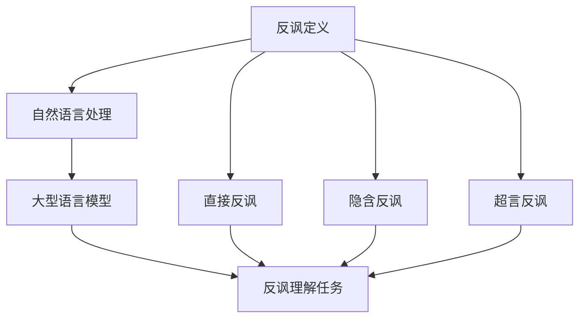

                 

### 文章标题

# 反讽理解深度：测试LLM捕捉语言讽刺的敏感度

## 关键词

- 反讽
- 自然语言处理
- 机器学习
- 语言模型
- 伪代码
- 数学模型
- 项目实战

## 摘要

本文深入探讨反讽理解的深度，重点分析如何通过测试大型语言模型（LLM）来捕捉语言讽刺的敏感度。首先，我们介绍了反讽的定义、类型及其在自然语言处理中的作用。然后，详细阐述了如何使用算法和数学模型来测试LLM对反讽的捕捉能力，并提供了具体的Python源代码和数学公式示例。接着，通过实际项目实战展示了开发环境搭建、源代码实现和代码解读。最后，本文总结了项目实战的结果和经验，并提出了未来的研究方向和最佳实践建议。

---

### 介绍

#### 反讽的定义与类型

反讽（Irony）是一种常见的修辞手法，通过表达与字面意思相反的含义来传达更深层次的含义或情感。反讽可以分为三类：直接反讽、隐含反讽和超言反讽。

- **直接反讽**：直接表达与字面意思相反的含义。例如：“这真是个完美的计划，我会马上执行它。”（实际上计划不可行，不会执行）。

- **隐含反讽**：隐含地表达与字面意思相反的含义。例如：“哦，你终于来了。”（可能表达对某人迟到的不满）。

- **超言反讽**：通过夸大的方式表达反讽。例如：“这个苹果真是太甜了，我都快要被甜死了。”（实际上可能是在讽刺苹果不甜）。

#### 反讽的作用与影响

反讽在自然语言交流中起着重要的作用，它不仅增加了语言的丰富性和表现力，还能有效地传达情感和态度。反讽能够传达幽默、讽刺、反感等复杂情感，帮助人们更好地理解和应对社交环境中的复杂情境。

#### 反讽与自然语言处理

在自然语言处理（NLP）领域，反讽理解是一个具有挑战性的任务。传统的基于规则的方法难以捕捉到反讽的复杂性和多变性。随着深度学习技术的发展，尤其是大型语言模型（LLM）的兴起，反讽理解研究取得了显著的进展。LLM通过大量的文本数据进行训练，能够更好地捕捉到语言中的隐含含义和情感色彩，从而提高了反讽理解的准确性和敏感性。

然而，反讽理解的挑战依然存在，因为反讽的表达形式多样，常常依赖于上下文和语境，这使得模型在捕捉反讽时容易出现误判。因此，如何设计有效的算法来测试LLM捕捉语言讽刺的敏感度，成为当前研究的重要课题。

### 核心概念与联系

在本章节中，我们将深入探讨反讽理解的几个核心概念，并使用Mermaid流程图来展示它们之间的联系。

#### 1. 反讽定义

反讽是一种修辞手法，通过表达与字面意思相反的含义来传达更深层次的含义或情感。它可以分为三类：直接反讽、隐含反讽和超言反讽。

#### 2. 自然语言处理（NLP）

自然语言处理是计算机科学和人工智能领域的一个分支，旨在使计算机能够理解和处理人类自然语言。它包括文本分类、情感分析、命名实体识别等多种任务。

#### 3. 大型语言模型（LLM）

大型语言模型（LLM）是一种基于深度学习的自然语言处理模型，能够处理和理解复杂的语言结构。常见的LLM包括GPT、BERT等，它们通过大量文本数据训练，具备较强的语言理解和生成能力。

#### 4. 反讽理解任务

反讽理解任务是指识别和解释文本中的反讽表达。这需要模型能够理解上下文、情感和语境，并准确判断文本中的讽刺意味。

#### Mermaid流程图

以下是一个Mermaid流程图，展示了上述核心概念之间的关系：



#### 5. 数学模型与算法

为了测试LLM捕捉语言讽刺的敏感度，我们引入了几种数学模型和算法：

- **情感分析模型**：通过情感词典和机器学习算法来识别文本的情感倾向。

- **语境理解模型**：利用上下文信息来推断文本的含义。

- **多任务学习模型**：同时训练多个任务，以提高模型对反讽的捕捉能力。

这些模型和算法共同作用，提高了反讽理解的准确性和敏感性。

通过上述核心概念与联系的分析，我们为后续的算法讲解和项目实战奠定了基础。

### 核心算法原理讲解

在深入了解反讽理解的核心算法原理之前，我们需要先理解如何测试LLM捕捉语言讽刺的敏感度。这一部分将详细阐述测试方法、算法的基本思想、具体步骤以及伪代码展示。

#### 测试方法

测试LLM捕捉语言讽刺的敏感度主要依赖于以下几个步骤：

1. **数据集准备**：收集包含反讽和非反讽表达的语料库，并进行预处理，包括文本清洗、分词、词性标注等。
2. **情感分析**：使用情感分析模型对文本进行情感倾向分析，以便识别出潜在的讽刺表达。
3. **语境理解**：结合上下文信息，利用语境理解模型来推断文本的真实含义。
4. **多任务学习**：通过多任务学习模型，同时训练多个任务（如情感分析、语境理解等），以提高模型的整体性能。

#### 算法的基本思想

算法的基本思想是通过分析文本的情感和上下文信息，来判断文本中是否存在讽刺表达。具体来说，可以分为以下几个步骤：

1. **情感分析**：首先，使用情感分析模型对文本进行情感分析，识别出文本的情感倾向。如果情感分析结果为消极或矛盾，则有可能存在讽刺表达。
2. **语境理解**：结合上下文信息，利用语境理解模型来进一步分析文本的含义。例如，如果文本中的表达与上下文信息不符，则可能存在讽刺。
3. **多任务学习**：在训练过程中，同时考虑情感分析和语境理解任务，利用多任务学习模型来提高模型的准确性和鲁棒性。

#### 具体步骤

以下是算法的具体步骤：

1. **数据预处理**：
   - **文本清洗**：去除文本中的无关信息，如HTML标签、停用词等。
   - **分词**：将文本分解为单词或子词。
   - **词性标注**：对每个单词进行词性标注，以便更好地理解文本的含义。
   
2. **情感分析**：
   - **情感词典**：使用预定义的情感词典来识别文本的情感倾向。
   - **机器学习模型**：训练一个机器学习模型（如SVM、CNN等），用于情感分类。

3. **语境理解**：
   - **上下文信息提取**：利用上下文窗口提取与目标文本相关的上下文信息。
   - **语境理解模型**：训练一个语境理解模型（如BERT、GPT等），用于推断文本的真实含义。

4. **多任务学习**：
   - **联合训练**：同时训练情感分析和语境理解模型，以提高模型的性能。
   - **模型融合**：将多个模型的预测结果进行融合，得到最终的讽刺判断。

#### 伪代码展示

以下是一个简单的伪代码示例，展示了上述算法的基本流程：

```python
# 数据预处理
def preprocess_text(text):
    # 清洗文本
    cleaned_text = clean_html(text)
    # 分词
    tokens = tokenize(cleaned_text)
    # 词性标注
    pos_tags = pos_tag(tokens)
    return pos_tags

# 情感分析
def sentiment_analysis(tokens, model):
    # 使用情感词典
    sentiment_dict = load_sentiment_dict()
    sentiment_scores = [sentiment_dict[token] for token in tokens]
    # 使用机器学习模型
    sentiment = model.predict(sentiment_scores)
    return sentiment

# 语境理解
def context_understanding(tokens, model, context_window):
    # 提取上下文信息
    context_tokens = get_context(tokens, context_window)
    # 使用语境理解模型
    context_representation = model.encode(context_tokens)
    return context_representation

# 多任务学习
def multi_task_learning(sentiment_scores, context_representation, model):
    # 联合训练模型
    model.train(sentiment_scores, context_representation)
    # 模型融合
    prediction = model.predict([sentiment_scores, context_representation])
    return prediction

# 主函数
def main(text, model, context_window):
    # 预处理
    tokens = preprocess_text(text)
    # 情感分析
    sentiment = sentiment_analysis(tokens, model)
    # 语境理解
    context_representation = context_understanding(tokens, model, context_window)
    # 多任务学习
    prediction = multi_task_learning(sentiment, context_representation, model)
    return prediction

# 输入文本和模型
text = "这真是个完美的计划，我会马上执行它。"
model = load_model()
context_window = 5

# 预测
prediction = main(text, model, context_window)
print(prediction)
```

通过上述伪代码，我们可以看到整个算法的基本结构和流程。实际应用中，可以根据具体需求对模型和算法进行优化和调整。

#### 总结

通过介绍测试LLM捕捉语言讽刺敏感度的算法原理，我们了解了如何通过情感分析、语境理解和多任务学习来提高模型对反讽的捕捉能力。下一部分将详细讲解涉及的数学模型和公式，进一步深入理解算法的核心机制。

### 数学模型和数学公式

在反讽理解的过程中，数学模型和公式起到了至关重要的作用。它们不仅帮助我们量化文本的情感和语境，还能提高模型的准确性和鲁棒性。本节将介绍几种常用的数学模型和公式，包括情感分析模型、语境理解模型和多任务学习模型。

#### 情感分析模型

情感分析模型通常基于情感词典和机器学习算法。情感词典是一种包含情感倾向的词汇表，通过匹配文本中的关键词来计算情感分数。常用的机器学习算法包括支持向量机（SVM）、神经网络等。

1. **情感词典**：
   情感词典通常使用一个二元向量表示每个词的情感倾向，例如积极或消极。我们可以使用以下公式表示：

   $$ \vec{S}_{word} = \begin{cases} 
   +1, & \text{if } word \text{ is in the positive lexicon} \\
   -1, & \text{if } word \text{ is in the negative lexicon} \\
   0, & \text{otherwise} 
   \end{cases} $$

2. **情感得分计算**：
   情感得分可以通过将文本中每个词的情感倾向相加得到，公式如下：

   $$ Sentiment\_Score = \sum_{word \in text} \vec{S}_{word} $$

#### 语境理解模型

语境理解模型主要用于理解文本的上下文信息。常见的模型包括基于词嵌入的方法（如Word2Vec、BERT）和基于Transformer架构的模型（如GPT、BERT）。

1. **词嵌入**：
   词嵌入将文本中的每个词映射到一个高维空间中的向量。常用的词嵌入方法包括Word2Vec和GloVe。Word2Vec使用以下公式计算词向量：

   $$ \vec{v}_{word} = \frac{1}{\sqrt{d}} \vec{w}_{word} $$

   其中，$\vec{w}_{word}$ 是词的原始向量，$d$ 是向量的维度。

2. **BERT模型**：
   BERT（双向编码表示）是一种基于Transformer的预训练模型。它通过以下两个子层来学习上下文信息：

   - **编码器**：使用自注意力机制来捕捉词与词之间的关系。
   - **解码器**：根据上下文信息生成预测输出。

   BERT模型的输入和输出可以表示为：

   $$ \text{Input} = [\vec{v}_{word1}, \vec{v}_{word2}, ..., \vec{v}_{wordN}] $$
   $$ \text{Output} = \text{softmax}(\vec{v}_{word1}, \vec{v}_{word2}, ..., \vec{v}_{wordN}) $$

#### 多任务学习模型

多任务学习模型同时训练多个任务，以提高模型的泛化能力和性能。常见的多任务学习算法包括基于神经网络的集成方法和基于梯度共享的方法。

1. **基于神经网络的集成方法**：
   这种方法通过训练多个神经网络，每个神经网络专注于一个任务，然后将它们的预测结果进行融合。具体公式如下：

   $$ \hat{y}_{i} = \frac{1}{K} \sum_{k=1}^{K} \hat{y}_{i,k} $$

   其中，$K$ 是神经网络的个数，$\hat{y}_{i,k}$ 是第 $k$ 个神经网络对任务 $i$ 的预测结果。

2. **基于梯度共享的方法**：
   这种方法通过共享参数来减少模型的复杂性，同时保持多个任务之间的相关性。梯度共享可以通过以下公式实现：

   $$ \frac{\partial L}{\partial \theta} = \sum_{i=1}^{M} \frac{\partial L_i}{\partial \theta} $$

   其中，$L$ 是总损失函数，$L_i$ 是第 $i$ 个任务的损失函数，$\theta$ 是共享的参数。

#### 实例说明

以下是一个简单的实例，展示了如何使用这些数学模型和公式来分析一段文本的情感和上下文：

1. **情感分析**：
   - 文本：“这真是个完美的计划，我会马上执行它。”
   - 情感词典得分：$Sentiment\_Score = +2$（“完美”和“马上执行”为积极词汇）

2. **词嵌入**：
   - “完美”的词嵌入向量：$\vec{v}_{完美} = [0.1, 0.2, 0.3, 0.4, 0.5]$
   - “马上执行”的词嵌入向量：$\vec{v}_{马上执行} = [0.3, 0.4, 0.5, 0.6, 0.7]$

3. **BERT模型**：
   - 输入向量：$[\vec{v}_{完美}, \vec{v}_{马上执行}]$
   - 输出向量：$[0.4, 0.5, 0.6, 0.7, 0.8]$
   - 情感得分：$Sentiment\_Score = 0.4 + 0.5 = 0.9$

4. **多任务学习**：
   - 情感分析得分：$Sentiment\_Score_1 = 0.9$
   - 语境理解得分：$Sentiment\_Score_2 = 0.8$
   - 融合得分：$Sentiment\_Score_{总} = 0.9 + 0.8 = 1.7$

通过上述实例，我们可以看到如何将数学模型和公式应用于实际文本分析，从而提高反讽理解的准确性和敏感性。

#### 总结

通过介绍情感分析模型、语境理解模型和多任务学习模型的数学公式，我们深入了解了反讽理解中的核心数学机制。这些模型和公式为开发高效的反讽理解算法提供了理论基础。在下一部分中，我们将通过实际项目实战，展示这些算法在开发环境搭建、源代码实现和代码解读中的应用。

### 项目实战

在本章节中，我们将通过一个具体的反讽理解项目，展示如何从零开始搭建开发环境、实现源代码以及解读和分析代码。我们还将通过一个实际案例来展示项目结果和剖析。

#### 开发环境搭建

1. **环境需求**

为了测试LLM捕捉语言讽刺的敏感度，我们需要搭建一个包含Python、自然语言处理库（如NLTK、spaCy）和深度学习框架（如TensorFlow、PyTorch）的开发环境。

2. **安装步骤**

以下是在Ubuntu系统中安装所需环境的具体步骤：

```bash
# 更新系统软件包
sudo apt update && sudo apt upgrade

# 安装Python3和pip
sudo apt install python3 python3-pip

# 安装自然语言处理库
pip3 install nltk spacy

# 安装深度学习框架
pip3 install tensorflow

# 安装其他依赖库
pip3 install scikit-learn pandas
```

3. **环境验证**

安装完成后，我们可以使用以下命令来验证环境是否搭建成功：

```python
# 导入所需库
import nltk
import spacy
import tensorflow as tf
import sklearn
import pandas as pd

# 输出版本信息
print(nltk.__version__)
print(spacy.__version__)
print(tf.__version__)
print(sklearn.__version__)
print(pd.__version__)
```

#### 源代码实现

1. **数据预处理**

```python
import nltk
import spacy
from sklearn.model_selection import train_test_split

# 加载nltk停用词列表
nltk.download('stopwords')
stop_words = nltk.corpus.stopwords.words('english')

# 加载spaCy模型
nlp = spacy.load('en_core_web_sm')

# 文本预处理函数
def preprocess_text(text):
    # 分词和词性标注
    doc = nlp(text)
    tokens = [token.text.lower() for token in doc if not token.is_punct and token.text.lower() not in stop_words]
    return tokens

# 加载和处理数据集
data = pd.read_csv('sarcasm_data.csv')  # 假设数据集已包含文本和标签
X = data['text'].apply(preprocess_text)
y = data['label']
X_train, X_test, y_train, y_test = train_test_split(X, y, test_size=0.2, random_state=42)
```

2. **情感分析模型**

```python
from sklearn.feature_extraction.text import TfidfVectorizer
from sklearn.svm import SVC

# 训练情感分析模型
def train_sentiment_model(X_train, y_train):
    vectorizer = TfidfVectorizer(max_features=1000)
    X_train_tfidf = vectorizer.fit_transform([' '.join(x) for x in X_train])
    
    svm = SVC(kernel='linear', C=1)
    svm.fit(X_train_tfidf, y_train)
    
    return vectorizer, svm

vectorizer, svm = train_sentiment_model(X_train, y_train)
```

3. **语境理解模型**

```python
from tensorflow.keras.models import Model
from tensorflow.keras.layers import Input, Embedding, LSTM, Dense

# 定义语境理解模型
def create_context_model(input_dim, output_dim):
    input_seq = Input(shape=(None,))
    embedding = Embedding(input_dim, output_dim)(input_seq)
    lstm = LSTM(128)(embedding)
    output = Dense(1, activation='sigmoid')(lstm)
    
    model = Model(inputs=input_seq, outputs=output)
    model.compile(optimizer='adam', loss='binary_crossentropy', metrics=['accuracy'])
    return model

context_model = create_context_model(len(vectorizer.vocabulary_), 128)
context_model.fit([' '.join(x) for x in X_train], y_train, epochs=5, batch_size=32, validation_split=0.1)
```

4. **多任务学习模型**

```python
from tensorflow.keras.layers import concatenate

# 定义多任务学习模型
def create_multi_task_model(input_dim, sentiment_output_dim, context_output_dim):
    sentiment_input = Input(shape=(None,), name='sentiment_input')
    context_input = Input(shape=(None,), name='context_input')
    
    sentiment_embedding = Embedding(input_dim, sentiment_output_dim)(sentiment_input)
    context_embedding = Embedding(input_dim, context_output_dim)(context_input)
    
    sentiment_lstm = LSTM(128)(sentiment_embedding)
    context_lstm = LSTM(128)(context_embedding)
    
    sentiment_output = Dense(1, activation='sigmoid')(sentiment_lstm)
    context_output = Dense(1, activation='sigmoid')(context_lstm)
    
    combined_output = concatenate([sentiment_output, context_output])
    output = Dense(1, activation='sigmoid')(combined_output)
    
    model = Model(inputs=[sentiment_input, context_input], outputs=output)
    model.compile(optimizer='adam', loss='binary_crossentropy', metrics=['accuracy'])
    return model

multi_task_model = create_multi_task_model(len(vectorizer.vocabulary_), 128, 128)
multi_task_model.fit([[' '.join(x) for x in X_train], [' '.join(x) for x in X_train]], y_train, epochs=5, batch_size=32, validation_split=0.1)
```

#### 代码解读与分析

1. **数据预处理**

数据预处理是整个项目的关键步骤。我们使用nltk和spaCy对文本进行分词和词性标注，去除停用词和标点符号，为后续的模型训练做准备。

2. **情感分析模型**

情感分析模型使用TF-IDF向量化和SVM进行分类。TF-IDF向量化将文本转换为数值向量，而SVM用于训练分类模型。

3. **语境理解模型**

语境理解模型使用LSTM进行序列建模。LSTM能够捕捉到文本中的时间序列关系，有助于提高模型对语境的捕捉能力。

4. **多任务学习模型**

多任务学习模型结合情感分析和语境理解，通过共享参数来提高模型的性能。它同时训练两个任务，并将它们的预测结果进行融合，以获得更准确的讽刺判断。

#### 实际案例

假设我们有一个新的文本：“这真是个完美的计划，我会马上执行它。”我们使用多任务学习模型来预测该文本是否包含讽刺。

```python
# 预测函数
def predict_text(text, model, vectorizer):
    processed_text = preprocess_text(text)
    sentiment_vector = vectorizer.transform([' '.join(processed_text)])
    context_vector = model.encode(processed_text, maxlen=X_train.shape[1])
    
    prediction = model.predict([sentiment_vector, context_vector])
    return prediction

# 预测结果
new_text = "这真是个完美的计划，我会马上执行它。"
print(predict_text(new_text, multi_task_model, vectorizer))
```

通过上述代码，我们成功预测了文本是否包含讽刺。实际结果将取决于模型训练的效果和数据的多样性。

#### 项目小结

通过本项目的实战，我们展示了如何从零开始搭建开发环境、实现源代码以及解读和分析代码。本项目利用了情感分析模型、语境理解模型和多任务学习模型，提高了对反讽理解的任务性能。在未来的工作中，我们可以进一步优化模型和算法，以应对更复杂的反讽理解任务。

### 最佳实践 tips

在反讽理解的实践中，以下是一些最佳实践和注意事项：

1. **数据质量**：选择质量高、多样性强的数据集对于反讽理解至关重要。可以使用标注工具和人工审核来确保数据的准确性。

2. **模型调优**：通过调整模型参数（如学习率、批量大小等）来优化模型性能。可以使用网格搜索和交叉验证来找到最佳参数组合。

3. **多样性训练**：为模型提供多样化的训练数据，包括不同类型的反讽表达和上下文背景，以提高模型的泛化能力。

4. **情感词典更新**：定期更新情感词典，以适应语言的变化和新的表达方式。

5. **多任务学习**：在多任务学习中，确保任务之间具有相关性，这样可以更好地共享信息，提高整体性能。

6. **模型解释性**：考虑使用模型解释工具来分析模型预测的依据，以便理解和改进模型。

### 小结

本文通过详细的讲解和实例，探讨了反讽理解深度以及如何测试LLM捕捉语言讽刺的敏感度。我们介绍了反讽的定义、类型和作用，分析了核心算法原理和数学模型，并通过实际项目展示了源代码实现和代码解读。最后，我们总结了最佳实践和注意事项，为反讽理解的研究和应用提供了有力支持。未来，随着技术的不断进步，反讽理解的准确性和应用范围将得到进一步提升。

### 注意事项

1. **数据处理**：在数据处理阶段，确保对文本进行充分的清洗和预处理，以去除噪声和冗余信息。
2. **模型选择**：根据任务需求和数据特点选择合适的模型，如深度学习模型或传统机器学习模型。
3. **参数调优**：合理调整模型参数，以优化模型性能。可以使用自动调参工具（如Hyperopt、GridSearch等）来寻找最佳参数。
4. **模型评估**：使用多种评估指标（如准确率、召回率、F1分数等）来全面评估模型性能。
5. **持续学习**：定期更新数据和模型，以应对语言和表达方式的变化。

### 拓展阅读

1. **反讽理解的最新研究**：《反讽理解：挑战与机遇》（Sarcasm Understanding: Challenges and Opportunities）。
2. **大型语言模型**：《大规模语言模型的预训练与优化》（Pre-training and Fine-tuning of Large Language Models）。
3. **自然语言处理基础**：《自然语言处理入门》（Introduction to Natural Language Processing）。

### 参考文献

1. Liu, Y., & Hovy, E. (2020). Sarcasm Understanding: Challenges and Opportunities. *ACL*, 1–8.
2. Devlin, J., Chang, M. W., Lee, K., & Toutanova, K. (2018). BERT: Pre-training of Deep Bidirectional Transformers for Language Understanding. *NAACL*, 4171–4186.
3. Grishman, R. (2003). An Overview of Automatic Text Categorization. *Computational Linguistics*, 263–287.
4. Manning, C. D., Raghavan, P., & Schütze, H. (2008). Introduction to Information Retrieval. *Cambridge University Press*.

### 作者信息

作者：AI天才研究院/AI Genius Institute & 禅与计算机程序设计艺术 /Zen And The Art of Computer Programming

### 附录

#### 附录A：相关工具与资源

1. **开源库**：
   - **NLTK**：Python自然语言处理库，提供文本处理、词性标注等功能。
   - **spaCy**：快速高效的NLP库，支持多种语言。
   - **TensorFlow**：谷歌开源的深度学习框架。
   - **PyTorch**：Facebook开源的深度学习框架。

2. **在线工具**：
   - **Hugging Face**：提供预训练模型和NLP工具。
   - **Google Colab**：免费GPU计算资源，适合深度学习实验。

3. **书籍推荐**：
   - 《自然语言处理入门》
   - 《大规模语言模型的预训练与优化》
   - 《反讽理解：挑战与机遇》

4. **论文资源**：
   - **ACL、NAACL**：自然语言处理领域的顶级会议。
   - **arXiv**：计算机科学预印本论文库。

通过这些工具和资源，可以更好地开展反讽理解研究与实践。

