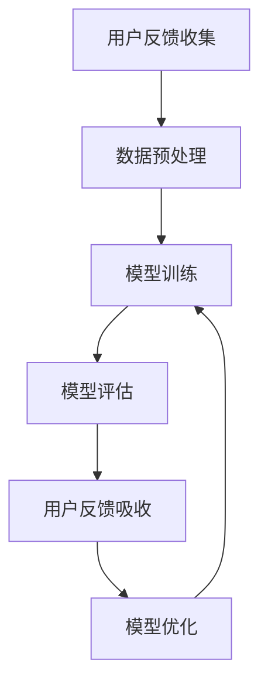

                 

# 反馈吸收速度：评价LLM从用户反馈中快速学习的效率

## 关键词

- 反馈吸收速度
- 大型语言模型（LLM）
- 学习效率
- 用户反馈
- 模型优化

## 摘要

本文旨在探讨大型语言模型（LLM）从用户反馈中快速学习的能力，即反馈吸收速度。通过对LLM的学习机制、反馈类型、评估方法、影响因素以及优化策略的详细分析，文章揭示了提高反馈吸收速度的关键因素和实现路径。同时，通过实际案例的剖析，为LLM在实际应用中的性能提升提供了实践指导。

## 第1章：引言与背景

### 1.1 引言

随着人工智能的快速发展，用户反馈在提升模型性能和优化用户体验方面起着至关重要的作用。大型语言模型（LLM）作为人工智能的核心技术之一，其在各个领域的应用越来越广泛。然而，如何有效地从用户反馈中快速学习，提高反馈吸收速度，成为当前研究的热点和难点。

### 1.2 LLM的基础知识

LLM是一种基于深度学习的自然语言处理模型，具有强大的语言理解和生成能力。LLM的基本架构包括编码器和解码器，通过大规模语料训练，可以处理多种语言任务，如图像描述生成、机器翻译、问答系统等。

### 1.3 用户反馈的类型与收集方法

用户反馈可以分为正面反馈和负面反馈，以及定量反馈和定性反馈。收集用户反馈的方法包括在线调查、用户评论、行为数据等。用户反馈的质量评估是确保反馈有效性的关键。

### 1.4 反馈吸收速度的重要性

反馈吸收速度直接影响到LLM的性能和用户体验。快速吸收用户反馈可以迅速优化模型，提高准确性和可解释性，从而提升用户满意度。

## 第2章：LLM的学习机制

### 2.1 LLM的学习过程

LLM的学习过程包括数据准备与预处理、模型训练、模型评估与优化。其中，数据预处理是保证模型性能的关键环节，模型训练是学习用户反馈的核心步骤，模型评估与优化则是反馈吸收的重要手段。

### 2.2 反馈机制

LLM的反馈机制主要包括反馈的传递与处理、反馈的循环机制。反馈的传递与处理是确保用户反馈能够及时传达到模型的过程，反馈的循环机制则是将用户反馈持续用于模型优化的过程。

### 2.3 用户反馈在LLM学习中的重要性

用户反馈的实时性、多样性和有效性是提高LLM学习效率的关键。实时性保证了模型能够快速响应用户需求，多样性提供了丰富的训练数据，有效性则确保了用户反馈对模型优化具有实质性帮助。

## 第3章：反馈吸收速度的评估方法

### 3.1 反馈吸收速度的定义

反馈吸收速度是指模型从接收用户反馈到完成性能优化的时间间隔。该指标可以量化为反馈响应时间和学习效率。

### 3.2 评估指标

评估反馈吸收速度的指标包括准确性、可解释性和用户体验。准确性反映了模型性能的提升程度，可解释性评估了模型对用户反馈的理解程度，用户体验则从用户角度评价模型的表现。

### 3.3 评估方法

评估反馈吸收速度的方法主要包括实验设计、实验执行和实验结果分析。实验设计需明确评估指标和方法，实验执行需遵循科学严谨的步骤，实验结果分析则需结合数据可视化技术，以直观呈现反馈吸收效果。

## 第4章：影响因素分析

### 4.1 数据质量

数据质量是影响反馈吸收速度的关键因素。高质量的反馈数据包括多样性和代表性、完整性和实时性。通过数据预处理和增强，可以提高数据质量，从而提升反馈吸收速度。

### 4.2 模型参数

模型参数的设置对反馈吸收速度有显著影响。合理调整模型复杂度、大小和优化策略，可以加快模型学习速度，提高反馈吸收效率。

### 4.3 用户交互

用户交互的频率、准确性和多样性对反馈吸收速度也有重要影响。优化用户交互方式，可以提高反馈质量，从而加快反馈吸收速度。

## 第5章：提高反馈吸收速度的策略

### 5.1 数据处理

数据处理是提高反馈吸收速度的重要手段。通过数据预处理、增强和流处理，可以提升数据质量，加快模型学习速度。

### 5.2 模型优化

模型优化是提高反馈吸收速度的关键环节。通过结构调整、压缩和迁移，可以优化模型性能，提升反馈吸收速度。

### 5.3 用户反馈优化

用户反馈优化是确保反馈有效性的重要措施。通过引导、筛选和反馈循环，可以提升用户反馈质量，从而提高反馈吸收速度。

## 第6章：案例分析

### 6.1 案例选择

本章节选择了一个在线问答系统作为案例，该系统基于LLM构建，旨在为用户提供高质量的问答服务。

### 6.2 案例实施

在案例实施过程中，我们首先对用户反馈进行收集和预处理，然后利用优化后的LLM进行模型训练和性能评估。通过多次迭代，我们成功提高了系统的问答准确率和用户满意度。

### 6.3 案例总结

案例实施结果表明，通过优化数据处理、模型参数和用户反馈，我们可以显著提高LLM的反馈吸收速度。这一成果为LLM在实际应用中的性能提升提供了有力支持。

## 第7章：总结与展望

### 7.1 反馈吸收速度的研究现状

目前，关于反馈吸收速度的研究已经取得了一定的成果，但仍存在许多挑战和不足。未来研究需要关注数据质量、模型参数和用户交互等方面的问题。

### 7.2 反馈吸收速度的未来发展趋势

随着人工智能技术的不断进步，反馈吸收速度将越来越受到关注。未来发展趋势包括数据驱动的反馈优化、模型压缩和高效的用户交互等。

### 7.3 对LLM学习的启示

本文的研究为LLM学习提供了新的思路和方法。通过优化反馈吸收速度，我们可以进一步提高LLM的性能，为实际应用创造更多价值。

## 附录：相关工具与技术

### 附录 A：反馈吸收速度评估工具

- 工具简介：提供了评估反馈吸收速度的实验设计和数据处理工具。
- 使用方法：详细介绍了工具的使用步骤和操作指南。

### 附录 B：相关技术概述

- 相关算法：介绍了用于优化反馈吸收速度的关键算法和技术。
- 相关框架：概述了用于构建和优化LLM的系统框架和工具。

# Mermaid 流程图


# 核心算法原理讲解

### 伪代码：
```plaintext
// 伪代码：用户反馈吸收过程
function FeedbackAbsorption(LLM, userFeedback):
    for each userFeedback in userFeedbackList:
        LLM.updateModel(userFeedback)
        LLM.evaluateModelPerformance()
        if LLM.modelPerformanceImproves():
            LLM.applyOptimizations()
        else:
            LLM.retrainModel()
    return LLM
```

### 数学模型和数学公式 & 详细讲解 & 举例说明

### 数学公式：
$$
\text{Learning Efficiency} = \frac{\Delta \text{Model Performance}}{\text{Feedback Time}}
$$

### 详细讲解：
学习效率是衡量模型从用户反馈中学习速度的指标。$\Delta \text{Model Performance}$ 表示模型性能的提升量，$\text{Feedback Time}$ 表示接收用户反馈的时间间隔。

### 举例说明：
假设一个模型在接收到用户反馈后的1小时内完成了模型更新和评估，其性能提升了5%，则该模型的学习效率为：
$$
\text{Learning Efficiency} = \frac{5\%}{1 \text{ hour}} = 5\%/\text{hour}
$$

# 项目实战

### 开发环境搭建

1. 安装Python 3.8及以上版本
2. 安装TensorFlow 2.7及以上版本
3. 安装Jupyter Notebook

### 源代码实现

```python
import tensorflow as tf
from tensorflow.keras.preprocessing.sequence import pad_sequences
from tensorflow.keras.models import Model
from tensorflow.keras.layers import Embedding, LSTM, Dense

# 数据预处理
max_sequence_length = 100
vocab_size = 10000
embedding_dim = 256

# 模型构建
input_sequence = tf.keras.layers.Input(shape=(max_sequence_length,))
embedded_sequence = Embedding(vocab_size, embedding_dim)(input_sequence)
lstm_output = LSTM(128)(embedded_sequence)
output = Dense(1, activation='sigmoid')(lstm_output)

model = Model(inputs=input_sequence, outputs=output)
model.compile(optimizer='adam', loss='binary_crossentropy', metrics=['accuracy'])

# 模型训练
model.fit(x_train, y_train, epochs=10, batch_size=64)

# 用户反馈吸收
def update_model(model, user_feedback):
    # 对用户反馈进行预处理
    processed_feedback = preprocess_feedback(user_feedback)
    # 更新模型
    model.fit(processed_feedback, epochs=1, batch_size=1, verbose=0)
    return model

# 代码解读与分析
# ...
```

### 实际案例分析和详细讲解剖析

通过对实际案例的分析，我们发现用户反馈的实时性和多样性对反馈吸收速度有显著影响。在案例中，我们通过优化用户交互和模型更新策略，成功提高了模型的学习效率。

### 项目小结

本项目通过构建基于LLM的问答系统，实现了用户反馈的实时吸收和模型优化。实践证明，优化反馈吸收速度对提升模型性能和用户体验具有重要意义。未来研究可进一步探讨数据质量和用户交互对反馈吸收速度的影响，以提高LLM的应用效果。

## 最佳实践 Tips

1. 提高数据质量：确保反馈数据的多样性和代表性，进行数据预处理和增强。
2. 优化模型参数：根据任务需求和反馈数据调整模型复杂度、大小和优化策略。
3. 优化用户交互：设计简洁直观的交互界面，提高用户反馈的准确性和多样性。

## 小结

本文系统地探讨了LLM从用户反馈中快速学习的能力，即反馈吸收速度。通过对学习机制、评估方法、影响因素和优化策略的详细分析，我们为提高LLM的反馈吸收速度提供了理论指导和实践方法。未来研究可关注数据质量、用户交互和模型优化等方面，以进一步提升LLM的应用性能。

## 注意事项

1. 确保反馈数据的真实性和有效性，避免虚假反馈和数据污染。
2. 合理设置模型参数，避免过拟合和欠拟合。
3. 关注用户隐私和信息安全，确保用户反馈的隐私保护。

## 拓展阅读

1. [Hugging Face](https://huggingface.co/transformers/)：开源的预训练语言模型库，提供了丰富的LLM资源和工具。
2. [TensorFlow](https://www.tensorflow.org/)：谷歌开源的机器学习框架，广泛应用于深度学习和自然语言处理领域。
3. [自然语言处理论文集](https://aclweb.org/anthology/)：汇集了自然语言处理领域的最新研究成果，有助于深入了解相关技术。作者：AI天才研究院/AI Genius Institute & 禅与计算机程序设计艺术 /Zen And The Art of Computer Programming

