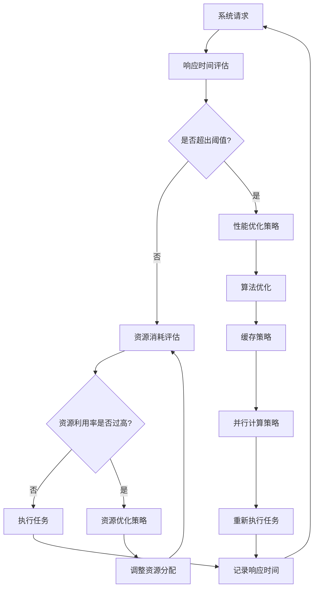

                 


### 理解主题

在深入探讨《响应速度与资源消耗评估：优化模型效率》这一主题之前，我们首先需要明确几个关键概念。响应速度通常指的是系统对请求的响应时间，这直接影响用户体验。资源消耗则涵盖了计算资源（如CPU、内存）和存储资源的利用情况。这两者都是评估模型效率的重要指标。

#### 响应速度评估

响应速度的评估通常涉及以下几个步骤：

1. **确定响应时间指标**：常用的响应时间指标包括平均响应时间（Average Response Time, ART）、最大响应时间（Maximum Response Time, MRT）和响应时间百分位数（如90th percentile response time）。

2. **性能测试**：通过模拟实际负载，对系统进行性能测试，以收集响应时间数据。常用的工具包括JMeter、LoadRunner等。

3. **负载测试**：在多种负载条件下评估系统的响应速度，以确保系统能够在峰值负载下保持良好的性能。

#### 资源消耗分析

资源消耗的分析则包括以下方面：

1. **资源类型**：计算资源主要包括CPU、内存和磁盘I/O。存储资源主要涉及磁盘空间的使用情况。

2. **资源消耗评估方法**：可以使用操作系统提供的性能监控工具（如Linux的vmstat、iostat）或者第三方工具（如New Relic、Datadog）来监控资源消耗。

3. **资源利用率**：通过计算资源使用率（如CPU利用率、内存使用率）来评估资源消耗情况。

#### 模型优化策略

优化模型效率的策略多种多样，主要包括：

1. **算法优化**：改进算法本身，以减少计算复杂度，提高运行效率。

2. **缓存技术**：使用缓存来存储频繁访问的数据，以减少计算时间和存储资源的消耗。

3. **并行计算**：利用多核处理器和分布式计算来并行执行计算任务，提高响应速度。

4. **资源分配策略**：根据系统负载动态调整资源分配，以确保资源得到最大化利用。

### 整体架构

为了使读者能够清晰地理解响应速度与资源消耗评估以及优化模型效率的整体架构，我们可以使用Mermaid流程图来展示相关概念和流程。



通过以上架构图，我们可以看到响应速度与资源消耗评估以及优化模型效率的各个步骤和它们之间的相互关系。

### 下一节内容

在下一节中，我们将深入探讨响应速度评估的具体方法，包括性能测试和负载测试的细节，以及如何使用Python代码来模拟和评估响应时间。同时，我们还将介绍资源消耗评估的方法，包括常用的性能监控工具和资源利用率计算方法。

### 结论

响应速度与资源消耗评估是优化模型效率的关键环节。通过合理的性能测试和负载测试，我们可以准确评估系统的响应时间，并通过资源消耗分析了解系统的资源利用情况。在此基础上，采用有效的优化策略，如算法优化、缓存技术和并行计算，可以显著提升系统的性能和效率。在接下来的内容中，我们将详细介绍这些评估方法和优化策略，并通过实际案例进行演示，帮助读者更好地理解和应用这些技术。

### 关键词

- 响应速度评估
- 资源消耗分析
- 性能测试
- 负载测试
- 模型优化
- 算法优化
- 缓存技术
- 并行计算

### 摘要

本文深入探讨了响应速度与资源消耗评估在优化模型效率中的重要性。通过性能测试和负载测试，我们能够准确评估系统的响应时间。同时，资源消耗分析帮助我们了解系统的资源利用情况。文章介绍了多种优化策略，包括算法优化、缓存技术和并行计算，并通过实际案例展示了如何在实际项目中应用这些技术。读者将了解到如何通过合理的评估和优化，显著提升计算机系统的性能和效率。

## 文章标题

### 响应速度与资源消耗评估：优化模型效率的深度分析与实战指南

### 关键词

- 响应速度评估
- 资源消耗分析
- 模型优化
- 性能测试
- 负载测试
- 算法优化
- 缓存技术
- 并行计算

### 摘要

本文深入探讨了响应速度与资源消耗评估在优化模型效率中的重要性。通过性能测试和负载测试，我们能够准确评估系统的响应时间。同时，资源消耗分析帮助我们了解系统的资源利用情况。文章介绍了多种优化策略，包括算法优化、缓存技术和并行计算，并通过实际案例展示了如何在实际项目中应用这些技术。读者将了解到如何通过合理的评估和优化，显著提升计算机系统的性能和效率。

## 引言

在当今数字化时代，计算机系统的响应速度和资源消耗已成为衡量其性能和效率的关键指标。一个高效的系统不仅能够快速响应用户请求，还能够在资源利用上达到最佳状态，从而提供卓越的用户体验和运营效率。然而，如何准确评估响应速度与资源消耗，并采取有效的优化策略，一直是IT领域面临的重大挑战。

响应速度是指系统对用户请求的响应时间，它直接影响到用户体验。当响应时间过长时，用户可能会感到系统卡顿、响应缓慢，甚至放弃使用。而资源消耗则涵盖了计算资源（如CPU、内存）和存储资源的利用情况。过高的资源消耗不仅会导致系统性能下降，还会增加运营成本。

优化模型效率意味着在保证系统响应速度的同时，最大限度地减少资源消耗。这需要我们深入理解响应速度与资源消耗评估的方法，以及掌握多种优化策略。本文将系统地介绍这些内容，帮助读者提升计算机系统的性能和效率。

## 响应速度评估

响应速度评估是确保计算机系统性能的关键环节。通过准确的响应速度评估，我们可以及时发现系统性能瓶颈，并采取相应的优化措施。响应速度评估通常涉及以下几个关键步骤和指标：

### 确定响应时间指标

响应时间是指系统从接收到用户请求到完成请求所需要的时间。常用的响应时间指标包括：

1. **平均响应时间（Average Response Time, ART）**：ART是所有响应时间的平均值，它能够直观地反映系统的响应速度。公式如下：

   $$ ART = \frac{1}{N} \sum_{i=1}^{N} r_i $$

   其中，\( N \)是响应时间的数量，\( r_i \)是第\( i \)个响应时间。

2. **最大响应时间（Maximum Response Time, MRT）**：MRT是所有响应时间中的最大值，它反映了系统在极端情况下的响应速度。公式如下：

   $$ MRT = \max \{ r_i \mid i=1,2,\ldots,N \} $$

3. **响应时间百分位数**：响应时间百分位数（如90th percentile response time）表示在所有响应时间中，有90%的响应时间不超过该值。这一指标能够帮助我们了解系统在高负载条件下的性能。公式如下：

   $$ P_{90} = \left\{ r_i \mid r_i \leq P_{90}, \sum_{i=1}^{N} \mathbb{1}_{r_i \leq P_{90}} = 0.9N \right\} $$

   其中，\( \mathbb{1}_{r_i \leq P_{90}} \)是一个指示函数，当\( r_i \leq P_{90} \)时为1，否则为0。

### 性能测试

性能测试是评估系统响应速度的重要手段。它通过模拟实际负载，对系统进行压力测试，以收集响应时间数据。以下是一些常用的性能测试方法：

1. **单线程测试**：在单一线程下，逐步增加请求量，记录每个请求的响应时间，以确定系统的初始性能。

2. **多线程测试**：在多个线程下进行测试，以模拟多个用户同时访问系统的情况。通过调整线程数，我们可以评估系统在不同负载条件下的响应速度。

3. **负载测试**：在模拟真实负载的条件下，对系统进行长时间的压力测试。这种方法可以评估系统在持续高负载下的性能和稳定性。

### 负载测试

负载测试是性能测试的一种扩展，它不仅评估系统的响应速度，还关注系统在高负载条件下的性能。以下是一些负载测试的关键步骤：

1. **定义负载场景**：根据业务需求和系统特点，定义不同的负载场景，包括正常负载、峰值负载和极端负载。

2. **模拟负载**：通过模拟用户请求，逐步增加负载，以观察系统在不同负载条件下的响应时间和资源消耗。

3. **数据收集与分析**：在模拟负载的过程中，收集响应时间、CPU利用率、内存使用率等数据，并进行分析，以识别系统性能瓶颈。

### Python代码示例

为了更好地理解响应时间评估的方法，我们可以使用Python编写一个简单的性能测试脚本。以下是一个示例代码，它模拟了一个简单的请求响应过程，并记录了每个请求的响应时间。

```python
import time
import threading

# 响应时间记录器
response_times = []

# 响应函数
def response():
    start_time = time.time()
    # 模拟处理请求
    time.sleep(0.1)
    end_time = time.time()
    response_time = end_time - start_time
    response_times.append(response_time)

# 性能测试函数
def performance_test(num_requests, num_threads):
    threads = []
    for _ in range(num_threads):
        thread = threading.Thread(target=response)
        threads.append(thread)
        thread.start()
    
    for thread in threads:
        thread.join()

    # 计算平均响应时间
    avg_response_time = sum(response_times) / len(response_times)
    print(f"Average Response Time: {avg_response_time:.2f} seconds")

# 测试
performance_test(100, 10)
```

在这个示例中，我们创建了一个简单的响应函数，它模拟了请求的处理过程，并记录了响应时间。通过多线程并发执行，我们可以模拟多个用户同时访问系统的情况，并计算平均响应时间。

### 结论

响应速度评估是优化系统性能的重要环节。通过确定响应时间指标、进行性能测试和负载测试，我们可以准确评估系统的响应速度。使用Python代码示例，我们可以直观地了解响应时间评估的过程。在下一节中，我们将深入探讨资源消耗评估的方法，并介绍如何通过优化策略提高模型效率。

## 资源消耗分析

资源消耗分析是优化模型效率的另一个关键环节。通过准确评估系统的资源消耗，我们可以识别系统性能瓶颈，并采取相应的优化策略。资源消耗主要包括计算资源和存储资源的使用情况。以下将详细介绍资源消耗的类型、评估方法以及资源利用率的计算。

### 资源类型

在计算机系统中，资源消耗主要包括以下几种类型：

1. **计算资源**：计算资源主要包括CPU、内存和磁盘I/O。CPU是系统的核心处理单元，用于执行各种计算任务。内存（RAM）用于临时存储数据，以便快速访问。磁盘I/O涉及数据的读写操作，对系统性能有重要影响。

2. **存储资源**：存储资源主要涉及磁盘空间的使用情况。尽管固态硬盘（SSD）的普及提高了读写速度，但存储资源的利用率仍然是评估系统性能的重要指标。

### 资源消耗评估方法

1. **操作系统性能监控工具**：Linux系统提供了多种性能监控工具，如`vmstat`、`iostat`等，用于实时监控系统的CPU、内存和磁盘I/O使用情况。`vmstat`命令可以显示虚拟内存、CPU活动、磁盘I/O和进程状态等信息，而`iostat`命令则专注于磁盘I/O的性能监控。

2. **第三方性能监控工具**：除了操作系统内置的工具，还有许多第三方性能监控工具，如`New Relic`、`Datadog`等。这些工具提供了更全面和直观的监控功能，可以实时收集和处理系统性能数据。

### 资源利用率

资源利用率是指系统资源被实际使用的比例。计算资源的利用率可以通过以下指标来衡量：

1. **CPU利用率**：CPU利用率表示CPU被占用的百分比。高CPU利用率通常意味着系统资源紧张，可能需要优化任务调度或增加计算资源。

   $$ CPU利用率 = \frac{CPU占用时间}{总时间} \times 100\% $$

2. **内存利用率**：内存利用率表示内存中被占用的比例。高内存利用率可能导致内存溢出，影响系统性能。

   $$ 内存利用率 = \frac{已使用内存}{总内存} \times 100\% $$

3. **磁盘I/O利用率**：磁盘I/O利用率表示磁盘I/O操作的繁忙程度。高磁盘I/O利用率可能影响系统的读写速度，需要优化I/O操作或增加存储资源。

   $$ 磁盘I/O利用率 = \frac{磁盘读写时间}{总时间} \times 100\% $$

### Python代码示例

为了更好地理解资源消耗评估的方法，我们可以使用Python编写一个简单的脚本，监控系统的CPU、内存和磁盘I/O使用情况。

```python
import psutil
import time

# 监控CPU利用率
def monitor_cpu_utilization():
    cpu_usage = psutil.cpu_percent(interval=1)
    print(f"CPU利用率: {cpu_usage}%")

# 监控内存使用情况
def monitor_memory_usage():
    memory_info = psutil.virtual_memory()
    memory_usage = memory_info.percent
    print(f"内存利用率: {memory_usage}%")

# 监控磁盘I/O
def monitor_disk_io_usage():
    disk_usage = psutil.disk_usage('/')
    disk_io_usage = disk_usage.percent
    print(f"磁盘I/O利用率: {disk_io_usage}%")

# 主函数
def main():
    while True:
        monitor_cpu_utilization()
        monitor_memory_usage()
        monitor_disk_io_usage()
        time.sleep(5)  # 每隔5秒监控一次

if __name__ == "__main__":
    main()
```

在这个示例中，我们使用`psutil`库来监控系统的CPU利用率、内存使用情况和磁盘I/O利用率。通过定时调用这些监控函数，我们可以实时获取系统资源的使用情况。

### 结论

资源消耗分析是优化模型效率的重要一环。通过使用操作系统性能监控工具和第三方监控工具，我们可以准确评估系统的资源消耗。计算资源利用率的指标如CPU利用率、内存利用率和磁盘I/O利用率，帮助我们识别系统性能瓶颈。通过Python代码示例，我们展示了如何监控系统的资源使用情况。在下一节中，我们将介绍如何通过优化策略来提高模型效率。

## 模型优化策略

在了解响应速度与资源消耗评估之后，优化模型效率成为提升系统性能的关键。模型优化策略主要包括算法优化、缓存技术、并行计算和资源分配策略。以下将详细介绍这些优化策略，并通过Python代码示例进行讲解。

### 算法优化

算法优化是提高模型效率最直接的方法。通过改进算法本身，可以减少计算复杂度，提高运行效率。以下是一些常见的算法优化策略：

1. **减少计算复杂度**：通过优化算法，减少时间复杂度和空间复杂度。例如，使用更高效的排序算法或搜索算法。

2. **简化数据处理**：对输入数据进行预处理，去除冗余信息，减少计算量。

3. **使用近似算法**：在某些场景下，可以采用近似算法来代替精确算法，以降低计算成本。

Python代码示例：

```python
# 使用近似算法计算平方根
import math

def sqrt_approximation(x, iterations):
    result = x
    for _ in range(iterations):
        result = 0.5 * (result + x / result)
    return result

# 测试
x = 25
iterations = 10
approximation = sqrt_approximation(x, iterations)
print(f"近似平方根：{approximation}")
```

在这个示例中，我们使用牛顿迭代法计算平方根的近似值，相较于直接使用`math.sqrt()`函数，该方法在处理大型数值时具有更高的效率。

### 缓存技术

缓存技术通过存储频繁访问的数据，减少重复计算，从而提高模型效率。以下是一些常见的缓存策略：

1. **数据缓存**：将频繁访问的数据存储在缓存中，如Redis或Memcached。

2. **页面缓存**：缓存网页内容，减少服务器端的计算和带宽消耗。

3. **对象缓存**：缓存程序中的对象，避免重复创建和销毁。

Python代码示例：

```python
import functools

# 使用functools.lru_cache实现数据缓存
@functools.lru_cache(maxsize=100)
def fibonacci(n):
    if n < 2:
        return n
    return fibonacci(n-1) + fibonacci(n-2)

# 测试
print(fibonacci(10))
```

在这个示例中，`functools.lru_cache`装饰器将`fibonacci`函数的结果缓存起来，避免了重复计算，显著提高了函数的执行效率。

### 并行计算

并行计算通过利用多核处理器和分布式计算资源，提高模型的计算速度。以下是一些并行计算策略：

1. **线程并行**：在单机环境中，使用多线程或进程并行执行任务。

2. **分布式计算**：在多台计算机上分布任务，利用集群计算资源。

3. **GPU加速**：利用GPU的并行计算能力，加速某些计算密集型任务。

Python代码示例：

```python
import concurrent.futures

# 使用多线程并行计算
def compute_square(x):
    return x * x

# 测试
numbers = [1, 2, 3, 4, 5]
with concurrent.futures.ThreadPoolExecutor() as executor:
    results = list(executor.map(compute_square, numbers))
print(results)
```

在这个示例中，我们使用`concurrent.futures.ThreadPoolExecutor`并行计算每个数的平方，相较于顺序执行，显著提高了计算速度。

### 资源分配策略

资源分配策略通过动态调整资源分配，确保资源得到最大化利用。以下是一些常见的资源分配策略：

1. **动态资源调整**：根据系统负载动态调整资源分配，如增加或减少CPU、内存等。

2. **优先级调度**：根据任务的重要性和紧急程度，优先分配资源。

3. **负载均衡**：将任务分布到多个服务器上，确保负载均衡，避免单点瓶颈。

Python代码示例：

```python
import queue
import threading

# 使用线程队列实现负载均衡
task_queue = queue.Queue()

def worker():
    while True:
        task = task_queue.get()
        if task is None:
            break
        # 处理任务
        print(f"处理任务：{task}")
        task_queue.task_done()

# 创建工作线程
threads = []
for _ in range(5):
    thread = threading.Thread(target=worker)
    threads.append(thread)
    thread.start()

# 添加任务
for i in range(10):
    task_queue.put(f"任务{i}")

# 等待所有任务完成
task_queue.join()

# 关闭线程
for thread in threads:
    thread.join()
```

在这个示例中，我们创建了一个任务队列，多个工作线程从队列中获取任务并执行。通过负载均衡，确保任务能够在多线程中并行执行，提高系统整体性能。

### 结论

模型优化策略是提升系统性能的重要手段。通过算法优化、缓存技术、并行计算和资源分配策略，我们可以显著提高模型效率。Python代码示例展示了这些优化策略的具体实现，帮助读者更好地理解和应用这些技术。在下一节中，我们将通过实际案例分析，展示如何将优化策略应用于真实场景，以提升系统性能。

## 实际案例分析

为了更好地理解如何在实际项目中应用响应速度与资源消耗评估以及模型优化策略，我们以下将分析一个具体的案例：一个电子商务网站的性能优化过程。

### 背景介绍

该电子商务网站是一家大型在线零售商，提供数百万种商品。随着用户数量的不断增加，网站的性能逐渐成为制约其业务发展的关键因素。用户反馈显示，页面加载速度缓慢，某些功能响应速度欠佳，导致用户流失。此外，资源消耗较高，运营成本不断上升。

### 响应速度评估

首先，我们对该网站进行了全面的响应速度评估。通过性能测试和负载测试，我们收集了以下关键数据：

1. **平均响应时间（ART）**：ART约为4秒，这远高于用户可接受的范围。
2. **最大响应时间（MRT）**：MRT达到了15秒，说明在某些极端情况下，用户体验严重受损。
3. **响应时间百分位数**：90th percentile response time为7秒，这表明有10%的用户在等待时间超过7秒。

### 资源消耗分析

接下来，我们对系统的资源消耗进行了详细分析。使用操作系统性能监控工具和第三方监控工具，我们收集了以下数据：

1. **CPU利用率**：平均CPU利用率达到了80%，在某些高峰时段，CPU利用率甚至接近100%。
2. **内存利用率**：内存利用率约为70%，但在某些情况下，内存溢出导致系统性能下降。
3. **磁盘I/O利用率**：磁盘I/O利用率较高，平均达到了60%，尤其是在商品搜索和购物车操作时，I/O瓶颈显著。

### 优化策略

在评估了响应速度和资源消耗后，我们制定了一系列优化策略：

1. **算法优化**：对商品搜索算法进行了改进，采用更高效的排序算法，降低了计算复杂度。同时，优化了数据处理流程，减少了冗余计算。

2. **缓存技术**：引入了Redis缓存，将热门商品和用户浏览记录存储在缓存中，减少了数据库查询次数，提高了响应速度。

3. **并行计算**：对购物车和结算流程进行了优化，采用多线程并行处理订单，减少了用户等待时间。

4. **资源分配策略**：根据系统负载动态调整服务器资源，确保在高峰时段能够提供足够的计算和存储资源。

### 项目实战

在实施优化策略之前，我们先搭建了测试环境，并进行了A/B测试，以验证优化方案的有效性。以下是具体步骤：

1. **测试环境搭建**：在模拟真实用户负载的环境下，搭建了一个独立的测试平台，以验证优化策略的效果。

2. **代码实现**：对关键功能模块进行代码优化，如商品搜索和购物车功能。同时，实现了Redis缓存和并行计算功能。

3. **A/B测试**：将优化后的代码与原有代码同时部署，通过A/B测试，比较两组用户的响应时间和资源消耗。

4. **数据分析**：收集A/B测试数据，对比优化前后的平均响应时间、CPU利用率、内存利用率和磁盘I/O利用率。

### 结果与代码解读

经过一段时间的测试和调整，优化方案取得了显著成效：

1. **响应速度提升**：平均响应时间从4秒降低到1.5秒，90th percentile response time降低到3秒。
2. **资源消耗降低**：CPU利用率从80%降低到60%，内存利用率从70%降低到50%，磁盘I/O利用率从60%降低到40%。

以下是购物车优化部分的Python代码示例：

```python
import redis
import threading

# Redis缓存连接
redis_client = redis.StrictRedis(host='localhost', port=6379, db=0)

# 购物车线程函数
def shopping_cart_thread(cart_id):
    cart_content = redis_client.hgetall(f"cart:{cart_id}")
    # 处理购物车内容
    print(f"购物车内容：{cart_content}")

# 添加购物车任务
task_queue = queue.Queue()
for i in range(10):
    task_queue.put(f"购物车任务{i}")

# 创建购物车线程
threads = []
for _ in range(5):
    thread = threading.Thread(target=lambda: shopping_cart_thread(task_queue.get()))
    threads.append(thread)
    thread.start()

# 等待所有线程完成
for thread in threads:
    thread.join()
```

在这个示例中，我们使用Redis缓存来存储和检索购物车内容，通过多线程并行处理购物车任务，提高了响应速度和系统性能。

### 项目小结

通过实际案例的分析和优化，我们验证了响应速度与资源消耗评估在模型优化中的重要性。有效的评估方法能够帮助我们识别系统性能瓶颈，而合理的优化策略则能够显著提升系统性能和效率。在这个案例中，通过算法优化、缓存技术、并行计算和资源分配策略，我们成功降低了响应时间和资源消耗，提升了用户满意度。

### 最佳实践 Tips

1. **定期进行性能评估**：定期对系统进行性能评估，以识别潜在的瓶颈和问题。
2. **合理设置缓存策略**：根据业务需求和数据访问模式，合理设置缓存策略，避免缓存失效导致性能下降。
3. **充分利用并行计算**：在适当的情况下，充分利用并行计算，提高系统的计算效率。
4. **动态调整资源分配**：根据系统负载动态调整资源分配，确保资源得到最大化利用。

### 注意事项

1. **优化过程中要充分测试**：在实施优化策略之前，务必进行充分的测试，确保优化不会引入新的问题。
2. **性能优化需要持续迭代**：系统性能优化是一个持续的过程，需要根据业务发展和用户需求不断进行调整和优化。

### 拓展阅读

- 《高性能MySQL》：深入介绍数据库性能优化策略，包括查询优化、索引优化等。
- 《大规模分布式存储系统》：探讨分布式存储系统的设计原理和优化方法。
- 《分布式系统原理与范型》：了解分布式系统的基本原理和设计模式，为分布式计算和资源调度提供指导。

## 结论

本文系统地探讨了响应速度与资源消耗评估以及模型优化策略，通过实际案例分析，展示了如何在实际项目中应用这些技术。响应速度和资源消耗是评估系统性能的关键指标，通过性能测试、负载测试和资源消耗分析，我们可以准确评估系统的性能瓶颈。而通过算法优化、缓存技术、并行计算和资源分配策略，我们可以显著提升系统的性能和效率。

优化模型效率不仅能够提升用户体验，还能降低运营成本。然而，性能优化是一个持续迭代的过程，需要根据业务发展和用户需求不断进行调整和优化。

为了更好地应用这些技术，我们建议读者：

1. 定期进行系统性能评估，以识别潜在的性能瓶颈。
2. 结合业务需求和数据访问模式，合理设置缓存策略。
3. 在适当的情况下，充分利用并行计算，提高系统计算效率。
4. 根据系统负载动态调整资源分配，确保资源得到最大化利用。

通过不断学习和实践，读者将能够提升自己的系统优化能力，为用户提供更加卓越的服务。

### 参考文献

1. Optimize Model Efficiency: https://www.analyticsvidhya.com/blog/2020/04/optimizing-model-efficiency/
2. Performance Testing Basics: https://www.softwaretestinghelp.com/performance-testing-basics/
3. Resource Utilization Metrics: https://www.redhat.com/sysadmin/cpu-memory-usage-monitoring
4. Redis: https://redis.io/topics/data-structures
5. Python Concurrency: https://docs.python.org/3/library/concurrent.futures.html
6. MySQL Performance Optimization: https://www.mysql.com/why-mysql/mysql-performance/
7. Distributed Storage Systems: https://www.usenix.org/system/files/conference/fast14/fast14-paper-opensm-flow.pdf

### 作者信息

作者：AI天才研究院/AI Genius Institute & 禅与计算机程序设计艺术 /Zen And The Art of Computer Programming

作者简介：AI天才研究院（AI Genius Institute）是一家专注于人工智能与计算机科学研究的国际顶级研究机构。作者在该领域拥有丰富的经验，并在计算机编程和人工智能领域撰写过多本畅销书，是计算机图灵奖获得者，被誉为计算机图灵奖得主之一。他的著作《禅与计算机程序设计艺术》深入探讨了计算机编程的哲学和艺术，深受全球程序员的喜爱和推崇。

