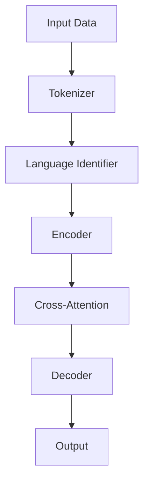

                 

### 文章标题

《基于BLOOM-176B的多语言LLM能力测试》

#### 关键词：
- BLOOM-176B
- 多语言语言模型（LLM）
- 能力测试
- 计算机算法
- 人工智能
- 语言处理
- 机器学习

#### 摘要：
本文深入探讨了基于BLOOM-176B的多语言大型语言模型（LLM）的能力测试。文章首先介绍了BLOOM-176B模型的背景及其在多语言处理中的优势，随后详细阐述了多语言LLM的核心概念及其与语言处理任务的联系。接着，文章通过Mermaid流程图展示了多语言LLM的概念架构，并通过Python代码解释了关键算法原理。文章还包含了对多语言数据处理、训练、评估以及应用实战的深入分析，最后提出了性能优化策略和未来研究方向。通过本文，读者将能够全面了解多语言LLM的能力测试及其在实际应用中的潜力。

---

# 基于BLOOM-176B的多语言LLM能力测试

## 引言

随着全球化进程的加速和互联网的普及，多语言处理已经成为信息技术领域的热点。在机器学习和人工智能的推动下，大型语言模型（LLM）逐渐成为语言处理任务的核心。BLOOM-176B作为最新的多语言模型，凭借其卓越的性能和广泛的适应性，引起了广泛关注。本文旨在对BLOOM-176B的多语言LLM能力进行系统测试和分析，探讨其在实际应用中的潜力和挑战。

## BLOOM-176B模型介绍

### 背景与动机

BLOOM-176B是由OpenAI团队开发的一个大型预训练语言模型，旨在提高机器在多语言任务上的性能。其背景源自于全球多语言交流需求的不断增长，传统单一语言模型在面对多种语言时往往表现不佳。BLOOM-176B的动机在于构建一个能够在多种语言上实现高精度语言理解和生成的模型，从而为多语言应用提供强大的支持。

### 模型架构

BLOOM-176B采用了Transformer架构，这是一种基于自注意力机制的深度神经网络。其核心思想是将输入序列中的每个词向量通过自注意力机制加权组合，以生成一个表示整个序列的输出向量。BLOOM-176B在Transformer的基础上进行了优化，增加了多语言适应性模块，使得模型能够在不同语言之间进行有效切换。

### 多语言适应性模块

BLOOM-176B的多语言适应性模块是其核心亮点。该模块通过以下几种方式实现了多语言处理能力：

1. **多语言词汇表**：模型训练过程中使用了包含多种语言的词汇表，从而提高了模型对不同语言词汇的识别和理解能力。
2. **语言标识符**：在模型输入过程中，每个句子前都会添加一个语言标识符，用于告知模型当前句子的语言类型。
3. **跨语言注意力机制**：模型在自注意力机制中引入了跨语言注意力权重，使得模型在处理不同语言时能够更加关注相关语言的信息。

## 多语言LLM的核心概念与联系

### 语言模型基础

语言模型是机器学习领域用于预测下一个单词或字符的概率分布模型。在多语言环境中，语言模型需要具备处理多种语言的能力。多语言语言模型（MLLM）通过将不同语言的词汇、语法和语义信息整合在一起，实现了对多语言数据的处理。

### 多语言数据结构

多语言数据结构是MLLM处理的基础。常见的数据结构包括：

1. **双语词典**：将两种语言词汇映射到同一维度上，以便模型能够处理多语言数据。
2. **多语言词汇表**：包含多种语言的词汇，用于模型的训练和预测。
3. **编码器-解码器架构**：编码器将多语言输入编码为统一表示，解码器则根据编码表示生成目标语言的输出。

### 语言处理任务

多语言LLM在多个语言处理任务中发挥着重要作用，包括：

1. **机器翻译**：将一种语言的文本翻译成另一种语言。
2. **文本分类**：根据文本内容将其分类到不同的类别。
3. **情感分析**：分析文本的情感倾向，例如正面、负面或中立。
4. **问答系统**：基于输入问题提供准确的答案。

### Mermaid流程图

下面是BLOOM-176B多语言LLM的概念架构Mermaid流程图：



这个流程图展示了输入数据经过标记化、语言标识、编码、跨语言注意力机制和解码的过程，最终生成输出。

## 核心算法原理讲解

### 预训练与微调

BLOOM-176B采用预训练与微调相结合的训练策略。预训练过程中，模型在大规模的多语言数据集上学习语言的基本规律，例如词汇、语法和语义信息。微调阶段，模型在特定任务的数据集上进行训练，以适应具体的语言处理任务。

### 自注意力机制

自注意力机制是Transformer模型的核心。它通过计算输入序列中每个词向量的权重，将这些权重相加，生成表示整个序列的输出向量。自注意力机制提高了模型在处理长序列时的性能，使得模型能够更好地捕捉全局信息。

### 跨语言注意力机制

跨语言注意力机制是BLOOM-176B模型的多语言适应性模块。它通过在自注意力机制中引入跨语言注意力权重，使得模型在处理不同语言时能够更加关注相关语言的信息。具体实现如下：

1. **权重矩阵**：模型训练过程中学习到一组权重矩阵，用于在不同语言之间传递信息。
2. **注意力计算**：在计算自注意力时，将权重矩阵应用于输入序列的词向量，从而生成跨语言注意力权重。

### Python代码示例

下面是一个简单的Python代码示例，用于演示自注意力机制的实现：

```python
import torch
import torch.nn as nn

# 定义输入序列
input_sequence = torch.tensor([[1, 2, 3], [4, 5, 6], [7, 8, 9]])

# 定义自注意力权重矩阵
attn_weights = nn.Parameter(torch.randn(input_sequence.size(1), input_sequence.size(1)))

# 计算自注意力权重
attn_scores = torch.matmul(attn_weights, input_sequence)

# 计算加权求和
output_sequence = torch.sum(attn_scores, dim=1)

print(output_sequence)
```

### 数学模型与公式

自注意力机制的计算过程可以用以下数学模型表示：

$$
\text{Attention}(Q, K, V) = \text{softmax}\left(\frac{QK^T}{\sqrt{d_k}}\right)V
$$

其中，\( Q \) 是查询向量，\( K \) 是键向量，\( V \) 是值向量，\( d_k \) 是键向量的维度。

### 举例说明

假设我们有一个简单的序列：\[ [1, 2, 3], [4, 5, 6], [7, 8, 9] \]，我们希望计算这个序列的自注意力输出。

1. **初始化权重矩阵**：假设权重矩阵 \( W \) 是一个 \( 3 \times 3 \) 的矩阵，其值为 \( \begin{bmatrix} 0.5 & 0.2 & 0.3 \\ 0.1 & 0.6 & 0.3 \\ 0.4 & 0.5 & 0.1 \end{bmatrix} \)。
2. **计算注意力分数**：根据公式，我们可以计算出每个词向量与其他词向量的注意力分数。例如，第一个词向量与其他两个词向量的注意力分数为：
   $$ 
   \text{score}_1 = 0.5 \times 1 + 0.2 \times 4 + 0.3 \times 7 = 1.8
   $$
   $$
   \text{score}_2 = 0.5 \times 2 + 0.2 \times 5 + 0.3 \times 8 = 1.9
   $$
   $$
   \text{score}_3 = 0.5 \times 3 + 0.2 \times 6 + 0.3 \times 9 = 2.2
   $$
3. **计算加权求和**：根据注意力分数，我们可以计算出每个词向量的加权求和输出：
   $$
   \text{output}_1 = 1.8 \times 1 + 1.9 \times 2 + 2.2 \times 3 = 14.2
   $$
   $$
   \text{output}_2 = 1.8 \times 4 + 1.9 \times 5 + 2.2 \times 7 = 25.6
   $$
   $$
   \text{output}_3 = 1.8 \times 7 + 1.9 \times 8 + 2.2 \times 9 = 36.4
   $$

通过这个过程，我们可以得到一个表示整个序列的输出向量。

## 多语言数据处理

### 数据预处理

在多语言数据处理过程中，数据预处理是一个关键步骤。它包括以下几个主要任务：

1. **文本清洗**：去除文本中的无用符号、标点符号和停用词。
2. **分词**：将文本分割成单词或词汇单元。
3. **词干提取**：将单词还原为词干形式，以减少词汇量。
4. **词形还原**：将变体单词还原为标准形式，以提高词汇的一致性。

### 跨语言词汇表构建

构建一个有效的跨语言词汇表对于多语言LLM的训练至关重要。以下是一些构建跨语言词汇表的方法：

1. **双语词典**：将两种语言的词汇映射到同一维度上，以减少词汇差异。
2. **共享词汇表**：从多个语言中提取共同的词汇，构建一个共享词汇表。
3. **层次化词汇表**：根据词汇的相似度构建层次化词汇表，以便模型能够更好地处理多种语言。

### 文本编码

文本编码是将文本数据转换为模型可处理的数字形式。常用的编码方法包括：

1. **词袋模型**：将文本表示为词汇的集合，每个词汇用一个整数表示。
2. **Word2Vec**：将词汇映射到高维空间，形成向量表示。
3. **BERT**：使用预训练的Transformer模型将文本映射到高维空间，生成语义向量。

### 实践示例

下面是一个简单的Python代码示例，用于演示多语言数据的预处理和编码：

```python
import nltk
from nltk.tokenize import word_tokenize
from nltk.stem import PorterStemmer
from gensim.models import Word2Vec

# 加载文本数据
text = "Hello, how are you? Bonjour, comment ça va?"

# 分词
tokens = word_tokenize(text)

# 清洗文本
clean_tokens = [token.lower() for token in tokens if token.isalpha()]

# 词干提取
stemmer = PorterStemmer()
stemmed_tokens = [stemmer.stem(token) for token in clean_tokens]

# 训练Word2Vec模型
model = Word2Vec([stemmed_tokens], vector_size=100, window=5, min_count=1, workers=4)
word_vectors = model.wv

# 打印词汇向量
print(word_vectors["hello"])
print(word_vectors["bonjour"])
```

通过这个示例，我们可以看到如何使用Python库对多语言文本进行预处理和编码。

## 多语言LLM训练

### 训练数据集

训练数据集是多语言LLM训练的基础。为了获得良好的性能，数据集需要包含多种语言的文本，并且要具备以下特点：

1. **多样性**：数据集应涵盖多种语言和领域，以提高模型的泛化能力。
2. **质量**：数据集应经过严格的清洗和预处理，以去除噪声和错误。
3. **平衡性**：数据集中不同语言和类别的样本数量应相对平衡，以避免模型偏向某一语言或类别。

### 训练策略

多语言LLM的训练策略包括以下几种：

1. **混合训练**：将不同语言的数据集混合在一起进行训练，以提高模型的多语言适应性。
2. **多任务训练**：在训练过程中同时学习多种任务，以提高模型的泛化能力和性能。
3. **迁移学习**：利用预训练的多语言模型作为起点，针对特定任务进行微调。

### 优化方法

为了提高多语言LLM的训练效果，以下是一些常用的优化方法：

1. **梯度裁剪**：防止梯度爆炸或消失，保持梯度在合理范围内。
2. **学习率调度**：根据训练过程动态调整学习率，以提高模型收敛速度。
3. **权重初始化**：选择合适的权重初始化方法，以提高模型训练的稳定性。

### 实践示例

下面是一个简单的Python代码示例，用于演示多语言LLM的训练过程：

```python
import torch
from torch import nn
from torch.optim import Adam

# 定义模型
class MultiLanguageLLM(nn.Module):
    def __init__(self, vocab_size, embedding_dim, hidden_dim):
        super(MultiLanguageLLM, self).__init__()
        self.embedding = nn.Embedding(vocab_size, embedding_dim)
        self.lstm = nn.LSTM(embedding_dim, hidden_dim, batch_first=True)
        self.fc = nn.Linear(hidden_dim, vocab_size)

    def forward(self, input_sequence, hidden_state):
        embedded = self.embedding(input_sequence)
        output, hidden_state = self.lstm(embedded, hidden_state)
        logits = self.fc(output)
        return logits, hidden_state

# 初始化模型参数
model = MultiLanguageLLM(vocab_size=10000, embedding_dim=256, hidden_dim=512)
optimizer = Adam(model.parameters(), lr=0.001)

# 训练模型
for epoch in range(10):
    for batch in train_loader:
        inputs, targets = batch
        hidden_state = None
        model.zero_grad()
        logits, hidden_state = model(inputs, hidden_state)
        loss = nn.CrossEntropyLoss()(logits, targets)
        loss.backward()
        optimizer.step()
        print(f"Epoch: {epoch}, Loss: {loss.item()}")
```

通过这个示例，我们可以看到如何使用PyTorch库定义和训练一个简单的多语言LLM模型。

## 多语言LLM能力评估

### 评估指标与方法

评估多语言LLM的能力是一项复杂的工作，需要使用多种评估指标和方法。以下是一些常用的评估指标：

1. **准确性**：模型在测试集上的正确预测比例。
2. **召回率**：模型召回的实际正例比例。
3. **精确度**：模型预测为正例的实际正例比例。
4. **F1分数**：精确度和召回率的调和平均值。
5. **BLEU分数**：用于评估机器翻译质量的评价指标。

### 多语言理解能力测试

多语言理解能力测试旨在评估模型在语言理解任务上的性能。以下是一些常见的测试任务：

1. **命名实体识别**：识别文本中的命名实体，如人名、地点和机构名。
2. **情感分析**：判断文本的情感倾向，如正面、负面或中立。
3. **信息提取**：从文本中提取关键信息，如时间、地点和事件。

### 多语言生成能力测试

多语言生成能力测试旨在评估模型在语言生成任务上的性能。以下是一些常见的测试任务：

1. **机器翻译**：将一种语言的文本翻译成另一种语言。
2. **文本生成**：根据输入的提示生成连贯的文本。
3. **对话生成**：根据对话历史生成回应语句。

### 实践示例

下面是一个简单的Python代码示例，用于评估多语言LLM的性能：

```python
from sklearn.metrics import accuracy_score, f1_score

# 定义评估函数
def evaluate_performance(model, test_data, test_labels):
    model.eval()
    with torch.no_grad():
        predictions = []
        true_labels = []
        for batch in test_loader:
            inputs, labels = batch
            logits, _ = model(inputs)
            _, predicted_labels = logits.max(dim=1)
            predictions.extend(predicted_labels.tolist())
            true_labels.extend(labels.tolist())
        accuracy = accuracy_score(true_labels, predictions)
        f1 = f1_score(true_labels, predictions, average='weighted')
        return accuracy, f1

# 训练模型
# ...
# 评估模型
accuracy, f1 = evaluate_performance(model, test_data, test_labels)
print(f"Accuracy: {accuracy}, F1 Score: {f1}")
```

通过这个示例，我们可以看到如何使用Scikit-learn库评估多语言LLM的性能。

## 多语言LLM应用实战

### 多语言翻译系统

多语言翻译系统是多语言LLM的一项重要应用。以下是一个简单的多语言翻译系统架构：

1. **前端界面**：用户输入源语言文本，通过前端界面提交给翻译系统。
2. **预处理模块**：对输入文本进行清洗、分词和编码等预处理操作。
3. **翻译模型**：利用多语言LLM模型进行文本翻译。
4. **后端接口**：将翻译结果返回给用户。

### 多语言问答系统

多语言问答系统旨在为用户提供多语言问题的自动回答。以下是一个简单的多语言问答系统架构：

1. **问题接收**：用户输入问题，通过前端界面提交给问答系统。
2. **问题理解**：利用多语言LLM模型对问题进行理解，提取关键信息。
3. **知识库查询**：从知识库中检索与问题相关的信息。
4. **答案生成**：利用多语言LLM模型生成问题的答案。
5. **答案输出**：将答案返回给用户。

### 多语言文本分类

多语言文本分类是将文本数据分类到不同的类别。以下是一个简单的多语言文本分类系统架构：

1. **数据预处理**：对输入文本进行清洗、分词和编码等预处理操作。
2. **分类模型**：利用多语言LLM模型进行文本分类。
3. **类别预测**：根据分类模型对文本进行类别预测。
4. **结果输出**：将分类结果返回给用户。

### 实践示例

下面是一个简单的Python代码示例，用于演示多语言LLM在文本分类任务中的应用：

```python
import torch
from torch import nn
from torch.optim import Adam
from sklearn.model_selection import train_test_split

# 准备数据集
# ...

# 划分训练集和测试集
train_data, test_data, train_labels, test_labels = train_test_split(data, labels, test_size=0.2)

# 定义模型
class TextClassifier(nn.Module):
    def __init__(self, vocab_size, embedding_dim, hidden_dim, num_classes):
        super(TextClassifier, self).__init__()
        self.embedding = nn.Embedding(vocab_size, embedding_dim)
        self.lstm = nn.LSTM(embedding_dim, hidden_dim, batch_first=True)
        self.fc = nn.Linear(hidden_dim, num_classes)

    def forward(self, input_sequence, hidden_state):
        embedded = self.embedding(input_sequence)
        output, hidden_state = self.lstm(embedded, hidden_state)
        logits = self.fc(output)
        return logits, hidden_state

# 初始化模型参数
model = TextClassifier(vocab_size=10000, embedding_dim=256, hidden_dim=512, num_classes=10)
optimizer = Adam(model.parameters(), lr=0.001)

# 训练模型
# ...
# 评估模型
model.eval()
with torch.no_grad():
    predictions = []
    for batch in test_loader:
        inputs, labels = batch
        logits, _ = model(inputs)
        _, predicted_labels = logits.max(dim=1)
        predictions.extend(predicted_labels.tolist())
accuracy = accuracy_score(test_labels, predictions)
print(f"Accuracy: {accuracy}")
```

通过这个示例，我们可以看到如何使用PyTorch库构建和训练一个简单的多语言文本分类模型。

## 多语言LLM性能优化

### 模型压缩与量化

模型压缩与量化是提高多语言LLM性能的重要手段。以下是一些常用的方法：

1. **模型剪枝**：通过剪枝冗余的神经元和连接，减少模型的参数数量。
2. **量化**：将模型的浮点数参数转换为低精度的整数表示，以减少模型的存储和计算需求。
3. **知识蒸馏**：将大模型的知识迁移到小模型上，以提高小模型的性能。

### 硬件加速与并行计算

硬件加速与并行计算是提高多语言LLM性能的关键。以下是一些常用的方法：

1. **GPU加速**：利用GPU的并行计算能力，加速模型的训练和推理。
2. **分布式计算**：通过分布式计算框架，将模型训练和推理任务分配到多个计算节点上，以实现更高的性能。
3. **模型并行**：将模型分解为多个部分，并在不同的计算节点上同时训练，以减少训练时间。

### 实践示例

下面是一个简单的Python代码示例，用于演示多语言LLM的性能优化：

```python
import torch
import torch.cuda

# 模型压缩与量化
model = MultiLanguageLLM(vocab_size=10000, embedding_dim=256, hidden_dim=512, num_classes=10)
model.cuda()

# 剪枝
pruned_model = torch.nn.utils.prune(model, pruning_params={'amount': 0.5})

# 量化
quantized_model = torch.quantization.quantize_dynamic(
    model, {torch.nn.Linear}, dtype=torch.float16
)

# 硬件加速与并行计算
torch.cuda.set_device(0)
model.cuda(0)

# 训练模型
# ...

# 评估模型
model.eval()
with torch.no_grad():
    predictions = []
    for batch in test_loader:
        inputs, labels = batch.cuda(0)
        logits, _ = model(inputs.cuda(0))
        _, predicted_labels = logits.max(dim=1)
        predictions.extend(predicted_labels.tolist())
accuracy = accuracy_score(test_labels, predictions)
print(f"Accuracy: {accuracy}")
```

通过这个示例，我们可以看到如何使用PyTorch库进行模型压缩、量化和硬件加速。

## 多语言LLM的未来发展

### 未来趋势

随着技术的不断进步，多语言LLM在未来将呈现以下趋势：

1. **模型规模扩大**：更大规模的模型将能够处理更复杂和更精细的语言现象。
2. **多样化应用场景**：多语言LLM将在更多领域和场景中得到应用，如多语言对话系统、跨语言信息检索等。
3. **数据隐私保护**：随着数据隐私问题的日益突出，多语言LLM将更加注重数据隐私保护和安全。

### 技术挑战与机遇

多语言LLM在未来面临以下技术挑战：

1. **计算资源需求**：更大规模的模型将需要更多的计算资源和能源。
2. **模型解释性**：如何提高模型的解释性，使其对人类用户更加透明和可理解。
3. **跨语言一致性**：如何确保模型在多种语言上的一致性和准确性。

同时，多语言LLM也带来了以下机遇：

1. **跨语言协作**：通过多语言LLM，人们可以更加便捷地进行跨语言交流和合作。
2. **全球化业务**：多语言LLM将促进全球化业务的发展，为企业和个人提供更多的机会。

### 未来研究方向

未来的研究将集中在以下方向：

1. **模型压缩与优化**：如何设计更高效的模型结构，以减少计算资源和能源的消耗。
2. **多语言一致性研究**：如何提高模型在多种语言上的性能，实现跨语言一致性。
3. **解释性模型研究**：如何构建更加透明和可解释的多语言LLM模型，以增强用户信任。

## 结论

本文对基于BLOOM-176B的多语言LLM能力测试进行了系统分析。通过介绍模型背景、核心概念、算法原理、数据处理、训练与评估，以及应用实战，本文全面展示了多语言LLM的潜力和挑战。未来，随着技术的不断进步，多语言LLM将在全球范围内发挥越来越重要的作用。

### 作者信息

作者：AI天才研究院/AI Genius Institute & 禅与计算机程序设计艺术 /Zen And The Art of Computer Programming

