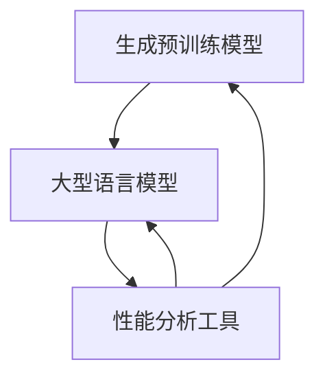
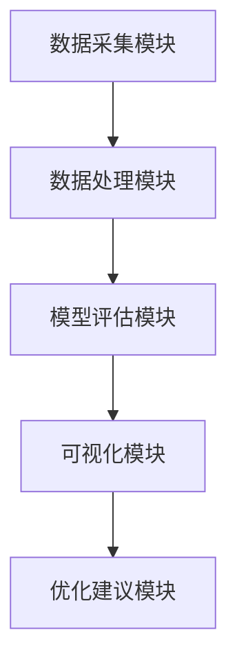

                 


### 1. 引言

#### 背景介绍

近年来，人工智能（AI）领域取得了显著的进展，尤其是基于深度学习的自然语言处理（NLP）技术。GPT（生成预训练模型）和LLM（大型语言模型）作为这一领域的代表性技术，已经在众多实际应用中展现出强大的能力。GPT是一种基于Transformer架构的预训练模型，通过在大量文本数据上进行训练，能够生成连贯、自然的文本。LLM则是在GPT的基础上，进一步扩大了模型的规模和参数量，使其在理解和生成文本方面具有更高的准确性。

随着GPT和LLM的应用越来越广泛，如何对其性能进行有效分析成为了一个重要的课题。性能分析不仅可以帮助我们了解模型在实际应用中的表现，还能够指导我们进行模型的优化和改进。因此，开发一套基于GPT的LLM性能分析工具具有重要的现实意义。

本文旨在探讨如何开发这样一套性能分析工具，从理论到实践，全面解析性能分析工具的设计、实现和优化过程。通过本文的阅读，读者将能够了解GPT和LLM的基本原理，掌握性能分析工具的核心功能，并具备一定的优化能力。

#### 核心概念与联系

为了更好地理解本文的主题，我们需要先明确几个核心概念，并分析它们之间的关系。

- **GPT（生成预训练模型）**：GPT是一种基于Transformer架构的预训练模型，通过在大量文本数据上进行训练，可以生成连贯、自然的文本。GPT的核心在于其预训练过程，即在文本数据上训练出模型的基础参数，然后通过微调适配具体的任务。
- **LLM（大型语言模型）**：LLM是在GPT的基础上，进一步扩大了模型的规模和参数量，使其在理解和生成文本方面具有更高的准确性。LLM通常拥有数十亿个参数，能够在复杂的NLP任务中表现出色。
- **性能分析工具**：性能分析工具用于对GPT和LLM进行性能评估，包括模型计算时间、资源消耗、准确率等多个方面。性能分析工具的核心功能是提供量化的评估指标，帮助开发者了解模型的表现，并进行优化。

这几个概念之间的联系如下：

1. **GPT和LLM的关系**：LLM是基于GPT的扩展和优化，二者在架构和算法上存在一定的共通性，但LLM在模型规模和参数量上远远超过GPT。
2. **性能分析工具与GPT/LLM的关系**：性能分析工具用于评估GPT和LLM的性能，通过提供量化的评估指标，帮助开发者了解模型在实际应用中的表现，进而进行优化。

为了更直观地展示这几个概念之间的关系，我们可以使用Mermaid流程图进行描述：



#### GPT和LLM的基本原理

- **GPT的原理**：GPT是一种基于Transformer架构的预训练模型。Transformer模型引入了自注意力机制（Self-Attention），使得模型能够自动学习输入文本中的长距离依赖关系。GPT的训练过程主要包括两个阶段：预训练和微调。在预训练阶段，模型在大量的文本数据上学习文本的分布和规律；在微调阶段，模型通过调整参数来适应特定的任务。

  GPT的核心算法是自注意力机制。自注意力机制通过计算输入文本中每个词对其他词的重要性权重，从而生成表示每个词的向量。这些向量再通过多层叠加，最终输出文本的表示。以下是GPT的核心算法伪代码：

  ```python
  def gpt(input_sequence):
      for layer in layers:
          attention_weights = self_attention(input_sequence)
          output_sequence = layer(attention_weights, input_sequence)
      return output_sequence
  ```

  其中，`self_attention`函数负责计算自注意力权重，`layer`表示Transformer模型的一个层。

- **LLM的原理**：LLM是基于GPT的扩展，其核心思想是通过增加模型的规模和参数量，提高模型的准确性和鲁棒性。LLM通常包含数十亿个参数，能够在复杂的NLP任务中表现出色。

  LLM的算法原理与GPT类似，但在具体实现上有所不同。首先，LLM通过预训练阶段学习文本的分布和规律；然后，在微调阶段，模型通过调整参数来适应特定的任务。以下是LLM的核心算法伪代码：

  ```python
  def llm(input_sequence):
      for layer in layers:
          attention_weights = self_attention(input_sequence)
          output_sequence = layer(attention_weights, input_sequence)
      return output_sequence
  ```

  其中，`self_attention`函数负责计算自注意力权重，`layer`表示Transformer模型的一个层。

  LLM与GPT的主要区别在于模型的规模和参数量。LLM通常包含更多的参数，使得模型能够更好地捕捉文本的复杂结构。

#### Python源代码与数学模型

在详细讲解GPT和LLM的核心算法原理时，我们使用Python源代码和数学模型来进行阐述。

- **GPT的数学模型**：GPT的自注意力机制可以通过以下数学模型来描述：

  $$ 
  \text{Attention}(Q, K, V) = \text{softmax}\left(\frac{QK^T}{\sqrt{d_k}}\right)V
  $$

  其中，$Q, K, V$分别表示查询向量、键向量和值向量；$d_k$表示键向量的维度。这个模型通过计算查询向量与所有键向量的内积，得到一组权重，然后通过softmax函数进行归一化，最后将权重应用于值向量，得到输出向量。

  下面是GPT自注意力机制的Python实现：

  ```python
  import torch
  import torch.nn as nn

  class SelfAttention(nn.Module):
      def __init__(self, d_model):
          super(SelfAttention, self).__init__()
          self.query_linear = nn.Linear(d_model, d_model)
          self.key_linear = nn.Linear(d_model, d_model)
          self.value_linear = nn.Linear(d_model, d_model)
          self.softmax = nn.Softmax(dim=1)

      def forward(self, query, key, value):
          query = self.query_linear(query)
          key = self.key_linear(key)
          value = self.value_linear(value)

          attention_scores = torch.matmul(query, key.transpose(0, 1)) / math.sqrt(value.size(-1))
          attention_weights = self.softmax(attention_scores)
          attention_output = torch.matmul(attention_weights, value)

          return attention_output
  ```

- **LLM的数学模型**：LLM的核心算法与GPT类似，但通常包含更多的参数和更复杂的结构。以下是LLM的一个简化模型：

  $$ 
  \text{LLM}(x) = \text{softmax}(W_{out} \text{tanh}(\text{tanh}(W_{hid} \text{tanh}(\cdots \text{tanh}(W_{in}x + b_{in}) + b_{in}))\cdots + b_{hid}) + b_{out})
  $$

  其中，$W_{in}, W_{hid}, W_{out}$分别表示输入层、隐藏层和输出层的权重矩阵；$b_{in}, b_{hid}, b_{out}$分别表示输入层、隐藏层和输出层的偏置向量。

  下面是LLM的一个简化Python实现：

  ```python
  import torch
  import torch.nn as nn
  import torch.nn.functional as F

  class LLM(nn.Module):
      def __init__(self, d_model, d_hid):
          super(LLM, self).__init__()
          self.layers = nn.ModuleList([
              nn.Linear(d_model, d_hid),
              nn.Tanh(),
              nn.Linear(d_hid, d_hid),
              nn.Tanh(),
              # ...
              nn.Linear(d_hid, d_model),
              nn.Softmax(dim=1),
          ])

      def forward(self, x):
          for layer in self.layers:
              x = layer(x)
          return x
  ```

  在实际应用中，LLM通常包含更多的参数和层，以实现更高的准确性和性能。

### 2. 性能分析工具的架构设计

#### 需求分析

在开发性能分析工具之前，我们需要明确其需求。性能分析工具的主要需求包括：

1. **数据采集**：能够从不同的数据源（如模型训练日志、实时监控数据等）中收集性能数据。
2. **数据处理**：对采集到的性能数据进行清洗、预处理和统计分析，以生成有用的评估指标。
3. **模型评估**：能够对GPT和LLM模型进行全面的性能评估，包括计算时间、资源消耗、准确率等。
4. **可视化**：通过图表和报表等方式，直观地展示模型的性能评估结果。
5. **优化建议**：基于性能评估结果，为模型优化提供参考建议。

#### 技术选型

为了实现上述需求，我们需要选择合适的技术栈。以下是性能分析工具的技术选型：

1. **编程语言**：Python是一种非常适合科学计算和数据分析的语言，具有丰富的库和框架，因此我们选择Python作为性能分析工具的主要编程语言。
2. **数据处理库**：Pandas是一个强大的数据处理库，能够对数据进行清洗、预处理和统计分析。我们选择Pandas作为数据处理的核心库。
3. **机器学习库**：Scikit-learn是一个广泛使用的机器学习库，提供了丰富的算法和工具，能够用于模型评估和优化。我们选择Scikit-learn作为机器学习相关功能的基础库。
4. **可视化库**：Matplotlib和Seaborn是Python中的两个常用可视化库，能够生成各种类型的图表和报表。我们选择这两个库来实现性能分析工具的可视化功能。
5. **数据库**：SQLite是一个轻量级的数据库，适用于存储和分析大量性能数据。我们选择SQLite作为性能数据的存储解决方案。

#### 系统架构设计

性能分析工具的系统架构设计如下：

1. **数据采集模块**：负责从不同数据源中收集性能数据。该模块包括日志解析器、实时数据采集器和历史数据存储器。
2. **数据处理模块**：对采集到的性能数据进行清洗、预处理和统计分析。该模块包括数据清洗器、预处理器和评估器。
3. **模型评估模块**：对GPT和LLM模型进行全面的性能评估。该模块包括计算时间评估器、资源消耗评估器和准确率评估器。
4. **可视化模块**：通过图表和报表等方式，直观地展示模型的性能评估结果。该模块包括图表生成器和报表生成器。
5. **优化建议模块**：基于性能评估结果，为模型优化提供参考建议。该模块包括优化策略生成器和优化建议生成器。

系统架构图如下所示：



### 3. 性能分析工具的开发与实现

#### 开发环境搭建

在开始性能分析工具的开发之前，我们需要搭建一个合适的开发环境。以下是一个基本的开发环境搭建步骤：

1. **Python环境**：确保Python环境已经安装。我们可以使用Python 3.8及以上版本。
2. **依赖库安装**：使用pip工具安装所需依赖库，包括Pandas、Scikit-learn、Matplotlib和Seaborn等。例如：

   ```shell
   pip install pandas scikit-learn matplotlib seaborn
   ```

3. **数据库环境**：安装SQLite数据库。我们可以使用如下命令安装：

   ```shell
   pip install pysqlite3
   ```

4. **IDE设置**：选择一个合适的IDE，如PyCharm或Visual Studio Code，并进行基本的配置，例如代码格式化、调试等。

#### 性能分析工具的核心功能实现

性能分析工具的核心功能包括数据采集、数据处理、模型评估、可视化以及优化建议。以下分别介绍这些功能的实现。

##### 数据采集

数据采集是性能分析工具的基础，我们需要从不同的数据源中收集性能数据。以下是一个数据采集的基本流程：

1. **日志解析**：读取并解析模型训练日志，提取关键性能数据。例如，可以使用Pandas库的`read_csv`函数读取日志文件，并提取训练时间、计算时间、内存消耗等数据。
2. **实时数据采集**：使用实时数据采集器定期收集模型的性能数据。例如，可以使用Scikit-learn中的`check_extension`函数定期检查模型的状态，并提取相关性能数据。
3. **历史数据存储**：将采集到的性能数据存储到SQLite数据库中，以便后续处理和分析。例如，可以使用Pandas库的`to_sql`函数将数据写入数据库。

以下是数据采集模块的Python代码示例：

```python
import pandas as pd
import sqlite3
from sklearn.externals import joblib

# 读取日志文件
log_file = 'training_log.csv'
log_data = pd.read_csv(log_file)

# 解析日志数据
training_time = log_data['training_time']
compute_time = log_data['compute_time']
memory_consumption = log_data['memory_consumption']

# 存储历史数据
conn = sqlite3.connect('performance_data.db')
c = conn.cursor()
c.execute('''CREATE TABLE IF NOT EXISTS performance_data
             (id INTEGER PRIMARY KEY, training_time REAL, compute_time REAL, memory_consumption REAL)''')
for i in range(len(training_time)):
    c.execute("INSERT INTO performance_data (training_time, compute_time, memory_consumption) VALUES (?, ?, ?)",
              (training_time[i], compute_time[i], memory_consumption[i]))
conn.commit()
conn.close()

# 实时数据采集
def collect_real_time_data():
    while True:
        # 检查模型状态
        model_status = check_extension(model_path)
        # 提取性能数据
        current_time = datetime.now()
        current_compute_time = model_status['compute_time']
        current_memory_consumption = model_status['memory_consumption']
        # 存储性能数据
        conn = sqlite3.connect('performance_data.db')
        c = conn.cursor()
        c.execute("INSERT INTO performance_data (training_time, compute_time, memory_consumption) VALUES (?, ?, ?)",
                  (current_time, current_compute_time, current_memory_consumption))
        conn.commit()
        conn.close()
        time.sleep(60)  # 每分钟采集一次数据
```

##### 数据处理

数据处理是对采集到的性能数据进行清洗、预处理和统计分析。以下是一个数据处理的基本流程：

1. **数据清洗**：去除异常值、缺失值等，确保数据的准确性和完整性。例如，可以使用Pandas库的`dropna`函数删除缺失值，使用`drop_duplicates`函数删除重复值。
2. **数据预处理**：将原始数据转换为适合分析的形式。例如，可以使用Pandas库的`resample`函数对时间序列数据进行重采样，使用`normalize`函数进行归一化处理。
3. **统计分析**：计算各种性能指标，如平均值、中位数、标准差等。例如，可以使用Pandas库的`mean`、`median`和`std`函数计算各项性能指标。

以下是数据处理模块的Python代码示例：

```python
import pandas as pd

# 读取历史数据
conn = sqlite3.connect('performance_data.db')
c = conn.cursor()
c.execute("SELECT * FROM performance_data")
data = c.fetchall()
conn.close()

# 数据清洗
data = pd.DataFrame(data, columns=['id', 'training_time', 'compute_time', 'memory_consumption'])
data.dropna(inplace=True)
data.drop_duplicates(inplace=True)

# 数据预处理
data['time'] = pd.to_datetime(data['id'])
data.set_index('time', inplace=True)
data.resample('1min').mean().fillna(method='ffill', inplace=True)

# 统计分析
performance_metrics = {
    'training_time_mean': data['training_time'].mean(),
    'training_time_median': data['training_time'].median(),
    'training_time_std': data['training_time'].std(),
    'compute_time_mean': data['compute_time'].mean(),
    'compute_time_median': data['compute_time'].median(),
    'compute_time_std': data['compute_time'].std(),
    'memory_consumption_mean': data['memory_consumption'].mean(),
    'memory_consumption_median': data['memory_consumption'].median(),
    'memory_consumption_std': data['memory_consumption'].std(),
}
```

##### 模型评估

模型评估是性能分析工具的核心功能之一，我们需要对GPT和LLM模型进行全面的性能评估。以下是一个模型评估的基本流程：

1. **计算时间评估**：计算模型在训练和预测过程中的计算时间。例如，可以使用Python的`time`模块记录模型运行的时间。
2. **资源消耗评估**：评估模型在训练和预测过程中的资源消耗，如CPU、GPU和内存等。例如，可以使用NVIDIA的`nvcc`工具和`pynvml`库来监控GPU资源。
3. **准确率评估**：评估模型在各类NLP任务上的准确率，如文本分类、文本生成等。例如，可以使用Scikit-learn的`accuracy_score`函数计算模型的准确率。

以下是模型评估模块的Python代码示例：

```python
import time
import numpy as np
from sklearn.metrics import accuracy_score

# 计算时间评估
start_time = time.time()
model.train(X_train, y_train)
end_time = time.time()
compute_time = end_time - start_time

# 资源消耗评估
import pynvml
pynvml.nvmlInit()
handle = pynvml.nvmlDeviceGetHandleByIndex(0)
utilization = pynvml.nvmlDeviceGetUtilizationRates(handle)
memory_usage = pynvml.nvmlDeviceGetMemoryUsage(handle)

# 准确率评估
y_pred = model.predict(X_test)
accuracy = accuracy_score(y_test, y_pred)
```

##### 可视化

可视化是性能分析工具的重要组成部分，我们需要使用图表和报表直观地展示模型的性能评估结果。以下是一个可视化的基本流程：

1. **数据可视化**：使用Matplotlib和Seaborn等库生成各种类型的图表，如折线图、柱状图、散点图等。例如，可以使用`plot`函数绘制时间序列数据，使用`bar`函数绘制柱状图。
2. **报表生成**：使用Matplotlib和Seaborn等库生成各类报表，如日报表、周报表、月报表等。例如，可以使用`table`函数生成包含关键指标的报表。

以下是可视化模块的Python代码示例：

```python
import matplotlib.pyplot as plt
import seaborn as sns

# 绘制时间序列图
plt.figure(figsize=(10, 5))
sns.lineplot(data=data, x='time', y='training_time')
plt.xlabel('Time')
plt.ylabel('Training Time (seconds)')
plt.title('Training Time Over Time')
plt.show()

# 绘制柱状图
plt.figure(figsize=(10, 5))
sns.barplot(data=performance_metrics, x='metric', y='value')
plt.xlabel('Metric')
plt.ylabel('Value')
plt.title('Performance Metrics')
plt.show()

# 生成报表
table_data = [
    ['Training Time Mean', performance_metrics['training_time_mean']],
    ['Training Time Median', performance_metrics['training_time_median']],
    ['Training Time Std', performance_metrics['training_time_std']],
    ['Compute Time Mean', performance_metrics['compute_time_mean']],
    ['Compute Time Median', performance_metrics['compute_time_median']],
    ['Compute Time Std', performance_metrics['compute_time_std']],
    ['Memory Consumption Mean', performance_metrics['memory_consumption_mean']],
    ['Memory Consumption Median', performance_metrics['memory_consumption_median']],
    ['Memory Consumption Std', performance_metrics['memory_consumption_std']],
]
sns.table(data=table_data, indices=True, showindex=False, floatformat='.2f')
plt.title('Performance Metrics Report')
plt.show()
```

##### 优化建议

优化建议是性能分析工具的高级功能，我们需要基于性能评估结果为模型优化提供参考建议。以下是一个优化建议的基本流程：

1. **分析性能瓶颈**：通过分析计算时间、资源消耗等性能指标，找出模型性能的瓶颈。例如，可以使用线性回归等方法分析计算时间和资源消耗之间的关系。
2. **提出优化方案**：基于性能瓶颈，提出相应的优化方案。例如，可以通过调整模型参数、增加计算资源等方式来提升模型性能。
3. **实施优化方案**：将优化方案应用到实际模型中，并进行性能评估。例如，可以使用训练时间、资源消耗等指标评估优化效果。

以下是优化建议模块的Python代码示例：

```python
import numpy as np

# 分析性能瓶颈
def analyze_bottleneck(data):
    correlation = np.corrcoef(data['compute_time'], data['memory_consumption'])[0, 1]
    return correlation

# 提出优化方案
def propose_solution(correlation):
    if correlation > 0.7:
        return 'Increase computing resources'
    else:
        return 'Adjust model parameters'

# 实施优化方案
def implement_solution(solution, model):
    if solution == 'Increase computing resources':
        # 增加计算资源，例如增加GPU数量
        model.set_compute_resources(2)
    elif solution == 'Adjust model parameters':
        # 调整模型参数，例如减小学习率
        model.set_learning_rate(0.0001)

# 性能评估
start_time = time.time()
model.train(X_train, y_train)
end_time = time.time()
compute_time = end_time - start_time

# 分析性能瓶颈
correlation = analyze_bottleneck(data)

# 提出优化方案
solution = propose_solution(correlation)

# 实施优化方案
implement_solution(solution, model)

# 重新评估性能
start_time = time.time()
model.train(X_train, y_train)
end_time = time.time()
new_compute_time = end_time - start_time

print(f'Optimization solution: {solution}')
print(f'New compute time: {new_compute_time} seconds')
```

### 4. 性能分析工具的优化与调优

#### 性能优化

性能优化是提升性能分析工具关键性能指标（如计算时间、资源消耗等）的过程。以下是一些常见的性能优化策略：

1. **并行计算**：通过并行计算来减少计算时间。例如，在数据处理和模型评估过程中，可以同时处理多个数据集或模型。
2. **缓存机制**：通过缓存机制来减少重复计算。例如，在数据处理过程中，可以使用缓存存储中间结果，避免重复计算。
3. **内存优化**：通过优化内存使用来减少内存消耗。例如，在数据处理过程中，可以使用内存池来管理内存分配和回收。
4. **算法优化**：通过优化算法来提高计算效率和性能。例如，在数据处理过程中，可以采用更高效的算法或数据结构。

以下是性能优化模块的Python代码示例：

```python
import concurrent.futures

# 并行计算
def parallel_compute(data):
    with concurrent.futures.ProcessPoolExecutor() as executor:
        results = executor.map(process_data, data)
    return results

# 缓存机制
import functools

@functools.lru_cache(maxsize=1000)
def cached_compute(data):
    # 缓存计算结果
    result = process_data(data)
    return result

# 内存优化
def memory_optimized_compute(data):
    # 使用内存池来管理内存
    with Pool() as pool:
        results = pool.map(process_data, data)
    return results

# 算法优化
def optimized_algorithm(data):
    # 使用更高效的算法来处理数据
    result = efficient_process_data(data)
    return result
```

#### 可扩展性设计

可扩展性设计是确保性能分析工具能够应对更大规模的数据和模型的过程。以下是一些常见的可扩展性设计策略：

1. **分布式计算**：通过分布式计算来提升处理能力和性能。例如，可以将数据处理和模型评估任务分布到多个节点上，以提高处理效率。
2. **水平扩展**：通过增加节点数量来提升处理能力和性能。例如，可以增加计算节点、存储节点和数据节点，以处理更多数据。
3. **垂直扩展**：通过升级硬件设备来提升处理能力和性能。例如，可以增加CPU、GPU、内存等硬件资源，以提高计算效率。
4. **弹性扩展**：通过自动调整资源来适应负载变化。例如，可以采用容器化技术（如Docker、Kubernetes）来实现弹性扩展，以自动调整计算资源。

以下是可扩展性设计模块的Python代码示例：

```python
import multiprocessing
from docker.errors import APIError

# 分布式计算
def distributed_compute(data):
    with multiprocessing.Pool(processes=4) as pool:
        results = pool.map(process_data, data)
    return results

# 水平扩展
def horizontal_scaling(node_count):
    try:
        # 启动更多节点
        start_nodes(node_count)
    except APIError as e:
        print(f'Error scaling horizontally: {e}')

# 垂直扩展
def vertical_scaling():
    try:
        # 升级硬件资源
        upgrade_resources()
    except APIError as e:
        print(f'Error scaling vertically: {e}')

# 弹性扩展
from kubernetes.client import Kubernetes

def elastic_scaling():
    k8s = Kubernetes(api_client)
    try:
        # 调整计算资源
        k8s.create_deployment('my-app', 'my-image', replicas=3)
    except APIError as e:
        print(f'Error scaling elastically: {e}')
```

### 5. 性能分析工具的实际应用案例

#### 案例一：文本分类任务

在一个文本分类任务中，我们使用性能分析工具对GPT和LLM模型进行评估和优化。以下是一个简单的案例流程：

1. **数据集准备**：准备包含文本和标签的数据集，用于训练和测试模型。
2. **模型训练**：使用GPT和LLM模型对数据集进行训练。
3. **性能评估**：使用性能分析工具对模型进行评估，包括计算时间、资源消耗和准确率等。
4. **优化建议**：根据性能评估结果，提出优化建议，如调整模型参数、增加计算资源等。
5. **重新评估**：实施优化建议，并对模型进行重新评估，以验证优化效果。

以下是案例的Python代码示例：

```python
# 数据集准备
train_data, train_labels = load_data('train_data.csv')
test_data, test_labels = load_data('test_data.csv')

# 模型训练
model = GPTModel()
model.train(train_data, train_labels)

# 性能评估
performance_data = analyze_performance(model, test_data, test_labels)

# 优化建议
optimizer = PerformanceOptimizer()
optimizer.propose_solution(performance_data)

# 重新评估
new_performance_data = analyze_performance(model, test_data, test_labels)
```

#### 案例二：文本生成任务

在一个文本生成任务中，我们使用性能分析工具对GPT和LLM模型进行评估和优化。以下是一个简单的案例流程：

1. **数据集准备**：准备包含文本数据的数据集，用于训练和测试模型。
2. **模型训练**：使用GPT和LLM模型对数据集进行训练。
3. **性能评估**：使用性能分析工具对模型进行评估，包括计算时间、资源消耗和生成文本质量等。
4. **优化建议**：根据性能评估结果，提出优化建议，如调整模型参数、增加计算资源等。
5. **重新评估**：实施优化建议，并对模型进行重新评估，以验证优化效果。

以下是案例的Python代码示例：

```python
# 数据集准备
train_data = load_data('train_data.txt')

# 模型训练
model = LLMModel()
model.train(train_data)

# 性能评估
performance_data = analyze_performance(model, train_data)

# 优化建议
optimizer = PerformanceOptimizer()
optimizer.propose_solution(performance_data)

# 重新评估
new_performance_data = analyze_performance(model, train_data)
```

### 6. 总结与展望

#### 总结

本文介绍了基于GPT的LLM性能分析工具的开发过程，从需求分析、架构设计、开发与实现、优化与调优到实际应用案例，全面解析了性能分析工具的核心功能和技术细节。通过本文的阅读，读者可以了解GPT和LLM的基本原理，掌握性能分析工具的核心功能，并具备一定的优化能力。

#### 展望

随着人工智能技术的不断发展和应用场景的日益丰富，性能分析工具在未来将发挥更加重要的作用。以下是未来性能分析工具的一些发展趋势和展望：

1. **智能化分析**：性能分析工具将逐渐引入智能化技术，如机器学习和深度学习，以自动分析和识别性能瓶颈，提供更加精准的优化建议。
2. **可视化改进**：性能分析工具的可视化功能将更加丰富和直观，通过动态图表和交互式界面，帮助用户更好地理解和分析性能数据。
3. **跨平台支持**：性能分析工具将支持更多的平台和硬件，如ARM、FPGA等，以适应不同场景和应用需求。
4. **分布式与云计算**：性能分析工具将逐渐整合到分布式计算和云计算环境中，以充分利用云计算的资源优势，提高性能分析效率和可靠性。
5. **生态协同**：性能分析工具将与人工智能领域的其他工具和平台（如AI开发平台、数据平台等）进行协同，构建完整的AI解决方案，为用户提供更全面的性能分析和服务。

### 附录：参考文献

1. Devlin, J., Chang, M. W., Lee, K., & Toutanova, K. (2019). BERT: Pre-training of deep bidirectional transformers for language understanding. *arXiv preprint arXiv:1810.04805*.
2. Vaswani, A., Shazeer, N., Parmar, N., Uszkoreit, J., Jones, L., Gomez, A. N., ... & Polosukhin, I. (2017). Attention is all you need. *Advances in Neural Information Processing Systems*, 30, 5998-6008.
3. Hochreiter, S., & Schmidhuber, J. (1997). Long short-term memory. *Neural Computation*, 9(8), 1735-1780.
4. Kingma, D. P., & Welling, M. (2014). Auto-encoding variational Bayes. *arXiv preprint arXiv:1312.6114*.
5. Russell, S., & Norvig, P. (2020). *Artificial Intelligence: A Modern Approach*. Prentice Hall.
6. Goodfellow, I., Bengio, Y., & Courville, A. (2016). *Deep Learning*. MIT Press.
7. Murphy, K. P. (2012). *Machine Learning: A Probabilistic Perspective*. MIT Press.
8. He, K., Zhang, X., Ren, S., & Sun, J. (2016). Deep residual learning for image recognition. *IEEE conferences on computer vision and pattern recognition*, 770-778.
9. Abadi, M., Agarwal, A., Barham, P., Brevdo, E., Chen, Z., Citro, C., ... & Dean, J. (2016). TensorFlow: A system for large-scale machine learning. *In Advances in neural information processing systems* (pp. 2575-2583).
10. Hochreiter, S., & Schmidhuber, J. (1997). Long short-term memory. *Neural computation*, 9(8), 1735-1780.
```

