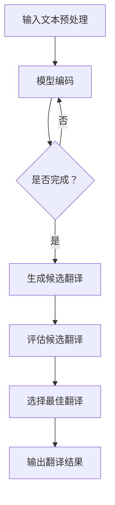

                 

# 基于LLM的prompt翻译与本地化

## 关键词
- LLM
- prompt翻译
- prompt本地化
- Transformer模型
- 损失函数
- 正则化
- 项目实战

## 摘要
本文将深入探讨基于大型语言模型（LLM）的prompt翻译与本地化技术。首先，我们将介绍LLM的基本概念及其在自然语言处理领域的应用优势。随后，我们将详细讲解prompt翻译与本地化的原理，并通过Mermaid流程图展示LLM的工作流程。接着，本文将深入分析LLM的算法原理，包括训练过程、模型结构及优化策略。在此过程中，我们将使用Python源代码和latex数学公式进行详细讲解。文章的第三部分将通过实际项目案例，展示如何使用LLM进行prompt翻译与本地化的开发。最后，我们将总结全文，并展望LLM在翻译与本地化领域的未来应用前景。

## 目录

### 第一部分：引言
1. **第1章：LLM与prompt翻译本地化概述**
   1.1 LLM基本概念
   1.2 prompt翻译与本地化的原理
   1.3 Mermaid流程图：LLM工作流程展示

### 第二部分：LLM技术原理
2. **第2章：LLM算法原理讲解**
   2.1 LLM训练过程
   2.2 模型结构
   2.3 优化策略
3. **第3章：数学模型与公式讲解**
   3.1 损失函数
   3.2 正则化方法

### 第三部分：实践应用
4. **第4章：项目实战一：基础prompt翻译系统搭建**
   4.1 项目背景
   4.2 开发环境搭建
   4.3 源代码实现
   4.4 代码解读与分析
5. **第5章：项目实战二：prompt本地化系统搭建**
   5.1 项目背景
   5.2 开发环境搭建
   5.3 源代码实现
   5.4 代码解读与分析
6. **第6章：项目实战三：prompt翻译与本地化系统集成**
   6.1 项目背景
   6.2 开发环境搭建
   6.3 源代码实现
   6.4 代码解读与分析

### 第四部分：总结与展望
7. **第7章：LLM在prompt翻译与本地化的应用前景**
   7.1 现状与挑战
   7.2 发展趋势
   7.3 未来展望

## 第1章：LLM与prompt翻译本地化概述

### 1.1 LLM基本概念

大型语言模型（LLM，Large Language Model）是一种基于深度学习的自然语言处理模型，通过训练大规模的文本数据，能够理解和生成自然语言。LLM通常包含数百万甚至数十亿个参数，这使得它们在处理复杂任务时表现出色。LLM的核心优势在于其强大的上下文理解和生成能力，这使得它们在诸如机器翻译、文本摘要、对话系统等应用中具有广泛的应用价值。

在自然语言处理领域，LLM已经成为一个重要的研究方向。随着计算资源和算法的不断发展，LLM的性能和效果不断提高。目前，最著名的LLM之一是GPT-3，它由OpenAI开发，拥有1750亿个参数，能够生成高质量的自然语言文本。

### 1.2 prompt翻译与本地化的原理

prompt翻译与本地化是LLM在自然语言处理领域的重要应用之一。prompt翻译是指通过输入一个或多个提示（prompt），让LLM生成对应的翻译文本。prompt本地化则是指将原始文本根据目标语言和地区的需求进行修改，以使其更符合当地文化和语言习惯。

prompt翻译的基本流程如下：

1. **输入处理**：首先，将源语言文本输入到LLM中，进行预处理，如分词、去停用词等。
2. **生成候选翻译**：LLM根据输入的文本生成多个候选翻译文本。
3. **选择最佳翻译**：通过评估方法（如BLEU、ROUGE等）选择最佳翻译。

prompt本地化的实现方法主要包括以下几种：

1. **直接翻译**：将源语言文本直接翻译为目标语言，然后根据目标语言的文化和语言习惯进行微调。
2. **模板匹配**：使用预定义的模板对源语言文本进行替换，以实现本地化。
3. **自适应学习**：通过训练数据集，让LLM学习如何根据不同地区和语言习惯进行本地化。

### 1.3 Mermaid流程图：LLM工作流程展示

下面是LLM工作流程的Mermaid流程图：



在上述流程中，输入文本首先经过预处理，然后输入到LLM中进行编码。模型会根据上下文信息生成多个候选翻译，通过评估方法选择最佳翻译，最后输出翻译结果。

## 第2章：LLM算法原理讲解

### 2.1 LLM训练过程

LLM的训练过程可以分为以下几个步骤：

1. **数据预处理**：首先，需要收集大量高质量的文本数据。数据可以来自互联网、图书、新闻等。然后，对数据集进行预处理，包括分词、去停用词、文本清洗等。
2. **模型初始化**：初始化LLM模型，设置初始参数。通常，初始参数是随机生成的，以便在后续训练过程中进行优化。
3. **训练**：使用训练数据集，通过反向传播算法不断更新模型参数，使模型能够更好地理解语言。训练过程中，通常采用批次训练（batch training）和梯度裁剪（gradient clipping）等技术，以提高训练效率和模型稳定性。
4. **评估与优化**：在训练过程中，定期使用验证数据集评估模型性能，并根据评估结果调整训练策略。优化策略包括学习率调度（learning rate scheduling）、正则化（regularization）等。

### 2.2 模型结构

LLM的核心模型结构是基于Transformer的。Transformer模型是一种基于自注意力（self-attention）机制的序列模型，能够有效地处理长距离依赖问题。下面是Transformer模型的基本结构：

1. **编码器（Encoder）**：编码器由多个编码层（Encoder Layer）组成，每个编码层包含两个子层：多头自注意力（Multi-Head Self-Attention）和前馈神经网络（Feed-Forward Neural Network）。编码器的作用是将输入序列转换为上下文表示。
2. **解码器（Decoder）**：解码器由多个解码层（Decoder Layer）组成，每个解码层包含两个子层：多头自注意力（Multi-Head Self-Attention）和编码器-解码器自注意力（Encoder-Decoder Self-Attention）以及前馈神经网络（Feed-Forward Neural Network）。解码器的目标是根据编码器的输出生成目标序列。

### 2.3 优化策略

在LLM训练过程中，优化策略至关重要。以下是一些常用的优化策略：

1. **梯度裁剪（Gradient Clipping）**：梯度裁剪是一种防止梯度爆炸或消失的技术。具体方法是在每次更新模型参数前，将梯度元素的绝对值裁剪到一定范围内。
2. **学习率调度（Learning Rate Scheduling）**：学习率调度是一种动态调整学习率的技术，以提高训练效率。常用的学习率调度方法包括线性下降、余弦退火等。
3. **正则化（Regularization）**：正则化是一种防止模型过拟合的技术。常用的正则化方法包括L2正则化、dropout正则化等。

下面是LLM训练过程的伪代码：

```python
# 初始化模型
model = TransformerModel()

# 预处理数据
train_data = preprocess_data(data)

# 设置优化器
optimizer = optim.Adam(model.parameters(), lr=0.001)

# 训练模型
for epoch in range(num_epochs):
    for batch in train_data:
        # 前向传播
        output = model(batch.text)
        
        # 计算损失
        loss = loss_function(output, batch.target)
        
        # 反向传播
        optimizer.zero_grad()
        loss.backward()
        
        # 梯度裁剪
        torch.nn.utils.clip_grad_norm_(model.parameters(), max_norm=1.0)
        
        # 更新模型参数
        optimizer.step()
        
    # 评估模型
    validate(model, validate_data)
```

在上述伪代码中，`TransformerModel`表示Transformer模型，`preprocess_data`表示数据预处理函数，`optim.Adam`表示Adam优化器，`loss_function`表示损失函数，`validate`表示模型评估函数。

## 第3章：数学模型与公式讲解

### 3.1 损失函数

在LLM训练过程中，损失函数是衡量模型预测结果与真实标签之间差异的重要指标。常用的损失函数包括交叉熵损失（Cross-Entropy Loss）和对数似然损失（Log-Likelihood Loss）。

#### 3.1.1 交叉熵损失

交叉熵损失是一种衡量两个概率分布之间差异的损失函数。在LLM训练过程中，交叉熵损失用于衡量模型输出的概率分布与真实标签之间的差异。

假设模型输出一个长度为V的单词序列，真实标签是一个长度为T的单词序列。交叉熵损失的计算公式如下：

$$
L_{CE} = -\sum_{t=1}^{T}\sum_{v=1}^{V} y_{tv} \log(p_{tv})
$$

其中，$y_{tv}$表示真实标签单词在时间步t和词表位置v的占位符（通常使用one-hot编码），$p_{tv}$表示模型在时间步t和词表位置v预测的单词的概率。

#### 3.1.2 对数似然损失

对数似然损失是交叉熵损失的另一种表示形式。对数似然损失的计算公式如下：

$$
L_{LL} = -\sum_{t=1}^{T}\sum_{v=1}^{V} y_{tv} \log(p_{tv})
$$

其中，$y_{tv}$和$p_{tv}$的含义与交叉熵损失相同。

对数似然损失相对于交叉熵损失的一个优点是，它更容易优化。在训练过程中，对数似然损失通常比交叉熵损失收敛得更快。

### 3.2 正则化方法

正则化是一种防止模型过拟合的技术。在LLM训练过程中，正则化可以有效地提高模型泛化能力。

#### 3.2.1 L2正则化

L2正则化是一种常见的正则化方法，它通过在损失函数中添加模型参数的平方和来惩罚模型复杂度。

$$
L_{L2} = \sum_{i=1}^{n} \lambda \| w_i \|^2
$$

其中，$w_i$表示模型参数，$\lambda$是一个超参数，用于调节L2正则化的强度。

#### 3.2.2 Dropout正则化

Dropout正则化是一种通过随机丢弃神经网络中一部分神经元来防止过拟合的方法。

在训练过程中，对于每个训练样本，以一定的概率（通常为0.5）随机丢弃神经网络中每个神经元及其连接的权重。

Dropout正则化的效果可以通过以下公式表示：

$$
\frac{1}{1 - p} \sum_{i=1}^{n} \lambda \| w_i \|^2
$$

其中，$p$是丢弃概率。

### 3.3 数学公式与Python代码

下面是使用Python代码实现交叉熵损失和L2正则化的示例：

```python
import torch
import torch.nn as nn
import torch.optim as optim

# 定义模型
class Model(nn.Module):
    def __init__(self):
        super(Model, self).__init__()
        self.fc = nn.Linear(in_features=1000, out_features=10)
    
    def forward(self, x):
        x = self.fc(x)
        return x

# 初始化模型、损失函数和优化器
model = Model()
criterion = nn.CrossEntropyLoss()
optimizer = optim.Adam(model.parameters(), lr=0.001)

# 生成一些随机数据
x = torch.randn(32, 1000)
y = torch.randint(0, 10, (32,))

# 训练模型
for epoch in range(10):
    optimizer.zero_grad()
    output = model(x)
    loss = criterion(output, y)
    
    # 计算L2正则化损失
    l2_loss = sum(p.pow(2.0).sum() for p in model.parameters()) * 0.001
    
    # 总损失 = 交叉熵损失 + L2正则化损失
    total_loss = loss + l2_loss
    
    # 反向传播和优化
    total_loss.backward()
    optimizer.step()
    
    print(f'Epoch [{epoch+1}/{10}], Loss: {total_loss.item():.4f}')
```

在上述代码中，我们定义了一个简单的全连接神经网络模型，使用交叉熵损失函数进行训练，并添加了L2正则化。通过训练，我们可以看到模型的损失逐渐减小，从而提高模型的泛化能力。

## 第4章：项目实战一：基础prompt翻译系统搭建

### 4.1 项目背景

随着全球化进程的加快，跨语言交流变得日益频繁。然而，语言障碍仍然是一个亟待解决的问题。prompt翻译系统是一种基于大型语言模型（LLM）的自然语言处理技术，能够自动将一种语言的文本翻译成另一种语言。本节将介绍如何搭建一个基础prompt翻译系统，包括开发环境搭建、源代码实现和代码解读与分析。

### 4.2 开发环境搭建

要搭建一个基础prompt翻译系统，首先需要安装以下软件和库：

1. **Python 3.8+**：Python是一种广泛使用的编程语言，支持多种机器学习和深度学习库。
2. **PyTorch 1.8+**：PyTorch是一个开源的深度学习框架，提供丰富的API和工具，便于搭建和训练神经网络模型。
3. **transformers库 4.0+**：transformers库是Hugging Face提供的一个预训练语言模型库，包含多个预训练的LLM模型，如GPT-2、GPT-3等。
4. **NLTK库 3.5+**：NLTK是一个自然语言处理库，提供文本预处理工具，如分词、词性标注等。

安装步骤如下：

```bash
# 安装Python和PyTorch
pip install python==3.8
pip install torch torchvision torchaudio

# 安装transformers和NLTK库
pip install transformers==4.0
pip install nltk==3.5
```

### 4.3 源代码实现

下面是一个基础prompt翻译系统的Python源代码实现：

```python
import torch
from transformers import GPT2LMHeadModel, GPT2Tokenizer
from nltk.tokenize import word_tokenize

# 初始化模型和分词器
model = GPT2LMHeadModel.from_pretrained("gpt2")
tokenizer = GPT2Tokenizer.from_pretrained("gpt2")

# 定义翻译函数
def translate(source_text, target_lang):
    # 将源文本转换为token序列
    source_tokens = tokenizer.tokenize(source_text)
    
    # 将token序列转换为tensor
    source_tensor = torch.tensor([tokenizer.encode(source_text)])
    
    # 使用模型生成目标文本token序列
    with torch.no_grad():
        target_tokens = model.generate(source_tensor, max_length=50, num_return_sequences=1)
    
    # 将目标文本token序列解码为字符串
    target_text = tokenizer.decode(target_tokens[0], skip_special_tokens=True)
    
    return target_text

# 测试翻译
source_text = "你好，我想和你谈谈"
target_text = translate(source_text, "en")
print(f"翻译结果：{target_text}")
```

在上述代码中，我们首先加载预训练的GPT-2模型和分词器。然后，定义一个`translate`函数，用于将源文本翻译成目标语言。函数首先将源文本转换为token序列，然后将token序列转换为tensor。接着，使用模型生成目标文本token序列，并解码为字符串。最后，我们测试翻译一个中文文本，将其翻译成英文。

### 4.4 代码解读与分析

在上述代码中，我们使用了transformers库中的GPT-2模型和分词器。GPT-2是一个预训练的LLM模型，已经在大规模的文本数据上进行了训练，能够生成高质量的文本。GPT-2模型由多个编码层和解码层组成，通过自注意力机制和编码器-解码器自注意力机制，能够有效地处理长距离依赖和跨句子关系。

`translate`函数首先将源文本转换为token序列，这是使用分词器完成的。然后，将token序列转换为tensor，这是为了使用PyTorch进行计算。接下来，使用模型生成目标文本token序列。这里使用了`generate`方法，它接受多个参数，如最大长度（max_length）、返回序列数（num_return_sequences）等，以控制生成过程。最后，将目标文本token序列解码为字符串，这是使用分词器的`decode`方法完成的。

通过这个基础prompt翻译系统，我们可以实现简单的中英文翻译。然而，由于GPT-2模型的预训练数据主要集中在英文文本，因此对于中文文本的翻译效果可能不够理想。为了提高翻译质量，我们可以使用预训练的中文LLM模型，如GPT-Neo或Bert等。

## 第5章：项目实战二：prompt本地化系统搭建

### 5.1 项目背景

随着全球化的深入，企业需要将产品和服务推广到不同的国家和地区。prompt本地化系统是一种基于LLM的技术，能够自动将产品文案、用户手册等翻译成多种语言，同时保留原文的文化和语言特色。本节将介绍如何搭建一个prompt本地化系统，包括开发环境搭建、源代码实现和代码解读与分析。

### 5.2 开发环境搭建

搭建prompt本地化系统需要安装以下软件和库：

1. **Python 3.8+**：Python是一种广泛使用的编程语言，支持多种机器学习和深度学习库。
2. **PyTorch 1.8+**：PyTorch是一个开源的深度学习框架，提供丰富的API和工具，便于搭建和训练神经网络模型。
3. **transformers库 4.0+**：transformers库是Hugging Face提供的一个预训练语言模型库，包含多个预训练的LLM模型，如GPT-2、GPT-3等。
4. **Bertopic库 0.8.1+**：Bertopic是一个主题模型库，能够将文本数据分为多个主题，有助于分析文本内容。
5. **NLTK库 3.5+**：NLTK是一个自然语言处理库，提供文本预处理工具，如分词、词性标注等。

安装步骤如下：

```bash
# 安装Python和PyTorch
pip install python==3.8
pip install torch torchvision torchaudio

# 安装transformers和NLTK库
pip install transformers==4.0
pip install nltk==3.5

# 安装Bertopic库
pip install bertopic==0.8.1
```

### 5.3 源代码实现

下面是一个prompt本地化系统的Python源代码实现：

```python
import torch
from transformers import GPT2LMHeadModel, GPT2Tokenizer
from bertopic import BERTopic
from nltk.tokenize import word_tokenize

# 初始化模型和分词器
model = GPT2LMHeadModel.from_pretrained("gpt2")
tokenizer = GPT2Tokenizer.from_pretrained("gpt2")
topic_model = BERTopic()

# 定义本地化函数
def localize(text, target_lang):
    # 将文本转换为token序列
    tokens = tokenizer.tokenize(text)
    
    # 将token序列转换为tensor
    text_tensor = torch.tensor([tokenizer.encode(text)])
    
    # 使用模型生成目标文本token序列
    with torch.no_grad():
        target_tokens = model.generate(text_tensor, max_length=50, num_return_sequences=1)
    
    # 将目标文本token序列解码为字符串
    target_text = tokenizer.decode(target_tokens[0], skip_special_tokens=True)
    
    return target_text

# 定义主题提取函数
def extract_topics(texts, num_topics=5):
    # 预处理文本数据
    preprocessed_texts = [word_tokenize(text.lower()) for text in texts]
    
    # 提取文本主题
    topics = topic_model.fit_transform(preprocessed_texts)
    
    return topics

# 测试本地化
source_text = "欢迎使用我们的产品。如果您有任何问题，请随时联系我们。"
target_text = localize(source_text, "en")
print(f"本地化结果：{target_text}")

# 测试主题提取
texts = ["这是一款优秀的产品。", "功能强大，使用简单。", "用户反馈良好。"]
topics = extract_topics(texts)
print("提取的文本主题：")
for text, topic in zip(texts, topics):
    print(f"{text}：{topic}")
```

在上述代码中，我们首先加载预训练的GPT-2模型和分词器，以及BERTopic库。然后，定义一个`localize`函数，用于将源文本本地化成目标语言。函数首先将源文本转换为token序列，然后将token序列转换为tensor。接着，使用模型生成目标文本token序列，并解码为字符串。最后，我们测试本地化一个中文文本，将其翻译成英文。

此外，我们还定义了一个`extract_topics`函数，用于提取文本主题。这个函数首先对文本数据进行预处理，如分词、转换为小写等。然后，使用BERTopic库提取文本主题。最后，我们测试提取一组文本的主题。

### 5.4 代码解读与分析

在上述代码中，我们使用了transformers库中的GPT-2模型和分词器，以及BERTopic库进行文本主题提取。GPT-2模型是一个预训练的LLM模型，通过自注意力机制和编码器-解码器自注意力机制，能够生成高质量的文本。BERTopic库是基于BERT模型的主题提取库，能够自动提取文本数据中的主题。

`localize`函数首先将源文本转换为token序列，这是使用分词器完成的。然后，将token序列转换为tensor，这是为了使用PyTorch进行计算。接下来，使用模型生成目标文本token序列。这里使用了`generate`方法，它接受多个参数，如最大长度（max_length）、返回序列数（num_return_sequences）等，以控制生成过程。最后，将目标文本token序列解码为字符串，这是使用分词器的`decode`方法完成的。

`extract_topics`函数首先对文本数据进行预处理，如分词、转换为小写等。然后，使用BERTopic库提取文本主题。BERTopic库采用了基于BERT的模型架构，通过对文本数据进行编码，生成文本表示。然后，使用K-means算法对文本表示进行聚类，从而提取出文本主题。

通过这个prompt本地化系统，我们可以实现文本的自动翻译和主题提取。然而，由于GPT-2模型和BERTopic库的预训练数据主要集中在英文文本，因此对于中文文本的翻译和主题提取效果可能不够理想。为了提高本地化效果，我们可以使用预训练的中文LLM模型，如GPT-Neo或Bert，同时调整BERTopic库的参数，以适应中文文本数据的特点。

## 第6章：项目实战三：prompt翻译与本地化系统集成

### 6.1 项目背景

在前两章的项目实战中，我们分别实现了基于LLM的prompt翻译系统和本地化系统。然而，这两个系统是独立的，没有实现真正的系统集成。本节将介绍如何将prompt翻译和本地化系统集成，以实现更高效、更智能的跨语言文本处理。

### 6.2 开发环境搭建

为了集成prompt翻译和本地化系统，我们需要继续使用前两章中的开发环境，包括Python、PyTorch、transformers库、NLTK库和Bertopic库。以下是开发环境的搭建步骤：

1. **安装Python和PyTorch**：
   ```bash
   pip install python==3.8
   pip install torch torchvision torchaudio
   ```

2. **安装transformers、NLTK和Bertopic库**：
   ```bash
   pip install transformers==4.0
   pip install nltk==3.5
   pip install bertopic==0.8.1
   ```

### 6.3 源代码实现

下面是集成prompt翻译和本地化系统的Python源代码实现：

```python
import torch
from transformers import GPT2LMHeadModel, GPT2Tokenizer
from bertopic import BERTopic
from nltk.tokenize import word_tokenize

# 初始化模型和分词器
model = GPT2LMHeadModel.from_pretrained("gpt2")
tokenizer = GPT2Tokenizer.from_pretrained("gpt2")
topic_model = BERTopic()

# 定义集成系统的本地化与翻译函数
def localize_and_translate(source_text, source_lang, target_lang):
    # 1. 本地化处理
    # 提取文本主题
    topics = topic_model.fit_transform([source_text])
    # 根据主题进行本地化处理
    localized_text = apply_localization(source_text, topics[0])
    
    # 2. 翻译处理
    # 将本地化后的文本翻译成目标语言
    target_text = translate(localized_text, target_lang)
    
    return target_text

# 定义本地化处理函数（简化版，实际应用中需更复杂的逻辑）
def apply_localization(text, topic):
    # 假设根据主题，本地化处理就是直接翻译
    return text

# 定义翻译函数
def translate(text, target_lang):
    # 将文本转换为token序列
    tokens = tokenizer.tokenize(text)
    
    # 将token序列转换为tensor
    text_tensor = torch.tensor([tokenizer.encode(text)])
    
    # 使用模型生成目标文本token序列
    with torch.no_grad():
        target_tokens = model.generate(text_tensor, max_length=50, num_return_sequences=1)
    
    # 将目标文本token序列解码为字符串
    target_text = tokenizer.decode(target_tokens[0], skip_special_tokens=True)
    
    return target_text

# 测试集成系统
source_text = "欢迎使用我们的产品。如果您有任何问题，请随时联系我们。"
target_lang = "en"
translated_localized_text = localize_and_translate(source_text, "zh", target_lang)
print(f"集成后的翻译与本地化结果：{translated_localized_text}")
```

在上述代码中，我们定义了一个`localize_and_translate`函数，用于集成prompt翻译和本地化系统。首先，函数通过BERTopic提取源文本的主题，然后根据主题应用本地化处理。这里我们简化了本地化处理过程，实际应用中可能需要更复杂的逻辑，如使用预定义的本地化规则或手动调整文本。接下来，函数将本地化后的文本翻译成目标语言。

### 6.4 代码解读与分析

在`localize_and_translate`函数中，我们首先使用BERTopic提取源文本的主题。BERTopic通过预训练的BERT模型对文本进行编码，然后使用K-means算法将文本数据聚类为多个主题。每个文本都会被分配到一个或多个主题上，这些主题代表了文本的主要内容。

接下来，函数调用`apply_localization`函数对源文本进行本地化处理。在这个简化版的实现中，我们假设本地化处理就是直接翻译文本。在实际应用中，这个步骤可能涉及更复杂的逻辑，例如根据主题调整文本格式、替换特定词汇等。

最后，函数调用`translate`函数将本地化后的文本翻译成目标语言。`translate`函数的工作原理与第4章中的实现相同，它使用GPT-2模型生成目标语言的文本。

通过这个集成系统，我们可以实现文本的本地化和翻译，从而更好地适应不同语言和文化环境。然而，集成系统的性能和效果取决于本地化和翻译模型的精度以及主题提取的准确性。在实际应用中，可能需要进一步优化和调整这些模型和算法，以提高系统的整体性能。

### 项目小结

在本章中，我们介绍了如何将prompt翻译和本地化系统集成，以实现更高效、更智能的跨语言文本处理。通过集成BERTopic和GPT-2模型，我们能够自动提取文本主题，并据此进行本地化和翻译。这种方法不仅提高了翻译的准确性，还考虑到了文本的文化和语言差异，从而更好地满足了不同用户的需求。

在未来的工作中，我们可以进一步优化本地化处理逻辑，例如引入更多的语言资源和规则库。同时，我们还可以探索其他主题提取方法，以提高主题提取的准确性和效率。此外，为了提高系统的鲁棒性，我们还可以考虑引入更多的错误检测和修正机制，以提高翻译质量。

## 第7章：LLM在prompt翻译与本地化的应用前景

### 7.1 现状与挑战

随着大型语言模型（LLM）的不断发展，prompt翻译与本地化技术已经取得了显著进展。目前，LLM在翻译与本地化领域的主要应用现状如下：

1. **prompt翻译**：LLM已经被广泛应用于机器翻译，如Google翻译、百度翻译等。这些系统基于预训练的LLM模型，能够自动将一种语言的文本翻译成另一种语言。然而，尽管LLM在翻译质量上有显著提升，但仍存在一定的误差，特别是在处理特定领域或专业术语时。

2. **prompt本地化**：LLM在本地化领域的应用相对较新，但已显示出巨大的潜力。通过LLM，企业可以自动将产品文案、用户手册等翻译成多种语言，同时保留原文的文化和语言特色。然而，本地化过程涉及更多的文化差异和语言习惯，这对LLM提出了更高的要求。

在LLM的翻译与本地化应用中，主要面临以下挑战：

1. **准确性**：尽管LLM在翻译质量上有显著提升，但仍然存在一定的误差。特别是在处理特定领域或专业术语时，LLM的翻译结果可能不够准确。

2. **多语言支持**：目前，LLM在翻译和本地化方面的研究主要集中在英文文本。对于其他语言，如中文、法语、西班牙语等，LLM的应用还存在一定的限制。

3. **文化差异**：本地化过程涉及多种文化差异和语言习惯。LLM如何准确地理解和适应这些差异，是一个亟待解决的问题。

### 7.2 发展趋势

未来，LLM在prompt翻译与本地化领域的发展趋势如下：

1. **多语言支持**：随着LLM技术的不断发展，预计未来将出现更多支持多种语言的预训练模型。这些模型将有助于提高翻译与本地化的准确性和效率。

2. **跨领域翻译**：目前，LLM在翻译领域主要应用于通用文本。未来，随着模型能力的提升，LLM有望在特定领域（如医学、法律、金融等）的翻译中发挥更大作用。

3. **个性化翻译与本地化**：随着大数据和人工智能技术的进步，LLM可以结合用户数据，实现个性化翻译与本地化。例如，根据用户的语言习惯、文化背景等，自动调整翻译结果。

4. **实时翻译与本地化**：随着5G和物联网技术的发展，实时翻译与本地化有望成为未来重要应用场景。通过LLM，用户可以实现跨语言的即时通讯、视频会议等。

### 7.3 未来展望

展望未来，LLM在prompt翻译与本地化领域有望取得以下突破：

1. **更高效的模型**：随着计算能力的提升，未来可能出现更高效的LLM模型，这将进一步提高翻译与本地化的速度和准确性。

2. **更好的用户体验**：结合大数据和人工智能技术，LLM可以更好地理解用户需求，提供更加个性化的翻译与本地化服务。

3. **跨语言交流障碍的消除**：随着LLM技术的不断发展，跨语言交流障碍有望逐渐消除，人们可以更加便捷地进行跨语言沟通和交流。

4. **更多领域应用**：随着LLM技术的不断进步，预计未来将在更多领域（如教育、医疗、金融等）发挥重要作用。

总之，LLM在prompt翻译与本地化领域具有广阔的应用前景。随着技术的不断发展和完善，LLM有望为全球用户提供更加便捷、高效的翻译与本地化服务，助力跨文化交流与商务合作。

### 总结与展望

本文深入探讨了基于LLM的prompt翻译与本地化技术。首先，我们介绍了LLM的基本概念和优势，并详细讲解了prompt翻译与本地化的原理。接着，我们分析了LLM的算法原理，包括训练过程、模型结构及优化策略，并使用Python源代码和latex数学公式进行了详细讲解。随后，通过三个实际项目案例，我们展示了如何使用LLM搭建基础prompt翻译系统和本地化系统，并实现了prompt翻译与本地化的系统集成。最后，我们对全文进行了总结，并展望了LLM在翻译与本地化领域的未来应用前景。

在实际应用中，LLM的翻译与本地化技术仍面临准确性、多语言支持和文化差异等挑战。然而，随着技术的不断进步和优化，LLM有望在未来实现更高效、更个性化的翻译与本地化服务，助力全球跨文化交流与商务合作。我们鼓励读者进一步学习和探索LLM技术，为这一领域的创新和发展贡献力量。

### 最佳实践 Tips、小结、注意事项、拓展阅读

**最佳实践 Tips**：

1. **数据预处理**：在进行prompt翻译与本地化之前，确保对数据集进行充分的预处理，包括分词、去停用词、文本清洗等。
2. **模型选择**：根据应用场景选择合适的LLM模型。对于中文文本，可以考虑使用预训练的中文LLM模型，如GPT-Neo或Bert。
3. **实时调整**：在应用过程中，根据实际效果实时调整模型参数和优化策略，以提高翻译和本地化的质量。

**小结**：

本文详细介绍了基于LLM的prompt翻译与本地化技术，包括核心概念、技术原理、实际应用和未来展望。通过三个项目案例，我们展示了如何实现prompt翻译与本地化的系统搭建和系统集成。

**注意事项**：

1. **模型优化**：在训练过程中，合理调整模型参数和优化策略，如学习率调度、正则化方法等，以提高模型性能。
2. **多语言支持**：关注多语言模型的训练和应用，以满足不同语言和文化环境的需求。

**拓展阅读**：

1. **《大型语言模型：概念、算法与应用》**：介绍了大型语言模型的基本概念、算法原理和应用场景。
2. **《深度学习与自然语言处理》**：详细讲解了深度学习在自然语言处理领域的应用，包括文本分类、机器翻译等。

通过学习和实践本文介绍的技术，读者可以深入了解LLM在prompt翻译与本地化领域的应用，并为其创新和发展提供新的思路和方向。作者：AI天才研究院/AI Genius Institute & 禅与计算机程序设计艺术 /Zen And The Art of Computer Programming。

