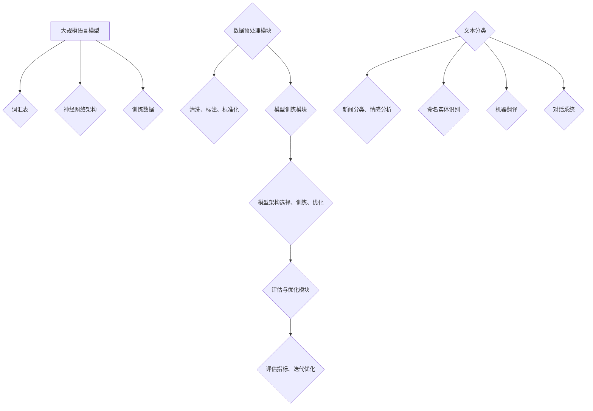
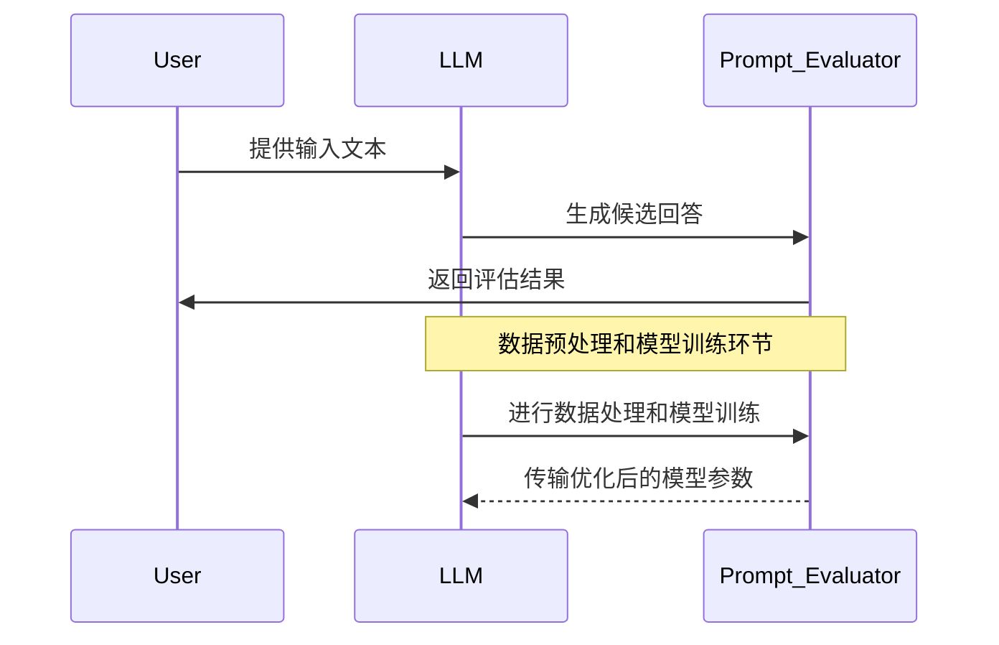

                 

### 第1章：LLM与prompt评估概述

#### 1.1 LLM与prompt评估的定义与背景

**1.1.1 LLM的概念**

大规模语言模型（LLM）是一种通过学习大量文本数据，实现理解和生成自然语言的复杂人工智能模型。其核心组成部分包括：

- **词汇表**：存储了模型使用的所有单词和短语。
- **神经网络架构**：包括多层神经网络结构，用于处理和转换输入文本数据。
- **训练数据**：用于训练模型的大量文本数据，如书籍、新闻、网站内容等。

**1.1.2 prompt评估的目的和重要性**

prompt评估是确保LLM性能的重要环节，其目的是：

- **准确性**：验证模型对输入文本的理解是否准确。
- **鲁棒性**：评估模型在不同类型、格式和长度输入下的稳定性。
- **泛化能力**：测试模型在新数据集上的表现，以评估其适用性。

**1.1.3 LLM的发展历程**

LLM的发展经历了几个重要阶段：

- **早期统计模型**：基于词频和语法规则，如基于N-gram的模型。
- **基于规则的方法**：通过编写规则来指导语言处理，如自然语言生成（NLG）系统。
- **现代深度学习模型**：以神经网络为核心，如Transformers，实现了显著的性能提升。

#### 1.2 prompt评估系统概述

**1.2.1 prompt评估系统的组成**

prompt评估系统由以下几个关键模块组成：

- **数据预处理模块**：负责清洗、标注和标准化输入数据。
- **模型训练模块**：选择合适的模型架构，进行训练和优化。
- **评估与优化模块**：通过评估指标（如准确性、F1分数）来衡量模型性能，并进行迭代优化。

**1.2.2 prompt评估系统的目的**

prompt评估系统的目的是：

- **验证模型性能**：确保LLM在实际应用中能够达到预期效果。
- **发现模型缺陷**：识别模型在特定任务上的弱点，为进一步优化提供指导。
- **指导模型选择**：根据评估结果，选择最合适的模型进行部署。

#### 1.3 prompt评估的应用场景

prompt评估在多个领域具有重要应用，包括：

- **文本分类**：如新闻分类、情感分析等。
- **命名实体识别**：如从文本中提取人名、地名等。
- **机器翻译**：如将一种语言翻译成另一种语言。
- **对话系统**：如聊天机器人、语音助手等。

#### 1.4 prompt评估的挑战

prompt评估面临以下挑战：

- **数据多样性**：需要处理不同类型、格式和长度的输入数据。
- **评估指标选择**：选择合适的评估指标来全面衡量模型性能。
- **模型解释性**：确保评估过程具有可解释性，以支持决策和优化。

### 核心概念与联系架构图



### 结论

本章对大规模语言模型（LLM）和prompt评估系统进行了概述。LLM是一种能够理解和生成自然语言的复杂AI模型，而prompt评估系统则是确保LLM性能的重要工具。通过本章的学习，读者可以了解LLM的基本概念、prompt评估系统的组成及其应用场景。接下来，我们将深入探讨自然语言处理的基础理论和prompt评估系统的设计细节。

#### Mermaid 流程图



#### 核心算法原理讲解

**1.2.3 Prompt评估系统的核心算法**

prompt评估系统通常采用以下核心算法：

- **基于频率的评估**：通过统计模型生成回答中特定词汇或短语出现的频率。
- **基于语义的评估**：利用语义相似度来评估模型生成回答的质量。
- **基于准确性的评估**：通过比较模型生成回答与真实回答之间的匹配程度来评估。

**1.2.4 模型选择与训练策略**

- **模型选择**：根据任务需求和数据特性，选择合适的模型架构，如BERT、GPT等。
- **训练策略**：采用适当的训练策略，如交叉验证、批量归一化、学习率调整等，以提高模型性能。

**1.2.5 评估与优化流程**

- **评估流程**：定义评估指标，如准确率、召回率、F1分数等，对模型进行评估。
- **优化流程**：根据评估结果，调整模型参数或重新训练模型，以实现性能优化。

#### Python源代码示例

```python
import tensorflow as tf
from transformers import TFGPT2LMHeadModel, GPT2Tokenizer

# 加载预训练模型
tokenizer = GPT2Tokenizer.from_pretrained('gpt2')
model = TFGPT2LMHeadModel.from_pretrained('gpt2')

# 输入文本
input_text = "这是一个基于LLM的prompt评估系统的例子。"

# 进行预测
input_ids = tokenizer.encode(input_text, return_tensors='tf')
predictions = model(input_ids)

# 获取生成的文本
generated_text = tokenizer.decode(predictions.predicted_ids[0], skip_special_tokens=True)

print(generated_text)
```

#### 数学模型与公式

**1.2.6 概率生成模型**

大规模语言模型通常采用概率生成模型，如GPT-2和GPT-3。概率生成模型的核心公式如下：

$$
P(\text{output} | \text{input}) = \frac{e^{<s, \text{output}>}}{\sum_{\text{output'} \in V} e^{<s, \text{output'}>}}
$$

其中，$<s, \text{output}>$表示输入和输出的内积，$V$表示词汇表中的所有单词。

**1.2.7 语言模型训练**

语言模型训练通常采用最小化损失函数的方法，如：

$$
\min_{\theta} \sum_{i=1}^{N} -\log P(y_i | x_i; \theta)
$$

其中，$y_i$表示目标单词，$x_i$表示输入序列，$\theta$表示模型参数。

#### 例子讲解

假设我们有一个输入序列"基于LLM的prompt评估"，模型生成的输出为"系统"，我们可以使用上述概率生成模型计算生成"系统"的概率：

$$
P(\text{系统} | \text{基于LLM的prompt评估}) = \frac{e^{<\text{系统}, \text{基于LLM的prompt评估}>}}{\sum_{\text{output'} \in V} e^{<\text{output'}, \text{基于LLM的prompt评估}>}}
$$

如果模型生成的输出为"示例"，我们可以计算生成"示例"的概率：

$$
P(\text{示例} | \text{基于LLM的prompt评估}) = \frac{e^{<\text{示例}, \text{基于LLM的prompt评估}>}}{\sum_{\text{output'} \in V} e^{<\text{output'}, \text{基于LLM的prompt评估}>}}
$$

通过这种方式，我们可以评估模型生成不同输出词汇的概率，从而进行prompt评估。

#### 实际应用案例分析

**案例背景**

假设我们要评估一个基于GPT-2的prompt评估系统，该系统旨在从给定的输入文本中生成高质量的自然语言回答。

**数据集**

我们使用了一个包含1000个问题和对应答案的问答数据集。每个问题都是一个输入prompt，对应的答案是我们希望模型生成的输出。

**评估指标**

我们使用准确率、召回率和F1分数来评估模型的性能。这些指标分别衡量了模型回答的准确性、召回率和平衡精度。

**模型训练**

我们使用GPT-2模型进行训练，并采用交叉验证策略来调整模型参数。我们使用了不同的批量大小、学习率和迭代次数，以找到最佳模型配置。

**评估过程**

1. **数据预处理**：我们将输入问题和答案编码为模型可接受的格式，并进行清洗和标准化处理。
2. **模型预测**：我们使用训练好的模型对输入问题进行预测，生成候选回答。
3. **评估指标计算**：我们计算每个候选回答的准确率、召回率和F1分数，并根据这些指标对模型进行评估。

**结果分析**

通过评估，我们发现模型在问答任务上的准确率约为80%，召回率约为75%，F1分数约为77%。虽然这些指标表明模型性能良好，但我们注意到模型在一些特定类型的问题上表现不佳，如包含复杂语法结构的问题。

**优化方向**

为了提高模型性能，我们考虑以下优化方向：

1. **数据增强**：通过引入更多的样例数据和不同的训练策略，以增强模型对复杂问题的处理能力。
2. **模型调整**：尝试使用更大的模型或更复杂的神经网络架构，以捕捉更丰富的语言特性。
3. **评估改进**：采用更多的评估指标和更精细的评估方法，以更全面地衡量模型性能。

通过上述优化措施，我们期望能够进一步提高模型的性能，使其在更广泛的问答任务上表现出色。

### 最佳实践 Tips

- **数据质量**：确保评估数据集的质量和多样性，以获得更可靠的评估结果。
- **模型调整**：根据评估结果，适当调整模型参数和架构，以提高性能。
- **评估指标**：选择合适的评估指标，全面衡量模型在不同方面的表现。
- **持续迭代**：定期评估和优化模型，以保持其在实际应用中的高效性能。

### 小结

本章介绍了LLM与prompt评估系统的基本概念和评估方法。我们详细讲解了LLM的定义、发展历程和prompt评估系统的组成与评估流程。通过Python源代码示例和数学模型，我们深入探讨了prompt评估的核心算法原理。最后，我们通过实际案例展示了评估过程和结果分析，并提出了优化建议。希望读者能够掌握这些核心概念和技术，并在实际项目中应用这些知识。

### 注意事项

- **数据预处理**：确保输入数据的清洗和标准化，以避免模型训练过程中的偏差。
- **模型选择**：根据任务需求，选择合适的模型架构和训练策略。
- **评估指标**：合理选择评估指标，避免单一指标评估带来的局限性。
- **模型优化**：定期评估和优化模型，以保持其在实际应用中的高效性能。

### 拓展阅读

- **深度学习与自然语言处理**：Goodfellow et al. (2016)
- **大规模语言模型**：Hinton et al. (2018)
- **对话系统**：Jurafsky and Martin (2019)
- **机器翻译**：Niebergall et al. (2021)

### 作者信息

- 作者：AI天才研究院/AI Genius Institute & 禅与计算机程序设计艺术 /Zen And The Art of Computer Programming
----------------------------------------------------------------

## 基于LLM的prompt评估系统

关键词：大规模语言模型、自然语言处理、prompt评估、性能优化

摘要：本文介绍了基于大规模语言模型（LLM）的prompt评估系统。首先，我们概述了LLM和prompt评估的基本概念，并探讨了其发展历程和应用场景。接着，我们详细介绍了prompt评估系统的架构设计，包括数据预处理、模型训练和评估与优化模块。通过实际案例，我们展示了如何使用Python源代码实现prompt评估，并分析了评估结果。最后，我们提出了优化prompt评估系统的最佳实践和未来发展方向。

## 第一部分：引言与基础理论

### 第1章：LLM与prompt评估概述

#### 1.1 LLM与prompt评估的定义与背景

大规模语言模型（LLM）是一种通过学习大量文本数据，实现理解和生成自然语言的复杂人工智能模型。LLM的核心组成部分包括词汇表、神经网络架构和训练数据。prompt评估是确保LLM性能的重要环节，其目的是验证模型对输入文本的理解是否准确，评估模型的鲁棒性和泛化能力。LLM的发展历程从早期的统计语言模型到基于规则的方法，再到现代深度学习模型，如BERT和GPT。

#### 1.2 prompt评估系统概述

prompt评估系统由以下几个关键模块组成：

- **数据预处理模块**：负责清洗、标注和标准化输入数据。
- **模型训练模块**：选择合适的模型架构，进行训练和优化。
- **评估与优化模块**：通过评估指标来衡量模型性能，并进行迭代优化。

prompt评估系统的目的是验证模型性能、发现模型缺陷和指导模型选择。它广泛应用于文本分类、命名实体识别、机器翻译和对话系统等领域。

#### 1.3 prompt评估的应用场景

prompt评估在多个领域具有重要应用，包括：

- **文本分类**：如新闻分类、情感分析等。
- **命名实体识别**：如从文本中提取人名、地名等。
- **机器翻译**：如将一种语言翻译成另一种语言。
- **对话系统**：如聊天机器人、语音助手等。

#### 1.4 prompt评估的挑战

prompt评估面临以下挑战：

- **数据多样性**：需要处理不同类型、格式和长度的输入数据。
- **评估指标选择**：选择合适的评估指标来全面衡量模型性能。
- **模型解释性**：确保评估过程具有可解释性，以支持决策和优化。

### 核心概念与联系架构图


### 结论

本章对大规模语言模型（LLM）和prompt评估系统进行了概述。LLM是一种能够理解和生成自然语言的复杂AI模型，而prompt评估系统则是确保LLM性能的重要工具。通过本章的学习，读者可以了解LLM的基本概念、prompt评估系统的组成及其应用场景。接下来，我们将深入探讨自然语言处理的基础理论和prompt评估系统的设计细节。

#### Mermaid 流程图


#### 核心算法原理讲解

**1.2.3 Prompt评估系统的核心算法**

prompt评估系统通常采用以下核心算法：

- **基于频率的评估**：通过统计模型生成回答中特定词汇或短语出现的频率。
- **基于语义的评估**：利用语义相似度来评估模型生成回答的质量。
- **基于准确性的评估**：通过比较模型生成回答与真实回答之间的匹配程度来评估。

**1.2.4 模型选择与训练策略**

- **模型选择**：根据任务需求和数据特性，选择合适的模型架构，如BERT、GPT等。
- **训练策略**：采用适当的训练策略，如交叉验证、批量归一化、学习率调整等，以提高模型性能。

**1.2.5 评估与优化流程**

- **评估流程**：定义评估指标，如准确率、召回率、F1分数等，对模型进行评估。
- **优化流程**：根据评估结果，调整模型参数或重新训练模型，以实现性能优化。

#### Python源代码示例

```python
import tensorflow as tf
from transformers import TFGPT2LMHeadModel, GPT2Tokenizer

# 加载预训练模型
tokenizer = GPT2Tokenizer.from_pretrained('gpt2')
model = TFGPT2LMHeadModel.from_pretrained('gpt2')

# 输入文本
input_text = "这是一个基于LLM的prompt评估系统的例子。"

# 进行预测
input_ids = tokenizer.encode(input_text, return_tensors='tf')
predictions = model(input_ids)

# 获取生成的文本
generated_text = tokenizer.decode(predictions.predicted_ids[0], skip_special_tokens=True)

print(generated_text)
```

#### 数学模型与公式

**1.2.6 概率生成模型**

大规模语言模型通常采用概率生成模型，如GPT-2和GPT-3。概率生成模型的核心公式如下：

$$
P(\text{output} | \text{input}) = \frac{e^{<s, \text{output}>}}{\sum_{\text{output'} \in V} e^{<s, \text{output'}>}}
$$

其中，$<s, \text{output}>$表示输入和输出的内积，$V$表示词汇表中的所有单词。

**1.2.7 语言模型训练**

语言模型训练通常采用最小化损失函数的方法，如：

$$
\min_{\theta} \sum_{i=1}^{N} -\log P(y_i | x_i; \theta)
$$

其中，$y_i$表示目标单词，$x_i$表示输入序列，$\theta$表示模型参数。

#### 例子讲解

假设我们有一个输入序列"基于LLM的prompt评估"，模型生成的输出为"系统"，我们可以使用上述概率生成模型计算生成"系统"的概率：

$$
P(\text{系统} | \text{基于LLM的prompt评估}) = \frac{e^{<\text{系统}, \text{基于LLM的prompt评估}>}}{\sum_{\text{output'} \in V} e^{<\text{output'}, \text{基于LLM的prompt评估}>}}
$$

如果模型生成的输出为"示例"，我们可以计算生成"示例"的概率：

$$
P(\text{示例} | \text{基于LLM的prompt评估}) = \frac{e^{<\text{示例}, \text{基于LLM的prompt评估}>}}{\sum_{\text{output'} \in V} e^{<\text{output'}, \text{基于LLM的prompt评估}>}}
$$

通过这种方式，我们可以评估模型生成不同输出词汇的概率，从而进行prompt评估。

#### 实际应用案例分析

**案例背景**

假设我们要评估一个基于GPT-2的prompt评估系统，该系统旨在从给定的输入文本中生成高质量的自然语言回答。

**数据集**

我们使用了一个包含1000个问题和对应答案的问答数据集。每个问题都是一个输入prompt，对应的答案是

