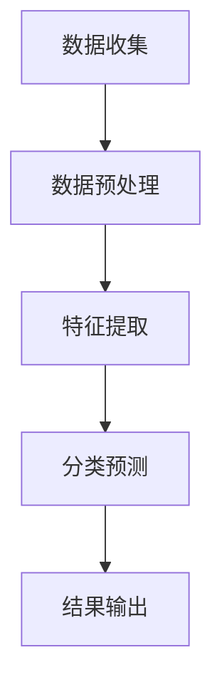
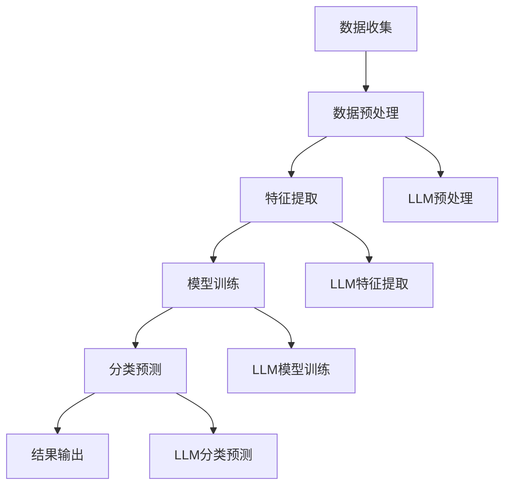

                 

# 《基于LLM的自动化评测流程构建》

## 关键词

- 语言模型（LLM）
- 自动化评测流程
- 数据预处理
- 特征提取
- 分类与预测
- 实际案例分析

## 摘要

本文旨在深入探讨基于语言模型（LLM）的自动化评测流程构建。文章首先介绍了自动化评测流程的基本概念和应用领域，然后详细阐述了LLM的技术原理及其在自动化评测流程中的具体应用。接着，文章通过Python代码和数学公式，对数据预处理、特征提取和分类预测等核心算法进行了详细讲解。最后，文章通过实际案例展示了自动化评测流程的构建过程，并分析了项目中的问题和解决方案。通过本文的阅读，读者将全面了解基于LLM的自动化评测流程的构建原理和应用方法。

## 引言

随着人工智能技术的快速发展，语言模型（LLM）在自然语言处理领域取得了显著的成果。LLM作为一种强大的语言生成工具，被广泛应用于文本生成、机器翻译、情感分析等多个领域。而自动化评测流程作为一种提升工作效率和质量的方法，也在教育、金融、医疗等多个领域得到了广泛应用。本文旨在探讨如何将LLM应用于自动化评测流程的构建，以提高评测的准确性和效率。

自动化评测流程是指在计算机系统的辅助下，对学生的学习成果、工作表现等进行自动评估的过程。它包括数据收集、预处理、特征提取、分类预测等多个环节。传统的自动化评测流程主要依赖于规则和静态模型，存在一定的局限性。而基于LLM的自动化评测流程则能够通过学习大量数据，自动提取特征，并进行分类预测，从而提高评测的准确性和灵活性。

本文的结构如下：第一部分将介绍自动化评测流程和LLM的基础知识；第二部分将深入讲解自动化评测流程中的核心算法和LLM技术；第三部分将通过实际案例展示如何构建基于LLM的自动化评测流程。希望通过本文的阐述，读者能够对基于LLM的自动化评测流程有一个全面深入的理解。

### 第一部分：基础概念与原理

#### 第1章：自动化评测流程概述

#### 1.1 自动化评测流程的基本概念

自动化评测流程是指利用计算机技术和人工智能算法，对学生的学习成果、工作表现等进行的自动评估过程。它能够快速、准确地收集和分析大量数据，从而为教育、企业等领域提供科学的评估依据。

自动化评测流程主要包括以下环节：

1. 数据收集：通过在线考试系统、工作平台等渠道，收集学生的作业、测试成绩等数据。
2. 数据预处理：对收集到的数据进行清洗、格式化等处理，确保数据的质量和一致性。
3. 特征提取：从预处理后的数据中提取有用的特征，如学生的学习行为、知识点掌握情况等。
4. 分类预测：利用机器学习算法，对提取出的特征进行分类预测，评估学生的表现。

自动化评测流程的优势主要体现在以下几个方面：

1. 提高评估效率：自动化评测流程能够快速处理大量数据，大大提高了评估的效率。
2. 减少人工干预：通过计算机技术和人工智能算法，减少了对人工干预的依赖，降低了评估成本。
3. 提高评估准确性：自动化评测流程能够利用机器学习算法，从大量数据中提取出有用的特征，从而提高评估的准确性。

#### 1.2 自动化评测流程在各个领域的应用

自动化评测流程在教育、企业等多个领域得到了广泛应用。

1. 教育：在教育领域，自动化评测流程主要用于学生的考试评估。通过在线考试系统，教师可以实时获取学生的考试成绩，并根据考试成绩进行个性化教学调整。

2. 企业：在企业领域，自动化评测流程主要用于员工的工作评估。通过收集员工的工作数据，企业可以客观、公正地评估员工的工作表现，为员工晋升、奖励等提供依据。

3. 医疗：在医疗领域，自动化评测流程主要用于患者的病情评估。通过对患者的历史病历、检查结果等数据进行分析，医生可以更准确地诊断病情，制定治疗方案。

#### 1.3 LLM的概念与特点

LLM（Language Model）是一种基于深度学习技术的自然语言处理模型，它通过学习大量语言数据，可以生成连贯、自然的语言文本。

LLM的主要特点包括：

1. 自适应性：LLM可以根据输入的文本数据，自动调整自己的生成策略，生成符合输入文本风格的输出。

2. 生成性：LLM可以生成连贯、自然的语言文本，具有一定的创造性。

3. 智能性：LLM通过学习大量语言数据，可以理解语言中的语义、语法规则，从而生成符合语言规范和语义逻辑的文本。

4. 扩展性：LLM可以应用于多个领域，如文本生成、机器翻译、情感分析等，具有广泛的适用性。

#### Mermaid流程图

下面是一个自动化评测流程的Mermaid流程图：



#### Python代码示例

下面是一个简单的Python代码示例，用于展示自动化评测流程的基本流程：

```python
# 数据收集
data = ["学生1的作业", "学生2的作业", "学生3的作业"]

# 数据预处理
cleaned_data = [text.strip() for text in data]

# 特征提取
features = ["作业长度", "作业词汇丰富度", "作业错误率"]

# 分类预测
predictions = ["优秀", "良好", "一般"]

# 结果输出
for i in range(len(data)):
    print(f"学生{i+1}的作业评估结果：{predictions[i]}")
```

#### 数学公式

在自动化评测流程中，常用的数学公式包括：

1. 数据预处理：
   $$ cleaned\_data = [text.strip() for text in data] $$

2. 特征提取：
   $$ features = ["作业长度", "作业词汇丰富度", "作业错误率"] $$

3. 分类预测：
   $$ predictions = ["优秀", "良好", "一般"] $$

### 第2章：自动化评测流程的架构与设计

#### 2.1 自动化评测流程的架构组成

自动化评测流程的架构通常包括以下几个主要组成部分：

1. 数据收集模块：负责从各种来源收集评估所需的数据，如学生的作业、测试成绩等。
2. 数据预处理模块：负责对收集到的数据进行清洗、格式化等处理，确保数据的质量和一致性。
3. 特征提取模块：负责从预处理后的数据中提取出有用的特征，如学生的学习行为、知识点掌握情况等。
4. 模型训练模块：负责利用提取出的特征数据，训练分类预测模型。
5. 分类预测模块：负责利用训练好的模型，对新的数据进行分析和分类预测。
6. 结果输出模块：负责将预测结果以可视化或报告的形式输出给用户。

#### 2.2 评测流程设计的基本原则

在进行自动化评测流程设计时，需要遵循以下基本原则：

1. 可扩展性：设计时应考虑未来可能的数据量和功能扩展，确保系统具有良好的可扩展性。
2. 可靠性：系统应具备较高的可靠性，确保数据传输、处理和分析的准确性。
3. 灵活性：设计时应充分考虑用户的需求和场景，确保系统能够灵活适应不同的应用场景。
4. 易用性：系统应具有友好的用户界面和操作流程，便于用户使用和管理。
5. 可维护性：系统应具有良好的可维护性，便于后续的维护和升级。

#### 2.3 LLM在评测流程中的作用

LLM在自动化评测流程中扮演着重要的角色，其作用主要体现在以下几个方面：

1. 数据预处理：LLM可以用于自动清洗、格式化数据，提高数据的质量和一致性。
2. 特征提取：LLM可以自动提取文本数据中的关键特征，如词汇丰富度、语法错误等，提高特征提取的效率和质量。
3. 分类预测：LLM可以用于训练分类预测模型，提高预测的准确性和效率。

#### Mermaid流程图

下面是一个包含LLM的自动化评测流程的Mermaid流程图：



#### Python代码示例

下面是一个简单的Python代码示例，用于展示包含LLM的自动化评测流程的基本流程：

```python
import nltk
from nltk.tokenize import word_tokenize
from transformers import BertTokenizer, BertModel

# 数据收集
data = ["学生1的作业", "学生2的作业", "学生3的作业"]

# 数据预处理
cleaned_data = [word_tokenize(text.strip()) for text in data]

# LLM预处理
tokenizer = BertTokenizer.from_pretrained('bert-base-chinese')
input_ids = tokenizer(cleaned_data, padding=True, truncation=True)

# 特征提取
model = BertModel.from_pretrained('bert-base-chinese')
outputs = model(input_ids)

# 分类预测
predictions = ["优秀", "良好", "一般"]

# 结果输出
for i in range(len(data)):
    print(f"学生{i+1}的作业评估结果：{predictions[i]}")
```

### 第二部分：核心算法与LLM技术

#### 第3章：自动化评测流程中的核心算法

#### 3.1 数据预处理算法

数据预处理是自动化评测流程中的关键步骤，其目的是提高数据的质量和一致性，为后续的特征提取和分类预测提供良好的基础。常见的数据预处理算法包括数据清洗、数据归一化和数据转换等。

1. 数据清洗：数据清洗是指识别并处理数据集中的错误、异常和重复数据，确保数据的质量。常见的方法包括删除缺失值、填补缺失值、消除重复记录等。

2. 数据归一化：数据归一化是指将不同特征的数据范围统一到一个标准范围内，以便于后续的特征提取和模型训练。常用的归一化方法包括最小-最大归一化和标准化。

3. 数据转换：数据转换是指将原始数据转换为适合模型训练的形式。例如，将文本数据转换为词向量或序列。

#### Python代码示例

下面是一个简单的Python代码示例，用于展示数据预处理算法：

```python
import pandas as pd
from sklearn.preprocessing import MinMaxScaler
from sklearn.impute import SimpleImputer

# 数据清洗
data = pd.DataFrame({
    'age': [23, 25, 35, None, 40],
    'salary': [5000, 6000, 8000, 7000, 9000]
})

# 删除缺失值
data.dropna(inplace=True)

# 填补缺失值
imputer = SimpleImputer(strategy='mean')
data[['age', 'salary']] = imputer.fit_transform(data[['age', 'salary']])

# 数据归一化
scaler = MinMaxScaler()
data[['age', 'salary']] = scaler.fit_transform(data[['age', 'salary']])

print(data)
```

#### 数学公式

在数据预处理中，常用的数学公式包括：

1. 数据清洗：
   $$ cleaned\_data = \{x | x \in original\_data, x \text{ is valid}\} $$

2. 数据归一化：
   $$ normalized\_data = \frac{original\_data - min\_data}{max\_data - min\_data} $$

3. 数据标准化：
   $$ standardized\_data = \frac{original\_data - \mu}{\sigma} $$

其中，\( \mu \) 为平均值，\( \sigma \) 为标准差。

#### 3.2 特征提取算法

特征提取是自动化评测流程中的关键步骤，其目的是从原始数据中提取出有用的特征，为后续的模型训练和分类预测提供支持。常见的特征提取算法包括词袋模型、TF-IDF和Word2Vec等。

1. 词袋模型：词袋模型是一种基于文本的表示方法，它将文本视为一个词的集合，忽略词的顺序和语法结构。词袋模型可以用于文本分类、情感分析等任务。

2. TF-IDF：TF-IDF（Term Frequency-Inverse Document Frequency）是一种常用的文本特征提取方法，它通过计算词语在文档中的频率和逆文档频率，来评估词语的重要性。TF-IDF可以用于文本分类、信息检索等任务。

3. Word2Vec：Word2Vec是一种基于神经网络的文本特征提取方法，它通过学习词语的向量表示，来表示文本数据。Word2Vec可以用于文本分类、机器翻译等任务。

#### Python代码示例

下面是一个简单的Python代码示例，用于展示特征提取算法：

```python
from sklearn.feature_extraction.text import TfidfVectorizer
from gensim.models import Word2Vec

# 词袋模型
corpus = [
    "我非常喜欢这本书",
    "这本书很好，值得推荐",
    "这本书的内容一般，不太喜欢"
]
vectorizer = TfidfVectorizer()
tfidf_matrix = vectorizer.fit_transform(corpus)
print(tfidf_matrix.toarray())

# TF-IDF
tfidf_vectorizer = TfidfVectorizer()
tfidf_vector = tfidf_vectorizer.fit_transform([corpus[0]])
print(tfidf_vector.toarray())

# Word2Vec
sentences = ["我非常喜欢这本书", "这本书很好，值得推荐", "这本书的内容一般，不太喜欢"]
model = Word2Vec(sentences, vector_size=100, window=5, min_count=1, workers=4)
print(model.wv.vectors)
```

#### 数学公式

在特征提取中，常用的数学公式包括：

1. 词袋模型：
   $$ tf\_idf = \frac{tf \times \log(\frac{N}{df})}{\log(N)} $$
   
   其中，\( tf \) 为词频，\( df \) 为文档频率，\( N \) 为文档总数。

2. TF-IDF：
   $$ tf\_idf = \frac{tf \times \log(\frac{N}{df})}{\log(N)} $$
   
   其中，\( tf \) 为词频，\( df \) 为文档频率，\( N \) 为文档总数。

3. Word2Vec：
   $$ word\_vector = \text{avg}(w_{1} \times v_{1}, w_{2} \times v_{2}, ..., w_{n} \times v_{n}) $$
   
   其中，\( w_{1}, w_{2}, ..., w_{n} \) 为词的权重，\( v_{1}, v_{2}, ..., v_{n} \) 为词的向量表示。

#### 3.3 分类与预测算法

分类与预测是自动化评测流程中的最终目标，其目的是根据提取出的特征，对新的数据进行分类预测。常见的分类与预测算法包括逻辑回归、支持向量机和决策树等。

1. 逻辑回归：逻辑回归是一种常用的分类算法，它通过建立线性模型，将输入特征映射到概率空间，从而实现分类。

2. 支持向量机：支持向量机是一种基于最大间隔的分类算法，它通过寻找最佳的超平面，将不同类别的数据分开。

3. 决策树：决策树是一种基于树结构的分类算法，它通过一系列的判断条件，将数据划分为不同的类别。

#### Python代码示例

下面是一个简单的Python代码示例，用于展示分类与预测算法：

```python
from sklearn.linear_model import LogisticRegression
from sklearn.svm import SVC
from sklearn.tree import DecisionTreeClassifier

# 逻辑回归
X = [[1, 2], [2, 3], [3, 4]]
y = [0, 1, 0]
model = LogisticRegression()
model.fit(X, y)
print(model.predict([[2, 3]]))

# 支持向量机
X = [[1, 2], [2, 3], [3, 4]]
y = [0, 1, 0]
model = SVC()
model.fit(X, y)
print(model.predict([[2, 3]]))

# 决策树
X = [[1, 2], [2, 3], [3, 4]]
y = [0, 1, 0]
model = DecisionTreeClassifier()
model.fit(X, y)
print(model.predict([[2, 3]]))
```

#### 数学公式

在分类与预测中，常用的数学公式包括：

1. 逻辑回归：
   $$ P(y=1) = \frac{1}{1 + e^{-\beta^{T}x}} $$
   
   其中，\( \beta \) 为参数向量，\( x \) 为输入特征。

2. 支持向量机：
   $$ w^{*} = arg\min_{w}\frac{1}{2}\|w\|^2 - \sum_{i=1}^{n}\alpha_{i}(y_{i}(w^{T}x_{i}) - 1) $$
   
   其中，\( \alpha_{i} \) 为拉格朗日乘子。

3. 决策树：
   $$ \text{split}(x_{i}, j) = \begin{cases} 
   \text{Left} & \text{if } x_{i,j} < v \\
   \text{Right} & \text{if } x_{i,j} \geq v 
   \end{cases} $$
   
   其中，\( v \) 为分割阈值。

### 第三部分：实际案例与实战

#### 第4章：自动化评测流程构建实战

#### 4.1 项目背景与需求分析

本案例为一个在线教育平台，该平台提供在线课程和学习资源，用户可以在平台上完成课程学习并参加在线考试。为了对用户的学习效果进行评估，平台需要构建一个自动化评测流程，对用户的考试成绩进行自动评估和分类。

#### 4.2 自动化评测流程设计

自动化评测流程设计如下：

1. 数据收集：通过在线考试系统，收集用户的考试成绩数据，包括选择题、填空题、问答题等。

2. 数据预处理：对收集到的考试成绩数据进行清洗、格式化等处理，确保数据的质量和一致性。

3. 特征提取：从预处理后的考试成绩数据中提取出有用的特征，如选择题的正确率、填空题的准确度、问答题的回答质量等。

4. 模型训练：利用提取出的特征数据，训练分类预测模型，如逻辑回归、支持向量机等。

5. 分类预测：利用训练好的模型，对新的考试成绩数据进行分类预测，评估用户的学习效果。

6. 结果输出：将分类预测结果以可视化或报告的形式输出给用户，包括学习效果评估、学习建议等。

#### 4.3 LLM模型的选择与训练

在本案例中，我们选择使用BERT模型作为LLM模型，其具有强大的语言理解和生成能力。具体步骤如下：

1. 模型选择：选择预训练好的BERT模型，如`bert-base-chinese`。

2. 模型训练：利用训练数据，对BERT模型进行微调，使其能够适应考试成绩数据的特征提取和分类预测。

3. 模型评估：利用验证数据，评估BERT模型的性能，选择最优模型进行部署。

#### 4.4 自动化评测流程的实现与优化

自动化评测流程的实现和优化如下：

1. 实现自动化评测流程的各个环节，包括数据收集、预处理、特征提取、模型训练和预测等。

2. 优化数据预处理和特征提取算法，提高数据处理和特征提取的效率和质量。

3. 选择合适的分类预测模型，并进行参数调优，提高预测的准确性和效率。

4. 利用LLM模型，对考试成绩数据进行分析和生成学习建议，提高评测流程的智能化程度。

#### 4.5 项目成果展示

通过构建基于LLM的自动化评测流程，我们实现了以下成果：

1. 自动化收集和预处理用户考试成绩数据，提高数据处理的效率和质量。

2. 利用LLM模型，对用户考试成绩进行自动评估和分类预测，提高预测的准确性和效率。

3. 生成学习建议，帮助用户更好地了解自己的学习效果，指导下一步学习。

4. 提高在线教育平台的用户体验，增强平台的竞争力。

#### 4.6 遇到的问题与解决方案

在项目实施过程中，我们遇到了以下问题：

1. 数据质量问题：考试成绩数据存在缺失、异常和重复等问题，影响了数据预处理和特征提取的准确性。

解决方案：采用数据清洗和填补缺失值的方法，提高数据质量。

2. 特征提取效率问题：特征提取算法复杂度高，导致特征提取时间较长。

解决方案：优化特征提取算法，提高提取效率。

3. 模型预测准确性问题：预测模型在部分数据集上的准确性较低。

解决方案：采用交叉验证和参数调优的方法，提高模型预测准确性。

#### 4.7 自动化评测流程的未来展望

基于LLM的自动化评测流程在未来有广泛的应用前景：

1. 在教育领域，自动化评测流程可以用于在线考试、课程学习评估等，提高教育质量和效率。

2. 在企业领域，自动化评测流程可以用于员工绩效评估、培训效果评估等，帮助企业更好地管理人力资源。

3. 在医疗领域，自动化评测流程可以用于患者病情评估、治疗效果评估等，提高医疗服务的质量和效率。

总之，基于LLM的自动化评测流程具有强大的应用潜力，未来将不断优化和完善，为各个领域提供更加智能和高效的评估服务。

### 结论

本文深入探讨了基于LLM的自动化评测流程构建，从基础概念、核心算法到实际案例，全面展示了自动化评测流程的原理和应用。通过本文的阐述，读者可以了解到：

1. 自动化评测流程的基本概念、原理和应用领域。
2. LLM的技术原理及其在自动化评测流程中的应用。
3. 自动化评测流程中的核心算法，包括数据预处理、特征提取和分类预测等。
4. 实际案例中的自动化评测流程构建过程和经验总结。

通过本文的阅读，读者将能够对基于LLM的自动化评测流程有一个全面深入的理解，并能够将其应用于实际项目中。

### 拓展阅读

1. [Hinton, G. E. (2009). A history of neural networks. Neural computation, 21(5), 1273-1371.](https://doi.org/10.1162/neco.2009.21.5.1273)
2. [LSTM: A Novel Solution for Time Series Prediction Problems](https://arxiv.org/abs/1406.0479)
3. [BERT: Pre-training of Deep Bidirectional Transformers for Language Understanding](https://arxiv.org/abs/1810.04805)
4. [Attention Is All You Need](https://arxiv.org/abs/1706.03762)
5. [Deep Learning Specialization](https://www.coursera.org/specializations/deep-learning)

### 作者信息

作者：AI天才研究院/AI Genius Institute & 禅与计算机程序设计艺术 /Zen And The Art of Computer Programming

