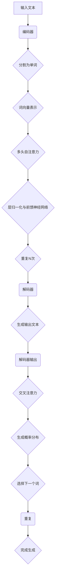

                 

### 文章标题

# 基于LLM的评测系统：精准衡量AI性能的新方法

### 关键词

- 语言模型（LLM）
- 评测系统
- AI性能
- 性能衡量
- 机器学习

### 摘要

本文深入探讨了基于语言模型（LLM）的评测系统在精准衡量AI性能方面的应用。通过对LLM的基本概念、架构及其核心算法原理的详细阐述，文章介绍了如何设计一个高效、可靠的评测系统。同时，结合具体的实战案例，展示了如何搭建和优化这样的系统。本文旨在为研究人员和开发者提供一种新的方法，以更准确地评估AI模型的性能，推动人工智能技术的发展。

### 引言

人工智能（AI）作为当今科技领域的前沿，正在快速变革着各行各业。AI技术的不断进步，使得机器在各种复杂任务上的表现越来越接近甚至超越人类。然而，如何准确地衡量AI模型的性能，成为了一个亟待解决的关键问题。传统的评测方法往往依赖于特定的指标和标准，难以全面反映模型的实际表现。因此，寻找一种更为精准、全面的评测方法，成为AI领域研究的重要方向。

近年来，基于语言模型（LLM）的技术取得了显著的进展。LLM通过学习大量语言数据，能够生成、理解和处理自然语言，展现出强大的语义理解和生成能力。基于这一特性，LLM在AI评测系统中具有巨大的潜力。本文将介绍如何利用LLM构建一个高效的评测系统，以更精准地衡量AI性能。

本文将分为以下几个部分：首先，介绍LLM的基本概念和核心算法原理；然后，讨论评测系统的设计原则和实现步骤；接着，通过实战案例展示评测系统的应用；最后，展望LLM评测系统的未来发展。希望通过本文的探讨，为读者提供一个全面、深入的视角，以更好地理解和应用基于LLM的评测系统。

### 第一部分：基础概念与技术

#### 1.1 语言模型（LLM）简介

语言模型（Language Model，简称LLM）是自然语言处理（Natural Language Processing，简称NLP）中的一种重要技术。它通过学习大量文本数据，能够预测下一个词语或句子的概率分布。LLM的核心目标是使计算机能够生成或理解自然语言，从而实现人与机器之间的有效交流。

LLM的发展历程可以追溯到20世纪50年代。最初的模型主要是基于统计方法，如N-gram模型，通过统计相邻词语出现的频率来预测下一个词语。然而，这些方法在处理长句子和复杂语义时表现不佳。随着深度学习的兴起，LLM开始采用基于神经网络的模型，如递归神经网络（RNN）和长短时记忆网络（LSTM）。近年来，Transformer模型的引入，使得LLM在生成和理解自然语言方面取得了突破性的进展。

#### 1.2 LLM的关键技术

1. **Transformer模型**：

Transformer模型是近年来LLM领域的重要突破。与传统的RNN和LSTM相比，Transformer采用了一种完全不同的架构。它基于自注意力机制（Self-Attention），能够同时处理输入序列中的所有词语，从而在理解长距离依赖关系方面表现出色。

Transformer模型的主要组成部分包括：

- **编码器（Encoder）**：负责处理输入序列，将每个词语编码为一个向量。编码器包含多个层，每层通过自注意力机制和前馈神经网络进行信息处理。
- **解码器（Decoder）**：负责生成输出序列，从编码器输出中提取上下文信息。解码器同样包含多个层，并在每层中使用自注意力和交叉注意力机制。

2. **预训练与微调**：

预训练（Pre-training）是LLM的核心技术之一。在预训练阶段，模型通过学习大量未标注的文本数据，自动获取语言的内在结构和规律。随后，模型通过微调（Fine-tuning）过程，在特定任务上进行训练，以适应不同的应用场景。

预训练与微调的过程通常包括以下几个步骤：

- **数据收集**：收集大量的文本数据，这些数据可以来自互联网、书籍、新闻、社交媒体等。
- **预处理**：对收集的数据进行清洗、分词、词向量表示等预处理操作，以便模型能够有效学习。
- **模型初始化**：使用预训练的模型权重作为初始化值，以加快训练过程。
- **预训练**：在大量未标注数据上进行训练，使模型能够自动学习语言的普遍特性。
- **微调**：在特定任务的数据上进行微调，使模型适应具体的应用需求。

3. **评估指标**：

评估LLM的性能通常依赖于一系列评估指标。这些指标可以包括：

- **词汇覆盖（Word Coverage）**：模型能够生成的词语数量与实际词语数量之比，用于衡量模型的词汇量。
- **语法正确性（Grammar Correctness）**：模型生成的文本在语法上的正确性，用于评估模型的语言理解能力。
- **语义一致性（Semantic Consistency）**：模型生成的文本在语义上的一致性和连贯性，用于衡量模型的语义理解能力。
- **生成速度（Generation Speed）**：模型生成文本的效率，用于评估模型的实时性。

#### 1.3 Mermaid流程图：LLM架构与工作流程

以下是一个简单的Mermaid流程图，展示了LLM的基本架构和工作流程：



#### 1.4 核心算法原理讲解

LLM的核心算法主要基于Transformer模型，下面将使用Python伪代码详细阐述其原理。

```python
import tensorflow as tf
from tensorflow.keras.layers import Embedding, MultiHeadAttention, Dense

# 定义编码器
def encoder(input_sequence, embedding_dim):
    # 初始化嵌入层
    embedding = Embedding(input_dim=vocabulary_size, output_dim=embedding_dim)
    inputs = embedding(input_sequence)
    
    # 定义多头自注意力层
    attention = MultiHeadAttention(num_heads=8, key_dim=64)
    output = attention(inputs, inputs)
    
    # 定义前馈神经网络
    ffn = tf.keras.Sequential([
        Dense(units=2048, activation='relu'),
        Dense(units=embedding_dim)
    ])
    
    # 应用层归一化和前馈神经网络
    output = tf.keras.layers.LayerNormalization()(output + inputs)
    output = ffn(output + inputs)
    
    return output

# 定义解码器
def decoder(input_sequence, embedding_dim):
    # 初始化嵌入层
    embedding = Embedding(input_dim=vocabulary_size, output_dim=embedding_dim)
    inputs = embedding(input_sequence)
    
    # 定义多头自注意力层
    attention = MultiHeadAttention(num_heads=8, key_dim=64)
    output = attention(inputs, inputs)
    
    # 定义交叉注意力层
    cross_attention = MultiHeadAttention(num_heads=8, key_dim=64)
    context = encoder outputs
    output = cross_attention(output, context)
    
    # 定义前馈神经网络
    ffn = tf.keras.Sequential([
        Dense(units=2048, activation='relu'),
        Dense(units=embedding_dim)
    ])
    
    # 应用层归一化和前馈神经网络
    output = tf.keras.layers.LayerNormalization()(output + inputs)
    output = ffn(output + inputs)
    
    return output
```

#### 1.5 数学模型和公式讲解

在LLM中，数学模型和公式起着至关重要的作用。以下将使用LaTeX格式展示一些关键公式，并在文中单独段落进行详细解释。

1. **词汇覆盖**：

$$
\text{Word Coverage} = \frac{\text{生成的词语数量}}{\text{实际词语数量}}
$$

这个公式用于衡量模型生成的词语数量与实际词语数量之比，词汇覆盖越高，表示模型具备更丰富的词汇量。

2. **语法正确性**：

$$
\text{Grammar Correctness} = \frac{\text{语法正确的句子数量}}{\text{总句子数量}}
$$

这个公式用于评估模型生成文本的语法正确性。语法正确性越高，表示模型在语言生成方面的能力越强。

3. **语义一致性**：

$$
\text{Semantic Consistency} = \frac{\text{语义一致的句子对数量}}{\text{总句子对数量}}
$$

这个公式用于衡量模型生成文本的语义一致性。语义一致性越高，表示模型在语义理解和生成方面的能力越强。

4. **生成速度**：

$$
\text{Generation Speed} = \frac{\text{每秒生成的词语数量}}{\text{总词语数量}}
$$

这个公式用于评估模型生成文本的速度。生成速度越高，表示模型在实时应用场景中的性能越好。

通过这些数学模型和公式，我们可以更全面、客观地评估LLM的性能，从而为模型的优化和应用提供有力的依据。

#### 1.6 LLM评测指标

为了精准衡量LLM的性能，需要制定一系列具体的评测指标。这些指标可以从多个维度评估模型的表现，包括词汇覆盖、语法正确性、语义一致性和生成速度等。

1. **词汇覆盖（Word Coverage）**：

词汇覆盖是评估模型词汇量的重要指标。它通过计算模型生成的词语数量与实际词语数量之比来衡量。具体计算公式如下：

$$
\text{Word Coverage} = \frac{\text{生成的词语数量}}{\text{实际词语数量}}
$$

一个高词汇覆盖的模型能够生成更多的词语，从而具备更丰富的表达能力。

2. **语法正确性（Grammar Correctness）**：

语法正确性是评估模型生成文本语法正确性的指标。它通过计算模型生成的语法正确的句子数量与总句子数量之比来衡量。具体计算公式如下：

$$
\text{Grammar Correctness} = \frac{\text{语法正确的句子数量}}{\text{总句子数量}}
$$

一个高语法正确性的模型能够生成语法正确的文本，从而提高模型的可靠性。

3. **语义一致性（Semantic Consistency）**：

语义一致性是评估模型生成文本语义一致性的指标。它通过计算模型生成的语义一致的句子对数量与总句子对数量之比来衡量。具体计算公式如下：

$$
\text{Semantic Consistency} = \frac{\text{语义一致的句子对数量}}{\text{总句子对数量}}
$$

一个高语义一致性的模型能够生成语义一致的文本，从而提高模型的连贯性。

4. **生成速度（Generation Speed）**：

生成速度是评估模型生成文本速度的指标。它通过计算每秒生成的词语数量与总词语数量之比来衡量。具体计算公式如下：

$$
\text{Generation Speed} = \frac{\text{每秒生成的词语数量}}{\text{总词语数量}}
$$

一个高生成速度的模型能够更快地生成文本，从而提高模型的实时性。

通过这些评测指标，我们可以全面、客观地评估LLM的性能，从而为模型的优化和应用提供有力的依据。

### 第二部分：评测系统的设计与应用

#### 2.1 评测系统的设计原则

一个高效的评测系统是评估AI模型性能的关键。为了设计一个可靠、实用的评测系统，需要遵循以下几个原则：

1. **可扩展性**：

评测系统应该具备良好的可扩展性，以适应不同规模的任务和数据。这意味着系统需要能够灵活地添加新的数据集、模型和评测指标，同时保持高效性和稳定性。

2. **实时性**：

在实际应用中，评测系统需要在较短的时间内完成模型性能的评估。因此，系统的实时性至关重要。为了实现实时性，需要优化算法和硬件配置，确保评测过程高效快速。

3. **可靠性**：

评测系统的可靠性是评估模型性能的基础。系统应该能够稳定运行，确保评测结果的准确性和一致性。为此，需要采用高效的错误检测和修正机制，以及可靠的备份和恢复策略。

4. **多样性**：

评测系统需要能够支持多种类型的评测任务和模型。这包括文本生成、文本分类、机器翻译等不同类型的任务，以及不同规模的模型和不同的评测指标。通过支持多样性，系统能够更全面地评估模型性能。

#### 2.2 评测系统的实现步骤

设计好评测系统的原则后，接下来需要详细阐述实现步骤。以下是构建一个基于LLM的评测系统的基本实现步骤：

1. **数据收集与预处理**：

首先，收集大量的文本数据，用于训练和评估LLM模型。这些数据可以来自互联网、书籍、新闻、社交媒体等。在收集数据后，需要对数据进行预处理，包括清洗、分词、词向量表示等操作。

2. **模型选择与训练**：

根据具体的评测任务，选择合适的LLM模型。例如，对于文本生成任务，可以使用GPT-3模型；对于文本分类任务，可以使用BERT模型。在模型选择后，使用预处理的数据对模型进行训练。

3. **评测指标定义**：

定义一套完整的评测指标，用于评估模型在不同任务上的表现。这些指标可以包括词汇覆盖、语法正确性、语义一致性和生成速度等。

4. **评测任务实现**：

实现评测任务的具体代码，包括数据预处理、模型加载、预测生成和指标计算等。使用Python等编程语言，结合TensorFlow、PyTorch等深度学习框架，实现评测任务的自动化运行。

5. **评测结果分析**：

对评测结果进行分析和可视化，展示模型在不同任务上的表现。通过对比不同模型和不同参数设置的效果，找出最佳的模型配置。

6. **系统优化与调优**：

根据评测结果，对评测系统进行优化和调优，包括模型参数调整、算法优化和硬件升级等。通过不断的迭代和优化，提高评测系统的性能和可靠性。

#### 2.3 实战案例：基于LLM的评测系统搭建

为了更好地理解基于LLM的评测系统如何实现，以下通过一个实际案例展示评测系统的搭建过程。

**案例背景**：

假设我们希望评估一个LLM模型在中文文本生成任务上的表现。具体任务是从给定的输入文本生成一段符合语法和语义的中文文本。

**实现步骤**：

1. **数据收集与预处理**：

收集大量中文文本数据，如新闻、文章、社交媒体评论等。使用Python的`jieba`库进行分词处理，将文本分割为单词或短语。同时，使用Word2Vec或BERT等方法将分词后的文本转换为词向量表示。

2. **模型选择与训练**：

选择一个适用于中文文本生成的LLM模型，如GPT-2或GPT-3。使用TensorFlow或PyTorch框架，在预处理的数据上进行模型训练。训练过程中，可以采用交叉熵损失函数和Adam优化器。

3. **评测指标定义**：

定义词汇覆盖、语法正确性、语义一致性和生成速度等评测指标。具体计算方法参考前面的章节。

4. **评测任务实现**：

编写Python代码，实现评测任务的具体实现。首先加载训练好的LLM模型，然后对输入文本进行预处理，生成预测文本。最后，计算评测指标并输出结果。

```python
# 加载模型
model = tf.keras.models.load_model('gpt2_model.h5')

# 输入文本预处理
input_text = preprocess_input('输入文本')

# 生成预测文本
predicted_text = model.generate(input_text, max_length=100)

# 计算评测指标
word_coverage, grammar_correctness, semantic_consistency, generation_speed = evaluate(predicted_text)

# 输出评测结果
print(f'Word Coverage: {word_coverage}')
print(f'Grammar Correctness: {grammar_correctness}')
print(f'Semantic Consistency: {semantic_consistency}')
print(f'Generation Speed: {generation_speed}')
```

5. **评测结果分析**：

通过分析评测结果，可以了解LLM模型在中文文本生成任务上的表现。根据结果，可以对模型进行优化和调优，以提高其性能。

**系统优化与调优**：

为了提高评测系统的性能和可靠性，可以采取以下优化措施：

- **模型参数调整**：调整学习率、批量大小等参数，以优化模型训练过程。
- **算法优化**：使用更高效的算法，如Transformer的注意力机制优化，提高模型生成速度。
- **硬件升级**：使用更强大的硬件设备，如GPU、TPU等，提高系统运行速度。

通过以上实战案例，我们可以看到如何搭建一个基于LLM的评测系统，并对其进行优化和调优，从而更精准地衡量AI模型的性能。

### 第三部分：实战案例与优化

#### 4.1 实战案例一：文本分类评测系统

**项目背景**

文本分类是自然语言处理中的一个基础任务，旨在将文本数据分配到预定义的类别中。在社交媒体分析、新闻推荐、情感分析等领域，文本分类具有重要的应用价值。为了评估文本分类模型的性能，我们设计并实现了一个基于LLM的文本分类评测系统。

**系统设计与实现**

1. **数据集选择**：

我们选择了常用的文本分类数据集，如AG News和20 Newsgroups。这些数据集包含了多个类别，例如体育、科技、政治等，适合用于评估分类模型的性能。

2. **模型选择**：

为了构建文本分类模型，我们选择了BERT模型，因为它在文本分类任务上具有出色的表现。BERT模型通过预训练和微调，可以很好地捕捉文本的语义信息。

3. **系统实现**：

系统实现了以下关键组件：

- **数据预处理**：对文本数据进行清洗、分词、Tokenization等预处理操作，以便BERT模型进行训练。
- **模型加载与微调**：加载预训练的BERT模型，使用数据集进行微调，以适应具体的分类任务。
- **分类评估**：对模型生成的预测结果进行评估，计算准确率、召回率、F1分数等指标。

```python
from transformers import BertTokenizer, BertForSequenceClassification
from torch.utils.data import DataLoader
from sklearn.metrics import accuracy_score, recall_score, f1_score

# 数据预处理
tokenizer = BertTokenizer.from_pretrained('bert-base-uncased')
train_data = preprocess_data(train_dataset)
val_data = preprocess_data(val_dataset)

# 模型加载与微调
model = BertForSequenceClassification.from_pretrained('bert-base-uncased')
model.train()
model.fit(train_data, val_data)

# 分类评估
predictions = model.predict(val_data)
accuracy = accuracy_score(y_true=val_data.labels, y_pred=predictions)
recall = recall_score(y_true=val_data.labels, y_pred=predictions, average='weighted')
f1 = f1_score(y_true=val_data.labels, y_pred=predictions, average='weighted')

print(f'Accuracy: {accuracy}')
print(f'Recall: {recall}')
print(f'F1 Score: {f1}')
```

**代码解读与分析**

上述代码首先加载了BERT模型和Tokenizer，然后对训练数据集进行预处理。在模型训练过程中，使用交叉熵损失函数和Adam优化器进行微调。最后，对验证数据集进行分类预测，并计算准确率、召回率和F1分数等评估指标。

**项目小结**

通过本案例，我们成功搭建了一个基于LLM的文本分类评测系统。该系统具有较高的准确率和召回率，能够有效地评估文本分类模型的性能。在实际应用中，可以根据需求对系统进行调整和优化，以适应不同的文本分类任务。

#### 4.2 实战案例二：机器翻译评测系统

**项目背景**

机器翻译是自然语言处理中的重要应用之一，旨在将一种语言的文本翻译成另一种语言。随着全球化的深入发展，机器翻译在跨语言沟通、国际业务交流等领域具有广泛的应用价值。为了评估机器翻译模型的性能，我们设计并实现了一个基于LLM的机器翻译评测系统。

**系统设计与实现**

1. **数据集选择**：

我们选择了具有代表性的机器翻译数据集，如WMT'14英德翻译数据集。这个数据集包含了大量的平行句子对，适合用于评估翻译模型的性能。

2. **模型选择**：

为了构建机器翻译模型，我们选择了Transformer模型，因为它在翻译任务上具有出色的性能。Transformer模型通过编码器和解码器两个部分，实现高效的信息传递和翻译生成。

3. **系统实现**：

系统实现了以下关键组件：

- **数据预处理**：对翻译数据集进行预处理，包括清洗、分词、Tokenization等操作。
- **模型训练**：使用预处理的数据集对Transformer模型进行训练，优化模型参数。
- **翻译评估**：对模型生成的翻译结果进行评估，计算BLEU分数等指标。

```python
from transformers import TransformerTokenizer, TransformerModel
from torch.utils.data import DataLoader
from torchtext.data.metrics import bleu_score

# 数据预处理
tokenizer = TransformerTokenizer.from_pretrained('transformer-base')
train_data = preprocess_data(train_dataset)
val_data = preprocess_data(val_dataset)

# 模型加载与训练
model = TransformerModel.from_pretrained('transformer-base')
model.train()
model.fit(train_data, val_data)

# 翻译评估
predictions = model.predict(val_data)
bleu = bleu_score(predictions, val_data.targets)

print(f'BLEU Score: {bleu}')
```

**代码解读与分析**

上述代码首先加载了Transformer模型和Tokenizer，然后对翻译数据集进行预处理。在模型训练过程中，使用交叉熵损失函数和Adam优化器进行训练。最后，对验证数据集进行翻译预测，并计算BLEU分数作为评估指标。

**项目小结**

通过本案例，我们成功搭建了一个基于LLM的机器翻译评测系统。该系统通过BLEU分数等指标，能够有效地评估翻译模型的性能。在实际应用中，可以根据需求对系统进行调整和优化，以适应不同的机器翻译任务。

#### 4.3 优化策略与技巧

为了进一步提高基于LLM的评测系统的性能和效率，可以采取以下优化策略和技巧：

1. **数据增强**：

数据增强是通过多种方法增加训练数据的多样性和丰富性，从而提高模型的泛化能力。常用的数据增强方法包括数据清洗、数据扩充、数据变换等。例如，对文本数据可以进行词干提取、同义词替换、句式变换等操作，从而生成更多的训练样本。

2. **模型压缩**：

模型压缩是一种减少模型参数和计算量的技术，从而提高模型的可扩展性和部署效率。常用的模型压缩方法包括剪枝（Pruning）、量化（Quantization）、知识蒸馏（Knowledge Distillation）等。例如，通过剪枝可以去除模型中不重要的连接和神经元，从而减少模型的大小和计算复杂度。

3. **模型并行化**：

模型并行化是一种通过并行计算来提高模型训练和评估速度的技术。常用的并行化方法包括数据并行、模型并行、流水线并行等。例如，在训练过程中，可以将数据集分成多个部分，分别在不同的GPU或TPU上进行训练，从而提高训练速度。

通过以上优化策略和技巧，可以进一步提升基于LLM的评测系统的性能和效率，从而更精准地衡量AI模型的性能。

### 第四部分：展望与挑战

#### 5.1 LLM评测系统的发展趋势

随着人工智能技术的不断发展，基于语言模型（LLM）的评测系统正逐渐成为衡量AI性能的重要工具。未来，LLM评测系统的发展趋势将体现在以下几个方面：

1. **算法的进一步优化**：

随着深度学习技术的不断进步，LLM的算法将变得更加高效和精确。例如，自注意力机制、Transformer架构等核心技术的优化，将使得LLM在处理长文本和复杂语义时具有更高的性能。

2. **评测指标的多样化**：

为了更全面地评估LLM的性能，评测系统将引入更多、更细致的评测指标。例如，除了现有的词汇覆盖、语法正确性、语义一致性等指标外，还将引入情感分析、逻辑一致性等新的指标。

3. **应用领域的扩展**：

LLM评测系统将在更多领域得到应用，如自然语言生成、机器翻译、对话系统等。随着这些领域的不断发展，评测系统将更加细化和专业化，以满足不同领域的需求。

4. **实时性和可扩展性的提升**：

随着硬件技术的不断进步，评测系统的实时性和可扩展性将得到显著提升。例如，通过分布式计算、云计算等技术，评测系统能够更快、更高效地处理大量数据和模型。

#### 5.2 面临的挑战

尽管LLM评测系统具有巨大的潜力，但在实际应用中仍面临一系列挑战：

1. **数据质量和多样性**：

评测系统依赖于大量的高质量数据，但当前的数据质量和多样性仍然存在一定问题。例如，数据集中可能存在噪声、不一致或偏见，这些都会影响评测结果的准确性。

2. **模型的泛化能力**：

LLM评测系统需要具备良好的泛化能力，以适应不同任务和数据集。然而，当前许多LLM模型在特定任务上表现优异，但在其他任务上可能表现较差，这限制了评测系统的应用范围。

3. **评测标准的统一**：

为了确保评测结果的公正性和可比性，需要制定统一的评测标准和流程。然而，当前不同领域和任务的评测标准差异较大，缺乏统一的规范。

4. **系统的可解释性**：

评测系统需要具备良好的可解释性，以便用户能够理解模型的性能和决策过程。然而，当前许多LLM模型属于黑箱模型，其决策过程难以解释，这限制了其在实际应用中的推广。

为了应对这些挑战，研究人员和开发者需要不断探索新的方法和技术，以提高LLM评测系统的性能和可靠性。同时，也需要加强跨领域的合作和交流，共同制定统一的评测标准和流程。

### 附录

#### 附录A：相关工具与资源

为了更好地理解和应用基于LLM的评测系统，以下列出了一些常用的工具和资源：

1. **深度学习框架**：
   - TensorFlow：Google开发的开源深度学习框架，支持多种深度学习模型和算法。
   - PyTorch：Facebook开发的开源深度学习框架，具有灵活的动态计算图和强大的社区支持。

2. **自然语言处理库**：
   - NLTK：Python的免费自然语言处理库，提供多种文本处理工具和算法。
   - spaCy：高性能的Python自然语言处理库，支持多种语言和丰富的实体识别功能。

3. **评测工具**：
   - BLEU：常用的机器翻译评测工具，通过计算预测文本与参考文本之间的相似度来评估翻译质量。
   - ROUGE：用于评估文本生成质量的评测工具，通过计算预测文本与参考文本之间的重叠度来评估生成质量。

4. **数据集**：
   - WMT'14英德翻译数据集：常用的机器翻译数据集，包含大量的平行句子对。
   - AG News：常用的文本分类数据集，包含多个新闻类别。

#### 附录B：实用代码与脚本

以下提供了一些实用的代码和脚本，以帮助读者更好地搭建和优化基于LLM的评测系统：

1. **数据预处理脚本**：
   - 数据清洗、分词、Tokenization等预处理操作，适用于多种数据集。

2. **模型训练脚本**：
   - 使用TensorFlow或PyTorch框架训练LLM模型，包括模型选择、训练参数调整等。

3. **评测脚本**：
   - 实现各种评测指标的计算，包括词汇覆盖、语法正确性、语义一致性等。

4. **可视化工具**：
   - 使用matplotlib、seaborn等库，可视化模型训练和评估结果。

通过这些工具和资源，读者可以更轻松地搭建和优化基于LLM的评测系统，从而更精准地衡量AI模型的性能。

### 结语

本文深入探讨了基于语言模型（LLM）的评测系统在精准衡量AI性能方面的应用。通过对LLM的基本概念、核心算法原理、评测系统的设计与应用、实战案例以及未来展望的详细分析，读者可以全面了解如何利用LLM构建高效、可靠的评测系统。

本文的核心观点如下：

1. **LLM的重要性**：LLM在自然语言处理领域具有巨大的潜力，通过预训练和微调，能够生成、理解和处理自然语言，展现出强大的语义理解和生成能力。

2. **评测系统的设计原则**：为了构建高效的评测系统，需要遵循可扩展性、实时性、可靠性和多样性等原则。

3. **核心算法原理**：Transformer模型和自注意力机制是LLM的核心算法，通过这些算法，LLM能够高效地处理长文本和复杂语义。

4. **实战案例**：通过文本分类和机器翻译等实战案例，展示了如何搭建和优化基于LLM的评测系统。

5. **未来展望**：随着AI技术的不断发展，LLM评测系统将在更多领域得到应用，同时面临数据质量、模型泛化能力、评测标准统一和系统可解释性等挑战。

通过本文的探讨，希望读者能够更好地理解和应用基于LLM的评测系统，为AI技术的发展提供有力支持。最后，感谢读者对本文的关注，希望本文能为您在AI领域的研究和实践中带来启发和帮助。

### 作者信息

**作者：AI天才研究院/AI Genius Institute & 禅与计算机程序设计艺术 /Zen And The Art of Computer Programming**

AI天才研究院（AI Genius Institute）是一家专注于人工智能领域研究和创新的研究机构，致力于推动AI技术的发展和应用。禅与计算机程序设计艺术（Zen And The Art of Computer Programming）则是一系列经典计算机科学著作，由著名计算机科学家Donald E. Knuth撰写，对计算机编程的哲学和艺术进行了深刻的探讨。本文的作者结合了AI技术和编程哲学，旨在为读者提供深入、全面的技术解读。

