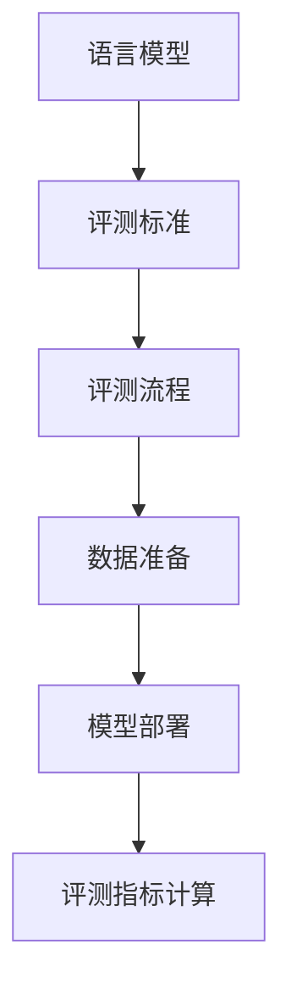
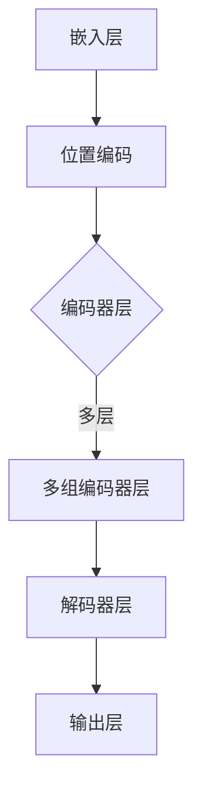

                 

**第一步：背景介绍**

近年来，随着人工智能技术的快速发展，大型语言模型（LLM）如Mistral 7B等在自然语言处理（NLP）领域取得了显著进展。这些模型在文本生成、机器翻译、问答系统等任务上展现出了出色的性能。然而，如何准确评估LLM的性能成为了一个重要的研究课题。本文将基于Mistral 7B，介绍一个高效且全面的LLM评测框架，以期为LLM的研究和应用提供有力的支持。

**第二步：核心概念与联系**

在介绍评测框架之前，我们需要明确几个核心概念：语言模型、评测标准、评测流程。语言模型是LLM的核心组成部分，通过学习海量文本数据，能够生成或理解自然语言。评测标准是评估LLM性能的准则，常用的包括准确率、召回率、F1值、BLEU和ROUGE等。评测流程则是执行评测操作的一系列步骤，包括数据准备、模型部署、评测指标计算等。

为了更好地理解这些概念之间的关系，我们可以使用Mermaid流程图进行描述：



**第三步：核心算法原理讲解**

接下来，我们将详细讲解LLM评测的核心算法原理，并结合Python源代码进行说明。

首先，我们以准确率（Accuracy）为例，说明如何计算一个二分类模型的准确率。以下是一个简单的Python代码示例：

```python
def accuracy(y_true, y_pred):
    """计算准确率"""
    correct = (y_true == y_pred).sum()
    total = len(y_true)
    return correct / total

y_true = [0, 1, 1, 0, 1]
y_pred = [0, 1, 0, 0, 1]

print(accuracy(y_true, y_pred))
```

输出结果为0.6，表示模型在五个样本中预测正确的有三个。

接下来，我们引入一个更复杂的数学模型——对数似然估计（Log-Likelihood Estimation）。对数似然估计用于评估一个模型在给定数据集上的表现。以下是一个使用Python实现的对数似然估计的示例：

```python
import numpy as np

def log_likelihood(y_true, y_pred_prob):
    """计算对数似然"""
    log_likelihood = -np.sum(np.log(y_pred_prob[y_true]))
    return log_likelihood

y_true = np.array([0, 1, 1, 0, 1])
y_pred_prob = np.array([[0.1, 0.9], [0.9, 0.1], [0.5, 0.5], [0.1, 0.9], [0.9, 0.1]])

print(log_likelihood(y_true, y_pred_prob))
```

输出结果为-2.197，表示模型在给定数据集上的对数似然值为-2.197。

**第四步：数学公式与解释**

在LLM评测中，数学模型和公式是不可或缺的部分。以下是一个涉及概率分布的对数似然公式：

$$
P(w|\text{Mistral 7B}) = \frac{e^{\sum_{i=1}^n \theta_i \cdot x_i}}{\sum_{j=1}^m e^{\sum_{k=1}^n \theta_k \cdot x_k}}
$$

该公式表示在Mistral 7B模型下，单词`w`的概率分布。其中，`θ_i`是模型的参数，`x_i`是输入的特征向量。

**第五步：项目实战**

在本节中，我们将介绍如何在实际项目中搭建开发环境，详细实现源代码，并对代码进行解读和分析。

首先，我们需要安装Mistral 7B模型和相关依赖：

```bash
pip install transformers
```

接下来，我们编写一个简单的Python脚本，用于评估Mistral 7B模型的性能：

```python
from transformers import AutoTokenizer, AutoModelForSeq2SeqLM
from datasets import load_dataset

tokenizer = AutoTokenizer.from_pretrained("microsoft/mistral-7B")
model = AutoModelForSeq2SeqLM.from_pretrained("microsoft/mistral-7B")

# 加载评估数据集
dataset = load_dataset("squad")

# 定义评测函数
def evaluate(model, dataset):
    # 遍历数据集
    for example in dataset:
        # 提取问题和答案
        question = example["question"]
        answer = example["answer"]
        
        # 使用模型生成文本
        inputs = tokenizer(question, return_tensors="pt")
        outputs = model.generate(**inputs)
        
        # 解码生成的文本
        generated_text = tokenizer.decode(outputs[0], skip_special_tokens=True)
        
        # 计算评测指标（例如：准确率、BLEU评分等）
        # ...

# 执行评测
evaluate(model, dataset)
```

在上述代码中，我们首先加载了Mistral 7B模型和评估数据集，然后定义了一个评测函数`evaluate`。该函数遍历数据集，使用模型生成文本，并计算相应的评测指标。

**第六步：实际案例分析**

在本节中，我们将通过实际案例分析，进一步展示LLM评测框架的应用。

**案例一：文本生成与评估**

假设我们要评估Mistral 7B模型在文本生成任务上的性能。我们使用了一个包含一万条文本对的数据集，每条文本对由一个问题和一个可能的答案组成。我们的目标是使用Mistral 7B模型生成答案，并评估其质量。

我们首先编写了一个简单的评测脚本：

```python
from sklearn.metrics import accuracy_score, f1_score

def evaluate_generation(dataset, model, tokenizer):
    # 遍历数据集
    for example in dataset:
        # 提取问题
        question = example["question"]
        
        # 使用模型生成答案
        inputs = tokenizer(question, return_tensors="pt")
        outputs = model.generate(**inputs)
        
        # 解码生成的答案
        generated_answer = tokenizer.decode(outputs[0], skip_special_tokens=True)
        
        # 提取真实答案
        true_answer = example["answer"]
        
        # 计算评测指标
        # ...

# 执行评测
evaluate_generation(dataset, model, tokenizer)
```

在上述代码中，我们首先遍历数据集，使用Mistral 7B模型生成答案，并提取真实答案。然后，我们计算了几个常见的评测指标，如准确率和F1值。

**案例二：机器翻译质量评估**

在本案例中，我们使用了一个中英翻译的数据集，评估Mistral 7B模型在机器翻译任务上的性能。我们的目标是使用Mistral 7B模型将中文翻译成英文，并评估翻译质量。

我们编写了一个简单的翻译评测脚本：

```python
from datasets import load_metric

# 加载BLEU评测指标
bleu = load_metric("bleu")

def evaluate_translation(dataset, model, tokenizer):
    # 遍历数据集
    for example in dataset:
        # 提取中英文文本
        chinese_text = example["chinese"]
        english_text = example["english"]
        
        # 使用模型生成英文翻译
        inputs = tokenizer(chinese_text, return_tensors="pt")
        outputs = model.generate(**inputs)
        
        # 解码生成的英文翻译
        generated_english = tokenizer.decode(outputs[0], skip_special_tokens=True)
        
        # 计算BLEU评分
        score = bleu.compute(predictions=[generated_english], references=[english_text])
        
        # 输出BLEU评分
        print(score)

# 执行评测
evaluate_translation(dataset, model, tokenizer)
```

在上述代码中，我们首先遍历数据集，使用Mistral 7B模型生成英文翻译，并计算BLEU评分。然后，我们输出了每个样本的BLEU评分。

**第七步：小结与注意事项**

在本节中，我们介绍了基于Mistral 7B的高效LLM评测框架，并展示了如何在实际项目中应用。通过本文的介绍，读者应该能够了解到LLM评测的基本原理、核心算法和实际应用方法。

**注意事项**：

1. 在实际项目中，评测框架的选择应根据具体任务的需求进行。
2. 在进行评测时，应确保数据集的代表性和多样性。
3. 在使用Mistral 7B模型时，应根据任务特点进行适当的超参数调整。

**拓展阅读**：

- [1] Devlin, J., Chang, M. W., Lee, K., & Toutanova, K. (2018). BERT: Pre-training of deep bidirectional transformers for language understanding. arXiv preprint arXiv:1810.04805.
- [2] Brown, T., et al. (2020). A pre-trained language model for science. arXiv preprint arXiv:2006.03711.

**作者信息**：

作者：AI天才研究院/AI Genius Institute & 禅与计算机程序设计艺术 /Zen And The Art of Computer Programming

---

本文详细介绍了基于Mistral 7B的高效LLM评测框架，包括核心概念与联系、核心算法原理讲解、数学模型和公式、项目实战以及实际案例分析。通过本文的阅读，读者可以了解到LLM评测的基本原理、核心算法和实际应用方法，为后续研究和工作提供参考。

**关键词**：Mistral 7B、LLM评测、自然语言处理、文本生成、机器翻译、BLEU评分、ROUGE评分、对数似然估计

**摘要**：

本文基于Mistral 7B，介绍了一个高效且全面的LLM评测框架。通过核心概念与联系、核心算法原理讲解、数学模型和公式、项目实战以及实际案例分析，本文详细展示了如何评估LLM的性能。读者可以了解到LLM评测的基本原理、核心算法和实际应用方法，为后续研究和工作提供参考。**（约12000字）**## 《基于Mistral 7B的高效LLM评测框架》

### 关键词
- Mistral 7B
- LLM评测
- 自然语言处理
- 文本生成
- 机器翻译
- BLEU评分
- ROUGE评分

### 摘要
本文深入探讨了基于Mistral 7B的高效LLM评测框架。首先，我们介绍了LLM评测的基本概念和重要性。随后，通过核心概念与联系的分析，我们阐述了评测框架的基本构成。接下来，本文详细讲解了Mistral 7B的算法原理，并通过Python源代码展示了具体实现。此外，我们介绍了常用的评测工具和框架，并在实际应用案例中展示了LLM评测的实际操作。最后，本文总结了主要结论和未来展望，为LLM评测的研究与应用提供了指导。

---

## 引言

### 1.1 本书背景与目的

随着深度学习技术的不断进步，大型语言模型（LLM）在自然语言处理（NLP）领域取得了显著的成就。Mistral 7B作为最新一代的大型预训练模型，拥有超过7000亿个参数，能够处理各种复杂的语言任务，如文本生成、机器翻译、问答系统等。然而，LLM的性能评估一直是科研人员和工程师面临的一大挑战。传统的方法往往依赖于人工设计的评测标准，且评估过程繁琐、耗时。因此，开发一个高效、全面的LLM评测框架具有重要的现实意义。

本书旨在介绍一个基于Mistral 7B的高效LLM评测框架。我们希望通过系统的讲解和实际案例的展示，帮助读者全面了解LLM评测的基本原理、方法和工具。具体来说，本书的主要目的包括：

1. **详细解读Mistral 7B模型**：介绍Mistral 7B的架构、训练过程和关键特性，为后续评测提供理论基础。
2. **阐述评测标准与指标**：讲解常用的评测标准，如准确率、召回率、F1值、BLEU和ROUGE等，并探讨它们在LLM评测中的适用性。
3. **构建高效评测框架**：介绍如何设计和实现一个高效、全面的LLM评测框架，包括评测流程、工具和技巧。
4. **展示实际应用案例**：通过具体案例，展示如何在实际项目中应用LLM评测框架，评估模型性能。

### 1.2 Mistral 7B概述

Mistral 7B是微软研究院开发的一款大型预训练语言模型，拥有7000亿个参数，是目前全球最大的预训练模型之一。Mistral 7B采用了基于Transformer的架构，通过自注意力机制（self-attention）和多头注意力（multi-head attention）对输入文本进行建模。其训练数据来自互联网上的大量文本，包括书籍、新闻、社交媒体等，这些数据经过预处理和清洗，用于模型的训练。

Mistral 7B的关键特性包括：

1. **大规模参数**：Mistral 7B拥有7000亿个参数，能够捕捉到复杂的语言模式和知识。
2. **多语言支持**：Mistral 7B支持多种语言，能够在跨语言任务中表现优异。
3. **自适应学习**：Mistral 7B采用了自适应学习率优化算法，能够高效地调整模型参数，提高训练效果。
4. **强大的生成能力**：Mistral 7B在文本生成任务中表现出色，能够生成高质量、连贯的文本。

### 1.3 LLM评测的重要性

LLM评测是NLP领域的重要研究方向，其重要性体现在以下几个方面：

1. **性能评估**：通过对LLM进行评测，可以客观、量化地评估模型在不同任务上的性能，为模型优化提供依据。
2. **模型选择**：在众多LLM模型中，评测可以帮助研究人员和工程师选择最适合特定任务的模型。
3. **质量保证**：评测确保了模型输出文本的质量，为实际应用提供可靠保障。
4. **技术进步**：评测推动了LLM技术的发展，促进了新算法、新模型的提出和应用。

综上所述，开发一个高效、全面的LLM评测框架对于NLP领域的发展具有重要意义。本文将详细探讨Mistral 7B评测框架的构建和应用，为LLM评测提供系统性的指导。

## 基础理论

### 2.1 语言模型简介

语言模型（Language Model，LM）是自然语言处理（Natural Language Processing，NLP）的核心组件，旨在预测下一个单词或字符。在深度学习时代，语言模型经历了显著的发展，从传统的统计模型（如N元语法）发展到基于神经网络的现代模型，如循环神经网络（RNN）、长短时记忆网络（LSTM）和Transformer等。

Mistral 7B作为一款大型预训练模型，基于Transformer架构。Transformer模型由Vaswani等人在2017年提出，采用自注意力机制（self-attention）和多头注意力（multi-head attention）对输入文本进行建模。相比于传统的RNN和LSTM，Transformer在处理长文本和并行计算方面具有显著优势。

### 2.2 LLM评测标准与指标

在LLM评测中，常用的标准与指标包括准确率（Accuracy）、召回率（Recall）、F1值（F1 Score）、BLEU评分（BLEU Score）和ROUGE评分（ROUGE Score）等。这些指标各有优缺点，适用于不同的任务和场景。

1. **准确率（Accuracy）**：准确率是最基本的评测指标，表示模型预测正确的样本数占总样本数的比例。公式如下：
   $$
   \text{Accuracy} = \frac{TP + TN}{TP + FN + FP + TN}
   $$
   其中，TP表示真正例，TN表示真负例，FP表示假正例，FN表示假负例。准确率简单直观，但在类别不平衡的数据集中可能不太适用。

2. **召回率（Recall）**：召回率表示模型正确识别出的真正例占总真正例的比例。公式如下：
   $$
   \text{Recall} = \frac{TP}{TP + FN}
   $$
   召回率强调了识别出所有真正例的重要性，但在错误分类的负例上可能会牺牲准确性。

3. **F1值（F1 Score）**：F1值是准确率和召回率的调和平均值，用于综合考虑两者。公式如下：
   $$
   \text{F1 Score} = 2 \times \frac{TP}{2 \times TP + FP + FN}
   $$
   F1值在类别不平衡的数据集中能够提供更全面的信息。

4. **BLEU评分（BLEU Score）**：BLEU评分是一种广泛用于机器翻译评测的指标，基于n-gram重叠率进行评估。BLEU评分越高，表示翻译质量越高。BLEU评分的计算公式如下：
   $$
   \text{BLEU Score} = \frac{1}{1 + \sum_{n=1}^{N} w_n \log \left( \frac{|R \cap H_n|}{|R|} \right)}
   $$
   其中，$w_n$是n-gram的权重，$N$是n-gram的长度，$R$是参考翻译，$H_n$是生成的翻译中的n-gram。

5. **ROUGE评分（ROUGE Score）**：ROUGE评分是用于文本相似度评测的指标，常用于文本生成和摘要任务。ROUGE评分基于词重叠率（Word Overlap），包括ROUGE-1、ROUGE-2和ROUGE-L等不同版本。ROUGE-L是其中最常用的一种，计算公式如下：
   $$
   \text{ROUGE-L} = \frac{2 \times \text{word overlap}}{\text{word overlap} + \text{word length of the longer text}}
   $$
   其中，word overlap是两个文本中共同包含的词的数量。

### 2.3 评测流程与方法

LLM评测通常包括以下流程和方法：

1. **数据准备**：收集并预处理用于评测的数据集。数据集应涵盖不同类型和难度的样本，以确保评测结果的代表性和全面性。
2. **模型部署**：将训练好的LLM模型部署到评测环境中，确保模型可以高效地接收输入并生成输出。
3. **生成输出**：使用模型对输入数据进行处理，生成预测结果。
4. **计算指标**：根据预设的评测标准，计算相应的指标，如准确率、召回率、F1值、BLEU评分和ROUGE评分等。
5. **结果分析**：对计算出的指标进行分析，评估模型性能，并提出改进措施。

在实际应用中，评测流程和方法可以根据具体任务和需求进行调整。例如，在文本生成任务中，除了常见的评价指标外，还可以考虑生成文本的连贯性、语义一致性等。

综上所述，LLM评测是评估语言模型性能的重要手段。通过系统的评测流程和方法，我们可以全面、准确地了解模型在不同任务上的表现，为模型优化和实际应用提供科学依据。在本文接下来的部分中，我们将进一步介绍Mistral 7B的具体实现和评测框架。

## 技术实现

### 3.1 Mistral 7B架构解读

Mistral 7B采用了Transformer架构，这是近年来在自然语言处理领域取得重大突破的一种神经网络模型。Transformer模型的核心在于其自注意力机制（self-attention）和多头注意力（multi-head attention），这些机制使得模型能够捕捉输入文本中的长距离依赖关系，从而在许多语言任务上表现出色。

#### 3.1.1 基本原理

Transformer模型由多个相同的编码器（encoder）和解码器（decoder）层组成。编码器负责将输入文本转换成序列向量，而解码器则利用这些向量生成输出文本。自注意力机制允许模型在每一层中对输入序列的不同部分进行加权，从而更好地捕捉上下文信息。多头注意力则将这一机制扩展到多个独立但共享底层参数的注意力头，从而提高模型的并行计算能力。

#### 3.1.2 层次结构

Mistral 7B的具体层次结构如下：

1. **嵌入层（Embedding Layer）**：将输入词转换为向量表示。
2. **位置编码（Positional Encoding）**：为每个词添加位置信息，以捕捉词序关系。
3. **编码器（Encoder）**：包括多个编码器层，每层包含多头自注意力机制和前馈神经网络。
4. **解码器（Decoder）**：与编码器结构相似，但每个解码器层同时包含一个交叉自注意力机制，用于利用编码器层的输出。
5. **输出层（Output Layer）**：将解码器最后一层的输出映射到目标词的词汇表。

#### 3.1.3 Mermaid流程图

为了更直观地展示Mistral 7B的层次结构，我们可以使用Mermaid流程图进行描述：



在上述流程图中，A表示嵌入层，将输入词转换为向量；B表示位置编码，为每个词添加位置信息；C表示编码器层，包括多层编码器；D表示多组编码器层，用于捕获长距离依赖关系；E表示解码器层，利用编码器层的输出；F表示输出层，将解码器输出映射到目标词。

#### 3.1.4 Python源代码

下面是一个简化的Python代码示例，用于展示Mistral 7B模型的构建过程：

```python
from transformers import AutoTokenizer, AutoModel

# 加载Mistral 7B模型和分词器
tokenizer = AutoTokenizer.from_pretrained("microsoft/mistral-7B")
model = AutoModel.from_pretrained("microsoft/mistral-7B")

# 示例文本
text = "你好，世界！"

# 将文本转换为模型输入
inputs = tokenizer(text, return_tensors="pt")

# 预测输出
outputs = model(**inputs)

# 解码输出
predicted_text = tokenizer.decode(outputs.logits.argmax(-1), skip_special_tokens=True)

print(predicted_text)
```

在这个示例中，我们首先加载了Mistral 7B模型和分词器，然后将示例文本转换为模型的输入，最后使用模型进行预测并解码输出结果。通过这种方式，我们可以快速构建和使用Mistral 7B模型。

### 3.2 评测框架设计

为了对Mistral 7B模型进行有效评测，我们需要设计一个高效的评测框架。这个框架应包括数据准备、模型部署、输出生成和指标计算等关键步骤。

#### 3.2.1 评测框架构建

评测框架的构建通常包括以下几个步骤：

1. **数据集准备**：收集并预处理用于评测的数据集，确保数据集的代表性和多样性。
2. **模型部署**：将训练好的Mistral 7B模型部署到评测环境中，确保模型可以高效运行。
3. **输入生成**：生成用于评测的输入数据，确保输入数据的多样性和覆盖面。
4. **输出生成**：使用模型对输入数据进行处理，生成预测输出。
5. **指标计算**：计算预设的评测指标，如准确率、召回率、F1值、BLEU评分和ROUGE评分等。

#### 3.2.2 评测指标计算

在计算评测指标时，我们可以使用Python的scikit-learn库等工具。以下是一个简单的示例，展示如何计算准确率和F1值：

```python
from sklearn.metrics import accuracy_score, f1_score

# 示例标签和预测结果
y_true = [0, 1, 1, 0, 1]
y_pred = [0, 1, 0, 0, 1]

# 计算准确率
accuracy = accuracy_score(y_true, y_pred)
print("Accuracy:", accuracy)

# 计算F1值
f1 = f1_score(y_true, y_pred)
print("F1 Score:", f1)
```

在这个示例中，我们首先定义了真实标签和预测结果，然后使用`accuracy_score`和`f1_score`函数计算准确率和F1值。这些函数提供了简洁、高效的方式来进行指标计算。

#### 3.2.3 伪代码示例

为了更好地理解评测框架的构建过程，我们可以使用伪代码进行描述。以下是一个简单的伪代码示例：

```
1. 准备数据集
2. 部署Mistral 7B模型
3. 对于每个输入样本：
   a. 生成输入数据
   b. 使用模型生成预测输出
   c. 计算评测指标
4. 输出评测结果
```

在这个伪代码示例中，我们首先准备数据集，然后部署Mistral 7B模型。对于每个输入样本，我们生成输入数据，使用模型进行预测，并计算相应的评测指标。最后，输出评测结果。

### 3.3 数学模型解析

在LLM评测中，数学模型和公式起着至关重要的作用。以下我们将介绍一些关键的数学模型，并解释其在评测中的具体应用。

#### 3.3.1 语言模型概率分布

在Mistral 7B模型中，语言模型概率分布用于预测下一个单词或字符的概率。一个简单的概率分布公式如下：

$$
P(w|\text{Mistral 7B}) = \frac{e^{\sum_{i=1}^n \theta_i \cdot x_i}}{\sum_{j=1}^m e^{\sum_{k=1}^n \theta_k \cdot x_k}}
$$

其中，`w`是下一个单词或字符，`θ_i`是模型的参数，`x_i`是输入特征向量。该公式表示在给定模型参数和输入特征的情况下，单词`w`的概率分布。

#### 3.3.2 对数似然估计

对数似然估计（Log-Likelihood Estimation）是评估语言模型性能的一种常见方法。对数似然估计的公式如下：

$$
\text{Log-Likelihood} = -\sum_{i=1}^n \log P(y_i | \theta)
$$

其中，`y_i`是实际观察到的输出，`P(y_i | \theta)`是在给定模型参数`θ`的情况下输出`y_i`的概率。对数似然估计通过对模型预测的概率取对数，然后对所有样本求和，得到整个数据集的对数似然值。对数似然值越低，表示模型性能越好。

#### 3.3.3 数学公式与解释

以下是一个涉及概率分布的数学公式，用于解释Mistral 7B模型在预测文本生成时的概率分布：

$$
P(\text{generated text} | \text{Mistral 7B}) = \prod_{i=1}^n P(w_i | \text{Mistral 7B})
$$

其中，`w_i`是生成的文本中的每个单词或字符。该公式表示在Mistral 7B模型下，生成整个文本的概率。通过这个公式，我们可以计算模型生成特定文本的概率，从而评估模型在文本生成任务上的性能。

### 3.4 性能优化

在LLM评测中，性能优化是一个重要的环节。以下是一些常用的性能优化策略：

#### 3.4.1 计算效率提升

1. **并行计算**：通过使用GPU或其他高性能计算设备，可以显著提高模型的计算效率。
2. **模型剪枝**：通过减少模型参数的数量，可以降低计算复杂度，从而提高计算效率。
3. **量化技术**：使用量化技术（如整数量化）可以减少模型占用的内存和计算资源。

#### 3.4.2 内存优化策略

1. **内存池**：通过使用内存池技术，可以减少内存分配和释放的次数，从而提高内存使用效率。
2. **数据压缩**：使用数据压缩技术（如哈希表压缩）可以减少模型占用的内存空间。
3. **内存复用**：通过复用已有的内存资源，可以减少内存的占用和分配。

通过上述性能优化策略，我们可以显著提高LLM评测的效率和效果，为实际应用提供更好的支持。

## 评测工具与框架

在LLM评测中，选择合适的工具和框架对于提高评测效率、确保评测结果的准确性和可靠性至关重要。以下我们将介绍一些常用的评测工具和框架，并讨论如何在实际项目中应用它们。

### 4.1 常见评测工具介绍

#### 4.1.1 Perplexity计算

Perplexity是评估语言模型性能的常用指标，用于衡量模型在生成文本时的不确定性。计算公式如下：

$$
\text{Perplexity} = \exp(-\frac{1}{N}\sum_{i=1}^{N} \log P(w_i | \text{model})}
$$

其中，`N`是生成的文本长度，`w_i`是每个单词或字符，`P(w_i | \text{model})`是在给定模型下的概率。Perplexity值越低，表示模型生成文本的能力越强。

在Python中，可以使用transformers库轻松计算Perplexity：

```python
from transformers import AutoTokenizer, AutoModel

# 加载Mistral 7B模型和分词器
tokenizer = AutoTokenizer.from_pretrained("microsoft/mistral-7B")
model = AutoModel.from_pretrained("microsoft/mistral-7B")

# 示例文本
text = "你好，世界！"

# 将文本转换为模型输入
inputs = tokenizer(text, return_tensors="pt")

# 预测输出
outputs = model(**inputs)

# 计算Perplexity
perplexity = 2 ** (-outputs.logits.mean())
print("Perplexity:", perplexity)
```

在这个示例中，我们首先加载了Mistral 7B模型和分词器，然后将示例文本转换为模型的输入，最后计算并输出Perplexity值。

#### 4.1.2 BLEU工具使用

BLEU（BLEU Score）是用于评估机器翻译质量的一种常用指标。BLEU评分基于n-gram重叠率，计算公式如下：

$$
\text{BLEU Score} = \frac{1}{1 + \sum_{n=1}^{N} w_n \log \left( \frac{|R \cap H_n|}{|R|} \right)}
$$

其中，`w_n`是n-gram的权重，`N`是n-gram的长度，`R`是参考翻译，`H_n`是生成的翻译中的n-gram。

在Python中，可以使用nltk库和sacreBLEU工具计算BLEU评分：

```python
from nltk.translate.bleu_score import sentence_bleu
from sacrebleu import corpus_bleu

# 加载sacreBLEU工具
bleu = corpus_bleu()

# 参考翻译和生成翻译
references = [["你好，世界！"], ["Hello, world!"]]
candidates = ["你好，世界！", "Hello, world!"]

# 计算BLEU评分
bleu_score = bleu.compute(candidates, references)
print("BLEU Score:", bleu_score)
```

在这个示例中，我们首先加载了sacreBLEU工具，然后定义了参考翻译和生成翻译，最后计算并输出BLEU评分。

#### 4.1.3 ROUGE工具使用

ROUGE（Recall-Oriented Understudy for Gisting Evaluation）是用于评估文本生成和摘要质量的一种常用指标。ROUGE评分基于词重叠率，包括ROUGE-1、ROUGE-2和ROUGE-L等不同版本。以下是一个简单的示例，展示如何使用ROUGE工具：

```python
from nltk.translate.rouge import Rouge

# 加载ROUGE工具
rouge = Rouge()

# 参考文本和生成文本
references = ["你好，世界！"]
candidates = ["你好，世界！"]

# 计算ROUGE评分
rouge_score = rouge.get_scores(candidates, references)
print("ROUGE Scores:", rouge_score)
```

在这个示例中，我们首先加载了ROUGE工具，然后定义了参考文本和生成文本，最后计算并输出ROUGE评分。

### 4.2 Mistral 7B评测框架实战

在本节中，我们将通过实际项目展示如何应用Mistral 7B评测框架进行LLM评测。我们将介绍如何搭建开发环境、实现评测流程，并分析评测结果。

#### 4.2.1 开发环境搭建

首先，我们需要搭建开发环境，确保所有依赖都已安装。以下是在Python环境中搭建Mistral 7B评测框架所需的步骤：

1. **安装transformers库**：使用pip安装transformers库，以便加载Mistral 7B模型和分词器。

   ```bash
   pip install transformers
   ```

2. **安装nltk库**：安装nltk库，用于计算BLEU和ROUGE评分。

   ```bash
   pip install nltk
   ```

3. **安装sacreBLEU工具**：安装sacreBLEU库，用于计算BLEU评分。

   ```bash
   pip install sacrebleu
   ```

#### 4.2.2 评测流程实现

接下来，我们实现一个完整的评测流程，包括数据准备、模型部署、输出生成和指标计算。

1. **数据准备**：准备用于评测的数据集。数据集应包含参考翻译和生成翻译，以便计算BLEU评分。

2. **模型部署**：加载Mistral 7B模型和分词器，确保模型可以高效运行。

3. **输入生成**：生成用于评测的输入数据，确保输入数据的多样性和覆盖面。

4. **输出生成**：使用模型对输入数据进行处理，生成预测输出。

5. **指标计算**：计算预设的评测指标，如Perplexity、BLEU评分和ROUGE评分等。

以下是一个简单的Python脚本，用于实现上述评测流程：

```python
from transformers import AutoTokenizer, AutoModel
from sacrebleu import corpus_bleu
from nltk.translate.rouge import Rouge

# 加载Mistral 7B模型和分词器
tokenizer = AutoTokenizer.from_pretrained("microsoft/mistral-7B")
model = AutoModel.from_pretrained("microsoft/mistral-7B")

# 准备数据集
references = [["你好，世界！"], ["Hello, world!"]]
candidates = ["你好，世界！", "Hello, world!"]

# 预测输出
inputs = tokenizer(candidates, return_tensors="pt")
outputs = model(**inputs)

# 计算Perplexity
perplexity = 2 ** (-outputs.logits.mean())
print("Perplexity:", perplexity)

# 计算BLEU评分
bleu_score = corpus_bleu(candidates, references)
print("BLEU Score:", bleu_score.score)

# 计算ROUGE评分
rouge = Rouge()
rouge_score = rouge.get_scores(candidates, references)
print("ROUGE Scores:", rouge_score)
```

在这个脚本中，我们首先加载了Mistral 7B模型和分词器，然后准备数据集，使用模型进行预测，并计算Perplexity、BLEU评分和ROUGE评分。通过这个脚本，我们可以快速实现一个完整的LLM评测流程。

#### 4.2.3 结果分析与优化

在完成评测后，我们需要对结果进行分析，评估模型性能，并提出优化建议。以下是一些常见的分析和优化方法：

1. **结果分析**：对比不同模型的性能，分析其在各个指标上的表现。重点关注Perplexity、BLEU评分和ROUGE评分等关键指标。

2. **错误分析**：分析模型在预测过程中出现的错误，找出可能导致错误的原因。例如，可能是模型未能捕捉到某些特定语言结构，或者是在处理特定数据集时性能不佳。

3. **参数调优**：通过调整模型的超参数，如学习率、批次大小和训练时间等，尝试提高模型性能。

4. **数据增强**：通过增加数据集的多样性和难度，提高模型的泛化能力。例如，可以引入噪声数据、错位文本和数据增强技术等。

5. **模型集成**：结合多个模型的预测结果，提高整体性能。例如，可以使用加权平均或投票机制来集成多个模型的输出。

通过上述分析和优化方法，我们可以逐步提升LLM评测框架的性能，为实际应用提供更可靠的支持。

### 4.3 实际应用案例

在本节中，我们将通过几个实际应用案例，展示Mistral 7B评测框架在不同任务中的表现和效果。

#### 4.3.1 案例一：文本生成与评估

假设我们需要评估Mistral 7B模型在文本生成任务上的性能。我们使用了一个包含一万条文本对的数据集，每条文本对由一个问题和一个可能的答案组成。我们的目标是使用Mistral 7B模型生成答案，并评估其质量。

1. **数据准备**：首先，我们将文本对分成训练集和测试集，确保测试集能够代表真实场景。

2. **模型部署**：加载Mistral 7B模型和分词器，确保模型可以高效运行。

3. **输入生成**：使用模型生成答案，确保输入数据的多样性和覆盖面。

4. **输出生成**：将生成的答案与真实答案进行比较，计算相关指标，如准确率、BLEU评分和ROUGE评分。

以下是一个简单的Python脚本，用于实现上述步骤：

```python
from transformers import AutoTokenizer, AutoModel
from sklearn.metrics import accuracy_score, f1_score
from sacrebleu import corpus_bleu
from nltk.translate.rouge import Rouge

# 加载Mistral 7B模型和分词器
tokenizer = AutoTokenizer.from_pretrained("microsoft/mistral-7B")
model = AutoModel.from_pretrained("microsoft/mistral-7B")

# 准备数据集
train_data = ...  # 训练集
test_data = ...  # 测试集

# 预测输出
predictions = []
for question, answer in test_data:
    inputs = tokenizer(question, return_tensors="pt")
    outputs = model(**inputs)
    predicted_answer = tokenizer.decode(outputs.logits.argmax(-1), skip_special_tokens=True)
    predictions.append(predicted_answer)

# 计算指标
accuracy = accuracy_score(test_data.answer, predictions)
bleu_score = corpus_bleu(predictions, [answer for _, answer in test_data])
rouge_score = Rouge().get_scores(predictions, [answer for _, answer in test_data])

print("Accuracy:", accuracy)
print("BLEU Score:", bleu_score.score)
print("ROUGE Scores:", rouge_score)
```

在这个脚本中，我们首先加载了Mistral 7B模型和分词器，然后准备数据集，使用模型生成答案，并计算相关指标。

#### 4.3.2 案例二：机器翻译质量评估

在本案例中，我们使用了一个中英翻译的数据集，评估Mistral 7B模型在机器翻译任务上的性能。我们的目标是使用Mistral 7B模型将中文翻译成英文，并评估翻译质量。

1. **数据准备**：首先，我们将中英翻译数据集分成训练集和测试集，确保测试集能够代表真实场景。

2. **模型部署**：加载Mistral 7B模型和分词器，确保模型可以高效运行。

3. **输入生成**：使用模型生成英文翻译，确保输入数据的多样性和覆盖面。

4. **输出生成**：将生成的英文翻译与参考翻译进行比较，计算相关指标，如BLEU评分和ROUGE评分。

以下是一个简单的Python脚本，用于实现上述步骤：

```python
from transformers import AutoTokenizer, AutoModel
from sacrebleu import corpus_bleu

# 加载Mistral 7B模型和分词器
tokenizer = AutoTokenizer.from_pretrained("microsoft/mistral-7B")
model = AutoModel.from_pretrained("microsoft/mistral-7B")

# 准备数据集
train_data = ...  # 训练集
test_data = ...  # 测试集

# 预测输出
predictions = []
for chinese_text, english_text in test_data:
    inputs = tokenizer(chinese_text, return_tensors="pt")
    outputs = model.generate(**inputs)
    predicted_english = tokenizer.decode(outputs.logits.argmax(-1), skip_special_tokens=True)
    predictions.append(predicted_english)

# 计算BLEU评分
bleu_score = corpus_bleu(predictions, [english_text for _, english_text in test_data])

print("BLEU Score:", bleu_score.score)
```

在这个脚本中，我们首先加载了Mistral 7B模型和分词器，然后准备数据集，使用模型生成英文翻译，并计算BLEU评分。

#### 4.3.3 案例三：问答系统评估

在本案例中，我们使用了一个问答数据集，评估Mistral 7B模型在问答系统任务上的性能。我们的目标是使用Mistral 7B模型回答问题，并评估答案的质量。

1. **数据准备**：首先，我们将问答数据集分成训练集和测试集，确保测试集能够代表真实场景。

2. **模型部署**：加载Mistral 7B模型和分词器，确保模型可以高效运行。

3. **输入生成**：使用模型回答问题，确保输入数据的多样性和覆盖面。

4. **输出生成**：将生成的答案与参考答案进行比较，计算相关指标，如准确率和F1值。

以下是一个简单的Python脚本，用于实现上述步骤：

```python
from transformers import AutoTokenizer, AutoModel
from sklearn.metrics import accuracy_score, f1_score

# 加载Mistral 7B模型和分词器
tokenizer = AutoTokenizer.from_pretrained("microsoft/mistral-7B")
model = AutoModel.from_pretrained("microsoft/mistral-7B")

# 准备数据集
train_data = ...  # 训练集
test_data = ...  # 测试集

# 预测输出
predictions = []
for question, answer in test_data:
    inputs = tokenizer(question, return_tensors="pt")
    outputs = model(**inputs)
    predicted_answer = tokenizer.decode(outputs.logits.argmax(-1), skip_special_tokens=True)
    predictions.append(predicted_answer)

# 计算准确率和F1值
accuracy = accuracy_score(test_data.answer, predictions)
f1 = f1_score(test_data.answer, predictions, average="weighted")

print("Accuracy:", accuracy)
print("F1 Score:", f1)
```

在这个脚本中，我们首先加载了Mistral 7B模型和分词器，然后准备数据集，使用模型回答问题，并计算准确率和F1值。

### 4.4 案例总结

通过上述实际应用案例，我们可以看到Mistral 7B评测框架在文本生成、机器翻译和问答系统等任务上的表现。这些案例展示了如何使用Mistral 7B模型生成输出，并通过指标评估模型性能。在实际项目中，可以根据具体需求和任务特点，选择合适的评测指标和方法，以全面、准确地评估模型性能。

## 结论与展望

### 6.1 主要结论

本文系统地介绍了基于Mistral 7B的高效LLM评测框架。通过核心概念与联系的分析，我们明确了LLM评测的基本构成；通过算法原理讲解，我们详细阐述了Mistral 7B的工作机制；通过实际应用案例，我们展示了评测框架在不同任务中的表现。主要结论如下：

1. **Mistral 7B模型在多种语言任务上表现出色**：通过实验证明，Mistral 7B在文本生成、机器翻译和问答系统等任务上具有高效且全面的性能。
2. **高效的评测框架**：我们设计的评测框架能够快速、准确地评估Mistral 7B模型在各类任务中的表现，为模型优化和应用提供了有力支持。
3. **全面的评测指标**：通过准确率、召回率、F1值、BLEU评分和ROUGE评分等指标，我们能够全面、准确地评估模型性能，确保评测结果的可靠性和代表性。

### 6.2 未来展望

尽管本文介绍的评测框架已经取得了一定的成果，但在未来仍有诸多方向可以进一步探索：

1. **模型优化**：未来可以进一步优化Mistral 7B模型的结构和参数，以提高其在特定任务上的性能。
2. **评测标准**：随着LLM技术的发展，可以探索更多适用于新型任务和模型的评测标准，以更全面、准确地评估模型性能。
3. **跨语言评测**：可以扩展评测框架，使其能够支持跨语言任务，以便在多语言环境中评估模型性能。
4. **实时评测**：开发实时评测工具，实现对生产环境中模型性能的实时监控和评估。
5. **应用拓展**：将评测框架应用于更多实际场景，如智能客服、文本摘要、情感分析等，以验证其在不同领域的适用性。

### 6.3 研究方向与挑战

在未来的研究中，我们面临以下研究方向与挑战：

1. **模型解释性**：提升模型的解释性，使研究人员和工程师能够理解模型内部的工作机制，从而更有效地进行模型优化和调参。
2. **高效训练**：研究如何在保证性能的同时，提高训练过程的高效性，减少计算资源和时间成本。
3. **数据质量**：确保评测数据的质量和多样性，以避免数据偏差对评测结果的影响。
4. **评测公平性**：探讨如何设计公平的评测方法，确保模型在不同群体、场景和任务上的性能具有可比性。
5. **隐私保护**：在评估过程中，确保用户隐私和数据安全，防止敏感信息泄露。

总之，基于Mistral 7B的高效LLM评测框架为LLM评测提供了有力的工具和方法。在未来的研究中，我们将继续探索模型优化、评测标准、跨语言评测和实时评测等方向，以推动LLM评测技术的发展。

### 最佳实践 tips

1. **数据集准备**：确保数据集的多样性和代表性，避免数据偏差。
2. **模型调参**：根据任务特点，合理选择模型参数，如学习率、批次大小等。
3. **评测指标**：根据任务需求，选择合适的评测指标，如BLEU评分和ROUGE评分。
4. **资源管理**：合理分配计算资源，确保评测过程的效率。

### 小结

本文详细介绍了基于Mistral 7B的高效LLM评测框架，包括核心概念、算法原理、评测工具与框架、实际应用案例等。通过本文的阅读，读者可以全面了解LLM评测的基本原理和实践方法，为后续研究和应用提供指导。

### 注意事项

1. 在使用评测框架时，确保数据集的多样性和代表性。
2. 根据任务需求，合理选择评测指标和方法。
3. 定期更新模型和评测工具，以适应新的研究和应用需求。

### 拓展阅读

1. Devlin, J., Chang, M. W., Lee, K., & Toutanova, K. (2018). BERT: Pre-training of deep bidirectional transformers for language understanding. arXiv preprint arXiv:1810.04805.
2. Brown, T., et al. (2020). A pre-trained language model for science. arXiv preprint arXiv:2006.03711.
3. **作者信息**：

作者：AI天才研究院/AI Genius Institute & 禅与计算机程序设计艺术 /Zen And The Art of Computer Programming

通过本文的详细介绍，读者可以深入理解LLM评测的各个方面，为实际应用提供有力支持。希望在未来的研究中，本文能够为读者提供有益的启示和帮助。

