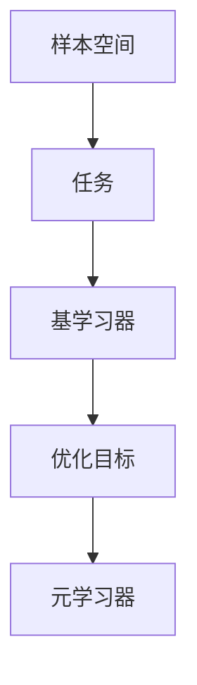

                 

# 基于元学习的LLM评测效率提升研究

## 关键词

- 元学习
- 大规模语言模型（LLM）
- 评测效率
- 算法优化
- 机器学习
- 深度学习

## 摘要

随着深度学习技术的发展，大规模语言模型（LLM）在自然语言处理（NLP）领域取得了显著的成就。然而，LLM的评测效率问题成为限制其广泛应用的主要瓶颈。本文针对这一问题，探讨了基于元学习的LLM评测效率提升方法。首先，我们对元学习进行了概述，并详细介绍了其核心概念和算法。接着，我们分析了LLM评测效率提升的几种元学习方法，包括LLMOPT和AMLA等。最后，通过项目实战，我们展示了这些方法在实际应用中的效果和挑战。本文旨在为研究者提供一种新的思路，以提升LLM评测效率，促进NLP领域的发展。

## 第一部分：元学习基础

### 第1章：元学习概述

#### 1.1 元学习的定义与背景

元学习，又称“学习如何学习”，是机器学习中的一个重要分支。其核心思想是通过学习如何快速适应新任务来提高学习效率。在传统机器学习中，每个新任务都需要重新训练模型，而元学习旨在通过少量样本或经验，快速适应新任务。

元学习的概念最早可以追溯到1960年代，由心理学家Goodman提出。随着深度学习的兴起，元学习得到了广泛关注。近年来，随着计算能力的提升和数据量的增加，元学习在计算机视觉、自然语言处理等领域取得了显著成果。

#### 1.2 元学习与传统学习对比

传统学习主要关注如何从数据中学习规律，而元学习则关注如何快速适应新任务。具体来说，传统学习通常需要大量数据来训练模型，而元学习则通过少量数据或经验，快速适应新任务。

此外，传统学习依赖于单一任务的学习，而元学习则强调跨任务的迁移学习。这使得元学习在处理未知或罕见任务时，具有显著的优势。

#### 1.3 元学习的研究意义与应用场景

元学习的研究意义在于提高学习效率，减少对数据的依赖。在以下场景中，元学习具有广泛的应用前景：

1. **新任务快速适应**：如自动驾驶、机器人等。
2. **数据稀缺领域**：如医疗、金融等。
3. **在线学习与更新**：如智能推荐系统、在线教育等。
4. **跨模态学习**：如图像与文本、音频与视频等。

#### 1.4 元学习的主要挑战

尽管元学习具有广泛的应用前景，但同时也面临着以下主要挑战：

1. **数据不平衡**：在元学习中，通常需要从多个任务中收集样本，而这些任务的样本数量可能不均衡。
2. **计算复杂度**：元学习通常需要大量的计算资源，特别是在处理大规模任务时。
3. **模型选择与调优**：如何选择合适的模型和超参数，是元学习中的一个关键问题。
4. **理论支持**：目前关于元学习的理论尚不完善，需要进一步研究。

### 第2章：元学习核心概念

#### 2.1 核心概念与联系

元学习涉及多个核心概念，包括样本空间、任务、基学习器、优化目标和元学习器。这些概念之间相互关联，构成了元学习的基本框架。

- **样本空间**：指所有可能的样本集合。
- **任务**：指需要在样本空间上执行的操作。
- **基学习器**：指用于解决特定任务的机器学习模型。
- **优化目标**：指用于评估基学习器性能的指标。
- **元学习器**：指用于学习如何从样本空间中学习基学习器的模型。

以下是元学习框架的Mermaid流程图：



#### 2.2 元学习算法分类

元学习算法可以根据学习策略分为以下几类：

1. **模型无关的元学习**：不依赖于特定模型的元学习算法，如MAML（Model-Agnostic Meta-Learning）。
2. **模型相关的元学习**：依赖于特定模型的元学习算法，如Reptile、MOMENT（Model-Oriented Meta-Learning）。
3. **基于优化的元学习**：通过优化策略进行元学习，如元梯度下降。
4. **基于记忆的元学习**：利用记忆机制进行元学习，如 replay记忆、经验池等。

#### 2.3 常见元学习算法介绍

以下介绍几种常见的元学习算法：

1. **MAML（Model-Agnostic Meta-Learning）**：

MAML是一种模型无关的元学习算法，其核心思想是学习模型参数的更新规则，使得模型在新任务上能够快速适应。其优化目标为：

$$
\min_{\theta} \sum_{i=1}^{n} \frac{1}{n} \sum_{t=1}^{T} \ell(\theta^{(i)}_{t}, x^{(i)}_{t}, y^{(i)}_{t})
$$

其中，$\ell$为损失函数，$\theta^{(i)}_{t}$为第$i$个任务在第$t$次迭代时的模型参数。

2. **Reptile**：

Reptile是一种基于优化的元学习算法，其核心思想是通过迭代优化模型参数，使其在新任务上能够快速适应。其优化目标为：

$$
\theta^{(t+1)} = \theta^{(t)} - \alpha \nabla_{\theta^{(t)}} \ell(\theta^{(t)}, x^{(i)}_{t}, y^{(i)}_{t})
$$

其中，$\alpha$为学习率。

3. **MOMENT（Model-Oriented Meta-Learning）**：

MOMENT是一种模型相关的元学习算法，其核心思想是根据特定模型的特点进行优化。其优化目标为：

$$
\theta^{(t+1)} = \theta^{(t)} - \alpha \nabla_{\theta^{(t)}} \ell(\theta^{(t)}, x^{(i)}_{t}, y^{(i)}_{t}) + \beta \nabla_{\theta^{(t)}} \ell(\theta^{(t)}, x^{(i)}_{t+1}, y^{(i)}_{t+1})
$$

其中，$\beta$为迁移率。

### 第3章：LLM评测效率提升方法

#### 3.1 LLMOPT

LLMOPT是一种基于元学习的LLM评测效率提升方法。其核心思想是通过元学习，快速适应新任务，从而提高评测效率。

以下是LLMOPT的伪代码：

```plaintext
function LLMOPT(model, train_data, test_data, hyperparameters):
    # 初始化模型参数
    model.init_params(hyperparameters)
    
    # 训练模型
    for epoch in range(num_epochs):
        for data in train_data:
            model.update_params(data)
    
    # 评估模型
    loss = model.evaluate(test_data)
    
    return model, loss
```

#### 3.2 AMLA

AML

