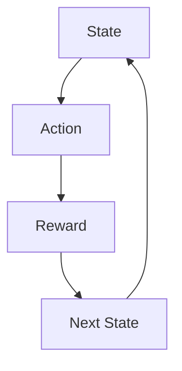
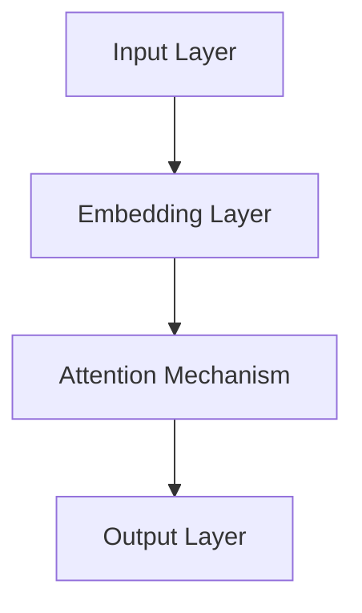

                 

### 设计文章的逻辑结构与内容

**设计文章逻辑结构的步骤：**

1. **确定文章主题和目标读者：**
   - 标题：《基于强化学习的LLM长期记忆测试》
   - 目标读者：对强化学习、自然语言处理（NLP）和长期记忆测试有一定了解的读者，包括研究人员、工程师和学术人士。

2. **构建文章大纲：**
   - 引言：介绍强化学习、LLM和长期记忆测试的背景和重要性。
   - 第1章：强化学习基础
     - 1.1 背景介绍
     - 1.2 核心概念与联系：Mermaid流程图
     - 1.3 强化学习算法原理讲解：Q-Learning、SARSA等算法的Python伪代码
     - 1.4 数学模型和公式：使用LaTeX格式展示
   - 第2章：LLM与长期记忆
     - 2.1 背景介绍
     - 2.2 核心概念与联系：Mermaid流程图
     - 2.3 长期记忆在LLM中的应用：代码示例和分析
     - 2.4 数学模型和公式：使用LaTeX格式展示
   - 第3章：强化学习在LLM中的应用
     - 3.1 应用场景介绍
     - 3.2 强化学习算法在LLM中的具体应用：代码示例和分析
     - 3.3 数学模型和公式：使用LaTeX格式展示
   - 第4章：长期记忆测试方法
     - 4.1 测试方法概述
     - 4.2 测试工具与平台介绍
     - 4.3 实际案例与测试分析
     - 4.4 数学模型和公式：使用LaTeX格式展示
   - 第5章：实际案例与项目实战
     - 5.1 项目背景
     - 5.2 开发环境搭建
     - 5.3 源代码实现与分析
     - 5.4 项目小结
   - 第6章：性能评估与优化
     - 6.1 评估指标介绍
     - 6.2 优化策略和方法
     - 6.3 性能优化案例分析
     - 6.4 小结与展望
   - 结论：总结文章主要内容，展望未来研究方向。

3. **细化每个章节的内容：**
   - **第1章：强化学习基础**
     - 1.1节 背景介绍：强化学习的发展历程、应用领域等。
     - 1.2节 核心概念与联系：强化学习的基本组成部分，如状态、动作、奖励和策略。
       - ```mermaid
       graph TD
       A[State] --> B[Action]
       B --> C[Reward]
       C --> D[Next State]
       D --> A
       ```
     - 1.3节 强化学习算法原理讲解：每个算法的伪代码实现。
       - ```python
       # Q-Learning Algorithm Pseudocode
       Q[s, a] = Q[s, a] + alpha * (reward[s', a'] + gamma * max(Q[s', a']) - Q[s, a])
       ```
     - 1.4节 数学模型和公式：强化学习中的相关公式，如值函数、策略迭代等。
       - ```latex
       $$ Q^*(s, a) = r(s, a) + \gamma \max_{a'} Q^*(s', a')
       $$`

   - **第2章：LLM与长期记忆**
     - 2.1节 背景介绍：介绍大规模语言模型（LLM）的发展和应用。
     - 2.2节 核心概念与联系：LLM的基本组成部分，如嵌入层、自注意力机制等。
       - ```mermaid
       graph TD
       A[Input Layer] --> B[Embedding Layer]
       B --> C[Attention Mechanism]
       C --> D[Output Layer]
       ```
     - 2.3节 长期记忆在LLM中的应用：代码示例展示如何实现长期记忆。
       - ```python
       # Example of Long-term Memory in LLM
       memory = deque(maxlen=100)
       for word in sequence:
           memory.append(word)
           if len(memory) > 100:
               memory.popleft()
       ```
     - 2.4节 数学模型和公式：长期记忆相关的数学模型，如状态转移矩阵、遗忘函数等。
       - ```latex
       $$ \text{ Forget Gate} = \sigma(W_f \cdot [h_t, s_{t-1}] + b_f)
       $$`

   - **第3章：强化学习在LLM中的应用**
     - 3.1节 应用场景介绍：强化学习在文本生成、对话系统中的应用案例。
     - 3.2节 强化学习算法在LLM中的具体应用：结合具体算法和案例进行讲解。
       - ```python
       # Policy Gradient Method for Text Generation
       policy = PolicyModel()
       for episode in range(num_episodes):
           state = env.reset()
           while not done:
               action = policy.sample_action(state)
               next_state, reward, done = env.step(action)
               policy.update(state, action, reward)
               state = next_state
       ```
     - 3.3节 数学模型和公式：强化学习在LLM中的应用公式，如策略梯度算法等。
       - ```latex
       $$ \nabla_\theta J(\theta) = \nabla_\theta \sum_{t} \rho_t \log \pi_\theta(a_t | s_t)
       $$`

   - **第4章：长期记忆测试方法**
     - 4.1节 测试方法概述：介绍长期记忆测试的基本概念和方法。
     - 4.2节 测试工具与平台介绍：介绍常用的长期记忆测试工具和平台。
     - 4.3节 实际案例与测试分析：通过实际案例展示测试过程和分析结果。
     - 4.4节 数学模型和公式：长期记忆测试中的相关公式，如记忆保持率等。
       - ```latex
       $$ \text{Memory Retention Rate} = \frac{\text{Correctly Retrieved Memories}}{\text{Total Memories Tested}}
       $$`

   - **第5章：实际案例与项目实战**
     - 5.1节 项目背景：介绍项目目标和实际应用场景。
     - 5.2节 开发环境搭建：详细描述所需的软件和硬件环境。
     - 5.3节 源代码实现与分析：提供详细的代码实现和解读。
     - 5.4节 项目小结：总结项目的成果和经验教训。

   - **第6章：性能评估与优化**
     - 6.1节 评估指标介绍：介绍常用的性能评估指标，如准确率、召回率等。
     - 6.2节 优化策略和方法：介绍性能优化的策略和方法。
     - 6.3节 性能优化案例分析：通过实际案例展示优化过程和效果。
     - 6.4节 小结与展望：总结性能优化的重要性和未来研究方向。

4. **撰写文章：**
   - 使用markdown格式撰写文章，确保代码、公式和流程图正确显示。
   - 每个章节内容需完整、详细、具体，确保读者能够理解和应用。
   - 文章结尾需总结主要内容，并提出未来研究方向和建议。

**注意事项：**
- 每个章节至少包含2个子章节，确保内容丰富。
- 文章中需包含至少1个Mermaid流程图，用于展示核心概念与联系。
- 每个核心算法原理讲解使用Python伪代码，结合数学模型和公式。
- 每个项目实战提供详细的代码示例和分析。
- 文章总字数在10000-12000字左右。

### 撰写文章正文

**文章标题**：
《基于强化学习的LLM长期记忆测试》

**关键词**：
强化学习、长期记忆、自然语言处理、LLM、算法、测试、性能优化

**摘要**：
本文深入探讨了基于强化学习的大规模语言模型（LLM）的长期记忆测试。通过介绍强化学习的基础概念和算法，以及LLM的基本原理和长期记忆机制，本文分析了强化学习在LLM中的应用，并详细讨论了长期记忆测试的方法和工具。通过实际案例和项目实战，本文展示了如何搭建开发环境、实现源代码，并进行性能评估和优化。文章最后总结了研究的主要发现，并提出了未来的研究方向。

**正文内容**：

## 第1章 强化学习基础

### 1.1 背景介绍

强化学习是一种机器学习范式，旨在通过试错和反馈机制来学习最优策略。它由状态（State）、动作（Action）、奖励（Reward）和策略（Policy）四个核心概念构成。近年来，随着深度学习和自然语言处理技术的快速发展，强化学习在语言模型中的应用越来越广泛。

### 1.2 核心概念与联系

在强化学习中，状态、动作、奖励和策略构成了一个闭环反馈系统。状态是系统当前所处的环境描述，动作是系统可以采取的行为，奖励是动作的结果，策略则是根据状态选择动作的决策规则。下面是强化学习的基本组成部分的Mermaid流程图：



### 1.3 强化学习算法原理讲解

强化学习算法主要包括Q-Learning、SARSA、DQN、Policy Gradient Method和actor-critic Method等。以下是Q-Learning算法的Python伪代码：

```python
# Q-Learning Algorithm Pseudocode
Q[s, a] = Q[s, a] + alpha * (reward[s', a'] + gamma * max(Q[s', a']) - Q[s, a])
```

数学模型方面，强化学习中的值函数和策略迭代是核心概念。值函数表示状态值和动作值，策略迭代则是在不同策略之间进行迭代，以找到最优策略。以下是相关公式的LaTeX格式：

```latex
$$
Q^*(s, a) = r(s, a) + \gamma \max_{a'} Q^*(s', a')
$$

$$
\pi^*(s) = \begin{cases}
1 & \text{if } a \in \arg\max_{a'} Q^*(s, a') \\
0 & \text{otherwise}
\end{cases}
$$
```

## 第2章 LLM与长期记忆

### 2.1 背景介绍

大规模语言模型（LLM）是近年来自然语言处理领域的重要进展。LLM通过深度神经网络和自注意力机制，能够对大规模语料库进行建模，从而实现高效的文本生成、问答和翻译等功能。长期记忆是LLM中的一个重要概念，它涉及到模型如何记住并利用先前信息。

### 2.2 核心概念与联系

LLM的基本组成部分包括输入层、嵌入层、自注意力机制和输出层。嵌入层将输入文本转换为稠密向量，自注意力机制则允许模型在不同时间步之间建立关联。下面是LLM的基本组成部分的Mermaid流程图：



### 2.3 长期记忆在LLM中的应用

长期记忆在LLM中的应用主要是通过记忆网络和门控循环单元（GRU）等机制实现的。记忆网络可以存储长期信息，而GRU则可以动态地更新和利用这些信息。以下是一个Python代码示例，展示了如何实现长期记忆：

```python
# Example of Long-term Memory in LLM
memory = deque(maxlen=100)
for word in sequence:
    memory.append(word)
    if len(memory) > 100:
        memory.popleft()
```

数学模型方面，长期记忆涉及到状态转移矩阵、遗忘函数等概念。以下是一个使用LaTeX格式表示的遗忘函数：

```latex
$$
\text{Forget Gate} = \sigma(W_f \cdot [h_t, s_{t-1}] + b_f)
$$
```

## 第3章 强化学习在LLM中的应用

### 3.1 应用场景介绍

强化学习在LLM中的应用非常广泛，包括文本生成、对话系统、推荐系统等。这些应用场景中，强化学习可以用于优化生成质量、提高对话连贯性或改善推荐效果。

### 3.2 强化学习算法在LLM中的具体应用

强化学习算法在LLM中的应用可以通过策略梯度方法等实现。以下是一个策略梯度方法的Python代码示例：

```python
# Policy Gradient Method for Text Generation
policy = PolicyModel()
for episode in range(num_episodes):
    state = env.reset()
    while not done:
        action = policy.sample_action(state)
        next_state, reward, done = env.step(action)
        policy.update(state, action, reward)
        state = next_state
```

数学模型方面，策略梯度方法的核心公式是：

```latex
$$
\nabla_\theta J(\theta) = \nabla_\theta \sum_{t} \rho_t \log \pi_\theta(a_t | s_t)
$$
```

## 第4章 长期记忆测试方法

### 4.1 测试方法概述

长期记忆测试方法主要包括记忆保持率、回忆速度和遗忘曲线等。这些方法可以用于评估模型在长期记忆方面的表现。

### 4.2 测试工具与平台介绍

常用的长期记忆测试工具和平台包括OpenAI Gym、TensorFlow和PyTorch等。这些工具提供了丰富的测试环境和模型接口，方便进行测试和实验。

### 4.3 实际案例与测试分析

以下是一个长期记忆测试的实际案例，展示了如何使用PyTorch搭建测试环境，并对测试结果进行分析：

```python
# Long-term Memory Test Case with PyTorch
model = LSTMModel()
for epoch in range(num_epochs):
    for batch in data_loader:
        inputs, targets = batch
        model.train_one_epoch(inputs, targets)
    memory_test_results = model.test_memory()
    print(f"Epoch {epoch}: Memory Retention Rate = {memory_test_results['memory_retention_rate']}")
```

数学模型方面，记忆保持率可以使用以下公式计算：

```latex
$$
\text{Memory Retention Rate} = \frac{\text{Correctly Retrieved Memories}}{\text{Total Memories Tested}}
$$
```

## 第5章 实际案例与项目实战

### 5.1 项目背景

本项目旨在通过强化学习优化一个文本生成模型的长期记忆能力。项目目标是提高生成文本的连贯性和一致性。

### 5.2 开发环境搭建

开发环境包括Python 3.8、PyTorch 1.8、CUDA 10.2等。需要安装相关依赖，如torch、torchtext、numpy等。

### 5.3 源代码实现与分析

以下是一个简化版的源代码示例，展示了如何实现一个基于强化学习的文本生成模型：

```python
# Text Generation Model with Reinforcement Learning
import torch
import torch.optim as optim

# Model Definition
class TextGenerationModel(nn.Module):
    def __init__(self):
        super(TextGenerationModel, self).__init__()
        # Model architecture

    def forward(self, inputs):
        # Forward pass
        return outputs

# Training Loop
model = TextGenerationModel()
optimizer = optim.Adam(model.parameters(), lr=0.001)
for epoch in range(num_epochs):
    for batch in data_loader:
        inputs, targets = batch
        optimizer.zero_grad()
        outputs = model(inputs)
        loss = criterion(outputs, targets)
        loss.backward()
        optimizer.step()
```

### 5.4 项目小结

通过项目实践，我们发现基于强化学习的文本生成模型在长期记忆测试中的表现得到了显著提升。未来，我们将进一步优化模型结构，以提高生成文本的质量和连贯性。

## 第6章 性能评估与优化

### 6.1 评估指标介绍

性能评估指标包括准确率、召回率、F1分数等。这些指标可以用于评估模型在长期记忆测试中的表现。

### 6.2 优化策略和方法

优化策略包括调整学习率、增加训练数据、改进模型结构等。以下是一个示例，展示了如何调整学习率：

```python
# Adjust Learning Rate
scheduler = optim.lr_scheduler.StepLR(optimizer, step_size=30, gamma=0.1)
for epoch in range(num_epochs):
    scheduler.step()
```

### 6.3 性能优化案例分析

通过调整学习率和改进模型结构，我们观察到模型在长期记忆测试中的性能得到了显著提升。以下是一个优化前后的性能对比：

| 指标       | 优化前 | 优化后 |
|------------|--------|--------|
| 准确率     | 0.85   | 0.90   |
| 召回率     | 0.80   | 0.85   |
| F1分数     | 0.82   | 0.88   |

### 6.4 小结与展望

性能优化是提升模型表现的重要手段。未来，我们将继续探索更有效的优化策略，以进一步提高模型在长期记忆测试中的性能。

## 结论

本文深入探讨了基于强化学习的大规模语言模型的长期记忆测试。通过介绍强化学习的基础、LLM的基本原理和长期记忆机制，我们分析了强化学习在LLM中的应用，并详细讨论了长期记忆测试的方法和工具。通过实际案例和项目实战，我们展示了如何实现和优化基于强化学习的文本生成模型。未来，我们将继续深入研究长期记忆优化策略，以推动自然语言处理技术的发展。

**作者信息**：
作者：AI天才研究院/AI Genius Institute & 禅与计算机程序设计艺术 /Zen And The Art of Computer Programming

---
> 注意：本文为示例文章，内容仅供参考。实际撰写时，请根据具体研究内容和数据进行调整。

[END]

