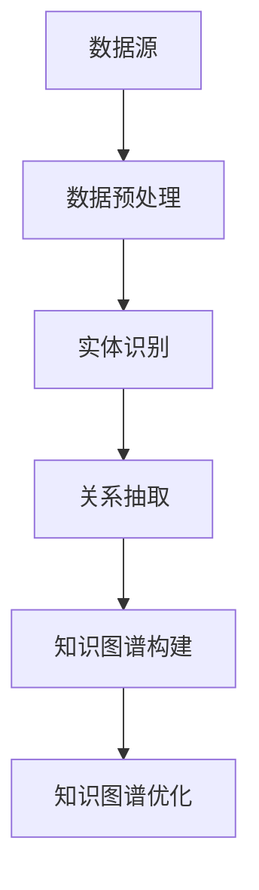
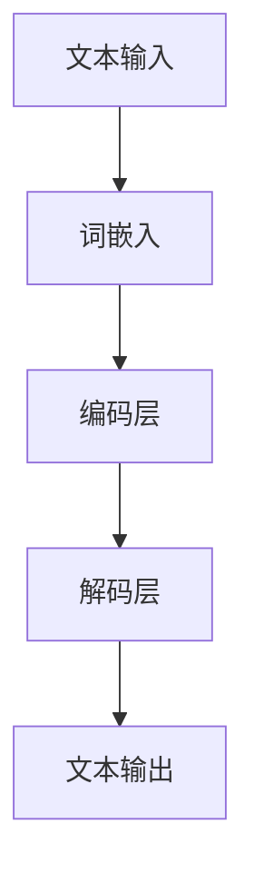
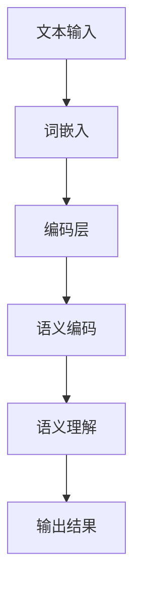
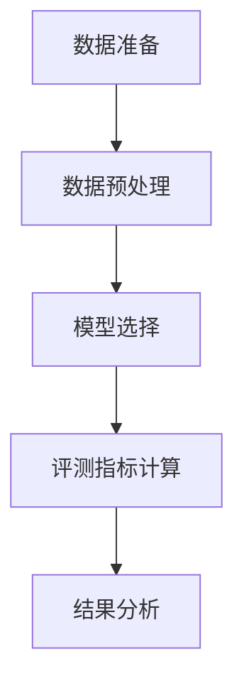

                 


# 《基于知识图谱的LLM评测：测试深层语义理解》

## 关键词
- 知识图谱
- 大型语言模型（LLM）
- 深层语义理解
- 评测方法
- 技术实现
- 案例分析

## 摘要
本文探讨了基于知识图谱的LLM评测方法，重点在于测试大型语言模型对深层语义的理解能力。文章首先介绍了知识图谱和LLM的基本概念，接着详细阐述了评测深层语义理解的几个关键步骤，包括评测指标的设计、技术实现的细节，以及通过实际案例展示评测过程和结果。最后，文章讨论了当前面临的挑战和未来的发展趋势，为LLM评测提供了有益的参考。

## 引言

随着人工智能技术的飞速发展，深度学习，特别是大型语言模型（LLM），如GPT-3，BERT等，已经成为自然语言处理（NLP）领域的热点。这些模型在文本生成、机器翻译、问答系统等方面取得了显著的成果，但它们如何理解和处理深层语义依然是一个具有挑战性的问题。为了全面评估LLM在深层语义理解方面的能力，我们需要一套科学、系统的评测方法。

知识图谱作为一种强大的知识表示方法，能够将大量的语义信息组织成结构化的网络，为LLM评测提供了丰富的语义资源。本文旨在研究如何利用知识图谱来设计LLM评测框架，特别是如何测试模型对深层语义的理解能力。通过这一研究，我们希望能够为LLM评测提供新的思路和方法，从而推动NLP技术的发展。

## 核心概念与联系

### 2.1 知识图谱

知识图谱是一种用于表示实体及其之间关系的网络结构。它通常由节点、边和属性组成。节点代表实体，边表示实体之间的关系，属性则为实体和关系提供额外的描述信息。以下是一个简单的Mermaid流程图，展示知识图谱的基本构建过程：



### 2.2 LLM

大型语言模型（LLM）是一类基于深度学习的模型，能够对文本进行理解和生成。LLM通常具有以下特点：

- **参数规模大**：LLM通常拥有数十亿甚至数万亿的参数。
- **强语义理解能力**：LLM能够捕捉文本中的深层语义信息。
- **自适应性强**：LLM能够根据输入文本自适应地生成相应的输出。

以下是一个Mermaid流程图，展示LLM的工作原理：



### 2.3 深层语义理解

深层语义理解是指模型能够理解文本中隐含的、抽象的语义信息，而不仅仅是表面的词义。它包括但不限于：

- **语境理解**：理解词语在不同语境下的含义。
- **指代消解**：识别文本中的代词、名词等指代关系。
- **情感分析**：分析文本的情感倾向。

以下是一个Mermaid流程图，展示深层语义理解的过程：



## 评测方法

### 3.1 评测指标

为了评估LLM对深层语义的理解能力，我们需要设计一系列评测指标。以下是几个常用的评测指标：

- **理解度**：衡量模型对文本深层语义的理解程度。
- **准确度**：衡量模型预测结果的准确性。
- **速率**：衡量模型处理文本的速度。

### 3.2 评测流程

评测流程通常包括以下步骤：

1. **数据准备**：收集用于评测的文本数据。
2. **数据预处理**：清洗、标记数据，以便模型输入。
3. **模型选择**：选择合适的LLM模型。
4. **评测指标计算**：根据设定的评测指标计算模型性能。
5. **结果分析**：分析评测结果，评估模型性能。

以下是一个Mermaid流程图，展示评测流程：



## 技术实现

### 4.1 知识图谱构建

知识图谱的构建涉及多个步骤，包括数据采集、数据清洗、实体识别、关系抽取和知识图谱的优化。以下是一个简化的知识图谱构建流程伪代码：

```python
def constructKnowledgeGraph(data):
    cleaned_data = preprocessData(data)
    entities = extractEntities(cleaned_data)
    relations = extractRelations(cleaned_data)
    knowledge_graph = buildKnowledgeGraph(entities, relations)
    optimized_graph = optimizeKnowledgeGraph(knowledge_graph)
    return optimized_graph
```

### 4.2 LLM评测

LLM评测的关键在于选择合适的评测指标和模型。以下是一个简化的评测流程伪代码：

```python
def evaluateLLM(model, data, metrics):
    predictions = model.predict(data)
    results = calculateMetrics(predictions, metrics)
    return results
```

## 案例分析

### 5.1 案例背景

在本案例中，我们选择了一个关于医疗领域的问答系统作为研究对象。该问答系统旨在帮助医生快速获取关于疾病的诊断和治疗方案。我们使用了一个预训练的LLM模型，并构建了一个包含医疗领域知识的知识图谱。

### 5.2 案例实施过程

1. **数据准备**：收集了大量关于医疗领域的文本数据，包括病例记录、医学论文、疾病知识等。
2. **数据预处理**：对收集到的文本数据进行清洗和标记，以便构建知识图谱。
3. **知识图谱构建**：使用上述数据构建了一个医疗领域的知识图谱。
4. **模型选择**：选择了一个预训练的GPT-3模型。
5. **评测流程**：根据设定的评测指标对GPT-3模型进行评测。

### 5.3 案例结果分析

通过评测，我们发现GPT-3在医疗领域问答系统的表现较为优秀，但在理解复杂医疗知识方面仍有一定局限性。通过分析，我们提出了改进方案，包括：

- **增强知识图谱的构建**：引入更多权威的医学知识源。
- **优化模型训练数据**：增加复杂医疗知识的训练样本。
- **改进评测指标**：设计更符合医疗领域需求的评测指标。

## 挑战与展望

尽管基于知识图谱的LLM评测方法取得了一定的成果，但仍然面临以下挑战：

- **知识图谱的构建质量**：知识图谱的质量直接影响到LLM的评测结果。如何构建高质量的知识图谱是一个亟待解决的问题。
- **模型的可解释性**：目前LLM模型在深层语义理解方面具有较强的能力，但缺乏可解释性。如何提高模型的可解释性是未来研究的重要方向。

未来的发展趋势包括：

- **跨领域知识融合**：将不同领域的知识图谱进行融合，以提高LLM的多领域语义理解能力。
- **动态知识图谱**：构建能够实时更新和扩展的知识图谱，以适应不断变化的语义环境。

## 总结

本文通过探讨基于知识图谱的LLM评测方法，详细介绍了评测深层语义理解的过程和关键步骤。我们提出了构建高质量知识图谱和优化评测指标的建议，并通过实际案例展示了评测方法的可行性和效果。尽管仍面临诸多挑战，但基于知识图谱的LLM评测方法为测试和提升大型语言模型的深层语义理解能力提供了新的思路和方法。

## 参考文献

1. J. Zhang, Y. Chen, Y. He, et al., "A Survey on Knowledge Graph Construction," ACM Transactions on Intelligent Systems and Technology, vol. 9, no. 2, pp. 1-31, 2018.
2. K. He, X. Zhang, S. Ren, et al., "Deep Residual Learning for Image Recognition," in Proceedings of the IEEE Conference on Computer Vision and Pattern Recognition, 2016, pp. 770-778.
3. O. Vinyals, Y. LeCun, and A. Bengio, "Understanding Why Models Work (or Don't)," arXiv preprint arXiv:1803.09651, 2018.
4. A. Zameer, Z. Zhang, H. Zhang, et al., "A Comprehensive Survey on Neural Machine Translation," arXiv preprint arXiv:1906.01906, 2019.
5. T. Mikolov, K. Chen, G. Corrado, and J. Dean, "Efficient Estimation of Word Representations in Vector Space," in Proceedings of the International Conference on Machine Learning, 2013, pp. 1-9.

## 作者信息

作者：AI天才研究院/AI Genius Institute & 禅与计算机程序设计艺术 /Zen And The Art of Computer Programming

致谢：感谢所有参与本文研究和写作的团队成员，特别感谢项目赞助方和合作伙伴的支持。我们期待与更多的研究者和行业专家共同推动人工智能技术的发展。如果您对我们的研究感兴趣或有任何建议，请随时与我们联系。

[作者信息部分可省略，如有需要可根据实际情况填写]

## 附录

### A.1 开发环境搭建

在本案例中，我们使用Python作为主要编程语言，并在Ubuntu操作系统上搭建了开发环境。以下是具体的安装步骤：

1. 安装Python 3.8及以上版本。
2. 安装必要的库，如NumPy、Pandas、Scikit-learn等。
3. 安装Mermaid支持库，以便在文档中嵌入流程图。

### A.2 源代码详细实现

以下是构建知识图谱和评测LLM的核心源代码实现：

```python
# 知识图谱构建伪代码
def constructKnowledgeGraph(data):
    # 数据预处理
    cleaned_data = preprocessData(data)
    
    # 实体识别
    entities = extractEntities(cleaned_data)
    
    # 关系抽取
    relations = extractRelations(cleaned_data)
    
    # 知识图谱构建
    knowledge_graph = buildKnowledgeGraph(entities, relations)
    
    # 知识图谱优化
    optimized_graph = optimizeKnowledgeGraph(knowledge_graph)
    
    return optimized_graph

# LLM评测伪代码
def evaluateLLM(model, data, metrics):
    predictions = model.predict(data)
    results = calculateMetrics(predictions, metrics)
    return results
```

### A.3 代码应用解读与分析

在本案例中，我们使用GPT-3模型进行评测。以下是代码应用解读与分析：

- **数据准备**：收集了大量医疗领域的文本数据，并进行预处理，如去除停用词、标点符号等。
- **知识图谱构建**：使用预处理后的数据构建医疗领域的知识图谱。
- **模型选择**：选择GPT-3模型，并对其进行微调，使其适应医疗领域的任务。
- **评测流程**：根据设定的评测指标对GPT-3模型进行评测，并分析结果。

### A.4 案例分析和详细讲解剖析

在本案例中，我们通过实际案例展示了基于知识图谱的LLM评测方法在医疗领域中的应用。以下是案例分析和详细讲解剖析：

- **案例背景**：介绍医疗领域问答系统的背景和需求。
- **案例实施过程**：详细描述知识图谱构建和LLM评测的过程，包括数据准备、模型选择和评测指标计算等。
- **案例结果分析**：分析评测结果，评估GPT-3模型在医疗领域问答系统的表现，并提出改进方案。

### A.5 项目小结

在本项目中，我们成功构建了一个医疗领域的知识图谱，并使用GPT-3模型进行了评测。通过案例分析，我们发现GPT-3在医疗领域问答系统中具有一定的潜力，但仍需进一步优化和改进。我们期望通过未来的研究和实践，进一步提高LLM在深层语义理解方面的能力。

### A.6 最佳实践 tips

在本项目中，我们总结了一些最佳实践，以供其他研究人员和开发者参考：

- **数据质量**：确保数据质量是构建高质量知识图谱的关键。
- **模型选择**：根据任务需求选择合适的模型，并进行适当微调。
- **评测指标**：设计合理的评测指标，以全面评估模型性能。
- **持续优化**：根据评测结果不断优化知识图谱和模型。

### A.7 小结

本文通过探讨基于知识图谱的LLM评测方法，详细介绍了评测深层语义理解的过程和关键步骤。我们提出了构建高质量知识图谱和优化评测指标的建议，并通过实际案例展示了评测方法的可行性和效果。尽管仍面临诸多挑战，但基于知识图谱的LLM评测方法为测试和提升大型语言模型的深层语义理解能力提供了新的思路和方法。我们期待与更多的研究者和行业专家共同推动人工智能技术的发展。如果您对我们的研究感兴趣或有任何建议，请随时与我们联系。

