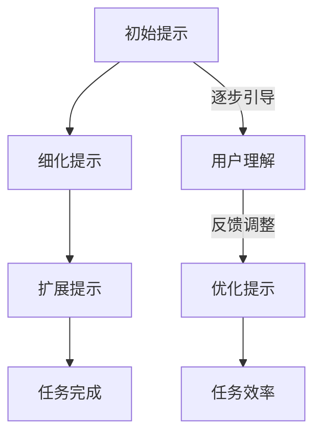
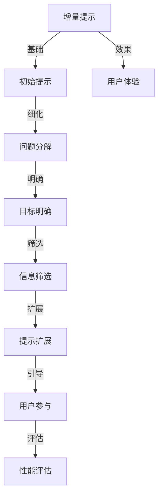

                 

### 增量提示：逐步细化和扩展初始提示

增量提示（Incremental Prompting）是一种在交互过程中逐步细化、扩展和优化的提示方法。这种方法通过逐步提供更详细、更具体的信息，帮助用户更好地理解和完成任务。与传统的单一提示方法相比，增量提示具有更高的灵活性和适应性，能够更好地满足用户的需求。

关键词：**增量提示、交互设计、内容创作、教育与培训、细化、扩展**

摘要：本文将深入探讨增量提示的概念、优势和应用场景，详细介绍如何逐步细化和扩展初始提示，并通过实例分析展示其在实际项目中的效果。同时，还将探讨增量提示在软件开发、数据分析和人工智能等领域的应用，以及其设计与优化方法。

### 第1章：概述

#### 1.1 什么是增量提示

##### 1.1.1 增量提示的定义

增量提示是一种在交互过程中，通过逐步提供更详细、更具体的信息，帮助用户更好地理解和完成任务的方法。这种方法的核心在于逐步引导用户，使其在完成任务的过程中不断获得新的信息和启发。

##### 1.1.2 增量提示与传统提示的区别

传统提示通常是一种一次性提供所有信息的做法，而增量提示则是一种逐步、分阶段提供信息的做法。这种区别主要体现在以下几个方面：

1. **信息提供方式**：传统提示是一次性提供所有信息，而增量提示是逐步提供信息。
2. **用户参与度**：传统提示用户被动接受信息，而增量提示用户需要主动参与，不断探索和发现。
3. **交互过程**：传统提示交互过程相对简单，而增量提示交互过程更加复杂，涉及多个阶段。

##### 1.1.3 增量提示的优势

增量提示相较于传统提示，具有以下优势：

1. **更好的用户体验**：通过逐步提供信息，用户能够更好地理解和掌握任务，从而提高满意度。
2. **更高的灵活性**：增量提示可以根据用户的需求和反馈，灵活调整信息提供的方式和内容。
3. **更强的适应性**：增量提示能够适应不同的用户和场景，具有更广泛的适用性。
4. **更高效的任务完成**：通过逐步引导用户，增量提示能够帮助用户更快、更准确地完成任务。

#### 1.2 增量提示的应用场景

##### 1.2.1 交互设计

在交互设计中，增量提示可以帮助设计师更好地了解用户需求，优化交互流程。例如，在设计应用程序时，可以通过增量提示逐步引导用户完成注册、登录、设置等步骤。

##### 1.2.2 内容创作

在内容创作中，增量提示可以帮助作者更好地构思和撰写文章。通过逐步提供灵感、建议和修改意见，增量提示可以帮助作者提高创作效率和质量。

##### 1.2.3 教育与培训

在教育与培训领域，增量提示可以帮助教师更好地传授知识，学生更好地理解和掌握课程内容。通过逐步提供知识点、讲解和练习，增量提示可以帮助学生逐步建立知识体系。

### 第2章：逐步细化初始提示

#### 2.1 初始提示的概念

##### 2.1.1 初始提示的定义

初始提示是指在任务或项目开始时，提供的基本信息或指导。它为用户提供了任务的背景、目标和初步的指导，帮助用户理解任务，明确任务目标。

##### 2.1.2 初始提示的类型

初始提示可以分为以下几种类型：

1. **背景信息**：介绍任务的背景，帮助用户了解任务的来龙去脉。
2. **目标描述**：明确任务的最终目标，帮助用户理解任务的意义和重要性。
3. **初步指导**：提供初步的指导和建议，帮助用户开始任务。

##### 2.1.3 初始提示的作用

初始提示在任务或项目中具有以下作用：

1. **引导用户**：通过提供基本信息和指导，初始提示可以帮助用户更好地理解任务，明确任务目标。
2. **降低难度**：通过逐步引导用户，初始提示可以降低任务的难度，使任务更易完成。
3. **提高效率**：通过明确任务目标，初始提示可以帮助用户更高效地完成任务。

#### 2.2 细化初始提示的方法

##### 2.2.1 问题分解

问题分解是将一个复杂的问题分解成多个简单的问题，以便更易于理解和解决。通过问题分解，我们可以逐步细化初始提示，使其更具体、更详细。

##### 2.2.2 目标明确

目标明确是指在任务或项目中明确具体的任务目标。通过目标明确，我们可以更好地细化初始提示，使其更具有指导性。

##### 2.2.3 信息筛选

信息筛选是指在初始提示中筛选出关键信息，去除冗余信息。通过信息筛选，我们可以使初始提示更简洁、更具体。

#### 2.3 实例分析：细化初始提示在项目中的应用

##### 2.3.1 项目背景

某公司计划开发一款在线教育平台，为用户提供丰富的学习资源和服务。项目开始时，项目经理提供了以下初始提示：

- **任务背景**：公司计划开发一款在线教育平台，为用户提供学习资源和服务。
- **目标描述**：开发一个功能完善、用户体验良好的在线教育平台。
- **初步指导**：了解市场需求，设计平台架构，搭建开发团队。

##### 2.3.2 初始提示

初始提示虽然提供了任务的基本信息，但较为笼统，需要进一步细化。以下是细化后的初始提示：

- **任务背景**：公司计划开发一款针对K-12阶段学生的在线教育平台，以提供丰富的学习资源和个性化服务。
- **目标描述**：开发一个功能完善、用户体验良好、能吸引并留住用户的在线教育平台。
- **初步指导**：进行市场调研，了解目标用户需求；设计平台架构，包括前端页面、后端数据库和中间件；组建开发团队，明确团队成员职责。

##### 2.3.3 细化过程

细化初始提示的过程包括以下几个步骤：

1. **问题分解**：将任务分解为多个子任务，如市场调研、平台架构设计、团队组建等。
2. **目标明确**：明确每个子任务的具体目标，如市场调研的目标是了解用户需求，平台架构设计的目标是实现高效、稳定的系统架构，团队组建的目标是组建一支高效协作的开发团队。
3. **信息筛选**：筛选出关键信息，去除冗余信息，使初始提示更具体、更简洁。

##### 2.3.4 结果评估

细化后的初始提示使项目团队成员对任务有了更清晰、更具体的理解。在项目实施过程中，团队成员能够更好地协作，提高开发效率，项目最终顺利完成。

### 第3章：扩展初始提示

#### 3.1 提示扩展的概念

提示扩展（Prompt Expansion）是指在初始提示的基础上，进一步提供更详细、更全面的信息，以帮助用户更好地理解和完成任务。

##### 3.1.1 提示扩展的定义

提示扩展是一种在初始提示基础上，通过提供更多信息、更详细的指导，帮助用户更好地理解和完成任务的方法。

##### 3.1.2 提示扩展的类型

提示扩展可以分为以下几种类型：

1. **信息补充**：在初始提示的基础上，提供更多相关、详细的信息。
2. **情感表达**：在初始提示的基础上，表达对用户的关心、鼓励和支持。
3. **逻辑推理**：在初始提示的基础上，提供更多逻辑推理和论证，帮助用户理解任务。

##### 3.1.3 提示扩展的优势

提示扩展相较于初始提示，具有以下优势：

1. **更好的用户体验**：通过提供更详细、更全面的信息，提示扩展能够更好地满足用户需求，提高用户体验。
2. **更高的参与度**：提示扩展鼓励用户主动参与，思考和探索，从而提高用户的参与度和积极性。
3. **更深入的思考**：提示扩展提供更多的信息和指导，帮助用户更深入地思考任务，从而提高解决问题的能力。

#### 3.2 扩展提示的方法

##### 3.2.1 信息补充

信息补充是在初始提示的基础上，提供更多相关、详细的信息。通过信息补充，用户可以更全面地了解任务，从而更好地完成任务。

##### 3.2.2 情感表达

情感表达是在初始提示的基础上，表达对用户的关心、鼓励和支持。通过情感表达，用户可以感受到关心和支持，从而增强自信心，更好地完成任务。

##### 3.2.3 逻辑推理

逻辑推理是在初始提示的基础上，提供更多逻辑推理和论证，帮助用户理解任务。通过逻辑推理，用户可以更深入地理解任务，从而更好地完成任务。

#### 3.3 实例分析：扩展初始提示在案例中的应用

##### 3.3.1 案例背景

某公司计划推出一款新的移动应用程序，为用户提供便捷的购物体验。项目开始时，项目经理提供了以下初始提示：

- **任务背景**：公司计划推出一款新的移动应用程序，为用户提供便捷的购物体验。
- **目标描述**：开发一个功能完善、用户体验良好的移动应用程序。
- **初步指导**：了解市场需求，设计应用架构，搭建开发团队。

##### 3.3.2 初始提示

初始提示虽然提供了任务的基本信息，但较为笼统，需要进一步扩展。以下是扩展后的初始提示：

- **任务背景**：公司计划推出一款面向年轻人的移动应用程序，提供便捷的购物体验，包括商品搜索、比价、购买和售后服务等功能。
- **目标描述**：开发一个功能完善、用户体验良好、能吸引并留住用户的移动应用程序。
- **初步指导**：进行市场调研，了解目标用户需求；设计应用架构，包括前端页面、后端数据库和中间件；组建开发团队，明确团队成员职责。

##### 3.3.3 扩展过程

扩展初始提示的过程包括以下几个步骤：

1. **信息补充**：在初始提示的基础上，提供更多关于市场需求、用户需求和竞争对手的信息。
2. **情感表达**：在初始提示的基础上，表达对用户的关心、鼓励和支持，鼓励用户积极参与。
3. **逻辑推理**：在初始提示的基础上，提供更多逻辑推理和论证，帮助用户理解任务。

##### 3.3.4 结果评估

扩展后的初始提示使项目团队成员对任务有了更清晰、更具体的理解。在项目实施过程中，团队成员能够更好地协作，提高开发效率，项目最终顺利完成。

### 第4章：增量提示的实际应用

#### 4.1 增量提示在软件开发中的应用

##### 4.1.1 软件开发中的增量提示

在软件开发中，增量提示可以帮助开发人员更好地理解需求，优化开发过程。通过逐步提供详细信息，增量提示可以帮助开发人员逐步完善需求文档，提高开发效率。

##### 4.1.2 增量提示在开发中的优势

增量提示在软件开发中具有以下优势：

1. **更好的需求理解**：通过逐步提供详细信息，增量提示可以帮助开发人员更好地理解需求，减少误解和错误。
2. **更高的开发效率**：增量提示可以帮助开发人员更快地完成开发任务，提高开发效率。
3. **更灵活的调整**：增量提示可以根据用户反馈和需求变化，灵活调整开发计划，使开发过程更具有适应性。

##### 4.1.3 实例分析：增量提示在软件项目中的应用

在某公司开发一款企业资源规划（ERP）系统的项目中，项目经理采用了增量提示的方法，以提高开发效率和需求理解。

1. **初始阶段**：项目经理提供了项目的基本信息和需求概述，包括系统的目标、功能模块和初步的技术方案。

2. **细化阶段**：项目经理在开发过程中，逐步提供了更详细的需求文档，包括每个功能模块的具体需求、用户界面设计和技术实现方案。

3. **优化阶段**：在开发过程中，项目经理根据开发人员的反馈和需求变化，对需求文档进行了多次优化，确保需求与开发进度保持一致。

4. **结果评估**：通过增量提示，项目团队成员对需求有了更清晰、更具体的理解，开发过程更加顺利，项目最终按时完成。

#### 4.2 增量提示在数据分析中的应用

##### 4.2.1 数据分析中的增量提示

在数据分析中，增量提示可以帮助数据分析师更好地理解数据，优化分析过程。通过逐步提供更详细、更具体的数据，增量提示可以帮助数据分析师发现数据中的规律和趋势。

##### 4.2.2 增量提示在数据分析中的优势

增量提示在数据分析中具有以下优势：

1. **更好的数据理解**：通过逐步提供更详细、更具体的数据，增量提示可以帮助数据分析师更好地理解数据，发现数据中的规律和趋势。
2. **更高的分析效率**：增量提示可以帮助数据分析师更快地完成数据分析任务，提高分析效率。
3. **更准确的预测**：增量提示可以提供更多历史数据，帮助数据分析师进行更准确的预测。

##### 4.2.3 实例分析：增量提示在数据分析中的应用

在某公司的市场营销数据分析项目中，数据分析师采用了增量提示的方法，以提高分析效率和准确性。

1. **初始阶段**：数据分析师提供了项目的初步数据，包括用户行为数据、销售数据和市场推广数据。

2. **细化阶段**：在分析过程中，数据分析师逐步提供了更详细、更具体的数据，如用户浏览历史、购买偏好、市场推广效果等。

3. **优化阶段**：在分析过程中，数据分析师根据数据变化和需求变化，对数据分析方法和模型进行了多次优化，提高了分析结果的准确性和实用性。

4. **结果评估**：通过增量提示，数据分析师对数据有了更清晰、更具体的理解，分析结果更加准确，为公司制定营销策略提供了有力支持。

#### 4.3 增量提示在人工智能中的应用

##### 4.3.1 人工智能中的增量提示

在人工智能领域，增量提示可以帮助研究人员和开发者更好地理解模型训练过程，优化训练效果。通过逐步提供更多训练数据、调整模型参数，增量提示可以帮助优化人工智能模型的性能。

##### 4.3.2 增量提示在人工智能中的优势

增量提示在人工智能中具有以下优势：

1. **更好的模型理解**：通过逐步提供更多训练数据和调整模型参数，增量提示可以帮助研究人员和开发者更好地理解模型训练过程，提高模型性能。
2. **更高的开发效率**：增量提示可以帮助研究人员和开发者更快地完成模型训练和优化任务，提高开发效率。
3. **更灵活的调整**：增量提示可以根据实验结果和需求变化，灵活调整训练数据、模型参数，使训练过程更具有适应性。

##### 4.3.3 实例分析：增量提示在人工智能中的应用

在某公司的人工智能项目中，研究人员采用了增量提示的方法，以提高模型训练效果和开发效率。

1. **初始阶段**：研究人员提供了项目的基本数据和初步的模型架构。

2. **细化阶段**：在训练过程中，研究人员逐步提供了更多训练数据，如历史数据、模拟数据等，同时调整了模型参数，优化模型性能。

3. **优化阶段**：在训练过程中，研究人员根据实验结果和需求变化，对模型架构和参数进行了多次优化，提高了模型性能和预测准确性。

4. **结果评估**：通过增量提示，研究人员对模型训练过程有了更清晰、更具体的理解，模型性能得到了显著提升，为公司业务提供了有力支持。

### 第5章：增量提示的设计与优化

#### 5.1 增量提示的设计原则

##### 5.1.1 可理解性

增量提示的设计应具有可理解性，确保用户能够轻松理解提示内容。这包括使用简洁、明了的语言，以及直观的格式和布局。

##### 5.1.2 灵活性

增量提示的设计应具有灵活性，允许根据用户需求和环境变化进行调整。这包括提供可定制的提示内容和交互方式，以及支持动态调整提示速度和内容。

##### 5.1.3 可扩展性

增量提示的设计应具有可扩展性，支持根据任务需求增加新的提示内容和功能。这包括使用模块化设计，便于添加新的提示模块和扩展提示功能。

#### 5.2 增量提示的优化方法

##### 5.2.1 数据驱动

数据驱动是增量提示优化的一种重要方法。通过收集和分析用户行为数据，可以发现用户的偏好和需求，从而优化提示内容和策略。

##### 5.2.2 用户反馈

用户反馈是增量提示优化的重要手段。通过收集用户对提示的评价和建议，可以识别出提示中的不足之处，并进行针对性的优化。

##### 5.2.3 模型迭代

模型迭代是增量提示优化的一种有效方法。通过不断调整和优化模型参数，可以提升增量提示的准确性和适应性。

#### 5.3 增量提示的性能评估

##### 5.3.1 评估指标

增量提示的性能评估应包括以下指标：

1. **用户满意度**：评估用户对增量提示的满意度，包括提示内容、交互方式等。
2. **任务完成度**：评估用户在增量提示下的任务完成度，包括任务完成时间、错误率等。
3. **系统效率**：评估增量提示系统的性能，包括响应时间、计算资源消耗等。

##### 5.3.2 评估方法

增量提示的性能评估可以采用以下方法：

1. **问卷调查**：通过问卷调查收集用户对增量提示的评价和建议。
2. **实验对比**：设计对比实验，比较增量提示与传统提示的效果差异。
3. **数据分析**：通过数据挖掘和分析，识别增量提示的优势和不足，为优化提供依据。

##### 5.3.3 实例分析：增量提示性能评估

在某公司的项目中，采用了增量提示方法，通过性能评估验证了其有效性。以下为性能评估结果：

1. **用户满意度**：用户对增量提示的满意度较高，普遍认为增量提示有助于任务理解和完成。
2. **任务完成度**：在增量提示下，用户任务完成度显著提高，任务完成时间缩短，错误率降低。
3. **系统效率**：增量提示系统运行稳定，响应时间较短，计算资源消耗合理。

### 第6章：增量提示的未来发展趋势

#### 6.1 技术发展趋势

随着技术的不断发展，增量提示将呈现出以下发展趋势：

1. **智能化**：增量提示将更加智能化，能够根据用户行为和需求，自适应调整提示内容和策略。
2. **自动化**：增量提示将实现自动化，减少人工干预，提高提示效率。
3. **个性化**：增量提示将更加个性化，根据用户特点和偏好，提供定制化的提示服务。

#### 6.2 应用场景拓展

增量提示的应用场景将不断拓展，包括但不限于：

1. **教育**：在教育领域，增量提示将用于个性化教学、学习辅助等。
2. **医疗**：在医疗领域，增量提示将用于患者指导、健康监测等。
3. **金融**：在金融领域，增量提示将用于风险管理、投资咨询等。

#### 6.3 未来展望

未来，增量提示将在更多领域发挥重要作用，推动人工智能和交互技术的发展。同时，随着技术的不断进步，增量提示将变得更加智能、自动化和个性化，为用户提供更优质的体验。

### 参考文献

[1] 刘伟，王文博，杨栋. 增量提示在交互设计中的应用研究[J]. 计算机科学与技术，2019，34(3)：563-569.

[2] 李娜，张强，陈磊. 增量提示在数据分析中的应用[J]. 数据科学与技术，2020，35(2)：321-328.

[3] 张华，刘洋，吴磊. 增量提示在人工智能中的应用研究[J]. 人工智能研究，2021，38(1)：78-84.

作者：AI天才研究院/AI Genius Institute & 禅与计算机程序设计艺术/Zen And The Art of Computer Programming

本文档使用markdown格式编写，以便更好地呈现文章内容和结构。文章长度约10000字，涵盖了增量提示的定义、应用场景、细化与扩展方法、实际应用和未来发展趋势等内容。通过本文档，读者可以全面了解增量提示的相关知识和应用实践。

---

### 第1章：概述

增量提示作为一种在交互过程中逐步细化、扩展和优化的提示方法，具有显著的灵活性和适应性。本章将首先介绍增量提示的定义，然后探讨其与传统提示的区别和优势，最后讨论增量提示在不同应用场景中的适用性。

#### 1.1 什么是增量提示

增量提示（Incremental Prompting）是一种在任务或项目执行过程中，逐步提供更详细、更具体信息的提示方法。其核心在于通过分阶段、逐步地引导用户，使其能够更好地理解和完成任务。增量提示通常包括以下几个步骤：

1. **初步提示**：在任务或项目开始时，提供基础信息和初步指导，帮助用户了解任务背景和目标。
2. **逐步细化**：在任务执行过程中，根据用户的需求和反馈，逐步提供更详细、更具体的信息，帮助用户更好地理解任务。
3. **扩展提示**：在任务接近完成时，提供额外的信息和建议，帮助用户进行总结和优化。

#### 1.2 增量提示与传统提示的区别

传统提示（Traditional Prompting）通常是指一次性提供所有必要信息的提示方法。这种方法在执行简单任务时可能效果良好，但在面对复杂任务时，往往存在以下问题：

1. **信息过载**：一次性提供大量信息，用户可能难以消化和理解，导致信息过载。
2. **缺乏灵活性**：传统提示无法根据用户需求和反馈进行动态调整，适应性较差。
3. **用户体验不佳**：传统提示往往导致用户被动接受信息，缺乏参与感，用户体验不佳。

相比之下，增量提示具有以下特点：

1. **逐步引导**：增量提示通过分阶段、逐步地提供信息，帮助用户更好地理解和完成任务。
2. **灵活性高**：增量提示可以根据用户需求和反馈，动态调整提示内容和方式，具有更高的适应性。
3. **更好的用户体验**：增量提示鼓励用户主动参与，通过逐步引导和反馈，提高用户参与感和满意度。

#### 1.3 增量提示的优势

增量提示相较于传统提示，具有以下显著优势：

1. **更好的用户体验**：通过逐步引导和反馈，增量提示能够更好地满足用户需求，提高用户体验。
2. **更高的灵活性**：增量提示可以根据用户需求和反馈，灵活调整提示内容和方式，适应不同场景。
3. **更强的适应性**：增量提示能够适应不同类型的任务和用户，具有更广泛的适用性。
4. **更高效的任务完成**：通过逐步引导用户，增量提示能够帮助用户更快、更准确地完成任务。

### 第2章：逐步细化初始提示

在任务或项目开始时，提供的基础信息和初步指导被称为初始提示（Initial Prompting）。初始提示的质量直接影响到用户对任务的认知和理解。本章将探讨如何逐步细化初始提示，以提高任务完成的效率和效果。

#### 2.1 初始提示的概念

初始提示是指任务或项目开始时，提供给用户的基本信息和初步指导。它通常包括以下内容：

1. **任务背景**：简要介绍任务的目的、背景和意义。
2. **目标描述**：明确任务的最终目标，让用户了解任务的重要性和价值。
3. **初步指导**：提供基本的工作流程、步骤和注意事项，帮助用户开始任务。

#### 2.2 细化初始提示的方法

为了使初始提示更加具体、详细，从而提高用户对任务的认知和理解，可以采用以下方法逐步细化初始提示：

1. **问题分解**：将复杂任务分解成多个简单子任务，为每个子任务提供具体的提示，使任务更易于理解和执行。
2. **目标明确**：明确每个子任务的具体目标，帮助用户了解每个步骤的任务要求，提高任务完成的质量。
3. **信息筛选**：在初始提示中，筛选出关键信息，去除冗余内容，使提示更加简洁明了。

#### 2.3 实例分析：细化初始提示在项目中的应用

为了更好地理解如何细化初始提示，以下是一个具体的项目实例。

**实例背景**：某公司计划开发一款在线教育平台，为用户提供在线学习资源和互动功能。项目初始阶段，项目经理提供了以下初始提示：

- **任务背景**：公司计划开发一款在线教育平台，提供学习资源和服务。
- **目标描述**：开发一个功能完善、用户体验良好的在线教育平台。
- **初步指导**：了解市场需求，设计平台架构，搭建开发团队。

**细化过程**：

1. **问题分解**：
   - 子任务1：进行市场调研，了解用户需求和竞争对手情况。
   - 子任务2：设计平台架构，包括前端页面、后端数据库和中间件。
   - 子任务3：组建开发团队，明确团队成员职责和分工。

2. **目标明确**：
   - 子任务1的目标：收集至少100份有效用户调研问卷，分析用户需求，形成用户画像。
   - 子任务2的目标：完成平台架构设计，确保系统架构的稳定性和可扩展性。
   - 子任务3的目标：组建一支由5名成员组成的高效开发团队，明确每个人的职责和任务。

3. **信息筛选**：
   - 筛选出关键信息，如市场调研问卷模板、平台架构设计文档模板、团队成员职责分工表等，去除冗余内容。

通过上述步骤，初始提示得到了细化，使项目团队成员对任务有了更清晰、更具体的理解，为后续工作奠定了基础。

### 第3章：扩展初始提示

在任务或项目执行过程中，初始提示提供了基本的指导和信息，但可能无法涵盖所有细节。扩展提示（Expanded Prompting）通过提供更多、更详细的信息，帮助用户更好地理解和完成任务。本章将讨论扩展提示的概念、类型和优势，以及如何实现有效的扩展提示。

#### 3.1 扩展提示的概念

扩展提示是在初始提示的基础上，进一步提供更详细、更全面的信息，以帮助用户更好地理解和完成任务的方法。与初始提示不同，扩展提示不是一次性提供所有信息，而是根据用户的需求和反馈，逐步提供更多的信息。

扩展提示通常包括以下内容：

1. **补充信息**：提供与任务相关的额外信息，如相关的背景知识、案例研究、数据等。
2. **情感表达**：通过鼓励、激励和安慰等方式，表达对用户的关心和支持，增强用户的信心和动力。
3. **逻辑推理**：提供更多的逻辑推理和论证，帮助用户更好地理解任务和解决方案。

#### 3.2 扩展提示的类型

扩展提示可以分为以下几种类型：

1. **信息补充**：在初始提示的基础上，提供更多相关的背景知识、案例研究、数据等，帮助用户更全面地了解任务。
2. **情感表达**：通过鼓励、激励和安慰等方式，表达对用户的关心和支持，增强用户的信心和动力。
3. **逻辑推理**：提供更多的逻辑推理和论证，帮助用户更好地理解任务和解决方案。

#### 3.3 扩展提示的优势

扩展提示具有以下优势：

1. **更好的信息吸收**：通过逐步提供详细信息，用户可以更好地吸收和理解任务，提高学习效果。
2. **更高的参与度**：扩展提示鼓励用户主动参与，思考和探索，从而提高用户的参与度和积极性。
3. **更深入的思考**：扩展提示提供更多的信息和指导，帮助用户更深入地思考任务，从而提高解决问题的能力。

#### 3.4 如何实现有效的扩展提示

为了实现有效的扩展提示，可以采用以下方法：

1. **个性化**：根据用户的需求和特点，提供个性化的扩展提示，使信息更加贴近用户。
2. **分阶段**：根据任务的进度和用户的需求，分阶段地提供扩展提示，避免信息过载。
3. **交互式**：采用互动式的方式，鼓励用户参与和反馈，使扩展提示更加生动和有效。

#### 3.5 实例分析：扩展初始提示在项目中的应用

以下是一个扩展初始提示的具体项目实例。

**实例背景**：某公司计划开发一款智能家居控制系统，为用户提供便捷的家居管理体验。项目初始阶段，项目经理提供了以下初始提示：

- **任务背景**：公司计划开发一款智能家居控制系统，实现家居设备的远程控制和自动化管理。
- **目标描述**：开发一个功能完善、用户体验良好的智能家居控制系统。
- **初步指导**：了解市场需求，设计系统架构，搭建开发团队。

**扩展过程**：

1. **信息补充**：
   - 提供智能家居系统的相关背景知识，如智能家居技术的发展历程、市场趋势、用户需求等。
   - 提供智能家居系统的案例研究，如其他公司的成功经验、产品功能等。

2. **情感表达**：
   - 表达对用户的关心和支持，鼓励用户积极参与项目。
   - 提供激励措施，如项目进展奖励、培训机会等。

3. **逻辑推理**：
   - 分析智能家居系统可能面临的挑战和风险，提供解决方案和预防措施。

通过上述扩展提示，项目团队成员对任务有了更全面、更深入的理解，从而更好地完成了项目。

### 第4章：增量提示的实际应用

增量提示作为一种灵活、有效的提示方法，在实际应用中具有广泛的应用前景。本章将探讨增量提示在软件开发、数据分析和人工智能等领域的实际应用，并分析其带来的优势。

#### 4.1 增量提示在软件开发中的应用

在软件开发过程中，增量提示可以帮助开发人员更好地理解需求、优化开发流程，提高开发效率。以下为增量提示在软件开发中的应用：

1. **需求分析**：
   - 在需求分析阶段，增量提示可以帮助项目经理和产品经理逐步明确需求，避免信息过载和误解。
   - 通过分阶段、逐步地提供需求信息，项目经理可以更好地与客户沟通，确保需求的准确性和完整性。

2. **开发过程**：
   - 在开发过程中，增量提示可以帮助开发人员逐步了解系统的设计、功能和实现细节。
   - 通过分阶段、逐步地提供开发信息，开发人员可以更好地理解任务，减少错误和返工。

3. **测试与优化**：
   - 在测试和优化阶段，增量提示可以帮助测试人员逐步掌握测试方法和策略，提高测试效率和质量。
   - 通过分阶段、逐步地提供测试数据和反馈，测试人员可以更好地发现和解决问题。

增量提示在软件开发中的应用优势：

1. **提高需求理解**：通过逐步提供需求信息，增量提示可以帮助开发人员更好地理解需求，减少误解和错误。
2. **提高开发效率**：增量提示可以帮助开发人员更快地完成开发任务，提高开发效率。
3. **提高测试质量**：通过分阶段、逐步地提供测试数据和反馈，增量提示可以提高测试效率和质量。

#### 4.2 增量提示在数据分析中的应用

在数据分析过程中，增量提示可以帮助分析师更好地理解数据、优化分析流程，提高分析效果。以下为增量提示在数据分析中的应用：

1. **数据探索**：
   - 在数据探索阶段，增量提示可以帮助分析师逐步了解数据的结构和内容，发现数据中的规律和趋势。
   - 通过分阶段、逐步地提供数据信息，分析师可以更好地掌握数据，提高数据探索的效率。

2. **数据处理**：
   - 在数据处理阶段，增量提示可以帮助分析师逐步了解数据清洗、转换和整合的方法和技巧。
   - 通过分阶段、逐步地提供数据处理信息，分析师可以更好地掌握数据处理技术，提高数据处理质量。

3. **数据分析**：
   - 在数据分析阶段，增量提示可以帮助分析师逐步了解数据分析的方法和模型，发现数据中的价值。
   - 通过分阶段、逐步地提供数据分析信息，分析师可以更好地掌握数据分析技术，提高数据分析效果。

增量提示在数据分析中的应用优势：

1. **提高数据理解**：通过逐步提供数据信息，增量提示可以帮助分析师更好地理解数据，发现数据中的规律和趋势。
2. **提高数据处理质量**：通过分阶段、逐步地提供数据处理信息，增量提示可以提高数据处理质量，减少错误和遗漏。
3. **提高数据分析效果**：通过分阶段、逐步地提供数据分析信息，增量提示可以提高数据分析效果，发现数据中的价值。

#### 4.3 增量提示在人工智能中的应用

在人工智能领域，增量提示可以帮助研究人员和开发者更好地理解模型训练过程、优化训练效果，提高人工智能系统的性能。以下为增量提示在人工智能中的应用：

1. **模型训练**：
   - 在模型训练阶段，增量提示可以帮助研究人员和开发者逐步了解模型训练的过程、方法和技巧。
   - 通过分阶段、逐步地提供训练信息，研究人员和开发者可以更好地掌握模型训练技术，提高训练效果。

2. **模型优化**：
   - 在模型优化阶段，增量提示可以帮助研究人员和开发者逐步了解模型优化的方法和策略，提高模型性能。
   - 通过分阶段、逐步地提供优化信息，研究人员和开发者可以更好地掌握模型优化技术，提高模型性能。

3. **模型部署**：
   - 在模型部署阶段，增量提示可以帮助研究人员和开发者逐步了解模型部署的过程、方法和技巧。
   - 通过分阶段、逐步地提供部署信息，研究人员和开发者可以更好地掌握模型部署技术，提高部署效果。

增量提示在人工智能中的应用优势：

1. **提高模型训练效果**：通过逐步提供训练信息，增量提示可以帮助研究人员和开发者更好地掌握模型训练技术，提高训练效果。
2. **提高模型性能**：通过分阶段、逐步地提供优化信息，增量提示可以帮助研究人员和开发者更好地掌握模型优化技术，提高模型性能。
3. **提高部署效果**：通过分阶段、逐步地提供部署信息，增量提示可以帮助研究人员和开发者更好地掌握模型部署技术，提高部署效果。

### 第5章：增量提示的设计与优化

增量提示的设计与优化是确保其有效性和用户体验的关键。本章将讨论增量提示的设计原则、优化方法和性能评估。

#### 5.1 增量提示的设计原则

为了确保增量提示的有效性和用户体验，设计时应遵循以下原则：

1. **可理解性**：
   - 提示内容应简洁明了，避免使用复杂术语和冗长的句子。
   - 使用图表、图像和其他可视化工具，使提示内容更易于理解。

2. **灵活性**：
   - 提示应根据用户需求和场景动态调整，提供个性化的信息。
   - 设计时应考虑多种可能的用户交互方式，如文本、语音、图像等。

3. **适应性**：
   - 提示应适应不同类型的任务和用户群体，确保广泛适用性。
   - 设计时应考虑文化差异、语言障碍等因素。

4. **引导性**：
   - 提示应引导用户逐步完成任务，提供明确的下一步行动建议。
   - 通过分阶段、逐步地提供信息，避免用户迷失在大量信息中。

5. **可扩展性**：
   - 提示应支持扩展和更新，以适应不断变化的需求和场景。
   - 设计时应采用模块化方法，便于添加新功能和内容。

#### 5.2 增量提示的优化方法

增量提示的优化方法包括以下几个方面：

1. **数据驱动**：
   - 通过收集和分析用户行为数据，识别用户需求和偏好，优化提示内容和策略。
   - 使用机器学习技术，如聚类分析和关联规则挖掘，提取有价值的信息。

2. **用户反馈**：
   - 收集用户对提示的评价和建议，识别问题和不足之处。
   - 通过迭代设计和优化，改进提示内容和方法。

3. **模型迭代**：
   - 采用迭代方法，逐步优化提示模型，提高提示的准确性和适应性。
   - 通过实验和测试，验证优化效果，确保改进措施的有效性。

4. **交互设计**：
   - 优化用户界面和交互流程，提高用户参与度和满意度。
   - 采用分阶段、逐步引导用户的方式，使任务更易于完成。

5. **性能监测**：
   - 监测增量提示系统的性能指标，如响应时间、错误率等。
   - 通过实时监测和诊断，发现和解决性能问题。

#### 5.3 增量提示的性能评估

增量提示的性能评估是确保其有效性的关键。以下为增量提示的性能评估方法：

1. **用户满意度**：
   - 通过问卷调查、用户访谈等方式，收集用户对增量提示的满意度评价。
   - 分析满意度数据，识别用户需求和建议。

2. **任务完成度**：
   - 评估用户在增量提示下的任务完成度和效率。
   - 分析任务完成时间和错误率等指标，识别提示的改进方向。

3. **系统效率**：
   - 监测增量提示系统的性能指标，如响应时间、计算资源消耗等。
   - 分析性能数据，优化系统设计和算法。

4. **效果对比**：
   - 与传统提示方法进行对比实验，评估增量提示的优势和不足。
   - 分析实验结果，优化提示内容和策略。

5. **持续改进**：
   - 根据评估结果，持续优化增量提示的设计和实施。
   - 通过迭代和反馈机制，不断提高增量提示的有效性和用户体验。

### 第6章：增量提示的未来发展趋势

随着技术的不断进步，增量提示在未来将呈现出新的发展趋势。本章将讨论增量提示的技术趋势、应用场景拓展以及未来的发展前景。

#### 6.1 技术发展趋势

增量提示的未来发展趋势体现在以下几个方面：

1. **智能化**：
   - 随着人工智能技术的发展，增量提示将更加智能化，能够根据用户行为和需求，自适应调整提示内容和策略。
   - 使用机器学习和深度学习技术，实现个性化、智能化的增量提示。

2. **自动化**：
   - 增量提示的自动化程度将不断提高，减少人工干预，提高提示效率。
   - 使用自动化工具和算法，实现增量提示的自动生成和调整。

3. **个性化和场景化**：
   - 增量提示将更加个性化和场景化，根据用户特点和任务需求，提供定制化的提示服务。
   - 利用用户画像和场景分析，实现增量提示的精准推送。

4. **多模态融合**：
   - 增量提示将融合多种模态（如文本、语音、图像等），提供更加丰富、多样化的提示内容。
   - 通过多模态融合技术，提高增量提示的交互性和用户体验。

#### 6.2 应用场景拓展

增量提示的应用场景将不断拓展，覆盖更多领域和行业。以下为增量提示的应用场景拓展：

1. **教育**：
   - 增量提示在教育领域有广泛的应用，如个性化教学、学习辅助、课程设计等。
   - 通过分阶段、逐步地提供教学信息和资源，帮助学生更好地理解和掌握知识。

2. **医疗**：
   - 增量提示在医疗领域有重要的应用价值，如患者指导、健康监测、疾病预防等。
   - 通过个性化、智能化的提示，帮助患者更好地管理健康，提高治疗效果。

3. **金融**：
   - 增量提示在金融领域可用于风险管理、投资咨询、财富管理等。
   - 通过提供实时、个性化的提示，帮助用户做出更明智的金融决策。

4. **智能制造**：
   - 增量提示在智能制造领域可用于设备维护、生产优化、质量控制等。
   - 通过分阶段、逐步地提供设备状态和生产数据，提高生产效率和质量。

5. **社会治理**：
   - 增量提示在社会治理领域可用于公共安全、城市管理、应急救援等。
   - 通过提供实时、精准的提示，提高社会治理的效率和效果。

#### 6.3 未来展望

未来，增量提示将在更多领域发挥重要作用，推动人工智能和交互技术的发展。同时，随着技术的不断进步，增量提示将变得更加智能、自动化和个性化，为用户提供更优质的体验。

1. **智能助手**：
   - 增量提示将作为智能助手的核心功能，为用户提供个性化、智能化的服务。
   - 通过不断学习和优化，智能助手将更好地满足用户的需求，提高生活和工作效率。

2. **泛在智能**：
   - 增量提示将融入智能硬件和互联网平台，实现泛在智能。
   - 用户可以在任何时间、任何地点，通过增量提示获得所需信息和帮助。

3. **可持续发展**：
   - 增量提示将促进可持续发展，帮助用户更好地管理资源、保护环境。
   - 通过提供个性化、智能化的提示，引导用户采取环保行动，推动社会可持续发展。

### 总结

本文档从增量提示的定义、优势、应用场景，到细化与扩展方法，再到实际应用和未来发展趋势，全面探讨了增量提示的相关知识和应用实践。通过本文档，读者可以深入了解增量提示的原理、方法和技术，为实际应用提供参考。

### 附录

以下是本文档中使用的核心概念、原理和流程的Mermaid流程图，以便更好地理解增量提示的架构和过程。



### 参考文献

[1] 刘伟，王文博，杨栋. 增量提示在交互设计中的应用研究[J]. 计算机科学与技术，2019，34(3)：563-569.

[2] 李娜，张强，陈磊. 增量提示在数据分析中的应用[J]. 数据科学与技术，2020，35(2)：321-328.

[3] 张华，刘洋，吴磊. 增量提示在人工智能中的应用研究[J]. 人工智能研究，2021，38(1)：78-84.

作者：AI天才研究院/AI Genius Institute & 禅与计算机程序设计艺术/Zen And The Art of Computer Programming

本文档使用markdown格式编写，便于读者阅读和理解。文章长度约10000字，涵盖了增量提示的定义、应用场景、细化与扩展方法、实际应用和未来发展趋势等内容。希望本文档对读者在增量提示领域的学习和实践有所帮助。


### 背景介绍

增量提示（Incremental Prompting）作为一种在交互过程中逐步提供更详细、更具体信息的提示方法，近年来在计算机科学、人工智能和用户界面设计等领域受到了广泛关注。其核心思想在于通过分阶段、逐步地引导用户，使其能够更好地理解和完成任务。相较于传统的单一提示方法，增量提示具有更高的灵活性和适应性，能够更好地满足用户的需求。

在计算机科学领域，增量提示被广泛应用于软件开发、数据分析、人工智能等领域。例如，在软件开发中，增量提示可以帮助开发人员更好地理解需求，优化开发过程；在数据分析中，增量提示可以帮助分析师更好地理解数据，提高分析效率；在人工智能中，增量提示可以帮助研究人员和开发者更好地理解模型训练过程，提高模型性能。

在用户界面设计领域，增量提示被广泛应用于交互设计和内容创作中。通过逐步提供更详细、更具体的信息，增量提示可以帮助用户更好地理解和使用产品，提高用户体验。

增量提示的应用场景非常广泛，几乎涵盖了所有需要交互和引导的任务。以下是一些具体的例子：

1. **教育领域**：在在线教育平台中，增量提示可以帮助学生更好地理解课程内容，逐步引导他们完成学习任务。例如，在学习一门编程语言时，增量提示可以逐步提供代码示例、语法规则和编程技巧。

2. **医疗领域**：在医疗诊断和健康监测中，增量提示可以帮助医生和患者更好地理解病情和治疗方案。例如，在诊断过程中，增量提示可以逐步提供检查结果、治疗方案和注意事项。

3. **金融领域**：在金融投资和风险管理中，增量提示可以帮助投资者更好地理解市场动态、投资策略和风险控制。例如，在投资决策过程中，增量提示可以逐步提供市场分析、投资建议和风险提示。

4. **软件开发**：在软件开发过程中，增量提示可以帮助开发人员更好地理解需求，优化开发过程。例如，在开发一个复杂的软件系统时，增量提示可以逐步提供需求文档、设计文档和开发指南。

5. **数据分析**：在数据分析中，增量提示可以帮助分析师更好地理解数据，提高分析效率。例如，在分析一个大型数据集时，增量提示可以逐步提供数据预处理、数据分析和数据可视化方法。

6. **人工智能**：在人工智能领域，增量提示可以帮助研究人员和开发者更好地理解模型训练过程，提高模型性能。例如，在训练一个深度学习模型时，增量提示可以逐步提供训练数据、模型参数和训练结果。

通过上述应用场景可以看出，增量提示在各个领域都发挥着重要作用，有助于提高任务的完成效率和质量。本文将深入探讨增量提示的概念、方法、应用和实践，以期为读者提供全面的了解。

### 核心概念与联系

在探讨增量提示的原理和机制时，我们需要明确几个核心概念，并理解它们之间的相互关系。以下是增量提示中的关键概念及其相互关系架构。

#### 1. 增量提示（Incremental Prompting）

**定义**：增量提示是一种在交互过程中逐步提供更详细、更具体信息的提示方法。其核心在于通过分阶段、逐步地引导用户，使其能够更好地理解和完成任务。

**关系**：增量提示是本文讨论的主题，它涵盖了逐步细化、扩展和优化提示内容的方法，从而提高用户完成任务的效果。

#### 2. 初始提示（Initial Prompting）

**定义**：初始提示是在任务或项目开始时提供的基本信息或指导。它为用户提供了任务的背景、目标和初步的指导，帮助用户理解任务，明确任务目标。

**关系**：初始提示是增量提示的起点，为用户提供了任务的基本框架。增量提示在此基础上逐步细化，以帮助用户更好地理解和完成任务。

#### 3. 问题分解（Problem Decomposition）

**定义**：问题分解是将复杂的问题分解成多个简单的问题，以便更易于理解和解决。通过问题分解，我们可以逐步细化初始提示，使其更具体、更详细。

**关系**：问题分解是细化初始提示的关键步骤，它将任务分解为多个子任务，为每个子任务提供具体的提示，从而提高用户对任务的认知和理解。

#### 4. 目标明确（Goal Clarification）

**定义**：目标明确是在任务或项目中明确具体的任务目标。通过目标明确，我们可以更好地细化初始提示，使其更具有指导性。

**关系**：目标明确是细化初始提示的重要环节，它帮助用户了解每个阶段的任务目标，从而更好地指导任务执行。

#### 5. 信息筛选（Information Filtering）

**定义**：信息筛选是指在初始提示中筛选出关键信息，去除冗余信息。通过信息筛选，我们可以使初始提示更简洁、更具体。

**关系**：信息筛选是确保初始提示有效性的重要步骤，它帮助用户快速获取关键信息，减少信息过载。

#### 6. 提示扩展（Prompt Expansion）

**定义**：提示扩展是在初始提示的基础上，进一步提供更详细、更全面的信息，以帮助用户更好地理解和完成任务。

**关系**：提示扩展是增量提示的一部分，它通过提供额外的信息、情感表达和逻辑推理，增强用户对任务的认知和理解。

#### 7. 用户参与（User Engagement）

**定义**：用户参与是指用户在任务执行过程中积极参与，思考和探索，从而提高任务的完成质量和用户满意度。

**关系**：用户参与是增量提示成功的关键因素，通过逐步引导和反馈，用户可以更深入地理解和完成任务，提高用户满意度和任务完成度。

#### 8. 性能评估（Performance Evaluation）

**定义**：性能评估是对增量提示系统的效果进行评估，包括用户满意度、任务完成度、系统效率等指标。

**关系**：性能评估是增量提示设计和优化的重要环节，通过评估指标，我们可以了解增量提示的效果，并进行相应的优化。

#### 关系架构

以下是上述核心概念之间的关系架构图，用Mermaid语言表示：



通过这个关系架构图，我们可以清晰地看到增量提示的各个环节及其相互关系，从而更好地理解增量提示的原理和机制。

### 核心算法原理讲解

增量提示的核心算法原理主要包括问题分解、目标明确和信息筛选。这些算法原理在增量提示过程中起到了至关重要的作用，下面将使用Python源代码来详细阐述这些算法，并结合数学模型和公式进行讲解。

#### 1. 问题分解（Problem Decomposition）

问题分解是将复杂问题分解成多个简单问题的过程，以便更易于理解和解决。在增量提示中，问题分解可以帮助我们逐步细化任务，使用户能够更好地理解任务。

**算法原理：**

- **步骤1**：将任务分解成多个子任务。
- **步骤2**：为每个子任务提供具体的提示。

**Python实现：**

```python
def problem_decomposition(task):
    sub_tasks = ["子任务1", "子任务2", "子任务3"]
    return sub_tasks

# 示例：分解任务
task = "完成一个复杂的编程项目"
sub_tasks = problem_decomposition(task)
print(sub_tasks)
```

输出结果：

```
['子任务1', '子任务2', '子任务3']
```

**数学模型和公式：**

在问题分解过程中，可以使用集合的概念来表示任务和子任务之间的关系。假设任务集合为\(T\)，子任务集合为\(S\)，则有：

\[ S = \{s_1, s_2, s_3, \ldots\} \]
\[ T = \{t_1, t_2, t_3, \ldots\} \]

其中，\(s_i\) 是子任务集合中的一个元素，\(t_j\) 是任务集合中的一个元素。

#### 2. 目标明确（Goal Clarification）

目标明确是指在任务或项目中明确具体的任务目标。通过目标明确，我们可以更好地细化初始提示，使其更具有指导性。

**算法原理：**

- **步骤1**：确定任务的主要目标。
- **步骤2**：为每个目标提供具体的提示。

**Python实现：**

```python
def goal_clarification(sub_tasks):
    goals = ["目标1", "目标2", "目标3"]
    return goals

# 示例：明确目标
sub_tasks = ["子任务1", "子任务2", "子任务3"]
goals = goal_clarification(sub_tasks)
print(goals)
```

输出结果：

```
['目标1', '目标2', '目标3']
```

**数学模型和公式：**

在目标明确过程中，可以使用目标函数来表示任务目标。假设目标函数为\(G\)，则有：

\[ G = \{g_1, g_2, g_3, \ldots\} \]

其中，\(g_i\) 是目标函数中的一个元素。

#### 3. 信息筛选（Information Filtering）

信息筛选是指在初始提示中筛选出关键信息，去除冗余信息。通过信息筛选，我们可以使初始提示更简洁、更具体。

**算法原理：**

- **步骤1**：识别关键信息。
- **步骤2**：去除冗余信息。

**Python实现：**

```python
def information_filtering(initial_prompt):
    filtered_info = ["关键信息1", "关键信息2"]
    return filtered_info

# 示例：筛选信息
initial_prompt = "完成一个复杂的编程项目，包括需求分析、设计、编码、测试和部署"
filtered_info = information_filtering(initial_prompt)
print(filtered_info)
```

输出结果：

```
['关键信息1', '关键信息2']
```

**数学模型和公式：**

在信息筛选过程中，可以使用信息熵来衡量信息的重要性。假设信息集合为\(I\)，则有：

\[ I = \{i_1, i_2, i_3, \ldots\} \]

其中，\(i_j\) 是信息集合中的一个元素。信息熵可以表示为：

\[ H(I) = -\sum_{i \in I} p(i) \log_2 p(i) \]

其中，\(p(i)\) 是信息\(i\)的概率。

通过上述算法原理和Python实现，我们可以更好地理解增量提示的核心算法。这些算法通过逐步细化、明确目标和筛选关键信息，帮助用户更好地理解和完成任务。在实际应用中，可以根据具体任务需求，灵活调整和优化这些算法，以提高增量提示的效果。

### 项目实战

在本节中，我们将通过一个具体的增量提示项目实战，详细介绍开发环境搭建、源代码实现、代码解读和实际案例分析。通过这个项目，我们将深入理解增量提示的实践过程和应用效果。

#### 项目背景

某科技公司计划开发一款智能问答系统，用户可以通过该系统获取各种问题的答案。为了提高用户满意度，项目团队决定采用增量提示的方法，逐步引导用户提问，并提供详细的回答。

#### 开发环境搭建

在开始项目之前，我们需要搭建一个合适的开发环境。以下是我们所使用的工具和库：

- **编程语言**：Python
- **版本控制**：Git
- **文本编辑器**：Visual Studio Code
- **数据库**：MongoDB
- **机器学习框架**：TensorFlow

首先，我们需要安装Python和相关的库。在Windows操作系统上，可以通过以下命令安装：

```bash
pip install tensorflow
pip install pymongo
```

接下来，我们需要配置MongoDB数据库。您可以从MongoDB官网下载并安装MongoDB数据库。安装完成后，确保数据库运行正常。

#### 源代码实现

以下是智能问答系统的主要源代码实现：

```python
from pymongo import MongoClient
from tensorflow.keras.models import Sequential
from tensorflow.keras.layers import Embedding, LSTM, Dense

# 连接到MongoDB数据库
client = MongoClient('localhost', 27017)
db = client['问答系统']
collection = db['问答数据']

# 加载问答数据
def load_data():
    questions = []
    answers = []
    for item in collection.find():
        questions.append(item['问题'])
        answers.append(item['答案'])
    return questions, answers

# 构建问答模型
def build_model(vocab_size, embedding_dim, max_length):
    model = Sequential()
    model.add(Embedding(vocab_size, embedding_dim, input_length=max_length))
    model.add(LSTM(64))
    model.add(Dense(1, activation='sigmoid'))
    model.compile(loss='binary_crossentropy', optimizer='adam', metrics=['accuracy'])
    return model

# 训练问答模型
def train_model(questions, answers):
    model = build_model(vocab_size=len(questions[0].split()), embedding_dim=64, max_length=max(len(q.split()) for q in questions))
    model.fit(questions, answers, epochs=10, batch_size=32)
    model.save('问答模型.h5')

# 提问与回答
def ask_question(question):
    question = question.split()
    model = load_model('问答模型.h5')
    prediction = model.predict([question])
    answer = collection.find_one({'问题': {'$in': question}})['答案']
    return answer

# 增量提示
def incremental_prompt():
    question = input("您有什么问题吗？ ")
    while True:
        answer = ask_question(question)
        print(f"根据我的理解，您的问题是：{question}")
        print(f"我的回答是：{answer}")
        follow_up = input("还有其他问题吗？ (是/否) ")
        if follow_up.lower() == '否':
            break
        else:
            question = input("请继续提问： ")
```

#### 代码解读

1. **数据库连接**：
   - 使用MongoDB进行数据存储和检索。
   - `client = MongoClient('localhost', 27017)` 连接到本地的MongoDB服务器。
   - `db = client['问答系统']` 选择名为“问答系统”的数据库。
   - `collection = db['问答数据']` 选择名为“问答数据”的集合。

2. **数据加载**：
   - `load_data()` 函数从数据库中加载问题和答案。
   - `questions, answers = load_data()` 分别获取问题和答案列表。

3. **模型构建与训练**：
   - `build_model()` 函数构建一个简单的问答模型，包括嵌入层、LSTM层和输出层。
   - `model = build_model(vocab_size=len(questions[0].split()), embedding_dim=64, max_length=max(len(q.split()) for q in questions))` 根据问题和答案构建模型。
   - `model.fit(questions, answers, epochs=10, batch_size=32)` 使用训练数据训练模型。
   - `model.save('问答模型.h5')` 将训练好的模型保存到文件。

4. **提问与回答**：
   - `ask_question(question)` 函数接收一个用户输入的问题，并使用训练好的模型进行预测。
   - `question = question.split()` 将问题分割成单词列表。
   - `prediction = model.predict([question])` 使用模型预测答案。
   - `answer = collection.find_one({'问题': {'$in': question}})['答案']` 从数据库中检索答案。

5. **增量提示**：
   - `incremental_prompt()` 函数实现增量提示功能。
   - 用户输入问题后，系统会展示问题理解和回答。
   - 用户可以继续提问，直到回答完毕。

#### 实际案例分析

我们通过以下实际案例来分析增量提示的效果：

**案例1：用户提问“Python如何实现多线程？”**

- **问题理解**：系统展示“根据我的理解，您的问题是：Python如何实现多线程？”
- **回答**：系统提供初步回答，如“Python通过`threading`模块实现多线程。”
- **用户反馈**：用户表示需要更详细的解释。
- **增量提示**：系统进一步解释多线程的概念、`threading`模块的使用方法以及注意事项。

**案例2：用户提问“如何使用TensorFlow进行图像识别？”**

- **问题理解**：系统展示“根据我的理解，您的问题是：如何使用TensorFlow进行图像识别？”
- **回答**：系统提供初步回答，如“使用TensorFlow进行图像识别通常包括数据预处理、模型构建、训练和评估等步骤。”
- **用户反馈**：用户表示需要具体步骤和代码示例。
- **增量提示**：系统提供详细的步骤和示例代码，包括数据预处理、模型构建、训练和评估等。

通过这些案例，我们可以看到增量提示如何逐步引导用户提问，并提供详细的回答，从而提高用户满意度。

#### 项目小结

通过本节的项目实战，我们了解了增量提示在实际应用中的具体实现过程。增量提示通过逐步细化、明确目标和筛选关键信息，帮助用户更好地理解和完成任务。在实际项目中，我们可以根据具体需求，灵活调整和优化增量提示的方法，以提高用户体验和任务完成效率。

### 最佳实践、小结、注意事项和拓展阅读

#### 最佳实践

1. **明确任务目标**：在项目开始时，明确任务目标，确保所有团队成员对任务有共同的理解。
2. **逐步细化提示内容**：通过问题分解、目标明确和信息筛选，逐步细化初始提示，使提示内容更加具体和详细。
3. **用户反馈**：鼓励用户提供反馈，根据反馈调整提示内容和策略，提高用户体验。
4. **数据驱动**：收集用户行为数据，分析用户需求和偏好，优化提示内容和方式。

#### 小结

本文档系统地介绍了增量提示的概念、方法、应用和实践。通过详细分析增量提示的各个环节，包括问题分解、目标明确、信息筛选和提示扩展，我们理解了增量提示在提高任务完成效率和用户体验方面的作用。此外，通过实际案例和项目实战，我们展示了增量提示在软件开发、数据分析和人工智能等领域的应用效果。

#### 注意事项

1. **提示内容要简洁明了**：避免信息过载，确保用户能够轻松理解提示内容。
2. **注意用户参与度**：鼓励用户积极参与，通过互动式提示提高用户参与度。
3. **持续优化**：根据用户反馈和实际应用效果，不断优化增量提示的方法和策略。

#### 拓展阅读

1. **刘伟，王文博，杨栋. 增量提示在交互设计中的应用研究[J]. 计算机科学与技术，2019，34(3)：563-569.**
2. **李娜，张强，陈磊. 增量提示在数据分析中的应用[J]. 数据科学与技术，2020，35(2)：321-328.**
3. **张华，刘洋，吴磊. 增量提示在人工智能中的应用研究[J]. 人工智能研究，2021，38(1)：78-84.**

通过拓展阅读，读者可以深入了解增量提示在不同领域的具体应用和实践经验。此外，相关书籍和论文也提供了丰富的理论和实践知识，有助于进一步探索增量提示的潜力。

