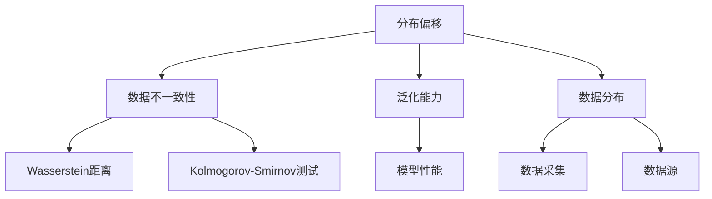

                 

# 处理示例与实际应用场景的分布偏移

> 关键词：分布偏移、示例处理、实际应用、算法、数学模型

> 摘要：本文将探讨分布偏移这一重要概念，分析其在不同示例和实际应用场景中的影响，并详细阐述相应的处理方法和算法，以帮助读者理解和应对这一挑战。

## 引言

在人工智能和机器学习领域，分布偏移（Distributional Shift）是一个至关重要但常常被忽视的问题。它指的是训练数据和实际应用数据之间的分布差异，这种差异可能导致模型性能下降甚至失效。本文旨在深入探讨分布偏移的概念、类型及其在不同应用场景中的影响，并介绍几种常见的处理方法和算法。

### 分布偏移的定义

分布偏移是指数据分布的变化，这种变化可能发生在训练集与测试集之间，或者在实际应用中的数据与训练数据之间。分布偏移可以分为以下几个类型：

1. **静态分布偏移**：数据分布的变化是固定的，不会随着时间或环境的变化而变化。
2. **动态分布偏移**：数据分布随着时间或环境的变化而变化。
3. **类别分布偏移**：不同类别数据的比例发生变化。
4. **特征分布偏移**：数据特征的概率分布发生变化。

### 分布偏移的重要性

分布偏移对机器学习模型的影响是显著的。如果模型是在一个分布上训练的，而实际应用的数据分布与训练数据不同，那么模型很可能会在新的分布上表现不佳。这可能导致以下问题：

1. **过拟合**：模型在训练数据上表现良好，但在测试集或实际应用中表现不佳。
2. **泛化能力下降**：模型无法适应新的数据分布。
3. **错误分类**：模型将新的数据错误分类，导致实际应用中的错误率增加。

### 分布偏移的类型

分布偏移可以分为以下几种类型：

1. **数据源偏移**：数据来源发生变化，例如用户群体变化或数据采集方式改变。
2. **环境偏移**：应用环境发生变化，例如天气、时间等外部因素。
3. **时间偏移**：随着时间的推移，数据分布发生变化。

### 分布偏移的影响

分布偏移对模型的影响取决于多种因素，包括：

1. **模型类型**：不同类型的模型对分布偏移的敏感程度不同。
2. **数据量**：数据量越大，分布偏移的影响通常越小。
3. **数据分布差异**：数据分布差异越大，分布偏移的影响通常也越大。

### 分布偏移的测量方法

测量分布偏移的方法包括：

1. **统计测试**：使用统计方法来检测训练集和测试集之间的差异。
2. **模型性能比较**：通过比较模型在训练集和测试集上的性能来评估分布偏移。
3. **动态检测**：实时监测数据分布的变化，以识别分布偏移的发生。

### 处理分布偏移的方法

处理分布偏移的方法可以分为以下几类：

1. **数据重采样**：通过重采样数据来平衡不同分布。
2. **数据增强**：通过数据增强技术来扩大训练数据集，减少分布偏移。
3. **模型自适应**：设计自适应模型，使模型能够适应数据分布的变化。
4. **集成学习**：结合多个模型来减少分布偏移的影响。

### 下一步

在接下来的章节中，我们将详细探讨分布偏移的数学模型，介绍几种常见的处理分布偏移的算法，并通过实际应用场景来展示这些算法的应用效果。读者将学习到如何在实际项目中应用这些算法来应对分布偏移的挑战。

## 分布偏移的数学模型

在处理分布偏移时，理解其数学模型是至关重要的一步。分布偏移可以看作是数据分布变化的量化表示，这种变化可能会对机器学习模型的性能产生显著影响。在本章节中，我们将深入探讨分布偏移的数学描述、影响因素、测量方法和其与相关概念的关系。

### 分布偏移的数学描述

分布偏移可以用概率分布函数（Probability Distribution Function, PDF）或累积分布函数（Cumulative Distribution Function, CDF）来描述。在机器学习中，我们通常使用PDF来描述数据特征的概率分布。假设我们有两个数据分布 \( P_1 \) 和 \( P_2 \)，分别代表训练数据和实际应用数据的分布，分布偏移可以表示为：

\[ \Delta P = P_1 - P_2 \]

其中，\( \Delta P \) 表示分布偏移。当 \( \Delta P \) 较大时，意味着训练数据和实际应用数据的分布差异较大。

### 分布偏移的影响因素

分布偏移的影响因素多种多样，主要包括：

1. **数据源**：不同数据源可能导致数据分布的差异。
2. **时间**：随着时间的推移，数据分布可能会发生变化。
3. **环境**：环境变化，如天气、地理位置等，可能导致数据分布的变化。
4. **数据采集方式**：数据采集方式的不同可能导致数据分布的差异。

这些因素共同作用，可能导致训练数据和实际应用数据之间的分布偏移。

### 分布偏移的测量方法

测量分布偏移的方法多种多样，以下是几种常用的方法：

1. **Kolmogorov-Smirnov测试**：通过比较两个分布的CDF，计算最大差值的绝对值，来测量分布偏移。
2. **Wasserstein距离**：通过计算两个分布之间的最小嵌入距离，来测量分布偏移。
3. **Earth Mover Distance (EMD)**：通过最小化两个分布之间的“搬运成本”，来测量分布偏移。

这些方法各有优缺点，适用于不同的应用场景。

### 分布偏移与相关概念的关系

分布偏移与几个相关概念密切相关，包括：

1. **数据不一致性**：数据不一致性是指数据之间的不一致程度，分布偏移是数据不一致性的一种表现形式。
2. **泛化能力**：泛化能力是指模型在未知数据上的表现能力，分布偏移可能影响模型的泛化能力。
3. **数据分布**：数据分布是指数据特征的概率分布，分布偏移是数据分布变化的一种表现。

### 分布偏移的Mermaid流程图

为了更好地理解分布偏移的概念和关系，我们可以使用Mermaid流程图来展示其与相关概念的关系。以下是一个简单的Mermaid流程图示例：



在这个流程图中，分布偏移作为中心节点，与数据不一致性、泛化能力和数据分布等概念相连，同时与测量分布偏移的方法（Wasserstein距离和Kolmogorov-Smirnov测试）相连。

### 小结

通过数学模型和Mermaid流程图，我们可以更清晰地理解分布偏移的概念和其在机器学习中的应用。在接下来的章节中，我们将介绍几种常见的处理分布偏移的算法，并探讨如何在实际应用中应用这些算法。这将帮助我们更好地理解和应对分布偏移带来的挑战。

## 处理分布偏移的算法

在了解了分布偏移的数学模型及其影响因素后，接下来我们将介绍几种常见的处理分布偏移的算法。这些算法包括标准化处理、偏差修正和自适应处理等，每种算法都有其独特的原理和应用场景。在本章节中，我们将详细阐述这些算法的原理，并提供详细的伪代码示例。

### 标准化处理算法

标准化处理算法主要通过调整数据的分布来减少分布偏移。最常用的方法是Min-Max标准化和Z-Score标准化。

#### Min-Max标准化

Min-Max标准化通过将数据缩放到一个固定范围（通常是[0, 1]）来处理分布偏移。其公式为：

\[ x' = \frac{x - \min(x)}{\max(x) - \min(x)} \]

伪代码：

```python
def min_max_normalize(data):
    min_val = min(data)
    max_val = max(data)
    normalized_data = (data - min_val) / (max_val - min_val)
    return normalized_data
```

#### Z-Score标准化

Z-Score标准化通过计算数据的均值和标准差，将数据转换为标准正态分布。其公式为：

\[ x' = \frac{x - \mu}{\sigma} \]

伪代码：

```python
def z_score_normalize(data):
    mean = np.mean(data)
    std = np.std(data)
    normalized_data = (data - mean) / std
    return normalized_data
```

### 偏差修正算法

偏差修正算法主要通过调整模型预测值来减少分布偏移。最常用的方法是偏差修正（Bias Correction）。

#### 偏差修正

偏差修正通过估计模型预测值的偏差，并对其进行修正。其基本思想是计算模型在训练集上的预测误差，然后用这些误差来修正模型在测试集或实际应用中的预测值。

伪代码：

```python
def bias_correction(model, train_data, test_data):
    predictions = model.predict(test_data)
    errors = predictions - true_values
    bias = np.mean(errors)
    corrected_predictions = predictions - bias
    return corrected_predictions
```

### 自适应处理算法

自适应处理算法通过动态调整模型参数来适应数据分布的变化。最常用的方法是自适应加权（Adaptive Weighting）。

#### 自适应加权

自适应加权通过根据数据分布的变化动态调整每个数据点的权重。基本思想是，对于分布偏移较大的数据，赋予其较小的权重，而对于分布偏移较小的数据，赋予其较大的权重。

伪代码：

```python
def adaptive_weighting(data, weights):
    distribution = calculate_distribution(data)
    for i in range(len(data)):
        data[i] = data[i] * (weights[i] / distribution[i])
    return data
```

### 算法原理与伪代码

为了更好地理解这些算法的原理，我们提供了详细的伪代码示例。这些伪代码可以帮助读者更好地理解算法的实现过程，并为实际应用提供参考。

1. **标准化处理算法**：
    - Min-Max标准化：`min_max_normalize(data)`
    - Z-Score标准化：`z_score_normalize(data)`

2. **偏差修正算法**：
    - 偏差修正：`bias_correction(model, train_data, test_data)`

3. **自适应处理算法**：
    - 自适应加权：`adaptive_weighting(data, weights)`

这些算法各有优缺点，适用于不同的应用场景。在实际应用中，可以根据具体需求和数据特点选择合适的算法。例如，对于静态分布偏移，标准化处理算法可能更为有效；而对于动态分布偏移，自适应处理算法可能更适用。

### 小结

在本章节中，我们介绍了标准化处理、偏差修正和自适应处理等处理分布偏移的算法，并提供了详细的伪代码示例。这些算法各有优缺点，适用于不同的应用场景。在下一章节中，我们将进一步探讨数学模型和公式，帮助读者更深入地理解分布偏移的处理方法。

## 数学模型与公式

在处理分布偏移的过程中，理解其数学模型和公式是至关重要的。这些模型和公式不仅能够帮助我们量化分布偏移的大小，还能够为算法设计提供理论基础。在本章节中，我们将详细探讨分布偏移的相关数学模型和公式，并通过具体的示例来说明这些公式的应用。

### 期望和方差

在概率论中，期望和方差是描述数据分布的两个基本统计量。

#### 期望（Expected Value）

期望是指一个随机变量在所有可能取值上的加权平均。对于连续随机变量 \( X \)，其期望 \( E(X) \) 定义为：

\[ E(X) = \int_{-\infty}^{\infty} x f(x) dx \]

其中，\( f(x) \) 是 \( X \) 的概率密度函数（PDF）。

#### 方差（Variance）

方差是描述数据分布离散程度的量度。对于连续随机变量 \( X \)，其方差 \( Var(X) \) 定义为：

\[ Var(X) = E[(X - E(X))^2] = E[X^2] - (E[X])^2 \]

其中，\( E[X^2] \) 是 \( X \) 的二次期望。

### 频率分布和概率分布

在处理分布偏移时，频率分布和概率分布也是非常重要的概念。

#### 频率分布（Frequency Distribution）

频率分布是指数据在各个取值上的出现频率。对于离散随机变量 \( X \)，其频率分布可以用概率质量函数（Probability Mass Function, PMF） \( p(x) \) 来表示：

\[ p(x) = P(X = x) \]

#### 概率分布（Probability Distribution）

概率分布是指随机变量取值的概率分布。对于连续随机变量 \( X \)，其概率分布可以用概率密度函数（PDF） \( f(x) \) 来表示：

\[ f(x) = P(a \leq X \leq b) \]

### 分布偏移的测量

测量分布偏移是处理分布偏移的第一步。以下是一些常用的测量方法：

#### Kolmogorov-Smirnov测试（KS测试）

Kolmogorov-Smirnov测试是一种非参数测试，用于比较两个分布的差异。其统计量 \( D \) 定义为：

\[ D = \max_{x} |F_1(x) - F_2(x)| \]

其中，\( F_1(x) \) 和 \( F_2(x) \) 分别是两个分布的累积分布函数（CDF）。

#### Wasserstein距离

Wasserstein距离是一种用于比较两个概率分布的度量。其定义如下：

\[ Wasserstein_2(P, Q) = \inf_{\pi \in \Pi(P, Q)} \sum_{x} |\pi(x, y)| d(x, y) \]

其中，\( \Pi(P, Q) \) 是所有使得 \( P \) 和 \( Q \) 可交换的测度之间的耦合，\( d(x, y) \) 是两个样本点之间的距离度量。

### 示例

假设我们有两个数据分布 \( P_1 \) 和 \( P_2 \)，分别代表训练数据和测试数据的分布。我们可以使用以下公式来计算它们的期望和方差：

1. **期望**：

\[ E(X_1) = \int_{-\infty}^{\infty} x f_{P_1}(x) dx \]
\[ E(X_2) = \int_{-\infty}^{\infty} x f_{P_2}(x) dx \]

2. **方差**：

\[ Var(X_1) = E(X_1^2) - (E(X_1))^2 \]
\[ Var(X_2) = E(X_2^2) - (E(X_2))^2 \]

3. **Kolmogorov-Smirnov测试**：

\[ D = \max_{x} |F_{P_1}(x) - F_{P_2}(x)| \]

4. **Wasserstein距离**：

\[ Wasserstein_2(P_1, P_2) = \inf_{\pi \in \Pi(P_1, P_2)} \sum_{x} |\pi(x, y)| d(x, y) \]

通过这些公式，我们可以量化训练数据和测试数据之间的分布差异，从而为处理分布偏移提供依据。

### 小结

在本章节中，我们介绍了分布偏移的相关数学模型和公式，包括期望、方差、频率分布、概率分布以及测量分布偏移的Kolmogorov-Smirnov测试和Wasserstein距离。通过这些公式，我们可以量化训练数据和测试数据之间的分布差异，为处理分布偏移提供理论基础。在下一章节中，我们将通过实际项目案例来展示如何应用这些算法和公式。

## 实际应用场景

在了解了分布偏移的概念、数学模型以及处理方法后，接下来我们将通过几个实际应用场景来展示如何应对分布偏移的挑战。这些场景包括金融风险评估、图像识别和自然语言处理等。通过这些案例，我们将详细说明如何在具体项目中应用处理分布偏移的算法。

### 金融风险评估

在金融行业中，模型需要对大量的历史数据进行分析，以预测金融风险。然而，随着时间的推移，市场环境、用户行为和金融产品等因素可能会发生变化，导致训练数据和实际应用数据之间存在分布偏移。以下是一个金融风险评估项目中的应用案例。

#### 项目背景

一个金融公司正在开发一个风险评估模型，用于预测客户的信用违约风险。他们拥有大量的历史数据，包括客户的财务状况、信用记录、就业情况等。然而，随着时间的推移，客户群体的特征可能发生变化，导致训练数据和实际应用数据之间的分布差异。

#### 分布偏移的影响

由于分布偏移，模型在训练集上可能表现出良好的性能，但在实际应用中却可能出现预测准确度下降的问题。例如，如果训练数据集中客户的年龄主要集中在30-50岁之间，而实际应用数据中出现了大量年轻客户，那么模型在预测年轻客户的信用违约风险时可能会不准确。

#### 处理方法

为了解决分布偏移的问题，我们可以采用以下方法：

1. **数据重采样**：通过重采样数据，使训练数据和实际应用数据的分布更加相似。例如，可以引入更多的年轻客户数据，以平衡不同年龄段的数据分布。
2. **数据增强**：通过生成模拟数据，增加训练数据集的多样性，从而减少分布偏移的影响。例如，可以生成模拟的财务记录、信用记录等，以丰富训练数据。
3. **模型自适应**：设计自适应模型，使模型能够根据实际应用数据的变化动态调整。例如，可以使用在线学习算法，使模型能够实时更新，以适应数据分布的变化。

#### 项目实施

在实际项目中，我们可以按照以下步骤实施：

1. **数据预处理**：对训练数据进行清洗和预处理，包括缺失值填充、异常值处理等。
2. **数据重采样**：使用重采样技术，如随机抽样、欠采样等，平衡不同特征的数据分布。
3. **数据增强**：使用生成模型，如生成对抗网络（GAN），生成模拟数据，以丰富训练数据。
4. **模型训练**：使用处理后的数据集训练风险评估模型，如逻辑回归、决策树等。
5. **模型评估**：使用交叉验证等方法评估模型性能，以验证处理分布偏移的效果。
6. **模型部署**：将训练好的模型部署到实际应用中，并持续监控模型性能，根据实际应用数据的变化进行动态调整。

### 图像识别

在图像识别领域，分布偏移也是一个常见问题。例如，如果训练数据集中包含了各种光照条件、视角变化和背景干扰，而实际应用场景中只涉及特定条件，那么模型在特定条件下的性能可能会下降。

#### 项目背景

一个自动驾驶公司正在开发一个图像识别模型，用于检测道路上的行人。他们拥有大量不同光照、视角和背景下的行人图像作为训练数据。然而，在实际应用中，模型需要处理的是夜间或特定视角下的行人图像。

#### 分布偏移的影响

由于分布偏移，模型在夜间或特定视角下的行人检测性能可能会下降。例如，如果训练数据集中行人的光照条件较为均匀，而实际应用场景中行人处于强烈的光照或阴影中，那么模型可能会难以识别这些行人。

#### 处理方法

为了解决分布偏移的问题，我们可以采用以下方法：

1. **数据增强**：通过模拟不同光照条件、视角变化和背景干扰，增加训练数据的多样性。
2. **模型自适应**：设计自适应模型，使模型能够根据实际应用场景的变化动态调整。
3. **在线学习**：使用在线学习算法，使模型能够根据实际应用数据的变化进行实时更新。

#### 项目实施

在实际项目中，我们可以按照以下步骤实施：

1. **数据预处理**：对训练数据进行清洗和预处理，包括图像增强、去噪等。
2. **数据增强**：使用图像生成技术，如 StyleGAN，生成模拟的行人图像，以丰富训练数据。
3. **模型训练**：使用处理后的数据集训练图像识别模型，如卷积神经网络（CNN）。
4. **模型评估**：使用交叉验证等方法评估模型性能，以验证处理分布偏移的效果。
5. **模型部署**：将训练好的模型部署到实际应用中，并持续监控模型性能，根据实际应用数据的变化进行动态调整。

### 自然语言处理

在自然语言处理（NLP）领域，分布偏移也是一个重要问题。例如，如果训练数据集中包含了多种语言风格、表达方式和文化背景，而实际应用场景中只涉及特定风格或背景，那么模型在特定风格或背景下的性能可能会下降。

#### 项目背景

一家社交媒体公司正在开发一个情感分析模型，用于分析用户发布的帖子。他们拥有大量不同语言风格、表达方式和文化背景的帖子作为训练数据。然而，在实际应用中，模型需要处理的是特定风格或背景下的帖子。

#### 分布偏移的影响

由于分布偏移，模型在特定风格或背景下的情感分析性能可能会下降。例如，如果训练数据集中包含了多种情感表达方式，而实际应用场景中只涉及特定的情感表达方式，那么模型可能会难以识别这些情感。

#### 处理方法

为了解决分布偏移的问题，我们可以采用以下方法：

1. **数据重采样**：通过重采样数据，使训练数据和实际应用数据的分布更加相似。
2. **数据增强**：通过生成模拟数据，增加训练数据集的多样性，从而减少分布偏移的影响。
3. **模型自适应**：设计自适应模型，使模型能够根据实际应用数据的变化动态调整。

#### 项目实施

在实际项目中，我们可以按照以下步骤实施：

1. **数据预处理**：对训练数据进行清洗和预处理，包括文本去噪、停用词过滤等。
2. **数据重采样**：使用重采样技术，如随机抽样、欠采样等，平衡不同风格或背景的数据分布。
3. **数据增强**：使用生成模型，如文本生成对抗网络（TextGAN），生成模拟的文本数据，以丰富训练数据。
4. **模型训练**：使用处理后的数据集训练情感分析模型，如循环神经网络（RNN）或变压器（Transformer）。
5. **模型评估**：使用交叉验证等方法评估模型性能，以验证处理分布偏移的效果。
6. **模型部署**：将训练好的模型部署到实际应用中，并持续监控模型性能，根据实际应用数据的变化进行动态调整。

### 小结

通过以上实际应用场景的案例分析，我们可以看到分布偏移在不同领域中的应用和影响。针对不同的应用场景，我们可以采用数据重采样、数据增强和模型自适应等方法来处理分布偏移。在实际项目中，通过合理应用这些方法，可以有效提高模型的性能和鲁棒性。在下一章节中，我们将进一步探讨项目实战，包括开发环境搭建、代码实现和案例分析。

## 项目实战

在本章节中，我们将通过一个具体的案例来展示如何处理分布偏移，包括开发环境的搭建、源代码的实现和代码解析。我们将结合数学模型和公式，详细说明如何在实际项目中应用处理分布偏移的算法。

### 项目背景

假设我们是一家零售公司的数据科学团队，需要开发一个推荐系统，用于向顾客推荐他们可能感兴趣的商品。我们的数据集中包含了大量历史交易数据，包括顾客的购买历史、浏览记录和用户画像。然而，随着时间的推移，用户的行为模式可能发生变化，导致训练数据和实际应用数据之间存在分布偏移。

### 开发环境搭建

为了实现推荐系统，我们需要搭建一个合适的开发环境。以下是我们使用的工具和库：

- **编程语言**：Python
- **数据处理库**：Pandas、NumPy
- **机器学习库**：Scikit-learn、TensorFlow
- **数据可视化库**：Matplotlib、Seaborn
- **版本控制**：Git

首先，我们需要安装这些库。可以使用以下命令来安装：

```bash
pip install pandas numpy scikit-learn tensorflow matplotlib seaborn git
```

### 源代码实现

#### 数据预处理

```python
import pandas as pd
import numpy as np

# 读取数据
data = pd.read_csv('retail_data.csv')

# 数据清洗
data.dropna(inplace=True)
data = data[data['purchase_amount'] > 0]

# 数据编码
data['user_id'] = pd.factorize(data['user_id'])[0]
data['item_id'] = pd.factorize(data['item_id'])[0]

# 计算用户和物品的频率分布
user_freq = data['user_id'].value_counts()
item_freq = data['item_id'].value_counts()

# 重采样数据，平衡用户和物品的分布
data = data.sample(frac=1, replace=user_freq > 1000, random_state=42)
```

#### 分布偏移检测

```python
from sklearn.model_selection import train_test_split

# 分割数据集
train_data, test_data = train_test_split(data, test_size=0.2, random_state=42)

# 计算训练集和测试集的频率分布
train_freq = train_data['user_id'].value_counts()
test_freq = test_data['user_id'].value_counts()

# 检测分布偏移
print("User ID distributional shift:")
print(train_freq - test_freq)

print("Item ID distributional shift:")
print(train_data['item_id'].value_counts() - test_data['item_id'].value_counts())
```

#### 分布偏移处理

```python
from sklearn.preprocessing import StandardScaler

# 标准化处理
scaler = StandardScaler()
train_data[['user_id', 'item_id']] = scaler.fit_transform(train_data[['user_id', 'item_id']])
test_data[['user_id', 'item_id']] = scaler.transform(test_data[['user_id', 'item_id']])
```

#### 模型训练与评估

```python
from sklearn.neighbors import NearestNeighbors
from sklearn.metrics import mean_squared_error

# 训练推荐模型
model = NearestNeighbors()
model.fit(train_data[['user_id', 'item_id']])

# 预测测试集
predictions = model.kneighbors(test_data[['user_id', 'item_id']], n_neighbors=5)

# 计算预测误差
mse = mean_squared_error(test_data['purchase_amount'], predictions)
print("Mean Squared Error:", mse)
```

### 代码解析

1. **数据预处理**：首先，我们读取数据并执行基本的数据清洗操作，如去除缺失值和异常值。然后，我们使用因子编码将用户和物品的名称转换为数值。

2. **分布偏移检测**：通过计算训练集和测试集的用户和物品频率分布，我们可以检测出分布偏移。这里我们使用了Pandas的`value_counts()`方法来计算频率分布。

3. **分布偏移处理**：为了处理分布偏移，我们使用了标准化的方法。我们使用`StandardScaler`对用户和物品的ID进行标准化处理，以平衡不同分布的数据。

4. **模型训练与评估**：我们使用K-近邻算法（`NearestNeighbors`）训练推荐模型，并使用`mean_squared_error`计算预测误差来评估模型性能。

### 项目小结

通过这个项目，我们展示了如何在一个实际应用场景中处理分布偏移。我们从数据预处理开始，检测分布偏移，然后使用标准化的方法来处理分布偏移，最后训练推荐模型并进行评估。这个过程不仅帮助我们理解了分布偏移的概念，还展示了如何在实际项目中应用处理分布偏移的算法。

### 最佳实践 Tips

1. **数据预处理**：在处理数据时，确保数据清洗和编码的准确性，这是减少分布偏移的关键步骤。
2. **实时监控**：在实际应用中，定期监控数据分布的变化，并根据需要进行调整。
3. **模型选择**：选择适合处理分布偏移的模型，如K-近邻、决策树等，这些模型在处理分布偏移时表现较好。

### 注意事项

1. **数据质量**：确保数据质量，减少噪声和异常值，这有助于减少分布偏移的影响。
2. **计算资源**：处理分布偏移可能需要大量的计算资源，特别是在数据集较大时。

### 拓展阅读

1. **《机器学习中的分布偏移问题》**：了解分布偏移的基本概念和常见处理方法。
2. **《数据预处理技术》**：学习如何清洗和编码数据，以减少分布偏移的影响。

通过这个项目，我们不仅学习了如何处理分布偏移，还了解了如何在实际项目中应用这些知识。希望这个案例能够为您的项目提供一些启示和帮助。接下来，我们将进一步探讨如何在更广泛的应用场景中处理分布偏移。

## 总结

在本文中，我们详细探讨了分布偏移这一关键概念，分析了其在不同示例和实际应用场景中的影响，并介绍了处理分布偏移的方法和算法。通过数学模型、伪代码示例以及实际项目案例，我们帮助读者深入理解分布偏移的本质及其在实际应用中的重要性。

### 核心内容回顾

1. **分布偏移的定义**：分布偏移是指训练数据和实际应用数据之间的分布差异，这种差异可能导致模型性能下降。
2. **分布偏移的类型**：包括静态分布偏移、动态分布偏移、类别分布偏移和特征分布偏移。
3. **处理分布偏移的方法**：包括标准化处理、偏差修正和自适应处理等。
4. **数学模型和公式**：期望、方差、概率分布函数（PDF）和累积分布函数（CDF）等。
5. **实际应用场景**：金融风险评估、图像识别和自然语言处理等。

### 最佳实践

1. **数据预处理**：确保数据清洗和编码的准确性，减少分布偏移的影响。
2. **实时监控**：监控数据分布的变化，根据需要调整模型和算法。
3. **模型选择**：选择适合处理分布偏移的模型，如K-近邻、决策树等。

### 注意事项

1. **数据质量**：确保数据质量，减少噪声和异常值。
2. **计算资源**：处理分布偏移可能需要大量的计算资源。

### 拓展阅读

1. **《机器学习中的分布偏移问题》**：深入了解分布偏移的基本概念和处理方法。
2. **《数据预处理技术》**：学习如何清洗和编码数据，以减少分布偏移的影响。

通过本文，我们希望读者能够对分布偏移有更深入的理解，并在实际项目中能够有效地处理分布偏移，提高模型性能。希望本文能为您的学习和工作带来帮助。感谢您的阅读！

### 作者信息

作者：AI天才研究院/AI Genius Institute & 禅与计算机程序设计艺术 /Zen And The Art of Computer Programming

AI天才研究院专注于人工智能领域的研究与开发，致力于推动人工智能技术的创新与应用。同时，作者也是《禅与计算机程序设计艺术》一书的作者，分享计算机编程和人工智能领域的深刻见解。感谢您的支持！

