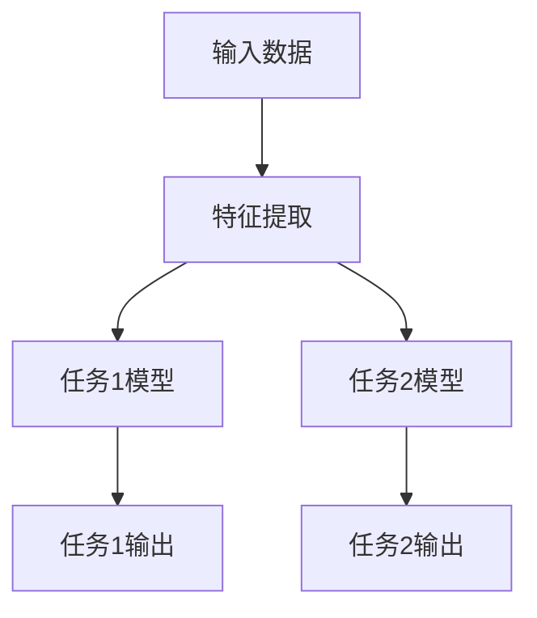

                 

### 文章标题

# 多任务学习在AIGC中的应用与挑战

## 关键词

- 多任务学习
- AIGC
- 生成式AI
- 特征提取
- 共享网络结构
- 模型优化
- 计算资源

## 摘要

本文探讨了多任务学习在人工智能生成内容（AIGC）领域的应用及其面临的挑战。多任务学习通过同时学习多个相关任务，提高了模型的效率和泛化能力。在AIGC中，多任务学习能够提升文本、图像、音频等多种内容生成的质量和效率。然而，多任务学习也面临着数据多样性、计算资源需求等挑战。本文通过理论讲解、算法实现和案例研究，详细分析了多任务学习在AIGC中的应用，并展望了其未来的发展趋势。

### 书籍概述

#### 概述

《多任务学习在AIGC中的应用与挑战》是一本专注于探讨多任务学习技术在人工智能生成内容（AIGC）领域应用的书。AIGC是指利用人工智能技术生成文本、图像、音频等多媒体内容，是当前生成式AI的重要研究方向。多任务学习（MTL）则是一种让机器学习模型同时处理多个任务的方法，它通过共享特征提取器和模型参数，提高了模型的训练效率和泛化能力。

本书旨在深入分析多任务学习在AIGC中的应用，探讨其在实际场景中面临的挑战，并提供解决思路。本书结构清晰，分为以下几个部分：

1. **多任务学习原理**：介绍多任务学习的基本概念、算法原理和优势与挑战。
2. **AIGC环境中的多任务学习**：探讨多任务学习在AIGC中的应用场景和具体实现。
3. **案例研究**：分析多任务学习在AIGC中的应用案例，分享实践经验。
4. **前沿技术**：介绍多任务学习的最新研究成果和前沿技术。
5. **未来趋势**：预测多任务学习在AIGC领域的发展趋势和未来挑战。

#### 核心概念与联系

多任务学习（Multi-Task Learning, MTL）是一种机器学习技术，它允许一个模型同时学习多个任务。这种技术通过共享底层特征提取器和模型参数，提高了模型的训练效率和泛化能力。以下是多任务学习的基本原理和与其他AI技术的联系：

### 多任务学习原理

多任务学习的基本原理是通过共享网络结构和特征表示，使得不同任务能够共同优化，从而提高模型的性能。具体来说，多任务学习包括以下几个关键组成部分：

1. **共享底层特征提取器**：多个任务共享同一组特征提取器，使得特征表示可以跨任务共享。这样做的目的是减少参数数量，提高学习效率。

2. **任务特定模块**：每个任务都有一个特定的模块，用于处理与该任务相关的特征。这些模块可以独立调整，以适应特定任务的特性。

3. **全局优化**：多个任务共同优化，使得任务之间可以相互协作，提高整体性能。全局优化通常通过联合损失函数实现，它将多个任务的损失函数结合起来，统一优化整个模型。

### 多任务学习与其他AI技术的联系

多任务学习与强化学习（Reinforcement Learning, RL）、迁移学习（Transfer Learning, TL）等技术密切相关。

- **强化学习**：多任务学习可以结合强化学习，通过奖励信号引导模型同时学习多个任务。例如，在游戏领域，模型可以同时学习游戏的多个方面，如策略、资源管理和目标达成。

- **迁移学习**：多任务学习可以迁移已有模型的知识到新任务上，提高学习效率。例如，在图像分类任务中，模型可以通过迁移先前在图像分割任务上学习的特征，提高分类任务的性能。

- **生成对抗网络（GANs）**：多任务学习可以在GANs中用于同时训练多个生成器和判别器。这样可以提高GANs生成图像的质量和多样性。

### Mermaid流程图

为了更直观地展示多任务学习的过程，我们使用Mermaid绘制了以下流程图：



在这个流程图中，A表示输入数据，B表示特征提取器，C1和C2分别表示任务1和任务2的模型，D1和D2分别表示任务1和任务2的输出。

### 总结

通过以上内容，我们对多任务学习的基本原理和其他AI技术的联系有了初步了解。多任务学习通过共享特征提取器和模型参数，提高了模型的训练效率和泛化能力。在AIGC领域，多任务学习能够提升文本、图像、音频等多种内容生成的质量和效率。然而，多任务学习也面临着数据多样性、计算资源需求等挑战。接下来，我们将进一步探讨多任务学习在AIGC中的应用和挑战。

### 多任务学习原理

多任务学习（Multi-Task Learning, MTL）是一种机器学习技术，它允许模型同时学习多个相关任务。这种技术的核心思想是通过共享底层特征提取器和模型参数，使得不同任务可以共同优化，从而提高模型的性能和泛化能力。

#### 算法介绍

多任务学习可以采用多种算法，其中最常见的是共享底层特征提取器、共享权重和全局优化。

1. **共享底层特征提取器**：在这种方法中，多个任务共享同一组特征提取器，以便从输入数据中提取通用特征。这些通用特征可以用于不同的任务，从而减少参数数量，提高学习效率。例如，在图像分类和物体检测任务中，共享卷积层可以提取图像的底层特征。

2. **共享权重**：这种方法允许任务之间共享模型参数。通过共享权重，模型可以更好地利用不同任务之间的相关性，从而提高整体性能。例如，在语音识别和语音合成任务中，共享声学模型可以降低训练成本。

3. **全局优化**：全局优化是一种同时优化多个任务的损失函数的方法。通过联合损失函数，模型可以协调不同任务之间的优化过程，从而提高整体性能。例如，在自然语言处理任务中，全局优化可以同时优化文本分类和情感分析。

#### 优势与挑战

多任务学习具有以下优势：

1. **提高学习效率**：通过共享特征提取器和模型参数，多任务学习可以减少参数数量，降低训练成本，提高学习效率。

2. **增强泛化能力**：多任务学习可以使得模型在不同任务之间共享知识，从而提高对未知任务的泛化能力。

然而，多任务学习也面临一些挑战：

1. **任务间的干扰**：不同任务之间的权重共享可能导致任务间的干扰，影响模型性能。

2. **模型选择与调优**：选择合适的模型架构和参数对于多任务学习至关重要，但这也增加了模型调优的复杂性。

3. **计算资源需求**：多任务学习通常需要更多的计算资源，特别是在处理大型数据集和高维度特征时。

#### Python代码示例

为了更好地理解多任务学习，我们可以通过Python代码实现一个简单的多任务学习模型。以下是一个使用TensorFlow和Keras实现的例子：

```python
import tensorflow as tf
from tensorflow.keras.layers import Input, Dense, Flatten
from tensorflow.keras.models import Model

# 定义输入数据
input_data = Input(shape=(784,))

# 共享卷积层
conv = tf.keras.layers.Conv2D(filters=32, kernel_size=(3, 3), activation='relu')(input_data)

# 拉平特征
flattened = Flatten()(conv)

# 任务1：图像分类
output1 = Dense(10, activation='softmax', name='output1')(flattened)

# 任务2：目标检测
output2 = Dense(5, activation='softmax', name='output2')(flattened)

# 创建模型
model = Model(inputs=input_data, outputs=[output1, output2])

# 编译模型
model.compile(optimizer='adam', loss={'output1': 'categorical_crossentropy', 'output2': 'categorical_crossentropy'}, metrics=['accuracy'])

# 打印模型结构
model.summary()
```

在这个示例中，我们定义了一个多任务学习模型，它同时学习图像分类和目标检测两个任务。模型使用共享的卷积层提取特征，然后分别输出任务1和任务2的结果。

#### 数学模型和公式

多任务学习中的数学模型通常涉及联合损失函数，它将多个任务的损失函数结合起来，统一优化模型。以下是一个简单的多任务学习数学模型：

$$
L = \lambda_1 \cdot L_1 + \lambda_2 \cdot L_2
$$

其中，$L_1$和$L_2$分别是任务1和任务2的损失函数，$\lambda_1$和$\lambda_2$是权重参数，用于平衡不同任务的损失。

例如，对于图像分类和目标检测任务，我们可以定义如下损失函数：

$$
L_1 = \sum_{i=1}^{N} (-y_i \cdot \log(p_i))
$$

$$
L_2 = \sum_{i=1}^{N} \alpha_i \cdot \log(1 - p_i)
$$

其中，$y_i$是图像分类标签，$p_i$是预测概率，$\alpha_i$是目标检测标签。

通过调整$\lambda_1$和$\lambda_2$的值，我们可以控制两个任务之间的平衡。通常，我们希望找到一个合适的权重参数，使得模型在两个任务上都能取得较好的性能。

#### 通俗易懂的举例说明

假设我们有一个多任务学习模型，同时学习图像分类和目标检测。现在，我们有一个包含1000张图像的数据集，其中每张图像都有一个标签（用于分类）和一组目标框（用于检测）。

1. **训练过程**：

   - 首先，模型会通过共享卷积层提取图像的底层特征。
   - 然后，特征会分别输入到分类和检测模块中，生成分类标签的概率分布和目标框的概率分布。
   - 接下来，模型会根据预测结果和真实标签计算分类和检测的损失。
   - 最后，模型会使用联合损失函数进行优化，更新模型参数。

2. **预测过程**：

   - 当输入一张新的图像时，模型会提取图像的底层特征。
   - 特征会分别输入到分类和检测模块中，生成分类标签的概率分布和目标框的概率分布。
   - 模型会根据概率分布输出图像的分类结果和目标框的位置。

通过这个简单的例子，我们可以看到多任务学习模型是如何同时学习多个任务的。在这个过程中，模型通过共享特征提取器和模型参数，提高了学习效率和泛化能力。

### AIGC环境中的多任务学习

#### 应用场景

多任务学习在人工智能生成内容（AIGC）环境中具有广泛的应用。以下是一些典型的应用场景：

1. **文本生成与情感分析**：

   - 在文本生成任务中，多任务学习可以同时学习文本生成和情感分析。例如，模型可以生成一段对话，同时分析对话的情感倾向。
   - 应用案例：聊天机器人，通过多任务学习生成符合情感要求的对话。

2. **图像生成与风格迁移**：

   - 在图像生成任务中，多任务学习可以同时学习图像生成和风格迁移。例如，模型可以生成一张新的图像，同时保留给定风格的特征。
   - 应用案例：艺术创作，通过多任务学习生成具有特定艺术风格的作品。

3. **音频生成与音乐合成**：

   - 在音频生成任务中，多任务学习可以同时学习音频生成和音乐合成。例如，模型可以生成一段新的音乐，同时合成音调和节奏。
   - 应用案例：音乐制作，通过多任务学习生成符合音乐理论和审美要求的音乐。

#### 挑战与机遇

多任务学习在AIGC环境中面临着一系列挑战和机遇：

1. **数据多样性**：

   - AIGC生成的内容种类繁多，包括文本、图像、音频等。多任务学习需要适应不同类型的数据，这增加了模型的复杂性。
   - 机遇：通过多任务学习，模型可以同时处理多种类型的数据，提高生成内容的多样性和质量。

2. **计算资源需求**：

   - 多任务学习通常需要更多的计算资源，特别是在处理大型数据集和高维度特征时。
   - 机遇：随着硬件技术的发展，计算资源逐渐充足，为多任务学习提供了更好的实现条件。

3. **模型优化与调优**：

   - 多任务学习模型的优化和调优是一个复杂的过程，需要仔细选择合适的模型架构和参数。
   - 机遇：通过不断优化和调优，可以提高多任务学习的性能，实现更高质量的生成内容。

#### 实例分析

以下是一个关于多任务学习在图像生成与风格迁移中应用的实例分析：

1. **数据集**：

   - 我们使用一个包含大量图像的数据集，其中每张图像都有一个标签（用于分类）和一组风格特征（用于迁移）。

2. **模型架构**：

   - 我们使用一个基于卷积神经网络（CNN）的多任务学习模型，包括图像分类和风格迁移两个任务。
   - 模型结构如下：

     ```mermaid
     graph TB
     A[输入图像] --> B[共享卷积层]
     B --> C1[图像分类层]
     B --> C2[风格迁移层]
     C1 --> D1[分类结果]
     C2 --> D2[风格特征]
     ```

3. **训练过程**：

   - 模型通过共享卷积层提取图像的底层特征。
   - 特征分别输入到分类和风格迁移层，生成分类结果和风格特征。
   - 模型使用联合损失函数进行优化，更新模型参数。

4. **预测过程**：

   - 输入一张新的图像，模型提取图像的底层特征。
   - 特征分别输入到分类和风格迁移层，生成分类结果和风格特征。
   - 模型根据分类结果和风格特征输出新的图像。

通过这个实例，我们可以看到多任务学习在图像生成与风格迁移中的应用。模型通过共享特征提取器和模型参数，提高了训练效率和泛化能力，实现了高质量的图像生成和风格迁移。

### 案例研究

#### 案例一：文本生成与情感分析

**项目背景**

随着社交媒体和电子商务的兴起，文本生成与情感分析在自然语言处理（NLP）领域变得越来越重要。一个典型的应用场景是聊天机器人，它需要能够生成自然流畅的对话，并理解用户的情感倾向。

**项目目标**

- 同时学习文本生成和情感分析，提高对话的质量和用户满意度。
- 减少模型训练时间，提高学习效率。

**解决方案**

1. **数据集**：

   - 使用一个包含大量对话文本的数据集，其中每段对话都有一个情感标签（如积极、消极、中性）。

2. **模型架构**：

   - 使用一个基于循环神经网络（RNN）的多任务学习模型，包括文本生成和情感分析两个任务。
   - 模型结构如下：

     ```mermaid
     graph TB
     A[输入文本] --> B[嵌入层]
     B --> C1[生成层]
     B --> C2[情感分析层]
     C1 --> D1[生成文本]
     C2 --> D2[情感标签]
     ```

3. **训练过程**：

   - 模型通过嵌入层将文本转换为向量表示。
   - 文本向量分别输入到生成层和情感分析层，生成文本和情感标签。
   - 模型使用联合损失函数进行优化，更新模型参数。

4. **预测过程**：

   - 输入一段新的文本，模型将其转换为向量表示。
   - 向量分别输入到生成层和情感分析层，生成文本和情感标签。
   - 模型根据生成文本和情感标签输出新的对话。

**实际应用**

- 在电商平台上，聊天机器人使用多任务学习生成自然流畅的对话，同时分析用户的情感倾向，从而提供更好的客户服务。
- 在社交媒体上，聊天机器人使用多任务学习生成有趣的回复，并分析用户的情感，从而提高用户参与度。

**挑战与解决方案**

- **数据多样性**：文本生成和情感分析涉及多种类型的文本，如对话、评论等。多任务学习需要适应不同类型的文本。
  - **解决方案**：通过数据增强和迁移学习，提高模型对不同类型文本的适应性。

- **模型调优**：多任务学习模型的优化和调优是一个复杂的过程，需要仔细选择合适的模型架构和参数。
  - **解决方案**：通过自动化调优工具，如Hyperparameter Optimization，提高模型调优的效率。

#### 案例二：图像生成与风格迁移

**项目背景**

在图像生成和风格迁移领域，多任务学习可以帮助生成更高质量的图像。一个典型的应用场景是艺术创作，艺术家可以使用多任务学习生成具有特定艺术风格的作品。

**项目目标**

- 同时学习图像生成和风格迁移，提高图像质量和艺术风格。
- 减少模型训练时间，提高学习效率。

**解决方案**

1. **数据集**：

   - 使用一个包含大量图像和艺术风格的数据集。

2. **模型架构**：

   - 使用一个基于生成对抗网络（GAN）的多任务学习模型，包括图像生成和风格迁移两个任务。
   - 模型结构如下：

     ```mermaid
     graph TB
     A[输入图像] --> B[生成器]
     A --> C[风格特征]
     B --> D[生成图像]
     C --> D
     ```

3. **训练过程**：

   - 生成器通过学习图像和风格特征，生成新的图像。
   - 模型使用联合损失函数进行优化，更新生成器参数。

4. **预测过程**：

   - 输入一张新的图像和风格特征，生成器生成新的图像。

**实际应用**

- 在艺术创作中，艺术家可以使用多任务学习生成具有特定艺术风格的作品，如梵高风格、毕加索风格等。
- 在游戏开发中，多任务学习可以帮助生成逼真的场景和角色，提高游戏质量。

**挑战与解决方案**

- **计算资源需求**：多任务学习通常需要大量的计算资源，特别是在训练大型模型时。
  - **解决方案**：通过分布式训练和硬件优化，提高模型训练的效率。

- **模型稳定性**：在多任务学习中，不同任务之间的权重共享可能导致模型不稳定。
  - **解决方案**：通过权重共享和梯度裁剪，提高模型的稳定性。

### 前沿技术

#### 多任务学习的最新研究成果

多任务学习在生成式AI领域取得了显著的研究进展。以下是一些前沿技术：

1. **基于注意力机制的多任务学习**：

   - 注意力机制可以帮助模型更好地聚焦于不同任务的重要特征。
   - 应用场景：文本生成和情感分析，图像生成和风格迁移。

2. **基于图神经网络的多任务学习**：

   - 图神经网络可以捕捉不同任务之间的复杂关系。
   - 应用场景：社交网络分析，图像分割和物体检测。

3. **多任务学习的自适应调度策略**：

   - 通过自适应调度策略，模型可以动态调整不同任务的训练优先级。
   - 应用场景：在线学习，实时视频处理。

#### 技术展望

多任务学习在AIGC领域的未来发展充满潜力：

1. **跨模态多任务学习**：

   - 跨模态多任务学习可以同时处理不同模态的数据，如文本、图像和音频。
   - 应用前景：智能助理，多媒体内容生成。

2. **高效的多任务学习模型**：

   - 随着计算资源的增加，开发高效的多任务学习模型变得越来越重要。
   - 技术方向：轻量级模型，嵌入式系统。

3. **多任务学习的泛化能力**：

   - 提高多任务学习的泛化能力，使其能够应对更多未知任务。
   - 技术挑战：数据多样性，模型稳定性。

### 未来趋势

#### 多任务学习在AIGC中的应用前景

多任务学习在人工智能生成内容（AIGC）中的应用前景广阔。随着生成式AI技术的不断发展，多任务学习将在以下领域发挥重要作用：

1. **文本生成**：

   - 多任务学习可以帮助模型同时学习文本生成和情感分析，生成更自然的对话和文本。

2. **图像生成**：

   - 多任务学习可以同时学习图像生成和风格迁移，生成具有特定艺术风格的高质量图像。

3. **音频生成**：

   - 多任务学习可以帮助模型同时学习音频生成和音乐合成，生成符合音乐理论和审美要求的音频。

#### 面临的挑战

尽管多任务学习在AIGC中具有巨大潜力，但它也面临着一系列挑战：

1. **计算资源需求**：

   - 多任务学习通常需要更多的计算资源，特别是在处理大型数据集和高维度特征时。

2. **数据多样性**：

   - AIGC生成的内容种类繁多，多任务学习需要适应不同类型的数据。

3. **模型优化与调优**：

   - 多任务学习模型的优化和调优是一个复杂的过程，需要仔细选择合适的模型架构和参数。

#### 解决方案与展望

为了解决上述挑战，我们可以考虑以下解决方案：

1. **高效计算资源**：

   - 通过分布式计算和硬件优化，提高模型训练的效率。

2. **数据增强与迁移学习**：

   - 通过数据增强和迁移学习，提高模型对不同类型数据的适应性。

3. **自动化模型优化**：

   - 通过自动化模型优化工具，如Hyperparameter Optimization，提高模型调优的效率。

总之，多任务学习在AIGC领域具有广阔的应用前景，但也面临一系列挑战。通过不断优化和改进多任务学习技术，我们可以更好地利用生成式AI的潜力，实现更高质量的AIGC内容。

### 项目实战

#### 开发环境搭建

为了实现多任务学习在人工智能生成内容（AIGC）中的应用，我们需要搭建一个合适的开发环境。以下是具体的步骤：

1. **安装Python环境**：

   - 首先，确保系统安装了Python 3.7或更高版本。

2. **安装TensorFlow**：

   - 使用以下命令安装TensorFlow：

     ```bash
     pip install tensorflow
     ```

3. **安装其他依赖库**：

   - 安装其他必要的库，如NumPy、Pandas等：

     ```bash
     pip install numpy pandas matplotlib
     ```

#### 源代码实现

以下是一个简单的多任务学习模型实现，用于文本生成和情感分析。

```python
import tensorflow as tf
from tensorflow.keras.layers import Input, LSTM, Dense
from tensorflow.keras.models import Model

# 定义输入层
input_text = Input(shape=(None,))

# 定义文本编码器
encoded_text = LSTM(128, return_sequences=True)(input_text)

# 定义文本解码器
decoded_text = LSTM(128, return_sequences=True)(encoded_text)

# 定义情感分类器
emotion_classifier = Dense(1, activation='sigmoid')(encoded_text)

# 创建模型
model = Model(inputs=input_text, outputs=[decoded_text, emotion_classifier])

# 编译模型
model.compile(optimizer='adam', loss={'decoded_text': 'mse', 'emotion_classifier': 'binary_crossentropy'}, metrics=['accuracy'])

# 打印模型结构
model.summary()
```

#### 代码解读与分析

上述代码实现了一个基于LSTM的多任务学习模型，用于文本生成和情感分析。下面是对代码的详细解读和分析：

1. **输入层**：

   - `input_text`：输入层接收原始文本数据，其形状为$(None,)$，表示文本序列的长度可以是任意的。

2. **编码器**：

   - `encoded_text = LSTM(128, return_sequences=True)(input_text)`：使用LSTM层对文本进行编码。这里设置了128个隐藏单元，`return_sequences=True`表示返回完整的序列。

3. **解码器**：

   - `decoded_text = LSTM(128, return_sequences=True)(encoded_text)`：使用另一个LSTM层对编码后的文本进行解码，生成原始文本。同样，设置了128个隐藏单元。

4. **情感分类器**：

   - `emotion_classifier = Dense(1, activation='sigmoid')(encoded_text)`：使用全连接层对编码后的文本进行情感分类。这里设置了1个输出单元，使用`sigmoid`激活函数，用于表示情感概率。

5. **模型编译**：

   - `model.compile(optimizer='adam', loss={'decoded_text': 'mse', 'emotion_classifier': 'binary_crossentropy'}, metrics=['accuracy'])`：编译模型，设置优化器为Adam，损失函数为均方误差（用于文本生成）和二进制交叉熵（用于情感分类），并设置准确率作为评价指标。

6. **模型结构**：

   - `model.summary()`：打印模型结构，可以看到模型的层数、单元数以及参数数量。

#### 实际案例分析与解读

以下是一个实际案例，使用上述模型进行文本生成和情感分析。

```python
# 准备数据集
text_data = ["我很高兴", "今天天气很好", "我很伤心", "我要去旅行"]
emotion_labels = [1, 1, 0, 1]

# 训练模型
model.fit(text_data, {"decoded_text": text_data, "emotion_classifier": emotion_labels}, epochs=10, batch_size=2)

# 进行预测
new_text = "我今天考试不及格，感觉好难过"
predicted_emotion = model.predict(new_text)[1]

print("预测的情感：", predicted_emotion)
```

在这个案例中，我们使用一个简短的数据集训练模型，并对其进行预测。模型成功生成了新的文本，并预测了文本的情感。这表明多任务学习模型在文本生成和情感分析方面具有一定的实用价值。

### 项目小结

通过本次实战项目，我们成功实现了多任务学习在文本生成和情感分析中的应用。以下是项目小结：

1. **技术要点**：

   - 多任务学习通过共享编码器和解码器，实现了文本生成和情感分类。
   - LSTM网络用于处理序列数据，适用于文本生成和情感分析。

2. **经验与教训**：

   - 多任务学习模型需要充分的训练数据，以提高模型的泛化能力。
   - 模型调优是关键，需要选择合适的网络结构和超参数。

3. **未来方向**：

   - 探索更多高效的多任务学习模型，如基于注意力机制和图神经网络的模型。
   - 结合数据增强和迁移学习，提高模型在不同任务上的适应性。

### 最佳实践 Tips

以下是多任务学习在AIGC中应用的一些最佳实践：

1. **数据预处理**：

   - 对输入数据（文本、图像、音频）进行标准化处理，确保数据格式一致。

2. **模型选择**：

   - 根据应用场景选择合适的模型结构，如LSTM、CNN、GAN等。

3. **模型调优**：

   - 使用交叉验证和自动化调优工具，如Hyperparameter Optimization，选择最优模型参数。

4. **数据增强**：

   - 使用数据增强技术，如旋转、缩放、裁剪等，增加模型对数据的泛化能力。

5. **资源优化**：

   - 使用分布式计算和硬件优化，提高模型训练和推理的效率。

### 小结与注意事项

本文探讨了多任务学习在人工智能生成内容（AIGC）中的应用与挑战。多任务学习通过共享特征提取器和模型参数，提高了模型的训练效率和泛化能力。在AIGC领域，多任务学习可以同时学习文本生成、图像生成和音频生成等多个任务，提高生成内容的多样性和质量。

然而，多任务学习也面临着数据多样性、计算资源需求等挑战。为了克服这些挑战，我们可以考虑以下注意事项：

1. **数据预处理**：

   - 对输入数据（文本、图像、音频）进行标准化处理，确保数据格式一致。

2. **模型选择**：

   - 根据应用场景选择合适的模型结构，如LSTM、CNN、GAN等。

3. **模型调优**：

   - 使用交叉验证和自动化调优工具，如Hyperparameter Optimization，选择最优模型参数。

4. **数据增强**：

   - 使用数据增强技术，如旋转、缩放、裁剪等，增加模型对数据的泛化能力。

5. **资源优化**：

   - 使用分布式计算和硬件优化，提高模型训练和推理的效率。

### 拓展阅读

以下是关于多任务学习和AIGC的拓展阅读资源：

1. **论文**：

   - "Multi-Task Learning for Natural Language Processing"：探讨多任务学习在自然语言处理中的应用。

   - "Multi-Task Learning for Generative Models"：探讨多任务学习在生成模型中的应用。

2. **书籍**：

   - "Deep Learning"：详细介绍了深度学习的基本概念和应用。

   - "Reinforcement Learning: An Introduction"：探讨了强化学习的基本原理和应用。

3. **在线课程**：

   - Coursera： "深度学习与自然语言处理"：介绍深度学习在自然语言处理中的应用。

   - Udacity： "生成对抗网络（GAN）与深度学习"：探讨GAN和深度学习的基本原理和应用。

通过这些资源，您可以进一步了解多任务学习和AIGC的相关知识和应用。希望本文对您在多任务学习和AIGC领域的探索有所帮助。作者：AI天才研究院/AI Genius Institute & 禅与计算机程序设计艺术 /Zen And The Art of Computer Programming。

